# 京东商智 - 详细设计文档

> 版本：v1.0  
> 日期：2026-06-04  
> 状态：基础支撑层（M0-M3）待确认

---

## 一、文档概述

### 1.1 编写目的

本文档基于《概要设计文档 v1.0》编写，在概要设计模块划分的基础上，*对每个模块进行类/接口级别的详细设计，包括：*
- 核心类与接口定义
- 方法签名、输入输出参数
- 模块内部组件关系（Mermaid 类图）
- 关键交互流程（Mermaid 时序图）
- 状态流转（Mermaid 状态图）

### 1.2 设计原则

- **模块独立性**：各模块通过明确定义的接口交互，内部实现对外透明
- **可测试性**：每个模块可独立进行单元测试，依赖通过注入方式解耦
- **接口契约化**：所有跨模块交互通过 TypeScript 接口定义，确保类型安全

### 1.3 交付计划

| 批次  | 模块           | 状态  |
| --- | ------------ | --- |
| 第一批 | M0~M3 基础支撑层  | 本文档 |
| 第二批 | M4~M11 核心业务层 | 待确认 |
| 第三批 | M12 数据导出中心   | 待确认 |

---

## 二、M0 认证与权限模块

### 2.1 模块概述

负责用户身份认证、Token 生命周期管理、RBAC 权限校验。是系统的安全入口，所有其他模块依赖其认证结果。

### 2.2 核心接口定义

#### 2.2.1 类型定义

```typescript
// 用户信息
interface UserInfo {
  id: string;
  username: string;
  nickname: string;
  email: string;
  phone: string;
  roles: RoleInfo[];
  permissions: string[];
  dataScope: DataScope;
  avatar?: string;
}

// 角色信息
interface RoleInfo {
  id: string;
  name: string;
  code: string;
  dataScope: DataScope;
}

// 数据权限范围
type DataScope = 'all' | 'shop' | 'self';

// Token 对
interface TokenPair {
  accessToken: string;
  refreshToken: string;
  expiresIn: number;      // Access Token 有效期（秒）
  refreshExpiresIn: number; // Refresh Token 有效期（秒）
}

// 登录参数
interface LoginParams {
  username: string;
  password: string;
  captchaId?: string;
  captchaCode?: string;
}

// 注册参数
interface RegisterParams {
  username: string;
  password: string;
  email: string;
  phone?: string;
  captchaId: string;
  captchaCode: string;
}

// 验证码响应
interface CaptchaResponse {
  captchaId: string;
  imageBase64: string;
  expiresIn: number;
}

// 权限树节点
interface PermissionTreeNode {
  id: string;
  code: string;
  name: string;
  type: 'menu' | 'button' | 'api';
  path?: string;
  children: PermissionTreeNode[];
}
```

#### 2.2.2 API 接口函数

```typescript
// api/auth.ts

// 登录
function login(params: LoginParams): Promise<TokenPair>;

// 登出
function logout(): Promise<void>;

// 注册
function register(params: RegisterParams): Promise<void>;

// 刷新 Token
function refreshToken(token: string): Promise<TokenPair>;

// 获取验证码
function getCaptcha(): Promise<CaptchaResponse>;

// 获取当前用户信息
function getCurrentUser(): Promise<UserInfo>;

// 获取权限树
function getPermissionTree(): Promise<PermissionTreeNode[]>;

// 修改密码
function changePassword(params: {
  oldPassword: string;
  newPassword: string;
}): Promise<void>;

// 获取登录日志
function getLoginLog(params: {
  page: number;
  pageSize: number;
}): Promise<PaginatedResponse<LoginLog>>;

interface LoginLog {
  id: string;
  loginTime: string;
  ip: string;
  location: string;
  userAgent: string;
  status: 'success' | 'failed';
  reason?: string;
}
```

### 2.3 Zustand Store 设计

#### authStore

```typescript
// store/authStore.ts

interface AuthState {
  // 状态
  isAuthenticated: boolean;
  accessToken: string | null;
  refreshToken: string | null;
  tokenExpiresAt: number | null;       // Access Token 过期时间戳
  refreshExpiresAt: number | null;     // Refresh Token 过期时间戳
  user: UserInfo | null;
  permissions: string[];
  permissionTree: PermissionTreeNode[];

  // 加载状态
  isLoading: boolean;
  isRefreshing: boolean;

  // Actions
  login: (params: LoginParams) => Promise<void>;
  logout: () => Promise<void>;
  register: (params: RegisterParams) => Promise<void>;
  refreshAccessToken: () => Promise<boolean>;
  fetchUserInfo: () => Promise<void>;
  fetchPermissionTree: () => Promise<void>;
  initializeAuth: () => Promise<void>;     // 应用启动时恢复认证状态
}
```

**状态初始化流程**：

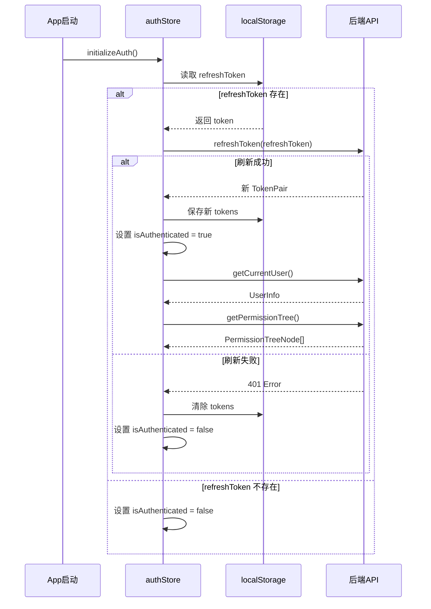
```mermaid
sequenceDiagram
    participant App as App启动
    participant Store as authStore
    participant Storage as localStorage
    participant API as 后端API

    App->>Store: initializeAuth()
    Store->>Storage: 读取 refreshToken
    alt refreshToken 存在
        Storage-->>Store: 返回 token
        Store->>API: refreshToken(refreshToken)
        alt 刷新成功
            API-->>Store: 新 TokenPair
            Store->>Storage: 保存新 tokens
            Store->>Store: 设置 isAuthenticated = true
            Store->>API: getCurrentUser()
            API-->>Store: UserInfo
            Store->>API: getPermissionTree()
            API-->>Store: PermissionTreeNode[]
        else 刷新失败
            API-->>Store: 401 Error
            Store->>Storage: 清除 tokens
            Store->>Store: 设置 isAuthenticated = false
        end
    else refreshToken 不存在
        Store->>Store: 设置 isAuthenticated = false
    end
```

#### authActions（Action 层独立拆分）

为便于测试，将认证相关逻辑抽取为独立 action 文件：

```typescript
// store/auth/actions.ts

async function handleLogin(state: AuthState, params: LoginParams): Promise<void> {
  // 1. 调用登录 API
  // 2. 存储 Token 到内存 + localStorage
  // 3. 设置 isAuthenticated = true
  // 4. 并行获取用户信息和权限树
}

async function handleLogout(state: AuthState): Promise<void> {
  // 1. 调用登出 API（可选，处理失败不影响本地清理）
  // 2. 清除内存和 localStorage 中的 token
  // 3. 重置所有状态为初始值
  // 4. 跳转登录页
}

async function handleRefreshToken(state: AuthState): Promise<boolean> {
  // 1. 检查 refreshToken 是否存在且未过期
  // 2. 调用刷新 API
  // 3. 更新 tokens 和过期时间
  // 4. 失败则触发登出
}
```

### 2.4 组件设计

#### 2.4.1 LoginForm

```typescript
// pages/Login/LoginForm.tsx

interface LoginFormProps {
  onSuccess?: () => void;        // 登录成功回调
  onSwitchToRegister?: () => void; // 切换到注册
  onForgotPassword?: () => void;  // 忘记密码
}

interface FormValues {
  username: string;
  password: string;
  captchaCode: string;
}
```

**组件行为**：
1. 组件挂载时调用 `getCaptcha()` 获取验证码
2. 提交时校验表单，调用 `authStore.login()`
3. 登录成功触发 `onSuccess`，失败展示错误信息
4. 密码错误时自动刷新验证码

#### 2.4.2 RegisterForm

```typescript
// pages/Login/RegisterForm.tsx

interface RegisterFormProps {
  onSuccess?: () => void;
  onSwitchToLogin?: () => void;
}

interface FormValues {
  username: string;
  password: string;
  confirmPassword: string;
  email: string;
  phone?: string;
  captchaCode: string;
}
```

#### 2.4.3 AuthRoute

```typescript
// components/AuthRoute.tsx

interface AuthRouteProps {
  children: React.ReactNode;
  requiredPermissions?: string[];   // 需要的权限（全部匹配）
  requiredRoles?: string[];          // 需要的角色（全部匹配）
  fallback?: React.ReactNode;        // 无权限时的回退内容
}
```

**守卫逻辑**：

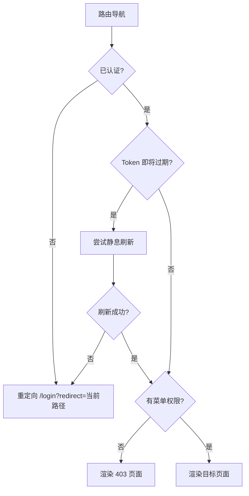
```mermaid
flowchart TD
    A[路由导航] --> B{已认证?}
    B -->|否| C[重定向 /login?redirect=当前路径]
    B -->|是| D{Token 即将过期?}
    D -->|是| E[尝试静息刷新]
    E --> F{刷新成功?}
    F -->|否| C
    F -->|是| G{有菜单权限?}
    D -->|否| G
    G -->|否| H[渲染 403 页面]
    G -->|是| I[渲染目标页面]
```

#### 2.4.4 PermissionGuard

```typescript
// components/PermissionGuard.tsx

interface PermissionGuardProps {
  permissions?: string[];    // 权限码列表（AND 关系）
  roles?: string[];          // 角色码列表（AND 关系）
  requireAll?: boolean;      // 是否需要全部匹配（默认 true）
  fallback?: React.ReactNode; // 无权限时显示（默认 null）
  children: React.ReactNode;
}
```

### 2.5 权限工具函数

```typescript
// utils/permission.ts

// 检查用户是否拥有指定权限
function hasPermission(
  userPermissions: string[],
  required: string | string[],
  requireAll?: boolean
): boolean;

// 检查用户是否拥有指定角色
function hasRole(
  userRoles: string[],
  required: string | string[],
  requireAll?: boolean
): boolean;

// 从权限树中提取菜单树（过滤无权限节点）
function filterMenuByPermission(
  menuTree: PermissionTreeNode[],
  userPermissions: string[]
): PermissionTreeNode[];

// 检查数据权限范围
function checkDataScope(
  userScope: DataScope,
  targetScope: DataScope
): boolean;
// targetScope 必须在 userScope 范围内才返回 true
// 规则: all 可访问 all/shop/self, shop 可访问 shop/self, self 仅访问 self
```

### 2.6 Token 刷新策略

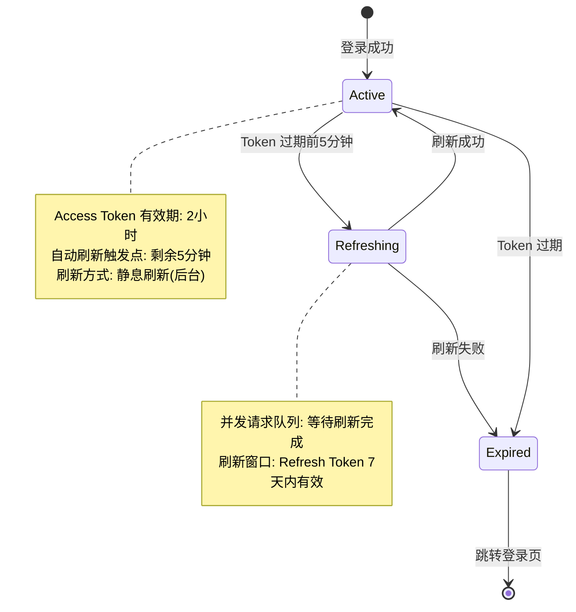
```mermaid
stateDiagram-v2
    [*] --> Active: 登录成功
    Active --> Refreshing: Token 过期前5分钟
    Refreshing --> Active: 刷新成功
    Refreshing --> Expired: 刷新失败
    Active --> Expired: Token 过期
    Expired --> [*]: 跳转登录页

    note right of Active
        Access Token 有效期: 2小时
        自动刷新触发点: 剩余5分钟
        刷新方式: 静息刷新(后台)
    end note

    note right of Refreshing
        并发请求队列: 等待刷新完成
        刷新窗口: Refresh Token 7天内有效
    end note
```

**并发请求处理**：

```typescript
// api/request.ts 中的 Token 刷新拦截器逻辑

let isRefreshing = false;
let refreshSubscribers: Array<(token: string) => void> = [];

function onRefreshed(token: string) {
  refreshSubscribers.forEach(cb => cb(token));
  refreshSubscribers = [];
}

function addRefreshSubscriber(cb: (token: string) => void) {
  refreshSubscribers.push(cb);
}

// 响应拦截器
if (response.status === 401 && !config._retry) {
  if (!isRefreshing) {
    isRefreshing = true;
    try {
      const newToken = await authStore.refreshAccessToken();
      isRefreshing = false;
      onRefreshed(newToken);
      // 重试原请求
      return axiosInstance.request(config);
    } catch {
      isRefreshing = false;
      authStore.logout();
      return Promise.reject(response);
    }
  } else {
    // 将请求加入等待队列
    return new Promise((resolve) => {
      addRefreshSubscriber((token: string) => {
        config.headers.Authorization = `Bearer ${token}`;
        resolve(axiosInstance.request(config));
      });
    });
  }
}
```

### 2.7 模块类图

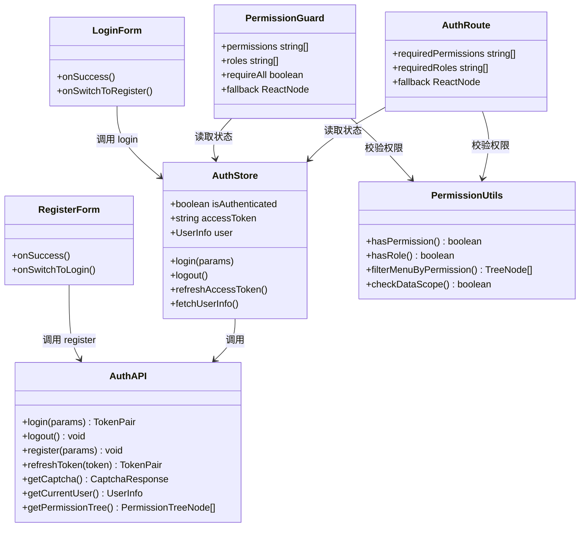
```mermaid
classDiagram
    class AuthStore {
        +boolean isAuthenticated
        +string accessToken
        +UserInfo user
        +login(params)
        +logout()
        +refreshAccessToken()
        +fetchUserInfo()
    }

    class AuthAPI {
        +login(params) TokenPair
        +logout() void
        +register(params) void
        +refreshToken(token) TokenPair
        +getCaptcha() CaptchaResponse
        +getCurrentUser() UserInfo
        +getPermissionTree() PermissionTreeNode[]
    }

    class LoginForm {
        +onSuccess()
        +onSwitchToRegister()
    }

    class RegisterForm {
        +onSuccess()
        +onSwitchToLogin()
    }

    class AuthRoute {
        +requiredPermissions string[]
        +requiredRoles string[]
        +fallback ReactNode
    }

    class PermissionGuard {
        +permissions string[]
        +roles string[]
        +requireAll boolean
        +fallback ReactNode
    }

    class PermissionUtils {
        +hasPermission() boolean
        +hasRole() boolean
        +filterMenuByPermission() TreeNode[]
        +checkDataScope() boolean
    }

    AuthStore --> AuthAPI : 调用
    AuthRoute --> AuthStore : 读取状态
    AuthRoute --> PermissionUtils : 校验权限
    PermissionGuard --> AuthStore : 读取状态
    PermissionGuard --> PermissionUtils : 校验权限
    LoginForm --> AuthStore : 调用 login
    RegisterForm --> AuthAPI : 调用 register
```

### 2.8 测试策略

| 测试项 | 测试方法 |
|-------|---------|
| Token 刷新 | Mock 401 响应，验证刷新流程及并发请求队列 |
| 权限校验 | 构造不同角色/权限的用户，验证 `hasPermission`/`hasRole` |
| 数据权限 | 测试不同 DataScope 的访问控制逻辑 |
| 登录流程 | Mock API，验证登录成功/失败/网络异常场景 |
| AuthRoute | 模拟不同认证状态，验证路由守卫行为 |

---

## 三、M1 布局与导航模块

### 3.1 模块概述

提供全局布局框架（侧边栏 + 顶栏 + 内容区）、动态菜单生成、面包屑导航。依赖 M0 模块的权限数据来生成动态菜单。

### 3.2 核心接口定义

#### 3.2.1 类型定义

```typescript
// 菜单项配置
interface MenuItem {
  key: string;              // 唯一标识，对应路由路径
  label: string;            // 显示文本（i18n key）
  icon?: React.ReactNode;   // 菜单图标
  path: string;             // 路由路径
  children?: MenuItem[];    // 子菜单
  hideInMenu?: boolean;     // 是否在菜单中隐藏（用于详情页）
  hideChildrenInMenu?: boolean; // 是否隐藏子菜单
  permission?: string;      // 所需权限码
}

// 面包屑项
interface BreadcrumbItem {
  title: string;            // 显示文本（i18n key）
  path?: string;            // 链接路径，无则不可点击
}

// 布局配置
interface LayoutConfig {
  sidebarCollapsed: boolean;
  sidebarWidth: number;         // 展开宽度，默认 208
  collapsedWidth: number;       // 折叠宽度，默认 80
  headerHeight: number;         // 顶栏高度，默认 56
  fixedHeader: boolean;         // 顶栏固定，默认 true
}
```

#### 3.2.2 路由与菜单映射配置

```typescript
// router/routes.tsx

interface RouteConfig {
  path: string;
  component: React.ComponentType;
  meta: {
    title: string;             // 页面标题（i18n key）
    icon?: string;             // 菜单图标名称
    hideInMenu?: boolean;      // 隐藏于菜单
    permission?: string;       // 权限码
    breadcrumb?: string[];     // 面包屑路径（i18n keys）
  };
  children?: RouteConfig[];
}
```

### 3.3 Zustand Store 设计

#### layoutStore

```typescript
// store/layoutStore.ts

interface LayoutState {
  // 状态
  sidebarCollapsed: boolean;
  breadcrumbItems: BreadcrumbItem[];
  currentRoutePath: string;

  // Actions
  toggleSidebar: () => void;
  setSidebarCollapsed: (collapsed: boolean) => void;
  setBreadcrumb: (items: BreadcrumbItem[]) => void;
  setCurrentRoute: (path: string) => void;
}
```

#### menuStore

```typescript
// store/menuStore.ts

interface MenuState {
  // 状态
  menuItems: MenuItem[];          // 完整权限菜单树
  flatMenuMap: Map<string, MenuItem>; // 扁平化映射（key -> item）
  isLoaded: boolean;

  // Actions
  loadMenuFromPermissionTree: (
    permissionTree: PermissionTreeNode[]
  ) => void;
  getMenuByPath: (path: string) => MenuItem | undefined;
  getParentMenus: (path: string) => MenuItem[]; // 获取父级菜单链
}
```

**菜单生成逻辑**：

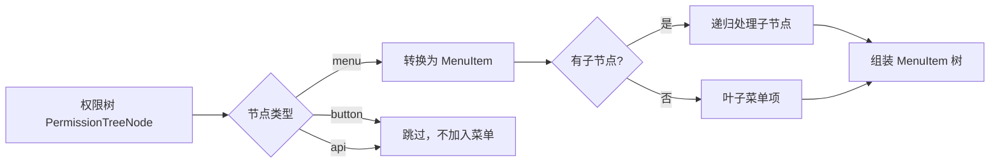
```mermaid
flowchart LR
    A[权限树 PermissionTreeNode] --> B{节点类型}
    B -->|menu| C[转换为 MenuItem]
    B -->|button| D[跳过，不加入菜单]
    B -->|api| D
    C --> E{有子节点?}
    E -->|是| F[递归处理子节点]
    E -->|否| G[叶子菜单项]
    F --> H[组装 MenuItem 树]
    G --> H
```

### 3.4 组件设计

#### 3.4.1 MainLayout

```typescript
// components/Layout/MainLayout.tsx

interface MainLayoutProps {
  children: React.ReactNode;
}
```

**布局结构**：

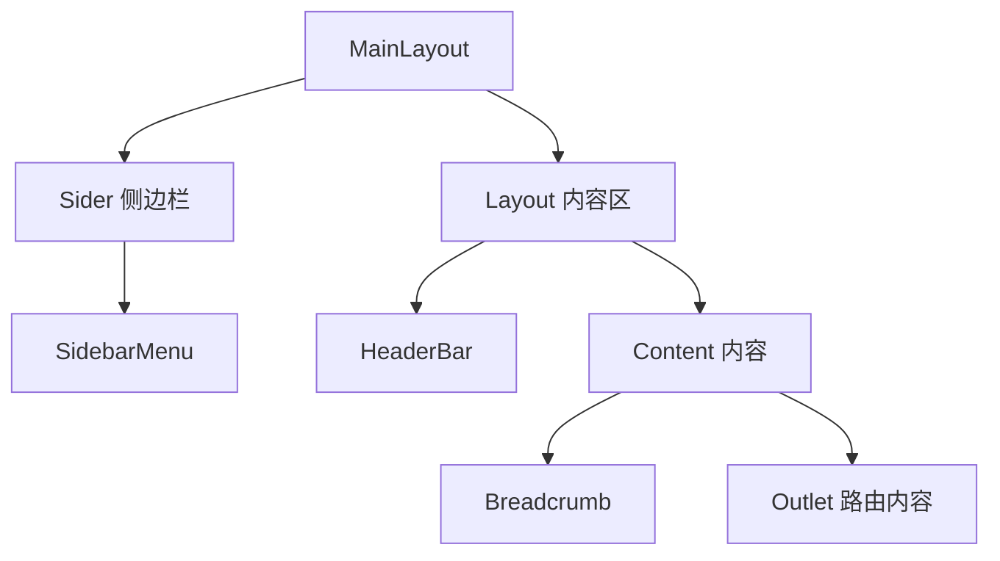
```mermaid
graph TD
    A[MainLayout] --> B[Sider 侧边栏]
    A --> C[Layout 内容区]
    B --> D[SidebarMenu]
    C --> E[HeaderBar]
    C --> F[Content 内容]
    F --> G[Breadcrumb]
    F --> H[Outlet 路由内容]
```

#### 3.4.2 SidebarMenu

```typescript
// components/Layout/SidebarMenu.tsx

interface SidebarMenuProps {
  items: MenuItem[];           // 菜单项列表
  collapsed: boolean;          // 是否折叠
  selectedKey: string;         // 当前选中项
  onSelect?: (key: string) => void;
  onOpenChange?: (keys: string[]) => void;
}
```

**行为**：
1. 从 `menuStore` 获取权限过滤后的菜单项
2. 根据当前路由路径自动高亮对应菜单项
3. 支持多级嵌套展开/收起
4. 折叠模式下仅显示图标，hover 展示 Tooltip

#### 3.4.3 Breadcrumb

```typescript
// components/Layout/Breadcrumb.tsx

interface BreadcrumbProps {
  items?: BreadcrumbItem[];    // 手动传入时覆盖自动生成
  routes?: RouteConfig[];      // 用于从路由配置自动生成
}
```

**自动生成逻辑**：
1. 监听路由变化，从 `menuStore.getParentMenus()` 获取父级菜单链
2. 将菜单 `label` 通过 i18n 翻译后作为面包屑文本
3. 除最后一项外，其他项均可点击跳转

#### 3.4.4 HeaderBar

```typescript
// components/Layout/HeaderBar.tsx

interface HeaderBarProps {
  onToggleSidebar?: () => void;
}
```

**内容区组成**：
- 左侧：侧边栏折叠按钮
- 中间：全局搜索（可选，后续迭代）
- 右侧：
  - `NotificationBadge`（M3 通知角标）
  - `ThemeSwitcher`（M2 主题切换）
  - `LanguageSwitcher`（M2 语言切换）
  - 用户头像 + 下拉菜单（个人中心、安全设置、退出登录）

### 3.5 模块类图

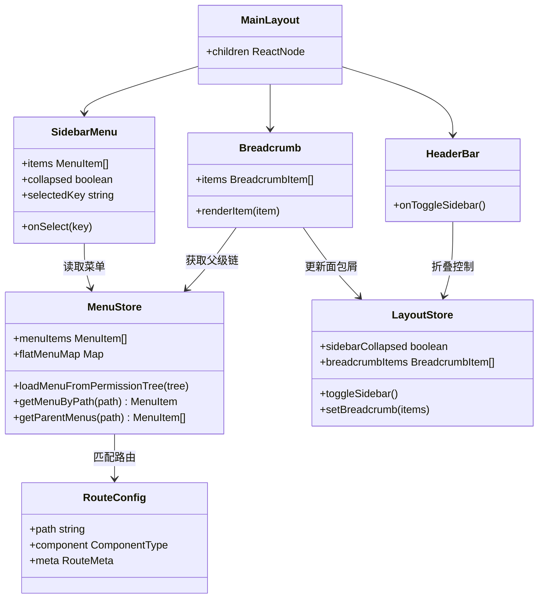
```mermaid
classDiagram
    class MainLayout {
        +children ReactNode
    }

    class SidebarMenu {
        +items MenuItem[]
        +collapsed boolean
        +selectedKey string
        +onSelect(key)
    }

    class Breadcrumb {
        +items BreadcrumbItem[]
        +renderItem(item)
    }

    class HeaderBar {
        +onToggleSidebar()
    }

    class MenuStore {
        +menuItems MenuItem[]
        +flatMenuMap Map
        +loadMenuFromPermissionTree(tree)
        +getMenuByPath(path) MenuItem
        +getParentMenus(path) MenuItem[]
    }

    class LayoutStore {
        +sidebarCollapsed boolean
        +breadcrumbItems BreadcrumbItem[]
        +toggleSidebar()
        +setBreadcrumb(items)
    }

    class RouteConfig {
        +path string
        +component ComponentType
        +meta RouteMeta
    }

    MainLayout --> SidebarMenu
    MainLayout --> HeaderBar
    MainLayout --> Breadcrumb
    SidebarMenu --> MenuStore : 读取菜单
    Breadcrumb --> MenuStore : 获取父级链
    Breadcrumb --> LayoutStore : 更新面包屑
    HeaderBar --> LayoutStore : 折叠控制
    MenuStore --> RouteConfig : 匹配路由
```

### 3.6 路由切换时序图

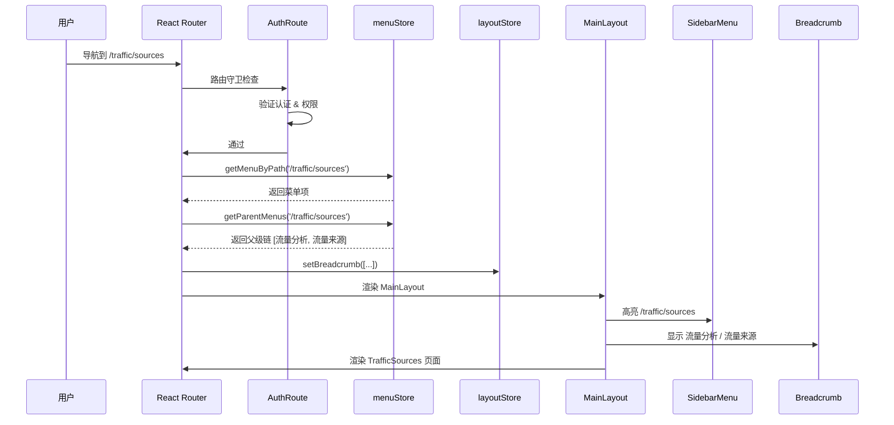
```mermaid
sequenceDiagram
    participant User as 用户
    participant Router as React Router
    participant AuthRoute as AuthRoute
    participant MenuStore as menuStore
    participant LayoutStore as layoutStore
    participant Layout as MainLayout

    User->>Router: 导航到 /traffic/sources
    Router->>AuthRoute: 路由守卫检查
    AuthRoute->>AuthRoute: 验证认证 & 权限
    AuthRoute->>Router: 通过
    Router->>MenuStore: getMenuByPath('/traffic/sources')
    MenuStore-->>Router: 返回菜单项
    Router->>MenuStore: getParentMenus('/traffic/sources')
    MenuStore-->>Router: 返回父级链 [流量分析, 流量来源]
    Router->>LayoutStore: setBreadcrumb([...])
    Router->>Layout: 渲染 MainLayout
    Layout->>SidebarMenu: 高亮 /traffic/sources
    Layout->>Breadcrumb: 显示 流量分析 / 流量来源
    Layout->>Router: 渲染 TrafficSources 页面
```

### 3.7 测试策略

| 测试项 | 测试方法 |
|-------|---------|
| 菜单生成 | 传入不同权限树，验证生成的菜单项正确过滤 |
| 面包屑生成 | 模拟不同路由，验证面包屑路径和文本 |
| 侧边栏折叠 | 验证折叠/展开状态下布局宽度变化 |
| 权限路由 | 模拟无权限路由，验证 403 渲染 |

---

## 四、M2 主题与国际化模块

### 4.1 模块概述

提供全局主题管理（亮/暗模式切换、自定义主题色）和多语言切换能力。通过 Provider 模式向所有业务模块注入主题和语言配置。

### 4.2 核心接口定义

#### 4.2.1 类型定义

```typescript
// 主题模式
type ThemeMode = 'light' | 'dark';

// 预设主题色
interface PresetColor {
  key: string;        // 颜色标识
  name: string;       // 颜色名称（i18n key）
  value: string;      // 色值（HEX）
}

// 主题配置
interface ThemeConfig {
  mode: ThemeMode;
  primaryColor: string;
  borderRadius: number;       // 圆角，默认 6
  fontSize: number;           // 基础字号，默认 14
  compact: boolean;           // 紧凑模式
}

// 语言配置
interface LocaleConfig {
  code: string;               // 语言代码，如 'zh-CN'
  name: string;               // 语言名称
  antdLocale: Locale;         // Ant Design 对应语言包
  dayjsLocale: ILocale;       // dayjs 对应语言包
}
```

#### 4.2.2 语言包结构

```typescript
// locales/zh-CN/modules/dashboard.json
{
  "title": "经营概览",
  "metrics": {
    "gmv": "GMV",
    "orders": "订单数",
    "visitors": "访客数",
    "conversion": "转化率"
  },
  "filters": {
    "dateRange": "日期范围",
    "compare": "同比对比"
  }
}
```

### 4.3 Zustand Store 设计

#### themeStore

```typescript
// store/themeStore.ts

interface ThemeState {
  // 状态
  mode: ThemeMode;
  primaryColor: string;
  borderRadius: number;
  fontSize: number;
  compact: boolean;

  // 派生状态（计算属性）
  antdTheme: ConfigProviderTheme;  // Ant Design 主题配置对象

  // Actions
  setMode: (mode: ThemeMode) => void;
  setPrimaryColor: (color: string) => void;
  setBorderRadius: (radius: number) => void;
  setFontSize: (size: number) => void;
  setCompact: (compact: boolean) => void;
  resetToDefault: () => void;
  exportTheme: () => ThemeConfig;
  importTheme: (config: ThemeConfig) => void;
}
```

**Ant Design 主题映射逻辑**：

```typescript
// 将 ThemeState 转换为 Ant Design ConfigProvider 主题
function generateAntdTheme(state: ThemeState): ConfigProviderTheme {
  return {
    token: {
      colorPrimary: state.primaryColor,
      borderRadius: state.borderRadius,
      fontSize: state.fontSize,
    },
    algorithm: state.mode === 'dark'
      ? theme.darkAlgorithm
      : theme.defaultAlgorithm,
  };
}
```

#### localeStore

```typescript
// store/localeStore.ts

interface LocaleState {
  // 状态
  currentLocale: string;        // 当前语言代码
  supportedLocales: LocaleConfig[];

  // 派生状态
  antdLocale: Locale;           // 当前 Ant Design 语言包
  dayjsLocale: ILocale;         // 当前 dayjs 语言包
  direction: 'ltr' | 'rtl';     // 文本方向

  // Actions
  setLocale: (locale: string) => Promise<void>;
  addSupportedLocale: (config: LocaleConfig) => void;
}
```

### 4.4 组件设计

#### 4.4.1 ThemeProvider

```typescript
// providers/ThemeProvider.tsx

interface ThemeProviderProps {
  children: React.ReactNode;
}
```

**职责**：
1. 读取 `themeStore` 状态
2. 调用 `generateAntdTheme()` 生成 Ant Design 主题配置
3. 通过 Ant Design `ConfigProvider` 包裹子组件
4. 同步设置 `document.documentElement` 的 `data-theme` 属性（供自定义样式使用）
5. 持久化主题配置到 `localStorage`

#### 4.4.2 LocaleProvider

```typescript
// providers/LocaleProvider.tsx

interface LocaleProviderProps {
  children: React.ReactNode;
}
```

**职责**：
1. 读取 `localeStore` 状态
2. 调用 `i18n.changeLanguage()` 切换语言
3. 设置 `dayjs.locale()` 切换日期库语言
4. 通过 Ant Design `ConfigProvider` 注入组件库语言包
5. 持久化语言配置到 `localStorage`

#### 4.4.3 ThemeSwitcher

```typescript
// components/Theme/ThemeSwitcher.tsx

interface ThemeSwitcherProps {
  showModeToggle?: boolean;     // 显示亮暗切换，默认 true
  showColorPicker?: boolean;    // 显示颜色选择，默认 true
  presetColors?: PresetColor[]; // 预设颜色列表
}
```

#### 4.4.4 LanguageSwitcher

```typescript
// components/Locale/LanguageSwitcher.tsx

interface LanguageSwitcherProps {
  placement?: MenuPlacement;    // 下拉菜单位置，默认 bottomRight
}
```

### 4.5 i18n 初始化配置

```typescript
// i18n/index.ts

import i18n from 'i18next';
import { initReactI18next } from 'react-i18next';
import resourcesToBackend from 'i18next-resources-to-backend';

i18n
  .use(initReactI18next)
  .use(resourcesToBackend((locale: string, namespace: string) =>
    import(`@/locales/${locale}/modules/${namespace}.json`)
  ))
  .init({
    fallbackLng: 'zh-CN',
    supportedLngs: ['zh-CN', 'en-US'],
    defaultNS: 'common',
    interpolation: { escapeValue: false },
  });

export default i18n;
```

### 4.6 主题切换时序图

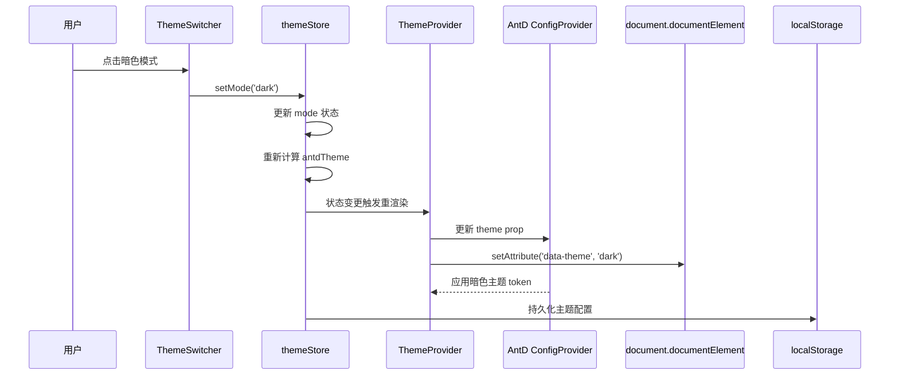
```mermaid
sequenceDiagram
    participant User as 用户
    participant Switcher as ThemeSwitcher
    participant Store as themeStore
    participant Provider as ThemeProvider
    participant ConfigProvider as AntD ConfigProvider
    participant DOM as document.documentElement

    User->>Switcher: 点击暗色模式
    Switcher->>Store: setMode('dark')
    Store->>Store: 更新 mode 状态
    Store->>Store: 重新计算 antdTheme
    Store->>Provider: 状态变更触发重渲染
    Provider->>ConfigProvider: 更新 theme prop
    Provider->>DOM: setAttribute('data-theme', 'dark')
    ConfigProvider-->>Provider: 应用暗色主题 token
    Store->>localStorage: 持久化主题配置
```

### 4.7 语言切换时序图

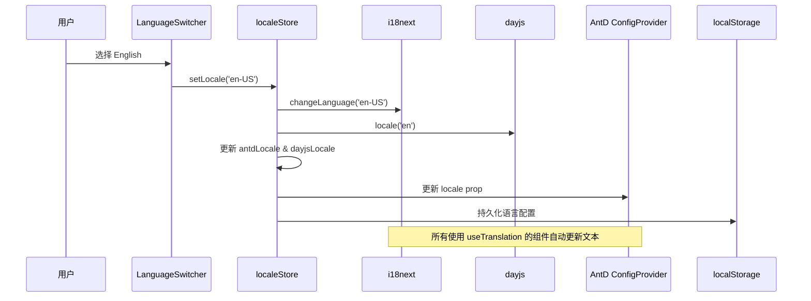
```mermaid
sequenceDiagram
    participant User as 用户
    participant Switcher as LanguageSwitcher
    participant Store as localeStore
    participant i18n as i18next
    participant dayjs as dayjs
    participant ConfigProvider as AntD ConfigProvider

    User->>Switcher: 选择 English
    Switcher->>Store: setLocale('en-US')
    Store->>i18n: changeLanguage('en-US')
    Store->>dayjs: locale('en')
    Store->>Store: 更新 antdLocale & dayjsLocale
    Store->>ConfigProvider: 更新 locale prop
    Store->>localStorage: 持久化语言配置
    Note over i18n,ConfigProvider: 所有使用 useTranslation 的组件自动更新文本
```

### 4.8 模块类图

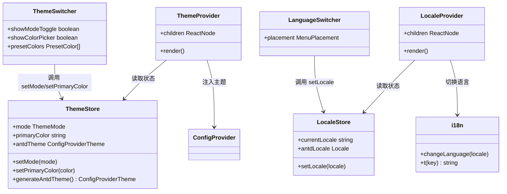
```mermaid
classDiagram
    class ThemeProvider {
        +children ReactNode
        +render()
    }

    class ThemeStore {
        +mode ThemeMode
        +primaryColor string
        +antdTheme ConfigProviderTheme
        +setMode(mode)
        +setPrimaryColor(color)
        +generateAntdTheme() ConfigProviderTheme
    }

    class LocaleProvider {
        +children ReactNode
        +render()
    }

    class LocaleStore {
        +currentLocale string
        +antdLocale Locale
        +setLocale(locale)
    }

    class ThemeSwitcher {
        +showModeToggle boolean
        +showColorPicker boolean
        +presetColors PresetColor[]
    }

    class LanguageSwitcher {
        +placement MenuPlacement
    }

    class i18n {
        +changeLanguage(locale)
        +t(key) string
    }

    ThemeProvider --> ThemeStore : 读取状态
    ThemeProvider --> ConfigProvider : 注入主题
    LocaleProvider --> LocaleStore : 读取状态
    LocaleProvider --> i18n : 切换语言
    ThemeSwitcher --> ThemeStore : 调用 setMode/setPrimaryColor
    LanguageSwitcher --> LocaleStore : 调用 setLocale
```

### 4.9 测试策略

| 测试项 | 测试方法 |
|-------|---------|
| 主题切换 | 验证 `setMode` 后 `antdTheme.algorithm` 正确切换 |
| 自定义颜色 | 验证 `setPrimaryColor` 后 token 中 `colorPrimary` 更新 |
| 语言切换 | Mock i18n，验证 `changeLanguage` 调用和资源加载 |
| 持久化 | 验证主题和语言配置正确写入/读取 localStorage |
| 默认值 | 验证首次访问时使用系统默认主题和浏览器语言 |

---

## 五、M3 通知与消息模块

### 5.1 模块概述

负责系统通知、数据预警、任务通知的接收、展示和管理。为其他模块提供统一的推送通知能力。

### 5.2 核心接口定义

#### 5.2.1 类型定义

```typescript
// 通知类型
type NotificationType = 'system' | 'alert' | 'task';

// 通知优先级
type NotificationPriority = 'low' | 'medium' | 'high' | 'urgent';

// 通知项
interface NotificationItem {
  id: string;
  type: NotificationType;
  priority: NotificationPriority;
  title: string;            // 通知标题（i18n key 或直接文本）
  content: string;          // 通知内容（支持富文本）
  createdAt: string;        // 创建时间 ISO 8601
  readAt?: string;          // 已读时间
  link?: string;            // 点击跳转链接
  action?: NotificationAction; // 可执行操作
  metadata?: Record<string, unknown>; // 扩展元数据
}

// 通知操作
interface NotificationAction {
  label: string;            // 按钮文本
  type: 'primary' | 'default' | 'danger';
  handler: () => void;      // 点击回调
}

// 通知统计
interface NotificationStats {
  total: number;
  unread: number;
  byType: Record<NotificationType, number>;
  byPriority: Record<NotificationPriority, number>;
}

// 通知过滤选项
interface NotificationFilter {
  type?: NotificationType;
  priority?: NotificationPriority;
  read?: boolean;           // true=仅已读, false=仅未读, undefined=全部
}

// 通知分页查询参数
interface NotificationQueryParams {
  filter?: NotificationFilter;
  page: number;
  pageSize: number;
}
```

#### 5.2.2 API 接口函数

```typescript
// api/notification.ts

// 获取通知列表（分页）
function getNotifications(params: NotificationQueryParams): Promise<PaginatedResponse<NotificationItem>>;

// 获取未读数量
function getUnreadCount(): Promise<number>;

// 标记单条已读
function markAsRead(id: string): Promise<void>;

// 全部标记已读
function markAllAsRead(): Promise<void>;

// 删除通知
function deleteNotification(id: string): Promise<void>;

// 批量删除
function batchDeleteNotifications(ids: string[]): Promise<void>;
```

### 5.3 Zustand Store 设计

#### notificationStore

```typescript
// store/notificationStore.ts

interface NotificationState {
  // 状态
  notifications: NotificationItem[];  // 当前加载的通知列表
  unreadCount: number;                // 未读数量
  stats: NotificationStats | null;    // 统计信息
  isLoaded: boolean;                  // 是否已初始化加载
  hasMore: boolean;                   // 是否有更多数据

  // Actions
  fetchNotifications: (params: NotificationQueryParams) => Promise<void>;
  fetchUnreadCount: () => Promise<void>;
  markAsRead: (id: string) => Promise<void>;
  markAllAsRead: () => Promise<void>;
  addNotification: (item: NotificationItem) => void; // 实时推送新增
  removeNotification: (id: string) => void;
  clearNotifications: () => void;
  initialize: () => Promise<void>;    // 应用启动时初始化
}
```

### 5.4 组件设计

#### 5.4.1 NotificationCenter

```typescript
// components/Notification/NotificationCenter.tsx

interface NotificationCenterProps {
  visible: boolean;               // 是否可见
  onClose: () => void;            // 关闭回调
}
```

**内部结构**：
- 顶部：Tab 切换（全部 / 系统 / 预警 / 任务）
- 列表：`NotificationCard` 列表，支持滚动加载更多
- 底部：操作栏（全部已读 / 清空已读）

#### 5.4.2 NotificationBadge

```typescript
// components/Notification/NotificationBadge.tsx

interface NotificationBadgeProps {
  count: number;            // 未读数量
  maxCount?: number;        // 超过此值显示 "99+"，默认 99
  dot?: boolean;            // 是否仅显示红点（计数为 0 时）
  onClick?: () => void;     // 点击回调
  children: React.ReactNode; // 触发元素（通常是图标按钮）
}
```

#### 5.4.3 NotificationCard

```typescript
// components/Notification/NotificationCard.tsx

interface NotificationCardProps {
  item: NotificationItem;
  onRead: (id: string) => void;
  onDelete: (id: string) => void;
  onActionClick: (item: NotificationItem) => void;
}
```

**展示规则**：
- `urgent` 优先级：红色左边框 + 背景高亮
- `high` 优先级：橙色左边框
- 未读：标题加粗 + 左侧蓝点
- 已读：降低透明度

#### 5.4.4 AlertBanner

```typescript
// components/Notification/AlertBanner.tsx

interface AlertBannerProps {
  notification: NotificationItem;
  onClose: () => void;
  onAction: () => void;
}
```

**使用场景**：
- 用于展示 `urgent` 级别的全局预警
- 自动展示在页面顶部（HeaderBar 下方）
- 5 秒后自动消失，或用户手动关闭

### 5.5 通知推送机制

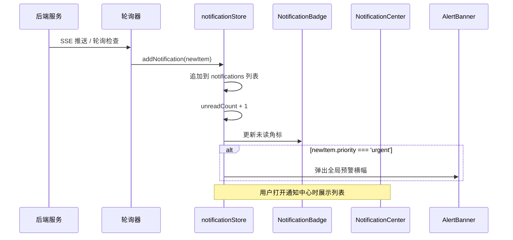
```mermaid
sequenceDiagram
    participant Backend as 后端服务
    participant Poller as 轮询器
    participant Store as notificationStore
    participant Badge as NotificationBadge
    participant Center as NotificationCenter
    participant Banner as AlertBanner

    Backend->>Poller: SSE 推送 / 轮询检查
    Poller->>Store: addNotification(newItem)
    Store->>Store: 追加到 notifications 列表
    Store->>Store: unreadCount + 1
    Store->>Badge: 更新未读角标
    alt newItem.priority === 'urgent'
        Store->>Banner: 弹出全局预警横幅
    end
    Note over Store,Center: 用户打开通知中心时展示列表
```

### 5.6 实时通知策略

```typescript
// hooks/useNotificationPoller.ts

interface UseNotificationPollerOptions {
  enabled: boolean;             // 是否启用轮询
  interval?: number;            // 轮询间隔（毫秒），默认 30000
  onNewNotification?: (item: NotificationItem) => void;
}

// 返回 { stop: () => void }
function useNotificationPoller(
  options: UseNotificationPollerOptions
): { stop: () => void };
```

**策略选择**：

| 条件 | 方案 |
|-----|------|
| 后端支持 SSE | 优先使用 SSE，建立长连接实时推送 |
| 后端支持 WebSocket | 可使用 WebSocket，与实时看板共用连接 |
| 仅 HTTP | 降级为轮询，默认 30s 间隔检查未读数量变化 |

### 5.7 模块类图

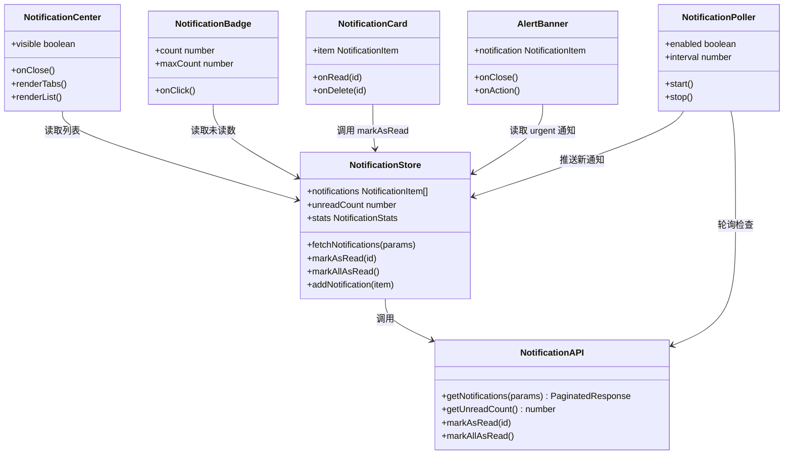
```mermaid
classDiagram
    class NotificationStore {
        +notifications NotificationItem[]
        +unreadCount number
        +stats NotificationStats
        +fetchNotifications(params)
        +markAsRead(id)
        +markAllAsRead()
        +addNotification(item)
    }

    class NotificationCenter {
        +visible boolean
        +onClose()
        +renderTabs()
        +renderList()
    }

    class NotificationBadge {
        +count number
        +maxCount number
        +onClick()
    }

    class NotificationCard {
        +item NotificationItem
        +onRead(id)
        +onDelete(id)
    }

    class AlertBanner {
        +notification NotificationItem
        +onClose()
        +onAction()
    }

    class NotificationPoller {
        +enabled boolean
        +interval number
        +start()
        +stop()
    }

    class NotificationAPI {
        +getNotifications(params) PaginatedResponse
        +getUnreadCount() number
        +markAsRead(id)
        +markAllAsRead()
    }

    NotificationStore --> NotificationAPI : 调用
    NotificationCenter --> NotificationStore : 读取列表
    NotificationBadge --> NotificationStore : 读取未读数
    NotificationCard --> NotificationStore : 调用 markAsRead
    AlertBanner --> NotificationStore : 读取 urgent 通知
    NotificationPoller --> NotificationStore : 推送新通知
    NotificationPoller --> NotificationAPI : 轮询检查
```

### 5.8 测试策略

| 测试项 | 测试方法 |
|-------|---------|
| 未读数量 | Mock API 返回不同未读数，验证角标展示 |
| 标记已读 | 验证调用后列表状态和未读计数更新 |
| 全部已读 | 验证批量操作后所有通知状态变更 |
| 实时推送 | Mock 新通知到达，验证列表更新和角标变化 |
| 紧急预警 | 验证 `urgent` 级别通知自动弹出 AlertBanner |
| 分页加载 | 模拟滚动到底部，验证加载更多数据 |

---

## 六、模块间交互关系

### 6.1 基础支撑层模块关系

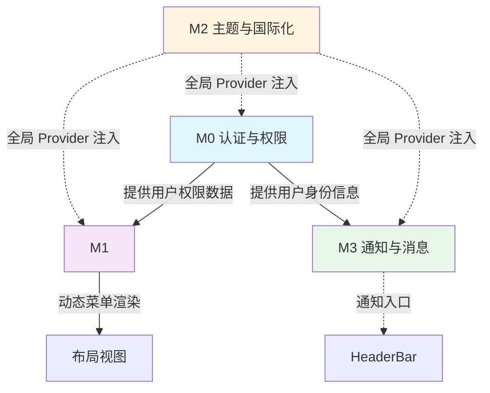
```mermaid
graph TD
    M0[M0 认证与权限] -->|提供用户权限数据| M1
    M0 -->|提供用户身份信息| M3
    M1 -->|动态菜单渲染| M1_View[布局视图]
    M2[M2 主题与国际化] -.->|全局 Provider 注入| M1
    M2 -.->|全局 Provider 注入| M0
    M2 -.->|全局 Provider 注入| M3
    M3[M3 通知与消息] -.->|通知入口| M1_Header[HeaderBar]

    style M0 fill:#e1f5fe
    style M1 fill:#f3e5f5
    style M2 fill:#fff3e0
    style M3 fill:#e8f5e9
```

### 6.2 公共接口清单

| 模块 | 对外提供的接口/Hook | 消费者 |
|-----|-------------------|-------|
| **M0** | `useAuth()` Hook | 所有模块 |
| | `usePermission()` Hook | M1, M4~M12 |
| | `authStore` | M1, M3 |
| **M1** | `LayoutStore` | M4~M11（设置面包屑） |
| **M2** | `ThemeProvider` / `LocaleProvider` | 全局 |
| | `useTheme()` Hook | 所有模块 |
| | `useTranslation()` Hook | 所有模块 |
| **M3** | `notificationStore` | M5（预警）, M12（导出完成） |
| | `useNotificationPoller()` Hook | App 入口 |

---

## 七、附录

### 7.1 全局 Hooks 清单

```typescript
// hooks/useAuth.ts
function useAuth(): {
  user: UserInfo | null;
  isAuthenticated: boolean;
  permissions: string[];
  login: (params: LoginParams) => Promise<void>;
  logout: () => Promise<void>;
};

// hooks/usePermission.ts
function usePermission(): {
  hasPermission: (perm: string | string[], requireAll?: boolean) => boolean;
  hasRole: (role: string | string[], requireAll?: boolean) => boolean;
  canAccessDataScope: (scope: DataScope) => boolean;
};

// hooks/useTheme.ts
function useTheme(): {
  mode: ThemeMode;
  primaryColor: string;
  setMode: (mode: ThemeMode) => void;
  setPrimaryColor: (color: string) => void;
  antdTheme: ConfigProviderTheme;
};
```

### 7.2 全局类型导出

```typescript
// types/common.d.ts

// 通用分页参数
interface PaginationParams {
  page: number;
  pageSize: number;
  sortField?: string;
  sortOrder?: 'ascend' | 'descend';
}

// 通用时间范围
interface TimeRange {
  startTime: string;  // ISO 8601
  endTime: string;    // ISO 8601
}

// 通用 API 响应
interface ApiResponse<T> {
  code: number;
  message: string;
  data: T;
}

// 通用分页响应
interface PaginatedResponse<T> {
  code: number;
  message: string;
  data: {
    list: T[];
    total: number;
    page: number;
    pageSize: number;
  };
}
```

---

## 八、M4 首页仪表盘模块

### 8.1 模块概述

提供全局经营概览，聚合展示核心指标（GMV、订单、访客、转化率），包括趋势图、商品排行、流量分布和经营诊断建议。依赖 M6（流量）、M7（交易）、M8（商品）模块的数据接口。

### 8.2 核心接口定义

#### 8.2.1 类型定义

```typescript
// 指标卡片数据
interface MetricData {
  value: number;
  label: string;           // i18n key
  unit?: string;           // 单位，如 '万元'
  trend?: {
    value: number;         // 变化百分比
    direction: 'up' | 'down' | 'flat';
  };
  compareValue?: number;   // 对比期值
}

// 趋势图数据点
interface TrendDataPoint {
  date: string;            // YYYY-MM-DD
  value: number;
  compareValue?: number;   // 同比值
}

// 趋势图数据集
interface TrendDataset {
  title: string;           // i18n key
  data: TrendDataPoint[];
  unit?: string;
}

// 商品排行项
interface ProductRankItem {
  rank: number;
  productId: string;
  productName: string;
  productImage?: string;
  gmv: number;
  orders: number;
  visitors: number;
  conversionRate: number;
}

// 流量来源项
interface TrafficSourceItem {
  source: string;          // i18n key
  value: number;
  percentage: number;
}

// 经营诊断建议
interface DiagnosisSuggestion {
  type: 'warning' | 'info' | 'success';
  title: string;           // i18n key
  content: string;         // i18n key
  action?: {
    label: string;
    link: string;
  };
}

// 仪表盘概览响应
interface DashboardOverview {
  metrics: {
    gmv: MetricData;
    orders: MetricData;
    visitors: MetricData;
    conversion: MetricData;
  };
  salesTrend: TrendDataset;
  trafficTrend: TrendDataset;
  topProducts: ProductRankItem[];
  trafficSources: TrafficSourceItem[];
  diagnosis: DiagnosisSuggestion[];
}

// 仪表盘查询参数
interface DashboardQueryParams {
  dateRange: [string, string];  // 时间范围
  compareType?: 'none' | 'yoy' | 'mom' | 'wow'; // 对比类型：无/同比/环比/周环比
}
```

#### 8.2.2 API 接口函数

```typescript
// api/dashboard.ts

// 获取仪表盘概览
function getDashboardOverview(params: DashboardQueryParams): Promise<DashboardOverview>;

// 获取销售趋势
function getSalesTrend(params: DashboardQueryParams): Promise<TrendDataset>;

// 获取流量趋势
function getTrafficTrend(params: DashboardQueryParams): Promise<TrendDataset>;

// 获取商品排行
function getTopProducts(params: DashboardQueryParams & { limit?: number }): Promise<ProductRankItem[]>;

// 获取经营诊断
function getDiagnosis(): Promise<DiagnosisSuggestion[]>;
```

### 8.3 Zustand Store 设计

#### dashboardStore

```typescript
// store/dashboardStore.ts

interface DashboardState {
  // 状态
  queryParams: DashboardQueryParams;
  overview: DashboardOverview | null;
  isLoading: boolean;
  lastUpdated: string | null;  // 最后更新时间

  // Actions
  setQueryParams: (params: Partial<DashboardQueryParams>) => void;
  fetchOverview: () => Promise<void>;
  refresh: () => Promise<void>;
}
```

### 8.4 组件设计

#### 8.4.1 DashboardPage（页面容器）

```typescript
// pages/Dashboard/index.tsx

interface DashboardPageProps {
  // 无 props，从 dashboardStore 获取数据
}
```

**布局结构**：

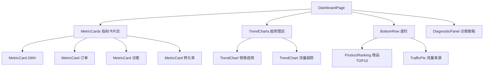
```mermaid
graph TD
    A[DashboardPage] --> B[MetricCards 指标卡片区]
    B --> B1[MetricCard GMV]
    B --> B2[MetricCard 订单]
    B --> B3[MetricCard 访客]
    B --> B4[MetricCard 转化率]
    A --> C[TrendCharts 趋势图区]
    C --> C1[TrendChart 销售趋势]
    C --> C2[TrendChart 流量趋势]
    A --> D[BottomRow 底栏]
    D --> D1[ProductRanking 商品TOP10]
    D --> D2[TrafficPie 流量来源]
    A --> E[DiagnosticPanel 诊断面板]
```

#### 8.4.2 MetricCard

```typescript
// components/MetricCard.tsx

interface MetricCardProps {
  data: MetricData;
  loading?: boolean;
  trendVisible?: boolean;      // 是否展示趋势，默认 true
  onClick?: () => void;        // 点击跳转
}
```

#### 8.4.3 TrendChart

```typescript
// pages/Dashboard/TrendChart.tsx

interface TrendChartProps {
  dataset: TrendDataset;
  loading?: boolean;
  onTimeRangeChange?: (range: [string, string]) => void;
}
```

**行为**：
- 使用 ECharts 折线图渲染
- 支持时间范围筛选（今日/近7天/近30天/自定义）
- 有 `compareValue` 时展示双折线对比

#### 8.4.4 ProductRanking

```typescript
// pages/Dashboard/ProductRanking.tsx

interface ProductRankingProps {
  products: ProductRankItem[];
  loading?: boolean;
  onItemClick?: (productId: string) => void;
  onViewMore?: () => void;     // 查看完整排行
}
```

#### 8.4.5 TrafficPie

```typescript
// pages/Dashboard/TrafficPie.tsx

interface TrafficPieProps {
  sources: TrafficSourceItem[];
  loading?: boolean;
}
```

#### 8.4.6 DiagnosticPanel

```typescript
// pages/Dashboard/DiagnosticPanel.tsx

interface DiagnosticPanelProps {
  suggestions: DiagnosisSuggestion[];
  loading?: boolean;
  onActionClick?: (suggestion: DiagnosisSuggestion) => void;
}
```

### 8.5 页面加载时序图

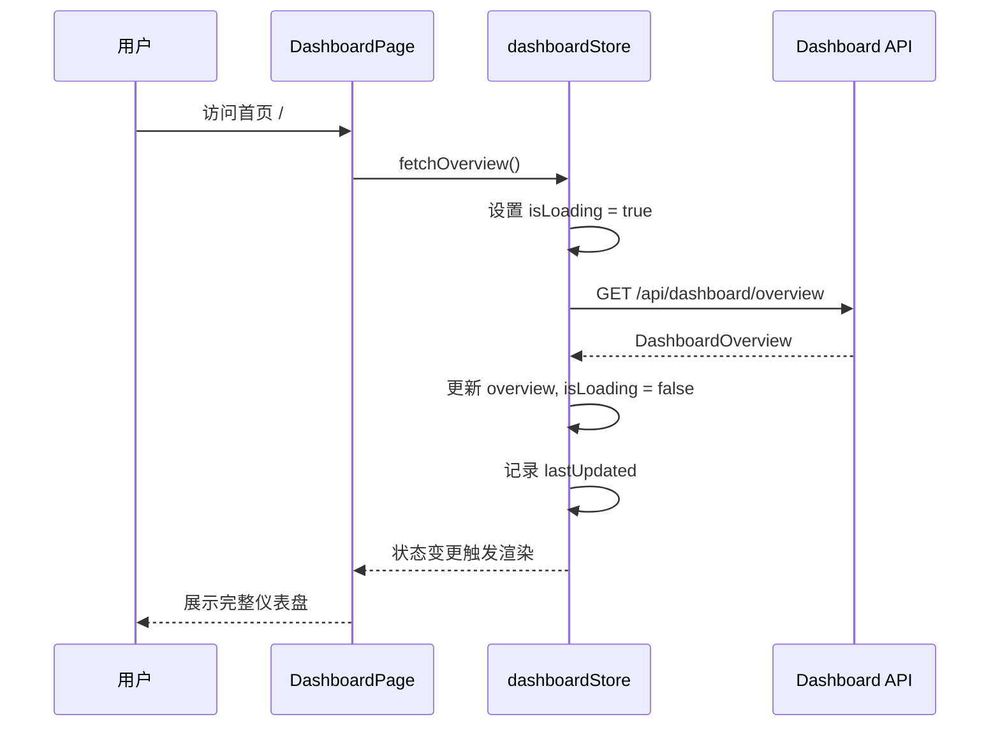
```mermaid
sequenceDiagram
    participant User as 用户
    participant Page as DashboardPage
    participant Store as dashboardStore
    participant API as Dashboard API

    User->>Page: 访问首页 /
    Page->>Store: fetchOverview()
    Store->>Store: 设置 isLoading = true
    Store->>API: GET /api/dashboard/overview
    API-->>Store: DashboardOverview
    Store->>Store: 更新 overview, isLoading = false
    Store->>Store: 记录 lastUpdated
    Store-->>Page: 状态变更触发渲染
    Page-->>User: 展示完整仪表盘
```

### 8.6 模块类图

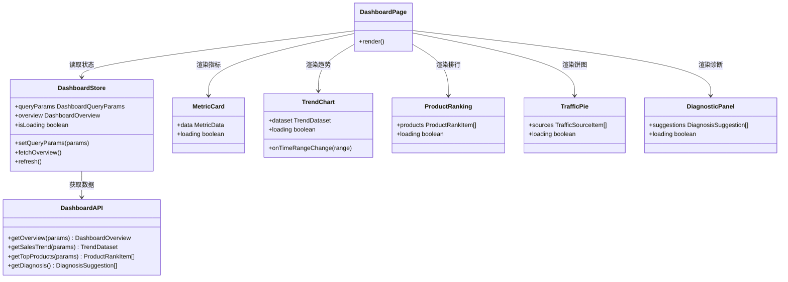
```mermaid
classDiagram
    class DashboardPage {
        +render()
    }

    class DashboardStore {
        +queryParams DashboardQueryParams
        +overview DashboardOverview
        +isLoading boolean
        +setQueryParams(params)
        +fetchOverview()
        +refresh()
    }

    class MetricCard {
        +data MetricData
        +loading boolean
    }

    class TrendChart {
        +dataset TrendDataset
        +loading boolean
        +onTimeRangeChange(range)
    }

    class ProductRanking {
        +products ProductRankItem[]
        +loading boolean
    }

    class TrafficPie {
        +sources TrafficSourceItem[]
        +loading boolean
    }

    class DiagnosticPanel {
        +suggestions DiagnosisSuggestion[]
        +loading boolean
    }

    class DashboardAPI {
        +getOverview(params) DashboardOverview
        +getSalesTrend(params) TrendDataset
        +getTopProducts(params) ProductRankItem[]
        +getDiagnosis() DiagnosisSuggestion[]
    }

    DashboardPage --> DashboardStore : 读取状态
    DashboardPage --> MetricCard : 渲染指标
    DashboardPage --> TrendChart : 渲染趋势
    DashboardPage --> ProductRanking : 渲染排行
    DashboardPage --> TrafficPie : 渲染饼图
    DashboardPage --> DiagnosticPanel : 渲染诊断
    DashboardStore --> DashboardAPI : 获取数据
```

### 8.7 测试策略

| 测试项 | 测试方法 |
|-------|---------|
| 指标卡渲染 | Mock 不同指标数据，验证数值格式化、趋势箭头展示 |
| 趋势图切换 | 模拟时间筛选，验证 API 参数更新和图表重渲染 |
| 对比模式 | 验证同比/环比/周环比模式下双折线展示 |
| 空数据处理 | 验证各组件在无数据/加载中的兜底展示 |

---

## 九、M5 实时数据看板模块

### 9.1 模块概述

提供大促实时数据监控能力，核心功能包括数字翻牌器、实时销售趋势、转化漏斗、流量来源、商品实时排名和预警信息。支持 2s/10s/30s/60s 可配置刷新间隔。

### 9.2 核心接口定义

#### 9.2.1 类型定义

```typescript
// 实时刷新间隔（秒）
type RealtimeInterval = 2 | 10 | 30 | 60;

// 实时概览数据
interface RealtimeOverview {
  gmv: number;              // 实时 GMV
  gmvTarget?: number;       // 目标 GMV（大促目标）
  orders: number;           // 实时订单数
  visitors: number;         // 实时访客数
  conversionRate: number;   // 实时转化率
  timestamp: string;        // 数据时间戳 ISO 8601
}

// 实时趋势数据点
interface RealtimeTrendPoint {
  time: string;             // HH:mm:ss
  gmv: number;
  orders: number;
  visitors: number;
}

// 实时趋势数据集
interface RealtimeTrendDataset {
  data: RealtimeTrendPoint[];
  maxPoints: number;        // 最大保留点数（用于限制内存）
}

// 实时转化漏斗
interface RealtimeFunnel {
  steps: FunnelStep[];
}

interface FunnelStep {
  name: string;             // i18n key
  value: number;
  rate: number;             // 相对于上一步的转化率
  overallRate: number;      // 相对于第一步的整体转化率
}

// 实时流量来源
interface RealtimeTrafficSource {
  source: string;           // i18n key
  visitors: number;
  orders: number;
  gmv: number;
}

// 实时商品排名
interface RealtimeProductRank {
  productId: string;
  productName: string;
  gmv: number;
  orders: number;
  rank: number;
  rankChange?: number;      // 排名变化，正数=上升，负数=下降
}

// 实时预警
interface RealtimeAlert {
  id: string;
  type: 'gmv_target' | 'traffic_drop' | 'conversion_drop' | 'inventory_low';
  level: 'warning' | 'critical';
  message: string;          // i18n key
  triggeredAt: string;
  metrics?: Record<string, number>; // 触发指标快照
}

// 实时看板完整响应
interface RealtimeDashboard {
  overview: RealtimeOverview;
  trend: RealtimeTrendDataset;
  funnel: RealtimeFunnel;
  trafficSources: RealtimeTrafficSource[];
  productRanks: RealtimeProductRank[];
  alerts: RealtimeAlert[];
}
```

#### 9.2.2 API 接口函数

```typescript
// api/realtime.ts

// 获取实时概览
function getRealtimeOverview(): Promise<RealtimeOverview>;

// 获取实时趋势
function getRealtimeTrend(params?: {
  limit?: number;           // 返回数据点数，默认 100
}): Promise<RealtimeTrendPoint[]>;

// 获取实时漏斗
function getRealtimeFunnel(): Promise<RealtimeFunnel>;

// 获取实时商品排名
function getRealtimeProducts(params?: {
  limit?: number;           // 默认 20
}): Promise<RealtimeProductRank[]>;

// 获取实时预警
function getRealtimeAlerts(): Promise<RealtimeAlert[]>;
```

### 9.3 Zustand Store 设计

#### realtimeStore

```typescript
// store/realtimeStore.ts

interface RealtimeState {
  // 状态
  refreshInterval: RealtimeInterval;
  isAutoRefresh: boolean;
  isPaused: boolean;
  overview: RealtimeOverview | null;
  trend: RealtimeTrendPoint[];
  funnel: RealtimeFunnel | null;
  trafficSources: RealtimeTrafficSource[];
  productRanks: RealtimeProductRank[];
  alerts: RealtimeAlert[];
  isLoading: boolean;
  lastUpdated: string | null;
  error: string | null;

  // Actions
  setRefreshInterval: (interval: RealtimeInterval) => void;
  toggleAutoRefresh: () => void;
  togglePause: () => void;
  fetchAll: () => Promise<void>;
  fetchOverview: () => Promise<void>;
  fetchTrend: () => Promise<void>;
  fetchFunnel: () => Promise<void>;
  fetchProducts: () => Promise<void>;
  fetchAlerts: () => Promise<void>;
  startPolling: () => void;
  stopPolling: () => void;
  reset: () => void;
}
```

**轮询逻辑**：

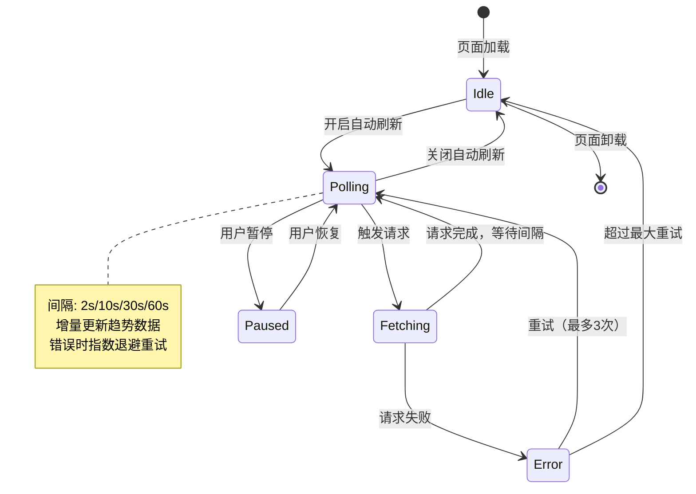
```mermaid
stateDiagram-v2
    [*] --> Idle: 页面加载
    Idle --> Polling: 开启自动刷新
    Polling --> Fetching: 触发请求
    Fetching --> Polling: 请求完成，等待间隔
    Fetching --> Error: 请求失败
    Error --> Polling: 重试（最多3次）
    Error --> Idle: 超过最大重试
    Polling --> Paused: 用户暂停
    Paused --> Polling: 用户恢复
    Polling --> Idle: 关闭自动刷新
    Idle --> [*]: 页面卸载

    note right of Polling
        间隔: 2s/10s/30s/60s
        增量更新趋势数据
        错误时指数退避重试
    end note
```

### 9.4 组件设计

#### 9.4.1 RealtimePage（页面容器）

```typescript
// pages/Realtime/index.tsx

interface RealtimePageProps {
  // 无 props
}
```

**布局结构**：

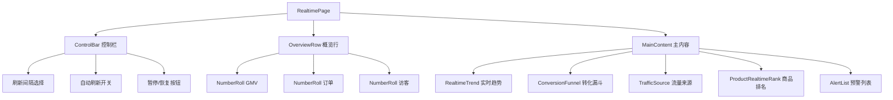
```mermaid
graph TD
    A[RealtimePage] --> B[ControlBar 控制栏]
    B --> B1[刷新间隔选择]
    B --> B2[自动刷新开关]
    B --> B3[暂停/恢复按钮]
    A --> C[OverviewRow 概览行]
    C --> C1[NumberRoll GMV]
    C --> C2[NumberRoll 订单]
    C --> C3[NumberRoll 访客]
    A --> D[MainContent 主内容]
    D --> D1[RealtimeTrend 实时趋势]
    D --> D2[ConversionFunnel 转化漏斗]
    D --> D3[TrafficSource 流量来源]
    D --> D4[ProductRealtimeRank 商品排名]
    D --> D5[AlertList 预警列表]
```

#### 9.4.2 NumberRoll

```typescript
// components/NumberRoll.tsx

interface NumberRollProps {
  value: number;
  label: string;            // i18n key
  unit?: string;
  prefix?: string;          // 前缀，如 '¥'
  duration?: number;        // 动画时长（毫秒），默认 1000
  decimals?: number;        // 小数位数，默认 0
}
```

**行为**：value 变化时触发数字滚动动画（使用 `requestAnimationFrame` 实现帧动画）。

#### 9.4.3 RealtimeTrend

```typescript
// pages/Realtime/RealtimeTrend.tsx

interface RealtimeTrendProps {
  data: RealtimeTrendPoint[];
  loading?: boolean;
  metrics?: ('gmv' | 'orders' | 'visitors')[]; // 可选指标，默认全部
}
```

**性能优化**：
- 数据追加而非全量重绘（ECharts `appendData`）
- 限制最大数据点数量（默认 300 点，超出时移除最旧数据）
- 使用 `useMemo` 缓存 ECharts option 对象

#### 9.4.4 ConversionFunnel

```typescript
// pages/Realtime/ConversionFunnel.tsx

interface ConversionFunnelProps {
  funnel: RealtimeFunnel;
  loading?: boolean;
}
```

#### 9.4.5 AlertList

```typescript
// pages/Realtime/AlertList.tsx

interface AlertListProps {
  alerts: RealtimeAlert[];
  loading?: boolean;
  onDismiss?: (id: string) => void;
}
```

### 9.5 实时刷新时序图

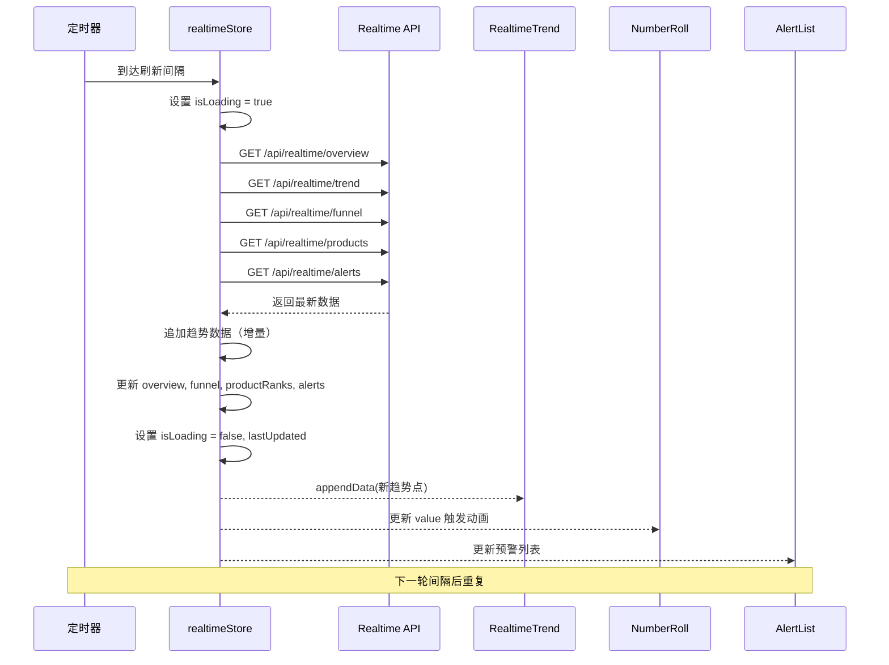
```mermaid
sequenceDiagram
    participant Timer as 定时器
    participant Store as realtimeStore
    participant API as Realtime API
    participant Trend as RealtimeTrend
    participant Roll as NumberRoll
    participant Alert as AlertList

    Timer->>Store: 到达刷新间隔
    Store->>Store: 设置 isLoading = true
    Store->>API: GET /api/realtime/overview
    Store->>API: GET /api/realtime/trend
    Store->>API: GET /api/realtime/funnel
    Store->>API: GET /api/realtime/products
    Store->>API: GET /api/realtime/alerts
    API-->>Store: 返回最新数据
    Store->>Store: 追加趋势数据（增量）
    Store->>Store: 更新 overview, funnel, productRanks, alerts
    Store->>Store: 设置 isLoading = false, lastUpdated
    Store-->>Trend: appendData(新趋势点)
    Store-->>Roll: 更新 value 触发动画
    Store-->>Alert: 更新预警列表
    Note over Timer,Alert: 下一轮间隔后重复
```

### 9.6 模块类图

```mermaid
classDiagram
    class RealtimePage {
        +render()
    }

    class RealtimeStore {
        +refreshInterval RealtimeInterval
        +isAutoRefresh boolean
        +isPaused boolean
        +overview RealtimeOverview
        +trend RealtimeTrendPoint[]
        +fetchAll()
        +startPolling()
        +stopPolling()
        +setRefreshInterval(interval)
    }

    class NumberRoll {
        +value number
        +label string
        +duration number
        +animateValue()
    }

    class RealtimeTrend {
        +data RealtimeTrendPoint[]
        +metrics string[]
        +appendData(points)
    }

    class ConversionFunnel {
        +funnel RealtimeFunnel
    }

    class AlertList {
        +alerts RealtimeAlert[]
        +onDismiss(id)
    }

    class RealtimeAPI {
        +getOverview() RealtimeOverview
        +getTrend() RealtimeTrendPoint[]
        +getFunnel() RealtimeFunnel
        +getProducts() RealtimeProductRank[]
        +getAlerts() RealtimeAlert[]
    }

    RealtimePage --> RealtimeStore : 读取状态
    RealtimePage --> NumberRoll
    RealtimePage --> RealtimeTrend
    RealtimePage --> ConversionFunnel
    RealtimePage --> AlertList
    RealtimeStore --> RealtimeAPI : 轮询获取数据
    NumberRoll --> NumberRoll : requestAnimationFrame 动画
```

### 9.7 测试策略

| 测试项 | 测试方法 |
|-------|---------|
| 轮询控制 | 验证 `startPolling`/`stopPolling` 对定时器的控制 |
| 间隔切换 | 验证切换刷新间隔后定时器重新计算 |
| 暂停/恢复 | 验证暂停期间不发请求，恢复后继续 |
| 增量数据 | 验证趋势数据追加逻辑和最大点数限制 |
| 数字滚动 | Mock 数值变化，验证动画触发和最终值 |
| 错误重试 | Mock API 失败，验证指数退避重试逻辑 |

---

## 十、M6 流量分析模块

### 10.1 模块概述

提供流量来源、搜索关键词、活动效果、流量路径等多维度分析能力。包含 5 个子页面：概览、来源、关键词、活动、路径。

### 10.2 核心接口定义

#### 10.2.1 类型定义

```typescript
// 流量概览数据
interface TrafficOverviewData {
  visitors: number;         // 访客数
  pv: number;               // 浏览量
  avgStayTime: number;      // 平均停留时长（秒）
  bounceRate: number;       // 跳出率
  newVisitorRate: number;   // 新访客占比
  trends: {
    visitors: TrendDataPoint[];
    pv: TrendDataPoint[];
  };
}

// 四级流量来源
interface TrafficSourceLevel {
  level: 1 | 2 | 3 | 4;    // 一级~四级
  name: string;             // 来源名称
  visitors: number;
  pv: number;
  orders: number;
  gmv: number;
  conversionRate: number;
  children?: TrafficSourceLevel[];
}

// 关键词分析项
interface KeywordItem {
  keyword: string;
  visitors: number;
  pv: number;
  orders: number;
  gmv: number;
  conversionRate: number;
  type: 'organic' | 'paid' | 'brand'; // 自然/付费/品牌
}

// 活动效果项
interface ActivityEffectItem {
  activityId: string;
  activityName: string;
  startDate: string;
  endDate: string;
  visitors: number;
  orders: number;
  gmv: number;
  roi: number;              // 投入产出比
  status: 'active' | 'ended' | 'upcoming';
}

// 流量路径节点
interface TrafficPathNode {
  id: string;
  name: string;
  visitors: number;
}

// 流量路径边
interface TrafficPathEdge {
  source: string;           // 源节点 ID
  target: string;           // 目标节点 ID
  value: number;            // 流量值
}

// 流量查询参数
interface TrafficQueryParams {
  dateRange: [string, string];
  sourceType?: string;      // 来源类型筛选
  compareType?: 'none' | 'yoy' | 'mom';
}

// 分页查询参数
interface TrafficPageParams extends TrafficQueryParams, PaginationParams {}
```

#### 10.2.2 API 接口函数

```typescript
// api/traffic.ts

// 获取流量概览
function getTrafficOverview(params: TrafficQueryParams): Promise<TrafficOverviewData>;

// 获取流量来源（树形）
function getTrafficSources(params: TrafficPageParams): Promise<PaginatedResponse<TrafficSourceLevel>>;

// 获取关键词分析
function getKeywords(params: TrafficPageParams): Promise<PaginatedResponse<KeywordItem>>;

// 获取活动效果
function getActivityEffects(params: TrafficPageParams): Promise<PaginatedResponse<ActivityEffectItem>>;

// 获取流量路径
function getTrafficPath(params: TrafficQueryParams): Promise<{
  nodes: TrafficPathNode[];
  edges: TrafficPathEdge[];
}>;
```

### 10.3 Zustand Store 设计

#### trafficStore

```typescript
// store/trafficStore.ts

interface TrafficState {
  // 共享筛选条件
  queryParams: TrafficQueryParams;

  // 各子页面数据（独立缓存）
  overview: TrafficOverviewData | null;
  sources: PaginatedResponse<TrafficSourceLevel> | null;
  keywords: PaginatedResponse<KeywordItem> | null;
  activityEffects: PaginatedResponse<ActivityEffectItem> | null;
  trafficPath: { nodes: TrafficPathNode[]; edges: TrafficPathEdge[] } | null;

  // 加载状态（按子页面独立）
  isLoadingOverview: boolean;
  isLoadingSources: boolean;
  isLoadingKeywords: boolean;
  isLoadingActivity: boolean;
  isLoadingPath: boolean;

  // Actions
  setQueryParams: (params: Partial<TrafficQueryParams>) => void;
  fetchOverview: () => Promise<void>;
  fetchSources: (page: number) => Promise<void>;
  fetchKeywords: (page: number) => Promise<void>;
  fetchActivityEffects: (page: number) => Promise<void>;
  fetchTrafficPath: () => Promise<void>;
}
```

### 10.4 组件设计

#### 10.4.1 TrafficOverviewPage

```typescript
// pages/Traffic/overview.tsx

interface TrafficOverviewProps {
  // 无 props
}
```

**包含组件**：`TrafficOverview`（指标卡 + 趋势图组合）

#### 10.4.2 TrafficSourcesPage

```typescript
// pages/Traffic/sources.tsx

interface TrafficSourcesProps {
  // 无 props
}
```

**包含组件**：
- `SourceTable` — 四级流量来源数据表，支持展开子级

```typescript
interface SourceTableProps {
  data: TrafficSourceLevel[];
  loading?: boolean;
  pagination: { page: number; total: number; pageSize: number };
  onPageChange: (page: number) => void;
  onExpand: (level: TrafficSourceLevel) => void; // 展开下级
}
```

#### 10.4.3 KeywordAnalysisPage

```typescript
// pages/Traffic/keywords.tsx

interface KeywordAnalysisProps {
  // 无 props
}
```

**包含组件**：`KeywordTable` + 类型筛选（自然/付费/品牌）

#### 10.4.4 ActivityEffectPage

```typescript
// pages/Traffic/activity.tsx

interface ActivityEffectProps {
  // 无 props
}
```

**包含组件**：`ActivityMatrix` — 活动效果矩阵表，按 ROI 排序

#### 10.4.5 TrafficPathPage

```typescript
// pages/Traffic/path.tsx

interface TrafficPathProps {
  // 无 props
}
```

**包含组件**：`SankeyChart` — 桑基图渲染流量路径

### 10.5 模块类图

```mermaid
classDiagram
    class TrafficStore {
        +queryParams TrafficQueryParams
        +overview TrafficOverviewData
        +sources PaginatedResponse
        +keywords PaginatedResponse
        +setQueryParams(params)
        +fetchOverview()
        +fetchSources(page)
        +fetchKeywords(page)
    }

    class TrafficOverview {
        +data TrafficOverviewData
    }

    class SourceTable {
        +data TrafficSourceLevel[]
        +pagination object
        +onExpand(level)
    }

    class KeywordTable {
        +data KeywordItem[]
        +filterType string
    }

    class ActivityMatrix {
        +data ActivityEffectItem[]
    }

    class SankeyChart {
        +nodes TrafficPathNode[]
        +edges TrafficPathEdge[]
    }

    class TrafficAPI {
        +getOverview(params)
        +getSources(params)
        +getKeywords(params)
        +getActivityEffects(params)
        +getTrafficPath(params)
    }

    TrafficStore --> TrafficAPI : 调用
    TrafficOverview --> TrafficStore : 读取 overview
    SourceTable --> TrafficStore : 读取 sources
    KeywordTable --> TrafficStore : 读取 keywords
    ActivityMatrix --> TrafficStore : 读取 activityEffects
    SankeyChart --> TrafficStore : 读取 trafficPath
```

### 10.6 测试策略

| 测试项 | 测试方法 |
|-------|---------|
| 来源展开 | 验证展开下级时 API 调用和数据追加 |
| 关键词筛选 | 验证按类型（自然/付费/品牌）筛选 |
| 桑基图渲染 | Mock 路径数据，验证节点和边的渲染 |
| 共享筛选 | 验证日期范围变更时各子页面数据刷新 |

---

## 十一、M7 交易分析模块

### 11.1 模块概述

提供交易构成分析、全链路转化漏斗、促销效果评估、地域交易分布等功能。包含 4 个子页面：概览、明细、转化分析、促销分析。

### 11.2 核心接口定义

#### 11.2.1 类型定义

```typescript
// 交易概览
interface TradeOverviewData {
  gmv: number;
  orders: number;
  avgOrderValue: number;     // 客单价
  refundRate: number;        // 退款率
  paymentRate: number;       // 支付转化率
  trends: {
    gmv: TrendDataPoint[];
    orders: TrendDataPoint[];
  };
}

// 交易构成（按维度）
type TradeDimension = 'category' | 'brand' | 'channel';

interface TradeCompositionItem {
  name: string;              // 类目/品牌/渠道名称
  gmv: number;
  orders: number;
  percentage: number;
  growth: number;            // 增长率
}

// 转化漏斗
interface TradeFunnel {
  steps: TradeFunnelStep[];
}

interface TradeFunnelStep {
  name: string;              // i18n key
  value: number;
  rate: number;              // 上一步到本步的转化率
  overallRate: number;       // 总体转化率
}

// 促销效果
interface PromotionEffectItem {
  promotionId: string;
  promotionName: string;
  type: 'discount' | 'coupon' | 'flash_sale' | 'bundle';
  startDate: string;
  endDate: string;
  gmv: number;
  gmvIncrement: number;      // 增量 GMV
  orders: number;
  roi: number;
  status: 'active' | 'ended' | 'upcoming';
}

// 地域交易分布
interface GeoTradeItem {
  province: string;
  city?: string;
  gmv: number;
  orders: number;
  visitors: number;
  conversionRate: number;
}

// 交易查询参数
interface TradeQueryParams {
  dateRange: [string, string];
  dimension?: TradeDimension;
  compareType?: 'none' | 'yoy' | 'mom';
}

// 交易明细查询参数
interface TradeDetailParams extends TradeQueryParams, PaginationParams {
  orderId?: string;          // 订单号搜索
  status?: string;           // 订单状态筛选
}
```

#### 11.2.2 API 接口函数

```typescript
// api/trade.ts

// 获取交易概览
function getTradeOverview(params: TradeQueryParams): Promise<TradeOverviewData>;

// 获取交易构成
function getTradeComposition(params: TradeQueryParams & {
  dimension: TradeDimension;
}): Promise<TradeCompositionItem[]>;

// 获取转化漏斗
function getTradeConversion(params: TradeQueryParams): Promise<TradeFunnel>;

// 获取促销效果
function getPromotionEffects(params: PaginationParams & TradeQueryParams): Promise<PaginatedResponse<PromotionEffectItem>>;

// 获取交易明细
function getTradeDetail(params: TradeDetailParams): Promise<PaginatedResponse<TradeDetailItem>>;

interface TradeDetailItem {
  orderId: string;
  userId: string;
  gmv: number;
  status: string;
  createdAt: string;
  products: Array<{
    productId: string;
    productName: string;
    quantity: number;
    price: number;
  }>;
}
```

### 11.3 Zustand Store 设计

#### tradeStore

```typescript
// store/tradeStore.ts

interface TradeState {
  queryParams: TradeQueryParams;
  overview: TradeOverviewData | null;
  composition: TradeCompositionItem[];
  funnel: TradeFunnel | null;
  promotions: PaginatedResponse<PromotionEffectItem> | null;
  isLoadingOverview: boolean;
  isLoadingComposition: boolean;
  isLoadingFunnel: boolean;
  isLoadingPromotions: boolean;

  setQueryParams: (params: Partial<TradeQueryParams>) => void;
  fetchOverview: () => Promise<void>;
  fetchComposition: (dimension: TradeDimension) => Promise<void>;
  fetchFunnel: () => Promise<void>;
  fetchPromotions: (page: number) => Promise<void>;
}
```

### 11.4 组件设计

#### 11.4.1 TradeOverviewPage

```typescript
// pages/Trade/overview.tsx

// 包含: TradeOverview（指标卡 + 趋势图）
```

#### 11.4.2 TradeComposition

```typescript
// pages/Trade/TradeComposition.tsx

interface TradeCompositionProps {
  data: TradeCompositionItem[];
  dimension: TradeDimension;
  loading?: boolean;
  onDimensionChange: (dimension: TradeDimension) => void;
}
```

**展示方式**：
- 柱状图（按 GMV 排序）
- 饼图（占比分布）
- 维度切换 Tab（类目/品牌/渠道）

#### 11.4.3 TradeFunnel

```typescript
// pages/Trade/TradeFunnel.tsx

interface TradeFunnelProps {
  funnel: TradeFunnel;
  loading?: boolean;
}
```

**漏斗阶段**：浏览 → 加购 → 下单 → 支付 → 签收

#### 11.4.4 PromotionEffect

```typescript
// pages/Trade/PromotionEffect.tsx

interface PromotionEffectProps {
  promotions: PromotionEffectItem[];
  loading?: boolean;
  pagination: { page: number; total: number };
  onPageChange: (page: number) => void;
}
```

#### 11.4.5 GeoTradeMap

```typescript
// pages/Trade/GeoTradeMap.tsx

interface GeoTradeMapProps {
  data: GeoTradeItem[];
  loading?: boolean;
  metric?: 'gmv' | 'orders' | 'visitors'; // 地图展示指标
  onMetricChange: (metric: 'gmv' | 'orders' | 'visitors') => void;
}
```

### 11.5 模块类图

```mermaid
classDiagram
    class TradeStore {
        +queryParams TradeQueryParams
        +overview TradeOverviewData
        +composition TradeCompositionItem[]
        +funnel TradeFunnel
        +fetchOverview()
        +fetchComposition(dimension)
        +fetchFunnel()
    }

    class TradeOverview {
        +data TradeOverviewData
    }

    class TradeComposition {
        +data TradeCompositionItem[]
        +dimension TradeDimension
    }

    class TradeFunnel {
        +funnel TradeFunnel
    }

    class PromotionEffect {
        +promotions PromotionEffectItem[]
    }

    class GeoTradeMap {
        +data GeoTradeItem[]
        +metric string
    }

    class TradeAPI {
        +getOverview(params)
        +getComposition(params)
        +getConversion(params)
        +getPromotionEffects(params)
    }

    TradeStore --> TradeAPI : 调用
    TradeOverview --> TradeStore
    TradeComposition --> TradeStore
    TradeFunnel --> TradeStore
    PromotionEffect --> TradeStore
    GeoTradeMap --> TradeStore
```

### 11.6 测试策略

| 测试项 | 测试方法 |
|-------|---------|
| 维度切换 | 验证切换类目/品牌/渠道时数据刷新 |
| 漏斗计算 | 验证各阶段转化率和整体转化率计算正确 |
| 地图指标切换 | 验证切换 GMV/订单/访客时地图颜色映射更新 |
| 促销筛选 | 验证按状态（进行中/已结束）筛选 |

---

## 十二、M8 商品分析模块

### 12.1 模块概述

提供商品表现分析、SKU 级别数据查询、多维度排行榜、异常商品监控和多商品对比功能。包含 5 个子页面：概览、SKU 明细、排行、异常监控、对比。

### 12.2 核心接口定义

#### 12.2.1 类型定义

```typescript
// 商品概览
interface ProductOverviewData {
  totalProducts: number;     // 在售商品数
  totalGmv: number;
  avgConversionRate: number;
  abnormalCount: number;     // 异常商品数
  trends: {
    gmv: TrendDataPoint[];
    conversion: TrendDataPoint[];
  };
}

// SKU 数据项
interface SKUItem {
  skuId: string;
  productId: string;
  productName: string;
  skuName: string;           // SKU 规格描述
  price: number;
  stock: number;
  visitors: number;
  orders: number;
  gmv: number;
  conversionRate: number;
  refundRate: number;
}

// 商品排行（按维度）
type ProductRankDimension = 'gmv' | 'orders' | 'visitors' | 'conversion' | 'refund';

interface ProductRankItem {
  rank: number;
  productId: string;
  productName: string;
  category: string;
  value: number;             // 排行指标值
  trend: 'up' | 'down' | 'flat';
}

// 异常商品
interface AbnormalProduct {
  productId: string;
  productName: string;
  abnormalType: 'traffic_drop' | 'conversion_drop' | 'refund_spike' | 'stock_out';
  severity: 'high' | 'medium' | 'low';
  detail: string;            // 异常描述
  currentValue: number;
  normalRange: [number, number]; // 正常范围
  detectedAt: string;
}

// 商品对比
interface ProductCompareItem {
  productId: string;
  productName: string;
  productImage?: string;
  metrics: {
    gmv: number;
    orders: number;
    visitors: number;
    conversionRate: number;
    avgOrderValue: number;
    refundRate: number;
  };
}

// 商品查询参数
interface ProductQueryParams {
  dateRange: [string, string];
  categoryId?: string;
  keyword?: string;
}

// 商品对比查询参数
interface ProductCompareParams extends ProductQueryParams {
  productIds: string[];      // 最多 5 个商品
}
```

#### 12.2.2 API 接口函数

```typescript
// api/product.ts

// 获取商品概览
function getProductOverview(params: ProductQueryParams): Promise<ProductOverviewData>;

// 获取 SKU 数据（批量，最多 100 个）
function getSKUData(params: {
  productIds: string[];      // 最多 100 个
}): Promise<SKUItem[]>;

// 获取商品排行
function getProductRanking(params: ProductQueryParams & {
  dimension: ProductRankDimension;
  limit?: number;
}): Promise<ProductRankItem[]>;

// 获取异常商品
function getAbnormalProducts(params: ProductQueryParams & {
  type?: AbnormalProduct['abnormalType'];
  severity?: AbnormalProduct['severity'];
}): Promise<AbnormalProduct[]>;

// 获取商品对比
function getProductCompare(params: ProductCompareParams): Promise<ProductCompareItem[]>;
```

### 12.3 Zustand Store 设计

#### productStore

```typescript
// store/productStore.ts

interface ProductState {
  queryParams: ProductQueryParams;
  overview: ProductOverviewData | null;
  skuData: SKUItem[];
  ranking: ProductRankItem[];
  rankDimension: ProductRankDimension;
  abnormalProducts: AbnormalProduct[];
  compareProducts: ProductCompareItem[];
  isLoadingOverview: boolean;
  isLoadingSKU: boolean;
  isLoadingRanking: boolean;
  isLoadingAbnormal: boolean;
  isLoadingCompare: boolean;

  setQueryParams: (params: Partial<ProductQueryParams>) => void;
  fetchOverview: () => Promise<void>;
  fetchSKUData: (productIds: string[]) => Promise<void>;
  fetchRanking: (dimension: ProductRankDimension) => Promise<void>;
  fetchAbnormalProducts: () => Promise<void>;
  fetchCompare: (productIds: string[]) => Promise<void>;
}
```

### 12.4 组件设计

#### 12.4.1 ProductOverviewPage

```typescript
// pages/Product/overview.tsx
// 包含指标卡 + 趋势图
```

#### 12.4.2 SKUTable

```typescript
// pages/Product/SKUTable.tsx

interface SKUTableProps {
  data: SKUItem[];
  loading?: boolean;
  searchInput: string[];     // 批量搜索的商品 ID 列表
  onSearch: (ids: string[]) => void;
  maxBatchSize?: number;     // 最大批量，默认 100
}
```

**行为**：
- 支持批量输入商品 ID（逗号分隔/粘贴多行）
- 校验输入数量不超过 `maxBatchSize`
- 展示为数据表，支持列排序

#### 12.4.3 ProductRanking

```typescript
// pages/Product/ProductRanking.tsx

interface ProductRankingProps {
  data: ProductRankItem[];
  dimension: ProductRankDimension;
  loading?: boolean;
  onDimensionChange: (dimension: ProductRankDimension) => void;
}
```

#### 12.4.4 AbnormalMonitor

```typescript
// pages/Product/AbnormalMonitor.tsx

interface AbnormalMonitorProps {
  data: AbnormalProduct[];
  loading?: boolean;
  onTypeFilter: (type: AbnormalProduct['abnormalType'] | 'all') => void;
  onSeverityFilter: (severity: AbnormalProduct['severity'] | 'all') => void;
  onViewDetail: (productId: string) => void;
}
```

#### 12.4.5 ProductCompare

```typescript
// pages/Product/ProductCompare.tsx

interface ProductCompareProps {
  data: ProductCompareItem[];
  loading?: boolean;
  selectedIds: string[];
  onAddProduct: (id: string) => void;
  onRemoveProduct: (id: string) => void;
  maxCompare?: number;       // 最大对比数量，默认 5
}
```

**行为**：
- 顶部提供商品选择器（搜索 + 选择）
- 以对比表形式展示各指标差异
- 支持雷达图可视化对比

### 12.5 模块类图

```mermaid
classDiagram
    class ProductStore {
        +queryParams ProductQueryParams
        +overview ProductOverviewData
        +skuData SKUItem[]
        +ranking ProductRankItem[]
        +abnormalProducts AbnormalProduct[]
        +compareProducts ProductCompareItem[]
        +fetchOverview()
        +fetchSKUData(ids)
        +fetchRanking(dimension)
        +fetchAbnormalProducts()
        +fetchCompare(ids)
    }

    class SKUTable {
        +data SKUItem[]
        +searchInput string[]
        +onSearch(ids)
    }

    class ProductRanking {
        +data ProductRankItem[]
        +dimension ProductRankDimension
    }

    class AbnormalMonitor {
        +data AbnormalProduct[]
        +onTypeFilter(type)
        +onSeverityFilter(severity)
    }

    class ProductCompare {
        +data ProductCompareItem[]
        +selectedIds string[]
        +onAddProduct(id)
        +onRemoveProduct(id)
    }

    class ProductAPI {
        +getOverview(params)
        +getSKUData(params)
        +getRanking(params)
        +getAbnormalProducts(params)
        +getProductCompare(params)
    }

    ProductStore --> ProductAPI : 调用
    SKUTable --> ProductStore
    ProductRanking --> ProductStore
    AbnormalMonitor --> ProductStore
    ProductCompare --> ProductStore
```

### 12.6 测试策略

| 测试项 | 测试方法 |
|-------|---------|
| 批量 SKU 查询 | 验证输入超过 100 个时的校验和截断 |
| 异常筛选 | 验证按类型和严重程度组合筛选 |
| 商品对比 | 验证添加/移除商品和最大数量限制 |
| 排行维度 | 验证切换排行维度后数据刷新和排序 |

---

## 十三、M9 用户画像模块

### 13.1 模块概述

提供用户画像标签展示、用户分层（RFM 模型）、生命周期分析和人群圈选功能。包含 4 个子页面：概览、画像详情、分层、流失分析。

### 13.2 核心接口定义

#### 13.2.1 类型定义

```typescript
// 用户概览
interface UserOverviewData {
  totalUsers: number;
  newUsers: number;
  activeUsers: number;
  returningRate: number;     // 回头率
  avgPurchaseFrequency: number; // 平均购买频次
  trends: {
    users: TrendDataPoint[];
    active: TrendDataPoint[];
  };
}

// 用户画像维度
interface UserPortraitData {
  gender: Array<{ name: string; value: number; percentage: number }>;
  age: Array<{ range: string; value: number; percentage: number }>;
  region: Array<{ name: string; value: number; percentage: number }>;
  occupation: Array<{ name: string; value: number; percentage: number }>;
  device: Array<{ name: string; value: number; percentage: number }>;
}

// 行为偏好
interface BehaviorPreference {
  categoryPreferences: Array<{ category: string; percentage: number }>;
  pricePreference: {
    min: number;
    max: number;
    avg: number;
  };
  timePreference: Array<{ hour: number; percentage: number }>; // 24小时分布
  channelPreference: Array<{ channel: string; percentage: number }>;
}

// RFM 用户分层
interface RFMSegment {
  segment: 'high_value' | 'potential' | 'at_risk' | 'lost' | 'new';
  label: string;             // i18n key
  count: number;
  percentage: number;
  recency: number;           // 平均最近购买天数
  frequency: number;         // 平均购买频次
  monetary: number;          // 平均消费金额
}

// 用户生命周期数据
interface LifecycleData {
  stages: Array<{
    stage: 'new' | 'active' | 'silent' | 'churned';
    label: string;
    count: number;
    percentage: number;
    avgDaysInStage: number;
  }>;
  churnTrend: TrendDataPoint[];
}

// 人群圈选条件
interface AudienceCondition {
  // 基础条件
  gender?: string[];
  ageRange?: [number, number];
  regions?: string[];

  // 行为条件
  minOrders?: number;
  maxOrders?: number;
  minGmv?: number;
  lastPurchaseDays?: number;  // 最近 N 天有购买

  // RFM 条件
  rfmSegments?: string[];

  // 逻辑关系
  logic?: 'and' | 'or';      // 条件间逻辑关系
}

// 人群圈选结果
interface AudienceResult {
  totalMatched: number;
  sampleUsers: Array<{
    userId: string;
    nickname: string;
    orders: number;
    gmv: number;
    lastPurchaseDate: string;
  }>;
}

// 用户查询参数
interface UserQueryParams {
  dateRange: [string, string];
}
```

#### 13.2.2 API 接口函数

```typescript
// api/user.ts

// 获取用户概览
function getUserOverview(params: UserQueryParams): Promise<UserOverviewData>;

// 获取用户画像
function getUserPortrait(params: UserQueryParams): Promise<UserPortraitData>;

// 获取行为偏好
function getBehaviorPreference(params: UserQueryParams): Promise<BehaviorPreference>;

// 获取 RFM 分层
function getRFMSegment(params: UserQueryParams): Promise<RFMSegment[]>;

// 获取生命周期数据
function getLifecycle(params: UserQueryParams): Promise<LifecycleData>;

// 人群圈选
function selectAudience(params: {
  conditions: AudienceCondition;
  limit?: number;            // 返回样本数量，默认 50
}): Promise<AudienceResult>;
```

### 13.3 Zustand Store 设计

#### userStore

```typescript
// store/userStore.ts

interface UserState {
  queryParams: UserQueryParams;
  overview: UserOverviewData | null;
  portrait: UserPortraitData | null;
  behavior: BehaviorPreference | null;
  rfmSegments: RFMSegment[];
  lifecycle: LifecycleData | null;
  isLoadingOverview: boolean;
  isLoadingPortrait: boolean;
  isLoadingBehavior: boolean;
  isLoadingRFM: boolean;
  isLoadingLifecycle: boolean;

  setQueryParams: (params: Partial<UserQueryParams>) => void;
  fetchOverview: () => Promise<void>;
  fetchPortrait: () => Promise<void>;
  fetchBehavior: () => Promise<void>;
  fetchRFM: () => Promise<void>;
  fetchLifecycle: () => Promise<void>;
}
```

### 13.4 组件设计

#### 13.4.1 UserOverviewPage

```typescript
// pages/User/overview.tsx
```

#### 13.4.2 PortraitGrid

```typescript
// pages/User/PortraitGrid.tsx

interface PortraitGridProps {
  data: UserPortraitData;
  loading?: boolean;
}
```

**展示**：以栅格卡片展示各维度分布（性别饼图、年龄柱状图、地域地图、职业词云）。

#### 13.4.3 RFMSegment

```typescript
// pages/User/RFMSegment.tsx

interface RFMSegmentProps {
  segments: RFMSegment[];
  loading?: boolean;
  onSelectSegment: (segment: string) => void;
}
```

**展示**：散点图（R-F-M 三维可视化）+ 分层卡片列表。

#### 13.4.4 LifecycleChart

```typescript
// pages/User/LifecycleChart.tsx

interface LifecycleChartProps {
  data: LifecycleData;
  loading?: boolean;
}
```

#### 13.4.5 AudienceSelector

```typescript
// pages/User/AudienceSelector.tsx

interface AudienceSelectorProps {
  onConditionChange: (conditions: AudienceCondition) => void;
  onExecute: () => void;
  result: AudienceResult | null;
  isLoading: boolean;
}
```

**行为**：
1. 左侧条件面板：逐项添加筛选条件
2. 右侧实时显示预估匹配人数（调用后端预估算接口）
3. 点击"执行圈选"后展示样本用户列表

### 13.5 模块类图

```mermaid
classDiagram
    class UserStore {
        +queryParams UserQueryParams
        +overview UserOverviewData
        +portrait UserPortraitData
        +rfmSegments RFMSegment[]
        +fetchOverview()
        +fetchPortrait()
        +fetchRFM()
    }

    class PortraitGrid {
        +data UserPortraitData
    }

    class RFMSegment {
        +segments RFMSegment[]
        +onSelectSegment(segment)
    }

    class LifecycleChart {
        +data LifecycleData
    }

    class AudienceSelector {
        +onConditionChange(conditions)
        +onExecute()
        +result AudienceResult
    }

    class UserAPI {
        +getOverview(params)
        +getPortrait(params)
        +getBehaviorPreference(params)
        +getRFMSegment(params)
        +getLifecycle(params)
        +selectAudience(params)
    }

    UserStore --> UserAPI : 调用
    PortraitGrid --> UserStore
    RFMSegment --> UserStore
    LifecycleChart --> UserStore
    AudienceSelector --> UserStore
```

### 13.6 测试策略

| 测试项 | 测试方法 |
|-------|---------|
| RFM 分层 | 验证各分层人数和百分比计算正确 |
| 人群圈选 | 验证条件组合逻辑和预估人数更新 |
| 生命周期 | 验证流失趋势图表渲染正确 |
| 画像维度 | 验证各维度分布图展示完整 |

---

## 十四、M10 行业与竞品分析模块

### 14.1 模块概述

提供行业动态监控、竞品数据跟踪、竞品多维度对比、品牌排行、蓝海商品发现和价格带分布分析。包含 4 个子页面：行业大盘、竞品分析、品牌排行、趋势发现。

### 14.2 核心接口定义

#### 14.2.1 类型定义

```typescript
// 行业大盘数据
interface IndustryOverviewData {
  marketSize: number;        // 行业市场规模
  marketGrowth: number;      // 行业增长率
  totalBrands: number;
  totalProducts: number;
  avgPrice: number;
  trends: {
    marketSize: TrendDataPoint[];
    growth: TrendDataPoint[];
  };
  topCategories: Array<{
    category: string;
    gmv: number;
    growth: number;
    share: number;
  }>;
}

// 竞品数据
interface CompetitorData {
  competitorId: string;
  competitorName: string;
  brandLogo?: string;
  gmv: number;
  gmvGrowth: number;
  marketShare: number;
  productCount: number;
  avgPrice: number;
  topProducts: Array<{
    productId: string;
    productName: string;
    gmv: number;
    price: number;
  }>;
}

// 竞品对比指标
interface CompetitorCompareMetrics {
  gmv: number;
  gmvGrowth: number;
  marketShare: number;
  productCount: number;
  avgPrice: number;
  visitorCount: number;
  conversionRate: number;
}

// 品牌排行项
interface BrandRankItem {
  rank: number;
  brandName: string;
  gmv: number;
  marketShare: number;
  growth: number;
  productCount: number;
  topCategory: string;
}

// 蓝海商品
interface BlueOceanProduct {
  productId: string;
  productName: string;
  category: string;
  demand: number;            // 需求指数
  supply: number;            // 供给指数
  competition: number;       // 竞争度（越低越好）
  growth: number;            // 增长率
  score: number;             // 蓝海指数
}

// 价格带分布
interface PriceBandData {
  bands: Array<{
    range: string;           // 如 '0-50', '50-100'
    gmv: number;
    orders: number;
    productCount: number;
    avgConversionRate: number;
  }>;
  optimalBand: string;       // 最优价格带
}

// 行业查询参数
interface IndustryQueryParams {
  dateRange: [string, string];
  categoryId?: string;       // 行业类目
}
```

#### 14.2.2 API 接口函数

```typescript
// api/industry.ts

// 获取行业大盘
function getIndustryOverview(params: IndustryQueryParams): Promise<IndustryOverviewData>;

// 获取竞品数据
function getCompetitorData(params: IndustryQueryParams & PaginationParams): Promise<PaginatedResponse<CompetitorData>>;

// 获取竞品对比
function getCompetitorCompare(params: IndustryQueryParams & {
  competitorIds: string[];   // 最多 5 个
}): Promise<CompetitorCompareMetrics[]>;

// 获取品牌排行
function getBrandRank(params: IndustryQueryParams & {
  limit?: number;
}): Promise<BrandRankItem[]>;

// 获取蓝海商品
function getBlueOceanProducts(params: IndustryQueryParams & PaginationParams): Promise<PaginatedResponse<BlueOceanProduct>>;

// 获取价格带分布
function getPriceBand(params: IndustryQueryParams): Promise<PriceBandData>;
```

### 14.3 Zustand Store 设计

#### industryStore

```typescript
// store/industryStore.ts

interface IndustryState {
  queryParams: IndustryQueryParams;
  overview: IndustryOverviewData | null;
  competitors: PaginatedResponse<CompetitorData> | null;
  compareData: CompetitorCompareMetrics[];
  brandRank: BrandRankItem[];
  blueOceanProducts: PaginatedResponse<BlueOceanProduct> | null;
  priceBand: PriceBandData | null;
  isLoadingOverview: boolean;
  isLoadingCompetitors: boolean;
  isLoadingCompare: boolean;
  isLoadingBrandRank: boolean;
  isLoadingBlueOcean: boolean;
  isLoadingPriceBand: boolean;

  setQueryParams: (params: Partial<IndustryQueryParams>) => void;
  fetchOverview: () => Promise<void>;
  fetchCompetitors: (page: number) => Promise<void>;
  fetchCompare: (competitorIds: string[]) => Promise<void>;
  fetchBrandRank: () => Promise<void>;
  fetchBlueOceanProducts: (page: number) => Promise<void>;
  fetchPriceBand: () => Promise<void>;
}
```

### 14.4 组件设计

#### 14.4.1 IndustryOverviewPage

```typescript
// pages/Industry/overview.tsx
```

#### 14.4.2 CompetitorTrack

```typescript
// pages/Industry/CompetitorTrack.tsx

interface CompetitorTrackProps {
  data: CompetitorData[];
  loading?: boolean;
  pagination: { page: number; total: number };
  onPageChange: (page: number) => void;
  onCompare: (ids: string[]) => void; // 加入对比
}
```

#### 14.4.3 CompetitorCompare

```typescript
// pages/Industry/CompetitorCompare.tsx

interface CompetitorCompareProps {
  data: CompetitorCompareMetrics[];
  competitorNames: string[];
  loading?: boolean;
  onRemoveCompetitor: (id: string) => void;
}
```

**展示**：雷达图 + 对比表格

#### 14.4.4 BrandRank

```typescript
// pages/Industry/BrandRank.tsx

interface BrandRankProps {
  data: BrandRankItem[];
  loading?: boolean;
}
```

#### 14.4.5 BlueOceanFinder

```typescript
// pages/Industry/BlueOceanFinder.tsx

interface BlueOceanFinderProps {
  data: BlueOceanProduct[];
  loading?: boolean;
  onSortByScore: () => void;
  pagination: { page: number; total: number };
  onPageChange: (page: number) => void;
}
```

#### 14.4.6 PriceBandChart

```typescript
// pages/Industry/PriceBandChart.tsx

interface PriceBandChartProps {
  data: PriceBandData;
  loading?: boolean;
}
```

**展示**：柱状图（各价格带 GMV）+ 折线图（转化率叠加）+ 最优价格带高亮。

### 14.5 模块类图

```mermaid
classDiagram
    class IndustryStore {
        +queryParams IndustryQueryParams
        +overview IndustryOverviewData
        +competitors PaginatedResponse
        +brandRank BrandRankItem[]
        +blueOceanProducts PaginatedResponse
        +priceBand PriceBandData
        +fetchOverview()
        +fetchCompetitors(page)
        +fetchCompare(ids)
        +fetchBrandRank()
    }

    class CompetitorTrack {
        +data CompetitorData[]
        +onCompare(ids)
    }

    class CompetitorCompare {
        +data CompetitorCompareMetrics[]
        +competitorNames string[]
    }

    class BrandRank {
        +data BrandRankItem[]
    }

    class BlueOceanFinder {
        +data BlueOceanProduct[]
        +onSortByScore()
    }

    class PriceBandChart {
        +data PriceBandData
    }

    class IndustryAPI {
        +getOverview(params)
        +getCompetitorData(params)
        +getCompetitorCompare(params)
        +getBrandRank(params)
        +getBlueOceanProducts(params)
        +getPriceBand(params)
    }

    IndustryStore --> IndustryAPI : 调用
    CompetitorTrack --> IndustryStore
    CompetitorCompare --> IndustryStore
    BrandRank --> IndustryStore
    BlueOceanFinder --> IndustryStore
    PriceBandChart --> IndustryStore
```

### 14.6 测试策略

| 测试项 | 测试方法 |
|-------|---------|
| 竞品对比 | 验证最多 5 个竞品的雷达图渲染 |
| 蓝海排序 | 验证按蓝海指数排序 |
| 价格带图表 | 验证柱状图和折线图叠加展示 |
| 品牌排行 | 验证排行和市场份额计算 |

---

## 十五、M11 营销分析模块

### 15.1 模块概述

提供营销活动效果、广告投放 ROI、优惠券分析、多触点归因分析等功能。包含 4 个子页面：概览、活动分析、广告分析、渠道归因。

### 15.2 核心接口定义

#### 15.2.1 类型定义

```typescript
// 营销概览
interface MarketingOverviewData {
  totalSpend: number;        // 总投入
  totalGmv: number;          // 营销带来 GMV
  overallRoi: number;        // 整体 ROI
  totalActivities: number;
  totalAds: number;
  totalCoupons: number;
  trends: {
    spend: TrendDataPoint[];
    gmv: TrendDataPoint[];
    roi: TrendDataPoint[];
  };
}

// 活动效果
interface MarketingActivityItem {
  activityId: string;
  activityName: string;
  type: 'discount' | 'flash_sale' | 'presale' | 'group_buy';
  startDate: string;
  endDate: string;
  spend: number;
  gmv: number;
  orders: number;
  visitors: number;
  roi: number;
  status: 'active' | 'ended' | 'upcoming';
}

// 广告效果
interface AdEffectItem {
  adId: string;
  adName: string;
  channel: 'search' | 'display' | 'social' | 'feed';
  startDate: string;
  endDate: string;
  impressions: number;
  clicks: number;
  ctr: number;               // 点击率
  spend: number;
  cpc: number;               // 单次点击成本
  gmv: number;
  roi: number;
  status: 'active' | 'paused' | 'ended';
}

// 优惠券分析
interface CouponAnalysisItem {
  couponId: string;
  couponName: string;
  type: 'discount' | 'cash' | 'shipping';
  faceValue: number;         // 面值
  threshold: number;         // 使用门槛
  issued: number;            // 发放数量
  used: number;              // 使用数量
  usageRate: number;         // 使用率
  gmv: number;               // 带动 GMV
  roi: number;
  startDate: string;
  endDate: string;
}

// 归因模型
type AttributionModel = 'last_click' | 'first_click' | 'linear' | 'time_decay' | 'position_based';

// 归因节点
interface AttributionNode {
  touchpoint: string;        // 触点名称
  channel: string;
  spend: number;
  attributedGmv: number;     // 归因 GMV
  attributedOrders: number;
  percentage: number;        // 贡献占比
}

// 归因分析结果
interface AttributionResult {
  model: AttributionModel;
  nodes: AttributionNode[];
  totalGmv: number;
  totalOrders: number;
}

// 营销查询参数
interface MarketingQueryParams {
  dateRange: [string, string];
  compareType?: 'none' | 'yoy' | 'mom';
}
```

#### 15.2.2 API 接口函数

```typescript
// api/marketing.ts

// 获取营销概览
function getMarketingOverview(params: MarketingQueryParams): Promise<MarketingOverviewData>;

// 获取活动效果
function getMarketingActivities(params: MarketingQueryParams & PaginationParams): Promise<PaginatedResponse<MarketingActivityItem>>;

// 获取广告效果
function getAdEffects(params: MarketingQueryParams & PaginationParams): Promise<PaginatedResponse<AdEffectItem>>;

// 获取优惠券分析
function getCouponAnalysis(params: MarketingQueryParams & PaginationParams): Promise<PaginatedResponse<CouponAnalysisItem>>;

// 获取归因分析
function getAttribution(params: MarketingQueryParams & {
  model: AttributionModel;
}): Promise<AttributionResult>;
```

### 15.3 Zustand Store 设计

#### marketingStore

```typescript
// store/marketingStore.ts

interface MarketingState {
  queryParams: MarketingQueryParams;
  overview: MarketingOverviewData | null;
  activities: PaginatedResponse<MarketingActivityItem> | null;
  adEffects: PaginatedResponse<AdEffectItem> | null;
  couponAnalysis: PaginatedResponse<CouponAnalysisItem> | null;
  attribution: AttributionResult | null;
  attributionModel: AttributionModel;
  isLoadingOverview: boolean;
  isLoadingActivities: boolean;
  isLoadingAds: boolean;
  isLoadingCoupons: boolean;
  isLoadingAttribution: boolean;

  setQueryParams: (params: Partial<MarketingQueryParams>) => void;
  fetchOverview: () => Promise<void>;
  fetchActivities: (page: number) => Promise<void>;
  fetchAdEffects: (page: number) => Promise<void>;
  fetchCouponAnalysis: (page: number) => Promise<void>;
  fetchAttribution: (model: AttributionModel) => Promise<void>;
}
```

### 15.4 组件设计

#### 15.4.1 MarketingOverviewPage

```typescript
// pages/Marketing/overview.tsx
```

#### 15.4.2 ActivityAnalysis

```typescript
// pages/Marketing/ActivityAnalysis.tsx

interface ActivityAnalysisProps {
  data: MarketingActivityItem[];
  loading?: boolean;
  pagination: { page: number; total: number };
  onPageChange: (page: number) => void;
  onTypeFilter: (type: MarketingActivityItem['type'] | 'all') => void;
}
```

#### 15.4.3 AdAnalysis

```typescript
// pages/Marketing/AdAnalysis.tsx

interface AdAnalysisProps {
  data: AdEffectItem[];
  loading?: boolean;
  pagination: { page: number; total: number };
  onPageChange: (page: number) => void;
  onChannelFilter: (channel: AdEffectItem['channel'] | 'all') => void;
}
```

#### 15.4.4 CouponAnalysis

```typescript
// pages/Marketing/CouponAnalysis.tsx

interface CouponAnalysisProps {
  data: CouponAnalysisItem[];
  loading?: boolean;
  pagination: { page: number; total: number };
  onPageChange: (page: number) => void;
}
```

#### 15.4.5 AttributionChart

```typescript
// pages/Marketing/AttributionChart.tsx

interface AttributionChartProps {
  data: AttributionResult;
  loading?: boolean;
  model: AttributionModel;
  onModelChange: (model: AttributionModel) => void;
}
```

**展示**：
- 模型切换 Tab（末次点击/首次点击/线性/时间衰减/位置归因）
- 桑基图或堆叠柱状图展示各触点贡献占比
- 切换模型时重新请求归因数据

### 15.5 模块类图

```mermaid
classDiagram
    class MarketingStore {
        +queryParams MarketingQueryParams
        +overview MarketingOverviewData
        +activities PaginatedResponse
        +adEffects PaginatedResponse
        +couponAnalysis PaginatedResponse
        +attribution AttributionResult
        +attributionModel AttributionModel
        +fetchOverview()
        +fetchActivities(page)
        +fetchAdEffects(page)
        +fetchAttribution(model)
    }

    class ActivityAnalysis {
        +data MarketingActivityItem[]
        +onTypeFilter(type)
    }

    class AdAnalysis {
        +data AdEffectItem[]
        +onChannelFilter(channel)
    }

    class CouponAnalysis {
        +data CouponAnalysisItem[]
    }

    class AttributionChart {
        +data AttributionResult
        +model AttributionModel
        +onModelChange(model)
    }

    class MarketingAPI {
        +getOverview(params)
        +getActivities(params)
        +getAdEffects(params)
        +getCouponAnalysis(params)
        +getAttribution(params)
    }

    MarketingStore --> MarketingAPI : 调用
    ActivityAnalysis --> MarketingStore
    AdAnalysis --> MarketingStore
    CouponAnalysis --> MarketingStore
    AttributionChart --> MarketingStore
```

### 15.6 测试策略

| 测试项 | 测试方法 |
|-------|---------|
| 归因模型切换 | 验证切换不同模型时 API 调用和数据刷新 |
| ROI 计算 | 验证各活动/广告 ROI 展示正确 |
| 优惠券使用率 | 验证使用率和带动 GMV 计算 |
| 广告渠道筛选 | 验证按渠道类型过滤 |

---

## 十六、M12 数据导出中心模块

### 16.1 模块概述

提供各模块数据的异步导出能力，包括导出向导（分步配置）、导出历史记录查询、导出模板管理。采用后端异步生成方案，支持 Excel/CSV 格式，单文件 ≤ 100MB。

### 16.2 核心接口定义

#### 16.2.1 类型定义

```typescript
// 数据模块类型
type ExportModule = 'traffic' | 'trade' | 'product' | 'user' | 'industry' | 'marketing';

// 导出格式
type ExportFormat = 'xlsx' | 'csv';

// 导出任务状态
type ExportTaskStatus = 'pending' | 'processing' | 'completed' | 'failed' | 'expired';

// 导出维度配置（通用结构）
interface ExportDimensionConfig {
  fields: string[];          // 选择的字段/维度
  filters: Record<string, unknown>; // 筛选条件
  groupBy?: string[];        // 分组字段
  sortField?: string;
  sortOrder?: 'asc' | 'desc';
}

// 导出任务
interface ExportTask {
  id: string;
  module: ExportModule;
  format: ExportFormat;
  dateRange: [string, string];
  dimensions: ExportDimensionConfig;
  status: ExportTaskStatus;
  progress?: number;          // 进度百分比 (0-100)
  fileSize?: number;          // 文件大小（字节）
  fileName?: string;          // 文件名
  downloadUrl?: string;       // 下载链接
  createdAt: string;
  completedAt?: string;
  expireAt?: string;          // 文件过期时间
  errorMessage?: string;      // 失败原因
  createdBy: string;          // 创建人
}

// 导出模板
interface ExportTemplate {
  id: string;
  name: string;
  module: ExportModule;
  format: ExportFormat;
  dimensions: ExportDimensionConfig;
  createdAt: string;
  updatedAt: string;
  isDefault: boolean;
}

// 导出向导步骤
interface ExportWizardStep {
  step: 1 | 2 | 3 | 4 | 5;
  title: string;             // i18n key
}

// 导出向导表单数据
interface ExportWizardForm {
  module: ExportModule | null;
  dateRange: [string, string];
  dimensions: ExportDimensionConfig;
  format: ExportFormat;
  templateId?: string;       // 使用的模板 ID
}
```

#### 16.2.2 API 接口函数

```typescript
// api/export.ts

// 提交导出任务
function submitExportTask(params: ExportWizardForm): Promise<{
  taskId: string;
}>;

// 查询导出状态
function getExportTaskStatus(taskId: string): Promise<ExportTask>;

// 下载导出文件
function downloadExportFile(taskId: string): Promise<Blob>;

// 获取导出历史（分页）
function getExportHistory(params: PaginationParams & {
  module?: ExportModule;
  status?: ExportTaskStatus;
}): Promise<PaginatedResponse<ExportTask>>;

// 获取导出模板列表
function getExportTemplates(params?: {
  module?: ExportModule;
}): Promise<ExportTemplate[]>;

// 创建导出模板
function createExportTemplate(params: {
  name: string;
  module: ExportModule;
  format: ExportFormat;
  dimensions: ExportDimensionConfig;
}): Promise<ExportTemplate>;

// 更新导出模板
function updateExportTemplate(id: string, params: Partial<ExportTemplate>): Promise<void>;

// 删除导出模板
function deleteExportTemplate(id: string): Promise<void>;

// 设置为默认模板
function setDefaultTemplate(id: string): Promise<void>;
```

### 16.3 Zustand Store 设计

#### exportStore

```typescript
// store/exportStore.ts

interface ExportState {
  // 导出向导表单状态
  wizardForm: ExportWizardForm;

  // 导出历史
  history: PaginatedResponse<ExportTask> | null;
  isLoadingHistory: boolean;

  // 导出模板
  templates: ExportTemplate[];
  isLoadingTemplates: boolean;

  // 任务轮询
  pollingTasks: Map<string, ExportTask>;  // taskId -> task
  isPolling: boolean;

  // Actions
  setWizardForm: (form: Partial<ExportWizardForm>) => void;
  resetWizardForm: () => void;
  submitTask: () => Promise<string>;       // 提交任务并返回 taskId
  fetchHistory: (page: number) => Promise<void>;
  fetchTemplates: (module?: ExportModule) => Promise<void>;
  createTemplate: (params: Omit<ExportTemplate, 'id' | 'createdAt' | 'updatedAt'>) => Promise<void>;
  deleteTemplate: (id: string) => Promise<void>;
  setDefaultTemplate: (id: string) => Promise<void>;
  startTaskPolling: (taskId: string) => void;
  stopTaskPolling: (taskId: string) => void;
  downloadFile: (taskId: string) => Promise<void>;
}
```

**任务轮询逻辑**：

```mermaid
stateDiagram-v2
    [*] --> Submitted: 提交导出任务
    Submitted --> Polling: 开始轮询状态
    Polling --> Processing: 状态变为 processing
    Processing --> Polling: 更新进度
    Processing --> Completed: 状态变为 completed
    Processing --> Failed: 状态变为 failed
    Completed --> [*]: 通知用户下载
    Failed --> [*]: 展示错误信息
    Polling --> Expired: 超时（5分钟）
    Expired --> [*]: 提示稍后查看
```

### 16.4 组件设计

#### 16.4.1 ExportWizard

```typescript
// pages/Export/ExportWizard.tsx

interface ExportWizardProps {
  onSubmitSuccess?: (taskId: string) => void;
}

// 向导步骤
const EXPORT_STEPS: ExportWizardStep[] = [
  { step: 1, title: '选择数据模块' },
  { step: 2, title: '设定时间范围' },
  { step: 3, title: '选择数据维度' },
  { step: 4, title: '选择导出格式' },
  { step: 5, title: '确认并提交' },
];
```

**步骤详情**：

| 步骤 | 内容 | 交互 |
|-----|------|------|
| 1. 选择模块 | 6 个模块卡片（流量/交易/商品/用户/行业/营销） | 单选 |
| 2. 时间范围 | 日期范围选择器 | 最长支持 1 年，超限提示 |
| 3. 数据维度 | 根据模块动态展示可选字段 | 多选 + 筛选条件 |
| 4. 导出格式 | Excel / CSV 单选 | 可保存为模板 |
| 5. 确认提交 | 汇总展示配置信息 | 提交按钮 + 模板保存复选框 |

#### 16.4.2 ExportHistory

```typescript
// pages/Export/ExportHistory.tsx

interface ExportHistoryProps {
  tasks: ExportTask[];
  loading?: boolean;
  pagination: { page: number; total: number };
  onPageChange: (page: number) => void;
  onDownload: (taskId: string) => void;
  onRetry: (taskId: string) => void;  // 失败任务重新提交
  onCancel: (taskId: string) => void; // 取消进行中任务
}
```

**展示规则**：
- `pending`: 显示"等待中" + 加载中动画
- `processing`: 显示进度条 + 百分比
- `completed`: 显示下载按钮 + 文件大小 + 过期倒计时
- `failed`: 显示错误原因 + 重试按钮
- `expired`: 显示"已过期" + 重新导出按钮

#### 16.4.3 ExportTemplateMgr

```typescript
// pages/Export/ExportTemplateMgr.tsx

interface ExportTemplateMgrProps {
  templates: ExportTemplate[];
  loading?: boolean;
  onCreateTemplate: () => void;
  onEditTemplate: (template: ExportTemplate) => void;
  onDeleteTemplate: (id: string) => void;
  onUseTemplate: (template: ExportTemplate) => void;
  onSetDefault: (id: string) => void;
}
```

### 16.5 导出流程时序图

```mermaid
sequenceDiagram
    participant User as 用户
    participant Wizard as ExportWizard
    participant Store as exportStore
    participant API as Export API
    participant Backend as 后端异步任务
    participant M3 as M3 通知模块
    participant History as ExportHistory

    User->>Wizard: 完成5步配置，点击提交
    Wizard->>Store: submitTask()
    Store->>API: POST /api/export/submit
    API-->>Store: 返回 taskId
    Store->>Store: 开始轮询任务状态
    Store->>Backend: GET /api/export/status/:id
    Backend-->>Store: { status: 'processing', progress: 30 }
    Store->>Store: 更新进度
    Note over Store,Backend: 每5秒轮询一次
    Backend-->>Store: { status: 'completed', downloadUrl }
    Store->>M3: 推送导出完成通知
    Store->>History: 更新任务列表
    User->>History: 点击下载
    History->>API: GET /api/export/download/:id
    API-->>History: 返回文件 Blob
    History->>User: 触发浏览器下载
```

### 16.6 模块类图

```mermaid
classDiagram
    class ExportStore {
        +wizardForm ExportWizardForm
        +history PaginatedResponse
        +templates ExportTemplate[]
        +pollingTasks Map
        +submitTask() string
        +fetchHistory(page)
        +fetchTemplates(module)
        +createTemplate(params)
        +startTaskPolling(taskId)
        +downloadFile(taskId)
    }

    class ExportWizard {
        +onSubmitSuccess(taskId)
        +renderStep1()
        +renderStep2()
        +renderStep3()
        +renderStep4()
        +renderStep5()
    }

    class ExportHistory {
        +tasks ExportTask[]
        +onDownload(taskId)
        +onRetry(taskId)
        +onCancel(taskId)
    }

    class ExportTemplateMgr {
        +templates ExportTemplate[]
        +onCreateTemplate()
        +onUseTemplate(template)
    }

    class ExportAPI {
        +submitExportTask(params)
        +getExportTaskStatus(id)
        +downloadExportFile(id)
        +getExportHistory(params)
        +getExportTemplates()
        +createExportTemplate(params)
        +deleteExportTemplate(id)
    }

    ExportStore --> ExportAPI : 调用
    ExportWizard --> ExportStore : 提交表单
    ExportHistory --> ExportStore : 读取历史
    ExportTemplateMgr --> ExportStore : 管理模板
```

### 16.7 测试策略

| 测试项 | 测试方法 |
|-------|---------|
| 导出向导流程 | 验证 5 步流程数据传递和校验逻辑 |
| 时间范围限制 | 验证超过 1 年时的拦截提示 |
| 任务轮询 | Mock 不同状态响应，验证进度更新和完成通知 |
| 模板管理 | 验证创建/编辑/删除/设为默认操作 |
| 文件下载 | Mock Blob 响应，验证下载触发 |
| 失败重试 | 验证失败任务的错误展示和重试逻辑 |

---

## 十七、全局公共接口汇总

### 17.1 跨模块共享 Hooks

| Hook | 来源模块 | 功能 |
|------|---------|------|
| `useAuth()` | M0 | 获取认证状态、用户信息、登录/登出 |
| `usePermission()` | M0 | 权限/角色校验 |
| `useTheme()` | M2 | 获取/设置主题配置 |
| `useTranslation()` | M2 | 国际化翻译函数 |
| `useNotificationPoller()` | M3 | 启动/停止通知轮询 |

### 17.2 全局工具函数

| 函数 | 文件 | 功能 |
|------|------|------|
| `hasPermission()` | utils/permission.ts | 权限检查 |
| `hasRole()` | utils/permission.ts | 角色检查 |
| `filterMenuByPermission()` | utils/permission.ts | 菜单权限过滤 |
| `checkDataScope()` | utils/permission.ts | 数据权限范围检查 |
| `formatNumber()` | utils/format.ts | 数字格式化（千分位、万、亿） |
| `formatPercentage()` | utils/format.ts | 百分比格式化 |
| `formatDate()` | utils/format.ts | 日期格式化（dayjs） |
| `formatFileSize()` | utils/format.ts | 文件大小格式化 |
| `safeJsonParse()` | utils/format.ts | 安全 JSON 解析 |

### 17.3 全局类型定义

| 类型 | 文件 | 说明 |
|------|------|------|
| `ApiResponse<T>` | types/common.d.ts | 统一 API 响应结构 |
| `PaginatedResponse<T>` | types/common.d.ts | 分页响应结构 |
| `PaginationParams` | types/common.d.ts | 分页请求参数 |
| `TimeRange` | types/common.d.ts | 通用时间范围 |
| `TrendDataPoint` | types/common.d.ts | 趋势数据点（多模块共享） |
