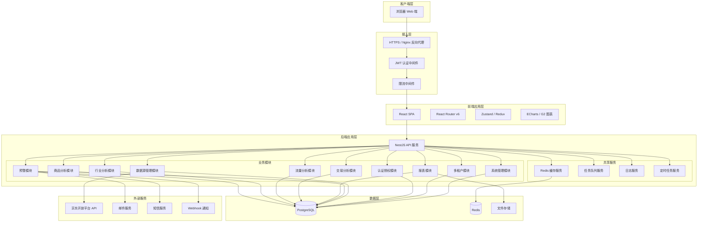
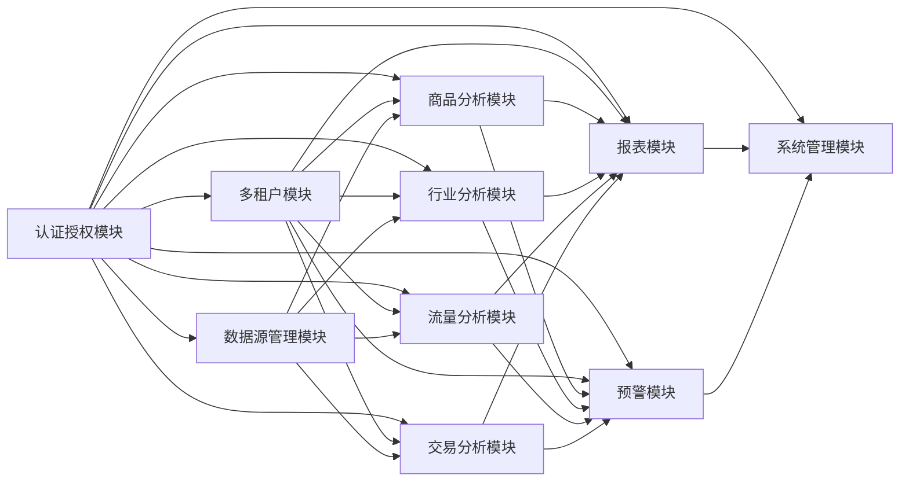
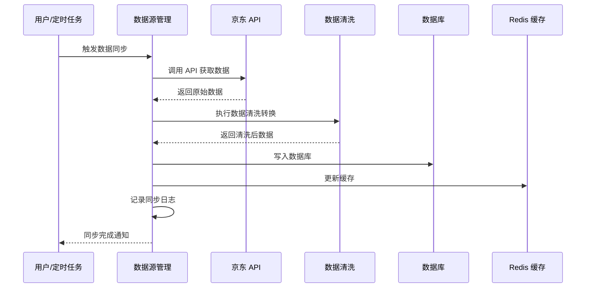
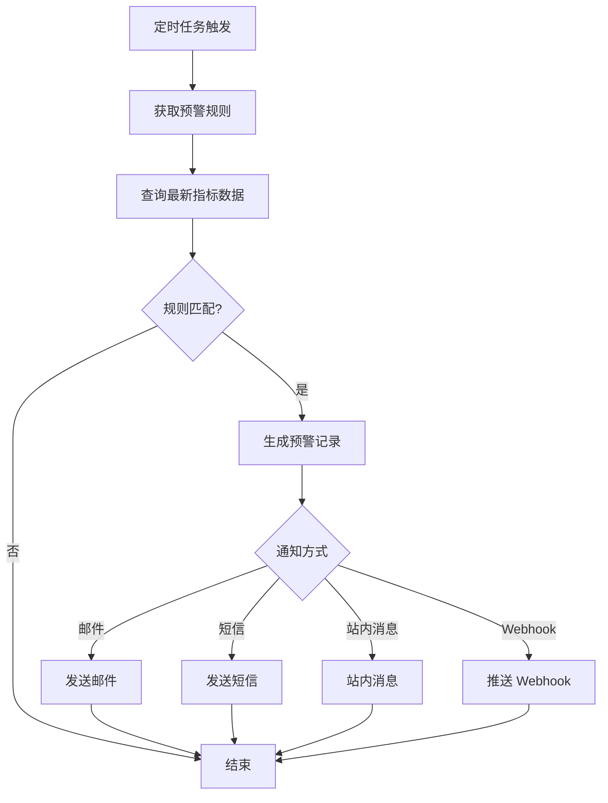
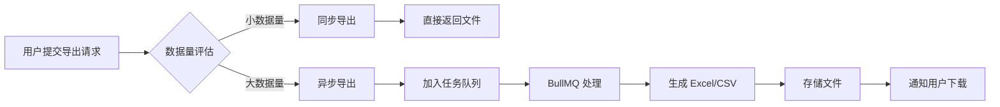
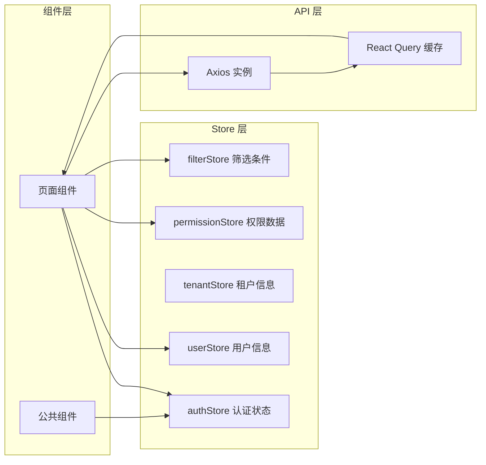
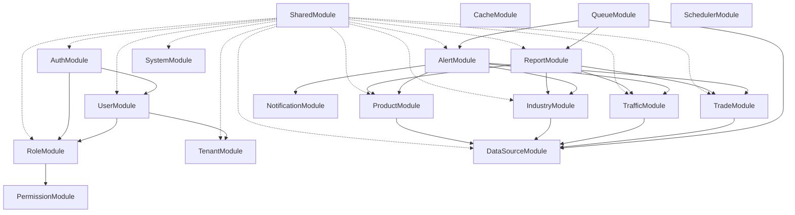
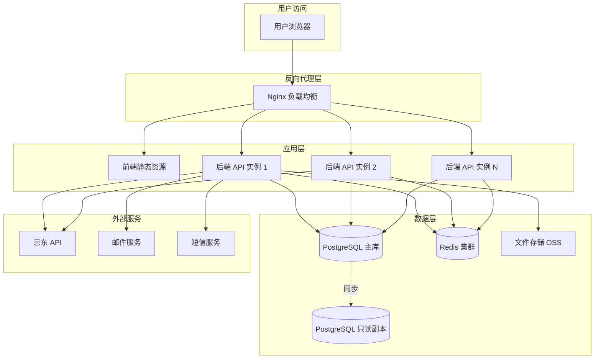

# 京东商智数据分析平台 - 概要设计文档

## 1. 文档概述

### 1.1 文档目的

本文档描述京东商智数据分析平台的系统架构设计，包括系统架构、模块划分、模块间关系、接口概要、数据库概要等，为后续详细设计和开发提供指导。

### 1.2 设计原则

- 前后端分离架构
- 模块化设计，高内聚低耦合
- RESTful API 规范
- 可扩展性优先，预留微服务演进空间

***

## 2. 系统架构设计

### 2.1 整体架构图



### 2.2 分层架构说明

| 层级    | 职责           | 技术                              |
| ----- | ------------ | ------------------------------- |
| 客户端层  | 用户交互、数据展示    | React + TypeScript + Ant Design |
| 接入层   | 请求路由、认证鉴权、限流 | Nginx + JWT + 限流中间件             |
| 应用层   | 业务逻辑处理       | NestJS                          |
| 数据层   | 数据持久化、缓存     | PostgreSQL + Redis              |
| 外部服务层 | 第三方 API 集成   | 京东 API、邮件、短信                    |

***

## 3. 模块划分与关系

### 3.1 模块关系图



### 3.2 模块职责说明

#### 3.2.1 认证授权模块 (Auth Module)

- 用户注册/登录/登出
- JWT Token 生成与验证
- RBAC 权限控制（用户-角色-权限）
- 登录日志记录

#### 3.2.2 多租户模块 (Tenant Module)

- 租户 CRUD
- 租户数据隔离
- 租户配额管理
- 租户自定义配置

#### 3.2.3 商品分析模块 (Product Module)

- 商品概况统计（销量、流量、转化率、排名）
- 商品详情分析（生命周期、价格-销量、评价）
- 商品对比分析（多商品对比、类目分布、库存关联）

#### 3.2.4 行业分析模块 (Industry Module)

- 行业趋势分析（市场规模、增长率、热门类目/关键词）
- 竞品分析（店铺监控、排名追踪、价格策略、营销活动）
- 市场份额分析（分布图、品牌排名、集中度、蓝海/红海识别）

#### 3.2.5 流量分析模块 (Traffic Module)

- 流量概况（访客数、浏览量、趋势图、新老访客、地域分布）
- 流量来源（免费/付费、搜索/推荐/活动、外部引流、渠道转化率）
- 用户画像（性别/年龄/地域、消费能力、购买偏好、行为路径）

#### 3.2.6 交易分析模块 (Trade Module)

- 交易概况（订单数、金额、客单价、支付转化率、退款/退货率）
- 销售分析（销售额趋势、热销排行、促销效果、目标完成度）
- 订单分析（状态分布、地域分布、时间分布、异常监控）

#### 3.2.7 报表模块 (Report Module)

- 自定义筛选（多维度、条件保存、高级筛选、实时预览）
- 数据导出（Excel/CSV、字段自定义、异步导出、导出记录）
- 定时报告（模板配置、定时生成、邮件/站内发送、内容自定义）

#### 3.2.8 预警模块 (Alert Module)

- 预警规则配置（阈值、条件、指标、级别）
- 预警通知（邮件、短信、站内消息、Webhook）
- 预警历史记录

#### 3.2.9 数据源管理模块 (DataSource Module)

- 京东 API 接入（密钥管理、同步配置、限流、重试）
- 自定义数据源（手动录入、Excel/CSV 导入、API 接入、数据库直连）
- 数据同步策略（实时/定时、增量/全量、清洗转换）
- 数据同步日志

#### 3.2.10 系统管理模块 (System Module)

- 系统配置（名称、Logo、通知配置）
- 操作日志
- 系统监控（性能、错误日志）
- 个人中心（信息修改、密码修改、通知偏好、收藏）

### 3.3 模块间依赖关系

| 模块    | 依赖模块           | 被依赖模块      |
| ----- | -------------- | ---------- |
| 认证授权  | -              | 所有模块       |
| 多租户   | 认证授权           | 所有业务模块     |
| 商品分析  | 认证授权、多租户、数据源管理 | 报表、预警      |
| 行业分析  | 认证授权、多租户、数据源管理 | 报表、预警      |
| 流量分析  | 认证授权、多租户、数据源管理 | 报表、预警、交易分析 |
| 交易分析  | 认证授权、多租户、数据源管理 | 报表、预警      |
| 报表    | 认证授权、多租户       | 系统管理       |
| 预警    | 认证授权、多租户       | 系统管理       |
| 数据源管理 | 认证授权           | 所有数据分析模块   |
| 系统管理  | 认证授权           | 报表、预警      |

***

## 4. 各模块详细设计

### 4.1 认证授权模块

#### 4.1.1 内部组件

```
Auth Module
├── controllers/
│   ├── auth.controller.ts        # 登录/注册/登出
│   └── token.controller.ts       # Token 刷新
├── services/
│   ├── auth.service.ts           # 认证核心逻辑
│   ├── jwt.service.ts            # JWT 操作
│   └── password.service.ts       # 密码加密/验证
├── guards/
│   ├── jwt-auth.guard.ts         # JWT 认证守卫
│   └── permission.guard.ts       # 权限守卫
├── strategies/
│   ├── jwt.strategy.ts           # JWT 策略
│   └── local.strategy.ts         # 本地登录策略
└── dto/
    ├── login.dto.ts
    ├── register.dto.ts
    └── refresh-token.dto.ts
```

#### 4.1.2 核心流程

```
登录流程:
用户提交凭证 → 验证身份 → 生成 AccessToken + RefreshToken → 返回客户端
请求流程:
客户端携带 AccessToken → JWT Guard 验证 → 权限 Guard 校验 → 执行业务逻辑
刷新流程:
客户端携带 RefreshToken → 验证有效性 → 生成新的 AccessToken
```

### 4.2 数据分析通用模块设计

商品分析、行业分析、流量分析、交易分析四个模块共享相似的设计模式：

```
Analysis Module (通用结构)
├── controllers/
│   └── {module}.controller.ts    # 接口入口
├── services/
│   ├── {module}.service.ts       # 业务逻辑
│   └── {module}.cache.service.ts # 缓存管理
├── dto/
│   ├── query.dto.ts              # 查询参数 DTO
│   └── response.dto.ts           # 响应 DTO
├── entities/
│   └── {module}.entity.ts        # 数据库实体
└── interfaces/
    └── {module}.interface.ts     # 类型定义
```

### 4.3 数据同步引擎



### 4.4 预警引擎



### 4.5 报表导出引擎



***

## 5. 接口概要设计

### 5.1 统一响应格式

```json
{
  "code": 200,
  "message": "success",
  "data": {},
  "timestamp": 1690000000000
}
```

### 5.2 认证授权接口

| 接口路径                      | 方法   | 描述       | 权限  |
| ------------------------- | ---- | -------- | --- |
| /api/auth/login           | POST | 用户登录     | 公开  |
| /api/auth/register        | POST | 用户注册     | 公开  |
| /api/auth/logout          | POST | 用户登出     | 已认证 |
| /api/auth/refresh-token   | POST | 刷新 Token | 已认证 |
| /api/auth/reset-password  | POST | 重置密码     | 公开  |
| /api/auth/change-password | PUT  | 修改密码     | 已认证 |

### 5.3 用户管理接口

| 接口路径                  | 方法     | 描述      | 权限  |
| --------------------- | ------ | ------- | --- |
| /api/users            | GET    | 用户列表    | 管理员 |
| /api/users/:id        | GET    | 用户详情    | 管理员 |
| /api/users            | POST   | 创建用户    | 管理员 |
| /api/users/:id        | PUT    | 更新用户    | 管理员 |
| /api/users/:id        | DELETE | 删除用户    | 管理员 |
| /api/users/:id/status | PATCH  | 启用/禁用用户 | 管理员 |
| /api/users/:id/roles  | PUT    | 分配角色    | 管理员 |
| /api/users/login-logs | GET    | 登录日志    | 管理员 |

### 5.4 角色与权限接口

| 接口路径                       | 方法     | 描述   | 权限  |
| -------------------------- | ------ | ---- | --- |
| /api/roles                 | GET    | 角色列表 | 管理员 |
| /api/roles                 | POST   | 创建角色 | 管理员 |
| /api/roles/:id             | PUT    | 更新角色 | 管理员 |
| /api/roles/:id             | DELETE | 删除角色 | 管理员 |
| /api/roles/:id/permissions | PUT    | 分配权限 | 管理员 |
| /api/permissions           | GET    | 权限列表 | 管理员 |
| /api/permissions/tree      | GET    | 权限树  | 管理员 |

### 5.5 商品分析接口

| 接口路径                                | 方法   | 描述      | 权限   |
| ----------------------------------- | ---- | ------- | ---- |
| /api/products/overview              | GET  | 商品概况    | 数据查看 |
| /api/products/overview/ranking      | GET  | 商品排名    | 数据查看 |
| /api/products/:id                   | GET  | 商品详情    | 数据查看 |
| /api/products/:id/lifecycle         | GET  | 商品生命周期  | 数据查看 |
| /api/products/:id/price-analysis    | GET  | 价格-销量分析 | 数据查看 |
| /api/products/:id/reviews           | GET  | 商品评价分析  | 数据查看 |
| /api/products/compare               | POST | 多商品对比   | 数据查看 |
| /api/products/category-distribution | GET  | 类目分布    | 数据查看 |
| /api/products/inventory-correlation | GET  | 库存-销量关联 | 数据查看 |

### 5.6 行业分析接口

| 接口路径                                   | 方法  | 描述      | 权限   |
| -------------------------------------- | --- | ------- | ---- |
| /api/industry/trend                    | GET | 行业趋势    | 数据查看 |
| /api/industry/growth-rate              | GET | 行业增长率   | 数据查看 |
| /api/industry/hot-keywords             | GET | 热门关键词   | 数据查看 |
| /api/industry/seasonal                 | GET | 季节性分析   | 数据查看 |
| /api/industry/competitors              | GET | 竞品列表    | 数据查看 |
| /api/industry/competitors/:id          | GET | 竞品详情    | 数据查看 |
| /api/industry/competitors/:id/tracking | GET | 竞品排名追踪  | 数据查看 |
| /api/industry/market-share             | GET | 市场份额分布  | 数据查看 |
| /api/industry/brand-ranking            | GET | 品牌排名    | 数据查看 |
| /api/industry/market-concentration     | GET | 市场集中度   | 数据查看 |
| /api/industry/blue-ocean               | GET | 蓝海/红海识别 | 数据查看 |

### 5.7 流量分析接口

| 接口路径                            | 方法  | 描述     | 权限   |
| ------------------------------- | --- | ------ | ---- |
| /api/traffic/overview           | GET | 流量概况   | 数据查看 |
| /api/traffic/trend              | GET | 流量趋势   | 数据查看 |
| /api/traffic/visitor-ratio      | GET | 新老访客比例 | 数据查看 |
| /api/traffic/region             | GET | 地域分布   | 数据查看 |
| /api/traffic/sources            | GET | 流量来源   | 数据查看 |
| /api/traffic/channel-conversion | GET | 渠道转化率  | 数据查看 |
| /api/traffic/user-profile       | GET | 用户画像   | 数据查看 |
| /api/traffic/user-behavior      | GET | 用户行为路径 | 数据查看 |
| /api/traffic/consumption-tier   | GET | 消费能力分层 | 数据查看 |

### 5.8 交易分析接口

| 接口路径                         | 方法  | 描述      | 权限   |
| ---------------------------- | --- | ------- | ---- |
| /api/trade/overview          | GET | 交易概况    | 数据查看 |
| /api/trade/sales-trend       | GET | 销售额趋势   | 数据查看 |
| /api/trade/top-products      | GET | 热销商品排行  | 数据查看 |
| /api/trade/top-categories    | GET | 热销类目排行  | 数据查看 |
| /api/trade/promotion-effect  | GET | 促销效果分析  | 数据查看 |
| /api/trade/target-completion | GET | 销售目标完成度 | 数据查看 |
| /api/trade/order-status      | GET | 订单状态分布  | 数据查看 |
| /api/trade/order-region      | GET | 订单地域分布  | 数据查看 |
| /api/trade/order-time        | GET | 订单时间分布  | 数据查看 |
| /api/trade/abnormal-orders   | GET | 异常订单监控  | 数据查看 |

### 5.9 报表接口

| 接口路径                             | 方法     | 描述      | 权限   |
| -------------------------------- | ------ | ------- | ---- |
| /api/reports/filters             | POST   | 自定义筛选   | 数据查看 |
| /api/reports/filters/:id         | GET    | 获取保存的筛选 | 数据查看 |
| /api/reports/filters/:id         | PUT    | 更新筛选条件  | 数据查看 |
| /api/reports/filters/:id         | DELETE | 删除筛选条件  | 数据查看 |
| /api/reports/export              | POST   | 提交导出任务  | 导出权限 |
| /api/reports/export/:id/status   | GET    | 导出任务状态  | 导出权限 |
| /api/reports/export/:id/download | GET    | 下载导出文件  | 导出权限 |
| /api/reports/export/history      | GET    | 导出历史记录  | 导出权限 |
| /api/reports/templates           | GET    | 报告模板列表  | 数据查看 |
| /api/reports/templates           | POST   | 创建报告模板  | 数据查看 |
| /api/reports/scheduled           | POST   | 创建定时报告  | 数据查看 |
| /api/reports/scheduled/:id       | GET    | 定时报告详情  | 数据查看 |
| /api/reports/scheduled/:id       | PUT    | 更新定时报告  | 数据查看 |
| /api/reports/scheduled/:id       | DELETE | 删除定时报告  | 数据查看 |

### 5.10 预警接口

| 接口路径                         | 方法     | 描述      | 权限   |
| ---------------------------- | ------ | ------- | ---- |
| /api/alerts/rules            | GET    | 预警规则列表  | 预警配置 |
| /api/alerts/rules            | POST   | 创建预警规则  | 预警配置 |
| /api/alerts/rules/:id        | GET    | 预警规则详情  | 预警配置 |
| /api/alerts/rules/:id        | PUT    | 更新预警规则  | 预警配置 |
| /api/alerts/rules/:id        | DELETE | 删除预警规则  | 预警配置 |
| /api/alerts/rules/:id/toggle | PATCH  | 启用/禁用规则 | 预警配置 |
| /api/alerts/history          | GET    | 预警历史记录  | 数据查看 |
| /api/alerts/history/:id      | GET    | 预警详情    | 数据查看 |
| /api/alerts/history/:id/read | PATCH  | 标记已读    | 数据查看 |

### 5.11 数据源管理接口

| 接口路径                              | 方法     | 描述    | 权限  |
| --------------------------------- | ------ | ----- | --- |
| /api/data-sources                 | GET    | 数据源列表 | 管理员 |
| /api/data-sources                 | POST   | 创建数据源 | 管理员 |
| /api/data-sources/:id             | GET    | 数据源详情 | 管理员 |
| /api/data-sources/:id             | PUT    | 更新数据源 | 管理员 |
| /api/data-sources/:id             | DELETE | 删除数据源 | 管理员 |
| /api/data-sources/:id/sync        | POST   | 手动同步  | 管理员 |
| /api/data-sources/:id/sync-config | PUT    | 同步配置  | 管理员 |
| /api/data-sources/:id/test        | POST   | 测试连接  | 管理员 |
| /api/data-sources/import          | POST   | 文件导入  | 管理员 |
| /api/data-sources/sync-logs       | GET    | 同步日志  | 管理员 |

### 5.12 租户管理接口

| 接口路径                   | 方法   | 描述   | 权限    |
| ---------------------- | ---- | ---- | ----- |
| /api/tenants           | GET  | 租户列表 | 超级管理员 |
| /api/tenants           | POST | 创建租户 | 超级管理员 |
| /api/tenants/:id       | GET  | 租户详情 | 超级管理员 |
| /api/tenants/:id       | PUT  | 更新租户 | 超级管理员 |
| /api/tenants/:id/quota | GET  | 租户配额 | 超级管理员 |
| /api/tenants/:id/quota | PUT  | 更新配额 | 超级管理员 |
| /api/tenants/config    | GET  | 租户配置 | 租户管理员 |
| /api/tenants/config    | PUT  | 更新配置 | 租户管理员 |

### 5.13 系统设置接口

| 接口路径                        | 方法  | 描述     | 权限  |
| --------------------------- | --- | ------ | --- |
| /api/system/config          | GET | 系统配置   | 管理员 |
| /api/system/config          | PUT | 更新系统配置 | 管理员 |
| /api/system/operation-logs  | GET | 操作日志   | 管理员 |
| /api/system/monitor/metrics | GET | 性能指标   | 管理员 |
| /api/system/monitor/errors  | GET | 错误日志   | 管理员 |

### 5.14 个人中心接口

| 接口路径                     | 方法  | 描述     | 权限 |
| ------------------------ | --- | ------ | -- |
| /api/profile             | GET | 个人信息   | 本人 |
| /api/profile             | PUT | 更新个人信息 | 本人 |
| /api/profile/password    | PUT | 修改密码   | 本人 |
| /api/profile/preferences | GET | 通知偏好   | 本人 |
| /api/profile/preferences | PUT | 更新通知偏好 | 本人 |
| /api/profile/favorites   | GET | 我的收藏   | 本人 |
| /api/profile/reports     | GET | 我的报表   | 本人 |

***

## 6. 数据库概要设计

### 6.1 实体关系图

```mermaid
erDiagram
    TENANT ||--o{ USER : has
    TENANT ||--o{ DATA_SOURCE : owns
    TENANT ||--o{ ALERT_RULE : owns
    TENANT ||--o{ REPORT_TEMPLATE : owns
    
    USER ||--o{ USER_ROLE : maps
    ROLE ||--o{ USER_ROLE : maps
    ROLE ||--o{ ROLE_PERMISSION : maps
    PERMISSION ||--o{ ROLE_PERMISSION : maps
    
    PRODUCT ||--o{ SALES_DATA : has
    PRODUCT ||--o{ TRAFFIC_DATA : has
    PRODUCT ||--o{ REVIEW_DATA : has
    PRODUCT ||--o{ INVENTORY_DATA : has
    
    INDUSTRY ||--o{ INDUSTRY_TREND : has
    INDUSTRY ||--o{ COMPETITOR : tracks
    COMPETITOR ||--o{ COMPETITOR_DATA : has
    
    ORDER ||--o{ ORDER_ITEM : contains
    
    DATA_SOURCE ||--o{ SYNC_LOG : generates
    
    ALERT_RULE ||--o{ ALERT_HISTORY : triggers
    
    REPORT_TEMPLATE ||--o{ SCHEDULED_REPORT : generates
    SCHEDULED_REPORT ||--o{ EXPORT_RECORD : creates
    
    TENANT {
        uuid id PK
        string name
        string code
        string status
        json config
        json quota
        datetime created_at
        datetime updated_at
    }
    
    USER {
        uuid id PK
        uuid tenant_id FK
        string username
        string email
        string phone
        string password_hash
        string status
        datetime last_login_at
        datetime created_at
        datetime updated_at
    }
    
    ROLE {
        uuid id PK
        string name
        string code
        string description
        string scope
        datetime created_at
    }
    
    PERMISSION {
        uuid id PK
        string name
        string code
        string type
        string resource
        string action
        datetime created_at
    }
    
    PRODUCT {
        uuid id PK
        uuid tenant_id FK
        string jd_product_id
        string name
        string category
        decimal price
        string status
        datetime created_at
        datetime updated_at
    }
    
    SALES_DATA {
        uuid id PK
        uuid product_id FK
        date stat_date
        integer sales_count
        decimal sales_amount
        decimal conversion_rate
        decimal unit_price
        json extra
    }
    
    TRAFFIC_DATA {
        uuid id PK
        uuid product_id FK
        date stat_date
        integer visitors
        integer page_views
        integer new_visitors
        integer old_visitors
        string source_type
        string region
        json extra
    }
    
    ORDER {
        uuid id PK
        uuid tenant_id FK
        string jd_order_id
        decimal amount
        string status
        datetime order_time
        datetime pay_time
        string region
        json extra
    }
    
    INDUSTRY {
        uuid id PK
        uuid tenant_id FK
        string name
        string category_id
        string level
        datetime created_at
    }
    
    INDUSTRY_TREND {
        uuid id PK
        uuid industry_id FK
        date stat_date
        decimal market_size
        decimal growth_rate
        integer search_volume
        json keywords
        json extra
    }
    
    COMPETITOR {
        uuid id PK
        uuid tenant_id FK
        string jd_shop_id
        string name
        string category
        json config
        datetime created_at
    }
    
    DATA_SOURCE {
        uuid id PK
        uuid tenant_id FK
        string name
        string type
        string status
        json config
        string sync_strategy
        string sync_frequency
        datetime last_sync_at
        datetime created_at
        datetime updated_at
    }
    
    SYNC_LOG {
        uuid id PK
        uuid data_source_id FK
        string status
        string sync_type
        integer records_synced
        text error_message
        datetime started_at
        datetime finished_at
    }
    
    ALERT_RULE {
        uuid id PK
        uuid tenant_id FK
        string name
        string metric
        string condition
        decimal threshold
        string level
        string notify_channels
        boolean is_active
        datetime created_at
        datetime updated_at
    }
    
    ALERT_HISTORY {
        uuid id PK
        uuid alert_rule_id FK
        string level
        string message
        json context
        boolean is_read
        datetime triggered_at
    }
    
    REPORT_TEMPLATE {
        uuid id PK
        uuid tenant_id FK
        string name
        json config
        json content
        string created_by FK
        datetime created_at
        datetime updated_at
    }
    
    SCHEDULED_REPORT {
        uuid id PK
        uuid template_id FK
        string schedule
        string notify_channels
        json recipients
        boolean is_active
        datetime created_at
        datetime updated_at
    }
    
    EXPORT_RECORD {
        uuid id PK
        uuid tenant_id FK
        string type
        string format
        string status
        string file_path
        json query_params
        string created_by FK
        datetime created_at
        datetime finished_at
    }
    
    OPERATION_LOG {
        uuid id PK
        uuid user_id FK
        string action
        string resource
        string method
        string ip
        string user_agent
        json request_params
        datetime created_at
    }
```



### 6.2 核心表结构

#### 6.2.1 用户表 (user)

| 字段              | 类型           | 约束               | 说明                  |
| --------------- | ------------ | ---------------- | ------------------- |
| id              | UUID         | PK               | 主键                  |
| tenant\_id      | UUID         | FK, NOT NULL     | 所属租户                |
| username        | VARCHAR(50)  | UNIQUE, NOT NULL | 用户名                 |
| email           | VARCHAR(100) | UNIQUE           | 邮箱                  |
| phone           | VARCHAR(20)  | UNIQUE           | 手机号                 |
| password\_hash  | VARCHAR(255) | NOT NULL         | 密码哈希                |
| nickname        | VARCHAR(50)  | <br />           | 昵称                  |
| avatar          | VARCHAR(255) | <br />           | 头像URL               |
| status          | VARCHAR(20)  | NOT NULL         | 状态: active/disabled |
| last\_login\_at | TIMESTAMP    | <br />           | 最后登录时间              |
| last\_login\_ip | VARCHAR(45)  | <br />           | 最后登录IP              |
| created\_at     | TIMESTAMP    | NOT NULL         | 创建时间                |
| updated\_at     | TIMESTAMP    | NOT NULL         | 更新时间                |

#### 6.2.2 角色表 (role)

| 字段          | 类型           | 约束               | 说明                |
| ----------- | ------------ | ---------------- | ----------------- |
| id          | UUID         | PK               | 主键                |
| name        | VARCHAR(50)  | NOT NULL         | 角色名称              |
| code        | VARCHAR(50)  | UNIQUE, NOT NULL | 角色编码              |
| description | VARCHAR(255) | <br />           | 描述                |
| scope       | VARCHAR(20)  | NOT NULL         | 范围: system/tenant |
| is\_system  | BOOLEAN      | DEFAULT false    | 是否系统预置            |
| created\_at | TIMESTAMP    | NOT NULL         | 创建时间              |
| updated\_at | TIMESTAMP    | NOT NULL         | 更新时间              |

#### 6.2.3 权限表 (permission)

| 字段          | 类型           | 约束               | 说明                            |
| ----------- | ------------ | ---------------- | ----------------------------- |
| id          | UUID         | PK               | 主键                            |
| name        | VARCHAR(50)  | NOT NULL         | 权限名称                          |
| code        | VARCHAR(100) | UNIQUE, NOT NULL | 权限编码                          |
| type        | VARCHAR(20)  | NOT NULL         | 类型: menu/button/api/data      |
| resource    | VARCHAR(100) | <br />           | 资源标识                          |
| action      | VARCHAR(50)  | <br />           | 操作: create/read/update/delete |
| parent\_id  | UUID         | FK, nullable     | 父权限ID                         |
| sort        | INTEGER      | DEFAULT 0        | 排序                            |
| created\_at | TIMESTAMP    | NOT NULL         | 创建时间                          |

#### 6.2.4 用户角色关联表 (user\_role)

| 字段       | 类型   | 约束           | 说明   |
| -------- | ---- | ------------ | ---- |
| id       | UUID | PK           | 主键   |
| user\_id | UUID | FK, NOT NULL | 用户ID |
| role\_id | UUID | FK, NOT NULL | 角色ID |

#### 6.2.5 租户表 (tenant)

| 字段             | 类型           | 约束               | 说明                   |
| -------------- | ------------ | ---------------- | -------------------- |
| id             | UUID         | PK               | 主键                   |
| name           | VARCHAR(100) | NOT NULL         | 租户名称                 |
| code           | VARCHAR(50)  | UNIQUE, NOT NULL | 租户编码                 |
| status         | VARCHAR(20)  | NOT NULL         | 状态: active/suspended |
| contact\_name  | VARCHAR(50)  | <br />           | 联系人                  |
| contact\_phone | VARCHAR(20)  | <br />           | 联系电话                 |
| contact\_email | VARCHAR(100) | <br />           | 联系邮箱                 |
| config         | JSONB        | <br />           | 租户自定义配置              |
| quota          | JSONB        | <br />           | 配额配置                 |
| expire\_at     | TIMESTAMP    | <br />           | 过期时间                 |
| created\_at    | TIMESTAMP    | NOT NULL         | 创建时间                 |
| updated\_at    | TIMESTAMP    | NOT NULL         | 更新时间                 |

#### 6.2.6 商品表 (product)

| 字段               | 类型            | 约束           | 说明                     |
| ---------------- | ------------- | ------------ | ---------------------- |
| id               | UUID          | PK           | 主键                     |
| tenant\_id       | UUID          | FK, NOT NULL | 所属租户                   |
| jd\_product\_id  | VARCHAR(50)   | <br />       | 京东商品ID                 |
| name             | VARCHAR(255)  | NOT NULL     | 商品名称                   |
| category\_id     | UUID          | FK           | 类目ID                   |
| category\_path   | VARCHAR(255)  | <br />       | 类目路径                   |
| price            | DECIMAL(10,2) | <br />       | 当前价格                   |
| original\_price  | DECIMAL(10,2) | <br />       | 原价                     |
| main\_image      | VARCHAR(255)  | <br />       | 主图URL                  |
| status           | VARCHAR(20)   | NOT NULL     | 状态: on\_sale/off\_sale |
| first\_seen\_at  | TIMESTAMP     | <br />       | 首次发现时间                 |
| last\_synced\_at | TIMESTAMP     | <br />       | 最后同步时间                 |
| created\_at      | TIMESTAMP     | NOT NULL     | 创建时间                   |
| updated\_at      | TIMESTAMP     | NOT NULL     | 更新时间                   |

索引：`(tenant_id)`, `(jd_product_id)`, `(category_id)`, `(status)`

#### 6.2.7 销售数据表 (sales\_data)

| 字段                  | 类型            | 约束           | 说明              |
| ------------------- | ------------- | ------------ | --------------- |
| id                  | UUID          | PK           | 主键              |
| product\_id         | UUID          | FK, NOT NULL | 商品ID            |
| tenant\_id          | UUID          | FK, NOT NULL | 租户ID（冗余，用于分区查询） |
| stat\_date          | DATE          | NOT NULL     | 统计日期            |
| sales\_count        | INTEGER       | DEFAULT 0    | 销量              |
| sales\_amount       | DECIMAL(12,2) | DEFAULT 0    | 销售额             |
| visitors            | INTEGER       | DEFAULT 0    | 访客数             |
| page\_views         | INTEGER       | DEFAULT 0    | 浏览量             |
| conversion\_rate    | DECIMAL(5,4)  | <br />       | 转化率             |
| unit\_price         | DECIMAL(10,2) | <br />       | 件单价             |
| search\_visitors    | INTEGER       | DEFAULT 0    | 搜索访客            |
| recommend\_visitors | INTEGER       | DEFAULT 0    | 推荐访客            |
| activity\_visitors  | INTEGER       | DEFAULT 0    | 活动访客            |
| extra               | JSONB         | <br />       | 扩展字段            |

索引：`(product_id, stat_date)`, `(tenant_id, stat_date)`, `(stat_date)`

#### 6.2.8 流量数据表 (traffic\_data)

| 字段            | 类型          | 约束           | 说明   |
| ------------- | ----------- | ------------ | ---- |
| id            | UUID        | PK           | 主键   |
| product\_id   | UUID        | FK, NOT NULL | 商品ID |
| tenant\_id    | UUID        | FK, NOT NULL | 租户ID |
| stat\_date    | DATE        | NOT NULL     | 统计日期 |
| visitors      | INTEGER     | DEFAULT 0    | 访客数  |
| page\_views   | INTEGER     | DEFAULT 0    | 浏览量  |
| new\_visitors | INTEGER     | DEFAULT 0    | 新访客数 |
| old\_visitors | INTEGER     | DEFAULT 0    | 老访客数 |
| source\_type  | VARCHAR(30) | <br />       | 来源类型 |
| region        | VARCHAR(50) | <br />       | 地域   |
| extra         | JSONB       | <br />       | 扩展字段 |

索引：`(product_id, stat_date)`, `(tenant_id, stat_date)`

#### 6.2.9 订单表 (order)

| 字段               | 类型            | 约束           | 说明     |
| ---------------- | ------------- | ------------ | ------ |
| id               | UUID          | PK           | 主键     |
| tenant\_id       | UUID          | FK, NOT NULL | 所属租户   |
| jd\_order\_id    | VARCHAR(50)   | <br />       | 京东订单ID |
| amount           | DECIMAL(12,2) | NOT NULL     | 订单金额   |
| product\_count   | INTEGER       | DEFAULT 0    | 商品数量   |
| status           | VARCHAR(20)   | NOT NULL     | 状态     |
| order\_time      | TIMESTAMP     | NOT NULL     | 下单时间   |
| pay\_time        | TIMESTAMP     | <br />       | 支付时间   |
| region\_province | VARCHAR(50)   | <br />       | 省份     |
| region\_city     | VARCHAR(50)   | <br />       | 城市     |
| extra            | JSONB         | <br />       | 扩展字段   |

索引：`(tenant_id, order_time)`, `(tenant_id, status)`, `(jd_order_id)`

#### 6.2.10 数据源表 (data\_source)

| 字段                 | 类型           | 约束           | 说明                                   |
| ------------------ | ------------ | ------------ | ------------------------------------ |
| id                 | UUID         | PK           | 主键                                   |
| tenant\_id         | UUID         | FK, NOT NULL | 所属租户                                 |
| name               | VARCHAR(100) | NOT NULL     | 数据源名称                                |
| type               | VARCHAR(30)  | NOT NULL     | 类型: jd\_api/csv/excel/custom\_api/db |
| status             | VARCHAR(20)  | NOT NULL     | 状态: active/inactive/error            |
| config             | JSONB        | NOT NULL     | 连接配置（加密存储）                           |
| sync\_strategy     | VARCHAR(20)  | NOT NULL     | 同步策略: real\_time/scheduled/manual    |
| sync\_frequency    | VARCHAR(20)  | <br />       | 同步频率                                 |
| last\_sync\_at     | TIMESTAMP    | <br />       | 最后同步时间                               |
| last\_sync\_status | VARCHAR(20)  | <br />       | 最后同步状态                               |
| created\_by        | UUID         | FK           | 创建人                                  |
| created\_at        | TIMESTAMP    | NOT NULL     | 创建时间                                 |
| updated\_at        | TIMESTAMP    | NOT NULL     | 更新时间                                 |

#### 6.2.11 同步日志表 (sync\_log)

| 字段               | 类型          | 约束           | 说明                         |
| ---------------- | ----------- | ------------ | -------------------------- |
| id               | UUID        | PK           | 主键                         |
| data\_source\_id | UUID        | FK, NOT NULL | 数据源ID                      |
| status           | VARCHAR(20) | NOT NULL     | 状态: success/failed/running |
| sync\_type       | VARCHAR(20) | NOT NULL     | 类型: full/incremental       |
| records\_synced  | INTEGER     | DEFAULT 0    | 同步记录数                      |
| error\_message   | TEXT        | <br />       | 错误信息                       |
| started\_at      | TIMESTAMP   | NOT NULL     | 开始时间                       |
| finished\_at     | TIMESTAMP   | <br />       | 结束时间                       |

#### 6.2.12 预警规则表 (alert\_rule)

| 字段               | 类型            | 约束           | 说明                        |
| ---------------- | ------------- | ------------ | ------------------------- |
| id               | UUID          | PK           | 主键                        |
| tenant\_id       | UUID          | FK, NOT NULL | 所属租户                      |
| name             | VARCHAR(100)  | NOT NULL     | 规则名称                      |
| metric           | VARCHAR(50)   | NOT NULL     | 监控指标                      |
| condition        | VARCHAR(10)   | NOT NULL     | 条件: gt/lt/gte/lte/eq      |
| threshold        | DECIMAL(15,4) | NOT NULL     | 阈值                        |
| level            | VARCHAR(20)   | NOT NULL     | 级别: info/warning/critical |
| notify\_channels | VARCHAR(255)  | NOT NULL     | 通知渠道（逗号分隔）                |
| is\_active       | BOOLEAN       | DEFAULT true | 是否启用                      |
| created\_by      | UUID          | FK           | 创建人                       |
| created\_at      | TIMESTAMP     | NOT NULL     | 创建时间                      |
| updated\_at      | TIMESTAMP     | NOT NULL     | 更新时间                      |

#### 6.2.13 报表模板表 (report\_template)

| 字段          | 类型           | 约束            | 说明     |
| ----------- | ------------ | ------------- | ------ |
| id          | UUID         | PK            | 主键     |
| tenant\_id  | UUID         | FK, NOT NULL  | 所属租户   |
| name        | VARCHAR(100) | NOT NULL      | 模板名称   |
| config      | JSONB        | NOT NULL      | 模板配置   |
| content     | JSONB        | <br />        | 模板内容   |
| is\_system  | BOOLEAN      | DEFAULT false | 是否系统模板 |
| created\_by | UUID         | FK            | 创建人    |
| created\_at | TIMESTAMP    | NOT NULL      | 创建时间   |
| updated\_at | TIMESTAMP    | NOT NULL      | 更新时间   |

#### 6.2.14 导出记录表 (export\_record)

| 字段            | 类型           | 约束           | 说明                                      |
| ------------- | ------------ | ------------ | --------------------------------------- |
| id            | UUID         | PK           | 主键                                      |
| tenant\_id    | UUID         | FK, NOT NULL | 所属租户                                    |
| type          | VARCHAR(30)  | NOT NULL     | 导出类型                                    |
| format        | VARCHAR(10)  | NOT NULL     | 格式: xlsx/csv                            |
| status        | VARCHAR(20)  | NOT NULL     | 状态: pending/processing/completed/failed |
| file\_path    | VARCHAR(255) | <br />       | 文件路径                                    |
| file\_size    | BIGINT       | <br />       | 文件大小(bytes)                             |
| query\_params | JSONB        | <br />       | 查询参数                                    |
| created\_by   | UUID         | FK           | 创建人                                     |
| created\_at   | TIMESTAMP    | NOT NULL     | 创建时间                                    |
| finished\_at  | TIMESTAMP    | <br />       | 完成时间                                    |

#### 6.2.15 操作日志表 (operation\_log)

| 字段              | 类型           | 约束       | 说明     |
| --------------- | ------------ | -------- | ------ |
| id              | UUID         | PK       | 主键     |
| user\_id        | UUID         | FK       | 用户ID   |
| tenant\_id      | UUID         | FK       | 租户ID   |
| action          | VARCHAR(50)  | NOT NULL | 操作类型   |
| resource        | VARCHAR(100) | <br />   | 操作资源   |
| method          | VARCHAR(10)  | <br />   | HTTP方法 |
| ip              | VARCHAR(45)  | <br />   | IP地址   |
| user\_agent     | VARCHAR(255) | <br />   | 用户代理   |
| request\_params | JSONB        | <br />   | 请求参数   |
| created\_at     | TIMESTAMP    | NOT NULL | 创建时间   |

### 6.3 数据库索引策略

| 表名             | 索引字段                                  | 索引类型   | 说明        |
| -------------- | ------------------------------------- | ------ | --------- |
| sales\_data    | (product\_id, stat\_date)             | 复合唯一索引 | 防止重复数据    |
| sales\_data    | (tenant\_id, stat\_date)              | 复合索引   | 租户维度查询    |
| traffic\_data  | (product\_id, stat\_date)             | 复合唯一索引 | 防止重复数据    |
| traffic\_data  | (tenant\_id, stat\_date)              | 复合索引   | 租户维度查询    |
| order          | (tenant\_id, order\_time)             | 复合索引   | 租户+时间范围查询 |
| user           | (tenant\_id)                          | 普通索引   | 租户下用户查询   |
| operation\_log | (tenant\_id, created\_at)             | 复合索引   | 日志分页查询    |
| alert\_history | (tenant\_id, is\_read, triggered\_at) | 复合索引   | 未读预警查询    |

### 6.4 分区策略

对于大数据量表（sales\_data、traffic\_data），建议按时间分区：

```sql
-- sales_data 按月分区
PARTITION BY RANGE (stat_date)

-- 示例分区
PARTITION p_2026_01 VALUES LESS THAN ('2026-02-01')
PARTITION p_2026_02 VALUES LESS THAN ('2026-03-01')
...
```

***

## 7. 前端架构设计

### 7.1 前端目录结构

```
frontend/src/
├── api/                    # API 请求层
│   ├── request.ts          # Axios 封装
│   ├── auth.ts             # 认证接口
│   ├── product.ts          # 商品分析接口
│   ├── industry.ts         # 行业分析接口
│   ├── traffic.ts          # 流量分析接口
│   ├── trade.ts            # 交易分析接口
│   ├── report.ts           # 报表接口
│   ├── alert.ts            # 预警接口
│   ├── dataSource.ts       # 数据源接口
│   └── system.ts           # 系统管理接口
├── assets/                 # 静态资源
│   ├── images/
│   └── icons/
├── components/             # 公共组件
│   ├── Layout/             # 布局组件
│   │   ├── Header.tsx
│   │   ├── Sidebar.tsx
│   │   └── Footer.tsx
│   ├── Charts/             # 图表组件
│   │   ├── LineChart.tsx
│   │   ├── BarChart.tsx
│   │   ├── PieChart.tsx
│   │   └── DataTable.tsx
│   ├── FilterBar/          # 筛选组件
│   ├── DateRangePicker/    # 日期范围选择
│   └── ExportButton/       # 导出按钮
├── hooks/                  # 自定义 Hooks
│   ├── useAuth.ts          # 认证 Hook
│   ├── usePermission.ts    # 权限 Hook
│   ├── useTenant.ts        # 租户 Hook
│   └── useDebounce.ts      # 防抖 Hook
├── layouts/                # 页面布局
│   ├── MainLayout.tsx      # 主布局
│   └── AuthLayout.tsx      # 认证布局
├── pages/                  # 页面组件
│   ├── Login/              # 登录页
│   ├── Dashboard/          # 首页仪表盘
│   ├── Product/            # 商品分析
│   │   ├── Overview.tsx
│   │   ├── Detail.tsx
│   │   └── Compare.tsx
│   ├── Industry/           # 行业分析
│   │   ├── Trend.tsx
│   │   ├── Competitor.tsx
│   │   └── MarketShare.tsx
│   ├── Traffic/            # 流量分析
│   │   ├── Overview.tsx
│   │   ├── Sources.tsx
│   │   └── UserProfile.tsx
│   ├── Trade/              # 交易分析
│   │   ├── Overview.tsx
│   │   ├── Sales.tsx
│   │   └── Orders.tsx
│   ├── Report/             # 报表中心
│   │   ├── Custom.tsx
│   │   ├── Scheduled.tsx
│   │   └── Exports.tsx
│   ├── Alert/              # 预警中心
│   │   ├── Rules.tsx
│   │   └── History.tsx
│   ├── DataSource/         # 数据源管理
│   │   ├── List.tsx
│   │   └── Config.tsx
│   ├── System/             # 系统管理
│   │   ├── Users.tsx
│   │   ├── Roles.tsx
│   │   ├── Permissions.tsx
│   │   └── Logs.tsx
│   └── Profile/            # 个人中心
├── router/                 # 路由配置
│   ├── index.tsx           # 路由定义
│   └── guards.tsx          # 路由守卫
├── store/                  # 状态管理
│   ├── authStore.ts        # 认证状态
│   ├── userStore.ts        # 用户状态
│   ├── tenantStore.ts      # 租户状态
│   └── permissionStore.ts  # 权限状态
├── styles/                 # 全局样式
│   ├── global.css
│   └── variables.css
├── types/                  # TypeScript 类型定义
│   ├── auth.d.ts
│   ├── api.d.ts
│   ├── common.d.ts
│   └── index.d.ts
├── utils/                  # 工具函数
│   ├── format.ts           # 数据格式化
│   ├── auth.ts             # 认证工具
│   ├── storage.ts          # 本地存储
│   └── validators.ts       # 表单验证
├── App.tsx
└── main.tsx
```

### 7.2 前端路由设计

```
/                       → 登录页（未登录） / 首页仪表盘（已登录）
/login                  → 登录页
/register               → 注册页
/dashboard              → 首页仪表盘
/product/overview       → 商品概况
/product/detail/:id     → 商品详情
/product/compare        → 商品对比
/industry/trend         → 行业趋势
/industry/competitor    → 竞品分析
/industry/market-share  → 市场份额
/traffic/overview       → 流量概况
/traffic/sources        → 流量来源
/traffic/user-profile   → 用户画像
/trade/overview         → 交易概况
/trade/sales            → 销售分析
/trade/orders           → 订单分析
/report/custom          → 自定义报表
/report/scheduled       → 定时报告
/report/exports         → 导出记录
/alert/rules            → 预警规则
/alert/history          → 预警历史
/data-source/list       → 数据源列表
/data-source/config     → 数据源配置
/system/users           → 用户管理
/system/roles           → 角色管理
/system/permissions     → 权限管理
/system/logs            → 操作日志
/profile                → 个人中心
```

### 7.3 前端状态管理设计



***

## 8. 后端架构设计

### 8.1 后端目录结构

```
backend/src/
├── common/                 # 公共模块
│   ├── decorators/         # 自定义装饰器
│   │   ├── public.decorator.ts
│   │   ├── roles.decorator.ts
│   │   └── permissions.decorator.ts
│   ├── filters/            # 异常过滤器
│   │   ├── http-exception.filter.ts
│   │   └── all-exception.filter.ts
│   ├── interceptors/       # 拦截器
│   │   ├── transform.interceptor.ts
│   │   ├── logging.interceptor.ts
│   │   └── timeout.interceptor.ts
│   ├── guards/             # 守卫
│   │   ├── jwt-auth.guard.ts
│   │   ├── roles.guard.ts
│   │   └── permissions.guard.ts
│   ├── pipes/              # 管道
│   │   └── validation.pipe.ts
│   ├── middleware/         # 中间件
│   │   ├── tenant.middleware.ts
│   │   └── rate-limit.middleware.ts
│   └── dto/                # 公共 DTO
│       ├── pagination.dto.ts
│       └── response.dto.ts
├── config/                 # 配置文件
│   ├── app.config.ts
│   ├── database.config.ts
│   ├── redis.config.ts
│   ├── jwt.config.ts
│   └── queue.config.ts
├── modules/                # 业务模块
│   ├── auth/               # 认证模块
│   ├── user/               # 用户模块
│   ├── role/               # 角色模块
│   ├── permission/         # 权限模块
│   ├── tenant/             # 租户模块
│   ├── product/            # 商品分析模块
│   ├── industry/           # 行业分析模块
│   ├── traffic/            # 流量分析模块
│   ├── trade/              # 交易分析模块
│   ├── report/             # 报表模块
│   ├── alert/              # 预警模块
│   ├── data-source/        # 数据源模块
│   └── system/             # 系统管理模块
├── shared/                 # 共享服务
│   ├── cache/              # 缓存服务
│   │   ├── cache.service.ts
│   │   └── cache.module.ts
│   ├── queue/              # 队列服务
│   │   ├── queue.service.ts
│   │   ├── queue.module.ts
│   │   └── processors/     # 任务处理器
│   │       ├── export.processor.ts
│   │       ├── sync.processor.ts
│   │       └── alert.processor.ts
│   ├── scheduler/          # 定时任务
│   │   ├── scheduler.service.ts
│   │   └── tasks/
│   ├── logger/             # 日志服务
│   ├── file/               # 文件服务
│   └── notification/       # 通知服务
│       ├── email.service.ts
│       ├── sms.service.ts
│       └── webhook.service.ts
├── database/               # 数据库相关
│   ├── entities/           # 数据库实体
│   ├── migrations/         # 数据库迁移
│   └── seeds/              # 种子数据
└── main.ts                 # 入口文件
```

### 8.2 NestJS 模块依赖图



***

## 9. 部署架构

### 9.1 部署架构图



### 9.2 Docker Compose 服务编排

| 服务       | 镜像                     | 端口     | 说明          |
| -------- | ---------------------- | ------ | ----------- |
| nginx    | nginx:latest           | 80/443 | 反向代理        |
| frontend | node:20-alpine (build) | -      | 前端构建产物      |
| backend  | node:20-alpine         | 3000   | 后端 API 服务   |
| postgres | postgres:15            | 5432   | 主数据库        |
| redis    | redis:7-alpine         | 6379   | 缓存服务        |
| pgadmin  | dpage/pgadmin4         | 5050   | 数据库管理（开发环境） |

### 9.3 环境变量配置

| 变量                          | 说明                | 示例值              |
| --------------------------- | ----------------- | ---------------- |
| NODE\_ENV                   | 运行环境              | production       |
| PORT                        | API 端口            | 3000             |
| DATABASE\_HOST              | 数据库地址             | postgres         |
| DATABASE\_PORT              | 数据库端口             | 5432             |
| DATABASE\_NAME              | 数据库名              | sz\_analytics    |
| DATABASE\_USER              | 数据库用户             | sz\_user         |
| DATABASE\_PASSWORD          | 数据库密码             | \*\*\*           |
| REDIS\_HOST                 | Redis 地址          | redis            |
| REDIS\_PORT                 | Redis 端口          | 6379             |
| JWT\_SECRET                 | JWT 密钥            | \*\*\*           |
| JWT\_EXPIRES\_IN            | Token 有效期         | 2h               |
| REFRESH\_TOKEN\_EXPIRES\_IN | Refresh Token 有效期 | 7d               |
| JD\_APP\_KEY                | 京东 App Key        | \*\*\*           |
| JD\_APP\_SECRET             | 京东 App Secret     | \*\*\*           |
| EMAIL\_HOST                 | 邮件服务器             | smtp.example.com |
| SMS\_PROVIDER               | 短信服务商             | aliyun           |

***

## 10. 缓存设计

### 10.1 缓存策略

| 数据类型         | 缓存时间      | 缓存键                                    | 更新策略      |
| ------------ | --------- | -------------------------------------- | --------- |
| 用户信息         | 30 min    | `user:{userId}`                        | 用户信息变更时删除 |
| 权限列表         | 2 h       | `permissions:{userId}`                 | 权限变更时删除   |
| 商品概况         | 1 h       | `product:overview:{tenantId}:{params}` | 数据同步后刷新   |
| 流量概况         | 30 min    | `traffic:overview:{tenantId}:{params}` | 数据同步后刷新   |
| 行业趋势         | 6 h       | `industry:trend:{industryId}`          | 定时刷新      |
| 交易概况         | 1 h       | `trade:overview:{tenantId}:{params}`   | 数据同步后刷新   |
| 用户 Token 黑名单 | Token 有效期 | `token:blacklist:{jti}`                | 自动过期      |
| 预警规则         | 1 h       | `alert:rules:{tenantId}`               | 规则变更时删除   |

### 10.2 Redis 数据结构使用

| 数据结构   | 用途                     |
| ------ | ---------------------- |
| String | 缓存数据、Session、Token 黑名单 |
| Hash   | 用户信息、配置信息              |
| Set    | 用户角色、权限集合              |
| ZSet   | 排行榜（商品排名、销售排行）         |
| List   | 消息队列、通知列表              |
| Stream | 操作日志流、实时数据流            |

***

## 11. 安全设计

### 11.1 认证与授权

- JWT Token 认证，AccessToken 有效期 2 小时
- Refresh Token 机制，支持无感刷新，有效期 7 天
- bcrypt 密码加密存储
- 接口级权限校验（JWT Guard + Permission Guard）

### 11.2 数据安全

- HTTPS 全站加密传输
- SQL 注入防护（TypeORM/Prisma 参数化查询）
- XSS 防护（前端输入过滤，CSP 策略）
- CSRF 防护（Token 验证）
- 敏感数据脱敏展示（手机号、邮箱等）

### 11.3 多租户数据隔离

- 逻辑隔离：所有业务表包含 tenant\_id，通过中间件自动注入租户条件
- 租户中间件：请求解析租户标识，自动追加 WHERE tenant\_id = ?

### 11.4 审计日志

- 操作日志记录：用户、操作、资源、IP、时间
- 登录日志记录：登录时间、IP、设备信息
- 数据同步日志：同步状态、记录数、错误信息

***

## 12. 监控与运维

### 12.1 应用监控

- 接口响应时间监控
- 错误率监控
- JVM/Node.js 内存使用监控
- 数据库连接池监控

### 12.2 业务监控

- 数据同步成功率
- API 调用成功率
- 报表导出成功率
- 预警触发频率

### 12.3 日志管理

- 应用日志：分级（DEBUG/INFO/WARN/ERROR）
- 访问日志：请求路径、方法、响应码、耗时
- 业务日志：关键操作记录
- 日志聚合：集中收集、查询、告警

***

## 13. 可扩展性设计

### 13.1 水平扩展

- 后端 API 无状态设计，支持多实例部署
- Redis 支持集群模式
- PostgreSQL 支持读写分离

### 13.2 功能扩展

- 插件化架构：数据分析模块可独立开发、部署
- 配置化报表：通过 JSON 配置生成报表
- 数据源可插拔：统一数据源接口，支持自定义接入

### 13.3 国际化预留

- 前端 i18n 框架预留
- 数据库多语言字段设计
- 后端国际化中间件预留

### 13.4 微服务演进

- 当前单体应用，按模块划分清晰
- 后续可按模块拆分为独立微服务
- 使用消息队列实现服务间异步通信

***

## 14. 技术选型汇总

### 14.1 前端

| 类别     | 选型                  | 说明        |
| ------ | ------------------- | --------- |
| 框架     | React 18+           | 主流前端框架    |
| 语言     | TypeScript          | 类型安全      |
| UI 组件库 | Ant Design 5+       | 企业级组件     |
| 状态管理   | Zustand             | 轻量级状态管理   |
| 路由     | React Router v6     | 前端路由      |
| 数据请求   | Axios + React Query | API 请求与缓存 |
| 图表库    | ECharts 5+          | 数据可视化     |
| 构建工具   | Vite 5+             | 快速构建      |
| 代码规范   | ESLint + Prettier   | 代码质量      |

### 14.2 后端

| 类别     | 选型              | 说明             |
| ------ | --------------- | -------------- |
| 框架     | NestJS 10+      | 企业级 Node.js 框架 |
| 语言     | TypeScript      | 前后端类型一致        |
| ORM    | TypeORM         | 数据库操作          |
| 认证     | JWT + Passport  | 身份认证           |
| 缓存     | Redis           | 热点数据缓存         |
| 任务队列   | BullMQ          | 异步任务处理         |
| API 文档 | Swagger/OpenAPI | 接口文档           |
| 验证     | class-validator | 参数校验           |

### 14.3 基础设施

| 类别    | 选型                      | 说明        |
| ----- | ----------------------- | --------- |
| 数据库   | PostgreSQL 15+          | 主数据库      |
| 缓存    | Redis 7+                | 缓存        |
| 容器化   | Docker + Docker Compose | 开发/部署     |
| 反向代理  | Nginx                   | 负载均衡、静态资源 |
| CI/CD | GitHub Actions          | 自动化构建部署   |

***

## 15. 待确认事项

| 序号 | 事项               | 影响范围       |
| -- | ---------------- | ---------- |
| 1  | 京东开放平台开发者账号是否已有？ | 数据源对接      |
| 2  | 部署环境（云服务器/云平台）？  | 部署架构       |
| 3  | 邮件、短信服务供应商选择？    | 通知模块       |
| 4  | 历史数据保留周期？        | 数据库设计、冷热分离 |
| 5  | 后续是否需要移动端？       | API 设计     |
| 6  | 是否需要多语言支持？       | 国际化预留      |

***

> **文档版本**: v1.0\
> **创建日期**: 2026-06-03\
> **最后更新**: 2026-06-03

