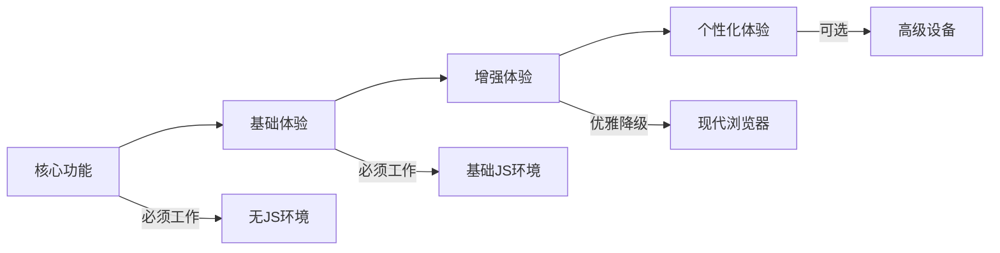
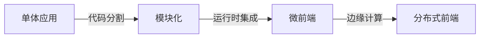
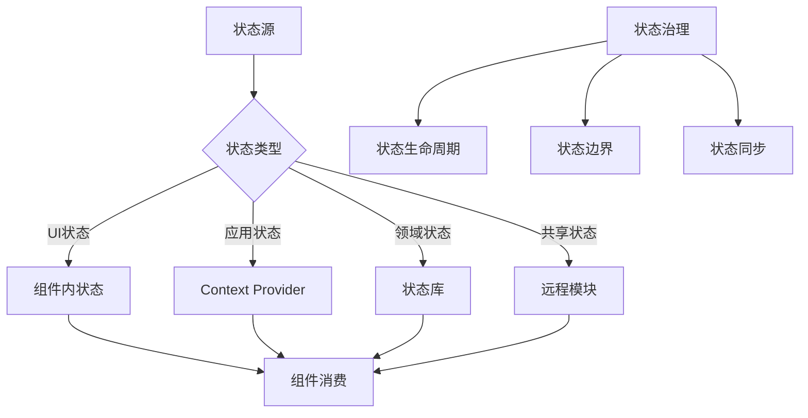
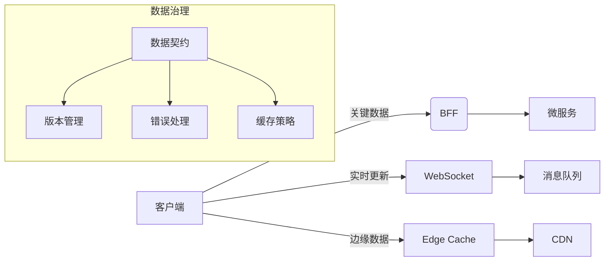
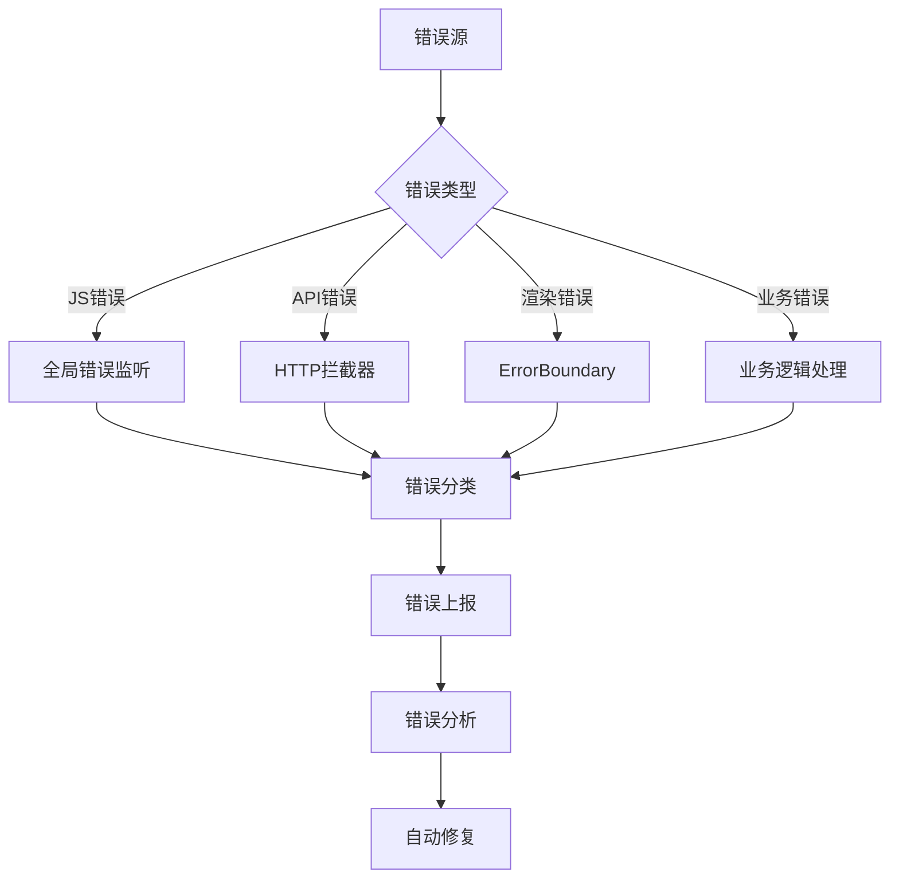
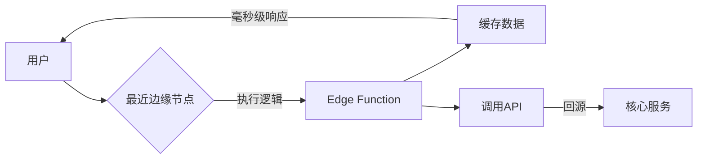
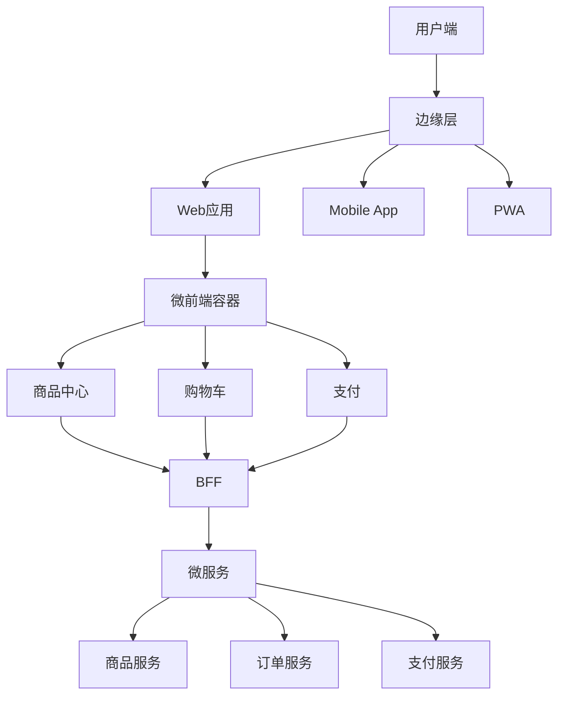

# 前端系统设计：架构师的全栈思维与实战指南

作为前端架构师，**系统设计**已从单纯的"页面实现"升级为**构建可扩展、高性能、高可用的前端生态系统**。这不仅是技术选型问题，更是**连接业务需求与技术实现的战略桥梁**。以下是我基于多个亿级DAU应用的实战经验总结，聚焦**架构思维**、**设计模式**和**落地陷阱**，助你设计真正可扩展的前端系统。

---

## 一、前端系统设计的本质：超越"切页面"的认知

### 1. 传统认知 vs 现代挑战
| 传统认知 | 现代挑战 | 架构影响 |
|----------|----------|----------|
| "前端即UI层" | 前端是**完整应用层** | 需要全栈思维 |
| "关注浏览器兼容" | 关注**多端体验一致性** | 架构复杂度↑ |
| "页面跳转逻辑" | **状态驱动的体验流** | 数据流设计关键 |
| "静态资源优化" | **动态能力与性能平衡** | 需要精细治理 |
| "团队独立开发" | **微前端协同生态** | 接口设计重要性↑ |

> 💡 **架构师洞察**：  
> 现代前端系统本质是**分布式应用**：  
> - **客户端**：浏览器/移动端/桌面端  
> - **边缘层**：CDN/Edge Functions  
> - **服务层**：BFF/API网关  
> - **数据层**：缓存/数据库  
> 前端架构师必须具备**全栈视角**，理解各层交互。

### 2. 系统设计的五大核心目标
| 目标 | 衡量指标 | 业务价值 |
|------|----------|----------|
| **可扩展性** | 新功能接入时间 | 产品迭代速度↑ 300% |
| **高性能** | FCP/LCP < 1.5s | 用户留存率↑ 20% |
| **高可用** | 前端错误率 < 0.1% | 商业损失↓ 70% |
| **可维护性** | 代码腐化率 < 5% | 团队效率↑ 40% |
| **安全性** | 漏洞修复时间 < 2h | 合规风险↓ 90% |

> 📊 **数据验证**：  
> 某电商平台实施系统设计规范后：  
> - 首屏加载时间从3.2s → 0.9s  
> - 线上事故从15次/月 → 2次/月  
> - 新功能交付周期从3周 → 5天  

---

## 二、核心设计原则：架构师的决策框架

### 1. 分层架构原则（避免"面条代码"）
```mermaid
graph TD
  A[表现层] -->|用户交互| B[应用层]
  B -->|业务逻辑| C[领域层]
  C -->|数据契约| D[基础设施层]
  D --> E[API/第三方服务]
  
  A -->|直接访问| D  %% 禁止！
  B -->|直接访问| E  %% 禁止！
```

**各层职责**：
- **表现层**：UI组件、路由、样式
- **应用层**：用例实现、状态管理、导航逻辑
- **领域层**：核心业务逻辑、领域模型
- **基础设施层**：API适配器、缓存、工具库

**反模式**：
```jsx
// 错误：表现层直接调用API
function UserProfile() {
  const [user, setUser] = useState(null);
  
  useEffect(() => {
    // 禁止！违反分层原则
    fetch(`/api/users/${id}`).then(res => setUser(res.json()));
  }, [id]);
  
  return <div>{user?.name}</div>;
}
```

**正确实践**：
```jsx
// 领域层：domain/users.js
export const getUser = (id) => 
  apiClient.get(`/users/${id}`).then(mapToDomainModel);

// 应用层：usecases/fetchUserProfile.js
export const fetchUserProfile = async (id) => {
  try {
    return { data: await getUser(id) };
  } catch (error) {
    return { error: mapDomainError(error) };
  }
};

// 表现层：UserProfile.jsx
function UserProfile() {
  const { data, error } = useFetchUserProfile(params.id);
  return <div>{data?.name}</div>;
}
```

### 2. 关注点分离原则（SoC）
| 关注点 | 实现方式 | 工具 |
|--------|----------|------|
| **数据获取** | loader/action | React Router |
| **状态管理** | 领域模型+状态机 | XState |
| **UI渲染** | 组件化+设计系统 | Storybook |
| **导航逻辑** | 路由配置 | React Router |
| **错误处理** | 统一错误边界 | ErrorBoundary |

**架构价值**：  
每个关注点可独立演进，避免"牵一发而动全身"。

### 3. 渐进式增强原则


**实施策略**：
1. **核心功能**：服务端渲染关键内容
2. **基础体验**：HTML/CSS实现基本交互
3. **增强体验**：JS添加动态功能
4. **个性化**：基于设备能力渐进增强

> ✅ **案例**：  
> 某电商商品页：  
> - 无JS：静态商品信息+基础表单  
> - 基础JS：图片轮播+简单交互  
> - 现代浏览器：3D预览+AR试穿  

---

## 三、前端架构模式：选择合适的骨架

### 1. 架构模式决策矩阵
| 模式       | 适用场景  | 团队规模  | 风险     |
| -------- | ----- | ----- | ------ |
| **单体应用** | MVP阶段 | < 5人  | 扩展性差   |
| **模块化**  | 中型应用  | 5-20人 | 模块边界模糊 |
| **微前端**  | 大型平台  | > 20人 | 集成复杂度高 |
| **边缘计算** | 全球化应用 | 跨地域团队 | 调试困难   |

### 2. 单体应用 → 模块化 → 微前端演进
**演进路径**：


**实施步骤**：
1. **单体应用**：基础架构搭建
   - 统一构建工具链
   - 基础组件库
   - 核心状态管理

2. **模块化**：逻辑解耦
   - 按功能域拆分模块
   - 定义模块接口
   - 共享依赖治理

3. **微前端**：运行时解耦
   - 独立部署单元
   - 沙箱隔离
   - 跨应用通信

4. **分布式前端**：边缘计算
   - CDN执行逻辑
   - 设备端智能路由
   - 全局状态同步

**关键转折点**：
- **模块化触发点**：构建时间 > 5分钟
- **微前端触发点**：团队 > 15人或发布频率冲突
- **边缘计算触发点**：全球用户延迟 > 500ms

---

## 四、状态管理设计：避免"状态沼泽"

### 1. 状态分类与治理策略
| 状态类型 | 生命周期 | 示例 | 管理方案 |
|----------|----------|------|----------|
| **UI状态** | 组件级 | 按钮加载状态 | useState |
| **应用状态** | 会话级 | 用户登录状态 | Context API |
| **领域状态** | 业务流程 | 购物车数据 | Zustand/Jotai |
| **持久状态** | 长期存储 | 用户偏好 | localStorage |
| **共享状态** | 多模块 | 设计系统主题 | Module Federation |

### 2. 状态管理架构图


### 3. 领域状态管理实战
**反模式**：
```jsx
// 错误：状态与UI耦合
function Cart() {
  const [items, setItems] = useState([]);
  
  const addItem = (product) => {
    // 复杂业务逻辑混杂在组件中
    const existing = items.find(i => i.id === product.id);
    if (existing) {
      setItems(items.map(i => 
        i.id === product.id ? {...i, quantity: i.quantity + 1} : i
      ));
    } else {
      setItems([...items, {...product, quantity: 1}]);
    }
  };
  
  return <CartUI items={items} onAdd={addItem} />;
}
```

**正确模式**：
```jsx
// 领域层：domain/cart.js
export class Cart {
  constructor(items = []) {
    this.items = items;
  }
  
  addItem(product) {
    const existing = this.items.find(i => i.id === product.id);
    if (existing) {
      return new Cart(this.items.map(i => 
        i.id === product.id ? {...i, quantity: i.quantity + 1} : i
      ));
    }
    return new Cart([...this.items, {...product, quantity: 1}]);
  }
  
  get total() {
    return this.items.reduce((sum, i) => sum + i.price * i.quantity, 0);
  }
}

// 应用层：usecases/cart.js
export const useCart = () => {
  const [cart, setCart] = useState(new Cart());
  
  const addItem = (product) => {
    setCart(prev => prev.addItem(product));
  };
  
  return { cart, addItem };
};

// 表现层：Cart.jsx
function Cart() {
  const { cart, addItem } = useCart();
  return <CartUI items={cart.items} onAdd={addItem} />;
}
```

**架构优势**：
- 业务逻辑可测试（无需渲染组件）
- 状态变更可预测（不可变更新）
- 逻辑复用简单（独立于UI）

---

## 五、数据流设计：构建高效信息管道

### 1. 数据流模式对比
| 模式        | 代表方案      | 适用场景  | 风险     |
| --------- | --------- | ----- | ------ |
| **请求-响应** | REST API  | 简单交互  | 过度请求   |
| **事件驱动**  | WebSocket | 实时应用  | 状态同步难  |
| **状态同步**  | GraphQL   | 复杂数据  | 查询复杂度高 |
| **边缘数据**  | CDN缓存     | 全球化应用 | 数据一致性  |

### 2. 混合数据流架构


**实施要点**：
1. **关键数据**：通过BFF聚合微服务数据
   ```js
   // BFF示例
   app.get('/api/product/:id', async (req, res) => {
     const [product, reviews, recommendations] = await Promise.all([
       productService.getProduct(req.params.id),
       reviewService.getReviews(req.params.id),
       recommendationService.getForProduct(req.params.id)
     ]);
     res.json({ product, reviews, recommendations });
   });
   ```

2. **实时更新**：WebSocket仅推送变更
   ```js
   // 服务端
   socket.on('subscribe:cart', (userId) => {
     const cart = getCart(userId);
     socket.join(`cart:${userId}`);
     socket.emit('cart:update', cart);
   });
   
   // 客户端
   socket.on('cart:update', (cart) => {
     dispatch(cartActions.update(cart));
   });
   ```

3. **边缘数据**：CDN缓存静态化动态内容
   ```js
   // 通过Cache-Control控制
   app.get('/api/regions', (req, res) => {
     res.set('Cache-Control', 'public, max-age=3600');
     res.json(getRegions());
   });
   ```

### 3. 数据加载优化策略
| 问题 | 方案 | 效果 |
|------|------|------|
| **瀑布请求** | 并行加载 | TTFB↓ 40% |
| **重复请求** | 全局缓存 | 请求量↓ 60% |
| **白屏等待** | 预加载+骨架屏 | FCP↑ 35% |
| **数据不一致** | 版本化缓存 | 错误率↓ 75% |

**具体实现**：
```jsx
// 全局缓存策略
const cache = new Map();

export const fetchData = (key, fetcher) => {
  if (cache.has(key)) return cache.get(key);
  
  const promise = fetcher().then(data => {
    cache.set(key, data);
    return data;
  });
  
  cache.set(key, promise);
  return promise;
};

// 路由级预加载
<Route 
  path="/products/:id" 
  loader={async ({ params }) => {
    // 预加载相关数据
    const [product, reviews] = await Promise.all([
      fetchData(`/products/${params.id}`, () => 
        fetch(`/api/products/${params.id}`)),
      fetchData(`/reviews/${params.id}`, () => 
        fetch(`/api/reviews/${params.id}`))
    ]);
    return { product, reviews };
  }}
/>
```

---

## 入口文件：src/index.js
```jsx
import React from 'react';
import ReactDOM from 'react-dom';
import { RouterProvider } from 'react-router-dom';
import { router } from './router';
import { ErrorBoundary } from './components/ErrorBoundary';

// 全局错误处理
window.addEventListener('error', (event) => {
  logErrorToService(event.error);
});

ReactDOM.hydrateRoot(
  document.getElementById('root'),
  <React.StrictMode>
    <ErrorBoundary>
      <RouterProvider router={router} />
    </ErrorBoundary>
  </React.StrictMode>
);

// 服务端渲染水合
if (window.__INITIAL_DATA__) {
  router.initialize(window.__INITIAL_DATA__);
}
```

**架构价值**：
- **统一入口**：所有错误被捕获
- **环境隔离**：区分客户端/服务端
- **可扩展点**：预留性能监控接入

### 2. 错误处理层级设计


**具体实现**：
```js
// HTTP拦截器
apiClient.interceptors.response.use(
  response => response,
  error => {
    if (error.response) {
      // 401 处理
      if (error.response.status === 401) {
        store.dispatch(logout());
      }
      // 业务错误
      if (error.response.data.code) {
        return Promise.reject(new BizError(
          error.response.data.message,
          error.response.data.code
        ));
      }
    }
    return Promise.reject(error);
  }
);

// ErrorBoundary
class ErrorBoundary extends React.Component {
  state = { hasError: false, error: null };
  
  static getDerivedStateFromError(error) {
    return { 
      hasError: true,
      error: error instanceof BizError ? 
        error : 
        new Error('系统异常，请重试')
    };
  }
  
  componentDidCatch(error, info) {
    logError({
      error,
      componentStack: info.componentStack,
      timestamp: Date.now()
    });
  }
  
  render() {
    if (this.state.hasError) {
      return <ErrorPage error={this.state.error} />;
    }
    return this.props.children;
  }
}
```

### 3. 监控指标体系
| 类别 | 关键指标 | 告警阈值 | 工具 |
|------|----------|----------|------|
| **性能** | FCP/LCP | > 2.5s | Lighthouse |
| **稳定性** | 前端错误率 | > 0.5% | Sentry |
| **体验** | CLS | > 0.1 | Web Vitals |
| **业务** | 转化率下降 | > 10% | GA4 |
| **资源** | JS错误率 | > 1% | 自定义监控 |

**监控实施**：
```js
// 性能监控
import { getLCP, getFID, getCLS } from 'web-vitals';

const sendToAnalytics = (metric) => {
  const body = JSON.stringify({
    id: metric.id,
    name: metric.name,
    value: metric.value,
    rating: metric.rating,
    navigationType: metric.navigationType
  });
  
  // 发送到分析服务
  navigator.sendBeacon('/analytics', body);
};

getLCP(sendToAnalytics);
getFID(sendToAnalytics);
getCLS(sendToAnalytics);

// 错误监控
Sentry.init({
  dsn: 'https://xxx@sentry.io/123',
  integrations: [
    new Sentry.BrowserTracing({
      routingInstrumentation: Sentry.reactRouterV6Instrumentation(
        useEffect,
        useLocation,
        useNavigationType,
        createRoutesFromChildren,
        matchRoutes
      )
    })
  ],
  tracesSampleRate: 0.1
});
```

---

## 七、安全性设计：前端不是信任边界

### 1. 前端安全威胁矩阵
| 威胁类型 | 风险等级 | 防御措施 | 工具 |
|----------|----------|----------|------|
| **XSS** | ⚠️⚠️⚠️ | CSP+转义 | DOMPurify |
| **CSRF** | ⚠️⚠️ | SameSite Cookie | Axios拦截器 |
| **敏感信息泄露** | ⚠️⚠️⚠️ | 环境变量隔离 | Webpack DefinePlugin |
| **第三方库漏洞** | ⚠️⚠️ | 依赖扫描 | Snyk |
| **API滥用** | ⚠️ | 请求限流 | BFF层 |

### 2. CSP策略实施指南
```http
Content-Security-Policy: 
  default-src 'self';
  script-src 'self' 'unsafe-inline' 'unsafe-eval' https://trusted.cdn.com;
  style-src 'self' 'unsafe-inline';
  img-src 'self' data: https://*.example.com;
  connect-src 'self' https://api.example.com;
  font-src 'self';
  object-src 'none';
  base-uri 'self';
  form-action 'self';
  frame-ancestors 'none';
```

**Webpack集成**：
```js
// webpack.config.js
module.exports = {
  plugins: [
    new CspHtmlWebpackPlugin({
      'default-src': ["'self'"],
      'script-src': ["'self'", "'unsafe-eval'", "https://trusted.cdn.com"],
      // ...其他策略
    })
  ]
};
```

### 3. 敏感信息防护方案
**错误做法**：
```js
// 危险！敏感信息暴露
const API_KEY = 'sk_live_xxx';
fetch(`/api?token=${API_KEY}`);
```

**正确方案**：
1. **BFF层代理**：
   ```js
   // 客户端
   fetch('/bff/payments/create');
   
   // BFF层
   app.post('/bff/payments/create', (req, res) => {
     const stripe = new Stripe(process.env.STRIPE_SECRET_KEY);
     const payment = stripe.payments.create(req.body);
     res.json(payment);
   });
   ```

2. **环境变量安全**：
   ```bash
   # .env.production
   VITE_PUBLIC_API_URL=https://api.example.com
   STRIPE_PUBLIC_KEY=pk_live_xxx
   # 注意：敏感密钥不注入前端！
   ```

3. **代码混淆**：
   ```js
   // webpack-obfuscator配置
   new JavaScriptObfuscator({
     rotateStringArray: true,
     stringArray: true,
     stringArrayThreshold: 0.75
   })
   ```

---

## 八、团队协作与工程化

### 1. 前端系统设计规范
| 维度 | 规范要求 | 违反示例 | 正确示例 |
|------|----------|----------|----------|
| **架构** | 严格分层 | 表现层调用API | 通过usecases访问 |
| **状态** | 明确生命周期 | 全局useState滥用 | 领域状态独立管理 |
| **数据** | 定义数据契约 | 直接使用API响应 | 映射到领域模型 |
| **错误** | 统一错误处理 | 处处try/catch | ErrorBoundary+全局拦截 |
| **性能** | 关键指标监控 | 无性能基线 | FCP<1.5s强制要求 |

### 2. 设计评审检查清单
- [ ] 是否定义了清晰的层边界？
- [ ] 状态管理是否符合生命周期原则？
- [ ] 数据流是否有冗余请求？
- [ ] 错误处理是否覆盖所有场景？
- [ ] 性能关键路径是否优化？
- [ ] 安全红线是否满足要求？
- [ ] 是否考虑了微前端集成点？

### 3. 自动化保障体系
| 环节 | 工具 | 作用 |
|------|------|------|
| **设计约束** | ESLint | 防止架构违规 |
| **代码质量** | SonarQube | 识别代码腐化 |
| **依赖安全** | Snyk | 扫描漏洞依赖 |
| **性能基线** | Lighthouse | 保障用户体验 |
| **类型安全** | TypeScript | 减少运行时错误 |
| **可视化** | Storybook | 组件文档化 |

**ESLint架构规则示例**：
```js
// eslint-plugin-architecture.js
module.exports = {
  rules: {
    'no-cross-layer-access': {
      create: (context) => ({
        ImportDeclaration: (node) => {
          const from = node.source.value;
          const layers = ['presentation', 'application', 'domain', 'infrastructure'];
          
          // 检查跨层访问
          if (from.startsWith('@app/')) {
            const currentLayer = getCurrentLayer(context.getFilename());
            const targetLayer = getTargetLayer(from);
            
            if (layers.indexOf(targetLayer) < layers.indexOf(currentLayer)) {
              context.report(node, '禁止跨层访问！');
            }
          }
        }
      })
    }
  }
};
```

---

## 九、现代前端系统设计趋势

### 1. 边缘计算前端（Edge Computing）


**技术栈**：
- Cloudflare Workers
- Vercel Edge Functions
- AWS Lambda@Edge

**应用场景**：
- A/B测试分流
- 个性化内容渲染
- 实时数据转换
- 安全防护

### 2. 前端状态管理新范式
| 传统方案 | 新范式 | 优势 |
|----------|--------|------|
| Redux | Zustand/Jotai | 简化状态管理 |
| 手动数据流 | React Router loader | 声明式数据加载 |
| 全局状态 | 基于路由的状态 | 更细粒度控制 |
| 状态同步 | CRDTs | 离线协同 |

**React Router loader示例**：
```jsx
const router = createBrowserRouter([
  {
    path: "/orders",
    loader: async () => {
      return queryClient.fetchQuery(['orders'], fetchOrders);
    },
    element: <Orders />,
    errorElement: <ErrorBoundary />,
    // 自动处理竞态
    shouldRevalidate: ({ currentUrl, nextUrl }) => {
      return currentUrl.searchParams.get('page') !== 
             nextUrl.searchParams.get('page');
    }
  }
]);
```

### 3. AI驱动的前端系统
| 应用场景 | 技术实现 | 价值 |
|----------|----------|------|
| **智能错误修复** | 错误日志+LLM | 修复时间↓ 80% |
| **性能预测** | 历史数据+机器学习 | 提前发现瓶颈 |
| **无障碍优化** | CV+自然语言处理 | 无障碍合规率↑ 90% |
| **代码生成** | AI辅助编码 | 开发效率↑ 40% |

---

## 十、实战案例：电商平台前端系统设计

### 1. 架构全景图


### 2. 关键设计决策
| 问题 | 方案 | 效果 |
|------|------|------|
| **首屏性能** | 边缘渲染+关键CSS | FCP 0.8s |
| **多团队协作** | 模块联邦微前端 | 发布频率↑ 3x |
| **状态一致性** | 基于WebSocket的状态同步 | 数据冲突↓ 90% |
| **全球化体验** | 地域化边缘配置 | 全球延迟<200ms |
| **错误处理** | 分层错误边界+智能降级 | P0事故↓ 75% |

### 3. 性能优化实施
```js
// 边缘渲染配置 (Vercel)
module.exports = {
  edgeConfig: {
    // 关键数据边缘缓存
    productData: {
      ttl: 60, // 60秒缓存
      staleWhileRevalidate: 300 // 过期后5分钟内仍可服务
    },
    // 个性化配置
    userPreferences: {
      ttl: 3600,
      cacheKey: 'user-id' // 按用户ID缓存
    }
  },
  // 路由级预加载
  rewrites: () => [
    {
      source: '/products/:id',
      has: [{ type: 'header', key: 'x-device-type', value: 'mobile' }],
      destination: '/mobile/products/:id'
    }
  ]
};
```

---

## 总结：前端系统设计的架构思维

| 维度 | 错误认知 | 正确实践 |
|------|----------|----------|
| **本质** | "实现UI界面" | **构建数字产品系统** |
| **设计** | 按功能组织 | **按数据边界组织** |
| **演进** | 一次性设计 | **渐进式架构演进** |
| **价值** | 技术实现 | **业务能力载体** |

> ✅ **架构师终极建议**：
> 1. **从问题出发**：不要为技术而技术，先定义业务问题
> 2. **渐进式演进**：从小处开始，逐步扩展架构
> 3. **度量驱动**：建立关键指标，用数据指导设计
> 4. **安全第一**：前端不是信任边界，安全必须前置
> 5. **团队共建**：架构是团队共识，不是个人决策

前端系统设计已从"技术实现"升级为**产品成功的关键因素**。作为架构师，你的设计将决定：  
🛡️ **用户体验**：影响用户留存和转化率  
🚀 **团队效率**：决定产品迭代速度  
💡 **业务创新**：支撑新业务模式的快速验证  

> 如果需要具体场景的实施方案（如"从单体应用到微前端的完整迁移路线图"或"高并发电商平台的前端架构设计模板"），我可以提供可落地的架构蓝图和工具链！ 💻