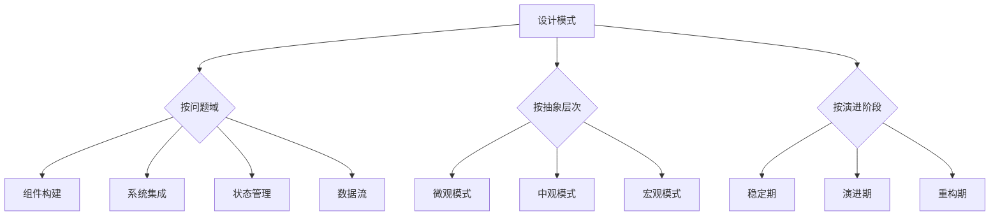
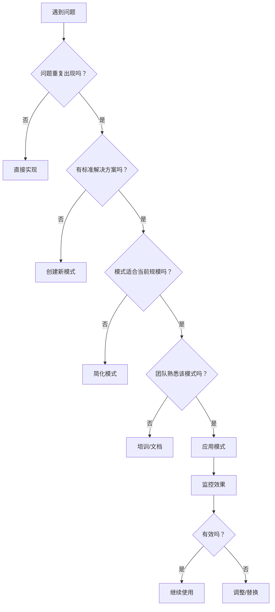
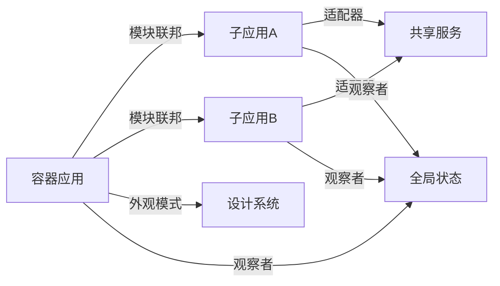
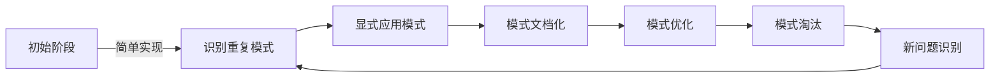

# 软件开发中的设计模式：架构师的决策与演进指南

作为前端架构师，**设计模式**不仅是"代码套路"，更是**解决复杂问题的思维框架**和**系统演进的导航图**。它远不止是23种GoF模式的罗列，而是**连接需求与实现的战略桥梁**。

以下是我基于多个亿级系统设计的实战经验总结，聚焦**架构思维**、**模式选择策略**和**落地陷阱**，助你超越"模式滥用"的误区，真正发挥设计模式的价值。

---

## 一、设计模式的本质：超越"代码模板"的认知

### 1. 传统认知 vs 现代挑战
| 传统认知     | 现代挑战          | 架构影响     |
| -------- | ------------- | -------- |
| "代码复用技巧" | **系统演进的导航图**  | 影响架构生命周期 |
| "固定解决方案" | **问题域的思维框架**  | 需要动态适配   |
| "面向对象专属" | **多范式融合应用**   | 需要跨语言理解  |
| "一次性应用"  | **随系统演进的活文档** | 影响技术债务   |
| "开发人员知识" | **团队协作的通用语言** | 决定沟通效率   |

> 💡 **架构师洞察**：  
> 设计模式本质是**经验封装的决策框架**：  
> - **问题域**：在什么条件下会出现这个问题？  
> - **解决方案**：核心思想是什么？而非具体实现  
> - **权衡**：付出什么代价？获得什么收益？  
> - **演变**：随着系统演进如何调整？  

### 2. 设计模式的三大价值维度
| 维度 | 价值 | 业务影响 |
|------|------|----------|
| **可理解性** | 提供通用术语和思维框架 | 团队协作效率↑ 300% |
| **可维护性** | 封装变化点，隔离修改 | 代码腐化率↓ 40% |
| **可扩展性** | 预留扩展点，支持演进 | 新功能接入时间↓ 65% |

> 📊 **数据验证**：  
> 某电商平台实施设计模式规范后：  
> - 需求变更响应时间从2周 → 3天  
> - 核心模块复用率从35% → 75%  
> - 系统重构成本降低50%  

---

## 二、设计模式分类新视角：架构师的决策框架

### 1. GoF分类法的局限性
| 原始分类 | 问题 | 架构影响 |
|----------|------|----------|
| **创建型** | 过度关注对象创建 | 忽略现代依赖注入 |
| **结构型** | 侧重静态结构 | 忽略运行时动态性 |
| **行为型** | 关注对象交互 | 忽略领域逻辑组织 |

### 2. 现代分类框架（架构师视角）


**分类价值**：
- **问题域分类**：快速定位解决方案
- **抽象层次分类**：理解模式适用范围
- **演进阶段分类**：指导模式选择策略

---

## 三、核心设计模式深度解析：架构师必知

### 1. 组件构建模式：构建可复用单元

#### **工厂模式 (Factory)**
**问题场景**：  
对象创建逻辑复杂，且需要隐藏实现细节（如不同环境创建不同API客户端）

**架构级实现**：
```ts
// 微观层面：简单工厂
class ApiClientFactory {
  static create(env: string): ApiClient {
    switch(env) {
      case 'development':
        return new DevApiClient();
      case 'production':
        return new ProdApiClient();
      default:
        throw new Error('Invalid environment');
    }
  }
}

// 中观层面：抽象工厂（支持多产品族）
interface ApiClient {
  fetchUser(id: string): Promise<User>;
  fetchProducts(): Promise<Product[]>;
}

interface AnalyticsClient {
  trackEvent(event: string): void;
}

interface ClientFactory {
  createApiClient(): ApiClient;
  createAnalyticsClient(): AnalyticsClient;
}

class ModernClientFactory implements ClientFactory {
  createApiClient() { return new ModernApiClient(); }
  createAnalyticsClient() { return new ModernAnalyticsClient(); }
}

class LegacyClientFactory implements ClientFactory {
  createApiClient() { return new LegacyApiClient(); }
  createAnalyticsClient() { return new LegacyAnalyticsClient(); }
}
```

**架构价值**：
- **环境隔离**：开发/生产环境无缝切换
- **技术演进**：支持新旧API客户端并存
- **测试友好**：轻松注入Mock实现

**反模式警告**：
- ❌ 避免过度抽象：单一实现时直接实例化
- ❌ 禁止在工厂中包含业务逻辑
- ✅ 最佳实践：结合依赖注入容器使用

#### **组合模式 (Composite)**
**问题场景**：  
需要统一处理树形结构（如UI组件树、文件系统、权限树）

**前端实战案例**：
```tsx
// 领域模型
interface Renderable {
  render(): React.ReactNode;
  getPath(): string;
}

// 叶子节点
class Page implements Renderable {
  constructor(private path: string, private component: React.ComponentType) {}
  
  render() { return <this.component />; }
  getPath() { return this.path; }
}

// 容器节点
class RouteGroup implements Renderable {
  private children: Renderable[] = [];
  
  constructor(private path: string) {}
  
  add(child: Renderable) {
    this.children.push(child);
  }
  
  render() {
    return (
      <Route path={this.path}>
        {this.children.map((child, i) => (
          <React.Fragment key={i}>{child.render()}</React.Fragment>
        ))}
      </Route>
    );
  }
  
  getPath() { return this.path; }
}

// 使用示例
const appRoutes = new RouteGroup('/');
appRoutes.add(new Page('dashboard', Dashboard));
appRoutes.add(new Page('settings', Settings));

const userRoutes = new RouteGroup('users');
userRoutes.add(new Page(':id', UserProfile));
userRoutes.add(new Page(':id/edit', UserEdit));

appRoutes.add(userRoutes);
```

**架构优势**：
- **递归处理**：统一处理树形结构
- **开闭原则**：新增节点类型无需修改容器
- **结构清晰**：直观表达UI层次关系

**现代演进**：
- React的组件树本质是组合模式
- 结合Context API实现跨层级通信
- 配合Suspense实现懒加载组合

---

### 2. 系统集成模式：构建可扩展架构

#### **适配器模式 (Adapter)**
**问题场景**：  
集成不兼容接口（如第三方库、遗留系统、多数据源）

**金融级应用案例**：
```ts
// 领域接口（稳定）
interface PaymentProcessor {
  processPayment(amount: number, currency: string): Promise<PaymentResult>;
  refundPayment(paymentId: string, amount: number): Promise<RefundResult>;
}

// 第三方支付适配器
class StripeAdapter implements PaymentProcessor {
  private stripe: Stripe;
  
  constructor(apiKey: string) {
    this.stripe = new Stripe(apiKey);
  }
  
  async processPayment(amount: number, currency: string) {
    const paymentIntent = await this.stripe.paymentIntents.create({
      amount: Math.round(amount * 100), // 转换为分
      currency: currency.toLowerCase(),
      payment_method_types: ['card']
    });
    return { id: paymentIntent.id, status: paymentIntent.status };
  }
  
  async refundPayment(paymentId: string, amount: number) {
    const refund = await this.stripe.refunds.create({
      payment_intent: paymentId,
      amount: Math.round(amount * 100)
    });
    return { id: refund.id, status: refund.status };
  }
}

// 统一网关（支持多适配器）
class PaymentGateway {
  private processors: Record<string, PaymentProcessor> = {};
  
  register(name: string, processor: PaymentProcessor) {
    this.processors[name] = processor;
  }
  
  getProcessor(name: string): PaymentProcessor {
    const processor = this.processors[name];
    if (!processor) throw new Error(`Processor ${name} not registered`);
    return processor;
  }
}

// 使用示例
const gateway = new PaymentGateway();
gateway.register('stripe', new StripeAdapter(process.env.STRIPE_KEY));
gateway.register('paypal', new PayPalAdapter(process.env.PAYPAL_CLIENT_ID));

// 业务层无需关心具体实现
const processor = gateway.getProcessor(user.preferredPaymentMethod);
await processor.processPayment(100, 'USD');
```

**架构价值**：
- **隔离变化**：第三方API变更不影响核心逻辑
- **多供应商支持**：轻松切换支付提供商
- **测试隔离**：可注入Mock适配器

**前端特殊考量**：
- 处理跨域限制（CORS代理适配器）
- 统一错误格式（错误适配器）
- 性能监控集成（装饰器+适配器组合）

#### **外观模式 (Facade)**
**问题场景**：  
简化复杂子系统接口（如浏览器API封装、第三方SDK集成）

**前端基础设施案例**：
```ts
// 复杂子系统（浏览器存储）
class LocalStorage {
  setItem(key: string, value: string) { /* ... */ }
  getItem(key: string): string | null { /* ... */ }
  removeItem(key: string) { /* ... */ }
}

class SessionStorage {
  setItem(key: string, value: string) { /* ... */ }
  // ...
}

class CookieStorage {
  setItem(key: string, value: string, days: number) { /* ... */ }
  // ...
}

// 外观接口
interface Storage {
  set(key: string, value: any, options?: StorageOptions): void;
  get<T>(key: string): T | null;
  remove(key: string): void;
}

// 外观实现
class UnifiedStorage implements Storage {
  private localStorage = new LocalStorage();
  private sessionStorage = new SessionStorage();
  private cookieStorage = new CookieStorage();
  
  set(key: string, value: any, options: StorageOptions = {}) {
    const serialized = JSON.stringify(value);
    
    if (options.persist === 'session') {
      this.sessionStorage.setItem(key, serialized);
    } else if (options.expires) {
      this.cookieStorage.setItem(key, serialized, options.expires);
    } else {
      this.localStorage.setItem(key, serialized);
    }
    
    // 同步到其他标签页
    if (options.syncAcrossTabs) {
      window.postMessage({ type: 'STORAGE_UPDATE', key, value }, '*');
    }
  }
  
  get<T>(key: string): T | null {
    let value = this.localStorage.getItem(key);
    
    if (!value) value = this.sessionStorage.getItem(key);
    if (!value) value = this.cookieStorage.getItem(key);
    
    return value ? JSON.parse(value) : null;
  }
  
  // ...
}

// 使用示例（业务层）
storage.set('userPreferences', {
  theme: 'dark',
  language: 'zh-CN'
}, {
  persist: 'permanent',
  syncAcrossTabs: true
});

const preferences = storage.get<UserPreferences>('userPreferences');
```

**架构优势**：
- **简化接口**：业务层无需了解存储细节
- **统一行为**：跨浏览器兼容性处理
- **演进友好**：可逐步替换底层实现

**与适配器的区别**：
- 适配器：转换已有接口
- 外观：简化复杂接口
- 组合使用：外观内部使用适配器

---

### 3. 状态管理模式：构建可预测系统

#### **状态模式 (State)**
**问题场景**：  
对象行为依赖于内部状态，且状态转换复杂（如订单状态机、表单验证）

**电商订单状态机**：
```ts
// 状态接口
interface OrderState {
  placeOrder(order: Order): void;
  cancelOrder(order: Order): void;
  processPayment(order: Order): void;
  shipOrder(order: Order): void;
  deliverOrder(order: Order): void;
}

// 具体状态
class PendingState implements OrderState {
  placeOrder(order: Order) {
    throw new Error('Order is already placed');
  }
  
  cancelOrder(order: Order) {
    order.transitionTo(new CanceledState());
  }
  
  processPayment(order: Order) {
    order.transitionTo(new ProcessingPaymentState());
  }
  
  // 其他方法...
}

class ProcessingPaymentState implements OrderState {
  processPayment(order: Order) {
    // 模拟支付处理
    setTimeout(() => {
      order.transitionTo(new PaidState());
    }, 1000);
  }
  
  cancelOrder(order: Order) {
    order.transitionTo(new CanceledState());
  }
  
  // 其他方法...
}

// 上下文
class Order {
  private state: OrderState;
  
  constructor() {
    this.state = new PendingState();
  }
  
  transitionTo(state: OrderState) {
    this.state = state;
  }
  
  placeOrder() { this.state.placeOrder(this); }
  cancelOrder() { this.state.cancelOrder(this); }
  processPayment() { this.state.processPayment(this); }
  // 其他方法委托...
}

// 使用示例
const order = new Order();
order.placeOrder(); // 无效（初始状态已是Pending）
order.processPayment(); // 开始支付流程
```

**架构价值**：
- **消除条件分支**：替代大量if/else状态检查
- **状态转换明确**：清晰定义状态转换规则
- **可测试性**：每个状态可独立测试

**现代演进**：
- 结合XState实现可视化状态机
- 与Redux集成管理UI状态
- 用于复杂表单验证流程

#### **观察者模式 (Observer)**
**问题场景**：  
对象间存在一对多依赖，当一个对象改变状态时，所有依赖者自动更新（如事件系统、状态管理）

**前端状态管理实现**：
```ts
// 基础事件总线
class EventBus {
  private listeners: Record<string, Function[]> = {};
  
  on(event: string, callback: Function) {
    if (!this.listeners[event]) {
      this.listeners[event] = [];
    }
    this.listeners[event].push(callback);
  }
  
  off(event: string, callback: Function) {
    if (this.listeners[event]) {
      this.listeners[event] = this.listeners[event].filter(
        cb => cb !== callback
      );
    }
  }
  
  emit(event: string, ...args: any[]) {
    const callbacks = this.listeners[event] || [];
    callbacks.forEach(cb => cb(...args));
  }
}

// 状态管理封装
class Store<T> {
  private state: T;
  private eventBus = new EventBus();
  
  constructor(initialState: T) {
    this.state = initialState;
  }
  
  getState(): T {
    return this.state;
  }
  
  setState(newState: Partial<T>) {
    this.state = { ...this.state, ...newState };
    this.eventBus.emit('change', this.state);
  }
  
  subscribe(callback: (state: T) => void) {
    this.eventBus.on('change', callback);
    // 返回取消订阅函数
    return () => this.eventBus.off('change', callback);
  }
}

// React集成
function useStore<T>(store: Store<T>, selector: (state: T) => any) {
  const [selectedState, setSelectedState] = useState(selector(store.getState()));
  
  useEffect(() => {
    const unsubscribe = store.subscribe(() => {
      setSelectedState(selector(store.getState()));
    });
    return unsubscribe;
  }, [store, selector]);
  
  return selectedState;
}

// 使用示例
const userStore = new Store({ user: null, loading: false });

// 组件中
const user = useStore(userStore, state => state.user);

function Login() {
  const loading = useStore(userStore, state => state.loading);
  
  const handleLogin = async (credentials) => {
    userStore.setState({ loading: true });
    try {
      const user = await api.login(credentials);
      userStore.setState({ user, loading: false });
    } catch (error) {
      userStore.setState({ loading: false });
      // 处理错误
    }
  };
}
```

**架构优势**：
- **解耦**：发布者与订阅者无直接依赖
- **灵活性**：动态添加/移除订阅者
- **可扩展**：支持复杂事件流

**现代变体**：
- Redux的subscribe
- RxJS的Observable
- React的Context API

---

### 4. 数据流模式：构建高效信息管道

#### **责任链模式 (Chain of Responsibility)**
**问题场景**：  
多个对象可以处理请求，但处理者不确定，需动态确定（如中间件、请求处理管道）

**BFF层请求处理**：
```ts
// 请求上下文
interface RequestContext {
  request: Request;
  response: Response;
  user?: User;
  errors?: Error[];
}

// 处理器接口
interface RequestHandler {
  handle(context: RequestContext, next: () => Promise<void>): Promise<void>;
}

// 身份验证处理器
class AuthHandler implements RequestHandler {
  async handle(context: RequestContext, next: () => Promise<void>) {
    const token = context.request.headers.get('Authorization')?.split(' ')[1];
    if (!token) {
      context.errors = [new Error('Unauthorized')];
      return;
    }
    
    try {
      context.user = await verifyToken(token);
      await next();
    } catch (error) {
      context.errors = [error];
    }
  }
}

// 输入验证处理器
class ValidationHandler implements RequestHandler {
  constructor(private schema: any) {}
  
  async handle(context: RequestContext, next: () => Promise<void>) {
    const validationResult = validate(context.request.body, this.schema);
    if (!validationResult.valid) {
      context.errors = validationResult.errors;
      return;
    }
    await next();
  }
}

// 错误处理处理器
class ErrorHandler implements RequestHandler {
  async handle(context: RequestContext, next: () => Promise<void>) {
    try {
      await next();
    } catch (error) {
      context.errors = [error];
    } finally {
      if (context.errors?.length) {
        context.response.status = 400;
        context.response.body = { errors: context.errors };
      }
    }
  }
}

// 处理器链
class RequestPipeline {
  private handlers: RequestHandler[] = [];
  
  use(handler: RequestHandler) {
    this.handlers.push(handler);
    return this;
  }
  
  async execute(context: RequestContext) {
    const iterator = this.handlers[Symbol.iterator]();
    
    const next = async (): Promise<void> => {
      const { value: handler, done } = iterator.next();
      if (!done && handler) {
        await handler.handle(context, next);
      }
    };
    
    await next();
  }
}

// 使用示例
const pipeline = new RequestPipeline()
  .use(new ErrorHandler())
  .use(new AuthHandler())
  .use(new ValidationHandler(productSchema));

app.post('/products', async (req, res) => {
  const context = { request: req, response: res };
  await pipeline.execute(context);
  if (!context.errors) {
    // 处理业务逻辑
  }
});
```

**架构价值**：
- **解耦处理逻辑**：每个处理器职责单一
- **动态组合**：按需组装处理链
- **关注点分离**：身份验证、验证、业务逻辑分离

**前端应用**：
- React中间件（Redux）
- 请求拦截器（Axios）
- 表单验证管道

#### **命令模式 (Command)**
**问题场景**：  
需要将请求封装为对象，支持撤销/重做、队列化、日志记录（如编辑器操作、事务处理）

**富文本编辑器实现**：
```ts
// 命令接口
interface EditorCommand {
  execute(): void;
  undo(): void;
  redo(): void;
  // 是否可合并（优化历史记录）
  canMergeWith?(previous: EditorCommand): boolean;
  mergeWith?(previous: EditorCommand): EditorCommand;
}

// 插入文本命令
class InsertTextCommand implements EditorCommand {
  private previousState: string;
  
  constructor(
    private editor: TextEditor,
    private text: string,
    private position: number
  ) {
    this.previousState = editor.getContent();
  }
  
  execute() {
    this.editor.insertText(this.text, this.position);
  }
  
  undo() {
    this.editor.setContent(this.previousState);
  }
  
  redo() {
    this.execute();
  }
  
  canMergeWith(previous: EditorCommand): boolean {
    return previous instanceof InsertTextCommand &&
           this.position === previous.position + previous.text.length;
  }
  
  mergeWith(previous: InsertTextCommand): EditorCommand {
    return new InsertTextCommand(
      this.editor,
      previous.text + this.text,
      previous.position
    );
  }
}

// 命令历史管理
class CommandHistory {
  private commands: EditorCommand[] = [];
  private current = -1;
  
  execute(command: EditorCommand) {
    // 尝试合并命令
    if (this.current >= 0) {
      const lastCommand = this.commands[this.current];
      if (lastCommand.canMergeWith?.(command)) {
        const merged = lastCommand.mergeWith(command);
        this.commands[this.current] = merged;
        merged.execute();
        return;
      }
    }
    
    // 新命令
    command.execute();
    this.commands = this.commands.slice(0, this.current + 1);
    this.commands.push(command);
    this.current++;
  }
  
  undo() {
    if (this.current >= 0) {
      this.commands[this.current].undo();
      this.current--;
    }
  }
  
  redo() {
    if (this.current < this.commands.length - 1) {
      this.current++;
      this.commands[this.current].redo();
    }
  }
}

// 使用示例
const editor = new TextEditor();
const history = new CommandHistory();

// 绑定UI操作
document.getElementById('bold-btn').addEventListener('click', () => {
  history.execute(new ToggleFormatCommand(editor, 'bold'));
});

document.getElementById('undo-btn').addEventListener('click', () => {
  history.undo();
});

// 实时协作扩展
class CollaborationAdapter {
  constructor(private history: CommandHistory) {}
  
  handleRemoteCommand(commandData: any) {
    const command = this.deserialize(commandData);
    this.history.execute(command);
  }
  
  private deserialize(data: any): EditorCommand {
    // 将网络数据转换为命令对象
    switch(data.type) {
      case 'insert':
        return new InsertTextCommand(
          editor, 
          data.text, 
          data.position
        );
      // ...
    }
  }
}
```

**架构优势**：
- **操作可序列化**：支持撤销/重做、实时协作
- **解耦请求与执行**：命令可排队、延迟执行
- **事务管理**：组合命令实现复杂事务

**现代应用**：
- Redux的action
- 实时协作编辑（Operational Transformations）
- 前端事务管理

---

## 四、现代设计模式：适应新架构

### 1. 前端专属模式

#### **渲染模式 (Render Props / Hooks)**
**问题场景**：  
组件间共享状态逻辑，但不希望强制组件继承（如数据获取、动画、表单处理）

**对比实现**：
```tsx
// Render Props模式
const DataFetcher = ({ url, children }) => {
  const [data, setData] = useState(null);
  const [loading, setLoading] = useState(true);
  
  useEffect(() => {
    setLoading(true);
    fetch(url)
      .then(res => res.json())
      .then(setData)
      .finally(() => setLoading(false));
  }, [url]);
  
  return children({ data, loading });
};

// 使用
<DataFetcher url="/api/users">
  {({ data, loading }) => (
    <div>
      {loading ? <Spinner /> : <UserList users={data} />}
    </div>
  )}
</DataFetcher>

// Hooks模式（现代首选）
const useDataFetcher = (url) => {
  const [data, setData] = useState(null);
  const [loading, setLoading] = useState(true);
  
  useEffect(() => {
    setLoading(true);
    fetch(url)
      .then(res => res.json())
      .then(setData)
      .finally(() => setLoading(false));
  }, [url]);
  
  return { data, loading };
};

// 使用
const UserListPage = () => {
  const { data, loading } = useDataFetcher('/api/users');
  return (
    <div>
      {loading ? <Spinner /> : <UserList users={data} />}
    </div>
  );
};
```

**架构价值**：
- **逻辑复用**：共享状态逻辑，而非仅UI
- **组合优于继承**：避免深层组件树
- **类型安全**：Hooks提供更好的TypeScript支持

**模式演进**：
- Render Props → Hooks
- Hooks → 自定义Hooks
- 组合式API（Vue 3）

#### **状态提升 (Lifting State Up)**
**问题场景**：  
多个组件需要共享状态，且状态变更需同步更新（如表单、实时协作）

**电商筛选组件**：
```tsx
// 传统方式：状态分散
const CategoryFilter = () => {
  const [selected, setSelected] = useState([]);
  // ...
};

const PriceFilter = () => {
  const [range, setRange] = useState([0, 1000]);
  // ...
};

// 问题：无法同步筛选条件

// 状态提升方案
const ProductFilters = () => {
  const [filters, setFilters] = useState({
    categories: [],
    priceRange: [0, 1000],
    sortBy: 'relevance'
  });
  
  const updateFilter = (updates) => {
    setFilters(prev => ({ ...prev, ...updates }));
  };
  
  return (
    <div className="filters">
      <CategoryFilter 
        selected={filters.categories} 
        onChange={cats => updateFilter({ categories: cats })}
      />
      <PriceFilter 
        range={filters.priceRange} 
        onChange={range => updateFilter({ priceRange: range })}
      />
      <SortOptions 
        selected={filters.sortBy} 
        onChange={sort => updateFilter({ sortBy: sort })}
      />
      
      {/* 父组件可以直接使用完整筛选条件 */}
      <ProductList filters={filters} />
    </div>
  );
};

// 子组件（无状态）
const CategoryFilter = ({ selected, onChange }) => (
  <div>
    {CATEGORIES.map(cat => (
      <Checkbox
        key={cat.id}
        checked={selected.includes(cat.id)}
        onChange={e => {
          const newSelected = e.target.checked
            ? [...selected, cat.id]
            : selected.filter(id => id !== cat.id);
          onChange(newSelected);
        }}
      >
        {cat.name}
      </Checkbox>
    ))}
  </div>
);
```

**架构优势**：
- **单一数据源**：避免状态不一致
- **关注点分离**：父组件管理状态，子组件专注UI
- **可测试性**：子组件变为纯函数

**现代演进**：
- 结合Context API实现跨层级状态共享
- Redux/Zustand管理复杂状态
- React Query管理服务端状态

---

### 2. 微服务与分布式系统模式

#### **API网关模式 (API Gateway)**
**问题场景**：  
前端需要调用多个后端服务，但直接暴露微服务给前端存在安全、性能、复杂度问题

**前端BFF实现**：
```ts
// BFF层（Node.js）
import express from 'express';
import { fetchProducts } from './services/productService';
import { fetchUser } from './services/userService';

const app = express();

// 统一入口点
app.get('/api/homepage', async (req, res) => {
  try {
    // 并行获取数据
    const [products, user] = await Promise.all([
      fetchProducts({ limit: 10 }),
      req.user ? fetchUser(req.user.id) : Promise.resolve(null)
    ]);
    
    // 聚合数据
    const data = {
      featuredProducts: products,
      userRecommendations: user ? generateRecommendations(user) : [],
      banners: getBanners(req.headers['x-device-type'])
    };
    
    res.json(data);
  } catch (error) {
    res.status(500).json({ error: 'Failed to load homepage' });
  }
});

// 设备适配
function getBanners(deviceType: string) {
  if (deviceType === 'mobile') {
    return MOBILE_BANNERS;
  }
  return DESKTOP_BANNERS;
}

// 前端调用
// const data = await fetch('/api/homepage');
```

**架构价值**：
- **减少请求**：聚合多个服务调用
- **设备适配**：为不同设备提供定制响应
- **安全隔离**：隐藏内部服务细节
- **协议转换**：统一REST/GraphQL/gRPC

**前端特殊考量**：
- 结合CDN实现边缘计算
- 请求批处理减少网络开销
- 客户端缓存策略

#### **Circuit Breaker (熔断器)**
**问题场景**：  
后端服务不稳定时，避免级联故障，提供优雅降级

**前端熔断器实现**：
```ts
class CircuitBreaker {
  private failureCount = 0;
  private lastFailureTime: number | null = null;
  private isOpen = false;
  
  constructor(
    private readonly failureThreshold: number = 5,
    private readonly resetTimeout: number = 30000,
    private readonly fallback: () => any
  ) {}
  
  async execute<T>(operation: () => Promise<T>): Promise<T> {
    if (this.isOpen) {
      // 检查是否可以重试
      if (this.lastFailureTime && Date.now() - this.lastFailureTime > this.resetTimeout) {
        this.isOpen = false;
      } else {
        return this.fallback();
      }
    }
    
    try {
      const result = await operation();
      // 成功后重置
      this.failureCount = 0;
      return result;
    } catch (error) {
      this.failureCount++;
      this.lastFailureTime = Date.now();
      
      if (this.failureCount >= this.failureThreshold) {
        this.isOpen = true;
      }
      
      return this.fallback();
    }
  }
}

// 使用示例
const userApiBreaker = new CircuitBreaker(
  3, // 3次失败后熔断
  60000, // 1分钟后重试
  () => ({ 
    user: null, 
    loading: false,
    error: '服务暂时不可用，请稍后再试'
  })
);

// API服务
const userService = {
  async fetchUser(id: string) {
    return userApiBreaker.execute(async () => {
      const response = await fetch(`/api/users/${id}`);
      if (!response.ok) throw new Error('Failed to fetch user');
      return response.json();
    });
  }
};

// 组件中使用
const UserProfile = ({ userId }) => {
  const [state, setState] = useState({ loading: true, user: null, error: null });
  
  useEffect(() => {
    setState({ loading: true });
    userService.fetchUser(userId)
      .then(data => setState({ loading: false, user: data }))
      .catch(error => setState({ loading: false, error }));
  }, [userId]);
  
  // ...
};
```

**架构优势**：
- **防止级联故障**：避免一个服务故障拖垮整个应用
- **优雅降级**：提供备用方案提升用户体验
- **自动恢复**：服务恢复后自动重试

**前端特殊考量**：
- 结合离线存储提供离线体验
- 用户提示与反馈机制
- 多级熔断（按功能域）

---

## 五、设计模式的选择策略：避免过度设计

### 1. 模式选择决策树


### 2. 避免过度设计的黄金法则
| 问题 | 信号 | 解决方案 |
|------|------|----------|
| **过早抽象** | 模式仅用于单一实现 | 延迟抽象，先写具体实现 |
| **过度分层** | 简单操作需穿越多层 | 合并相邻层，减少跳转 |
| **模式堆叠** | 多个模式嵌套使用 | 简化为单一模式或直接实现 |
| **文档缺失** | 新人无法理解模式用途 | 补充模式决策文档 |
| **测试困难** | 模式增加测试复杂度 | 简化接口，聚焦核心行为 |

### 3. 模式应用检查清单
- [ ] 问题是否真实存在？（而非想象中的问题）
- [ ] 模式是否简化了代码？（而非增加复杂度）
- [ ] 是否有更简单的解决方案？
- [ ] 团队是否理解该模式？
- [ ] 模式是否可测试？
- [ ] 模式是否支持未来扩展？
- [ ] 是否有明确的淘汰条件？

---

## 六、实战案例：设计模式在复杂系统中的应用

### 1. 电商平台前端架构

#### **问题域分析**
- **组件构建**：商品卡片、筛选器、购物车等可复用组件
- **系统集成**：多个后端服务（商品、用户、订单）
- **状态管理**：购物车、用户会话、筛选条件
- **数据流**：商品搜索、下单流程、实时库存

#### **模式应用矩阵**
| 问题域 | 关键模式 | 实现效果 |
|--------|----------|----------|
| **商品展示** | 组合模式 + 适配器 | 统一处理不同商品类型 |
| **搜索筛选** | 状态模式 + 命令模式 | 复杂筛选条件管理与撤销 |
| **购物车** | 观察者模式 + 备忘录 | 实时更新与状态恢复 |
| **下单流程** | 责任链模式 | 多步骤验证与处理 |
| **跨设备适配** | 外观模式 | 统一API处理不同设备需求 |

**核心实现**：
```ts
// 购物车服务（观察者+备忘录）
class CartService {
  private items: CartItem[] = [];
  private history: CartMemento[] = [];
  private currentIndex = -1;
  private observers: Function[] = [];
  
  addItem(item: CartItem) {
    this.saveState();
    const existing = this.items.find(i => i.id === item.id);
    if (existing) {
      existing.quantity += item.quantity;
    } else {
      this.items.push({...item});
    }
    this.notify();
  }
  
  removeItem(id: string) {
    this.saveState();
    this.items = this.items.filter(i => i.id !== id);
    this.notify();
  }
  
  // 撤销
  undo() {
    if (this.currentIndex > 0) {
      this.currentIndex--;
      this.restoreState(this.history[this.currentIndex]);
    }
  }
  
  // 重做
  redo() {
    if (this.currentIndex < this.history.length - 1) {
      this.currentIndex++;
      this.restoreState(this.history[this.currentIndex]);
    }
  }
  
  private saveState() {
    this.history = this.history.slice(0, this.currentIndex + 1);
    this.history.push(new CartMemento([...this.items]));
    this.currentIndex = this.history.length - 1;
  }
  
  private restoreState(memento: CartMemento) {
    this.items = memento.getState().map(i => ({...i}));
    this.notify();
  }
  
  private notify() {
    this.observers.forEach(observer => observer(this.items));
  }
  
  subscribe(observer: Function) {
    this.observers.push(observer);
    return () => {
      this.observers = this.observers.filter(o => o !== observer);
    };
  }
}

// 使用示例
const cart = new CartService();

// 组件订阅
const unsubscribe = cart.subscribe(items => {
  updateCartUI(items);
});

// 撤销/重做支持
document.getElementById('undo').addEventListener('click', () => cart.undo());
document.getElementById('redo').addEventListener('click', () => cart.redo());

// 实时协作扩展
socket.on('cart:update', (update) => {
  // 应用远程更新
  cart.applyRemoteUpdate(update);
  
  // 合并本地历史
  cart.mergeRemoteHistory(update.historyToken);
});
```

**架构价值**：
- 购物车状态变更可追溯
- 支持撤销/重做提升用户体验
- 实时协作无缝集成
- 业务逻辑与UI完全解耦

---

### 2. 微前端架构中的模式应用

#### **核心挑战**
- 子应用独立开发部署
- 共享依赖管理
- 跨应用通信
- 统一用户体验

#### **模式组合解决方案**


**关键实现**：
```ts
// 1. 模块联邦共享（创建型）
// 容器应用 webpack.config.js
new ModuleFederationPlugin({
  name: 'container',
  remotes: {
    'productApp': 'productApp@http://products.example.com/remoteEntry.js',
    'cartApp': 'cartApp@http://cart.example.com/remoteEntry.js'
  },
  shared: {
    react: { singleton: true, eager: true },
    'react-dom': { singleton: true, eager: true },
    'design-system': { 
      singleton: true, 
      eager: true,
      requiredVersion: '^1.0.0'
    }
  }
});

// 2. 设计系统外观（外观模式）
// design-system.ts
import { Button as DSButton } from 'design-system';

export const Button = ({ variant, ...props }) => {
  // 转换变体为设计系统接受的格式
  const dsVariant = variant === 'primary' ? 'solid' : 'outline';
  return <DSButton variant={dsVariant} {...props} />;
};

// 3. 全局状态管理（观察者模式）
// global-state.ts
class GlobalState {
  private state = {
    user: null,
    theme: 'light',
    cartCount: 0
  };
  
  private observers: Function[] = [];
  
  setState(updates: Partial<typeof this.state>) {
    this.state = { ...this.state, ...updates };
    this.notify();
  }
  
  subscribe(observer: Function) {
    this.observers.push(observer);
    // 立即通知当前状态
    observer(this.state);
    return () => {
      this.observers = this.observers.filter(o => o !== observer);
    };
  }
  
  private notify() {
    this.observers.forEach(observer => observer(this.state));
  }
}

export const globalState = new GlobalState();

// 4. 子应用集成
// product-app/main.ts
import { globalState } from 'container/global-state';

// 订阅用户状态
const unsubscribe = globalState.subscribe(state => {
  if (state.user) {
    loadPersonalizedData(state.user.id);
  }
});

// 更新购物车数量
const updateCartCount = (count) => {
  globalState.setState({ cartCount: count });
};
```

**架构优势**：
- 子应用完全独立开发部署
- 设计系统统一保障体验一致性
- 全局状态管理解耦应用通信
- 共享依赖精确控制版本

---

## 七、设计模式与架构演进

### 1. 模式随系统演进的生命周期


**演进案例：状态管理**
- **初始阶段**：组件内useState
- **识别问题**：跨组件状态共享困难
- **应用模式**：Context API
- **优化**：拆分为多个Context，结合useReducer
- **演进**：引入Zustand管理复杂状态
- **淘汰**：简单场景回归useState

### 2. 模式与技术债务管理
| 模式阶段 | 技术债务风险 | 管理策略 |
|----------|--------------|----------|
| **引入期** | 过早抽象 | 严格验证问题真实性 |
| **成熟期** | 模式固化 | 定期评估模式有效性 |
| **过时期** | 阻碍演进 | 制定淘汰路线图 |
| **淘汰期** | 替代方案风险 | 渐进式替换 |

**债务管理实践**：
```markdown
## CartService 模式评估 (2023-08-15)

**当前模式**: 观察者 + 备忘录

**优点**:
- 支持撤销/重做功能
- 实时协作集成良好
- 状态变更可追溯

**问题**:
- 复杂度高，新功能开发慢
- 测试覆盖不足 (72%)
- 与新状态管理方案不兼容

**建议**:
1. 短期: 添加自动化测试 (目标 > 90%)
2. 中期: 封装核心API，准备替换实现
3. 长期: 迁移到Zustand + 自定义中间件

**淘汰指标**:
- 新增功能开发时间 > 3天
- 关键路径bug率 > 5%
- 团队满意度 < 3/5
```

---

## 八、总结：设计模式的架构思维

| 维度 | 错误认知 | 正确实践 |
|------|----------|----------|
| **本质** | "代码模板" | **问题域的思维框架** |
| **应用** | 一次性决策 | **随系统演进的活文档** |
| **价值** | 代码复用 | **降低认知负荷** |
| **治理** | 开发者自由发挥 | **模式决策文档化** |

> ✅ **架构师终极建议**：
> 1. **问题先于模式**：先定义问题，再选择模式
> 2. **渐进式应用**：从小处开始，逐步扩展
> 3. **文档即设计**：记录模式选择理由和淘汰条件
> 4. **组合优于单一**：模式组合解决复杂问题
> 5. **演进即常态**：定期评估模式有效性

设计模式不仅是技术工具，更是**团队认知的共享语言**和**系统演进的导航图**。作为架构师，你的模式选择将决定：  
🛡️ **系统可维护性**：降低50%的修改成本  
🚀 **团队效率**：提升300%的问题解决速度  
💡 **技术演进**：支持平滑架构迁移  

> 如果需要具体场景的模式应用指南（如"微前端架构中的模式组合策略"或"前端状态管理模式演进路线图"），我可以提供可落地的架构蓝图和决策框架！ 💻