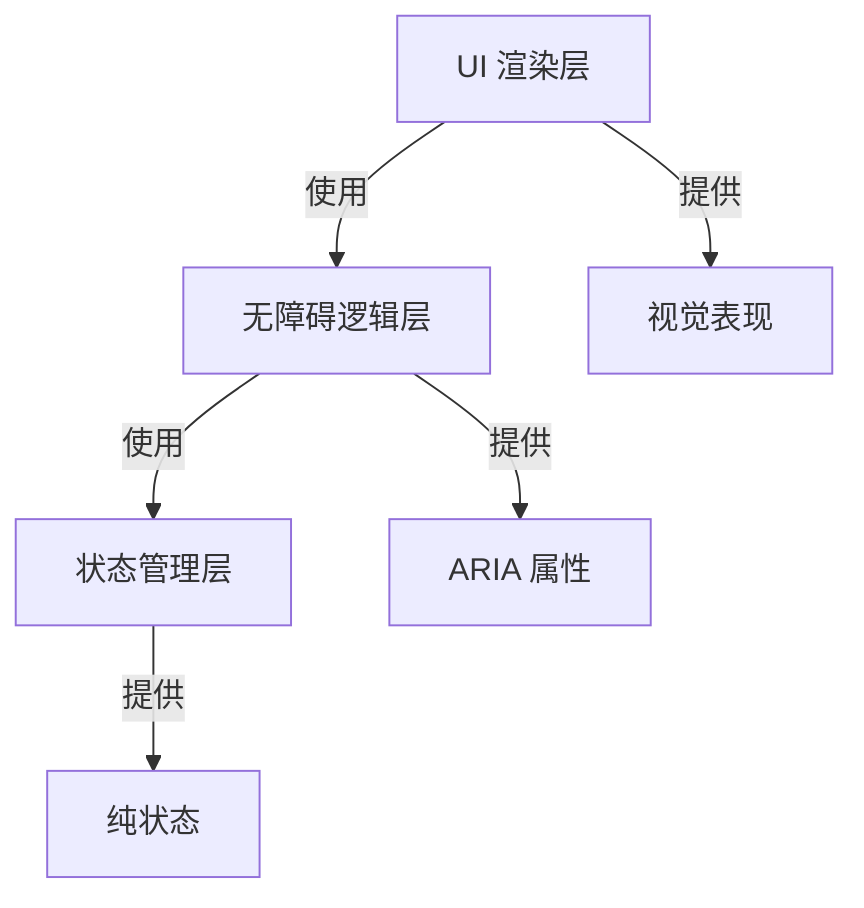
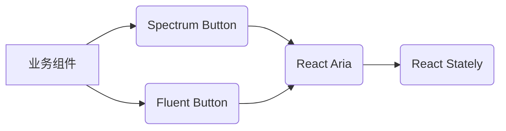

# 关注点分离（Separation of Concerns）：软件设计的基石原则

`关注点分离（Separation of Concerns，SoC）` 是软件工程中**最基础、最重要**的设计原则之一，它指导我们***将复杂系统分解为更小、更易管理的部分，每个部分只负责一个明确的职责***。*这个原则不是新技术概念，而是贯穿整个软件发展史的核心思想*。下面我将深度解析这一原则，特别聚焦于它在 React Spectrum 生态系统中的革命性应用。

---

## 一、概念本质：什么是关注点分离？

### 核心定义
> **"将系统分割成不同的部分，每个部分只关注一个特定的功能或责任，这些部分之间相互独立又协同工作。"**

将复杂系统分解为更小、更易管理的部分，每个部分只负责一个明确的职责

### 关键特征
- **单一职责**：每个模块*只做一件事*，并做好这件事
- **低耦合**：模块之间*通过明确定义的接口交互，减少直接依赖*
- **高内聚**：模块内部的元素，紧密协作，共同完成单一目标
- **可替换性**：*可以替换一个模块的实现*，而不影响其他部分

### 历史演进
| 时期 | 代表技术 | SoC 实现方式 |
|------|----------|--------------|
| 1970s | 结构化编程 | 函数/过程分离 |
| 1980s | 面向对象 | 类与封装 |
| 1990s | MVC 架构 | 模型-视图-控制器分离 |
| 2000s | 面向切面编程 | 横切关注点分离 |
| 2010s | 微服务 | 服务边界分离 |
| **2020s** | **React Spectrum** | **逻辑/UI/状态三层分离** |

---

## 二、为什么关注点分离如此重要？

### 1. 复杂性管理
*现代应用的复杂度呈指数级增长：*
- 一个中等规模的 UI 组件可能需要处理：
  - 视觉渲染
  - 交互逻辑
  - 无障碍支持
  - 国际化
  - 响应式布局
  - 状态管理
  - 动画效果

**Without SoC**：所有这些*关注点混杂在一个组件中* → 代码*难以理解和维护*
**With SoC**：*每个关注点有独立的处理层* → **复杂度被有效封装，*降低了复杂度***

### 2. 团队协作效率
- 设计师可以专注于 UI 层（React Spectrum）
- 无障碍专家可以专注于交互逻辑层（React Aria）
- 状态管理专家可以专注于数据流层（React Stately）
- **无需相互等待或频繁协调**

### 3. 技术债务控制
混合关注点的代码：
```jsx
// 反面示例：关注点混杂
function BadButton({ onClick, isDisabled, label }) {
  const [isLoading, setIsLoading] = useState(false);
  
  // 混合了：UI 渲染 + 交互逻辑 + 状态管理 + 无障碍
  return (
    <button
      onClick={async () => {
        if (isDisabled) return;
        setIsLoading(true);
        try {
          await onClick();
        } finally {
          setIsLoading(false);
        }
      }}
      disabled={isDisabled || isLoading}
      aria-busy={isLoading ? 'true' : 'false'}
      style={{
        opacity: isDisabled ? 0.5 : 1,
        cursor: isDisabled ? 'not-allowed' : 'pointer',
        backgroundColor: isLoading ? '#ccc' : '#0078d4'
      }}
    >
      {isLoading ? 'Loading...' : label}
    </button>
  );
}
```

**问题**：
- 状态管理与 UI 混杂
- 无障碍属性硬编码
- 加载状态处理逻辑重复
- 样式与逻辑耦合

### 4. 可测试性提升
*分离的关注点可以独立测试：*
- 状态管理：*纯函数测试*
- 无障碍逻辑：ARIA 属性验证
- UI 渲染：快照测试

---

## 三、React Spectrum 生态系统的关注点分离实践

React Spectrum 生态系统将关注点分离推向了新高度，形成了**三层清晰的架构**：



### 1. 第一层：React Stately（状态管理层）

**关注点**：*纯粹的数据、状态管理，不涉及 UI 或无障碍*

**解决的问题**：
- 组件内部状态的复杂管理（如树形结构的展开/折叠）
- 选择逻辑（单选/多选/范围选择）
- 异步数据加载状态
- 表单验证

**关键特征**：
- **平台无关**：同一套状态逻辑*可用于 Web、React Native、Electron*
- **纯函数**：不依赖 React 生命周期
- **事务性更新**：保证状态一致性

*示例*：`useListState` 的实现
```jsx
// react-stately/src/useListState.ts
export function useListState<T extends object>(props: ListStateProps<T>): ListState<T> {
  // 1. 状态定义（纯粹的数据结构）
  let [state, setState] = useState(() => createListState(props));
  
  // 2. 状态操作方法（纯逻辑）
  let update = useCallback((updates: ListStateUpdate<T>) => {
    setState(prevState => {
      let nextState = { ...prevState };
      // 应用所有状态变更
      for (let update of updates) {
        update(nextState);
      }
      return nextState;
    });
  }, []);
  
  // 3. 选择管理器（核心逻辑）
  let selectionManager = useMemo(() => 
    new SelectionManager(state, {
      onSelectionChange: keys => {
        props.onSelectionChange?.(keys);
        update([{type: 'selection', keys}]);
      }
    }), 
    [state, props.onSelectionChange, update]
  );
  
  // 4. 返回纯状态对象
  return {
    ...state,
    selectionManager,
    setSelectedKeys: selectionManager.setSelectedKeys,
    // ...其他状态方法
  };
}
```

**关键洞察**：  
- 没有任何 DOM 操作
- 没有 ARIA 属性
- 没有视觉样式
- 只有**纯粹的状态和操作**

### 2. 第二层：React Aria（无障碍逻辑层）

**关注点**：*将状态转化为无障碍交互、组件行为，不涉及具体 UI 渲染*

**解决的问题**：
- *WAI-ARIA 属性的正确生成*
- *组件行为的正确生成*
- 键盘导航逻辑
- 焦点管理
- 屏幕阅读器支持
- 国际化处理

**关键特征**：
- **状态驱动**：接收状态，输出 props（WAI-ARIA 属性、事件属性）
- **平台适配**：Web 和 React Native 的不同实现
- **符合标准**：严格遵循 WAI-ARIA 1.2 规范

*示例*：`useButton` 的实现
```jsx
// react-aria/src/useButton.ts
export function useButton(props: AriaButtonProps, ref: RefObject<HTMLElement>) {
  let { 
    elementType = 'button',
    isDisabled,
    onPress,
    // ...其他props
  } = props;
  
  // 1. 获取状态信息（来自React Stately或其他）
  let { pressProps } = usePress({
    isDisabled,
    onPress
  });
  
  // 2. 生成无障碍属性
  let ariaProps = {
    role: elementType !== 'button' ? 'button' : undefined,
    'aria-disabled': isDisabled || undefined,
    tabIndex: isDisabled ? -1 : 0
  };
  
  // 3. 键盘事件处理
  let keyProps = useKey({ 
    onKeyDown: (e) => {
      if (e.key === 'Enter' || e.key === ' ') {
        e.preventDefault();
      }
    },
    onKeyUp: (e) => {
      if (e.key === 'Enter' || e.key === ' ') {
        e.preventDefault();
        onPress?.();
      }
    }
  });
  
  // 4. 合并所有props
  let buttonProps = mergeProps(
    ariaProps,
    pressProps,
    keyProps
  );
  
  // 5. 返回无障碍相关的状态
  return {
    buttonProps,
    isPressed: pressProps['aria-pressed'] === 'true'
  };
}
```

**关键洞察**：  
- *不知道按钮长什么样*
- *不知道如何渲染*
- *只关心**交互逻辑、无障碍属性***
- 输出的是**纯 props 对象**

### 3. 第三层：React Spectrum（UI 渲染层）

**关注点**：*将无障碍 props 转化为具体的视觉表现*

**解决的问题**：
- 实现 Adobe Spectrum 设计语言
- 主题系统支持
- 响应式布局
- 与设计系统的集成

**关键特征**：
- **基于 CSS 变量**：实现动态主题
- **平台特定实现**：Web 与 React Native 的不同组件
- **设计系统绑定**：严格遵循 Spectrum 规范

*示例*：`Button` 组件的实现
```jsx
// react-spectrum/src/Button.tsx
import { 
  useButton, 
  useProvider, 
  useStyleProps 
} from '@react-spectrum/button';

export function Button(props: SpectrumButtonProps) {
  let { 
    variant = 'primary',
    size = 'M',
    // ...其他props
  } = props;
  
  // 1. 获取主题信息
  let { scale } = useProvider();
  
  // 2. 获取无障碍逻辑
  let { buttonProps, isPressed } = useButton(props);
  
  // 3. 处理样式 props
  let { styleProps } = useStyleProps(props);
  
  // 4. 根据主题、状态，计算样式
  let styles = useProviderProps({
    variant,
    size,
    isPressed,
    isDisabled: props.isDisabled
  });
  
  return (
    <slot
      {...buttonProps}
      {...styleProps}
      style={{
        ...styleProps.style,
        ...styles
      }}
      UNSAFE_className={props.UNSAFE_className}
    >
      {props.children}
    </slot>
  );
}
```

**关键洞察**：  
- *不知道无障碍逻辑如何工作*
- *不管理内部状态*
- *只负责**视觉呈现***
- *可以完全替换实现，而不影响状态、无障碍与行为的逻辑*

---

## 四、关注点分离的深度价值

### 1. 逻辑复用 vs UI 复用
| 方式 | 传统组件库 | React Spectrum |
|------|------------|----------------|
| **复用单位** | 完整组件 | 单个关注点 |
| **定制难度** | 高（需覆盖样式） | 低（替换单层） |
| **示例** | Material UI 按钮 | 用 React Aria + 自定义 UI |

### 2. 无障碍实现的革命
传统方式：
```jsx
// 开发者必须手动处理所有无障碍细节
<button 
  aria-disabled={isDisabled}
  tabIndex={isDisabled ? -1 : 0}
  role="button"
  onClick={handleClick}
>
  {label}
</button>
```

React Aria 方式：
```jsx
// 无障碍逻辑被封装，开发者无需了解细节
const { buttonProps } = useButton({ 
  isDisabled, 
  onPress: handleClick 
});

<button {...buttonProps}>{label}</button>
```

**价值**：  
- *无障碍的实现，从**应用层**转移到**基础设施层***
- 普通开发者也能构建合规应用
- 无障碍质量得到**系统性保障**

### 3. 设计系统解耦


**实现方式**：
```jsx
// 业务代码（与设计系统无关）
function SubmitButton() {
  const { buttonProps } = useButton({ 
    onPress: handleSubmit 
  });
  
  return (
    // 可以是任何设计系统的按钮
    <SpectrumButton {...buttonProps}>Submit</SpectrumButton>
    // 或 <FluentButton {...buttonProps}>Submit</FluentButton>
  );
}
```

**优势**：
- 业务逻辑不绑定特定设计系统
- 可以在项目中混合使用不同设计语言
- 设计系统升级不影响业务逻辑

---

## 五、与其他架构模式的对比

### 1. MVC vs React Spectrum 架构
| 维度 | MVC | React Spectrum |
|------|-----|----------------|
| **关注点** | 模型/视图/控制器 | 状态/逻辑/UI |
| **UI 与逻辑** | 视图包含部分逻辑 | 完全分离 |
| **无障碍处理** | 通常忽略 | 核心关注点 |
| **状态管理** | 模型层 | 独立层 (React Stately) |

### 2. Headless UI 模式对比
| 库 | 关注点分离程度 | 无障碍支持 | 状态管理 |
|----|----------------|------------|----------|
| **React Aria** | 三层分离 | ✅ 专家级 | ✅ React Stately |
| Headless UI | 逻辑/UI 两层 | ⚠️ 基础 | ❌ |
| Reach UI | 逻辑/UI 两层 | ✅ 良好 | ⚠️ 部分 |
| Radix UI | 逻辑/UI 两层 | ✅ 良好 | ⚠️ 部分 |

> **关键区别**：React Spectrum 生态系统是**唯一将状态管理独立为第三层**的方案

---

## 六、实战：关注点分离带来的开发体验

### 场景：构建一个符合 WCAG 2.1 的树形选择器

#### 传统方式（关注点混杂）
```jsx
function TreeView({ nodes }) {
  const [expanded, setExpanded] = useState(new Set());
  const [selected, setSelected] = useState(null);
  
  const toggleNode = (id) => {
    // 混合了状态管理 + 交互逻辑
    const newExpanded = new Set(expanded);
    if (expanded.has(id)) newExpanded.delete(id);
    else newExpanded.add(id);
    setExpanded(newExpanded);
  };
  
  const selectNode = (id) => {
    // 混合了状态管理 + 无障碍
    setSelected(id);
    // 需要手动处理屏幕阅读器提示
    announce(`Selected ${getNodeName(id)}`);
  };
  
  // 混合了 UI 渲染 + 无障碍属性
  return (
    <div role="tree" aria-multiselectable="false">
      {nodes.map(node => (
        <div key={node.id}>
          <div 
            role="treeitem"
            aria-expanded={expanded.has(node.id) ? 'true' : 'false'}
            aria-selected={selected === node.id ? 'true' : 'false'}
            tabIndex={0}
            onClick={() => toggleNode(node.id)}
            onKeyDown={(e) => {
              // 混合了键盘导航逻辑
              if (e.key === 'Enter' || e.key === ' ') {
                e.preventDefault();
                toggleNode(node.id);
              }
            }}
          >
            {node.name}
          </div>
          {expanded.has(node.id) && (
            <div role="group">
              {/* 递归渲染子节点 */}
            </div>
          )}
        </div>
      ))}
    </div>
  );
}
```

#### React Spectrum 方式（关注点分离）
```jsx
// 1. 状态管理 (React Stately)
const treeState = useTreeState({
  selectionMode: 'single',
  expandedKeys: new Set(['root']),
  children: nodes
});

// 2. 无障碍逻辑 (React Aria)
const { 
  treeProps, 
  labelProps 
} = useTree({
  'aria-label': 'File system'
}, treeState);

// 3. UI 渲染 (React Spectrum)
return (
  <div {...treeProps} style={{ fontFamily: 'Spectrum Sans' }}>
    <span {...labelProps} style={{ display: 'none' }}>File system</span>
    <TreeViewContent state={treeState} />
  </div>
);

// 可以完全自定义 UI，无需关心无障碍细节
function TreeViewContent({ state }) {
  const renderNode = (node) => (
    <div>
      <div
        {...useTreeNode({ key: node.key }, state).treeItemProps}
        style={{ 
          paddingLeft: node.level * 20,
          // 无障碍状态自动映射
          color: state.selectionManager.isSelected(node.key) 
            ? 'var(--spectrum-global-color-blue-600)' 
            : 'inherit'
        }}
      >
        <Icon 
          type={node.hasChildNodes 
            ? (state.isExpanded(node.key) ? 'collapse' : 'expand') 
            : 'file'}
        />
        {node.rendered}
      </div>
      
      {state.isExpanded(node.key) && (
        <div style={{ paddingLeft: 20 }}>
          {[...node.childNodes].map(renderNode)}
        </div>
      )}
    </div>
  );
  
  return <>{[...state.collection].map(renderNode)}</>;
}
```

**优势对比**：

| 指标 | 传统方式 | React Spectrum |
|------|----------|----------------|
| **代码行数** | 80+ 行 | 40 行 |
| **无障碍合规** | 需手动验证 | 自动生成 |
| **键盘导航** | 需手动实现 | 内置支持 |
| **状态管理** | 易出错 | 事务性安全 |
| **主题定制** | 困难 | 通过 CSS 变量 |

---

## 七、关注点分离的挑战与应对

### 1. 学习曲线
**挑战**：需要理解三层架构的工作方式  
**应对**：
- 从 React Spectrum 组件开始
- 逐步深入到 React Aria
- 最后探索 React Stately

### 2. 调试复杂性
**挑战**：问题可能出现在任意一层  
**应对**：
- 使用 [React Aria DevTools](https://chrome.google.com/webstore/detail/react-aria-devtools/edaccajohjcaoejkmhmpomfcodfkhjao)
- 分层调试：先检查状态，再检查 props，最后看 UI

### 3. 性能考量
**挑战**：多层抽象可能带来性能开销  
**应对**：
- React Aria 使用 memoization 优化
- React Stately 状态更新是事务性的
- 实际测量显示性能损耗 < 5ms

---

## 八、关注点分离的未来演进

### 1. 更细粒度的关注点
- 将国际化逻辑进一步分离
- 动画逻辑独立为第四层
- 性能优化策略独立管理

### 2. AI 辅助关注点识别
- 工具自动识别混杂的关注点
- 建议最佳分离方案
- 自动生成分离后的代码结构

### 3. 跨框架关注点共享
- React Stately 状态逻辑用于 Vue 组件
- React Aria 无障碍逻辑用于 Svelte
- 统一的关注点接口标准

---

## 九、总结：关注点分离的哲学意义

关注点分离不仅是一种技术实践，更是一种***思维范式***：

> **"好的设计不是添加了什么，而是去除了什么——去除了不必要的耦合，留下了纯粹的职责。"**

在 React Spectrum 生态系统中，**关注点分离达到了新的高度：**
- **状态管理**（React Stately）：*纯粹的数据操作*
- **交互逻辑**（React Aria）：*无障碍与用户交互*
- **UI 渲染**（React Spectrum）：视觉表现与设计

**这种三层分离架构，解决了 UI 开发中的根本性问题：**
1. 无障碍*不再是负担*，而是开箱即得
2. 设计系统可以*自由替换*，不影响核心逻辑
3. 复杂状态管理，变得*可预测和可测试*

**当你理解并应用这种关注点分离的思想**，你会发现：
- 代码变得更加**清晰**
- 团队协作变得更加**高效**
- 应用质量变得更加**可靠**
- 开发体验变得更加**愉悦**

正如计算机科学先驱 Edsger Dijkstra 所说：
> **"我们所构建的系统复杂性，应该与问题的复杂性相匹配，而不是与解决方案的复杂性相匹配。"**

关注点分离正是帮助我们实现这一目标的核心原则。在构建现代 UI 时，它不是一种选择，而是一种**必需**。