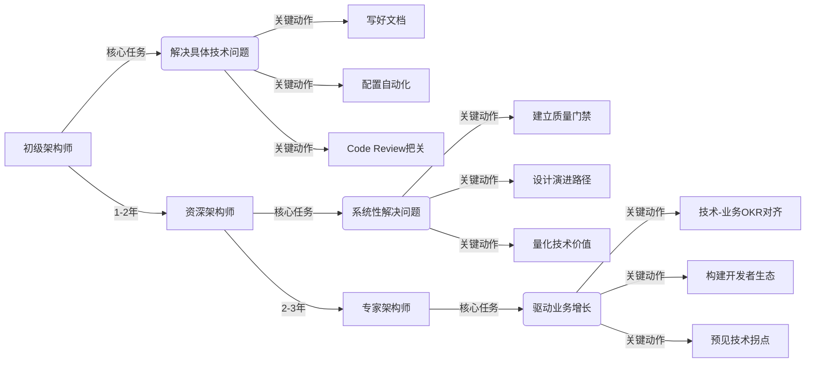

以下是我为前端架构师设计的**可落地、可自检、分阶段**的能力模型清单，结合**技术深度**与**软技能**双维度，覆盖**初级/资深/专家**三个层级。每项能力均包含**具体行为描述**和**验证方式**，避免空泛理论。

---

## 一、技术能力矩阵（硬核实力）

### 1. **系统设计能力**（核心中的核心）
| 能力层级   | 关键行为                                                                                                   | 验证方式                                                      |
| ------ | ------------------------------------------------------------------------------------------------------ | --------------------------------------------------------- |
| **初级** | - 能设计单页应用合理目录结构<br>- 选择合适的状态管理方案（如：页面级用Zustand，全局用Redux）                                               | 1. 代码评审通过率 ≥80%<br>2. 新人能按文档3天内上手项目                       |
| **资深** | - 设计**可演进架构**（如：从CSR平滑迁移SSR）<br>- 制定**组件分层规范**（atoms/molecules/organisms）<br>- 设计**错误边界策略**（前端熔断机制）    | 1. 业务需求变更时，代码修改范围 ≤2个模块<br>2. 线上异常率下降50%+                 |
| **专家** | - 设计**跨端架构**（Web/iOS/Android共享核心逻辑）<br>- 构建**微前端治理体系**（沙箱/通信/生命周期）<br>- 定义**技术债务量化模型**（如：债务利息=修复成本×时间） | 1. 支撑10+团队并行开发无冲突<br>2. 技术债务修复ROI > 3:1（每投入1小时修复，节省3小时维护） |

> **避坑指南**：避免过度设计！初级架构师常犯错误：为“未来可能的需求”设计复杂模块，**验证标准**：新功能开发是否比旧功能更快？

---

### 2. **性能工程能力**（用户感知的生死线）
| 能力层级   | 关键行为                                                                                                     | 验证方式                                           |
| ------ | -------------------------------------------------------------------------------------------------------- | ---------------------------------------------- |
| **初级** | - 实现路由级代码分割<br>- 用`<link rel=preload>`优化关键资源                                                             | Lighthouse性能分 ≥75                              |
| **资深** | - 建立**性能基线体系**（CI中对比PR前后性能）<br>- 设计**智能懒加载策略**（基于用户行为预测）<br>- 优化**运行时渲染性能**（React.memo/useMemo精准控制）      | 1. 核心页面LCP ≤1.8s<br>2. 滚动卡顿率 < 0.5%            |
| **专家** | - 设计**全链路性能监控**（从DNS解析到交互完成）<br>- 构建**性能成本模型**（如：每增加10KB包体积，流失率+2%）<br>- 推动**服务端协同优化**（如：关键API响应 ≤200ms） | 1. 真实用户CLS ≤0.1<br>2. 性能优化带来可量化的业务提升（如：转化率+5%） |

> **真实工具链**：  
> - 初级：Lighthouse + Webpack Bundle Analyzer  
> - 资深：Chrome UX Report + Web Vitals Extension  
> - 专家：自研RUM系统 + 性能-业务转化归因模型

---

### 3. **质量保障能力**（守住底线的防火墙）
| 能力层级   | 关键行为                                                                                              | 验证方式                                    |
| ------ | ------------------------------------------------------------------------------------------------- | --------------------------------------- |
| **初级** | - 配置基础CI流水线（lint/test/build）<br>- 编写组件单元测试（RTL + Jest）                                            | 1. 测试覆盖率 ≥60%<br>2. PR自动检查通过率100%       |
| **资深** | - 设计**测试策略金字塔**（单元70%/组件20%/E2E10%）<br>- 实现**自动化视觉回归**（Percy）<br>- 构建**质量门禁**（覆盖率<80%禁止合并）        | 1. 线上Bug中前端占比 ≤20%<br>2. 重构后回归测试通过率100% |
| **专家** | - 建立**质量成本模型**（如：1个线上Bug = 5小时修复成本）<br>- 设计**故障注入演练**（模拟网络中断/第三方服务故障）<br>- 推动**质量左移**（设计阶段嵌入可测试性） | 1. 线上P0事故年发生率 ≤1次<br>2. 新功能上线后7天内零回滚    |

> **关键指标**：  
> - 初级：**覆盖率**（数量）  
> - 资深：**有效覆盖率**（关键路径覆盖）  
> - 专家：**缺陷逃逸率**（测试未发现的线上Bug比例）

---

### 4. **工程化能力**（提升团队效率的引擎）
| 能力层级   | 关键行为                                                                                                   | 验证方式                                |
| ------ | ------------------------------------------------------------------------------------------------------ | ----------------------------------- |
| **初级** | - 搭建标准化脚手架（create-app）<br>- 配置ESLint/Prettier自动修复                                                      | 新人创建项目时间 ≤10分钟                      |
| **资深** | - 开发**领域专用CLI**（如：`create-component`生成带测试模板）<br>- 构建**组件库发布体系**（自动化版本/文档）<br>- 实现**一键预览环境**（PR自动部署）    | 1. 重复性工作减少50%<br>2. 组件复用率 ≥70%      |
| **专家** | - 设计**工具链演进路线**（如：从Webpack迁移到Turbopack）<br>- 建立**开发者体验度量体系**（DEX：任务完成时间/错误率）<br>- 构建**智能代码生成**（AI辅助编码） | 1. 开发者满意度 ≥4.5/5<br>2. 特性交付周期缩短40%+ |

> **自检清单**：  
> ✅ 是否每次PR都需要手动检查代码规范？ → 缺少自动化  
> ✅ 新人能否独立完成组件开发？ → 缺少脚手架/文档  
> ✅ 重构时是否担心破坏现有功能？ → 缺少测试覆盖

---

## 二、软技能矩阵（隐形天花板）

### 1. **技术决策能力**（避免团队踩坑）
| 能力层级 | 关键行为                                                                 | 验证方式                                                                 |
|----------|--------------------------------------------------------------------------|--------------------------------------------------------------------------|
| **初级** | - 能列出技术选型的3个关键维度（如：学习成本/社区活跃度）<br>- 拒绝盲目追新（如：不用Qwik做后台系统） | 技术方案通过率 ≥70%                                                     |
| **资深** | - 用**ADR（架构决策记录）** 文档化决策过程<br>- 设计**技术沙盒**验证方案（PoC）<br>- 预判技术风险（如：Vue3迁移的浏览器兼容问题） | 1. 技术债务新增率 ≤5%<br>2. 团队对技术决策认同度 ≥80%                    |
| **专家** | - 建立**技术雷达机制**（季度评估新技术）<br>- 设计**技术演进路线图**（如：3年TypeScript全覆盖）<br>- 推动**技术价值量化**（如：Vite提升开发效率=节省$XX万/年） | 1. 技术投资ROI > 2.5<br>2. 业务方主动要求架构评审                        |

> **ADR模板核心要素**：  
> 
> ```markdown
> ## 决策：采用Vite替代Webpack
> **背景**：本地启动时间>15s，HMR延迟>3s  
> **选项**：  
> - Option 1: Webpack 5（熟悉但优化空间小）  
> - Option 2: Vite（ESBuild快10倍）  
> **选择**：Vite  
> **原因**：  
> - ✅ 开发启动速度提升5倍（实测<3s）  
> - ✅ HMR延迟<100ms（提升开发体验）  
> - ⚠️ 需解决：生产环境兼容性（已验证）  
> **影响**：  
> - 预计节省开发时间：200小时/月  
> - 风险：插件生态不足（已制定回滚计划）
> ```

---

### 2. **影响力与赋能能力**（让架构“活”起来）
| 能力层级 | 关键行为                                                                 | 验证方式                                                                 |
|----------|--------------------------------------------------------------------------|--------------------------------------------------------------------------|
| **初级** | - 编写清晰的架构文档<br>- 在Code Review中解释设计原因                    | 团队成员能复述架构核心原则                                               |
| **资深** | - 主导**架构诊所**（每周1小时解答设计问题）<br>- 创建**避坑指南**（收录真实事故案例）<br>- 用**Codemod**自动化迁移旧代码 | 1. 文档查阅率 ≥90%<br>2. 新人上手时间缩短50%                             |
| **专家** | - 建立**技术布道体系**（内部技术大会/分享会）<br>- 设计**能力成长路径**（如：前端工程师晋升图谱）<br>- 推动**跨团队知识共享**（设计系统共建） | 1. 团队技术提案数量年增30%<br>2. 外部团队主动引入本架构                  |

> **赋能黄金法则**：  
> - 永远不说“你应该...”，而是“我们试过...，结果...”  
> - 用**数据代替观点**（例：不说“Webpack慢”，说“实测启动时间15.2s vs Vite 2.1s”）

---

### 3. **业务与技术平衡能力**（架构师的生死线）
| 能力层级   | 关键行为                                                                  | 验证方式                                    |
| ------ | --------------------------------------------------------------------- | --------------------------------------- |
| **初级** | - 理解当前迭代的业务目标<br>- 评估技术方案对排期的影响                                       | 业务方认可技术方案可行性                            |
| **资深** | - 用**技术语言翻译业务价值**（如：SSR提升SEO=增加5%流量）<br>- 设计**渐进式技术方案**（先核心页面SSR，再全量） | 1. 技术方案通过业务评审率 ≥90%<br>2. 技术投入带来可量化业务收益 |
| **专家** | - 预判**技术对业务的长期影响**（如：微前端是否阻碍未来收购）<br>- 制定**技术-业务对齐框架**（OKR中嵌入技术指标）    | 1. CTO主动咨询技术战略<br>2. 技术决策直接影响产品路线图      |

> **致命陷阱**：  
> ❌ 为追求技术先进性导致延期  
> ✅ **架构原则**：*“用最小技术成本支撑最大业务价值”*  
> （例：营销活动页用Vue3+Vite，内部系统用Vue2+Webpack——没有银弹！）

---

## 三、能力自检表（快速定位水平）

| 能力维度     | 初级架构师标志             | 专家架构师标志                 |
| -------- | ------------------- | ----------------------- |
| **技术决策** | 能解释为什么选React        | 能证明React比Svelte节省$XX万/年 |
| **性能优化** | 会用`React.memo`避免重渲染 | 知道重渲染成本=渲染时间×用户量×日均次数   |
| **质量保障** | 配置了Jest单元测试         | 定义“有效测试”标准：覆盖用户真实操作路径   |
| **工程化**  | 会用脚手架创建项目           | 新人入职当天可独立提交生产代码         |
| **业务对齐** | 知道当前需求是什么           | 预判6个月后业务瓶颈并提前布局架构       |
| **影响力**  | 团队成员听懂你的方案          | 产品/后端团队主动要求你评审方案        |

> **自测题**：  
> 1. 你最近一次技术决策，**如何量化收益**？（不能只有“更快”“更好”）  
> 2. 团队是否有**明确的质量红线**？（例：测试覆盖率<80%禁止上线）  
> 3. 业务方是否**主动咨询**你的技术建议？（而非仅执行需求）  
> **如果3个问题都能给出数据化答案 → 你已是专家级架构师**

---

## 四、能力跃迁路线图



### 关键跃迁点：
- **初级→资深**：从 **“做方案”** 到 **“定规则”**  
  （例：不再说“用Redux”，而是定义“何时该用Redux”）  
- **资深→专家**：从 **“技术价值”** 到 **“业务价值”**  
  （例：证明SSR让SEO流量提升15%，带来$200万年收入）

---

## 五、避坑指南（血泪经验）

### 1. **不要当“技术独裁者”**
- **表现**：强制团队用新技术，忽视学习成本  
- **解法**：  
  ✅ 用 **“技术提案模板”** 代替口头决策（含学习成本/收益/风险）  
  ✅ 给团队 **“技术实验预算”**（每月1天探索新技术）

### 2. **避免“过度工程化”**
- **表现**：为5人团队设计微前端+Monorepo  
- **解法**：  
  ✅ 应用 **“康威定律”**：架构匹配团队结构（小团队用单体，大团队再拆分）  
  ✅ 问自己：**“这个设计能解决当前问题吗？”**（YAGNI原则）

### 3. **警惕“脱离编码”**
- **表现**：只画架构图不写代码  
- **解法**：  
  ✅ **每周至少2天写生产代码**  
  ✅ 在PR中示范最佳实践（例：提交一个性能优化PR并附数据）

---

## 六、附：前端架构师必备工具包
| 类型         | 推荐工具                                                                 | 使用场景                                  |
|--------------|--------------------------------------------------------------------------|------------------------------------------|
| **决策辅助** | ADR模板库、技术雷达评估表                                                | 技术选型文档化                           |
| **性能监控** | SpeedCurve、Web Vitals Chrome插件、自研RUM                              | 真实用户性能追踪                         |
| **质量保障** | Percy（视觉测试）、Stryker（突变测试）、SonarQube                      | 深度质量检测                             |
| **工程化**   | Nx（Monorepo）、Changesets（版本管理）、Turborepo（任务编排）           | 大型项目提效                             |
| **赋能工具** | Archbee（架构文档）、CodeTour（代码注释）、Ladle（轻量Storybook）       | 知识传递                                 |

> **获取方式**：关注我，回复 **“架构师工具包”** 获取所有工具的配置模板+实战案例

---

### 最后总结：前端架构师的终极能力
> **“用技术杠杆撬动业务增长，让团队在正确的路上越走越快。”**  
>  
> 不是技术最牛的人，而是**让团队技术能力持续提升的人**；  
> 不是决策最准的人，而是**让错误决策成本最小化的人**。

**立即行动建议**：  
1️⃣ 用自检表定位当前能力短板  
2️⃣ 选1项能力制定90天提升计划（例：**“3个月内将测试覆盖率从60%→80%”**）  
3️⃣ 每周用1小时实践 **“架构诊所”**（解答1个团队设计问题）

需要 **《90天架构师能力提升计划模板》** 或 **《ADR决策记录实战案例》**，请告诉我你的具体场景，我会为你定制方案！