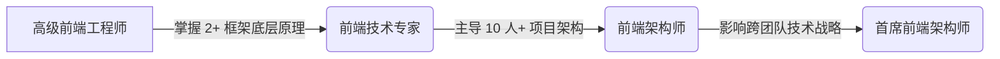

前端架构师（Frontend Architect）**远不止是“写代码最厉害的人”**，而是一个**技术战略家、系统设计师、质量守护者和团队赋能者**的综合体。其核心职责是**通过技术决策和流程设计，确保前端系统在业务规模增长时仍能保持高质量、可维护性和团队高效协作**。

以下从 **7 大核心维度** 深度解析前端架构师的职责（附真实场景案例）：

---

### 一、技术战略与决策（技术选型不是“拍脑袋”）
* **核心任务：**  
  - 评估技术栈（框架/工具/模式）与**业务目标**的匹配度（例：高 SEO 需求选 Next.js；内部工具选轻量级方案）  
  - 制定**技术演进路线图**（例：从 jQuery 逐步迁移到 React + TypeScript）  
  - 拒绝“盲目追新”，建立**技术雷达**机制（定期评估新技术，如 Qwik、Turbopack 的适用场景）  
* **关键动作：**  
  ✅ 编写 **ADR（Architecture Decision Record）**：记录决策原因（例：*“2024Q2 选用 Vite 替代 Webpack：本地启动速度提升 5 倍，HMR 延迟 <100ms”*）  
  ✅ 主导 **PoC（概念验证）**：对关键方案做最小化验证（例：测试 React Server Components 在项目中的可行性）  
  ✅ **避免陷阱**：拒绝团队因“React 18 发布”就要求全量升级，而是评估增量迁移成本  
* **真实场景：**  
  > 某电商大促前，团队想引入新状态管理库。架构师通过 ADR 指出：现有 Zustand 已满足需求，新库学习成本高且无性能收益，**避免了技术债务堆积**。

---

### 二、系统设计与质量保障（让代码“不腐烂”）
* **核心任务：**  
  - 设计**可扩展的代码结构**（例：基于领域驱动设计（DDD）组织目录）  
  - 制定**质量红线**（测试覆盖率 ≥80%、Lighthouse 性能 ≥90）  
  - 构建**防御性编码体系**（错误边界、类型安全、自动化检查）  
* **关键动作：**  
  ✅ 设计 **“可演进的架构”**：  
    - 组件分层：`atoms`（基础UI）→ `organisms`（业务模块）→ `templates`（页面布局）  
    - 状态管理：全局状态（用户信息）vs 页面级状态（搜索表单）  
  ✅ 建立 **“质量门禁”**：  
    - CI 流程中强制：`eslint --fix` + `prettier --check` + `vitest --coverage`  
    - 覆盖率不达标 PR 自动拒绝合并  
  ✅ **消灭技术债务**：  
    - 每迭代预留 20% 时间修复债务（例：将 class 组件转为函数组件 + Hooks）  
* **真实场景：**  
  > 某项目因历史原因存在大量 `any` 类型。架构师推动：  
  > 1. 新文件强制 TypeScript 严格模式  
  > 2. 旧文件按模块逐步迁移  
  > 3. 用 `ts-prune` 自动检测未使用代码  
  > **6 个月内类型覆盖率从 40% → 95%**

---

### 三、性能与体验的终极责任人（用户卡顿就是你的失职）
* **核心任务：**  
  - 定义 **Core Web Vitals 目标**（LCP < 2.5s, CLS < 0.1）  
  - 设计**性能优化体系**（从构建到运行时）  
  - 推动 **“性能即功能”** 文化  
* **关键动作：**  
  ✅ **构建层优化：**  
    - 用 `rollup-plugin-visualizer` 分析包体积  
    - 动态导入 + 路由级代码分割（`React.lazy` + `Suspense`）  
  ✅ **运行时优化：**  
    - 实现 **“智能懒加载”**：首屏关键组件预加载，非关键组件滚动到视口再加载  
    - 用 `react-virtual` 优化长列表  
  ✅ **建立性能基线：**  
    - 在 CI 中集成 Lighthouse，新 PR 生成性能对比报告  
    - 线上 RUM（Real User Monitoring）监控真实用户指标  
* **真实场景：**  
  > 某 SaaS 产品首屏加载 5s+。架构师主导：  
  > - 用 Webpack Bundle Analyzer 定位 `moment.js`（200KB）  
  > - 替换为 `date-fns`（Tree Shaking 后 10KB）  
  > - 添加 `link rel=preload` 预加载关键 CSS  
  > **首屏时间从 5.2s → 1.8s**

---

### 四、工程化体系构建（让团队“不重复造轮子”）
* **核心任务：**  
  - 打造**标准化开发流水线**（从创建项目到上线）  。参考：[[打造标准化开发流水线（从创建项目到上线）]]
  - 建设**可复用能力**（CLI 工具、组件库、Hooks 库）  
* **关键动作：**  
  ✅ **开发体验优化：**  
    - 定制 `create-app` 脚手架（集成 ESLint/Prettier/测试配置）  
    - 实现 **“一键 Mock”**：本地开发自动代理 API 请求到 Mock 服务  
  ✅ **组件库治理：**  
    - 用 Storybook 建立文档，强制组件通过 a11y 测试  
    - 设计 **“组件演进协议”**（例：弃用 `Button` 的 `type` 属性时提供自动 codemod）  
  ✅ **自动化流水线：**  
    - PR 自动部署预览环境（Vercel/GitHub Pages）  
    - 用 `changesets` 管理版本发布  
* **真实场景：**  
  > 新人入职第一天：  
  > 1. 运行 `my-cli create project` 生成标准化项目  
  > 2. 用 `my-cli generate component` 创建带测试模板的组件  
  > 3. 提交 PR 后自动获得预览链接  
  > **上手时间从 3 天 → 4 小时**

---

### 五、**安全与合规守护者（前端不是“不设防”）**
* **核心任务：**  
  - 防御 **XSS/CSRF** 等前端特有攻击  
  - 确保 **GDPR/无障碍（a11y）合规**  
* **关键动作：**  
  ✅ **安全基线：**  
    - 框架安全配置：React 自动转义 + 禁用 `dangerouslySetInnerHTML`  
    - CSP（内容安全策略）头自动注入  
  ✅ **自动化扫描：**  
    - CI 中集成 `axe-core` 检测 a11y 问题  
    - 用 `npm audit` + `snyk` 监控依赖漏洞  
  ✅ **敏感信息管控：**  
    - 配置 Webpack 防止 `.env` 误提交  
    - 第三方 SDK 按需加载（避免 GDPR 风险）  
* **真实场景：**  
  > 某金融项目因未处理用户输入导致 XSS 漏洞。架构师推动：  
  > 1. 全局封装 `sanitizeHtml` 工具函数  
  > 2. 在 ESLint 中添加 `react/no-danger` 规则  
  > 3. CI 增加 `xss-validator` 扫描  
  > **漏洞归零 + 通过 PCI DSS 安全审计**

---

### 六、**团队赋能与知识传承（让架构“活”在团队中）**
* **核心任务：**  
  - 将架构思想**转化为可执行规范**  
  - 建立**持续学习机制**  
* **关键动作：**  
  ✅ **文档即代码：**  
    - 架构文档与代码库同维护（例：`/docs/adr` 目录）  
    - 用 **“文档驱动开发”**：新功能先写设计文档再编码  
  ✅ **知识传递：**  
    - 主导 **“架构诊所”**：每周 1 小时解答团队设计问题  
    - 编写 **《前端避坑指南》**（收录真实线上事故案例）  
  ✅ **技术雷达会议：**  
    - 每月分享新技术评估结果（例：*“Qwik 适合静态内容场景，但动态应用收益有限”*）  
* **真实场景：**  
  > 某团队因状态管理混乱频繁出 Bug。架构师：  
  > 1. 编写《状态管理决策树》文档（附流程图）  
  > 2. 在 PR 模板中增加 **“状态管理设计说明”** 字段  
  > 3. 用 Codemod 自动迁移旧代码  
  > **3 个月内状态相关 Bug 下降 70%**

---

### 七、**跨职能协同（打破“前端孤岛”）**
* **核心任务：**  
  - 与后端共建 **BFF（Backend For Frontend）**  
  - 与设计团队制定 **设计系统规范**  
* **关键动作：**  
  ✅ **接口契约化：**  
    - 推动使用 **GraphQL/Protobuf** 替代随意 JSON  
    - 用 `openapi-generator` 自动生成 TypeScript 类型  
  ✅ **设计系统落地：**  
    - 将 Figma 设计稿与 Storybook 组件关联  
    - 实现 **“设计 Token 自动同步”**（Style Dictionary）  
  ✅ **全链路性能优化：**  
    - 与后端约定 **“关键 API 响应 ≤ 300ms”**  
    - 共建 **“慢请求监控看板”**  
* **真实场景：**  
  > 产品改版时设计稿与实现偏差大。架构师：  
  > 1. 推动设计团队输出 Design Token  
  > 2. 用 Style Dictionary 生成 CSS 变量 + React Theme  
  > 3. 在 CI 中添加 **“设计一致性检查”**（通过 Percy 视觉测试）  
  > **UI 还原度从 70% → 95%**

---

### ⚠️ 前端架构师的 **3 大禁忌**（血泪教训）
| 禁忌 | 后果 | 正确做法 |
|------|------|----------|
| **闭门造车** （自己写完美架构文档） | 团队抵触，规范无人执行 | 每周开 1 小时“架构共创会”，让成员参与决策 |
| **过度设计** （为 10 倍增长设计架构） | 开发效率暴跌，业务延期 | 用 **“YAGNI（You Aren’t Gonna Need It）”** 原则，只解决当前痛点 |
| **脱离编码** （只画 PPT 不写代码） | 决策脱离实际，失去团队信任 | **每周至少 2 天写生产代码**，在 PR 中示范最佳实践 |

---

### 💡 如何判断你是否需要前端架构师？
- ✅ **团队痛点：**  
  - 新功能开发速度越来越慢（>3 天/个）  
  - 线上事故 50% 以上是前端导致  
  - 每次重构像“拆弹”  
- ✅ **业务信号：**  
  - 产品进入规模化阶段（日活 > 10 万）  
  - 需要支撑多端（Web/iOS/Android）  
  - 技术栈复杂度显著提升（SSR + PWA + 微前端）  

> **关键指标：** 如果团队在 **“重复解决同类问题”**（如每次做表单都要重写校验逻辑），就是架构缺失的信号。

---

### 前端架构师的成长路径

**核心能力跃迁：**  
- 从 **“解决问题”** → **“定义问题”**（例：不是“如何优化加载”，而是“如何定义可量化的加载体验”）  
- 从 **“写好代码”** → **“设计让代码变好的系统”**  

---

### 最后总结：前端架构师的本质
> **“不是选择 React 还是 Vue 的人，而是确保无论用什么技术，团队都能持续交付高质量产品的系统设计者。”**  
>  
> 他们用 **技术决策** 避免团队踩坑，用 **工程化** 消除重复劳动，用 **质量体系** 守住底线，最终让前端开发从“手工作坊”升级为“现代化工厂”。

如果需要，我可以提供：  
🔹 **《前端架构师能力模型》详细清单**（含技术/软技能）  
🔹 **中小团队轻量级架构落地 checklist**  
🔹 **真实 ADR（架构决策记录）模板**  
请告诉我你的具体场景，我会给出针对性建议！