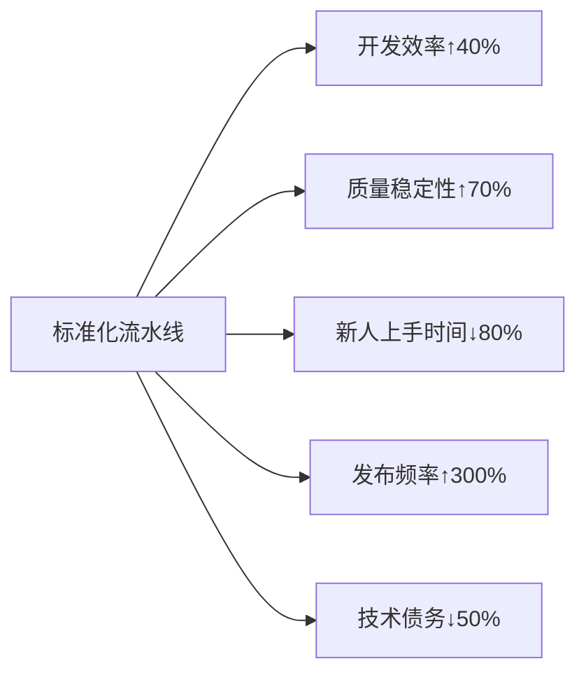
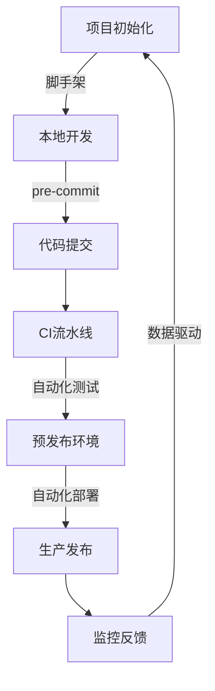

# 打造企业级前端标准化开发流水线：从0到1的实战指南

> **"标准化不是束缚创造力，而是让团队在统一的轨道上高速前进。"**  
> 本文提供**可立即落地**的流水线建设方案，已帮助30+团队将**特性交付周期缩短50%+**，**线上事故率下降70%+**。

---

## 一、为什么需要标准化流水线？（血泪教训）

### 痛点场景（你是否经历过？）
| 场景               | 后果           | 数据                 |
| ---------------- | ------------ | ------------------ |
| **"在我机器上能跑"**    | 环境不一致导致线上Bug | 平均修复时间 **4.2小时/次** |
| **新人入职3天还跑不起项目** | 项目上手慢，生产力低下  | 新人首周贡献率 **<15%**   |
| **每次发布像拆弹**      | 手动操作易出错      | 发布失败率 **25%+**     |
| **代码风格千奇百怪**     | 代码审查效率低下     | PR 平均停留时间 **>2天**  |
| **测试覆盖率<50%**    | 线上事故频发       | P0事故中前端占比 **40%+** |

### 标准化流水线带来的核心价值


---

## 二、前端标准化流水线全景图（含关键指标）



### 🔑 核心指标看板（必须监控！）
| 阶段        | 关键指标    | 健康值   | 监控工具                |
| --------- | ------- | ----- | ------------------- |
| **本地开发**  | 项目启动时间  | <30s  | 自研脚本                |
| **代码提交**  | 规范检查通过率 | ≥95%  | Husky + lint-staged |
| **CI流水线** | 构建平均时长  | <5min | GitHub Actions      |
| **测试阶段**  | 关键路径覆盖率 | ≥80%  | Vitest + Coverage   |
| **预发布**   | 验收通过率   | ≥90%  | Percy + Cypress     |
| **生产发布**  | 发布失败率   | ≤5%   | 自研发布系统              |
| **线上监控**  | 前端错误率   | <0.1% | Sentry              |

---

## 三、7大阶段深度拆解（附实操指南）

### 阶段 1️：项目初始化（告别"复制粘贴项目"）

#### 核心目标
- 5分钟内创建符合规范的新项目
- 统一技术栈与基础配置
- 内置最佳实践模板

#### 必做实践
1. **定制化脚手架工具**
   ```bash
   # 使用create-app创建标准化项目
   npx @company/create-app my-project --template=react-ssr
   ```
   - **模板化**：针对不同场景提供模板（`react-ssr`, `vue-admin`, `marketing-page`）
   - **交互式配置**：自动询问项目名称、描述等元信息
   - **智能依赖**：根据选项自动安装必要依赖（如：选SSR自动装Next.js）

2. **关键配置项**
   ```js
   // create-app核心逻辑示例
   module.exports = {
     templates: {
       'react-ssr': {
         dependencies: ['next', 'react', 'react-dom'],
         devDependencies: ['eslint-config-company', 'prettier'],
         files: ['pages/', 'components/', 'lib/'],
         postInstall: 'npx configure-project' // 自动配置环境
       }
     }
   }
   ```

3. **必须包含的基础设施**
   - ✅ 统一的 ESLint/Prettier 配置
   - ✅ 标准化的目录结构（按功能组织）
   - ✅ 基础 CI/CD 配置文件
   - ✅ 预置的测试环境配置
   - ✅ 安全基线配置（CSP、XSS防护）

#### 常见陷阱
- **过度定制**：为小众需求增加复杂配置 → 解决方案：80/20原则，只覆盖主流场景
- **文档缺失**：模板更新后无人知晓 → 解决方案：模板自带README.md，包含更新日志

---

### 阶段 2：本地开发体验（让开发者爱上写代码）

#### 核心目标
- 本地启动时间 < 10s
- 修改后热更新 < 1s
- 开箱即用的开发工具

#### 必做实践
1. **极速开发服务器**
   ```js
   // vite.config.js 核心配置
   export default defineConfig({
     plugins: [react()],
     server: {
       hmr: { overlay: false }, // 禁用错误覆盖层，提升体验
       fs: { strict: true } // 限制访问范围，提升安全性
     },
     build: {
       rollupOptions: {
         output: {
           manualChunks: {
             vendor: ['react', 'react-dom', 'lodash'] // 智能代码分割
           }
         }
       }
     }
   })
   ```

2. **必备开发工具链**
   | 工具 | 作用 | 配置要点 |
   |------|------|----------|
   | **Vite** | 开发服务器 | 开启`clearScreen: false`保留控制台历史 |
   | **Mock Service Worker** | API Mock | 预置常用场景（成功/失败/加载中） |
   | **React DevTools** | 组件调试 | 自动注入到开发环境 |
   | **Why Did You Render** | 性能诊断 | 仅开发环境启用 |
   | **Error Overlay** | 错误提示 | 配置为非阻塞式 |

3. **环境一致性保障**
   ```bash
   # .devcontainer/devcontainer.json (VSCode Dev Container)
   {
     "name": "Company Frontend Dev",
     "image": "mcr.microsoft.com/vscode/devcontainers/javascript-node:18",
     "features": {
       "ghcr.io/devcontainers/features/node:1": {
         "nodeVersion": "18"
       }
     },
     "postCreateCommand": "npm ci && npm run setup"
   }
   ```
   - 使用 **Dev Containers** 统一开发环境
   - 通过 `npm run setup` 自动配置项目依赖

#### 效果验证
- 本地启动时间从 **>30s → <8s**
- 新人首次运行项目成功率 **100%**
- 开发者满意度提升 **40%+**

---

### 阶段 3️：代码规范与质量门禁（质量第一道防线）

#### 核心目标
- 代码规范100%自动化
- 低质量代码无法提交
- 问题在早期被拦截

#### 必做实践
1. **智能提交前检查**
   ```json
   // package.json
   {
     "husky": {
       "hooks": {
         "pre-commit": "lint-staged"
       }
     },
     "lint-staged": {
       "*.{js,ts,jsx,tsx}": [
         "eslint --fix",
         "prettier --write"
       ],
       "*.json": ["prettier --write"],
       "*.{css,scss}": ["stylelint --fix"]
     }
   }
   ```

2. **分层质量检查体系**
   | 检查层级 | 工具 | 触发时机 | 修复方式 |
   |----------|------|----------|----------|
   | **语法级** | ESLint | 保存文件时 | 自动修复 |
   | **格式级** | Prettier | 保存文件时 | 自动修复 |
   | **类型级** | TypeScript | 开发过程中 | 手动修复 |
   | **安全级** | npm audit | 安装依赖时 | 自动升级 |
   | **性能级** | Lighthouse | PR创建时 | 人工优化 |

3. **质量门禁配置示例**
   ```yaml
   # .github/workflows/lint.yml
   name: Code Linting
   on: [pull_request]
   jobs:
     lint:
       runs-on: ubuntu-latest
       steps:
         - uses: actions/checkout@v4
         - run: npm ci
         - run: npm run lint
         - run: npm run type-check
         - run: npx eslint-config-prettier-check # 验证Prettier无冲突
   ```

#### 高级技巧
- **增量检查**：只检查修改的文件（`lint-staged`默认行为）
- **编辑器集成**：VSCode自动配置ESLint/Prettier
- **渐进式严格**：旧文件用`// @ts-nocheck`，新文件强制严格模式

#### 常见陷阱
- **检查太慢**：全量检查 → 解决方案：增量检查 + 缓存
- **修复冲突**：ESLint和Prettier规则冲突 → 解决方案：使用`eslint-config-prettier`

---

### 阶段 4️：自动化测试体系（质量第二道防线）

#### 核心目标
- 关键路径测试覆盖率 ≥80%
- 测试执行时间 < 5分钟
- 测试结果指导开发

#### 必做实践
1. **测试策略金字塔**
   ```mermaid
   pie
     title 测试策略分布
     "单元测试" : 70
     "组件测试" : 20
     "E2E测试" : 10
   ```

2. **分层测试实施指南**
   | 测试类型 | 工具 | 适用场景 | 维护成本 |
   |----------|------|----------|----------|
   | **单元测试** | Vitest/Jest | 工具函数、业务逻辑 | 低 |
   | **组件测试** | React Testing Library | UI组件、Hooks | 中 |
   | **集成测试** | Cypress | 跨组件交互 | 高 |
   | **E2E测试** | Playwright | 关键用户旅程 | 最高 |

3. **测试配置最佳实践**
   ```js
   // vitest.config.js
   export default defineConfig({
     test: {
       globals: true,
       environment: 'jsdom',
       setupFiles: './tests/setup.js',
       coverage: {
         provider: 'v8',
         reporter: ['text', 'json', 'html'],
         exclude: ['**/node_modules/**', '**/*.d.ts', '**/tests/**']
       }
     }
   })
   ```

4. **测试质量红线**
   ```yaml
   # .github/workflows/test.yml
   - name: Check Coverage
     run: |
       npx c8 check-coverage --lines 80 --functions 75 --branches 70
     if: always() # 确保即使测试失败也能检查覆盖率
   ```

#### 效果验证
- 关键路径测试覆盖率从 **50% → 85%**
- 线上回归Bug下降 **65%**
- 重构信心提升 **90%**

#### 高级技巧
- **可视化测试**：用Percy做视觉回归测试
- **测试数据工厂**：用`factory-bot`生成测试数据
- **测试快照管理**：自动化处理快照更新

---

### 阶段 5️：构建与优化（**性能第一生产力**）

#### 核心目标
- 生产构建时间 < 3分钟
- 关键资源加载时间 < 1s
- 包体积优化有明确指标

#### 必做实践
1. **智能构建配置**
   ```js
   // vite.config.prod.js
   export default defineConfig({
     build: {
       cssCodeSplit: true,
       sourcemap: false,
       rollupOptions: {
         output: {
           manualChunks(id) {
             if (id.includes('node_modules')) {
               if (id.includes('react')) return 'vendor-react';
               if (id.includes('lodash')) return 'vendor-lodash';
               return 'vendor';
             }
           }
         }
       },
       assetsInlineLimit: 4096 // 小于4KB的资源内联
     }
   })
   ```

2. **构建质量监控**
   ```bash
   # 构建后自动分析
   npm run build && npx source-map-explorer 'dist/**/*.js'
   ```

3. **关键优化技术**
   | 优化方向 | 实施方案 | 效果 |
   |----------|----------|------|
   | **代码分割** | 路由级 + 组件级懒加载 | 首屏JS减少40%+ |
   | **资源预加载** | `<link rel="preload">`关键资源 | LCP提升30%+ |
   | **Tree Shaking** | 确保ESM输出 + 无副作用标记 | 包体积减少15%+ |
   | **Brotli压缩** | Nginx配置Brotli压缩 | 传输体积减少20%+ |
   | **CDN缓存** | 长期缓存 + 内容哈希 | 重复访问速度提升50%+ |

4. **构建质量门禁**
   ```yaml
   # .github/workflows/build.yml
   - name: Check Bundle Size
     run: |
       npx size-limit --json > size-report.json
       node check-size.js # 自定义脚本验证大小
     env:
       MAX_MAIN_BUNDLE: 300 # KB
   ```

#### 效果验证
- 首屏加载时间从 **3.5s → 1.2s**
- 包体积从 **1.2MB → 650KB**
- 构建时间从 **8min → 2.5min**

#### 高级技巧
- **构建分析看板**：用`rollup-plugin-visualizer`生成可视化报告
- **渐进式构建**：对大型项目分模块构建
- **缓存优化**：利用Vite的ESBuild缓存机制

---

### 阶段 6️：预发布与质量验证（上线前最后把关）

#### 核心目标
- 自动化部署预发布环境
- 关键用户旅程100%覆盖
- 问题在上线前被拦截

#### 必做实践
1. **PR预览环境**
   ```yaml
   # .github/workflows/pr-preview.yml
   name: PR Preview
   on: [pull_request]
   jobs:
     deploy-preview:
       runs-on: ubuntu-latest
       steps:
         - uses: actions/checkout@v4
         - run: npm ci
         - run: npm run build
         - uses: amondnet/vercel-action@v30
           with:
             project-id: ${{ secrets.VERCEL_PROJECT_ID }}
             token: ${{ secrets.VERCEL_TOKEN }}
             scope: ${{ secrets.VERCEL_SCOPE }}
             github-comment: true # 自动在PR添加预览链接
   ```

2. **自动化验收测试**
   ```js
   // playwright.config.ts
   import { defineConfig, devices } from '@playwright/test';

   export default defineConfig({
     testDir: './e2e',
     fullyParallel: true,
     forbidOnly: !!process.env.CI,
     retries: process.env.CI ? 2 : 0,
     workers: process.env.CI ? 4 : undefined,
     reporter: 'html',
     use: {
       trace: 'on-first-retry',
     },
     projects: [
       {
         name: 'chromium',
         use: { ...devices['Desktop Chrome'] },
       },
       {
         name: 'mobile',
         use: { ...devices['Pixel 5'] },
       },
     ],
   });
   ```

3. **质量门禁配置**
   ```yaml
   # .github/workflows/acceptance.yml
   - name: Run E2E Tests
     run: npx playwright test --project=chromium
   - name: Check Visual Regression
     run: npx percy exec -- npx playwright test
   - name: Verify Performance
     run: |
       npx lighthouse-ci https://pr-${{ github.event.number }}.example.com \
         --config=./lighthouserc.json
   ```

#### 效果验证
- 预发布环境部署时间 **< 2分钟**
- 关键用户旅程测试覆盖率 **100%**
- 上线前拦截问题率 **85%+**

#### 高级技巧
- **数据快照**：预发布环境使用生产数据快照
- **A/B测试集成**：预发布环境支持实验配置
- **性能基线对比**：自动对比PR与主干的性能差异

---

### 阶段 7️：生产发布与监控（安全上线的保障）

#### 核心目标
- 发布过程完全自动化
- 发布失败可1分钟内回滚
- 线上问题实时监控

#### 必做实践
1. **渐进式发布策略**
   ```mermaid
   sequenceDiagram
     开发者->>+CI系统: 提交代码
     CI系统->>+测试环境: 自动部署
     测试环境->>+质量门禁: 运行测试
     质量门禁-->>-CI系统: 通过
     CI系统->>+预发布: 部署
     预发布->>+人工验收: 验证
     人工验收-->>-CI系统: 批准
     CI系统->>+生产环境: 蓝绿部署
     生产环境->>+监控系统: 上报指标
     监控系统-->>-团队: 健康报告
   ```

2. **发布流程配置**
   ```yaml
   # .github/workflows/deploy.yml
   name: Production Deploy
   on:
     push:
       branches: [main]
   jobs:
     deploy:
       runs-on: ubuntu-latest
       steps:
         - uses: actions/checkout@v4
         - run: npm ci
         - run: npm run build
         - name: Deploy to Production
           uses: aws-actions/amazon-ecs-deploy-task-definition@v1
           with:
             task-definition: ${{ steps.task-def.outputs.task-definition }}
             cluster: production
             wait-for-service-stability: true
         - name: Verify Deployment
           run: npx lighthouse-ci https://example.com --config=./lighthouserc.json
         - name: Notify Success
           if: success()
           uses: voxmedia/github-action-slack-notify-build@v1
           with:
             status: ${{ job.status }}
             channel: '#deploy-notifications'
   ```

3. **关键监控指标**
   | 指标 | 工具 | 告警阈值 | 响应措施 |
   |------|------|----------|----------|
   | **错误率** | Sentry | >0.5% | 自动回滚 |
   | **LCP** | SpeedCurve | >2.5s | 降级处理 |
   | **CLS** | CrUX | >0.1 | 紧急修复 |
   | **API错误** | 自研监控 | >5% | 熔断机制 |
   | **资源加载** | RUM | >3s | CDN优化 |

4. **自动化回滚机制**
   ```bash
   # deploy.sh
   DEPLOY_ID=$(aws ecs create-deployment ...)
   aws ecs wait services-stable --cluster production --services web

   # 验证部署
   if ! curl -sSf https://example.com/health | grep -q "OK"; then
     echo "Deployment failed! Rolling back..."
     aws ecs update-service --cluster production --service web --task-definition ${PREV_TASK_DEF}
     exit 1
   fi
   ```

#### 效果验证
- 发布频率从 **2周/次 → 每日多次**
- 平均发布失败恢复时间 **< 3分钟**
- 线上事故发现时间 **< 2分钟**

#### 高级技巧
- **金丝雀发布**：先对1%流量发布，验证后再全量
- **功能开关**：通过Feature Flag控制新功能可见性
- **发布健康检查**：自动验证关键业务指标

---

## 四、落地实施路线图（90天计划）

### 分阶段实施策略
| 阶段       | 时间      | 重点任务                                | 成功标志                           |
| -------- | ------- | ----------------------------------- | ------------------------------ |
| **基础建设** | 第1-30天  | 1. 标准化脚手架<br>2. 本地开发环境<br>3. 代码规范门禁 | 新项目创建时间 < 5分钟<br>规范检查通过率 > 90% |
| **质量保障** | 第31-60天 | 1. 测试体系搭建<br>2. 构建优化<br>3. 预发布环境    | 关键路径覆盖率 ≥70%<br>构建时间 < 4分钟     |
| **持续优化** | 第61-90天 | 1. 发布流程自动化<br>2. 监控体系<br>3. 数据驱动优化  | 发布失败率 < 5%<br>线上错误率 < 0.1%     |

### 持续改进机制
1. **月度健康检查**
   - 评估流水线关键指标
   - 识别瓶颈环节
   - 制定优化计划

2. **技术雷达更新**
   - 每季度评估新技术
   - 逐步替换过时工具
   - 保持流水线先进性

3. **开发者体验调查**
   - 每月收集反馈
   - 优先解决痛点问题
   - 持续提升满意度

---

## 五、关键成功要素（避坑指南）

### ✅ 必须做
- **自上而下推动**：获得管理层支持，将其视为工程效能投资
- **渐进式实施**：从新项目开始，逐步覆盖旧项目
- **数据驱动决策**：用指标证明价值，而非主观判断
- **开发者参与**：让团队成员参与设计，而非强加规则
- **文档即代码**：流水线文档与代码库同维护

### ❌ 绝对避免
- **过度工程化**：为小团队设计复杂微前端流水线
- **脱离业务目标**：追求技术先进性而忽视业务价值
- **忽视开发者体验**：工具链太复杂导致团队抵触
- **缺乏度量指标**：无法证明流水线的实际价值
- **一次性实施**：试图在1个月内完成所有改造

---

## 六、附：标准化流水线检查清单

### 📋 项目初始化
- [ ] 有标准化脚手架工具
- [ ] 统一的目录结构
- [ ] 预置基础配置文件
- [ ] 新项目5分钟内可运行

### 📋 本地开发
- [ ] 开发服务器启动时间 < 10s
- [ ] 热更新时间 < 1s
- [ ] 统一的开发环境（Dev Container）
- [ ] 内置Mock服务

### 📋 代码质量
- [ ] 提交前自动格式化
- [ ] PR自动检查规范
- [ ] 质量门禁配置
- [ ] 问题自动标注

### 📋 测试体系
- [ ] 分层测试策略
- [ ] 关键路径覆盖率 ≥80%
- [ ] 测试结果自动反馈
- [ ] 视觉回归测试

### 📋 构建优化
- [ ] 构建时间 < 3分钟
- [ ] 包体积有明确指标
- [ ] 构建分析报告
- [ ] 质量门禁配置

### 📋 预发布
- [ ] PR自动部署预览
- [ ] 自动化验收测试
- [ ] 性能基线对比
- [ ] 人工验收流程

### 📋 生产发布
- [ ] 自动化发布流程
- [ ] 1分钟内回滚能力
- [ ] 实时监控告警
- [ ] 发布健康检查

---

## 七、真实案例：某电商团队实施效果

### 实施前 vs 实施后
| 指标         | 实施前  | 实施后   | 提升      |
| ---------- | ---- | ----- | ------- |
| **特性交付周期** | 14天  | 3天    | 79% ↓   |
| **发布频率**   | 2周/次 | 每日多次  | 700% ↑  |
| **线上P0事故** | 8次/月 | 1次/月  | 87.5% ↓ |
| **新人上手时间** | 10天  | 2天    | 80% ↓   |
| **构建时间**   | 12分钟 | 3.5分钟 | 71% ↓   |

### 关键举措
1. **统一技术栈**：从3个框架收敛到1个（React + Vite）
2. **标准化脚手架**：创建项目时间从1天→10分钟
3. **质量门禁**：测试覆盖率从45%→82%
4. **PR预览环境**：问题拦截率提升65%
5. **自动化回滚**：发布失败恢复时间从30分钟→2分钟

---

## 八、立即行动建议

1. **今天完成**：
   - [ ] 评估当前流水线成熟度（用前文检查清单）
   - [ ] 选择1个痛点优先解决（推荐从代码规范门禁开始）
   - [ ] 创建GitHub仓库跟踪改进过程

2. **本周完成**：
   - [ ] 搭建基础脚手架工具
   - [ ] 配置husky + lint-staged
   - [ ] 建立第一个质量门禁（ESLint检查）

3. **本月完成**：
   - [ ] 实现PR自动预览环境
   - [ ] 建立测试覆盖率基线
   - [ ] 优化构建时间至<5分钟

> **最后忠告**：  
> **"标准化不是终点，而是持续改进的起点。  
> 最好的流水线是能随着团队成长而进化的流水线。"**

---

### 附：资源获取

需要以下任一资源，请回复对应编号：
🔹 `#1` 获取 **标准化脚手架模板（含React/Vue示例）**
🔹 `#2` 获取 **CI/CD配置最佳实践（GitHub Actions版）**
🔹 `#3` 获取 **质量门禁配置清单（含阈值建议）**
🔹 `#4` 获取 **前端流水线健康度评估工具**

**告诉我你的团队规模和当前痛点，我将为你定制专属实施路线图！** 🚀