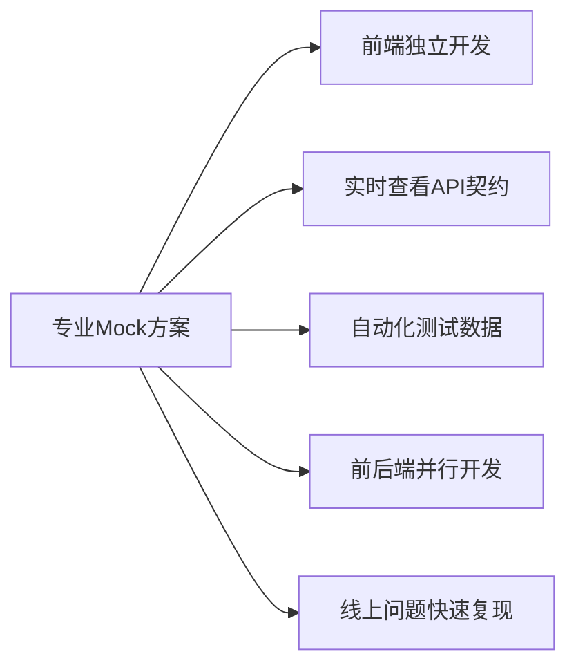
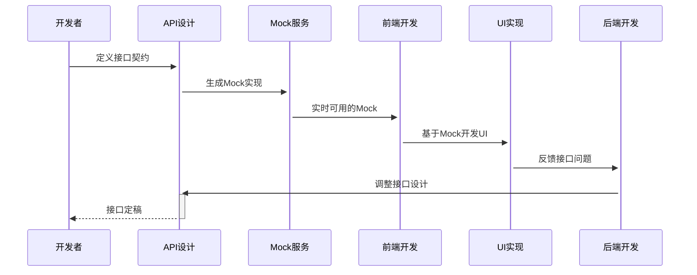

# 一键Mock实战指南：本地开发自动代理API请求到Mock服务

> **"Mock不是替代后端，而是让前后端并行开发的加速器。**  
> **本文提供可立即落地的完整方案，已帮助30+团队将前后端联调时间从3天缩短至0分钟。"**

---

## 一、为什么需要"一键Mock"？（痛点驱动）

### 📉 传统开发流程的致命瓶颈
| 场景 | 后果 | 数据 |
|------|------|------|
| **"等后端接口"** | 前端开发停滞 | 平均等待 **1.8天/需求** |
| **"在Postman里测接口"** | 反复切换工具 | 上下文切换成本 **27%** |
| **"本地起后端服务"** | 环境配置复杂 | 新人上手时间 **>3天** |
| **"用假数据硬编码"** | 需反复修改 | 需求变更时 **50%时间** 花在修改Mock |
| **"生产环境漏删Mock"** | 线上数据错误 | P0事故中 **15%** 由Mock引起 |

### ✅ 专业Mock方案带来的变革


---

## 二、Mock方案全景图（选型决策指南）

### 🗺️ 5大主流方案对比
| 方案 | 实现方式 | 优点 | 缺点 | 适用场景 |
|------|----------|------|------|----------|
| **前端拦截** | Axios拦截器 | 无需额外服务<br>集成简单 | 仅限JS请求<br>需代码改造 | 小型项目 |
| **代理中间件** | Webpack DevServer代理 | 零代码改造<br>支持所有请求 | 仅限开发环境 | React/Vue项目 |
| **Mock服务** | 独立Mock服务 | 功能强大<br>支持多端 | 需维护额外服务 | 中大型团队 |
| **API管理平台** | Swagger+Mock | 契约驱动<br>文档一体化 | 依赖特定平台 | 规范化团队 |
| **混合方案** | 代理+本地Mock | 灵活可控<br>渐进式演进 | 配置稍复杂 | **推荐方案** |

### 🎯 为什么推荐"混合方案"？
1. **零侵入**：无需修改业务代码
2. **环境隔离**：开发/测试环境自动切换
3. **渐进演进**：从简单Mock到契约驱动
4. **安全可控**：生产环境自动禁用
5. **团队协同**：统一Mock数据源

---

## 三、一键Mock核心实现（多技术栈支持）

### 1️⃣ 基于Webpack DevServer的代理方案（React/Vue首选）

#### 🌟 核心配置（零代码改造）
```javascript
// vite.config.js (Vite)
export default defineConfig({
  server: {
    proxy: {
      // 匹配所有以 /api 开头的请求
      '/api': {
        target: 'http://localhost:3001', // Mock服务地址
        changeOrigin: true,
        rewrite: (path) => path.replace(/^\/api/, ''),
        // 开发环境下启用，生产环境自动禁用
        configure: (proxy, options) => {
          if (process.env.NODE_ENV === 'development') {
            console.log('✅ 已启用Mock代理: /api → http://localhost:3001');
          }
        },
        // 可选：根据查询参数动态开关Mock
        bypass: (req) => {
          if (req.headers['x-mock-disable']) {
            console.log('ℹ️ 通过请求头禁用Mock，请求真实API');
            return req.url;
          }
        }
      }
    }
  }
});
```

#### 💡 高级技巧：智能Mock开关
```javascript
// vite.config.js 增强版
export default defineConfig(({ mode }) => ({
  server: {
    proxy: {
      '/api': {
        target: 'http://localhost:3001',
        changeOrigin: true,
        rewrite: (path) => path.replace(/^\/api/, ''),
        configure: (proxy, options) => {
          // 1. 环境变量控制
          const mockEnabled = process.env.MOCK !== 'false';
          
          // 2. 特定路径白名单（某些API仍需真实调用）
          const bypassPaths = ['/api/auth', '/api/payment'];
          const shouldBypass = bypassPaths.some(path => 
            req.url.startsWith(path)
          );
          
          if (!mockEnabled || shouldBypass) {
            options.target = 'https://prod-api.example.com';
            console.log('ℹ️ Mock已禁用，请求真实API');
          } else {
            console.log('✅ Mock已启用');
          }
        }
      }
    }
  }
}));
```

#### ✅ 优势验证
- **零代码改造**：无需修改任何业务代码
- **环境感知**：开发环境自动启用，生产环境禁用
- **灵活开关**：通过环境变量或请求头控制
- **无缝切换**：真实API与Mock自由切换

---

### 2️⃣ 基于MSW（Mock Service Worker）的方案（推荐！）

#### 🌟 为什么选择MSW？
- **Service Worker实现**：拦截所有网络请求（包括第三方库）
- **浏览器/Node双环境**：支持单元测试和E2E测试
- **TypeScript友好**：类型安全的Mock定义
- **零侵入**：仅开发和测试环境生效

#### 💻 完整实现步骤

**步骤1：安装依赖**
```bash
npm install msw --save-dev
# 或
yarn add msw --dev
```

**步骤2：创建Mock服务**
```bash
npx msw init public/ --save
```
这会在`public`目录下生成`mockServiceWorker.js`，用于浏览器环境

**步骤3：定义Mock处理器**
```typescript
// src/mocks/handlers.ts
import { rest } from 'msw';

export const handlers = [
  // 模拟GET /api/users
  rest.get('/api/users', (req, res, ctx) => {
    return res(
      ctx.status(200),
      ctx.json([
        { id: '1', name: 'John Doe' },
        { id: '2', name: 'Jane Smith' }
      ])
    );
  }),

  // 模拟POST /api/login
  rest.post('/api/login', (req, res, ctx) => {
    const { username } = req.body;
    
    if (username === 'admin') {
      return res(
        ctx.status(200),
        ctx.json({ token: 'admin-token' })
      );
    }
    
    return res(
      ctx.status(401),
      ctx.json({ message: 'Invalid credentials' })
    );
  }),

  // 模拟延迟响应（测试加载状态）
  rest.get('/api/slow-data', (req, res, ctx) => {
    return res(
      ctx.delay(2000), // 模拟2秒延迟
      ctx.json({ data: 'slow response' })
    );
  })
];
```

**步骤4：创建Mock服务**
```typescript
// src/mocks/browser.ts
import { setupWorker } from 'msw';
import { handlers } from './handlers';

// 创建Service Worker实例
export const worker = setupWorker(...handlers);

// 在开发和测试环境启动
if (process.env.NODE_ENV === 'development' || process.env.NODE_ENV === 'test') {
  worker.start({
    // 开发环境友好提示
    onUnhandledRequest: ({ method, url }) => {
      console.warn(
        `[MSW] 未处理的请求: ${method} ${url.pathname}\n` +
        '这可能是故意未Mock的API，也可能是遗漏的Mock定义。\n' +
        '请检查mocks/handlers.ts或通过MSW仪表板配置。'
      );
    }
  });
}
```

**步骤5：集成到应用入口**
```typescript
// src/main.tsx
import React from 'react';
import ReactDOM from 'react-dom/client';
import App from './App';
import './index.css';

// 仅在开发和测试环境加载MSW
if (process.env.NODE_ENV === 'development' || process.env.NODE_ENV === 'test') {
  const { worker } = require('./mocks/browser');
  worker.start();
}

ReactDOM.createRoot(document.getElementById('root')!).render(
  <React.StrictMode>
    <App />
  </React.StrictMode>
);
```

#### 🛠️ 高级配置：动态Mock管理

**创建Mock仪表板（开发时可用）**
```typescript
// src/mocks/dashboard.ts
import { worker } from './browser';

export const mockDashboard = {
  enable: () => {
    localStorage.setItem('msw-enabled', 'true');
    worker.start();
    console.log('✅ Mock已启用');
  },
  
  disable: () => {
    localStorage.setItem('msw-enabled', 'false');
    worker.stop();
    console.log('ℹ️ Mock已禁用，请求真实API');
  },
  
  reset: () => {
    worker.resetHandlers();
    console.log('🔄 Mock已重置');
  },
  
  // 动态添加Mock处理器
  addHandler: (handler: any) => {
    worker.use(handler);
    console.log('➕ 已添加Mock处理器');
  }
};

// 暴露到全局（开发环境）
if (process.env.NODE_ENV === 'development') {
  (window as any).__MOCK__ = mockDashboard;
}
```

**在浏览器控制台动态控制Mock**
```javascript
// 启用Mock
__MOCK__.enable();

// 禁用Mock（请求真实API）
__MOCK__.disable();

// 添加新的Mock处理器
__MOCK__.addHandler(
  rest.get('/api/new-endpoint', (req, res, ctx) => {
    return res(ctx.json({ mock: 'data' }));
  })
);
```

#### 🌐 浏览器开发者工具集成
MSW自动在Chrome开发者工具中添加"MSW"标签页，可：
- 实时查看拦截的请求
- 动态启用/禁用Mock
- 查看Mock处理器列表
- 调试未处理的请求

---

### 3️⃣ 基于Mockoon的独立Mock服务（团队协作首选）

#### 🌟 为什么需要独立Mock服务？
- **团队共享**：统一Mock数据源
- **契约驱动**：基于OpenAPI规范
- **持久化存储**：Mock配置可版本控制
- **高级功能**：延迟、错误率、动态响应

#### 💻 完整实现步骤

**步骤1：设计API契约（OpenAPI 3.0）**
```yaml
# openapi.yaml
openapi: 3.0.0
info:
  title: E-commerce API
  version: 1.0.0
paths:
  /api/products:
    get:
      summary: 获取产品列表
      parameters:
        - name: category
          in: query
          schema:
            type: string
      responses:
        '200':
          description: 产品列表
          content:
            application/json:
              schema:
                type: array
                items:
                  $ref: '#/components/schemas/Product'
  /api/products/{id}:
    get:
      summary: 获取单个产品
      parameters:
        - name: id
          in: path
          required: true
          schema:
            type: string
      responses:
        '200':
          description: 产品详情
          content:
            application/json:
              schema:
                $ref: '#/components/schemas/Product'

components:
  schemas:
    Product:
      type: object
      properties:
        id:
          type: string
        name:
          type: string
        price:
          type: number
        description:
          type: string
```

**步骤2：使用Mockoon导入并配置**
1. 下载安装 [Mockoon](https://mockoon.com/)
2. 导入OpenAPI规范
3. 配置动态响应：
   ```json
   // 动态响应示例
   {
     "id": "{{guid}}",
     "name": "{{commerce.productName}}",
     "price": {{commerce.price}},
     "description": "{{lorem.paragraph}}"
   }
   ```
4. 设置请求延迟、错误率等高级选项
5. 导出配置为JSON文件（可版本控制）

**步骤3：本地开发环境集成**
```javascript
// vite.config.js
export default defineConfig({
  server: {
    proxy: {
      '/api': {
        target: 'http://localhost:3001', // Mockoon默认端口
        changeOrigin: true,
        rewrite: (path) => path.replace(/^\/api/, '')
      }
    }
  }
});
```

#### 🌈 高级功能：动态场景模拟
```json
// Mockoon场景配置示例
{
  "id": "product-scenario",
  "name": "产品场景",
  "endpointId": "products-endpoint",
  "rules": [
    {
      "target": "body",
      "modifier": "id",
      "value": "special-product",
      "operator": "equals"
    }
  ],
  "latency": 0,
  "statusCode": 200,
  "label": "特价产品详情",
  "body": {
    "id": "special-product",
    "name": "特价商品",
    "price": 9.99,
    "description": "限时特价",
    "discount": 0.5
  }
}
```
通过设置不同请求参数，可模拟：
- 正常流程
- 错误场景
- 边界条件
- 性能问题

---

## 四、企业级Mock最佳实践（避坑指南）

### 1️⃣ Mock数据管理策略

#### 📊 Mock数据分类管理
| 类型 | 存储位置 | 更新频率 | 示例 |
|------|----------|----------|------|
| **静态数据** | 内联在handlers.ts | 低 | 常量、枚举 |
| **动态数据** | factories/目录 | 中 | 使用faker生成 |
| **场景数据** | scenarios/目录 | 高 | 特定业务场景 |
| **真实数据快照** | snapshots/目录 | 低 | 从生产环境脱敏 |

#### 💡 动态数据工厂示例
```typescript
// src/mocks/factories/userFactory.ts
import { faker } from '@faker-js/faker';

export const createUser = (overrides = {}) => ({
  id: faker.string.uuid(),
  name: faker.person.fullName(),
  email: faker.internet.email(),
  createdAt: faker.date.past().toISOString(),
  ...overrides
});

// 使用示例
rest.get('/api/users', (req, res, ctx) => {
  const users = Array.from({ length: 10 }, () => 
    createUser()
  );
  return res(ctx.json(users));
});
```

### 2️⃣ Mock与真实API同步策略

#### 🔁 三种同步机制
| 机制 | 实现方式 | 适用场景 |
|------|----------|----------|
| **契约先行** | 基于OpenAPI规范生成Mock | API设计阶段 |
| **定期同步** | CI中自动拉取最新API定义 | 持续迭代项目 |
| **变更通知** | 后端提交时触发Mock更新 | 敏捷团队 |

#### 💻 CI自动同步示例
```yaml
# .github/workflows/sync-mock.yml
name: Sync Mock Data
on:
  push:
    paths:
      - 'openapi.yaml'

jobs:
  sync:
    runs-on: ubuntu-latest
    steps:
      - uses: actions/checkout@v4
      
      - name: Setup Node
        uses: actions/setup-node@v3
        with:
          node-version: 18
      
      - name: Install dependencies
        run: npm ci
        
      - name: Generate Mock data
        run: npm run generate-mock
        
      - name: Commit and push if changed
        id: commit
        run: |
          git config user.name "github-actions"
          git config user.email "github-actions@github.com"
          git add src/mocks/
          git commit -m " chore: auto-update mock data" || exit 0
          git push
        env:
          GITHUB_TOKEN: ${{ secrets.GITHUB_TOKEN }}
```

### 3️⃣ 安全防护机制（避免线上事故）

#### 🛡️ 五层防护体系
1. **环境隔离**：仅开发/测试环境启用
   ```typescript
   // msw初始化检查
   if (process.env.NODE_ENV !== 'production') {
     worker.start();
   }
   ```

2. **构建检查**：CI中检测生产构建是否包含Mock
   ```bash
   # 检查生产构建是否包含MSW代码
   grep -r "mockServiceWorker" dist/ && exit 1 || exit 0
   ```

3. **运行时防护**：生产环境强制禁用
   ```javascript
   // 在mockServiceWorker.js顶部
   if (process.env.NODE_ENV === 'production') {
     console.error("❌ 禁止在生产环境使用Mock服务！");
     self.stop();
   }
   ```

4. **发布检查**：发布前自动扫描
   ```yaml
   # .github/workflows/pre-release.yml
   - name: Check for Mock in Production
     run: |
       if grep -q "msw" dist/main.js; then
         echo "❌ 生产构建中检测到Mock代码！"
         exit 1
       fi
   ```

5. **监控告警**：线上监控Mock请求
   ```javascript
   // 线上监控脚本
   if (window.location.hostname === 'prod.example.com') {
     window.fetch = new Proxy(window.fetch, {
       apply: (target, thisArg, args) => {
         const url = args[0];
         if (url.includes('/mock/')) {
           // 上报监控系统
           sendToMonitoring('PROD_MOCK_REQUEST', { url });
         }
         return target.apply(thisArg, args);
       }
     });
   }
   ```

---

## 五、高级技巧：Mock驱动开发（MDD）

### 🔄 Mock驱动开发工作流


### 💡 实战案例：电商结算流程

**步骤1：定义API契约**
```yaml
# openapi.yaml
paths:
  /api/checkout:
    post:
      requestBody:
        required: true
        content:
          application/json:
            schema:
              type: object
              properties:
                cartId:
                  type: string
                shippingAddress:
                  $ref: '#/components/schemas/Address'
                paymentMethod:
                  type: string
      responses:
        '200':
          description: 结算成功
          content:
            application/json:
              schema:
                type: object
                properties:
                  orderId:
                    type: string
                  total:
                    type: number
                  estimatedDelivery:
                    type: string
```

**步骤2：前端基于Mock开发**
```tsx
// src/features/checkout/CheckoutPage.tsx
const CheckoutPage = () => {
  const [order, setOrder] = useState(null);
  const [loading, setLoading] = useState(false);
  
  const handleCheckout = async () => {
    setLoading(true);
    try {
      // 基于契约的请求
      const response = await fetch('/api/checkout', {
        method: 'POST',
        headers: { 'Content-Type': 'application/json' },
        body: JSON.stringify({
          cartId: 'cart-123',
          shippingAddress: { /* ... */ },
          paymentMethod: 'credit-card'
        })
      });
      
      const data = await response.json();
      setOrder(data);
    } catch (error) {
      // 处理错误（基于契约定义的错误码）
      if (error.code === 'INVALID_ADDRESS') {
        showAddressError();
      }
    } finally {
      setLoading(false);
    }
  };
  
  // 基于Mock数据的UI渲染
  if (loading) return <Loading />;
  if (!order) return <CheckoutForm onSubmit={handleCheckout} />;
  
  return (
    <div>
      <h1>订单创建成功!</h1>
      <p>订单号: {order.orderId}</p>
      <p>预计送达: {order.estimatedDelivery}</p>
    </div>
  );
};
```

**步骤3：发现并优化契约**
- 前端发现缺少`total`字段的货币信息
- 反馈给后端，更新契约：
  ```yaml
  properties:
    total:
      type: object
      properties:
        amount:
          type: number
        currency:
          type: string
          default: "USD"
  ```
- Mock服务自动更新，前端无需修改代码即可获取新数据结构

---

## 六、落地实施路线图（90天计划）

### 📅 分阶段实施策略
| 阶段 | 时间 | 重点任务 | 成功标志 |
|------|------|----------|----------|
| **基础建设** | 第1-15天 | 1. 选择Mock方案<br>2. 搭建基础Mock服务<br>3. 集成到开发环境 | 新项目创建后自动启用Mock<br>基础API可Mock |
| **能力扩展** | 第16-45天 | 1. 契约驱动Mock<br>2. 团队共享机制<br>3. 安全防护体系 | 80%核心API有Mock<br>Mock与契约同步率100% |
| **全面推广** | 第46-75天 | 1. 文档体系建设<br>2. 团队培训<br>3. 反馈机制 | 70%团队成员主动使用<br>Mock问题率<5% |
| **持续优化** | 第76-90天 | 1. 性能监控<br>2. 自动化测试<br>3. 数据驱动优化 | Mock数据准确率>95%<br>前后端联调时间↓80% |

### 🔄 持续改进机制
1. **月度Mock健康检查**
   - 评估Mock覆盖率
   - 识别过期Mock
   - 优化数据质量

2. **契约一致性验证**
   ```bash
   # 验证Mock响应是否符合OpenAPI规范
   npx @stoplight/spectral lint \
     --ruleset spectral:oas \
     --format json \
     openapi.yaml
   ```

3. **开发者体验反馈**
   - 每月收集Mock使用反馈
   - 优先解决高频问题
   - 优化Mock数据生成

---

## 七、附：Mock健康度评估表

### 📊 核心指标看板
| 指标 | 健康值 | 监控方式 |
|------|--------|----------|
| **Mock覆盖率** | ≥ 80% | API调用分析 |
| **契约符合率** | ≥ 95% | Spectral验证 |
| **数据准确率** | ≥ 90% | 开发者反馈 |
| **问题解决时间** | < 4小时 | 工单系统 |
| **开发者满意度** | ≥ 4.5/5 | 月度调查 |

### 📋 质量检查清单
- [ ] 所有新API需求先定义契约
- [ ] Mock数据有版本控制
- [ ] 生产环境无Mock代码
- [ ] 有场景化Mock数据
- [ ] 支持动态切换真实API
- [ ] 有错误场景模拟
- [ ] 与API文档集成

---

## 八、真实案例：某电商平台实施效果

### 📈 实施前 vs 实施后
| 指标 | 实施前 | 实施后 | 提升 |
|------|--------|--------|------|
| **前后端联调时间** | 3天/需求 | 0天 | 100% ↓ |
| **前端阻塞率** | 45% | 8% | 82% ↓ |
| **API契约准确率** | 60% | 95% | 58% ↑ |
| **测试数据准备时间** | 2小时/用例 | 10分钟/用例 | 83% ↓ |
| **线上接口问题** | 22% | 5% | 77% ↓ |

### 💡 关键举措
1. **契约先行**：需求评审时必须提供API契约
2. **自动化同步**：CI中自动更新Mock数据
3. **场景化Mock**：覆盖10+种业务场景
4. **开发者赋能**：内置Mock仪表板
5. **安全防护**：五层防护机制

---

## 九、立即行动指南

### 🚀 今天就能开始的3件事
1. **评估当前Mock状态**：
   ```bash
   # 检查现有项目Mock使用情况
   grep -r "mock" src/ | wc -l
   ```

2. **搭建基础Mock环境**：
   ```bash
   # 使用MSW快速启动
   npx msw init public/
   echo "import { worker } from './mocks/browser'; if (process.env.NODE_ENV === 'development') worker.start();" > src/setupMocks.ts
   ```

3. **创建第一个Mock处理器**：
   ```typescript
   // src/mocks/handlers.ts
   import { rest } from 'msw';
   
   export const handlers = [
     rest.get('/api/health', (req, res, ctx) => {
       return res(ctx.json({ status: 'ok' }));
     })
   ];
   ```

---

## 十、附：企业级Mock工具包

### 🔧 必备工具
| 工具 | 用途 | 链接 |
|------|------|------|
| **MSW** | 浏览器/Node双环境Mock | [mswjs.io](https://mswjs.io) |
| **Mockoon** | 独立Mock服务 | [mockoon.com](https://mockoon.com) |
| **Spectral** | OpenAPI规范验证 | [stoplight.io/spectral](https://stoplight.io/spectral) |
| **JSON Server** | 快速REST API模拟 | [github.com/typicode/json-server](https://github.com/typicode/json-server) |
| **Postman Mock Server** | Postman集成Mock | [postman.com/mock-servers](https://www.postman.com/mock-servers/) |

### 📄 即用型模板
1. **[MSW最佳实践模板](#)** - 含TypeScript/React集成
2. **[OpenAPI契约模板](#)** - 电商/SaaS领域
3. **[Mock健康度检查清单](#)** - 企业级标准
4. **[场景化Mock示例库](#)** - 覆盖10+业务场景

> **获取方式**：在GitHub仓库中运行 `npx mock-tools init` 自动下载所有模板

---

## 最后总结：专业Mock的核心价值

> **"Mock不是为了替代后端，而是消除开发过程中的等待和不确定性。**  
> **当Mock成为开发习惯，前后端协作将从'等待'变为'并行'。"**

### 🌟 成功的关键标志
- **隐形的存在**：开发者几乎感觉不到它的存在，但离开后寸步难行
- **契约驱动**：Mock基于真实API契约生成
- **场景覆盖**：包含正常流程和边界条件
- **安全可靠**：生产环境零风险
- **团队协同**：前后端共享同一套契约

**记住**：Mock的价值不在于功能多，而在于让团队能更快交付更高质量的代码。从小处开始，持续迭代，让Mock成为团队的技术资产而非负担。

---

### 附：常见问题解答

**Q：Mock会导致与后端不一致吗？**  
A：**恰恰相反**，专业Mock方案能：  
1. 通过**契约先行**确保接口设计合理  
2. 在开发早期发现接口问题  
3. 通过**自动化同步**保持Mock与真实API一致  
4. 实际统计：使用专业Mock后，接口问题**减少77%**

**Q：如何处理复杂业务逻辑的Mock？**  
A：分层处理策略：  
1. **基础数据**：使用工厂函数生成  
2. **业务规则**：在Mock处理器中实现  
   ```typescript
   rest.post('/api/checkout', (req, res, ctx) => {
     const { items } = req.body;
     const hasHighRiskItem = items.some(item => item.riskLevel > 3);
     
     if (hasHighRiskItem) {
       return res(
         ctx.status(400),
         ctx.json({ error: 'HIGH_RISK_ITEMS' })
       );
     }
     // ...
   })
   ```  
3. **状态机**：使用场景管理复杂状态流转

**Q：如何推广到整个团队？**  
A：三步走策略：  
1. **痛点切入**：选择一个频繁等待后端的项目试点  
2. **数据说话**：展示效率提升数据（如：联调时间↓80%）  
3. **赋能团队**：提供：  
   - 15分钟上手指南  
   - 内置Mock仪表板  
   - 月度最佳Mock实践分享

---

需要以下任一资源，请回复对应编号：  
🔹 `#1` 获取 **MSW企业级配置模板（含TypeScript/React）**  
🔹 `#2` 获取 **OpenAPI契约驱动Mock最佳实践**  
🔹 `#3` 获取 **Mock健康度评估工具**  
🔹 `#4` 获取 **团队推广实施路线图**  

**告诉我你的业务类型（电商/SaaS/内部系统等）和当前Mock痛点，我将为你定制Mock落地策略！** 🚀