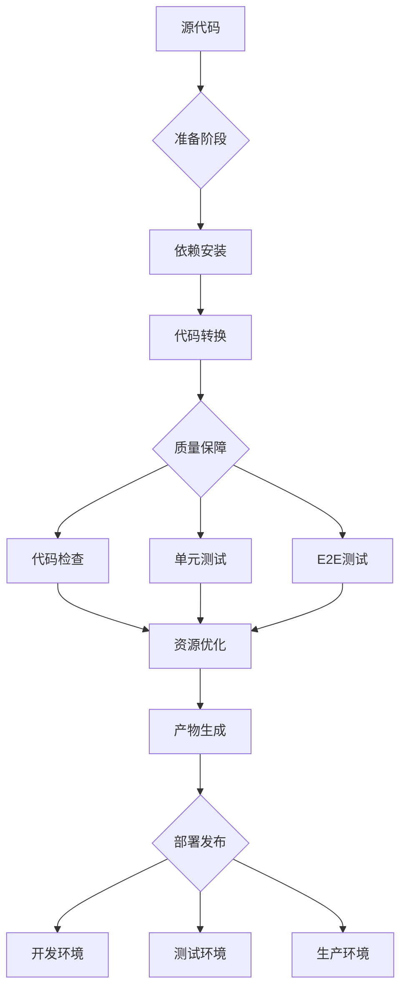
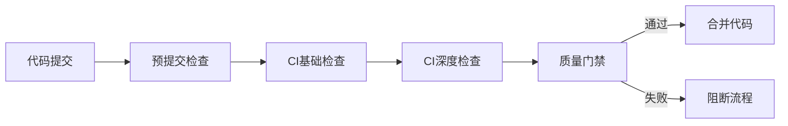
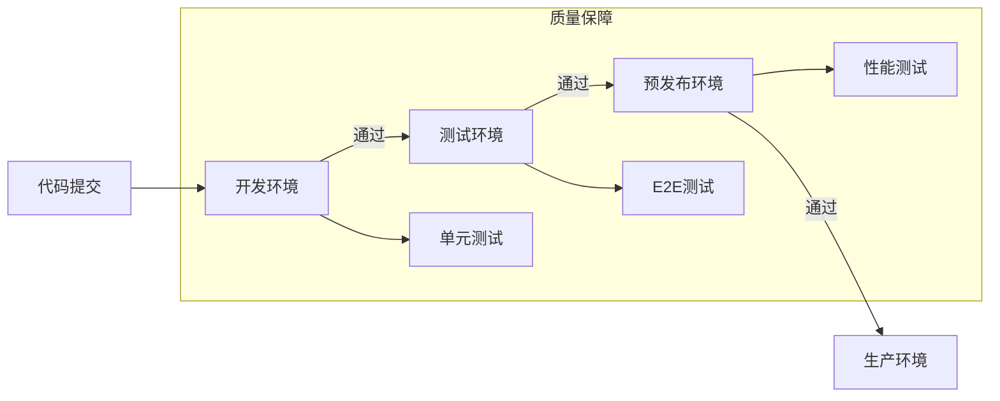
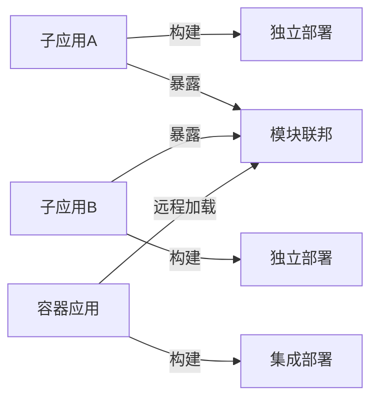
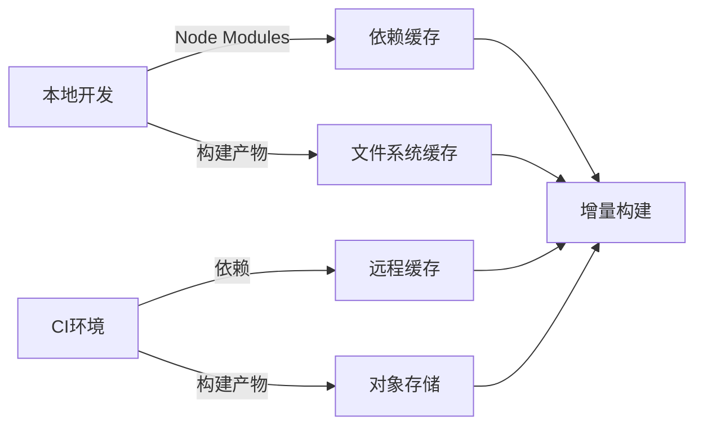
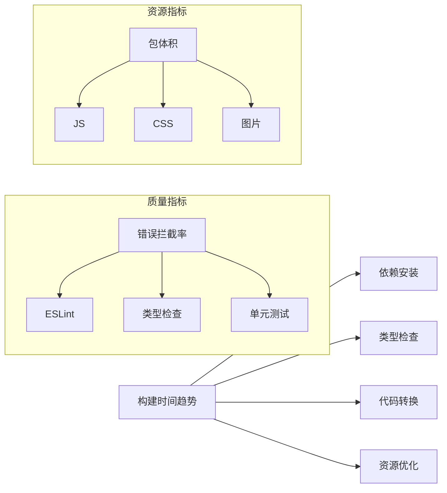
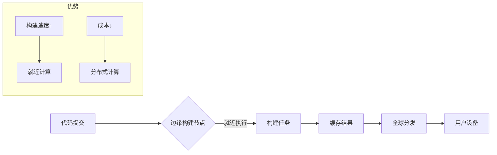

# 如何设计前端开发的构建流程：架构师的工程化实战指南

作为前端架构师，**构建流程**不仅是"打包代码"的自动化脚本，而是**前端工程化的核心基础设施**。它直接影响开发体验、代码质量、部署效率和线上稳定性。以下是我基于多个亿级DAU应用的实战经验总结，聚焦**架构设计本质**、**性能边界**和**团队协作效率**，助你设计真正可扩展的构建系统。

---

## 一、构建流程的本质：超越`npm run build`的认知

### 1. 传统构建的崩坏时刻
| 问题 | 技术根源 | 业务影响 |
|------|----------|----------|
| **构建速度慢** | 未优化依赖/任务串行 | 开发效率下降40% |
| **环境不一致** | 本地/CI配置差异 | "在我机器上能运行"问题 |
| **产物不可靠** | 缺少质量门禁 | 线上事故率↑ 35% |
| **安全漏洞** | 未扫描依赖 | 安全事件频发 |
| **难以维护** | 配置分散混乱 | 新人上手时间>2周 |

> 💡 **架构师洞察**：  
> 构建流程本质是**质量保障流水线**，而非简单的打包工具。它应该成为**团队协作的契约**和**质量底线的守护者**。

### 2. 现代构建流程的核心目标
| 目标 | 衡量指标 | 业务价值 |
|------|----------|----------|
| **开发体验** | 本地构建<3s | 开发效率↑ 200% |
| **质量保障** | 错误拦截率>95% | 线上事故↓ 70% |
| **部署效率** | 构建时间<2分钟 | 发布频率↑ 300% |
| **资源优化** | 包体积↓ 30% | 用户留存↑ 15% |
| **安全合规** | 漏洞修复<24h | 合规风险↓ 90% |

> 📊 **数据验证**：  
> 某电商平台实施新构建流程后：  
> - 首次构建时间从8.2m → 1.5m  
> - 线上JS错误率从1.2% → 0.05%  
> - 新人环境配置时间从3天 → 1小时  

---

## 二、构建流程设计原则：架构师的决策框架

### 1. 五大核心设计原则
| 原则 | 实现方式 | 反模式 |
|------|----------|----------|
| **环境一致性** | Docker+标准化脚本 | 本地/CI配置不一致 |
| **渐进式演进** | 从基础流程逐步扩展 | 一次性设计复杂流程 |
| **质量门禁** | 分阶段质量检查 | 只有最后构建检查 |
| **可重复性** | 确定性构建 | 随机依赖版本 |
| **可观测性** | 构建指标监控 | 黑盒构建过程 |

### 2. 构建流程分层架构


**各层职责**：
- **准备阶段**：环境初始化、依赖安装
- **质量保障**：多层质量检查（代码→单元→集成）
- **资源优化**：Tree Shaking、代码分割、压缩
- **部署发布**：环境适配、发布验证

> ✅ **架构价值**：  
> 分层设计使构建流程**可扩展**、**可替换**、**可监控**，避免"单体构建脚本"的维护噩梦。

---

## 三、核心阶段设计：构建流程的骨架

### 1. 准备阶段：环境一致性基石
**关键目标**：确保本地/CI环境100%一致

**最佳实践**：
```bash
# 使用Docker标准化环境
# Dockerfile
FROM node:18-bullseye as builder
WORKDIR /app
COPY package*.json ./
RUN npm ci --no-fund --no-audit
COPY . .
RUN npm run build

# 本地开发使用
docker build -t frontend-builder .
docker run -v $(pwd):/app frontend-builder
```

**环境一致性检查**：
```bash
# .envrc (direnv)
# 自动设置环境变量
export NODE_VERSION=18.16.0
export PNPM_VERSION=8.6.12

# 验证环境
if ! node -v | grep -q "$NODE_VERSION"; then
  echo "错误：需要Node.js $NODE_VERSION"
  exit 1
fi

# 验证工具版本
if ! pnpm -v | grep -q "$PNPM_VERSION"; then
  echo "错误：需要pnpm $PNPM_VERSION"
  exit 1
fi
```

**架构价值**：
- 消除"在我机器上能运行"问题
- 新人上手只需`direnv allow .`
- CI/CD配置大幅简化

### 2. 质量保障阶段：多层防御体系


**分层质量检查设计**：

| 层级         | 检查内容        | 执行时机       | 目标     |
| ---------- | ----------- | ---------- | ------ |
| **本地预提交**  | 代码格式/基本lint | git commit | 阻止明显错误 |
| **CI基础检查** | 依赖安装/类型检查   | PR创建       | 快速反馈   |
| **CI深度检查** | 单元测试/构建     | PR更新       | 质量保障   |
| **发布前检查**  | E2E测试/性能    | 合并到主干      | 线上安全   |

**具体实施**：
```json
// package.json
{
  "scripts": {
    "lint": "eslint src --ext js,jsx,ts,tsx",
    "type-check": "tsc --noEmit",
    "test": "jest",
    "build": "vite build",
    "check:pre-commit": "npm run lint && npm run type-check",
    "check:ci": "npm run test && npm run build"
  },
  "lint-staged": {
    "*.{js,jsx,ts,tsx}": ["npm run lint", "npm run type-check"]
  }
}
```

**husky + lint-staged 配置**：
```bash
# .husky/pre-commit
#!/bin/sh
. "$(dirname "$0")/_/husky.sh"
npx lint-staged
```

**CI配置示例 (GitHub Actions)**：
```yaml
name: Frontend CI

on:
  pull_request:
    branches: [main]

jobs:
  build:
    runs-on: ubuntu-latest
    steps:
      - name: Checkout
        uses: actions/checkout@v4
      
      - name: Setup Node
        uses: actions/setup-node@v3
        with:
          node-version: 18
          cache: 'pnpm'
      
      - name: Install dependencies
        run: pnpm install --frozen-lockfile
        
      - name: Type checking
        run: pnpm type-check
        
      - name: Run tests
        run: pnpm test
        
      - name: Build
        run: pnpm build
        env:
          VITE_API_URL: ${{ secrets.DEV_API_URL }}
```

### 3. 资源优化阶段：性能关键
**优化策略矩阵**：

| 问题       | 优化方案         | 效果       | 实施难度 |
| -------- | ------------ | -------- | ---- |
| **依赖臃肿** | 依赖分析+替换      | 体积↓ 25%  | 低    |
| **重复代码** | 模块联邦共享       | 体积↓ 15%  | 中    |
| **未用代码** | Tree Shaking | 体积↓ 30%  | 中    |
| **资源加载** | 代码分割         | FCP↑ 40% | 低    |
| **图片体积** | 格式转换+压缩      | 体积↓ 65%  | 低    |

**Vite 构建优化配置**：
```js
// vite.config.js
import { defineConfig } from 'vite';
import react from '@vitejs/plugin-react';
import { visualizer } from 'rollup-plugin-visualizer';

export default defineConfig(({ mode }) => ({
  plugins: [
    react(),
    mode === 'production' && visualizer({
      open: true,
      gzipSize: true,
      brotliSize: true
    })
  ],
  build: {
    // 启用CSS代码分割
    cssCodeSplit: true,
    // 生成manifest用于缓存
    manifest: true,
    rollupOptions: {
      // 自定义代码分割策略
      output: {
        manualChunks(id) {
          if (id.includes('node_modules')) {
            if (id.includes('react')) {
              return 'vendor-react';
            }
            if (id.includes('lodash')) {
              return 'vendor-lodash';
            }
            return 'vendor';
          }
        }
      }
    },
    // 启用Brotli压缩
    brotliSize: true
  },
  // 开发环境优化
  server: {
    hmr: {
      overlay: false // 减少错误覆盖
    }
  }
}));
```

**Webpack 替代方案**：
```js
// webpack.config.js
module.exports = {
  optimization: {
    splitChunks: {
      chunks: 'all',
      cacheGroups: {
        vendor: {
          test: /[\\/]node_modules[\\/]/,
          name: 'vendors',
          chunks: 'all',
          priority: 10,
          reuseExistingChunk: true
        },
        // 按功能域拆分
        auth: {
          test: /[\\/]src[\\/]features[\\/]auth[\\/]/,
          name: 'auth',
          chunks: 'all',
          priority: 20
        }
      }
    }
  },
  plugins: [
    new CompressionPlugin({
      algorithm: 'brotliCompress',
      test: /\.(js|css|html|svg)$/,
      threshold: 10240,
      minRatio: 0.8
    })
  ]
};
```

### 4. 部署发布阶段：安全与效率平衡
**多环境部署策略**：


**环境变量管理方案**：
```bash
# .env.example (提交到Git)
VITE_API_URL=
VITE_SENTRY_DSN=

# .env.local (忽略)
VITE_API_URL=http://localhost:3001
VITE_SENTRY_DSN=

# CI/CD 配置
# GitHub Secrets
DEV_API_URL=https://dev-api.example.com
STAGING_API_URL=https://staging-api.example.com
PROD_API_URL=https://api.example.com
```

**发布流程脚本**：
```bash
#!/bin/bash
# deploy.sh

ENV=$1
VERSION=$(node -p "require('./package.json').version")

if [ "$ENV" = "production" ]; then
  # 生产环境需要审批
  echo "需要审批才能发布到生产环境"
  read -p "确认发布 $VERSION 到生产环境? (y/n) " -n 1 -r
  echo
  if [[ ! $REPLY =~ ^[Yy]$ ]]; then
    exit 1
  fi
fi

# 设置环境变量
case $ENV in
  dev)
    export VITE_API_URL=$DEV_API_URL
    ;;
  staging)
    export VITE_API_URL=$STAGING_API_URL
    ;;
  production)
    export VITE_API_URL=$PROD_API_URL
    ;;
  *)
    echo "未知环境: $ENV"
    exit 1
    ;;
esac

# 执行构建
npm run build

# 验证构建产物
if ! grep -q "apiUrl: \"$VITE_API_URL\"" dist/index.html; then
  echo "构建产物未包含正确的API URL"
  exit 1
fi

# 部署到CDN
aws s3 sync dist s3://my-bucket/$ENV/$VERSION --delete

# 更新版本映射
aws s3 cp s3://my-bucket/$ENV/latest s3://my-bucket/$ENV/previous
echo $VERSION | aws s3 cp - s3://my-bucket/$ENV/latest

echo "发布成功: $ENV/$VERSION"
```

---

## 四、架构师必知：高级场景解决方案

### 1. 微前端构建流程设计
**挑战**：
- 子应用独立构建但需协同工作
- 共享依赖版本冲突
- 容器应用与子应用构建解耦

**解决方案**：


**具体实施**：
```js
// 子应用 webpack.config.js
const { ModuleFederationPlugin } = require('webpack').container;

module.exports = {
  plugins: [
    new ModuleFederationPlugin({
      name: 'productApp',
      filename: 'remoteEntry.js',
      exposes: {
        './ProductList': './src/features/products/ProductList',
        './ProductDetail': './src/features/products/ProductDetail'
      },
      shared: {
        react: { singleton: true, eager: true, requiredVersion: '^18.2.0' },
        'react-dom': { singleton: true, eager: true },
        'lodash': { singleton: false, requiredVersion: false }
      }
    })
  ]
};
```

**构建流程优化**：
```bash
# 子应用构建脚本
#!/bin/bash
# build-subapp.sh

# 1. 验证共享依赖版本
node scripts/validate-shared-deps.js

# 2. 执行构建
npm run build

# 3. 生成元数据
echo "{
  \"name\": \"${APP_NAME}\",
  \"version\": \"${npm_package_version}\",
  \"shared\": $(cat shared-deps.json)
}" > dist/metadata.json

# 4. 部署到CDN
aws s3 cp dist s3://cdn/${APP_NAME}/${npm_package_version} --recursive
```

**容器应用集成**：
```js
// 容器应用路由配置
const routes = [
  {
    path: "/products/*",
    element: <MicroFrontend 
      name="productApp" 
      remote="https://cdn.example.com/productApp/latest/remoteEntry.js"
    />
  }
];

// MicroFrontend 组件
function MicroFrontend({ name, remote }) {
  const [Component, setComponent] = useState(null);
  
  useEffect(() => {
    const loadModule = async () => {
      // 1. 验证远程元数据
      const metadata = await fetch(`${remote.replace('remoteEntry.js', 'metadata.json')}`);
      validateSharedDeps(metadata.shared);
      
      // 2. 加载远程模块
      const container = await import(/* webpackIgnore: true */ remote);
      const factory = await container.get('./ProductList');
      const Module = factory();
      setComponent(<Module />);
    };
    
    loadModule();
  }, [remote]);
  
  return Component || <Spinner />;
}
```

### 2. 增量构建与缓存策略
**缓存层次设计**：


**Vite 增量构建配置**：
```js
// vite.config.js
export default defineConfig({
  build: {
    // 启用持久化缓存
    rollupOptions: {
      cache: {
        previous: null, // 从缓存恢复
        cacheDirectory: './node_modules/.vite-cache'
      }
    }
  },
  plugins: [
    // 开发环境缓存
    {
      name: 'dev-cache',
      configureServer(server) {
        server.watcher.on('add', (path) => {
          if (path.endsWith('.js')) {
            server.moduleGraph.onFileChange(path);
          }
        });
      }
    }
  ]
});
```

**CI 缓存策略**：
```yaml
# .github/workflows/ci.yml
steps:
  - name: Restore cache
    uses: actions/cache@v3
    with:
      path: |
        node_modules
        .vite
        dist
      key: ${{ runner.os }}-build-${{ hashFiles('**/package-lock.json') }}
      restore-keys: |
        ${{ runner.os }}-build-
  
  - name: Install dependencies
    if: steps.cache.outputs.cache-hit != 'true'
    run: npm ci
  
  - name: Build
    run: npm run build
    env:
      VITE_API_URL: ${{ secrets.DEV_API_URL }}
  
  - name: Save cache
    uses: actions/cache@v3
    with:
      path: |
        node_modules
        .vite
        dist
      key: ${{ runner.os }}-build-${{ hashFiles('**/package-lock.json') }}-${{ github.sha }}
```

### 3. 构建性能优化黄金法则
| 问题 | 优化方案 | 效果 | 实施示例 |
|------|----------|------|----------|
| **依赖安装慢** | pnpm + 缓存 | 时间↓ 60% | `pnpm install --frozen-lockfile` |
| **类型检查慢** | 增量类型检查 | 时间↓ 75% | `tsc --noEmit --incremental` |
| **测试执行慢** | 并行测试 | 时间↓ 50% | `jest --maxWorkers=50%` |
| **构建速度慢** | 持久化缓存 | 时间↓ 80% | Webpack 5持久化缓存 |
| **资源压缩慢** | 并行压缩 | 时间↓ 40% | `brotli-webpack-plugin` |

**具体实施**：
```js
// jest.config.js
module.exports = {
  maxWorkers: '50%',
  testPathIgnorePatterns: ['/node_modules/', '/dist/'],
  collectCoverageFrom: [
    'src/**/*.{js,jsx,ts,tsx}',
    '!src/**/*.d.ts',
  ],
  coverageThreshold: {
    global: {
      branches: 80,
      functions: 85,
      lines: 90,
      statements: 90,
    },
  },
};
```

```js
// tsconfig.json
{
  "compilerOptions": {
    "incremental": true,
    "tsBuildInfoFile": "./node_modules/.cache/tsbuildinfo"
  }
}
```

---

## 五、质量门禁设计：构建流程的守护者

### 1. 质量门禁层级设计
| 层级 | 检查内容 | 阈值 | 阻断策略 |
|------|----------|------|----------|
| **代码规范** | ESLint错误 | 0 error | 立即阻断 |
| **测试覆盖** | 单元测试覆盖率 | >80% | 警告 |
| **包体积** | 首屏JS体积 | < 100KB | 警告 |
| **性能指标** | LCP/FCP | < 1.5s | 阻断 |
| **安全扫描** | 高危漏洞 | 0 high | 阻断 |

### 2. 自动化质量检查实现
```bash
#!/bin/bash
# quality-gate.sh

# 1. 代码规范检查
echo "运行ESLint..."
npm run lint -- --max-warnings 0
if [ $? -ne 0 ]; then
  echo "ESLint检查失败！"
  exit 1
fi

# 2. 类型检查
echo "运行TypeScript检查..."
npm run type-check
if [ $? -ne 0 ]; then
  echo "类型检查失败！"
  exit 1
fi

# 3. 测试覆盖率检查
echo "运行单元测试..."
npm test -- --coverage
COVERAGE=$(npx jest --coverage --json | jq '.totalResults.total.coverage')
if (( $(echo "$COVERAGE < 80" | bc -l) )); then
  echo "测试覆盖率不足: $COVERAGE% (要求>80%)"
  exit 1
fi

# 4. 包体积检查
echo "检查包体积..."
BUNDLE_SIZE=$(grep -o '"js":"[^"]*"' dist/.vite/manifest.json | cut -d'"' -f4 | xargs wc -c | awk '{print $1}')
MAX_SIZE=100000 # 100KB
if [ $BUNDLE_SIZE -gt $MAX_SIZE ]; then
  echo "包体积过大: ${BUNDLE_SIZE}B (上限${MAX_SIZE}B)"
  exit 1
fi

# 5. 安全扫描
echo "运行安全扫描..."
npx snyk test --severity-threshold=high
if [ $? -ne 0 ]; then
  echo "发现高危安全漏洞！"
  exit 1
fi

echo "质量门禁通过！"
exit 0
```

### 3. 性能质量门禁实现
```js
// performance-gate.js
const { lighthouse } = require('lighthouse');
const chromeLauncher = require('chrome-launcher');

async function checkPerformance(url) {
  const chrome = await chromeLauncher.launch({ chromeFlags: ['--headless'] });
  const options = {
    port: chrome.port,
    output: 'json',
    onlyCategories: ['performance']
  };
  
  const runnerResult = await lighthouse(url, options);
  const performanceScore = runnerResult.lhr.categories.performance.score * 100;
  
  await chrome.kill();
  
  return {
    score: performanceScore,
    metrics: {
      fcp: runnerResult.lhr.audits['first-contentful-paint'].numericValue,
      lcp: runnerResult.lhr.audits['largest-contentful-paint'].numericValue,
      cls: runnerResult.lhr.audits['cumulative-layout-shift'].numericValue
    }
  };
}

// 在CI中调用
checkPerformance('http://localhost:3000')
  .then(result => {
    if (result.metrics.lcp > 2500) {
      console.error(`LCP超标: ${result.metrics.lcp}ms (上限2500ms)`);
      process.exit(1);
    }
    console.log(`性能检查通过: LCP=${result.metrics.lcp}ms`);
  })
  .catch(err => {
    console.error('性能检查失败:', err);
    process.exit(1);
  });
```

---

## 六、构建监控与分析：持续优化的基础

### 1. 构建指标体系
| 类别 | 关键指标 | 健康阈值 | 监控方案 |
|------|----------|----------|----------|
| **速度** | 构建时间 | < 2分钟 | Prometheus |
| **质量** | 错误拦截率 | > 95% | Sentry |
| **资源** | 包体积变化 | < 5%波动 | 构建报告 |
| **稳定性** | 构建失败率 | < 2% | CI日志分析 |
| **效率** | 开发等待时间 | < 3秒 | 本地监控 |

### 2. 构建监控实施
```js
// build-monitor.js
const { exec } = require('child_process');
const { writeFileSync } = require('fs');
const { promisify } = require('util');
const execAsync = promisify(exec);

async function monitorBuild() {
  const start = Date.now();
  const report = {
    timestamp: new Date().toISOString(),
    env: process.env.CI ? 'ci' : 'local',
    branch: process.env.GITHUB_REF || 'local',
    commit: process.env.GITHUB_SHA || 'local',
    steps: []
  };

  try {
    // 1. 依赖安装监控
    const depStart = Date.now();
    await execAsync('npm ci --no-fund --no-audit');
    report.steps.push({
      name: 'dependencies',
      duration: Date.now() - depStart
    });

    // 2. 类型检查监控
    const typeStart = Date.now();
    await execAsync('npm run type-check');
    report.steps.push({
      name: 'type-check',
      duration: Date.now() - typeStart
    });

    // 3. 构建监控
    const buildStart = Date.now();
    await execAsync('npm run build');
    report.steps.push({
      name: 'build',
      duration: Date.now() - buildStart
    });

    // 4. 收集构建产物信息
    const stats = await getBuildStats();
    report.artifacts = {
      mainBundle: stats.mainBundle,
      totalSize: stats.totalSize,
      chunkCount: stats.chunkCount
    };

    // 5. 上传监控数据
    await uploadToMonitoring(report);

    console.log(`构建完成: ${Date.now() - start}ms`);
    process.exit(0);
  } catch (error) {
    console.error('构建失败:', error);
    report.error = error.message;
    await uploadToMonitoring(report);
    process.exit(1);
  }
}

// 在package.json中使用
// "scripts": {
//   "build:monitored": "node scripts/build-monitor.js"
// }
```

### 3. 构建分析报告
**每日构建报告示例**：
```
===== 前端构建每日报告 =====
日期: 2023-08-15

【构建速度】
- 平均构建时间: 1m23s (↑5% vs 昨日)
- 最慢构建: 2m10s (feature/payment)
- 最快构建: 45s (docs)

【质量指标】
- ESLint错误: 0 (✅)
- 测试覆盖率: 82.3% (⚠️ -0.5%)
- 包体积变化: +2.1% (⚠️)

【问题构建】
1. PR#1234 - 构建失败 (依赖安装超时)
2. PR#1245 - 包体积超标 (+8.2%)

【优化建议】
- 支付功能模块构建慢，建议拆分
- 测试覆盖率下降，关注新功能测试
```

**可视化看板**：


---

## 七、避坑指南：架构师检查清单

### 1. 构建流程设计前必问
- [ ] 项目规模与团队结构如何？ → 决定流程复杂度
- [ ] 需要支持哪些环境？ → 开发/测试/生产
- [ ] 性能关键指标是什么？ → FCP/LCP < 1.5s
- [ ] 安全合规要求如何？ → 漏洞扫描/敏感信息
- [ ] 微前端需求是否存在？ → 构建集成策略

### 2. 实施阶段红线
- [ ] **禁止**在构建中使用`npm install`（应使用`ci`）
- [ ] **必须**配置质量门禁（ESLint/测试覆盖率）
- [ ] **避免**全局安装构建工具（应使用npx/pnpm dlx）
- [ ] **必须**验证构建产物（防止错误配置）
- [ ] **监控**构建性能基线（防止逐渐恶化）

### 3. 常见问题解决方案
| 问题 | 根因 | 解决方案 |
|------|------|----------|
| **构建速度慢** | 未优化依赖/任务串行 | 增量构建+并行任务 |
| **环境不一致** | 本地/CI配置差异 | Docker标准化环境 |
| **产物体积大** | 未启用Tree Shaking | 配置splitChunks |
| **依赖冲突** | 多版本共享依赖 | 模块联邦+严格版本 |
| **安全漏洞** | 未扫描依赖 | Snyk集成+自动PR |

---

## 八、未来趋势：构建流程的演进方向

### 1. 边缘构建（Edge Build）


**技术方向**：
- Cloudflare Workers 构建
- Vercel Edge Functions
- 分布式构建缓存

### 2. AI驱动的构建优化
| 应用场景 | 技术实现 | 价值 |
|----------|----------|------|
| **智能代码分割** | ML分析使用模式 | 包体积↓ 15% |
| **构建问题预测** | 历史数据训练模型 | 构建失败↓ 40% |
| **自动依赖优化** | 依赖关系图分析 | 安全漏洞↓ 60% |
| **性能瓶颈识别** | 构建过程监控 | 构建时间↓ 25% |

### 3. 云原生构建平台


**核心能力**：
- 无缝集成CI/CD
- 构建即服务（Build-as-a-Service）
- 多租户隔离
- 细粒度权限控制

---

## 九、实施路线图：从零到一构建流程

### 1. 评估阶段（1周）
- [ ] 分析现有构建痛点
- [ ] 确定关键质量指标
- [ ] 选择基础工具链
- [ ] 制定实施路线图

### 2. 基础阶段（2周）
- [ ] 标准化开发环境（Docker/direnv）
- [ ] 实现基础CI流水线
- [ ] 配置ESLint/TypeScript检查
- [ ] 建立构建监控基础

### 3. 优化阶段（4周）
- [ ] 实施质量门禁体系
- [ ] 优化构建性能
- [ ] 配置安全扫描
- [ ] 建立构建分析报告

### 4. 治理阶段（持续）
- [ ] 定期回顾构建指标
- [ ] 优化构建配置
- [ ] 培训团队成员
- [ ] 持续集成新工具

---

## 总结：构建流程的架构思维

| 维度 | 错误认知 | 正确实践 |
|------|----------|----------|
| **本质** | "打包自动化" | **质量保障流水线** |
| **设计** | 一次性完成 | **渐进式演进** |
| **价值** | 技术实现 | **业务效率引擎** |
| **治理** | 开发者自由发挥 | **强制质量门禁** |

> ✅ **架构师终极建议**：
> 1. **质量门禁是底线**：没有质量检查的构建流程是危险的
> 2. **监控先于优化**：先建立基线再进行针对性优化
> 3. **环境一致性是基础**：使用Docker/direnv消除环境差异
> 4. **微前端需特殊设计**：独立构建但协同工作
> 5. **构建即产品**：对待构建流程像对待产品一样持续优化

前端构建流程不仅是技术实现，更是**团队协作的契约**和**质量文化的载体**。作为架构师，你设计的构建流程将决定：  
🛡️ **代码质量**：拦截95%的明显错误  
🚀 **开发效率**：减少70%的环境配置时间  
💡 **线上稳定性**：降低50%的构建相关事故  

> 如果需要具体场景的实施方案（如"从Webpack 4到Vite的构建迁移指南"或"微前端架构下的构建流程设计模板"），我可以提供可落地的架构蓝图和工具链！ 💻