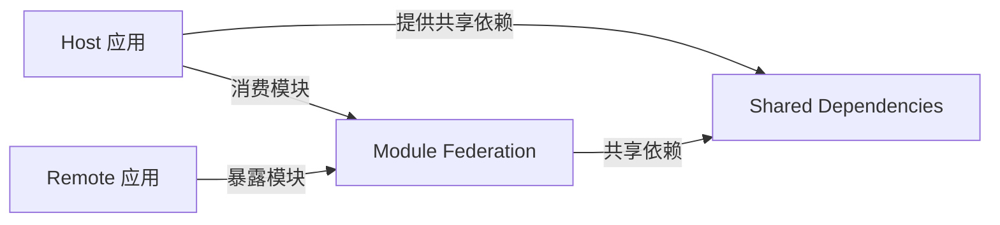

### Webpack Module Federation 深度解析：微前端的构建层革命

Webpack Module Federation (MF) 是 **Webpack 5 内置的微前端解决方案**，它**从构建层面实现模块级联邦**，彻底改变了传统微前端的集成方式。与 Qiankun 等运行时方案不同，MF 通过**编译时优化**解决了依赖共享、版本管理等核心痛点。本文将从**原理到实战**，带你彻底掌握这一颠覆性技术（附大量可运行代码示例）。

---

## 一、为什么 Module Federation 是微前端的未来？
### 传统微前端方案的致命缺陷
| 问题         | Qiankun 等方案              | Module Federation 解决方案 |
| ---------- | ------------------------ | ---------------------- |
| **依赖重复加载** | 多个子应用都引入 React → 重复打包    | **编译时识别共享依赖**，只加载一次    |
| **版本冲突**   | React 16 和 18 混用 → 兼容性问题 | **自动降级/升级** 共享模块版本     |
| **通信复杂度**  | 需手动实现事件总线                | **直接 import 远程模块**     |
| **首屏性能**   | 需加载完整子应用                 | **按需加载模块**（细粒度）        |
| **技术栈限制**  | 支持多框架但隔离成本高              | **同构应用更高效**（推荐同技术栈）    |

> 💡 **核心突破**：  
> MF 不是"运行时加载子应用"，而是 **"编译时构建模块联邦"**  
> → 传统方案：`<script src="app1.js">` → 加载整个应用  
> → MF 方案：`import { Button } from 'app1/Button'` → 只加载需要的模块

---

## 二、Module Federation 核心概念图解
### 三大核心角色（必懂！）


| 角色         | 职责                                    | 配置关键词              |
| ---------- | ------------------------------------- | ------------------ |
| **Host**   | 容器应用（通常为主应用），**消费** Remote 暴露的模块      | `remotes: { ... }` |
| **Remote** | 子应用，**暴露**自身模块供 Host 或其他 Remote 使用    | `name`, `exposes`  |
| **Shared** | 共享依赖（如 React），由 Host 提供，Remote 自动降级使用 | `shared: { ... }`  |

### 关键特性对比（MF vs 传统方案）
| 特性                | Module Federation                     | 传统微前端（如 Qiankun）        |
|---------------------|---------------------------------------|---------------------------------|
| **集成粒度**         | **模块级**（可 import 单个组件）      | 应用级（加载整个子应用）        |
| **依赖管理**         | 编译时自动处理版本冲突                | 运行时手动处理                  |
| **加载机制**         | 通过 `import()` 动态加载              | 通过 `<script>` 加载            |
| **技术栈灵活性**     | 同构应用最佳（React/React）           | 支持多框架（React/Vue/Angular） |
| **调试体验**         | 像本地模块一样调试                    | 需跨应用调试                    |

> ✅ **MF 最佳适用场景**：  
> - 同技术栈的大型系统（如全 React 企业应用）  
> - 对性能要求极高（需细粒度加载）  
> - 团队熟悉 Webpack 配置

---

## 三、核心配置详解（附完整代码示例）
### 基础配置三要素
#### 1. Remote 应用配置（子应用）
```javascript
// 子应用 webpack.config.js
const { ModuleFederationPlugin } = require('webpack').container;

module.exports = {
  plugins: [
    new ModuleFederationPlugin({
      name: 'productApp', // 远程应用唯一标识
      filename: 'remoteEntry.js', // 生成的入口文件
      exposes: {
        // 暴露模块路径: 实际文件路径
        './ProductList': './src/components/ProductList',
        './utils': './src/utils/index'
      },
      shared: {
        // 声明共享依赖（会自动处理版本）
        react: { singleton: true, eager: true, requiredVersion: '^18.2.0' },
        'react-dom': { singleton: true, eager: true }
      }
    })
  ]
};
```
> ⚠️ **关键参数说明**：
> - `singleton: true` → 强制使用单例（避免多版本 React 冲突）
> - `eager: true` → 预加载共享依赖（提升性能）
> - `requiredVersion` → 指定兼容版本范围

#### 2. Host 应用配置（主应用）
```javascript
// 主应用 webpack.config.js
module.exports = {
  plugins: [
    new ModuleFederationPlugin({
      name: 'mainApp',
      remotes: {
        // 远程应用名: "远程应用名称@入口地址"
        productApp: 'productApp@http://localhost:3001/remoteEntry.js',
        userApp: 'userApp@http://localhost:3002/remoteEntry.js'
      },
      shared: {
        // 必须与 Remote 保持一致
        react: { singleton: true, eager: true },
        'react-dom': { singleton: true, eager: true }
      }
    })
  ]
};
```

#### 3. 模块消费方式（Host 中使用 Remote 模块）
```jsx
// 主应用中直接 import 远程模块
import ProductList from 'productApp/ProductList';
import { fetchUser } from 'userApp/utils';

function HomePage() {
  return (
    <div>
      <h1>主应用</h1>
      {/* 直接使用远程组件 */}
      <ProductList />
      
      {/* 调用远程工具函数 */}
      <button onClick={() => fetchUser(1)}>加载用户</button>
    </div>
  );
}
```
> ✨ **革命性体验**：  
> 对开发者而言，**远程模块和本地模块无任何区别**！  
> → 无需特殊 API，直接 `import` 即可使用

---

## 四、高级特性与实战技巧
### 解决 90% 生产问题的核心方案
#### 1. 动态加载远程模块（按需加载）
```jsx
// 使用 React.lazy 实现代码分割
const RemoteProductList = React.lazy(() => import('productApp/ProductList'));

function LazyPage() {
  return (
    <React.Suspense fallback={<Spinner />}>
      <RemoteProductList />
    </React.Suspense>
  );
}
```
> ✅ **性能提升**：  
> - 首屏只加载必要代码  
> - 子应用模块在需要时才加载

#### 2. 多级联邦（Remote 间互相调用）
```javascript
// Remote 1 配置
new ModuleFederationPlugin({
  name: 'cartApp',
  remotes: {
    // 从另一个 Remote 加载
    productApp: 'productApp@http://localhost:3001/remoteEntry.js'
  },
  exposes: {
    './Cart': './src/Cart'
  }
});

// Remote 2 配置
new ModuleFederationPlugin({
  name: 'productApp',
  exposes: {
    './ProductList': './src/ProductList'
  }
});
```
> 🌟 **场景价值**：  
> 购物车应用 (cartApp) 直接消费商品列表 (productApp)，**无需经过主应用中转**

#### 3. 依赖版本冲突解决方案
```javascript
// 主应用配置
shared: {
  react: {
    singleton: true,
    requiredVersion: '^18.2.0',
    // 当版本不匹配时自动降级
    version: '18.2.0',
    // 自定义版本冲突处理
    override: (e) => {
      console.warn('React 版本冲突', e);
      return e.local; // 优先使用本地版本
    }
  }
}
```
> 💡 **MF 版本协商机制**：  
> 1. Host 声明期望版本 `requiredVersion`  
> 2. Remote 提供实际版本  
> 3. MF 自动选择兼容版本（通过 `override` 可自定义策略）

#### 4. 独立开发调试技巧
```javascript
// webpack.config.js
const remoteUrl = process.env.NODE_ENV === 'development'
  ? 'http://localhost:3001/remoteEntry.js'
  : 'https://cdn.example.com/remoteEntry.js';

new ModuleFederationPlugin({
  remotes: {
    productApp: `productApp@${remoteUrl}`
  }
});
```
> ✅ **开发流程**：  
> 1. 启动 Remote 应用（`npm run start`）  
> 2. 启动 Host 应用 → 自动连接本地 Remote  
> 3. 修改 Remote 代码 → 热更新生效

---

## 五、避坑指南：MF 高频问题解决方案
### 10 大生产环境陷阱（附修复方案）
| 问题现象                  | 根本原因               | 解决方案                                                                   |
| --------------------- | ------------------ | ---------------------------------------------------------------------- |
| **Module not found**  | Remote 未正确暴露模块     | 检查 `exposes` 路径是否匹配文件实际路径                                              |
| **React Hooks error** | 多个 React 实例        | 确保 `shared: { react: { singleton: true } }`                            |
| **样式丢失**              | CSS 未通过 MF 加载      | 1. 用 CSS-in-JS<br>2. 或单独加载 CSS 文件                                      |
| **热更新失效**             | Webpack HMR 配置冲突   | 主应用添加 `hot: true`：<br>`new ModuleFederationPlugin({ ..., hot: true })` |
| **IE11 兼容问题**         | MF 依赖 ES6+         | 1. 添加 `@babel/preset-env`<br>2. 配置 `output.libraryTarget: 'umd'`       |
| **共享依赖未生效**           | `eager: false`（默认） | 设为 `eager: true` 确保预加载                                                 |
| **子应用无法独立访问**         | 未处理全局变量            | ```js if (!window.__POWERED_BY_QIANKUN__) { /* 独立运行逻辑 */ } ```         |
| **路由冲突**              | 子应用使用 History 路由   | 子应用必须用 Hash 路由：<br>`new BrowserRouter({ basename: '/product' })`       |
| **生产环境加载超时**          | CDN 未配置缓存          | 1. 设置 `filename: 'remoteEntry.[contenthash].js'`<br>2. 配置 CDN 缓存策略     |
| **TypeScript 类型丢失**   | 未生成类型声明            | 1. 用 `dts-plugin` 生成类型<br>2. 或手动声明模块：`declare module 'productApp/*'`   |

### ⚠️ 重大限制（必须知道！）
1. **仅支持 Webpack 5+**（Create React App 5+ 已内置）
2. **同构应用效果最佳**（React/React 组合最成熟）
3. **不支持 IE11**（需大量 polyfill）
4. **调试较复杂**：需理解联邦模块的加载链路

---

## 六、MF vs Qiankun 深度对比
### 🆚 何时选择哪种方案？
| 场景                          | 推荐方案                     | 原因                                                                 |
|-------------------------------|------------------------------|----------------------------------------------------------------------|
| **全 React/Vue 技术栈**       | ✅ Module Federation          | 无额外框架，依赖共享更彻底，性能更好                                 |
| **多框架混合**（React+Vue）   | ✅ Qiankun                   | MF 对异构支持弱，Qiankun 沙箱隔离更可靠                              |
| **需要 IE11 支持**            | ✅ Qiankun                   | MF 依赖 ES6+，Qiankun 可通过 LegacySandbox 兼容                      |
| **细粒度模块共享**            | ✅ Module Federation          | 可 import 单个组件，MF 天然支持                                     |
| **快速落地简单场景**          | ✅ Module Federation          | 配置更简单（无需生命周期钩子）                                       |
| **复杂通信场景**              | ⚖️ 混合方案                  | MF 做模块共享 + Qiankun 做应用级隔离                                 |

> 💡 **终极决策树**：  
> ```mermaid
> graph TD
>   A[技术栈是否统一？] 
>   A -->|是| B{性能要求极高？}
>   A -->|否| C[选 Qiankun]
>   B -->|是| D[选 Module Federation]
>   B -->|否| E{需要快速落地？}
>   E -->|是| D
>   E -->|否| F[评估混合方案]
> ```

---

## 七、实战项目：从零搭建 MF 应用
### 🚀 三步实现主子应用通信
#### 步骤 1：创建 Remote 应用（商品模块）
```bash
# 创建 React 应用
npx create-react-app product-app --template redux
cd product-app

# 修改 webpack 配置（使用 craco）
npm install @craco/craco -D
```

```javascript
// craco.config.js
const ModuleFederationPlugin = require('webpack/lib/container/ModuleFederationPlugin');

module.exports = {
  webpack: {
    configure: (webpackConfig) => {
      webpackConfig.output.publicPath = 'http://localhost:3001/';
      
      webpackConfig.plugins.push(
        new ModuleFederationPlugin({
          name: 'productApp',
          filename: 'remoteEntry.js',
          exposes: {
            './ProductList': './src/features/products/ProductList',
            './ProductDetail': './src/features/products/ProductDetail'
          },
          shared: { 
            ...deps, 
            react: { singleton: true, eager: true }, 
            'react-dom': { singleton: true, eager: true } 
          }
        })
      );
      
      return webpackConfig;
    }
  }
};
```

#### 步骤 2：创建 Host 应用（主应用）
```bash
npx create-react-app main-app
cd main-app
npm install @craco/craco -D
```

```javascript
// craco.config.js
module.exports = {
  webpack: {
    configure: (webpackConfig) => {
      webpackConfig.output.publicPath = 'http://localhost:3000/';
      
      webpackConfig.plugins.push(
        new ModuleFederationPlugin({
          name: 'mainApp',
          remotes: {
            productApp: 'productApp@http://localhost:3001/remoteEntry.js'
          },
          shared: {
            react: { singleton: true, eager: true },
            'react-dom': { singleton: true, eager: true }
          }
        })
      );
      
      return webpackConfig;
    }
  }
};
```

#### 步骤 3：主应用消费远程模块
```jsx
// main-app/src/App.js
import React, { Suspense } from 'react';

const ProductList = React.lazy(() => import('productApp/ProductList'));

function App() {
  return (
    <div className="App">
      <header className="App-header">
        <h1>主应用</h1>
        <Suspense fallback={<div>Loading products...</div>}>
          <ProductList />
        </Suspense>
      </header>
    </div>
  );
}
```

#### 启动命令
```bash
# 启动商品模块
cd product-app && npm start

# 启动主应用（自动连接本地商品模块）
cd main-app && npm start
```

> ✨ **效果**：  
> - 修改 `product-app` 代码 → 主应用自动热更新  
> - 打开 Network 面板 → 只加载了 `ProductList` 模块（非整个应用）

---

## 八、学习路径建议（高效掌握 MF）
### 📚 分阶段实战计划
| 阶段         | 目标                          | 具体行动                                                                 |
|--------------|-------------------------------|--------------------------------------------------------------------------|
| **Day 1**    | 跑通基础 demo                 | 1. 用 [create-mf-app](https://github.com/module-federation/module-federation-examples) 创建主子应用<br>2. 实现模块 import |
| **Day 2**    | 掌握依赖共享                  | 1. 配置 React 单例共享<br>2. 模拟版本冲突（React 17 vs 18）验证解决方案 |
| **Day 3**    | 实现多级联邦                  | 1. 让 Remote A 消费 Remote B 的模块<br>2. 验证依赖传递（A → B → React） |
| **Day 4-5**  | 生产环境集成                  | 1. 配置 CDN 部署<br>2. 添加 TypeScript 类型支持<br>3. 实现错误边界处理 |
| **Week 2**   | 复杂场景实战                  | 1. 与状态管理集成（Redux/Zustand）<br>2. 实现动态远程模块注册           |

### 🔗 必看资源清单
- **官方文档**：  
  [Webpack Module Federation 指南](https://webpack.js.org/concepts/module-federation/)（必读基础）
- **实战仓库**：  
  - [官方示例库](https://github.com/module-federation/module-federation-examples)（含 React/Vue 案例）  
  - [Next.js + MF 集成](https://github.com/ScriptedAlchemy/NextFederationPlugin)
- **深度解析**：  
  - [MF 原理剖析](https://indepth.dev/posts/1184/webpack-5-module-federation-a-game-changer-in-javascript-architecture)  
  - [MF 与微前端演进](https://www.infoq.com/articles/micro-frontends-module-federation/)

---

## 九、高级技巧：超越基础用法
### 🔥 生产级优化方案
#### 1. 动态远程模块注册（无需重启）
```javascript
// 主应用运行时添加 Remote
const addRemote = (name, url) => {
  const script = document.createElement('script');
  script.src = url;
  script.onload = () => {
    window.__webpack_init_sharing__('default');
    const container = window[name];
    container.init(__webpack_share_scopes__.default);
  };
  document.head.appendChild(script);
};

// 使用示例
addRemote('marketingApp', 'https://cdn.com/marketing/remoteEntry.js');
```

#### 2. 与状态管理集成（Redux 示例）
```jsx
// Remote 应用暴露 store slice
export const productSlice = createSlice({ ... });

export const useProductStore = () => {
  const store = useStore();
  if (!store.product) {
    store.product = configureStore({ reducer: productSlice.reducer });
  }
  return store.product;
};
```

#### 3. 性能监控方案
```javascript
// 主应用添加加载性能监控
performance.mark('mf-start');
import('productApp/ProductList').then(() => {
  performance.mark('mf-end');
  const duration = performance.measure('mf-load', 'mf-start', 'mf-end');
  logToAnalytics('mf_load_time', duration.duration);
});
```

---

## 最后：关键总结
### ✅ 必须掌握的 3 个核心
1. **模块联邦本质**：  
   → 不是加载应用，而是**构建时创建模块映射表**  
   → `import('remote/app')` 被编译为 `__webpack_require__.e("remote_app").then(() => ...)`

2. **依赖共享机制**：  
   → 通过 `shared` 配置建立**版本协商规则**  
   → Host 提供依赖 → Remote 自动降级使用

3. **开发体验优势**：  
   → 远程模块**像本地模块一样调试**  
   → 修改 Remote → Host **自动热更新**

### 🚫 避免失败的 3 个原则
1. **不要过度拆分**：  
   → 按**业务域**拆分（如 `product`, `cart`），而非按技术拆分
   
2. **严格统一共享依赖**：  
   → 所有应用必须使用**完全相同的 React 版本声明**  
   → `shared: { react: { singleton: true, requiredVersion: '^18.2.0' } }`

3. **优先选择同构技术栈**：  
   → React + React 组合最成熟  
   → 避免在 MF 中混合 Vue/React（用 Qiankun 处理异构）

> 🌟 **行动建议**：  
> 1. 立刻用 `npx create-mf-app@latest` 创建 **React 主应用 + 2 个 Remote**  
> 2. 故意在 Remote 中使用 `React.useId()`（React 18+ API），验证版本降级  
> 3. 在 Network 面板中观察 `remoteEntry.js` 和模块加载顺序  

**遇到问题？** 请提供：  
- 你的 Webpack 版本和配置片段  
- 具体错误信息（截图更佳）  
- 你期望的模块调用方式  
我可以帮你精准定位 MF 配置问题！ 😄