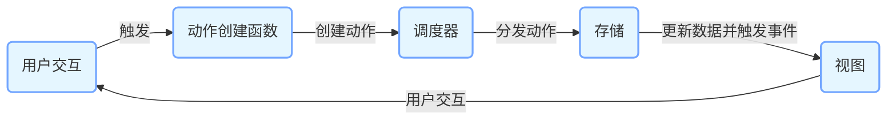

Flux 是由 Facebook 提出的一种用于构建用户界面的应用架构模式，主要用于处理单向数据流，常与 React 一起使用，不过它的概念也可以应用于其他前端框架。下面从多个方面详细介绍 Flux 架构模式：

### 核心概念

Flux 架构基于单向数据流的思想，主要包含四个核心部分：

- **动作（Action）**
  - **定义**：动作是一个描述发生了什么事情的对象，通常包含一个 `type` 属性来标识动作的类型，还可以携带额外的数据（`payload`）。
  - **作用**：动作是应用中数据变化的唯一来源，用于触发后续的处理流程。例如，在一个待办事项应用中，添加待办事项的动作可能如下：

```javascript
const addTodoAction = {
  type: "ADD_TODO",
  payload: {
    text: "学习 Flux 架构",
  },
};
```

- **动作创建函数（Action Creator）**
  - **定义**：动作创建函数是一个返回动作对象的函数。它的作用是封装动作的创建逻辑，使代码更具可维护性和复用性。
  - **示例**：

```javascript
function addTodo(text) {
  return {
    type: "ADD_TODO",
    payload: { text },
  };
}
```

- **调度器（Dispatcher）**
  - **定义**：调度器是一个全局的单例对象，负责接收所有的动作，并将它们分发给所有注册的回调函数。
  - **作用**：它确保动作以有序的方式被处理，并且所有的存储（Store）都能接收到动作。在 Flux 中，只有一个调度器实例。例如，在 Facebook 的 Flux 实现中，`Dispatcher` 类可以这样使用：

```javascript
import { Dispatcher } from "flux";
const dispatcher = new Dispatcher();
```

- **存储（Store）**
  - **定义**：存储是应用中数据和业务逻辑的集合。它监听调度器分发的动作，并根据动作的类型更新自身的数据状态。
  - **作用**：存储不直接与视图交互，而是通过触发事件来通知视图数据已经发生了变化。例如，在待办事项应用中，存储可能会维护一个待办事项列表，并根据 `ADD_TODO` 动作更新该列表：

```javascript
import { EventEmitter } from "events";
import dispatcher from "./dispatcher";

class TodoStore extends EventEmitter {
  constructor() {
    super();
    this.todos = [];
  }

  getAll() {
    return this.todos;
  }

  handleActions(action) {
    switch (action.type) {
      case "ADD_TODO":
        this.todos.push(action.payload.text);
        this.emit("change");
        break;
      default:
        break;
    }
  }
}

const todoStore = new TodoStore();
dispatcher.register(todoStore.handleActions.bind(todoStore));
export default todoStore;
```

- **视图（View）**
  - **定义**：视图负责将存储中的数据呈现给用户，通常由 React 组件等实现。
  - **作用**：视图监听存储的变化事件，当存储的数据发生变化时，视图更新自身的显示。例如：

```jsx
import React, { Component } from "react";
import todoStore from "./todoStore";

class TodoList extends Component {
  constructor(props) {
    super(props);
    this.state = {
      todos: todoStore.getAll(),
    };
    this.onChange = this.onChange.bind(this);
  }

  componentDidMount() {
    todoStore.on("change", this.onChange);
  }

  componentWillUnmount() {
    todoStore.removeListener("change", this.onChange);
  }

  onChange() {
    this.setState({
      todos: todoStore.getAll(),
    });
  }

  render() {
    return (
      <ul>
        {this.state.todos.map((todo, index) => (
          <li key={index}>{todo}</li>
        ))}
      </ul>
    );
  }
}

export default TodoList;
```

### 工作流程

1. **用户交互触发动作**：用户在视图上进行操作（如点击按钮、输入文本等），触发相应的动作创建函数，生成动作对象。
2. **动作发送到调度器**：动作创建函数将动作对象发送给调度器。
3. **调度器分发动作**：调度器接收到动作后，将其分发给所有注册的存储。
4. **存储处理动作**：存储根据动作的类型更新自身的数据状态，并触发相应的变化事件。
5. **视图更新**：视图监听存储的变化事件，当事件触发时，视图从存储中获取最新的数据并更新界面。



### 优点

- **单向数据流**：数据的流动方向是单向的，易于理解和调试。开发者可以清晰地追踪数据的变化路径，当出现问题时，能够快速定位到问题所在。
- **可维护性**：各个部分的职责明确，代码结构清晰。存储负责数据和业务逻辑，视图负责呈现，动作和调度器负责数据的流动控制，使得代码更易于维护和扩展。
- **可测试性**：由于各个部分的独立性，每个部分都可以单独进行单元测试，提高了代码的可测试性。

### 缺点

- **代码冗余**：对于简单的应用，Flux 架构可能会引入过多的样板代码，增加了开发的复杂度和工作量。
- **学习曲线**：对于初学者来说，理解 Flux 的概念和工作流程可能有一定的难度，需要花费时间来学习和掌握。
