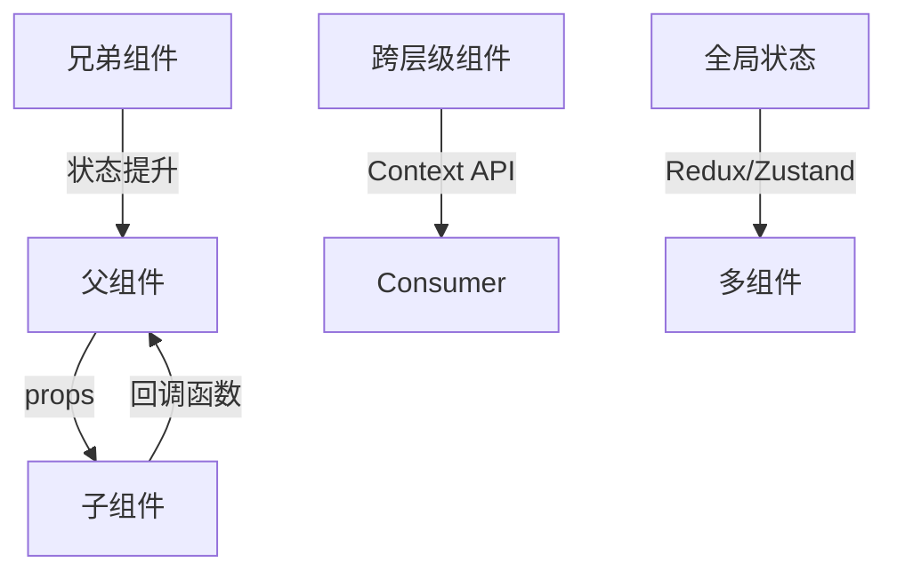

> 现代前端框架的组件化架构，如React


以下是关于 **React 组件化架构** 的深度解析，涵盖设计模式、核心原则与最佳实践，结合代码示例与架构图，助你构建高可维护性前端应用：

---

### 一、React 组件化核心设计理念
#### 1. **组件分类体系**
| **组件类型**     | 职责定位               | 代码特征               | 典型案例               |
|------------------|------------------------|------------------------|------------------------|
| **展示组件**      | UI 呈现与交互          | 无状态/受控 Props      | Button、Card、Modal    |
| **容器组件**      | 数据获取与状态管理     | 连接 Store/API         | UserProfileContainer   |
| **布局组件**      | 页面结构编排           | 接收 `children`        | MainLayout、Grid       |
| **高阶组件**      | 逻辑复用增强           | 包裹并返回新组件       | withRouter、withAuth   |

#### 2. **组件通信机制**


#### 3. **组件设计原则**
- **单一职责原则**：每个组件只解决一个特定问题  
  ```jsx
  // Bad: 混合数据获取与渲染
  function UserProfile() {
    const [user, setUser] = useState(null);
    useEffect(() => { fetchUser().then(setUser) }, []);
    return user ? <div>{user.name}</div> : <Loading />;
  }

  // Good: 拆分为容器+展示组件
  function UserProfileContainer() {
    const user = useFetchUser();
    return <UserProfile user={user} />;
  }
  ```
- **开闭原则**：通过组合扩展而非修改源码  
  ```jsx
  // 使用 children props 扩展
  function Card({ title, children }) {
    return (
      <div className="card">
        <h2>{title}</h2>
        <div className="content">{children}</div>
      </div>
    );
  }
  ```

---

### 二、组件化架构模式详解
#### 1. **组合模式（Composition）**
- **组件插槽（Slot Pattern）**：
  ```jsx
  function PageLayout({ header, sidebar, content }) {
    return (
      <div className="layout">
        <div className="header">{header}</div>
        <div className="sidebar">{sidebar}</div>
        <div className="content">{content}</div>
      </div>
    );
  }

  // 使用
  <PageLayout
    header={<SearchBar />}
    sidebar={<UserMenu />}
    content={<Article />}
  />
  ```
- **Render Props**：
  ```jsx
  function MouseTracker({ render }) {
    const [position, setPosition] = useState({ x: 0, y: 0 });
    return (
      <div onMouseMove={e => setPosition({ x: e.clientX, y: e.clientY })}>
        {render(position)}
      </div>
    );
  }

  // 使用
  <MouseTracker render={({ x, y }) => (
    <h1>当前鼠标位置：{x}, {y}</h1>
  )} />
  ```

#### 2. **高阶组件（HOC）模式**
```jsx
function withLoading(WrappedComponent) {
  return function WithLoading({ isLoading, ...props }) {
    return isLoading ? <Spinner /> : <WrappedComponent {...props} />;
  };
}

// 使用
const UserListWithLoading = withLoading(UserList);
<UserListWithLoading isLoading={loading} users={data} />
```

#### 3. **自定义 Hooks 逻辑复用**
```jsx
// 封装数据获取逻辑
function useFetch(url) {
  const [data, setData] = useState(null);
  const [error, setError] = useState(null);

  useEffect(() => {
    fetch(url)
      .then(res => res.json())
      .then(setData)
      .catch(setError);
  }, [url]);

  return { data, error };
}

// 使用
function UserList() {
  const { data: users } = useFetch('/api/users');
  return <ul>{users?.map(user => <li key={user.id}>{user.name}</li>)}</ul>;
}
```

---

### 三、复杂场景架构方案
#### 1. **状态管理策略**
| **场景**                 | 解决方案              | 工具示例               |
|--------------------------|-----------------------|------------------------|
| 组件内部状态             | `useState`/`useReducer` | -                      |
| 跨组件共享状态           | Context API           | `useContext`           |
| 全局复杂状态             | 状态管理库            | Redux Toolkit/Zustand  |
| 服务端状态同步           | 数据请求库            | React Query/SWR        |

#### 2. **性能优化体系**
- **组件级优化**：
  ```jsx
  // React.memo 缓存组件
  const MemoizedList = React.memo(function List({ items }) {
    return items.map(item => <ListItem key={item.id} item={item} />);
  });

  // useMemo/useCallback 缓存计算
  const sortedList = useMemo(() => 
    list.sort((a, b) => a.name.localeCompare(b.name)), 
  [list]);
  ```
- **列表虚拟化**：
  ```jsx
  import { FixedSizeList } from 'react-window';
  const VirtualList = ({ data }) => (
    <FixedSizeList height={400} itemCount={data.length} itemSize={50}>
      {({ index, style }) => (
        <div style={style}>{data[index].name}</div>
      )}
    </FixedSizeList>
  );
  ```

#### 3. **项目结构设计**
```
src/
├── components/         # 通用 UI 组件
│   ├── Button/
│   ├── Modal/
│   └── ...
├── features/           # 业务功能模块
│   ├── auth/
│   ├── dashboard/
│   └── ...
├── hooks/              # 自定义 Hooks
├── store/              # 全局状态管理
├── utils/              # 工具函数
└── App.jsx             # 根组件
```

---

### 四、React 组件化演进趋势
#### 1. **Server Components**
  ```jsx
  // 服务端组件（无客户端 JS）
  async function UserProfile({ userId }) {
    const user = await db.users.findUnique(userId);
    return <Profile user={user} />;
  }
  ```

#### 2. ** Islands Architecture（岛屿架构）**
  ```jsx
  // 静态 HTML 中嵌入交互式组件
  function ProductPage() {
    return (
      <div>
        <!-- 静态内容 -->
        <h1>Product Title</h1>
        <!-- 岛屿组件 -->
        <Island hydrateOn="visible">
          <AddToCartButton />
        </Island>
      </div>
    );
  }
  ```

#### 3. **Microfrontends 集成**
  ```jsx
  // Module Federation 动态加载
  const RemoteComponent = React.lazy(() =>
    import('remoteApp/Button')
  );

  function App() {
    return (
      <Suspense fallback="Loading...">
        <RemoteComponent />
      </Suspense>
    );
  }
  ```

---

### 学习资源推荐
1. **官方文档**：[React 新文档（beta）](https://beta.reactjs.org/)
2. **经典书籍**：
   - 《React 设计模式与最佳实践》
   - 《深入 React 技术栈》
3. **实战项目**：
   - [React 企业级实战项目模板](https://github.com/bonnie/ultimate-react-app)
   - [Next.js 全栈示例](https://github.com/vercel/next.js/tree/canary/examples)

---

通过系统掌握这些模式与原则，你将能设计出 **高内聚、低耦合、易维护** 的 React 应用架构，从容应对复杂业务场景挑战。