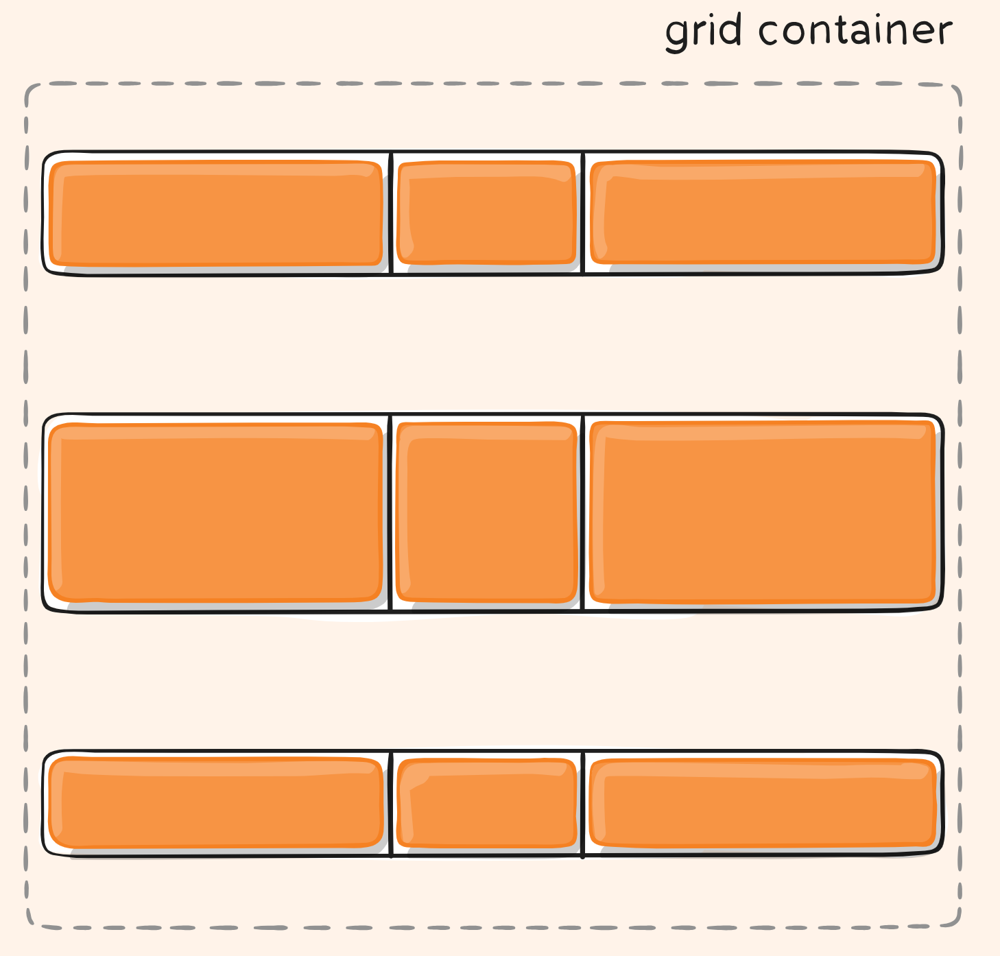

## display

Defines the element as a grid container and establishes a new grid formatting context for its contents.  
将元素定义为网格容器并为其内容建立新的网格格式化上下文。

Values: 

- **`grid`** – 生成块级网格 
- **`inline-grid`** – 生成内联网格 

```css
.container {
  display: grid | inline-grid;
}
```

## grid-template-columns  grid-template-rows

使用空格分隔的值列表，定义网格的列和行。这些值代表轨道大小，它们之间的空格代表网格线。

Values: 

- **`<track-size>`** – 长度、百分比或分数， [fr](https://css-tricks.com/introduction-fr-css-unit/) 单位
- **`<line-name>`** – 您选择的任意名称

```css
.container {
  grid-template-columns: ...  ...;
  /* e.g. 
      1fr 1fr
      minmax(10px, 1fr) 3fr
      repeat(5, 1fr)
      50px auto 100px 1fr
  */
  grid-template-rows: ... ...;
  /* e.g. 
      min-content 1fr min-content
      100px 1fr max-content
  */
}
```

- 网格线会根据这些分配自动分配正数（-1 是最后一行的替代值）。


### 命名grid line

- 明确命名这些行。请注意名称的括号语法：

```css
.container {
  grid-template-columns: [first] 40px [line2] 50px [line3] auto [col4-start] 50px [five] 40px [end];
  grid-template-rows: [row1-start] 25% [row1-end] 100px [third-line] auto [last-line];
}
```


- 请注意，一行可以有多个名称。例如，这里第二行将有两个名称：row1-end 和 row2-start：

```css
.container {
  grid-template-rows: [row1-start] 25% [row1-end row2-start] 25% [row2-end];
}
```

### repeat()

- 如果您的定义包含重复部分，您可以使用 `repeat()` 表示法来简化内容：

```css
.container {
  grid-template-columns: repeat(3, 20px [col-start]);
}

/*这相当于：*/
.container {
  grid-template-columns: 20px [col-start] 20px [col-start] 20px [col-start];
}
```

如果多条线共享相同的名称，则可以通过其线名和计数来引用它们。

```css
.item {
  grid-column-start: col-start 2;
}
```

### `fr` 单位

- `fr` 单位允许您将轨道的大小，设置为网格容器可用空间的一部分。

例如，这会将每个项目设置为网格容器宽度的三分之一：

```css
.container {
  grid-template-columns: 1fr 1fr 1fr;
}
```

- 可用空间是在所有非灵活项目之后计算的。

在此示例中， `fr` 单位可用的可用空间总量不包括 50px：

```css
.container {
  grid-template-columns: 1fr 50px 1fr 1fr;
}
```


## grid-template-areas

使用`grid-template-areas`同样也可以显式的创建一个网格布局，并且该语法使得网格结构更加的可视化，还不需要再命名网格线。

使用这属性必须要遵循以下规则：

1. 描述完整的网格结构
2. 使用`.`来标记一个空的`grid cell`
3. 使用`none`表示没有定义`grid areas`

Values: 

- **`<grid-area-name>`** – 用 `grid-area` 指定的网格区域的名称
- **`.`** – 点表示空单元
- **`none`** – 未定义网格区域

```css
.container {
  grid-template-areas: 
    "<grid-area-name> | . | none | ..."
    "...";
}
```

Example: 

```css
.item-a {
  grid-area: header;
}
.item-b {
  grid-area: main;
}
.item-c {
  grid-area: sidebar;
}
.item-d {
  grid-area: footer;
}

.container {
  display: grid;
  grid-template-columns: 50px 50px 50px 50px;
  grid-template-rows: auto;
  grid-template-areas: 
    "header header header header"
    "main main . sidebar"
    "footer footer footer footer";
}
```

这将创建一个四列宽、三行高的网格。整个顶行将由标题区域组成。中间行将由两个主要区域、一个空单元格和一个侧边栏区域组成。最后一行全是页脚。


声明中的每一行都需要具有相同数量的单元格。您可以使用任意数量的相邻句点来声明单个空单元格。只要句点之间没有空格，它们就代表一个单元格。

请注意，您不是使用此语法命名行，而是使用区域。当您使用此语法时，区域两端的行实际上会自动命名。如果网格区域的名称为 foo，则该区域的起始行线和起始列线的名称将为 foo-start，其最后一个行线和最后一个列线的名称将为 foo-end。<u>这意味着某些行可能有多个名称，例如上例中最左边的行，它将有三个名称：header-start、main-start 和 footer-start</u>。


## grid-template

在单个声明中设置 [grid-template-rows](https://css-tricks.com/snippets/css/complete-guide-grid/#prop-grid-template-columns-rows) 、 [grid-template-columns](https://css-tricks.com/snippets/css/complete-guide-grid/#prop-grid-template-columns-rows) 和 [grid-template-areas](https://css-tricks.com/snippets/css/complete-guide-grid/#prop-grid-template-areas)的简写。

Values: 价值观：

- **`none`** – 将所有三个属性设置为其初始值
- **`<grid-template-rows>` / `<grid-template-columns`>** – `<grid-template-rows>` / `<grid-template-columns` > – 分别将 [grid-template-columns](https://css-tricks.com/snippets/css/complete-guide-grid/#prop-grid-template-columns-rows) 和 [grid-template-rows](https://css-tricks.com/snippets/css/complete-guide-grid/#prop-grid-template-columns-rows)` 设置为指定值，并将 `[grid-template-areas](https://css-tricks.com/snippets/css/complete-guide-grid/#prop-grid-template-areas) 设置为 `none`

```css
.container {
  grid-template: none | <grid-template-rows> / <grid-template-columns>;
}
```

它还接受更复杂但相当方便的语法来指定所有这三个。这是一个例子：

```css
.container {
  grid-template:
    [row1-start] "header header header" 25px [row1-end]
    [row2-start] "footer footer footer" 25px [row2-end]
    / auto 50px auto;
}
/*这相当于：*/
.container {
  grid-template-rows: [row1-start] 25px [row1-end row2-start] 25px [row2-end];
  grid-template-columns: auto 50px auto;
  grid-template-areas: 
    "header header header" 
    "footer footer footer";
}
```


由于 `grid-template` 不会重置隐式网格属性（ [grid-auto-columns](https://css-tricks.com/snippets/css/complete-guide-grid/#prop-grid-auto-columns-rows) 、 [grid-auto-rows](https://css-tricks.com/snippets/css/complete-guide-grid/#prop-grid-auto-columns-rows) 和 [grid-auto-flow](https://css-tricks.com/snippets/css/complete-guide-grid/#prop-grid-auto-flow) ），这可能就是您想要的在大多数情况下，建议使用 [grid](https://css-tricks.com/snippets/css/complete-guide-grid/#prop-grid) 属性而不是 `grid-template` 。


## column-gap、row-gap、grid-column-gap、grid-row-gap

用于定义**两个grid项目之间的间距**，可以用任意css长度单位

```css
.container {
  /* standard */
  column-gap: <line-size>;
  row-gap: <line-size>;

  /* old 已被弃用*/
  grid-column-gap: <line-size>;
  grid-row-gap: <line-size>;
}
```

Example: 

```css
.container {
  grid-template-columns: 100px 50px 100px;
  grid-template-rows: 80px auto 80px; 
  column-gap: 10px;
  row-gap: 15px;
}
```


## gap、grid-gap

row-gap 和 column-gap 的简写。如果只定义了一个value，那么`row-gap`和`column-gap`都会采用该值。

```css
.container {
  /* standard */
  gap: <grid-row-gap> <grid-column-gap>;

  /* old 已被弃用*/
  grid-gap: <grid-row-gap> <grid-column-gap>;
}
```

Example: 

```css
.container {
  grid-template-columns: 100px 50px 100px;
  grid-template-rows: 80px auto 80px; 
  gap: 15px 10px;
}
```

## justify-items

沿着水平方向的轴线对齐网格项目，这个值适用于容器内的所有网格项目。

**如果不设置该值，默认会拉伸所有的`gird项目`至`grid cell`的大小**

1. 让项目在网格的起始位置对齐

```css
.container {
  justify-items: start;
}
```


2. 让项目在网格的结束位置对齐

```css
.container {
  justify-items: end;
}
```


3. 让项目在网格的中间位置对齐

```css
.container {
  justify-items: center;
}
```


4. 拉伸项目至网格宽度

```css
.container {
  justify-items: stretch;
}
```


## align-items

这个属性沿着竖直方向的轴线对齐网格项目。

1. 沿竖直方向在网格（网格域）的开始位置对齐

```css
.container {
  align-items: start;
}
```


2. 沿竖直方向在网格的结束位置对齐

```css
.container {
  align-items: end;
}
```


3. 沿竖直方向在网格的中间位置对齐

```css
.container {
  align-items: center;
}
```


4. 沿竖直方向拉伸项目至网格的高度

```css
.container {
  align-items: stretch;
}
```


## justify-content

和flex的一样，用于设置水平方向网格的对齐方式。即当网格总尺寸小于容器尺寸时使用

1. 沿着容器的水平方向的开始位置，对齐网格

```css
.container {
  justify-content: start;
}
```


2. 沿容器的水平方向的结束位置，对齐网格

```css
.container {
  justify-content: end;
}
```


3. 沿容器的水平方向的中间位置，对齐网格

```css
.container {
  justify-content: center;
}
```


4. 沿容器的水平方向拉伸网格

比如设置`grid-template-columns: 100px auto 100px`，第二列的网格没有设置一个固定尺寸，然后再设置以下的值（该值为默认值），则会拉伸。如果设置的是固定尺寸(px)，则无法拉伸

```css
.container {
  justify-content: stretch;
}
```


5. 沿容器的水平方向均匀分配剩余空间，项目与项目间的间隔距离比项目与容器边框的距离大1倍

```css
.container {
  justify-content: space-around;
}
```


6. 沿容器水平方向两边排列项目

```css
.container {
  justify-content: space-between;
}
```


7. 和space-around类似，不过该值无论是项目与项目间的间隔距离还是项目与容器边框的距离都会均匀分配

```css
.container {
  justify-content: space-evenly;
}
```


## align-content

与justify-content相反，用于设置竖直方向grid cell的对齐方式。即当grid cell总尺寸小于grid container时使用

1. 沿着容器的竖直方向，对齐网格

```css
.container {
  align-content: start;    
}
```


```css
.container {
  align-content: end;    
}
```


```css
.container {
  align-content: center;    
}
```


```css
.container {
  align-content: stretch;    
}
```


```css
.container {
  align-content: space-around;    
}
```




```css
.container {
  align-content: space-between;    
}
```


```css
.container {
  align-content: space-evenly;    
}
```


