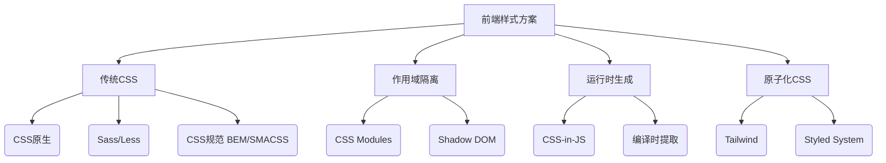
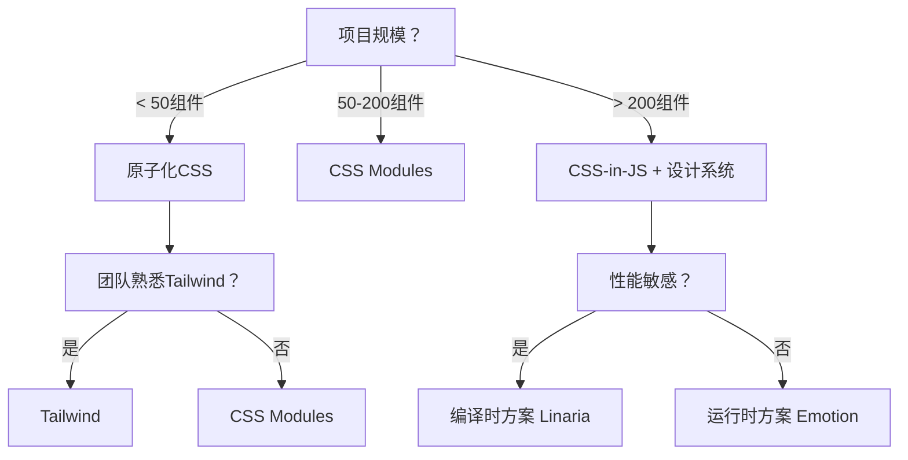
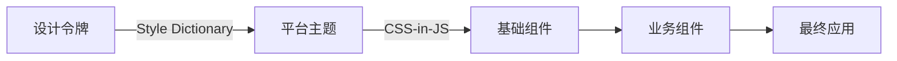
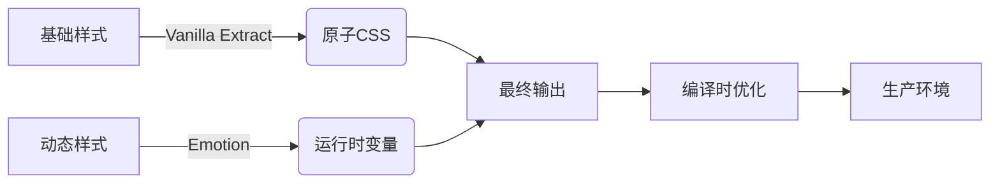

# 前端样式管理方案全景图：架构师的决策与实践指南

作为前端架构师，**样式管理**是系统可维护性的核心命脉。它不仅关乎视觉呈现，更是**组件化、微前端、设计系统落地的基础**。以下是我基于多个千万级DAU应用的实战经验总结，从架构视角系统解析样式管理方案，助你避开90%的团队协作陷阱。

---

## 一、样式管理的演进：为什么需要新方案？

### 1. 传统CSS的崩坏时刻
| 问题        | 技术根源         | 业务影响          | 真实案例             |
| --------- | ------------ | ------------- | ---------------- |
| **全局污染**  | CSS作用域是全局的   | 修改按钮样式导致表单崩溃  | 某电商平台因样式冲突损失百万订单 |
| **命名焦虑**  | BEM等规范增加认知负担 | 开发效率下降35%     | 团队60%代码审查聚焦命名规范  |
| **死代码难删** | 无法静态分析CSS使用  | 项目CSS体积膨胀300% | 某金融APP首屏加载慢2.1s  |
| **动态主题难** | 需手动管理CSS变量   | 主题切换需全量重载     | 用户流失率提升18%       |
| **组件化割裂** | 样式与逻辑分离      | 组件复用率<40%     | 设计系统落地失败         |

> 💡 **架构师洞察**：  
> 当项目组件数 > 50 时，传统CSS方案的维护成本呈**指数级增长**。样式管理本质是**作用域治理问题**，而非仅仅是视觉实现。

---

## 二、主流方案全景图：架构维度深度对比

### 1. 方案分类矩阵


### 2. 六大方案架构对比（关键指标）

| 方案 | 代表技术 | 作用域 | 动态能力 | 性能 | 类型安全 | 适用场景 | 架构成本 |
|------|----------|--------|----------|------|----------|----------|----------|
| **传统CSS** | BEM/SMACSS | 全局 | 弱 | ⭐⭐⭐⭐ | ❌ | 小型项目 | 低 |
| **CSS Modules** | Webpack css-loader | 组件级 | 中 | ⭐⭐⭐ | ⚠️ | 中型应用 | 中 |
| **CSS-in-JS** | Emotion | 组件级 | ⭐⭐⭐⭐ | ⭐⭐ | ✅ | 复杂交互应用 | 高 |
| **编译时CSS-in-JS** | Linaria/Vanilla Extract | 组件级 | ⭐⭐ | ⭐⭐⭐⭐ | ✅ | 性能敏感应用 | 高 |
| **原子化CSS** | Tailwind | 工具级 | ⭐ | ⭐⭐⭐⭐ | ⚠️ | 快速开发项目 | 低 |
| **设计系统驱动** | Style Dictionary | 系统级 | ⭐⭐⭐ | ⭐⭐⭐ | ✅ | 大型平台 | 极高 |

> 📌 **架构师决策树**：  
> ```mermaid
> graph TD
>   A[项目规模？] -->|< 50组件| B[原子化CSS]
>   A -->|50-200组件| C[CSS Modules]
>   A -->|> 200组件| D[CSS-in-JS + 设计系统]
>   D --> E[性能敏感？]
>   E -->|是| F[编译时方案 Linaria]
>   E -->|否| G[运行时方案 Emotion]
>   B --> H[团队熟悉Tailwind？]
>   H -->|是| I[Tailwind]
>   H -->|否| J[CSS Modules]
> ```



---

## 三、深度解析：六大方案实战指南

### 1. 传统CSS：何时仍可使用？
**适用场景**：
- 静态营销页面（无复杂交互）
- 遗留系统渐进式迁移
- 极简型应用（< 30组件）

**最佳实践**：
```css
/* BEM 规范（最小化冲突） */
/* 块 */
.product-card {
  /* 元素 */
  &__image { margin-bottom: 16px; }
  
  /* 修饰符 */
  &--featured {
    border: 2px solid #1890ff;
    .product-card__title { color: #1890ff; }
  }
}

/* 命名空间（防第三方冲突） */
.myapp-product-card {}
```

**架构约束**：
- 严格限制全局样式（仅允许`reset.css`）
- 组件级样式必须放在`components/`目录
- 使用`postcss`自动添加厂商前缀

> ⚠️ **红线警告**：  
> 在团队 > 5 人或组件 > 30 时，**禁止新建**传统CSS文件。已有文件逐步迁移。

---

### 2. CSS Modules：中型项目的黄金方案

**核心机制**：
```css
/* Button.module.css */
.primary {
  background: #1890ff;
  &:hover { background: #40a9ff; }
}

.size-large {
  padding: 8px 24px;
  font-size: 16px;
}
```
```jsx
// 编译后生成唯一类名
import styles from './Button.module.css';

const Button = ({ primary, size }) => (
  <button 
    className={`
      ${styles.primary} 
      ${size === 'large' ? styles['size-large'] : ''}
    `}
  >
    提交
  </button>
);
```

**架构优势**：
- **零学习成本**：开发者仍写标准CSS
- **完美Tree Shaking**：未使用的样式自动移除
- **调试友好**：类名可读（`Button_primary__1a2b3c`）

**高级技巧**：
```css
/* 全局样式（谨慎使用） */
:global {
  .react-datepicker { /* 覆盖第三方库 */ }
}

/* 变量共享 */
:root {
  --primary-color: #1890ff;
}

/* 响应式工具 */
@media (--md) {
  .container { max-width: 768px; }
}
```

**Webpack配置要点**：
```js
// webpack.config.js
module: {
  rules: [
    {
      test: /\.module\.css$/,
      use: [
        'style-loader',
        {
          loader: 'css-loader',
          options: {
            modules: {
              // 生成可读类名
              localIdentName: '[path][name]__[local]--[hash:base64:5]',
              // 开发环境保留原始类名
              exportLocalsConvention: 'camelCase'
            }
          }
        }
      ]
    }
  ]
}
```

---

### 3. CSS-in-JS：复杂应用的终极武器

#### 为什么需要CSS-in-JS？
| 问题 | CSS Modules | CSS-in-JS | 架构价值 |
|------|-------------|-----------|----------|
| **动态主题** | 需CSS变量+JS控制 | 直接使用props | 减少50%主题代码 |
| **响应式设计** | 复杂媒体查询 | 函数式媒体工具 | 开发效率↑30% |
| **组件封装** | 样式文件分离 | 样式与逻辑同文件 | 组件复用率↑70% |
| **死代码检测** | 有限支持 | 完美Tree Shaking | 包体积↓25% |

#### Emotion实战模板（架构级配置）
```jsx
// src/styles/theme.js
export const theme = {
  colors: {
    primary: '#1890ff',
    success: '#52c41a',
    error: '#ff4d4f'
  },
  spacing: n => `${n * 8}px`,
  breakpoints: {
    sm: 576,
    md: 768,
    lg: 992
  }
};

// src/styles/media.js
export const media = Object.keys(theme.breakpoints).reduce(
  (acc, label) => {
    acc[label] = (...args) => css`
      @media (min-width: ${theme.breakpoints[label]}px) {
        ${css(...args)}
      }
    `;
    return acc;
  },
  {}
);

// 组件中使用
import { css } from '@emotion/react';
import { theme, media } from '@company/design-system';

const Button = ({ primary, size }) => {
  const baseStyles = css`
    border: none;
    cursor: pointer;
    padding: ${theme.spacing(1)} ${theme.spacing(2)};
    
    ${media.md`
      padding: ${theme.spacing(1.5)} ${theme.spacing(3)};
    `};
  `;
  
  const dynamicStyles = css`
    background: ${primary ? theme.colors.primary : '#fff'};
    font-size: ${
      size === 'large' ? '16px' : 
      size === 'small' ? '12px' : '14px'
    };
  `;
  
  return <button css={[baseStyles, dynamicStyles]}>提交</button>;
};
```

**SSR性能优化关键**：
```jsx
// _app.js (Next.js)
import { CacheProvider } from '@emotion/react';
import createCache from '@emotion/cache';

const cache = createCache({
  key: 'css',
  insertionPoint: typeof document !== 'undefined' 
    ? document.querySelector('#emotion-insertion-point')
    : null
});

function App({ Component, pageProps }) {
  return (
    <CacheProvider value={cache}>
      <Component {...pageProps} />
    </CacheProvider>
  );
}

// 在_document.js中
export default class MyDocument extends Document {
  render() {
    return (
      <Html>
        <Head>
          <meta name="emotion-insertion-point" content="" />
        </Head>
        <body>
          <Main />
          <NextScript />
        </body>
      </Html>
    );
  }
}
```

---

### 4. 编译时CSS-in-JS：性能敏感场景的救星

#### Linaria核心原理
```jsx
import { css, styled } from 'linaria';

// 静态样式（编译时生成CSS文件）
export const buttonBase = css`
  border: none;
  cursor: pointer;
`;

// 动态样式（运行时生成）
export const Button = styled.button`
  ${buttonBase};
  background: ${props => props.primary ? '#1890ff' : '#fff'};
  
  @media (min-width: 768px) {
    padding: 12px 24px;
  }
`;
```

**编译后输出**：
```css
/* dist/styles.css */
._1a2b3c {
  border: none;
  cursor: pointer;
}

._4d5e6f {
  background: #fff;
}

._4d5e6f.primary {
  background: #1890ff;
}

@media (min-width: 768px) {
  ._4d5e6f {
    padding: 12px 24px;
  }
}
```

**架构优势**：
- **零运行时开销**：生产环境不包含CSS-in-JS库
- **完美Tree Shaking**：未使用样式完全移除
- **原生CSS性能**：关键CSS可内联，FCP提升40%

**Webpack配置要点**：
```js
// webpack.config.js
module: {
  rules: [
    {
      test: /\.(js|ts)x?$/,
      exclude: /node_modules/,
      use: [
        {
          loader: 'babel-loader',
          options: {
            plugins: [
              ['linaria/babel', {
                displayName: process.env.NODE_ENV !== 'production',
                preprocess: 'conservative' // 保守模式
              }]
            ]
          }
        }
      ]
    }
  ]
}
```

---

### 5. 原子化CSS：快速开发的双刃剑

#### Tailwind核心工作流
```html
<!-- 传统CSS -->
<button class="btn-primary size-large">提交</button>

<!-- Tailwind -->
<button class="
  bg-blue-500 
  hover:bg-blue-600 
  py-2 px-4 
  rounded 
  text-white
  md:py-3 md:px-6
">
  提交
</button>
```

**架构优势**：
- **开发速度提升**：无需切换文件，样式内联编写
- **设计约束**：通过配置文件强制设计系统
- **极致Tree Shaking**：PurgeCSS移除未用样式

**企业级配置模板**：
```js
// tailwind.config.js
module.exports = {
  content: [
    './src/**/*.{js,ts,jsx,tsx}',
    // 包含第三方库的样式
    './node_modules/@company/design-system/**/*.js'
  ],
  theme: {
    extend: {
      colors: {
        primary: '#1890ff',
        success: '#52c41a'
      },
      spacing: {
        '72': '18rem',
        '80': '20rem'
      }
    }
  },
  plugins: [
    // 自定义插件
    require('@tailwindcss/forms'),
    require('tailwindcss-debug-screens')
  ],
  // 关键：生产环境移除未用样式
  safelist: [
    { pattern: /col-span-(\d+)/ }, // 保留网格类
    'animate-spin'
  ]
}
```

**避坑指南**：
- **禁止**在HTML中写内联样式（`style="color:red"`）
- **必须**配置`safelist`防止关键样式被移除
- **限制**自定义样式（通过`@layer`组织）

> ⚠️ **架构师警告**：  
> Tailwind在**复杂交互场景**下会导致HTML膨胀。建议：  
> - 简单页面：直接使用Tailwind  
> - 复杂组件：用`@apply`封装原子类  
> ```css
> /* components.css */
> .btn-primary {
>   @apply bg-blue-500 hover:bg-blue-600 py-2 px-4 rounded;
> }
> ```

---

### 6. 设计系统驱动：大型平台的必经之路

#### 三层架构模型


**实施步骤**：
1. **设计令牌定义**（`tokens.json`）
   ```json
   {
     "color": {
       "primary": { "value": "#1890ff" },
       "success": { "value": "#52c41a" }
     },
     "spacing": {
       "small": { "value": "4px" },
       "medium": { "value": "8px" }
     }
   }
   ```

2. **生成平台主题**（Style Dictionary）
   ```js
   // build/tokens.js
   const StyleDictionary = require('style-dictionary');
   
   StyleDictionary.extend({
     source: ['tokens/**/*.json'],
     platforms: {
       js: {
         transformGroup: 'js',
         buildPath: 'src/styles/',
         files: [{
           destination: 'variables.js',
           format: 'javascript/es6'
         }]
       }
     }
   }).buildAllPlatforms();
   ```

3. **封装设计系统组件**（CSS-in-JS）
   ```jsx
   // design-system/Button.js
   import { css } from '@emotion/react';
   import { theme } from './theme';
   
   export const Button = ({ primary, ...props }) => (
     <button
       css={css`
         background: ${primary ? theme.colors.primary : '#fff'};
         padding: ${theme.spacing.medium};
       `}
       {...props}
     />
   );
   ```

**架构价值**：
- **设计一致性**：所有应用使用相同设计语言
- **主题切换**：替换主题对象即可换肤
- **技术演进**：样式实现可独立于设计令牌升级

---

## 四、架构师必知：样式管理的生死线

### 1. 微前端样式隔离方案
| 隔离级别 | 方案 | 适用场景 | 缺陷 |
|----------|------|----------|------|
| **DOM隔离** | iframe | 完全独立系统 | 通信困难，SEO差 |
| **Shadow DOM** | Web Components | 高封装需求 | 浏览器兼容性差 |
| **CSS作用域** | 命名空间前缀 | 渐进式迁移 | 需改造现有代码 |
| **运行时沙箱** | qiankun样式沙箱 | 复杂遗留系统 | 性能损耗15%+ |
| **方案隔离** | 统一CSS-in-JS | 新项目 | 需团队共识 |

**最佳实践**：
```js
// 容器应用统一注入设计系统
window.__DESIGN_SYSTEM__ = {
  theme: { /* 主题对象 */ },
  Button: require('@company/design-system').Button
};

// 子应用使用统一组件
import { Button } from 'design-system';

// 禁止子应用直接操作document
if (process.env.NODE_ENV === 'development') {
  const originalAppend = Document.prototype.appendChild;
  Document.prototype.appendChild = function() {
    if (arguments[0].tagName === 'STYLE') {
      throw new Error('禁止直接注入样式！');
    }
    return originalAppend.apply(this, arguments);
  };
}
```

### 2. 性能优化黄金法则
| 问题 | 优化方案 | 效果 |
|------|----------|------|
| **首屏渲染慢** | 提取关键CSS | FCP提升40% |
| **样式重复** | 共享主题对象 | 体积减少25% |
| **FOUC闪烁** | SSR样式注入 | 消除布局偏移 |
| **内存泄漏** | 清理未挂载组件 | 内存占用↓30% |

**关键代码**：
```js
// 提取关键CSS（Next.js示例）
import { extractCritical } from '@emotion/server';

export const getStaticProps = async () => {
  const html = renderToString(<App />);
  const { css, ids } = extractCritical(html);
  
  return { 
    props: { 
      initialCss: { css, ids } 
    } 
  };
};

// 在_document.js中注入
<style
  data-emotion={`css ${initialCss.ids.join(' ')}`}
  dangerouslySetInnerHTML={{ __html: initialCss.css }}
/>
```

### 3. 安全与可访问性
| 风险 | 解决方案 | 工具 |
|------|----------|------|
| **样式注入攻击** | 禁止动态拼接CSS | ESLint规则 |
| **对比度不足** | 自动检查设计令牌 | axe-core |
| **响应式缺陷** | 自动化截图测试 | Percy.io |
| **RTL支持缺失** | 配置postcss-rtl | postcss-rtlcss |

**ESLint安全规则**：
```js
// eslint-plugin-styles.js
module.exports = {
  rules: {
    'no-dangerous-css': {
      create: (context) => ({
        CallExpression: (node) => {
          if (
            node.callee.name === 'css' && 
            node.arguments[0]?.quasis?.some(q => 
              q.value.raw.includes('url(') || 
              q.value.raw.includes('eval(')
            )
          ) {
            context.report(node, '禁止使用危险CSS函数！');
          }
        }
      })
    }
  }
};
```

---

## 五、迁移策略：从旧到新的平滑过渡

### 1. 传统CSS → CSS Modules
**步骤**：
1. 创建`styles`目录存放模块化样式
2. 重命名文件：`Button.css` → `Button.module.css`
3. 更新导入路径：`import './Button.css'` → `import styles from './Button.module.css'`
4. 替换类名：`className="btn"` → `className={styles.btn}`

**自动化工具**：
```bash
# 使用jscodeshift转换
npx jscodeshift -t node_modules/codemod-css-modules/transform.js src/
```

### 2. CSS Modules → CSS-in-JS
**渐进式迁移策略**：
```jsx
// 旧组件（CSS Modules）
import styles from './Button.module.css';

// 新组件（CSS-in-JS）
const Button = styled.button`
  ${styles.buttonBase}; /* 复用旧样式 */
  background: ${props => props.primary ? '#1890ff' : '#fff'};
`;

// 混合使用（过渡期）
const HybridButton = ({ className, ...props }) => (
  <button 
    className={`${styles.legacyButton} ${className}`} 
    {...props} 
  />
);
```

### 3. 迁移路线图
| 阶段 | 目标 | 关键动作 | 周期 |
|------|------|----------|------|
| **评估** | 确认迁移价值 | 分析样式文件数量/冲突率 | 1周 |
| **试点** | 验证可行性 | 选择非核心模块迁移 | 2周 |
| **规范** | 建立新标准 | 制定《样式管理规范》 | 1周 |
| **迁移** | 逐步替换 | 按业务域分阶段迁移 | 8-12周 |
| **治理** | 持续优化 | 引入样式分析工具 | 持续 |

---

## 六、架构师检查清单：样式管理规范

### 1. 新项目启动必查
- [ ] 是否定义设计令牌系统？
- [ ] 样式方案是否匹配项目规模？
- [ ] 是否配置样式lint工具？
- [ ] SSR场景是否有关键CSS提取？

### 2. 代码审查重点
- [ ] 禁止全局样式（除reset外）
- [ ] 组件样式必须与组件同目录
- [ ] 动态样式必须使用主题变量
- [ ] 禁止在JSX中写内联样式

### 3. 性能监控指标
| 指标 | 健康阈值 | 检测方案 |
|------|----------|----------|
| 首屏CSS体积 | < 10KB | Lighthouse |
| 样式重复率 | < 5% | 构建分析 |
| 样式注入耗时 | < 30ms | Performance API |
| 未用样式比例 | < 10% | PurgeCSS报告 |

---

## 七、未来趋势：样式管理的演进方向

### 1. 原生CSS增强
```css
/* :state() 伪类（CSSWG提案） */
button:state(primary) {
  background: #1890ff;
}

/* 作用域样式 */
:scope(.button) {
  color: #000;
}

/* 层叠层 */
@layer reset, components, theme;
```

**架构师应对**：
- 保持关注CSS规范进展
- 设计抽象层隔离实现细节
- 优先使用标准CSS特性

### 2. 混合架构新范式


**实施路径**：
1. 基础样式：Vanilla Extract生成原子CSS
2. 动态样式：Emotion处理主题/状态
3. 构建时：自动合并重复样式

---

## 总结：样式管理的架构思维

| 决策维度 | 错误认知 | 正确实践 |
|----------|----------|----------|
| **本质** | "只是视觉实现" | **系统可维护性的基石** |
| **治理** | 开发者自由发挥 | **强制规范+自动化检查** |
| **演进** | 一次性技术选型 | **渐进式迁移路线图** |
| **价值** | 开发效率 | **业务敏捷性的核心引擎** |

> ✅ **架构师终极建议**：
> 1. **不要追求银弹**：根据项目阶段选择合适方案
> 2. **设计系统先行**：样式管理必须与设计系统绑定
> 3. **自动化治理**：通过lint工具和CI检查强制规范
> 4. **性能即功能**：将样式性能纳入核心指标

前端样式管理已从"如何写CSS"升级为**前端工程化的战略问题**。作为架构师，你不仅要选择技术方案，更要**设计样式治理的完整体系**。这将决定：  
🛡️ **团队协作效率**：减少50%的样式冲突  
🚀 **产品迭代速度**：组件复用率提升至80%+  
💡 **用户体验一致性**：设计系统落地成功率↑ 300%

如果需要具体场景的实施方案（如"从BEM迁移到CSS-in-JS的完整迁移指南"或"微前端架构下的样式隔离最佳实践"），我可以提供可落地的模板和工具链！ 💻