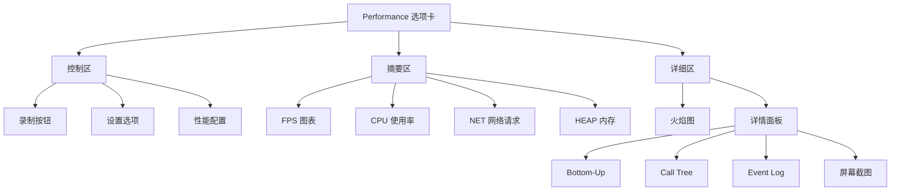
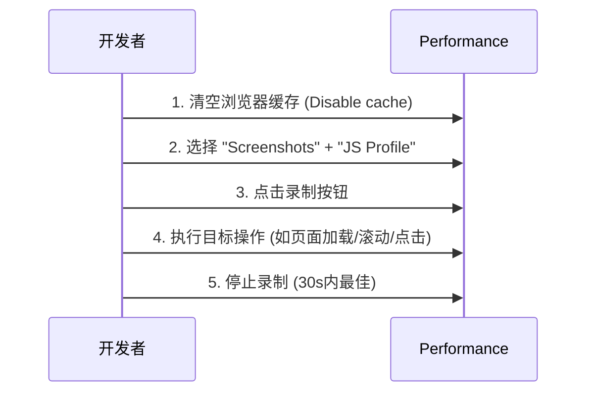
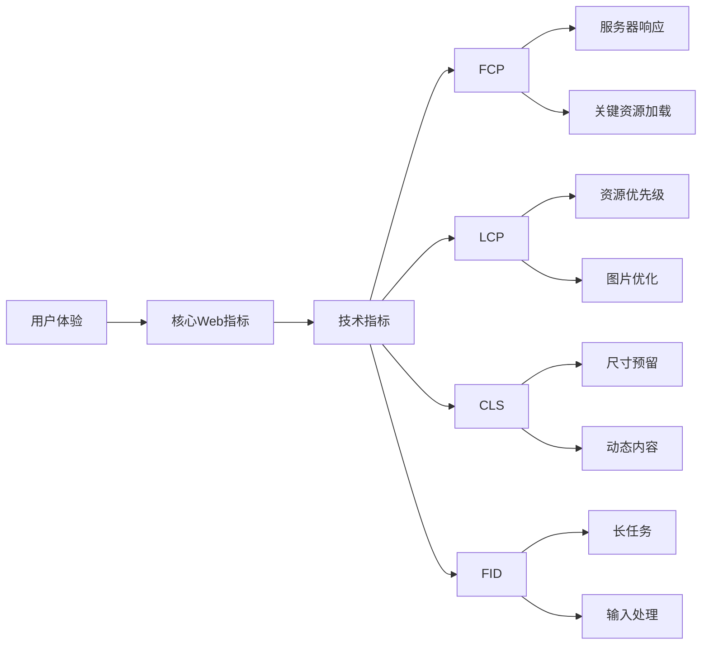

# Chrome DevTools Performance 选项卡：前端性能分析终极指南
参考：[[25 会用 Performance 工具，就能深入理解 Event Loop]]、[Performance选项卡](https://www.bilibili.com/video/BV1cFKZzcEXh/?share_source=copy_web&vd_source=9c1e19a73fa7bd23bb37aa8d7467d862)、


Chrome DevTools 的 **Performance 选项卡** 是前端开发者进行**性能分析、瓶颈定位和优化验证**的核心工具。它提供了从**页面加载**到**交互运行时**的全方位性能数据，是打造高性能 Web 应用不可或缺的"显微镜"。

---

## 🔍 一、为什么需要 Performance 选项卡？

### 📉 前端性能的残酷现实
| 指标 | 可接受阈值 | 用户流失率 |
|------|------------|------------|
| **首次内容绘制 (FCP)** | < 1.8s | > 3s → 32% 流失 |
| **最大内容绘制 (LCP)** | < 2.5s | > 4s → 50% 流失 |
| **累计位移偏移 (CLS)** | < 0.1 | > 0.25 → 22% 流失 |
| **首次输入延迟 (FID)** | < 100ms | > 300ms → 90% 不满意 |

> 💡 **关键认知**：Performance 选项卡是**唯一能精确测量**这些核心 Web 指标并**定位具体代码瓶颈**的工具。

---

## 🖥 二、界面全景解析（Chrome 116+）



### 1. 控制区（顶部工具栏）
| 元素 | 作用 | 快捷键 | 专业技巧 |
|------|------|--------|----------|
| **录制按钮** | 开始/停止性能记录 | Ctrl+E / Cmd+E | 按住 Shift 可持续录制 |
| **设置选项** | 配置记录参数 | ⚙️ 图标 | 勾选 **Screenshots** 捕获帧序列 |
| **性能配置** | 选择分析场景 | | **Applies to** 选 **Desktop**（避免移动设备模拟干扰） |
| **Load preset** | 预设分析配置 | | 选择 **"Applied Filters"** 聚焦关键数据 |

### 2. 摘要区（中部概览）
#### 📈 FPS 图表
- **绿色**：60fps（理想）
- **黄色**：30-60fps（可接受）
- **红色**：<30fps（卡顿）
- **专业解读**：连续红色区域表示**长任务阻塞主线程**

#### 💻 CPU 使用率
- **紫色**：脚本执行
- **黄色**：样式计算
- **深蓝**：布局（重排）
- **浅蓝**：绘制（重绘）
- **绿色**：合成
- **关键指标**：单个任务 > 50ms = **长任务**（需优化）

#### 🌐 NET 网络请求
- **蓝色**：HTML 文档
- **紫色**：脚本
- **红色**：样式表
- **绿色**：图片
- **专业技巧**：点击请求可查看**详细时间线**（Queuing, Stalled, DNS, SSL 等）

#### 📦 HEAP 内存
- **实线**：JS 堆内存使用
- **虚线**：内存分配速率
- **关键信号**：锯齿状上升 → **内存泄漏**

### 3. 详细区（底部分析）
#### 🔥 火焰图（Flame Chart）
- **X轴**：时间线（从左到右）
- **Y轴**：调用栈深度（从下到上）
- **区块高度**：任务执行时间
- **颜色编码**：
  - **紫色**：JavaScript 执行
  - **黄色**：样式计算
  - **深蓝**：布局（Layout）
  - **浅蓝**：绘制（Paint）
  - **绿色**：合成（Composite）

> 💡 **火焰图读法**：底部任务先执行，顶部任务后执行；宽条表示耗时长的任务

#### 📋 详情面板（右侧）
| 标签 | 用途 | 适用场景 |
|------|------|----------|
| **Bottom-Up** | 从耗时最长的函数向上追溯 | 定位性能瓶颈函数 |
| **Call Tree** | 完整调用栈分析 | 理解函数调用关系 |
| **Event Log** | 按时间顺序排列事件 | 分析特定交互过程 |
| **Screenshots** | 页面帧序列截图 | 诊断视觉卡顿 |

---

## 🎯 三、专业级性能分析流程

### 步骤 1：精准录制性能数据


**专业配置建议**：
- ✅ 勾选 **Screenshots**（诊断视觉卡顿）
- ✅ 勾选 **JS Profile**（详细JS执行分析）
- ✅ 勾选 **Network**（分析请求依赖）
- ❌ 取消 **Memory**（除非专门分析内存）
- ⚠️ 使用 **隐身模式** 避免扩展干扰

### 步骤 2：识别关键性能指标
在摘要区直接查看核心 Web 指标：
1. **FCP (First Contentful Paint)**：首次内容绘制时间
2. **LCP (Largest Contentful Paint)**：最大内容绘制时间
3. **CLS (Cumulative Layout Shift)**：累计布局偏移
4. **FID (First Input Delay)**：首次输入延迟

> 💡 **定位技巧**：点击摘要区的 **"Timings"** 标签，直接跳转到关键事件在时间线中的位置

### 步骤 3：分析火焰图定位瓶颈
#### 场景：诊断页面加载缓慢
1. **定位主线程活动**：在火焰图中找到密集的紫色/黄色区块
2. **识别长任务**：筛选 > 50ms 的任务（右键 → **Filter > 50ms**）
3. **下钻分析**：
   ```mermaid
   graph TD
       A[长任务] --> B{类型判断}
       B -->|紫色| C[JavaScript 执行]
       B -->|黄色| D[样式计算]
       B -->|深蓝| E[布局重排]
       B -->|浅蓝| F[绘制重绘]
       
       C --> C1[函数分析]
       D --> D1[选择器优化]
       E --> E1[避免强制同步布局]
       F --> F1[减少重绘范围]
   ```

#### 案例：布局抖动（Forced Synchronous Layouts）
```javascript
// 问题代码
function resizeElement() {
  const width = element.offsetWidth; // 强制布局计算
  element.style.height = width * 0.5 + 'px'; // 触发重排
}
```
**Performance 诊断**：
1. 火焰图中看到**交替的深蓝（Layout）和紫色（Script）** 区块
2. 在 **Bottom-Up** 标签中搜索 "Layout"
3. 发现 `resizeElement` 函数频繁触发重排

**解决方案**：
```javascript
// 优化后代码
function resizeElement() {
  // 使用 transform 避免重排
  const width = element.offsetWidth;
  element.style.transform = `scaleY(${width * 0.5})`;
}
```

### 步骤 4：使用详情面板深入分析
#### Bottom-Up 标签页（效率最高）
- **Self Time**：函数自身执行时间（不包括子调用）
- **Total Time**：函数总耗时（包括子调用）
- **专业技巧**：
  - 按 **Self Time** 降序排列 → 找出最耗时函数
  - 右键函数 → **Focus** → 隔离分析该函数调用链

#### Call Tree 标签页
- **展开调用栈**：查看完整的函数调用路径
- **关键指标**：**Heavy (Bottom Up)** 视图更实用

#### Event Log 标签页
- **按时间排序**：查看精确的事件执行顺序
- **过滤技巧**：输入 "Layout" 或 "Paint" 快速定位渲染事件

---

## 🔧 四、高频性能问题诊断指南

### 1. 长任务（Long Tasks）
- **现象**：主线程连续 > 50ms 无响应
- **诊断**：
  - 摘要区 CPU 图表出现**高耸紫色柱**
  - 火焰图中出现**宽幅紫色区块**
- **解决方案**：
  ```javascript
  // 1. 拆分长任务
  function processChunk(chunk) { /* ... */ }
  
  function processAll(data) {
    requestIdleCallback(() => {
      processChunk(data.slice(0, 100));
      if (data.length > 100) {
        processAll(data.slice(100));
      }
    });
  }
  
  // 2. 使用 Web Worker
  const worker = new Worker('processor.js');
  worker.postMessage(data);
  ```

### 2. 布局抖动（Layout Thrashing）
- **现象**：交替出现 **Layout → Script → Layout**
- **诊断**：
  - 火焰图中**深蓝和紫色区块交替密集出现**
  - Event Log 中频繁出现 "Recalculate Style" 和 "Layout"
- **解决方案**：
  ```javascript
  // 避免读写交替
  function updateElements() {
    // 1. 所有读操作集中
    const widths = elements.map(el => el.offsetWidth);
    
    // 2. 所有写操作集中
    elements.forEach((el, i) => {
      el.style.width = widths[i] + 'px';
    });
  }
  ```

### 3. 过度重排重绘
- **现象**：大量浅蓝（Paint）和深蓝（Layout）区块
- **诊断**：
  - 火焰图中**密集的蓝色区块**
  - Screenshots 显示**频繁局部刷新**
- **优化策略**：
  ```css
  /* 1. 使用 transform/opacity 替代 top/left */
  .animate {
    /* 避免 */
    /* top: 10px; */
    
    /* 推荐 */
    transform: translateY(10px);
  }
  
  /* 2. 创建合成层 */
  .layer {
    will-change: transform;
    /* 或 */
    transform: translateZ(0);
  }
  ```

### 4. JavaScript 执行瓶颈
- **现象**：密集紫色区块，CPU 图表峰值高
- **诊断**：
  - Bottom-Up 标签中 **Self Time 高**的函数
  - 查看具体函数的调用栈
- **优化方法**：
  ```javascript
  // 1. 算法优化
  // 避免 O(n²) 操作
  const uniqueItems = [...new Set(items)]; // O(n)
  
  // 2. 缓存计算结果
  const expensiveCalc = memoize(() => { /* ... */ });
  
  // 3. 使用 requestIdleCallback
  requestIdleCallback(processLowPriorityTask);
  ```

### 5. 资源加载问题
- **现象**：关键资源加载延迟，瀑布图出现长等待
- **诊断**：
  - NET 图表中 **Stalled/Queuing 时间过长**
  - 关键资源（LCP元素）加载晚
- **解决方案**：
  ```html
  <!-- 1. 关键CSS内联 -->
  <style>/* above-the-fold CSS */</style>
  
  <!-- 2. 预加载关键资源 -->
  <link rel="preload" href="critical.js" as="script">
  
  <!-- 3. 资源提示 -->
  <link rel="preconnect" href="https://api.example.com">
  ```

---

## 🛠 五、高级分析技巧

### 1. 屏幕截图分析（Screenshots）
- **启用**：录制前勾选 **Screenshots**
- **使用场景**：
  - 诊断视觉卡顿（FPS下降处截图变化）
  - 分析首次内容绘制（FCP）时机
  - 验证布局偏移（CLS）问题
- **专业技巧**：按住 **W/S** 键逐帧查看，**A/D** 调整播放速度

### 2. 内存泄漏检测
- **步骤**：
  1. 勾选 **Memory** 选项录制
  2. 执行操作后强制垃圾回收（垃圾桶图标）
  3. 重复操作多次，观察内存趋势
- **泄漏信号**：内存使用呈**锯齿状上升**，每次操作后不回落
- **定位方法**：
  - 在 **Summary** 视图中按 **Constructor** 排序
  - 查找异常增长的对象类型
  - 右键 → **Retaining Tree** 查看引用链

### 3. 自定义标记（User Timing API）
```javascript
// 在代码中插入性能标记
performance.mark('start-data-fetch');
fetch('/api/data')
  .then(() => {
    performance.mark('end-data-fetch');
    performance.measure('Data Fetch', 'start-data-fetch', 'end-data-fetch');
  });
```
- **效果**：在 Performance 时间线中显示**自定义测量区间**
- **优势**：精准测量**业务逻辑**性能，而非仅框架性能

### 4. 多帧分析（Frame-by-Frame）
- **操作**：在火焰图中**拖动选择**特定时间段
- **用途**：
  - 分析单次交互（如按钮点击）
  - 对比优化前后性能
  - 诊断特定动画性能
- **技巧**：按住 **Shift** 拖动可**水平缩放**时间线

### 5. 性能对比（Compare Runs）
- **操作**：
  1. 保存优化前的性能记录
  2. 实施优化后录制新记录
  3. 在 **Compare** 标签页对比两次记录
- **关键指标**：
  - **Total Blocking Time (TBT)** 变化
  - **LCP** 改善百分比
  - **长任务数量**减少

---

## 📊 六、核心性能指标深度解读

### 1. 首次内容绘制（FCP）
- **定义**：浏览器渲染出**第一个文本/图片/非空白canvas/svg**的时间
- **Performance 定位**：
  - 在 **Timings** 标签下找到 **"First Contentful Paint"**
  - 点击跳转到对应时间点
  - 查看此时**已加载的关键资源**
- **优化方向**：
  - 减少关键CSS/JS阻塞
  - 优化服务器响应时间（TTFB < 600ms）
  - 使用服务端渲染（SSR）

### 2. 最大内容绘制（LCP）
- **定义**：**最大文本块或图片**渲染完成的时间（通常是最关键内容）
- **Performance 定位**：
  - 在 **Timings** 标签下找到 **"Largest Contentful Paint"**
  - 点击跳转后，在 **Screenshots** 查看具体元素
  - 在 **Event Log** 中搜索 "LCP" 查看候选元素
- **优化策略**：
  ```html
  <!-- 1. 预加载LCP元素 -->
  <link rel="preload" href="hero-image.jpg" as="image">
  
  <!-- 2. 使用正确的图片格式 -->
  <picture>
    <source srcset="hero.avif" type="image/avif">
    
  </picture>
  
  <!-- 3. 优先加载LCP资源 -->
  <script>
  document.addEventListener('DOMContentLoaded', () => {
    const lcpElement = document.querySelector('.hero-image');
    if (lcpElement) {
      lcpElement.loading = 'eager';
    }
  });
  </script>
  ```

### 3. 累计布局偏移（CLS）
- **定义**：页面生命周期内**所有意外布局偏移的总和**
- **Performance 定位**：
  - 在 **Experience** 标签下查看 **"Layout Shift"** 事件
  - 点击事件查看**具体偏移元素**
  - 在 **Screenshots** 中观察偏移过程
- **常见原因**：
  - 图片/视频无尺寸声明
  - 动态插入内容无预留空间
  - Web字体FOIT/FOUT
- **解决方案**：
  ```html
  <!-- 1. 声明媒体尺寸 -->
  
  
  <!-- 2. 使用占位符 -->
  <div style="aspect-ratio: 16/9">
    <iframe src="..."></iframe>
  </div>
  
  <!-- 3. 字体优化 -->
  <link rel="preload" href="font.woff2" as="font" type="font/woff2" crossorigin>
  <style>
  @font-face {
    font-family: 'CustomFont';
    src: url('font.woff2') format('woff2');
    font-display: swap; /* 避免FOIT */
  }
  </style>
  ```

### 4. 首次输入延迟（FID）
- **定义**：用户**首次交互**（点击/输入）到**浏览器响应**的时间
- **Performance 模拟**：
  - 在 **Experience** 标签下查看 **"First Input Delay"**
  - 实际测量需通过 **Event Timing API**
- **优化关键**：减少**长任务**，确保主线程空闲
  ```javascript
  // 使用 requestIdleCallback 处理非关键任务
  requestIdleCallback(() => {
    analytics.sendBeacon();
  });
  
  // 拆分长任务
  function processChunk(data, index) {
    // 处理部分数据
  }
  
  function processAll(data) {
    let index = 0;
    function processNext() {
      const start = performance.now();
      while (index < data.length && performance.now() - start < 50) {
        processChunk(data[index++]);
      }
      if (index < data.length) {
        requestAnimationFrame(processNext);
      }
    }
    requestAnimationFrame(processNext);
  }
  ```

---

## 🧪 七、实战案例：优化电商产品页

### 问题现象
- LCP 4.2s（目标 < 2.5s）
- CLS 0.35（目标 < 0.1）
- 产品图片加载后布局跳动

### Performance 分析步骤

#### 1. 录制性能数据
- 隐身模式打开产品页
- 勾选 Screenshots + JS Profile
- 模拟用户滚动浏览

#### 2. 关键发现
| 问题 | Performance 证据 | 影响 |
|------|------------------|------|
| **LCP延迟** | LCP元素（主图）在3.8s加载 | 首屏体验差 |
| **布局抖动** | 交替出现 Layout/Script 事件 | CLS高 |
| **长任务** | 120ms JS执行任务 | FID高 |

#### 3. 优化措施
```html
<!-- 1. LCP优化 -->
<link rel="preload" href="product-main.jpg" as="image" fetchpriority="high">


<!-- 2. 布局稳定化 -->
<style>
.product-grid {
  display: grid;
  grid-template-columns: repeat(auto-fill, minmax(280px, 1fr));
  gap: 16px;
}
.product-card {
  aspect-ratio: 3/4; /* 固定卡片比例 */
}
</style>

<!-- 3. JS执行优化 -->
<script type="module" async>
// 使用 async + module 避免阻塞
import { initProductPage } from './product.js';
initProductPage();
</script>
```

#### 4. 优化结果
| 指标 | 优化前 | 优化后 | 改善 |
|------|--------|--------|------|
| LCP | 4.2s | 1.9s | 55%↓ |
| CLS | 0.35 | 0.08 | 77%↓ |
| FID | 220ms | 65ms | 70%↓ |
| 长任务 | 3个 >100ms | 0个 | 100%↓ |

---

## 🚀 八、高效工作流与快捷键

### 必备快捷键
| 操作 | Windows/Linux | macOS | 用途 |
|------|---------------|-------|------|
| 开始/停止录制 | Ctrl+E | Cmd+E | 快速启动分析 |
| 暂停/继续录制 | P | P | 精准控制录制范围 |
| 放大时间线 | W | W | 聚焦特定区域 |
| 缩小时间线 | S | S | 查看整体趋势 |
| 水平移动 | A/D | A/D | 导航时间线 |
| 保存记录 | Ctrl+S | Cmd+S | 保留分析结果 |
| 加载记录 | Ctrl+O | Cmd+O | 分享分析数据 |

### 高效工作流
1. **问题定义**：明确要分析的具体场景（如"首页加载"）
2. **纯净环境**：隐身模式 + 禁用缓存 + 无扩展
3. **精准录制**：仅录制目标操作（<30秒）
4. **指标定位**：先看 Timings 中的核心 Web 指标
5. **瓶颈聚焦**：使用 Bottom-Up 找出高耗时函数
6. **验证优化**：保存记录 → 优化代码 → 对比新记录
7. **文档记录**：导出 JSON 或截图保存关键发现

### 高级技巧
- **跨页面分析**：使用 `performance.mark()` 跟踪多页面流程
- **性能预算**：在 Lighthouse 中设置性能预算并集成 CI
- **自动化**：使用 Puppeteer 自动化性能测试
  ```javascript
  const puppeteer = require('puppeteer');
  
  (async () => {
    const browser = await puppeteer.launch();
    const page = await browser.newPage();
    
    // 开启性能监控
    await page.tracing.start({ path: 'trace.json' });
    await page.goto('https://example.com');
    await page.tracing.stop();
    
    await browser.close();
  })();
  ```

---

## 📈 九、Performance vs Lighthouse

| 特性 | Performance 选项卡 | Lighthouse |
|------|---------------------|------------|
| **分析类型** | 运行时性能 | 静态+模拟性能 |
| **数据来源** | 实际浏览器运行 | 模拟环境（5x CPU 节流） |
| **精确度** | ⭐⭐⭐⭐⭐ (真实数据) | ⭐⭐⭐ (模拟数据) |
| **使用场景** | 开发调试、问题诊断 | CI/CD、自动化测试 |
| **核心优势** | 精确定位代码瓶颈 | 标准化评分、审计报告 |
| **最佳实践** | **Performance 诊断问题 → Lighthouse 验证优化** | |

> 💡 **协同工作流**：
> 1. 用 **Performance** 找出具体性能瓶颈
> 2. 实施针对性优化
> 3. 用 **Lighthouse** 验证优化效果并生成报告
> 4. 将关键指标纳入 **CI/CD 性能预算**

---

## 🌟 十、终极建议：性能优化的思维转变

### 1. 从"工具使用"到"性能思维"
- **不要**只关注工具操作
- **要**建立性能指标与用户体验的关联
- **记住**：100ms 的 FID 改善 → 5% 的转化率提升

### 2. 从"事后优化"到"设计即性能"
- **构建阶段**：选择高性能架构（如 Islands Architecture）
- **编码阶段**：遵循性能最佳实践（避免强制同步布局）
- **测试阶段**：纳入性能测试用例

### 3. 从"单点优化"到"系统优化"


### 4. 持续性能文化
- **团队共享**：定期性能回顾会议
- **指标监控**：真实用户监控（RUM）
- **责任共担**：前端、后端、设计共同负责性能

---

## 💡 总结：Performance 选项卡的正确打开方式

| 阶段 | 关键行动 | 避免陷阱 |
|------|----------|----------|
| **准备** | 隐身模式 + 禁用缓存 + 勾选 Screenshots | 在普通模式下分析 |
| **录制** | 专注单一场景，<30秒录制 | 录制整个会话 |
| **分析** | 从 Timings 开始 → Bottom-Up 深入 | 只看 FPS 图表 |
| **优化** | 针对单个问题实施最小改动 | 一次性修改多处 |
| **验证** | 保存记录对比优化前后 | 仅凭感觉判断 |

> ✅ **终极建议**：  
> **"Performance 选项卡不是偶尔使用的工具，而是前端开发者的日常思维习惯"**  
> 每次代码提交前问自己：  
> 1. 这次修改对 **LCP** 有什么影响？  
> 2. 是否引入了新的 **长任务**？  
> 3. 会不会导致 **布局抖动**？  

立即行动：
1. 打开你正在开发的页面
2. 按 **Cmd+Shift+P** (Mac) / **Ctrl+Shift+P** (Win)
3. 输入 "Performance" 打开选项卡
4. 按 **Cmd+E** (Mac) / **Ctrl+E** (Win) 开始录制
5. 执行关键用户流程
6. 停止录制，寻找一个可优化点

**性能优化不是终点，而是持续改进的旅程！** 🚀