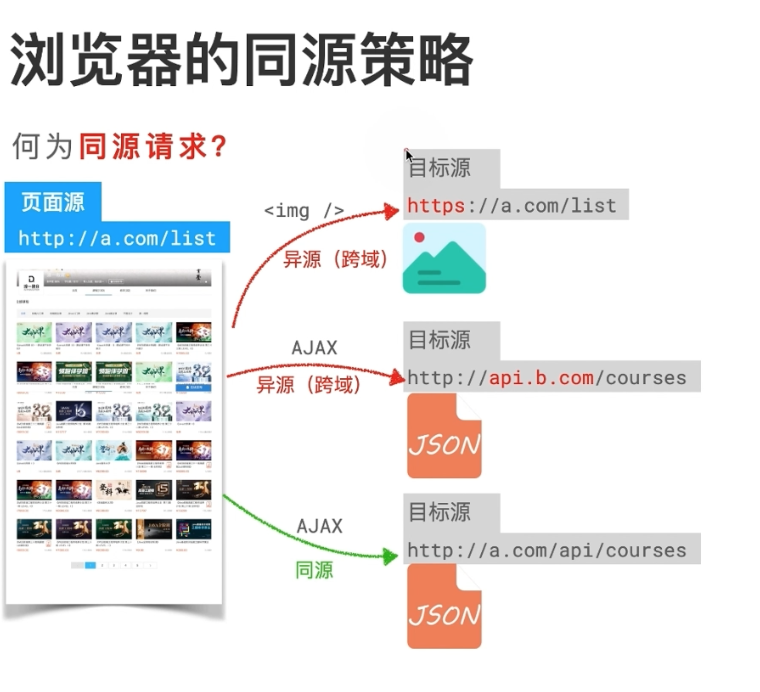

# 同源策略和跨域问题

## 同源策略

# 

浏览器为了用户信息的安全，对不是同源的资源的请求，进行限制。

- 同源：协议+域名+端口，都相同，则为同源

- 同源请求

## 跨域问题

由于浏览器的同源策略，就产生了跨域（异源）问题。

- 跨域：请求不同源的资源，也就是跨域了。

- 跨域请求/异源请求

## 参考资料

https://www.bilibili.com/video/BV13F411y7fy/?spm_id_from=333.337.search-card.all.click&vd_source=22af953ea4c09540ad1966711a2d53f0

