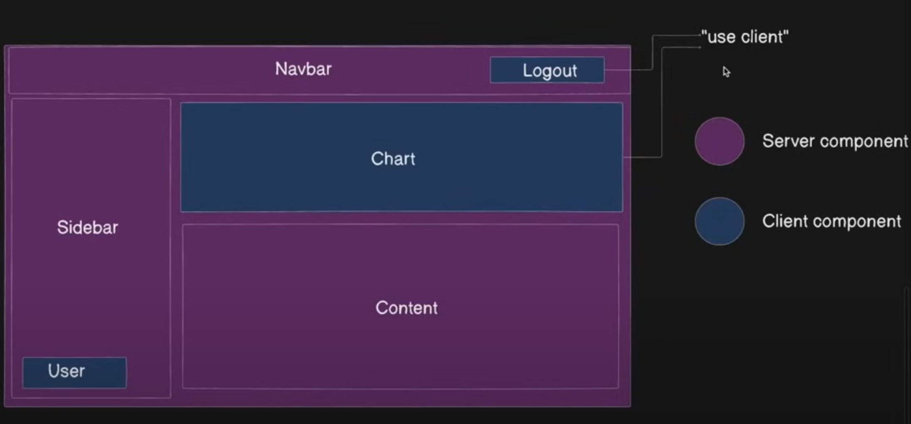

# 目录结构

- apps

- packages
  
  - components：包含，avatar/button等组件的独立package
  
  - core
    
    - react：package，导入components下的所有组件的package，再统一导出，只有这一个作用
    
    - system：NextUI 系统原语（原始的东西/底层），在这里您可以找到 `extendVariants` 实用程序、`NextUIProvider` 和一些其他实用程序。
    
    - system-rsc：组件的快速描述。这是一个内部实用程序，不适合公共使用。NextUI 系统原语与 RSC 导入兼容。
    
    - theme：主题。NextUI 主题原语，在这里可以找到 TailwindCSS `plugin`、`colors`、`layout`、`spacing`、`typography` 和一些其他实用程序。
  
  - hooks
  
  - storybook
  
  - utilities

## Server Side Render & Client Side Render

### SSR

#### 优点

- 首页加载很快

- 对老设备和网速慢的设备，更友好

- 更好的Search Engine Optimization
  
  

#### 缺点

- 更少的交互

- 增加服务器负载

- 后序的页面加载更慢

- 状态管理更复杂

### CSR

#### 优点

- 更好的交互

- 更少的服务器负载

- 后序的页面加载更快

- 状态管理相对简单

#### 缺点

- 首页加载慢

- 依赖于客户端的设备，对老设备和网速慢的设备，不太友好

- 影响SEO
