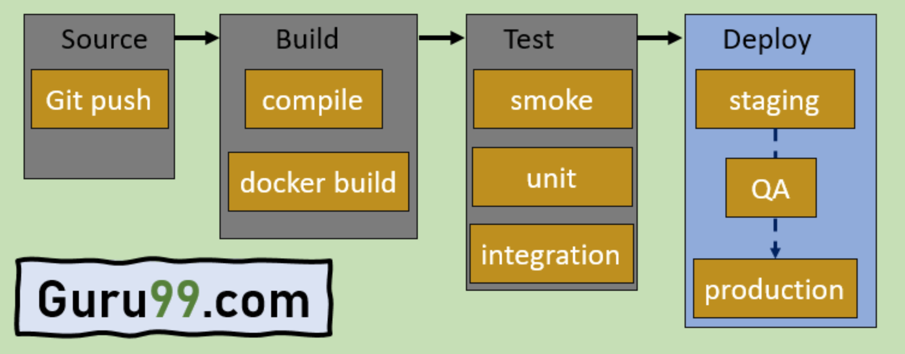

## Continuous integration 持续集成

Continuous integration (CI) is a software development practice where developers regularly merge their code changes into a central repository, after which automated builds and tests are run. CI most often refers to the build or integration stage of the software release process and requires both an automation component (for example a CI or build service) and a cultural component (for example learning to integrate frequently). The key goals of CI are to find and address bugs more quickly, improve software quality, and reduce the time it takes to validate and release new software updates.  
持续集成 (CI) 是**一种软件开发实践**，**开发人员定期将代码更改合并到中央存储库中，然后运行自动化构建和测试**。 CI 通常指的是**软件发布过程的构建或集成阶段**，并且需要自动化组件（例如 CI 或构建服务）和文化组件（例如学习频繁集成）。 <u>CI 的主要目标</u>是**更快地发现和解决错误、提高软件质量以及减少验证和发布新软件更新所需的时间**。

Continuous integration focuses on smaller commits and smaller code changes to integrate. A developer commits code at regular intervals, at minimum once a day. The developer pulls code from the code repository to ensure the code on the local host is merged before pushing to the build server. At this stage the build server runs the various tests and either accepts or rejects the code commit.  
<u>持续集成侧重于较小的提交和较小的代码更改以进行集成。开发人员定期提交代码，至少每天一次</u>。开发人员从代码存储库中提取代码，以确保本地主机上的代码在推送到构建服务器之前已合并。在此阶段，构建服务器运行各种测试并接受或拒绝代码提交。

It takes time to automate builds as well as testing of projects into a full continuous integration process. A few common challenges in this process are caused by the increased frequency of commits, as this causes a higher maintenance burden on the single source code repository, and increases hardware requirements to accommodate the testing of every change. Additional challenges include the creation of testing environments that represent production without inclusion of sensitive data, providing visibility of the testing process to the team, and providing easy access to any version of the application.  
将项目的构建和测试自动化到完整的持续集成过程中需要时间。此过程中的一些常见挑战是由提交频率的增加引起的，因为这会给单个源代码存储库带来更高的维护负担，并增加硬件要求以适应每个更改的测试。其他挑战包括创建代表生产而不包含敏感数据的测试环境、为团队提供测试过程的可见性以及提供对任何版本的应用程序的轻松访问。

## Continuous delivery and deployment 持续交付和部署

Continuous delivery (CD) is a software development practice where code changes are automatically built, tested, and prepared for production release. It expands on continuous integration by deploying all code changes to a testing environment, a production environment, or both after the build stage has been completed. Continuous delivery can be fully automated with a workflow process or partially automated with manual steps at critical points. When continuous delivery is properly implemented, developers always have a deployment-ready build artifact that has passed through a standardized test process.  
持续交付 (CD) 是一种软件开发实践，其中代码更改会自动构建、测试并准备生产发布。它通过在构建阶段完成后将所有代码更改部署到测试环境、生产环境或两者来扩展持续集成。持续交付可以通过工作流程实现完全自动化，也可以在关键点通过手动步骤实现部分自动化。当持续交付得到正确实施时，开发人员始终拥有已通过标准化测试流程的可部署构建工件。

With continuous deployment, revisions are deployed to a production environment automatically without explicit approval from a developer, making the entire software release process automated. This, in turn, allows for a continuous customer feedback loop early in the product lifecycle.  
通过持续部署，无需开发人员明确批准即可将修订版本自动部署到生产环境，从而使整个软件发布过程自动化。反过来，这可以在产品生命周期的早期实现持续的客户反馈循环。

## Continuous delivery is not continuous deployment 持续交付不是持续部署

One misconception about continuous delivery is that it means every change committed is applied to production immediately after passing automated tests. However, the point of continuous delivery is not to apply every change to production immediately, but to ensure that every change is ready to go to production.  
关于持续交付的一个误解是，这意味着提交的每一项更改都会在通过自动化测试后立即应用于生产。然而，持续交付的重点并不是立即将每个变更应用到生产中，而是确保每个变更都准备好投入生产。

Before deploying a change to production, you can implement a decision process to ensure that the production deployment is authorized and audited. This decision can be made by a person and then run by the tooling.  
在将更改部署到生产之前，您可以实施决策流程以确保生产部署经过授权和审核。这个决定可以由人做出，然后由工具运行。

Using continuous delivery, the decision to go live becomes a business decision, not a technical one. The technical validation happens on every commit.  
使用持续交付，上线决策将成为一项业务决策，而不是技术决策。每次提交都会进行技术验证。

Rolling out a change to production is not a disruptive event. Deployment doesn’t require the technical team to stop working on the next set of changes, and it doesn’t need a project plan, handover documentation, or a maintenance window. Deployment becomes a repeatable process that has been carried out and proven multiple times in testing environments.  
推出生产变更并不是一个破坏性事件。部署不需要技术团队停止进行下一组更改，也不需要项目计划、移交文档或维护窗口。部署成为一个可重复的过程，已在测试环境中多次执行和验证。

## What is a CI/CD pipeline?

什么是 CI/CD 管道？

A CI/CD pipeline automates the process of software delivery. It builds code, runs tests, and helps you to safely deploy a new version of the software. CI/CD pipeline reduces manual errors, provides feedback to developers, and allows fast product iterations.  
CI/CD 管道使软件交付过程自动化。它构建代码、运行测试并帮助您安全地部署新版本的软件。 CI/CD 管道减少了手动错误，向开发人员提供反馈，并允许快速产品迭代。

CI/CD pipeline introduces automation and continuous monitoring throughout the lifecycle of a software product. It involves from the integration and testing phase to delivery and deployment. These connected practices are referred as CI/CD pipeline.  
CI/CD 管道在软件产品的整个生命周期中引入了自动化和持续监控。它涉及从集成和测试阶段到交付和部署。这些相互关联的实践称为 CI/CD 管道。

## What is Continuous Integration, Continuous Delivery, and Continuous Deployment?

什么是持续集成、持续交付和持续部署？

- **Continuous integration** is a software development method where members of the team can integrate their work at least once a day. In this method, every integration is checked by an automated build to search the error.  
  持续集成是一种软件开发方法，团队成员每天至少可以集成一次他们的工作。在此方法中，每个集成都会通过自动构建进行检查以搜索错误。
- **Continuous delivery** is a software engineering method in which a team develops software products in a short cycle. It ensures that software can be easily released at any time.  
  持续交付是一种团队在短周期内开发软件产品的软件工程方法。它确保软件可以随时轻松发布。
- **Continuous deployment** is a software engineering process in which product functionalities are delivered using automatic deployment. It helps testers to validate whether the codebase changes are correct, and it is stable or not.  
  持续部署是一个软件工程过程，其中使用自动部署来交付产品功能。它可以帮助测试人员验证代码库更改是否正确以及是否稳定。

## Stages of a CI/CD pipeline CI/CD 管道的各个阶段

A CI/CD pipeline is a runnable specification of the steps that any developer should perform to deliver a new version of any software. Failure in each and every stage triggers a notification via email, Slack, or other communication platforms. It enables responsible developers to know about the important issues.  
CI/CD 管道是任何开发人员在交付任何软件的新版本时应执行的步骤的可运行规范。每个阶段的失败都会通过电子邮件、Slack 或其他通信平台触发通知。它使负责任的开发人员能够了解重要问题。

Here are the important Stages of CI/CD pipeline:  
以下是 CI/CD 管道的重要阶段：

### Source Stage 源阶段

In the source stage, CI/CD pipeline is triggered by a code repository. Any change in the program triggers a notification to the CI/CD tool that runs an equivalent pipeline. Other common triggers include user-initiated workflows, automated schedules, and the results of other pipelines.  
在源阶段，CI/CD 管道由代码存储库触发。程序中的任何更改都会触发对运行等效管道的 CI/CD 工具的通知。其他常见触发器包括用户启动的工作流程、自动计划和其他管道的结果。

### Build Stage 构建阶段

This is the second stage of the CI/CD Pipeline in which you merge the source code and its dependencies. It is done mainly to build a runnable instance of software that you can potentially ship to the end-user.  
这是 CI/CD 管道的第二阶段，在其中合并源代码及其依赖项。它主要是为了构建一个可运行的软件实例，您可以将其交付给最终用户。

Programs that are written in languages like [C++](https://www.guru99.com/cpp-tutorial.html), Java, C, or Go language should be compiled. On the other hand, [JavaScript](https://www.guru99.com/interactive-javascript-tutorials.html), Python, and Ruby programs can work without the build stage.  
使用 C++、Java、C 或 Go 语言等语言编写的程序应该进行编译。另一方面，JavaScript、Python 和 Ruby 程序无需构建阶段即可运行。

Failure to pass the build stage means there is a fundamental project misconfiguration, so it is better that you address such issue immediately.  
未能通过构建阶段意味着存在根本性的项目配置错误，因此最好立即解决此类问题。

### Test Stage 测试阶段

Test Stage includes the execution of automated tests to validate the correctness of code and the behaviour of the software. This stage prevents easily reproducible bugs from reaching the clients. It is the responsibility of developers to write automated tests.  
测试阶段包括执行自动化测试以验证代码的正确性和软件行为。此阶段可防止客户端收到容易重现的错误。开发人员有责任编写自动化测试。

### Deploy Stage 部署阶段

This is the last stage where your product goes live. Once the build has successfully passed through all the required test scenarios, it is ready to deploy to live server.  
这是您的产品上线的最后阶段。一旦构建成功通过了所有必需的测试场景，就可以部署到实时服务器了。

## 参考

[What is continuous integration and continuous delivery/deployment?](https://docs.aws.amazon.com/whitepapers/latest/practicing-continuous-integration-continuous-delivery/what-is-continuous-integration-and-continuous-deliverydeployment.html)

[CI/CD Pipeline: Learn with Example](https://www.guru99.com/ci-cd-pipeline.html#2)

