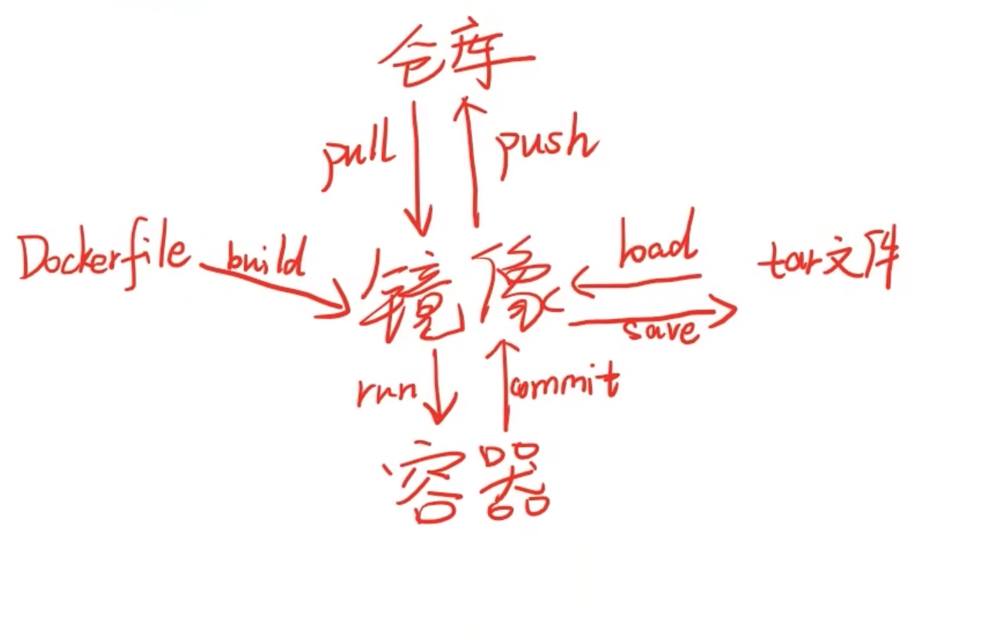

## 镜像image

类比虚拟机中的iso/img文件

## 容器

类比正在运行中的虚拟机。类似于一个轻量级的沙盒，可以将其看作一个极简的Linux系统环境。Docker引擎利用容器来运行、隔离各个应用。容器是镜像创建的应用实例，可以创建、启动、停止、删除容器，各个容器之间是是相互隔离的，互不影响。

镜像与容器的关系，类似于代码与进程的关系。

- `docker run` 创建容器
- `docker stop` 停止容器
- `docker rm` 删除容器

### 创建容器

基于 `nginx` 镜像创建一个最简单的容器：启动一个最简单的 http 服务

使用 `docker run` 来启动容器，`docker ps` 查看容器启动状态

```shell
$ docker run -d --name nginx -p 8888:80 nginx:alpine

$ docker ps -l
CONTAINER ID        IMAGE                COMMAND                  CREATED             STATUS              PORTS                    NAMES
404e88f0d90c        nginx:alpine         "nginx -g 'daemon of…"   4 minutes ago       Up 4 minutes        0.0.0.0:8888->80/tcp     nginx
CONTAINER ID        IMAGE                COMMAND                  CREATED             STATUS              PORTS                    NAMES
```

其中:

- `-d`: 启动一个 `daemon` 进程
- `--name`: 为容器指定名称
- `-p host-port:container-port`: 宿主机与容器端口映射，方便容器对外提供服务
- `nginx:alpine`: 基于该镜像创建容器

### 进入容器

那如果要进入容器环境中呢？使用 `docker exec -it container-name` 命令

```shell
$ docker exec -it nginx sh
/ #
/ #
/ #
```

### 查看容器

`docker ps` 列出所有容器

```shell
$ docker ps
CONTAINER ID        IMAGE                COMMAND                  CREATED             STATUS              PORTS                    NAMES
404e88f0d90c        nginx:alpine         "nginx -g 'daemon of…"   4 minutes ago       Up 4 minutes        0.0.0.0:8888->80/tcp     nginx
498e7d74fb4f        nginx:alpine         "nginx -g 'daemon of…"   7 minutes ago       Up 7 minutes        80/tcp                   lucid_mirzakhani
2ce10556dc8f        redis:4.0.6-alpine   "docker-entrypoint.s…"   2 months ago        Up 2 months         0.0.0.0:6379->6379/tcp   apolloserverstarter_redis_1
```

`docker port` 查看容器端口映射

```shell
$ docker port nginx
80/tcp -> 0.0.0.0:8888
```

`docker stats` 查看容器资源占用

```shell
$ docker stats nginx
CONTAINER ID        NAME                CPU %               MEM USAGE / LIMIT     MEM %               NET I/O             BLOCK I/O           PIDS
404e88f0d90c        nginx               0.00%               1.395MiB / 1.796GiB   0.08%               632B / 1.27kB       0B / 0B             2
```

## Dockerfile

相当于配置文件，内容是“如何构建image”。

在使用 `docker` 部署自己应用时，往往需要自己构建镜像。`docker` 使用 `Dockerfile` 作为配置文件构建镜像，简单看一个 `node` 应用构建的 `dockerfile`

```dockerfile
FROM node:alpine

ADD package.json package-lock.json /code/
WORKDIR /code

RUN npm install --production

ADD . /code

CMD npm start
```

### build：构建镜像

并不是所有的镜像都可以在镜像仓库中找到，另外我们也需要为我们自己的业务应用去构建镜像。

使用 `docker build` 构建镜像，**`docker build` 会使用当前目录的 `dockerfile` 构建镜像**，至于 `dockerfile` 的配置，参考下节。

`-t` 指定标签

```shell
# -t node-base:10: 镜像以及版本号
# .: 指当前路径
$ docker build -t node-base:10 .
```

当构建镜像成功后可以使用 `docker push` 推送到镜像仓库

### FROM

基于一个旧有的镜像，格式如下

```dockerfile
FROM <image> [AS <name>]

# 在多阶段构建时会用到
FROM <image>[:<tag>] [AS <name>]
```

### ADD

把目录，或者 url 地址文件加入到镜像的文件系统中

```dockerfile
ADD [--chown=<user>:<group>] <src>... <dest>
```

### RUN

执行命令，由于 `ufs` 的文件系统，它会在当前镜像的顶层新增一层

```dockerfile
RUN <command>
```

### CMD

指定容器如何启动

**一个 `Dockerfile` 中只允许有一个 CMD**

```dockerfile
# exec form, this is the preferred form
CMD ["executable","param1","param2"] 

# as default parameters to ENTRYPOINT
CMD ["param1","param2"]

# shell form
CMD command param1 param2
```


## 仓库repository

远程的仓库，保存了很多image，包括官方的image/第三方的image。是Docker用来集中存放镜像文件的地方。<u>注意与注册服务器（Registry）的区别：</u>注册服务器是存放仓库的地方，一般会有多个仓库；而仓库是存放镜像的地方，一般每个仓库存放一类镜像，每个镜像利用tag进行区分，比如Ubuntu仓库存放有多个版本（12.04、14.04等）的Ubuntu镜像。

## tar文件

把image save成一个tar文件，别人可以通过tar文件load成image

## 参考

[【docker入门】10分钟，快速学会docker](https://www.bilibili.com/video/BV1R4411F7t9/?spm_id_from=333.788.top_right_bar_window_history.content.click&vd_source=22af953ea4c09540ad1966711a2d53f0)
