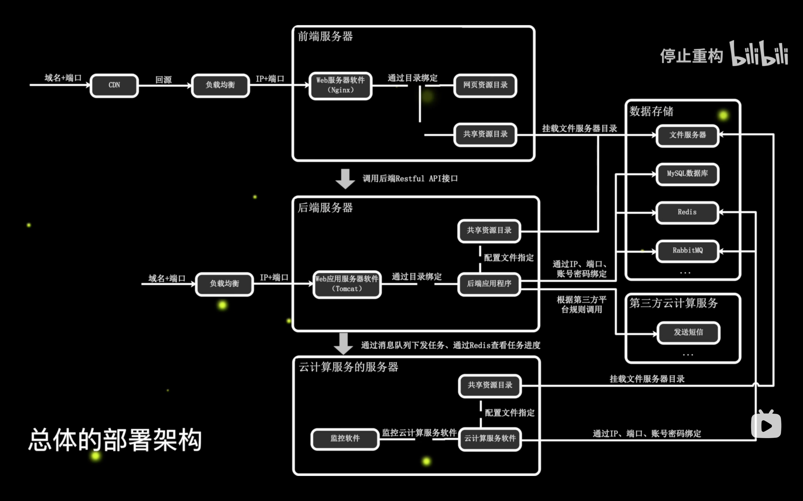
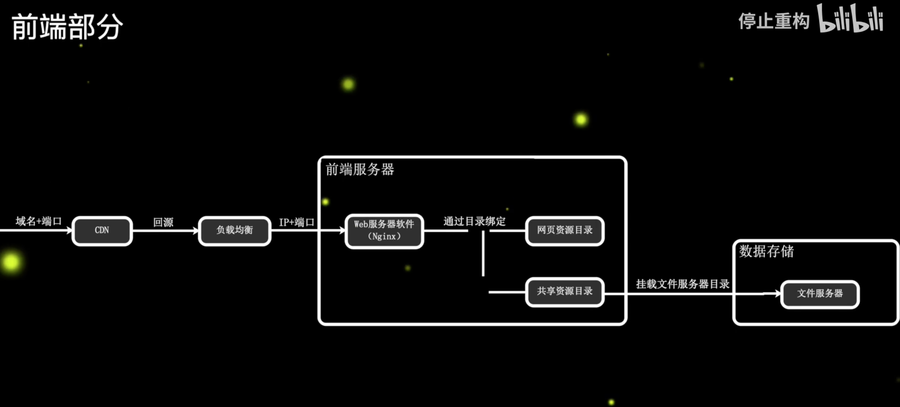
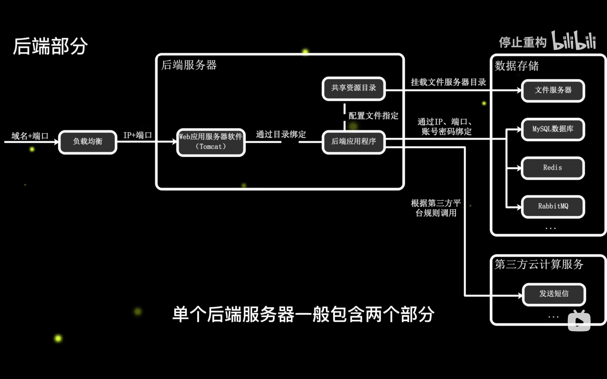
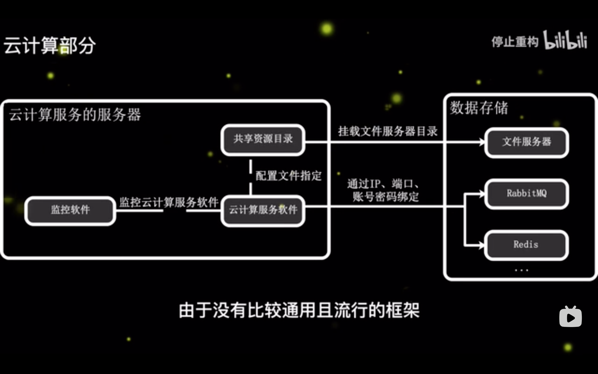
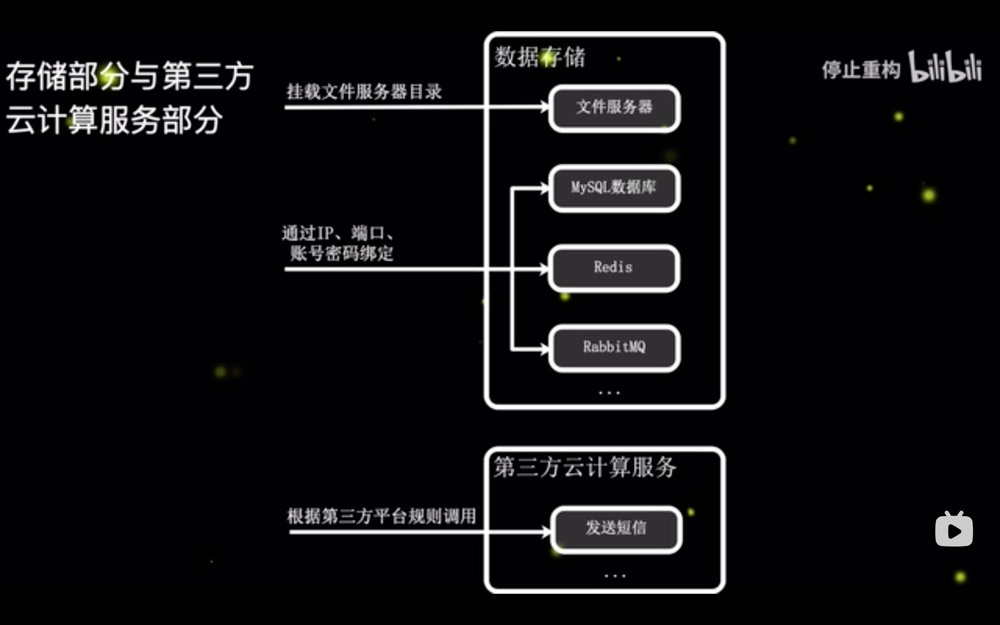

[网站前端部署最佳实践-对象存储加CDN实现低成本支撑大规模用户](https://www.bilibili.com/video/BV1Jg4y1F7kb/?spm_id_from=333.880.my_history.page.click&vd_source=22af953ea4c09540ad1966711a2d53f0)

[编程后端运维的概念科普和演进 - linux docker kubernetes serverless 函数计算](https://www.bilibili.com/video/BV1T341137MB/?spm_id_from=333.880.my_history.page.click&vd_source=22af953ea4c09540ad1966711a2d53f0)

[【网站架构】5分钟了解部署架构，如何理解分布式、集群、CDN、负载均衡、K8S、Docker等概念？](https://www.bilibili.com/video/BV1M34y1B7H7/?spm_id_from=333.999.0.0&vd_source=22af953ea4c09540ad1966711a2d53f0)

[DevOps实战笔记](https://learn.lianglianglee.com/%E4%B8%93%E6%A0%8F/DevOps%E5%AE%9E%E6%88%98%E7%AC%94%E8%AE%B0)

[静态网站部署，上线你的个人网站](https://www.bilibili.com/video/BV17S4y1P7qH/?spm_id_from=333.337.search-card.all.click&vd_source=22af953ea4c09540ad1966711a2d53f0)

## B/S架构网站部署

- 前端部分

- 后端部分

- 云计算部分

- 存储部分与第三方云计算服务部分

**集群**

集群是提供相同的功能的多个服务器。

集群主要是为了降低单台服务器的压力和突破单台服务器的性能极限

**分布式**

分布式是单台服务器做单一的服务，专门的服务器做专门的事，可以针对性的提高硬件性能。例如，数据库服务器/文件服务器/应用服务器。

**Kubernets**

K8S是docker等容器的管理软件，管理多个服务器的多个容器。

### 前端部分

### 后端部分

### 云计算部分

### 存储部分与第三方云计算服务部分

