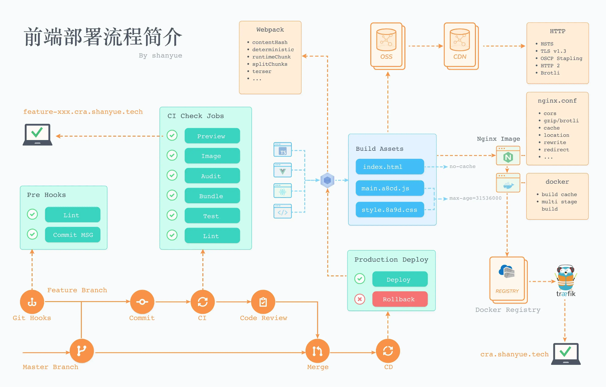

[网站前端部署最佳实践-对象存储加CDN实现低成本支撑大规模用户](https://www.bilibili.com/video/BV1Jg4y1F7kb/?spm_id_from=333.880.my_history.page.click&vd_source=22af953ea4c09540ad1966711a2d53f0)

[编程后端运维的概念科普和演进 - linux docker kubernetes serverless 函数计算](https://www.bilibili.com/video/BV1T341137MB/?spm_id_from=333.880.my_history.page.click&vd_source=22af953ea4c09540ad1966711a2d53f0)

[【网站架构】5分钟了解部署架构，如何理解分布式、集群、CDN、负载均衡、K8S、Docker等概念？](https://www.bilibili.com/video/BV1M34y1B7H7/?spm_id_from=333.999.0.0&vd_source=22af953ea4c09540ad1966711a2d53f0)

[DevOps实战笔记](https://learn.lianglianglee.com/%E4%B8%93%E6%A0%8F/DevOps%E5%AE%9E%E6%88%98%E7%AC%94%E8%AE%B0)

[静态网站部署，上线你的个人网站](https://www.bilibili.com/video/BV17S4y1P7qH/?spm_id_from=333.337.search-card.all.click&vd_source=22af953ea4c09540ad1966711a2d53f0)

## 前端部署方式

### 手动部署

这是最原始的方式。

#### 流程：

本地build打包构建 ——> FTP等工具上传文件到静态资源服务器的目录 ——> 通过域名访问最新文件

#### 缺点：

- 手动部署容易出错

- 效率低

### 自动部署

#### 自定义脚本部署

#### CI/CD工具部署

CI/CD工具部署其实和手动部署是一样的，只是自动化了。

CI/CD工具部署就是将本地build构建 和 FTP文件上传，直接通过程序自动执行。例如我们通过gitlab的CI/CD工具 或 github action 构建并上传前端文件。

#### 流程：

git push代码到代码仓库 ——> gitlab CI/CD或github action 依赖配置文件打包构建并上传 ——> 通过域名访问最新文件

## Docker镜像部署

docker部署是平台化部署的基础，算是命令工具部署，如果说便捷程度，其实**命令工具部署 和 docker部署** 差不多，但是它有个好处：docker镜像可备份；  

下面是docker镜像的Dockerfile文件和配置：

```dockerfile
FROM node:latest
COPY package.json /
RUN npm i --registry=https://registry.npm.taobao.org
RUN npm run build

FROM nginx:latest
# 这里的dist/目录是你的项目打包后的文件目录
COPY ./dist/ /usr/share/nginx/html/
COPY ./nginx.conf /etc/nginx/conf.d/

EXPOSE 80
```

nginx配置文件:

```nginx
server {
    listen 80 default_server;
    server_name _;

    location / {
      root   /usr/share/nginx/html/web;
      index  index.html index.htm;
      try_files $uri $uri/ /index.html;
    }

    # 接口代理示例
    # location /api {
    #     proxy_pass http://xxx.com;
    #     proxy_set_header Host $host:$server_port;
    #     proxy_set_header X-Real-IP $remote_addr;
        #     proxy_set_header X-Forwarded-For $proxy_add_x_forwarded_for;
    #     proxy_set_header Cookie $http_cookie;
    #     proxy_buffering off;
    #     proxy_cache off;
    # }
  }
```

之后，通过 docker build 、docker push 镜像名，将镜像打包并推到远端仓库（一般是自己公司项目的私库），然后在服务器上拉取最新的镜像，然后将最新的镜像启动即可。

docker 镜像一般会直接把nginx服务打包在一起，所以不用再在服务器上开启单独的服务，只需要将docker端口开放即可。当然，如果是为了统一管理端口，也是可以通过专门的代理服务管理。

#### 流程：

本地 build打包构建 ——> 构建docker镜像 ——> 服务器更新镜像并启动最新镜像 ——> 通过域名访问最新文件

## 集群/平台化部署

平台化部署其实就是全流程： **CI/CD工具部署** + **docker镜像的组合版。** 只需要将代码push提交，之后通过网页访问打包构建平台，例如：阿里云效流水线 或 jenkins打包构建等平台，可以通过点击按钮，下一步下一步的方式，完成打包构建，镜像上传。

至于更新，我是使用rancher平台来进行，服务的管理或更新，镜像上传完之后，可以在rancher平台配置好相关的负载服务，剩下就只是点击更新按钮就可以。

下面是以 阿里codeup流水线 + rancher作为流程示例：

**提示**：阿里codeup流水线 或 jekins打包构建 就类似于docker镜像打包，rancher部署就类似于我们将最新镜像上传到服务器上，然后开启服务。（**rancher部署可能更加复杂，因为还涉及到k8s集群知识**）

#### 流程：

git push代码到代码仓库 ——> 通过_codeup_流水线构建打包上传镜像 ——> rancher等平台更新镜像 ——> 通过域名访问最新文件。

具体细节可以参考下面的文章：[如何使用Rancher发布前端服务](https://segmentfault.com/a/1190000044142025)

## 参考

https://segmentfault.com/a/1190000043367573#item-3

## B/S架构网站部署

- 前端部分

- 后端部分

- 云计算部分

- 存储部分与第三方云计算服务部分


**集群**

集群是提供相同的功能的多个服务器。

集群主要是为了降低单台服务器的压力和突破单台服务器的性能极限

**分布式**

分布式是单台服务器做单一的服务，专门的服务器做专门的事，可以针对性的提高硬件性能。例如，数据库服务器/文件服务器/应用服务器。

**Kubernets**

K8S是docker等容器的管理软件，管理多个服务器的多个容器。

### 前端部分


### 后端部分


### 云计算部分


### 存储部分与第三方云计算服务部分


