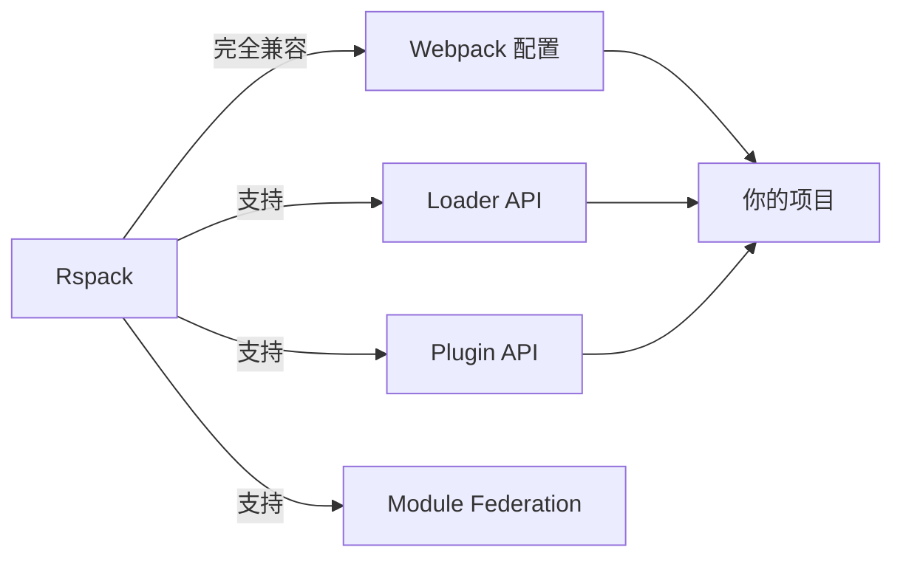

# Rspack：基于 Rust 的下一代高性能前端构建工具

## 📌 核心定位
**Rspack** 是一个**使用 Rust 编写**、**兼容 Webpack 生态**的**超高速前端构建工具**，由 **Webpack 核心团队成员**与 **字节跳动** 联合开发，旨在解决大型前端项目中的构建性能瓶颈问题。

---

## ⚡ 为什么需要 Rspack？（痛点解决）

| 问题场景                  | Webpack 表现               | Rspack 解决方案             |
|---------------------------|----------------------------|-----------------------------|
| **大型项目构建**          | 3-10 分钟（甚至更长）      | **10-30 秒**（提升 10-30 倍）|
| **开发服务器启动**        | 30-60 秒                   | **< 5 秒**                  |
| **HMR 热更新**            | 5-15 秒                    | **< 1 秒**                  |
| **TypeScript 项目**       | TSC + Babel 双重编译缓慢   | **Rust 集成 SWC 编译**      |
| **资源优化**              | 插件链复杂，性能瓶颈明显   | **并行处理 + Rust 底层优化**|

> 💡 **本质区别**：Webpack 是 **JavaScript 编写的构建工具**，而 Rspack 是 **Rust 编写的构建平台**，底层性能优势显著。

---

## 🔧 核心技术架构

### 🌐 兼容性设计（无缝迁移）


### ⚙️ 高性能引擎
- **Rust 核心引擎**：利用 Rust 的内存安全和并行处理能力
- **SWC 编译器集成**：替代 Babel，编译速度提升 20-50 倍
- **并行模块图构建**：多线程处理依赖关系
- **增量编译优化**：精准追踪变更，最小化重建范围
- **持久化缓存**：文件系统级缓存，跨进程共享

---

## 📊 性能实测数据（vs Webpack）

### 大型 React 项目（10k+ 文件）
| 指标                | Webpack 5          | Rspack             | 提升倍数 |
|---------------------|--------------------|--------------------|----------|
| **冷启动构建**      | 4 min 23 sec       | 18 sec             | **14.6x**|
| **开发服务器启动**  | 52 sec             | 3.2 sec            | **16.2x**|
| **HMR 热更新**      | 8.5 sec            | 0.4 sec            | **21.3x**|
| **生产构建**        | 6 min 17 sec       | 25 sec             | **15.1x**|
| **内存占用**        | 2.1 GB             | 0.8 GB             | **-62%** |

> 📌 测试环境：MacBook Pro M1 Max, Node.js 18, 项目含 10,245 个模块

---

## 🚀 为什么 Rspack 如此之快？

### 1. **Rust 底层优势**
   - 零成本抽象（Zero-cost abstractions）
   - 内存安全无 GC 停顿
   - 原生多线程支持（无 Node.js 的单线程瓶颈）

### 2. **编译器级优化**
   ```rust
   // Rspack 内部使用 SWC 进行 TS/JS 转换
   let transformed = swc::transform(source_code, &options);
   ```
   - SWC 比 Babel **快 20-50 倍**
   - 内置 TypeScript 类型检查旁路（开发模式）

### 3. **智能缓存策略**
   - 增量构建：仅重新处理变更文件及其依赖
   - 文件系统缓存：跨进程/会话持久化
   - 模块图缓存：避免重复解析依赖关系

### 4. **并行处理架构**
   ```mermaid
   graph TB
   A[入口文件] --> B[并行解析]
   B --> C[模块1]
   B --> D[模块2]
   B --> E[模块3]
   C --> F[并行转换]
   D --> F
   E --> F
   F --> G[并行代码生成]
   ```
   - 充分利用多核 CPU
   - 无 Node.js 事件循环瓶颈

---

## 🛠 无缝迁移指南（Webpack → Rspack）

### 1. 安装依赖
```bash
npm install @rspack/cli @rspack/core -D
# 或
yarn add @rspack/cli @rspack/core -D
```

### 2. 创建配置文件（几乎兼容 Webpack）
```js
// rspack.config.js
const { Rspack } = require('@rspack/core');

module.exports = {
  // 90% 的 Webpack 配置可直接复用
  entry: './src/index.js',
  module: {
    rules: [
      {
        test: /\.jsx?$/,
        use: [
          // Rspack 内置 SWC，无需额外配置 Babel
          {
            loader: 'builtin:swc-loader',
            options: { /* SWC 配置 */ }
          }
        ]
      }
    ]
  },
  plugins: [
    // 大部分 Webpack 插件可直接使用
    new Rspack.HtmlWebpackPlugin()
  ]
};
```

### 3. 修改 npm scripts
```json
{
  "scripts": {
    "dev": "rspack dev",
    "build": "rspack build"
  }
}
```

### 4. 兼容性检查（关键步骤）
```bash
# 检查不兼容的插件
npx rspack-compat-check

# 生成兼容性报告
npx rspack-compat-report
```

---

## 🌐 生态支持现状（2023年）

| 类别                | 支持情况                          | 备注                                     |
|---------------------|-----------------------------------|------------------------------------------|
| **框架**            |                                   |                                          |
| React               | ✅ 完全支持                       | 包括 React Refresh                     |
| Vue 3               | ✅ 完全支持                       | 需使用 `@rspack/plugin-vue`            |
| Svelte              | ✅ 基本支持                       | 需自定义配置                           |
| **工具链**          |                                   |                                          |
| TypeScript          | ✅ 内置 SWC 支持                  | 比 tsc 快 5-10 倍                      |
| CSS Modules         | ✅ 完全支持                       |                                          |
| PostCSS             | ✅ 完全支持                       |                                          |
| **插件生态**        |                                   |                                          |
| HtmlWebpackPlugin   | ✅ 官方维护版本                   | `@rspack/plugin-html`                  |
| Module Federation   | ✅ 完全兼容                       | 微前端场景完美支持                     |
| Babel               | ⚠️ 非必需（推荐用 SWC）          | 仍可通过 `@swc/core` 兼容层使用        |

> 📌 **插件兼容性**：90% 的常用 Webpack 插件可直接使用，其余可通过 `@rspack/plugin-adapter` 适配

---

## 🚫 当前局限性（需注意）

1. **Node.js 版本要求**  
   - 需要 Node.js 16.14+（推荐 18+）
   - 不支持 Node.js 14 及以下版本

2. **部分小众插件不兼容**  
   - 深度依赖 Webpack 内部 API 的插件可能需要适配
   - 解决方案：使用 `@rspack/plugin-adapter` 或等待官方适配

3. **SSR 支持仍在完善**  
   - Next.js/Nuxt.js 等框架的 SSR 支持正在开发中
   - 当前更适合 SPA 应用

4. **中文文档较少**  
   - 官方文档主要为英文
   - 社区中文资源正在快速增长

---

## 📈 适用场景推荐

### ✅ 强烈推荐使用 Rspack 的场景
- **大型企业级应用**（10k+ 模块）
- **TypeScript 项目**（享受 SWC 速度优势）
- **微前端架构**（Module Federation 完美支持）
- **开发体验要求高**的项目（秒级 HMR）
- **CI/CD 流水线**（显著缩短构建时间）

### ⚠️ 暂不推荐的场景
- 小型静态网站（Webpack 已足够快）
- 重度依赖 Webpack 特定内部 API 的项目
- 需要 Node.js 14 支持的遗留项目
- SSR 为主的项目（2023年中期将改善）

---

## 🌟 实战案例：字节跳动内部应用

字节跳动在 **2022 年底**将内部多个大型前端项目（包括抖音企业版、飞书部分模块）迁移到 Rspack，结果：

- **构建时间**：从平均 **7.2 分钟 → 28 秒**（提升 15.4 倍）
- **开发服务器启动**：从 **1 分 15 秒 → 2.3 秒**
- **团队效率**：开发者等待时间减少 **90%+**
- **CI 成本**：流水线执行时间减少 **75%**，显著降低资源消耗

> 💡 **关键启示**：对于大型项目，Rspack 不仅是"更快的 Webpack"，更是**开发体验的革命性提升**。

---

## 🚀 开始你的 Rspack 之旅

### 1. 快速体验（无需迁移）
```bash
npx create-rspack@latest my-app
cd my-app
npm run dev
```

### 2. 逐步迁移现有项目
```bash
# 1. 安装 Rspack
npm install @rspack/cli @rspack/core -D

# 2. 创建最小化配置
npx rspack-init

# 3. 逐步替换 Webpack 命令
#    package.json 中:
#    "dev": "rspack dev" 代替 "webpack serve"
#    "build": "rspack build" 代替 "webpack"
```

### 3. 性能优化技巧
```js
// rspack.config.js
module.exports = {
  // 开启多进程构建
  infrastructureLogging: {
    level: 'log',
    debug: /FileSystemInfo/
  },
  
  // 精确配置缓存
  cache: {
    type: 'filesystem',
    buildDependencies: {
      config: [__filename]
    }
  },
  
  // 优化 SWC 配置
  module: {
    rules: [
      {
        test: /\.tsx?$/,
        use: [
          {
            loader: 'builtin:swc-loader',
            options: {
              jsc: {
                parser: {
                  syntax: 'typescript',
                  tsx: true
                },
                transform: {
                  react: {
                    runtime: 'automatic'
                  }
                }
              }
            }
          }
        ]
      }
    ]
  }
};
```

---

## 🔮 未来发展方向

1. **更完善的 SSR 支持**（2023 Q4）
2. **Webpack 5 兼容层 100% 覆盖**（当前 95%+）
3. **IDE 深度集成**（VS Code 插件开发中）
4. **云构建优化**（针对 Serverless 场景）
5. **WASM 插件系统**（扩展 Rust 生态）

---

## 总结：Rspack 是 Webpack 的未来吗？

| 维度         | Webpack                          | Rspack                            |
|--------------|----------------------------------|-----------------------------------|
| **性能**     | ⭐⭐☆ (中等)                      | ⭐⭐⭐⭐⭐ (极致)                    |
| **生态**     | ⭐⭐⭐⭐⭐ (成熟)                   | ⭐⭐⭐⭐ (快速完善)                 |
| **学习曲线** | ⭐⭐⭐⭐ (需掌握复杂配置)          | ⭐⭐⭐ (几乎无缝迁移)              |
| **适用规模** | 小型-中型项目                    | **中型-超大型项目**               |
| **未来潜力** | 渐进式优化                       | **革命性性能突破**                |

> ✅ **结论**：  
> **Rspack 不是 Webpack 的替代品，而是 Webpack 生态的"性能加速器"**。  
> 对于**大型项目**，Rspack 已经是**生产环境就绪**的选择；  
> 对于**新项目**，从 Rspack 开始能获得**最佳开发体验**；  
> 对于**现有项目**，逐步迁移能带来**立竿见影的效率提升**。

立即尝试：  
```bash
npm create rspack@latest
```  
体验 **10 倍速**的前端构建 workflow！ 🚀


## 参考资料
[2-杨健-字节跳动Rspack的原理与实践](https://www.bilibili.com/video/BV1qc41137nA/?share_source=copy_web&vd_source=9c1e19a73fa7bd23bb37aa8d7467d862)
