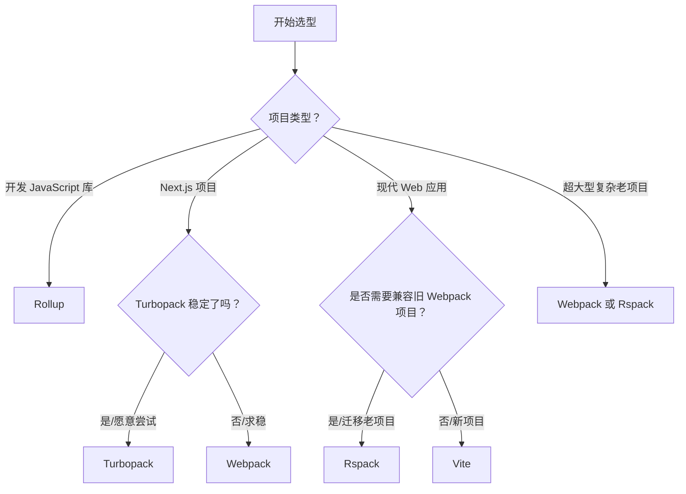

# 前端打包工具深度对比：Webpack vs Rollup vs Vite vs Rspack vs Turbopack

前端构建工具经历了从"蛮荒时代"到"工程化"再到"性能极致"的演变。以下是五大主流工具的深度对比分析。

---

## 📊 核心指标对比总览

| 特性 | **Webpack** | **Rollup** | **Vite** | **Rspack** | **Turbopack** |
|------|-------------|------------|----------|------------|---------------|
| **开发语言** | JavaScript | JavaScript | JavaScript (核心) | **Rust** | **Rust** |
| **开发模式** | 打包 bundling | 打包 bundling | **原生 ESM** (无打包) | 打包 bundling | **增量打包** |
| **生产模式** | Webpack | Rollup | **Rollup** | Rspack | Turbopack |
| **配置兼容** | 自有配置 | 自有配置 | 自有 (兼容 Rollup 插件) | **兼容 Webpack** | 自有 (Next.js 深度集成) |
| **启动速度** | 🐢 慢 (随项目增大) | 🐢 慢 | 🚀 **极快** (毫秒级) | 🚀 **极快** | 🚀 **极快** |
| **热更新 (HMR)** | 慢 | 一般 | 🚀 极快 | 🚀 极快 | 🚀 极快 (增量) |
| **生态成熟度** | ⭐⭐⭐⭐⭐ (最丰富) | ⭐⭐⭐⭐ (库为主) | ⭐⭐⭐⭐ (快速增长) | ⭐⭐⭐ (发展中) | ⭐⭐ (早期/测试) |
| **主要场景** | 大型复杂应用 | **JavaScript 库** | **现代 Web 应用** | Webpack 迁移/高性能 | **Next.js/React** |
| **维护状态** | 成熟稳定 | 成熟稳定 | 活跃主流 | 活跃 (字节出品) | 测试中 (Vercel 出品) |

---

## 🔍 详细工具分析

### 1️⃣ Webpack (老牌王者)
> **"功能最全，生态最强，但配置复杂且慢"**

- **核心原理**：一切皆模块，从入口文件开始递归构建依赖图，全部打包成 bundle。
- **✅ 优点**：
  - 生态极其丰富，几乎任何需求都有 loader/plugin。
  - 社区成熟，遇到问题容易找到解决方案。
  - 代码分割（Code Splitting）功能强大。
- **❌ 缺点**：
  - 配置复杂（webpack.config.js 往往很长）。
  - 大型项目构建速度慢，热更新随项目增大变慢。
  - 基于 JavaScript，性能瓶颈明显。
- **🎯 适用场景**：
  - 大型复杂企业级应用（尤其是老项目）。
  - 需要高度定制构建流程的场景。
  - 依赖大量特定 Webpack 插件的遗留项目。

### 2️⃣ Rollup (库开发首选)
> **"输出干净，Tree Shaking 最强，适合库"**

- **核心原理**：专注于 ES 模块，利用静态结构分析进行优化。
- **✅ 优点**：
  - 输出的代码非常简洁干净（适合发布 npm 包）。
  - Tree Shaking 效果最好（无用代码移除彻底）。
  - 配置相对 Webpack 简单。
- **❌ 缺点**：
  - 对 Code Splitting 支持不如 Webpack 灵活。
  - 热更新（HMR）体验不如 Vite/Webpack。
  - 不适合大型应用开发（缺少应用级优化）。
- **🎯 适用场景**：
  - **JavaScript/TypeScript 库开发**（如 Vue, React 本身）。
  - 对打包体积极其敏感的组件库。

### 3️⃣ Vite (现代应用标准)
> **"开发极速，生产可靠，基于 ESM"**

- **核心原理**：
  - **开发环境**：利用浏览器原生 ES Modules，按需加载，**不打包**。
  - **生产环境**：使用 Rollup 进行打包优化。
- **✅ 优点**：
  - 开发服务器启动秒开（与项目大小无关）。
  - 热更新极快（只更新变更模块）。
  - 开箱即用（支持 TS, JSX, CSS Modules 等）。
  - 兼容 Rollup 插件生态。
- **❌ 缺点**：
  - 生产构建基于 Rollup，超大型项目构建速度仍有瓶颈。
  - 对 CommonJS 支持不如 Webpack 完美（需预打包优化）。
  - 生态虽增长快，但特定场景插件不如 Webpack 多。
- **🎯 适用场景**：
  - **现代 Web 应用开发**（Vue/React/Svelte 等）。
  - 新项目首选。
  - 追求极致开发体验的团队。

### 4️⃣ Rspack (Webpack 高性能替代)
> **"兼容 Webpack 配置，Rust 性能加速"**

- **核心原理**：基于 Rust 编写，兼容 Webpack 的 API 和配置结构，内置 SWC 进行压缩/转译。
- **✅ 优点**：
  - **构建速度极快**（Rust 性能优势）。
  - **兼容 Webpack 配置**，迁移成本低（修改少量配置即可）。
  - 内置常用功能（TS, CSS, Sass 等无需额外 loader）。
- **❌ 缺点**：
  - 生态相对较新，部分冷门 Webpack 插件可能不兼容。
  - 社区规模不如 Webpack/Vite。
  - 由字节跳动出品，国内使用较多，国际推广中。
- **🎯 适用场景**：
  - **大型 Webpack 项目迁移**（想提速但不想改配置）。
  - 对构建性能有极高要求的企业项目。
  - 微前端架构（qiankun 等已支持）。

### 5️⃣ Turbopack (Next.js 未来引擎)
> **"增量打包，Rust 驱动，Vercel 亲儿子"**

- **核心原理**：Webpack 作者 Tobias Koppers 开发，基于 Rust，采用**增量计算架构**（只处理变更部分及其依赖）。
- **✅ 优点**：
  - 理论上最快的构建工具（增量更新）。
  - 与 Next.js 深度集成，配置最简单。
  - 内存占用优化好。
- **❌ 缺点**：
  - **尚在 Beta 阶段**，生产环境稳定性待验证。
  - 主要绑定 Next.js 生态，独立使用场景较少。
  - 插件生态尚未成熟。
- **🎯 适用场景**：
  - **Next.js 项目**（未来默认引擎）。
  - 愿意尝试新技术的早期采用者。
  - 超大型 React 应用。

---

## 🏆 关键维度深度PK

### 1. 性能对比 (构建速度)
```
开发启动速度：
Vite ≈ Rspack ≈ Turbopack  >>>  Webpack > Rollup

生产构建速度：
Rspack ≈ Turbopack  >  Vite (Rollup)  >  Webpack  >  Rollup

热更新速度 (HMR)：
Turbopack (增量)  >  Vite  ≈  Rspack  >  Webpack
```
> 💡 **说明**：Vite 开发快是因为不打包；Rspack/Turbopack 快是因为 Rust + 增量算法。

### 2. 配置复杂度
```
最简单：Turbopack (Next.js 内置) < Vite (开箱即用)
中等：Rollup < Rspack (兼容 Webpack 但内置功能多)
最复杂：Webpack (需手动配置 loader/plugin)
```

### 3. 生态兼容性
```
最丰富：Webpack (任何需求都有插件)
兼容好：Rspack (兼容 Webpack 配置)
成长中：Vite (兼容 Rollup 插件)
较局限：Rollup (库为主), Turbopack (Next.js 为主)
```

---

## 🧭 选型决策指南



### 具体建议

| 你的情况 | 推荐工具 | 理由 |
|----------|----------|------|
| **新开 React/Vue 项目** | **Vite** | 开发体验最好，生态成熟，生产可靠 |
| **开发 npm 包/组件库** | **Rollup** | 输出代码干净，Tree Shaking 最强 |
| **老 Webpack 项目太慢** | **Rspack** | 配置兼容，迁移成本低，性能提升显著 |
| **Next.js 项目** | **Turbopack** | 官方集成，未来趋势（目前可用 Webpack） |
| **需要高度定制构建** | **Webpack** | 插件生态无敌，可控性最高 |
| **追求极致性能** | **Rspack / Turbopack** | Rust 底层，构建速度最快 |

---

## 🔮 未来趋势预测

1.  **Rust 化**：构建工具底层语言从 JS 转向 Rust 是大势所趋（Rspack, Turbopack, SWC, esbuild）。
2.  **无打包开发**：Vite 模式的"开发不打包，生产才打包"将成为标准。
3.  **增量构建**：Turbopack 的增量计算架构将逐步普及，解决超大项目构建慢问题。
4.  **配置简化**：零配置（Zero Config）将成为主流，复杂配置将被内置优化替代。
5.  **融合**：工具边界模糊，Vite 可能集成 Rust 插件，Rspack 可能支持 ESM 开发模式。

---

## 📌 总结建议

- **2024 年新项目**：无脑选 **Vite**（除非是 Next.js）。
- **老项目优化**：尝试迁移到 **Rspack** 以获得性能提升。
- **库开发**：坚持用 **Rollup** 或 **tsup**（基于 esbuild/rollup）。
- **Next.js 用户**：关注 **Turbopack** 进展，稳定后切换。

> 💡 **核心原则**：工具服务于业务。**稳定 > 性能 > 新奇**。生产环境务必选择经过验证的稳定版本。

如有具体迁移问题或配置对比需求，欢迎继续提问！