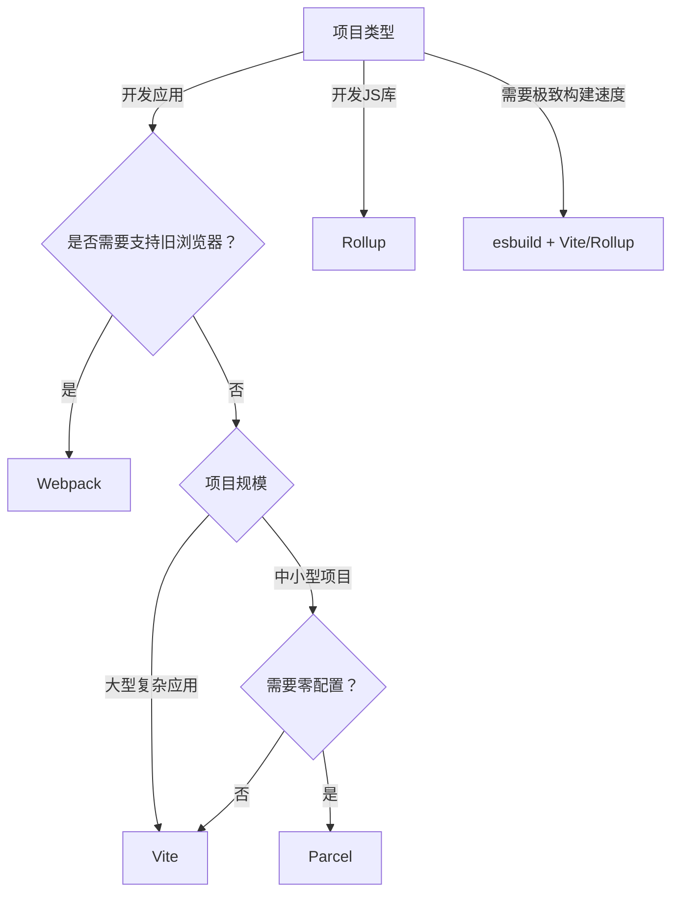

以下是对主流前端模块打包工具（Module Bundler）的深度对比分析，涵盖核心特性、适用场景及选型建议，帮助开发者根据项目需求做出理性选择：

---

### 核心对比维度

| **工具**   | **核心定位**                | **开发体验**       | **生产构建**       | **配置复杂度** | **生态成熟度** | **最佳适用场景**               |
|------------|----------------------------|--------------------|--------------------|----------------|----------------|------------------------------|
| **Webpack** | **全能型应用打包器**        | 中等（HMR较慢）    | 强（优化全面）     | ⭐⭐⭐⭐⭐（高）    | ⭐⭐⭐⭐⭐（最成熟）| 大型复杂应用、遗留项目迁移     |
| **Vite**    | **下一代开发体验引擎**      | ⭐⭐⭐⭐⭐（极速HMR） | 优秀（依赖预构建） | ⭐⭐（低）       | ⭐⭐⭐⭐（快速增长）| 现代框架应用（React/Vue/Svelte）|
| **Rollup**  | **库打包专家**             | 弱（无原生HMR）    | ⭐⭐⭐⭐⭐（最精简）  | ⭐⭐⭐（中）      | ⭐⭐⭐（专注库生态）| JS库/框架、追求极致Tree-shaking |
| **Parcel**  | **零配置应用打包器**        | ⭐⭐⭐⭐（快速）     | 良好（自动优化）   | ⭐（极低）      | ⭐⭐⭐（中等）    | 快速原型、中小型项目           |
| **esbuild** | **极速构建引擎（非完整Bundler）** | -              | ⚡️**最快**（Go编写）| ⭐⭐（需配合其他工具）| ⭐⭐（插件较少） | 作为底层引擎（Vite依赖它）      |

---

### 深度特性解析
#### 1. Webpack (v5+)
- **核心优势**  
  - **万能插件系统**：`loader` 处理非JS资源（CSS/图片），`plugin` 深度定制流程
  - **代码分割**：`splitChunks` 智能拆包，`import()` 动态导入
  - **生产级优化**：Tree-shaking（ESM）、Scope Hoisting、缓存策略
- **痛点**  
  - 配置复杂（平均配置文件 > 200 行）
  - 大型项目冷启动慢（依赖图构建耗时）
  - HMR 在项目 > 10k 模块时延迟明显
- **典型场景**  
  > 企业级应用（如电商平台）、需要兼容旧版浏览器（IE11）、混合模块系统（CommonJS + ESM）

#### 2. Vite (v4+)
- **革命性设计**  
  - **开发模式**：基于浏览器原生 ES Module，**无打包热更新**（HMR 延迟 < 50ms）
  - **生产构建**：底层使用 Rollup（默认）或 esbuild（快速预构建依赖）
  - **框架无关**：官方支持 Vue/React/Svelte/Preact
- **关键优势**  
  - 秒级启动（项目越大优势越明显）
  - 零配置支持 TS/JSX/CSS 预处理
  - 按需编译：只转换当前屏幕所需模块
- **局限**  
  - 依赖现代浏览器（ESM 支持），旧项目迁移需调整
  - 复杂代码分割需手动配置
- **数据佐证**  
  > 10k 模块项目：Webpack 冷启动 30s → Vite **< 1s**；HMR 更新速度提升 10-100 倍

#### 3. Rollup
- **库打包王者**  
  - **输出纯净**：生成更接近手写代码的 ESM/CJS，无运行时依赖
  - **Tree-shaking 顶级**：基于 ES6 语法的静态分析（比 Webpack 更彻底）
  - **插件机制**：`rollup-plugin-xxx` 专注库构建（如 `babel`、`terser`）
- **致命短板**  
  - 无原生开发服务器（需配合 `@rollup/plugin-serve`）
  - 不适合应用级开发（缺乏代码分割、资源处理能力弱）
- **为何库作者首选**？  
  > React/Vue 3/Angular 等框架均用 Rollup 打包 → **更小的包体积**（如 Vue 3 比 Webpack 打包小 20%）

#### 4. Parcel (v2)
- **零配置哲学**  
  - 自动处理 CSS/图片/字体（无需配置 PostCSS/Babel）
  - 内置代码压缩、CSS 模块、浏览器兼容性
  - 支持多页面应用（`<link rel="modulepreload">`）
- **适用边界**  
  - 中小项目（>50k 行代码时性能下降）
  - 不适合深度定制（隐藏配置导致调试困难）
- **典型用户**  
  > 快速搭建 Landing Page、内部管理工具、学习项目

#### 5. esbuild
- **性能怪兽**  
  - **Go 语言编写**：比 JS 工具快 10-100 倍（100k 行代码压缩 < 0.5s）
  - **基础功能**：JS/TS 转译、压缩、打包
- **为何不是独立 Bundler**？  
  - 无代码分割、HMR、CSS 处理等高级功能
  - **实际定位**：作为底层引擎（Vite/Parcel 2 用它加速依赖预构建）

---

### 选型决策树

---

### 关键结论
1. **新项目首选 Vite**  
   - 除非必须兼容 IE11，否则 Vite 凭借**开发体验革命**成为现代应用首选（Vue 3/React 18 官方推荐）
   
2. **库开发者只用 Rollup**  
   - Webpack 打包的库会引入冗余代码（如 `__webpack_require__`），Rollup 输出更干净

3. **Webpack 仍是企业级守门人**  
   - 当项目存在大量非标准化资源（如 WebAssembly/自定义语言）、复杂代码分割逻辑时，Webpack 无可替代

4. **Parcel 适合“懒人”场景**  
   - 适合快速验证想法，但复杂项目终将面临配置黑盒问题

5. **esbuild 是未来引擎**  
   - 所有新工具（Vite/Snowpack/WMR）均集成 esbuild 加速构建，**学习成本低但功能有限**

---

### 趋势洞察
- **HMR 赛道**：Vite 的原生 ESM 方案已成事实标准（Webpack 5 新增 `experiments.lto` 优化 HMR）
- **打包消亡论**：随着 HTTP/3 和浏览器 ESM 支持完善，**生产环境可能不再需要 Bundler**（仅开发时按需编译）
- **Rust 势头**：`Rspack`（Webpack 兼容版）、`Bun` 等 Rust 工具正在挑战 esbuild 性能极限

> **建议**：2023 年起新项目优先尝试 **Vite + Rollup（生产构建）** 组合，用 `vite build --mode production` 生成 Rollup 优化的产物，兼顾开发体验与生产质量。Webpack 仅用于维护遗留项目或特殊需求场景。