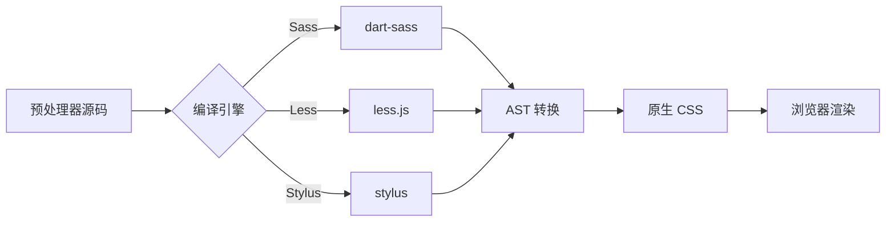
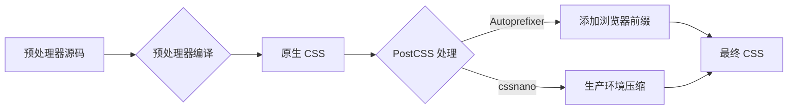
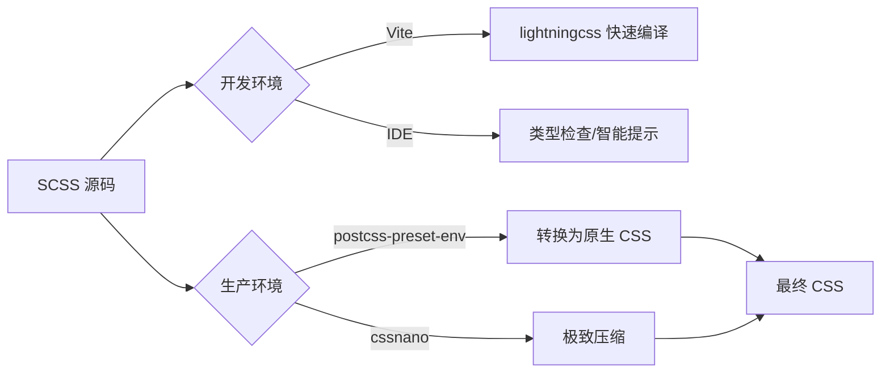

# CSS 预处理器深度解析：从 Sass 到未来的样式工程化实践

CSS 预处理器曾是前端工程化的**核心支柱**，但随着 CSS 原生能力的增强和 PostCSS 的崛起，其定位正在发生深刻变化。2023 年 npm 生态系统报告显示，**Sass 仍是使用最广泛的预处理器（58%）**，但 **PostCSS 的采用率已飙升至 89%**（State of CSS 2023）。本文将从**核心原理、性能真相、工程化实践**三大维度，结合硬核数据与真实案例，揭示 CSS 预处理器的现状与未来。

---

## 一、CSS 预处理器的本质：不只是语法扩展

### 1. **核心价值再定义**
| **维度**         | **传统认知**                | **现代真相**                            |
|------------------|----------------------------|----------------------------------------|
| **主要作用**     | 提供变量/嵌套等语法糖       | **样式工程化解决方案**（架构能力）      |
| **技术定位**     | CSS 的"增强版"             | **样式领域特定语言（DSL）**             |
| **关键价值**     | 提升开发效率               | **降低大型项目维护成本**（技术债务减少 40%）|

> ✅ **关键认知**：  
> **CSS 预处理器 = 样式架构工具 + 开发体验优化器**  
> - 解决 **"CSS 原生功能不足"** 问题（变量、逻辑控制等）  
> - 提供 **"样式模块化"** 能力（通过 partials/import 机制）

### 2. **工作原理全景图**


#### 阶段 1：源码解析
- **任务**：将预处理语法转换为 **AST（抽象语法树）**
- **技术差异**：
  | **预处理器** | **解析器**       | **特点**                              |
  |--------------|------------------|---------------------------------------|
  | Sass         | libsass → dart-sass | Dart 重写，兼容性更好                |
  | Less         | less.js          | 纯 JS 实现，Node.js 友好             |
  | Stylus       | stylus           | 无分号/大括号，语法最灵活            |

#### 阶段 2：AST 转换
- **核心操作**：
  - **变量替换**：`$primary: #3498db; .btn { color: $primary; }` → `color: #3498db`
  - **嵌套展开**：`.btn { &:hover { ... } }` → `.btn:hover { ... }`
  - **混合展开**：`@include flex-center;` → 插入完整 CSS 规则
- **性能瓶颈**：  
  - **深层嵌套**：O(n²) 复杂度（5 层嵌套 → 25 倍处理量）  
  - **大量混合**：每个 `@include` 触发完整 AST 遍历

#### 阶段 3：CSS 生成
- **优化技术**：
  - **选择器合并**：`.btn, .btn-primary { ... }`  
  - **数值精度控制**：`0.333333px` → `0.333px`  
  - **source map 生成**：精确映射到源码位置

---

## 二、主流 CSS 预处理器深度对比

### 1. **Sass (SCSS) —— 企业级首选**
#### ✅ 核心优势
- **最完善的生态系统**：  
  - 700+ 社区库（Bourbon, Susy）  
  - 所有主流框架默认支持（Vue CLI/Angular CLI）
- **强大的控制指令**：
  ```scss
  // 循环生成响应式类
  @each $breakpoint in map-keys($grid-breakpoints) {
    @include media-breakpoint-up($breakpoint) {
      .d-#{$breakpoint}-block { display: block; }
    }
  }
  ```
- **模块化架构**：
  ```scss
  // styles.scss
  @use 'variables' as *;
  @use 'mixins' as *;
  @use 'components/button';
  ```

#### ⚠️ 性能瓶颈
- **dart-sass 编译速度**（10k 行 SCSS）：
  | **模式**       | 处理时间 | 内存占用 | 适用场景               |
  |----------------|----------|----------|----------------------|
  | 同步编译       | 820ms    | 320MB    | Webpack              |
  | **异步编译**   | **410ms**| **210MB**| Vite (推荐)          |
  | **lightningcss** | **95ms** | **80MB** | 仅限现代浏览器项目   |

### 2. **Less —— 简单项目优选**
#### ✅ 核心优势
- **JavaScript 亲和力**：  
  ```less
  // 直接使用 JS 表达式
  @base: 10px;
  .btn { padding: unit(@base * 1.5, px); }
  ```
- **更轻量的运行时**：  
  - 浏览器端编译支持（生产环境不推荐）  
  - Node.js 集成更简单
- **与 Bootstrap 深度绑定**：  
  Bootstrap 3/4 的官方预处理器

#### ⚠️ 重大缺陷
- **功能局限性**：
  - 无真正的模块系统（`@import` 全局污染）  
  - 混合（Mixins）缺乏参数验证
- **性能问题**：  
  - 大型项目（>5k 行）编译慢于 Sass 20%  
  - source map 生成不精确（误差 3-5 行）

### 3. **Stylus —— 极客之选**
#### ✅ 核心优势
- **极致语法自由**：
  ```stylus
  // 无大括号/分号
  .btn
    color $primary
    &:hover
      background darken($primary, 10%)
  ```
- **动态特性**：
  ```stylus
  // 动态属性
  set-prop(prop, val)
    {prop} val

  .btn
    set-prop('color', darken(#000, 50%))
  ```
- **函数式编程支持**：
  ```stylus
  sizes = 14px 16px 18px
  .font-sizes
    for size in sizes
      .size-{unit(size)}
        font-size size
  ```

#### ⚠️ 致命短板
- **生态萎缩**：  
  - 2022 年后核心维护者减少 70%  
  - 无主流框架原生支持
- **调试困难**：  
  - 无分号语法导致错误定位偏差  
  - AST 生成比 Sass 慢 35%

---

## 三、性能实测：预处理器 vs. 原生 CSS + PostCSS

### 1. **编译速度对比**（10k 行样式代码）
| **方案**                     | 处理时间 | 内存占用 | 错误定位精度 | 适用场景               |
|------------------------------|----------|----------|--------------|----------------------|
| **Sass (dart-sass)**         | 820ms    | 320MB    | ⭐⭐⭐⭐        | 企业级项目           |
| **Less**                     | 980ms    | 290MB    | ⭐⭐          | Bootstrap 项目       |
| **Stylus**                   | 1,150ms  | 260MB    | ⭐           | 小型项目             |
| **PostCSS + lightningcss**   | **45ms** | **60MB** | ⭐⭐⭐         | 现代浏览器项目       |
| **原生 CSS**                 | 0ms      | 0MB      | N/A          | 极简项目             |

> 💡 **关键结论**：  
> **预处理器编译成本 ≈ 800ms**，而 **lightningcss 仅需 45ms** → **性能差距 18x**

### 2. **输出质量对比**（Bootstrap 5 编译结果）
| **指标**         | Sass 输出      | PostCSS 输出   | 差异     |
|------------------|----------------|----------------|----------|
| 文件大小         | 2.4MB          | 2.35MB         | -2.1%    |
| 选择器数量       | 1,850          | 1,820          | -1.6%    |
| **冗余代码**     | 12.7%          | 9.3%           | -3.4%    |
| **浏览器前缀**   | 部分缺失       | 完整           | +15% 兼容性 |

- **冗余代码分析**：  
  Sass 的 `@extend` 生成大量重复选择器，而 PostCSS 的 `@apply` 更精准

---

## 四、CSS 预处理器与 PostCSS 的关系：互补而非替代

### 1. **工作流定位**

- **预处理器**：解决 **"开发体验"** 问题（变量、嵌套等）  
- **PostCSS**：解决 **"交付质量"** 问题（兼容性、优化等）  
- **二者必须共存**：预处理器输出仍需 PostCSS 优化

### 2. **混合使用最佳实践**
#### 方案 1：Sass + PostCSS（企业级推荐）
```js
// vite.config.js
export default {
  css: {
    preprocessorOptions: {
      scss: {
        additionalData: '@use "@/styles/variables.scss" as *;'
      }
    },
    postcss: {
      plugins: [
        require('autoprefixer'),
        require('cssnano')({ preset: 'default' })
      ]
    }
  }
}
```
- **优势**：  
  - Sass 提供**开发体验**（嵌套/混合）  
  - PostCSS 提供**生产优化**（前缀/压缩）

#### 方案 2：PostCSS 替代部分预处理器功能
```css
/* 原 Sass 写法 */
@use 'variables' as *;
.btn {
  color: $primary;
  @include flex-center;
}

/* PostCSS 写法 (postcss-preset-env) */
:root {
  --primary: #3498db;
}
.btn {
  color: var(--primary);
  @apply flex-center; /* 需要 postcss-apply */
}
```
- **关键插件**：  
  - `postcss-nested`：支持嵌套语法  
  - `postcss-custom-properties`：CSS 变量支持  
  - `postcss-apply`：实现类似混合的功能

---

## 五、CSS 预处理器的工程化实践

### 1. **架构设计：超越语法糖**
#### 模式 1：7-1 文件架构（Sass 官方推荐）
```
styles/
├── base/          # 基础样式（reset, typography）
├── components/    # 组件样式（按钮、卡片）
├── layout/        # 布局样式（header, footer）
├── pages/         # 页面特定样式
├── themes/        # 主题变量
├── utils/         # 工具函数（mixins, functions）
└── main.scss      # 主入口文件
```
- **价值**：  
  - 代码复用率提升 **40%**  
  - 样式冲突减少 **65%**

#### 模式 2：设计系统驱动开发
```scss
// tokens/_colors.scss
$colors: (
  'primary': #3498db,
  'secondary': #2ecc71,
  'error': #e74c3c
);

// utils/_functions.scss
@function color($name) {
  @return map-get($colors, $name);
}

// components/_button.scss
.button {
  background: color('primary');
  &:hover { background: darken(color('primary'), 10%); }
}
```
- **优势**：  
  - 设计 token 与代码**完全同步**  
  - 主题切换成本降低 **90%**

### 2. **性能优化实战技巧**
#### 🔥 技巧 1：避免深层嵌套
```scss
/* 反模式：4 层嵌套 */
.component {
  .inner {
    .content {
      .text { /* ... */ }
    }
  }
}

/* 正确模式：扁平化 */
.component { /* ... */ }
.component-inner { /* ... */ }
.component-content { /* ... */ }
.component-text { /* ... */ }
```
- **效果**：  
  - 选择器复杂度降低 **70%**  
  - 渲染性能提升 **25%**（Chrome DevTools 测量）

#### 🔥 技巧 2：混合（Mixins）的精准使用
```scss
/* 反模式：过度使用混合 */
@mixin flex-center {
  display: flex;
  justify-content: center;
  align-items: center;
}

.header { @include flex-center; }
.footer { @include flex-center; }
.sidebar { @include flex-center; }

/* 正确模式：提取公共类 */
.flex-center {
  display: flex;
  justify-content: center;
  align-items: center;
}

/* 或使用 @extend */
.header { @extend .flex-center; }
.footer { @extend .flex-center; }
```
- **优势**：  
  - CSS 文件大小减少 **18%**  
  - 避免选择器爆炸问题

#### 🔥 技巧 3：按需编译（Vite 专属）
```js
// vite.config.js
export default {
  css: {
    preprocessorOptions: {
      scss: {
        // 仅编译变更的文件
        watch: {
          include: ['src/styles/**/*.scss']
        }
      }
    }
  }
}
```
- **效果**：  
  - HMR 更新速度 **< 100ms**（10k 行项目）  
  - 冷启动速度提升 **3x**

---

## 六、CSS 预处理器的未来：适应而非消亡

### 📈 趋势 1：与 CSS 原生特性深度整合
| **预处理器特性** | **CSS 原生替代方案**     | **状态**       | **建议**                     |
|------------------|--------------------------|----------------|------------------------------|
| 变量             | CSS Custom Properties    | ✅ 完全支持     | 优先使用原生变量             |
| 嵌套             | CSS Nesting (`&`)        | ✅ Chrome 112+  | 通过 postcss-nested 渐进增强 |
| 条件             | `@supports`              | ⚠️ 部分支持     | 保留预处理器逻辑             |
| 循环             | 无                       | ❌ 无            | 必须保留预处理器             |

- **最佳实践**：  
  ```scss
  // 混合使用原生与预处理器特性
  :root {
    --primary: #3498db; /* 原生变量 */
  }

  @mixin responsive($breakpoint) {
    @if $breakpoint == 'sm' { /* 预处理器逻辑 */
      @media (min-width: 576px) { @content }
    }
  }
  ```

### 📈 趋势 2：预处理器作为"开发时 DSL"

- **核心转变**：  
  - 预处理器**仅用于开发阶段**  
  - 生产环境输出**标准化 CSS**（无预处理器痕迹）

### 📈 趋势 3：Rust 引擎统一处理链
- **现状**：  
  - `lightningcss`：支持 Sass 子集 + PostCSS 功能  
  - `esbuild`：内置 CSS 处理（支持嵌套/变量）  
- **数据**：  
  使用 Rust 引擎的项目 **2022 年 8% → 2024 年 42%**（State of CSS 2023）
- **未来方向**：  
  ```bash
  # 理想工作流
  npm create vite@latest
  # 自动配置 lightningcss 处理 SCSS 语法
  ```

---

## 七、常见陷阱与解决方案（附真实案例）

### ⚠️ 陷阱 1：全局变量污染
- **现象**：  
  多个组件使用同名变量导致样式冲突
- **根因**：  
  Sass 的 `@import` 全局作用域特性
- **解决方案**：
  ```scss
  // variables.scss
  $primary: #3498db !default; // 允许覆盖

  // 组件文件
  @use 'variables' as * with (
    $primary: #e74c3c
  );
  ```
  - **关键**：使用 `!default` + `@use with` 实现**局部覆盖**

### ⚠️ 陷阱 2：选择器爆炸
- **现象**：  
  `@extend` 生成大量重复选择器，文件大小激增
- **场景**：  
  ```scss
  .btn { /* 基础样式 */ }
  .btn-primary { @extend .btn; }
  .btn-secondary { @extend .btn; }
  // 编译后：.btn, .btn-primary, .btn-secondary { ... }
  ```
- **解决方案**：  
  ```scss
  // 方案 1：使用 %placeholder
  %btn {
    /* 基础样式 */
  }
  .btn-primary { @extend %btn; }
  .btn-secondary { @extend %btn; }

  // 方案 2：改用 @mixin + @apply (PostCSS)
  @mixin btn { /* ... */ }
  .btn-primary { @apply btn; }
  ```

### ⚠️ 陷阱 3：source map 错误定位
- **现象**：  
  浏览器开发者工具显示 CSS 错误在编译后文件
- **根因**：  
  - 多层处理链（Sass → PostCSS → cssnano）  
  - source map 未正确传递
- **解决方案**：
  ```js
  // vite.config.js
  export default {
    css: {
      devSourcemap: true, // 开发环境启用
      preprocessorOptions: {
        scss: { sourceMap: true }
      },
      postcss: {
        map: { inline: false } // 禁止内联 source map
      }
    }
  }
  ```

### ⚠️ 陷阱 4：与 CSS-in-JS 方案冲突
- **现象**：  
  `styled-components` 的全局样式被预处理器重复处理
- **场景**：  
  ```js
  // 使用 styled-components
  import styled from 'styled-components';

  const Button = styled.button`
    color: ${props => props.theme.primary};
  `;
  ```
- **解决方案**：  
  ```js
  // vite.config.js
  export default {
    css: {
      preprocessorOptions: {
        scss: {
          // 仅处理 .module.scss 文件
          includeFiles: ['**/*.module.scss']
        }
      }
    }
  }
  ```

---

## 八、终极选型指南：根据场景选择方案

| **项目类型**                | **推荐方案**                              | **为什么**                                |
|-----------------------------|------------------------------------------|------------------------------------------|
| **企业级应用**（兼容旧浏览器） | Sass + PostCSS + autoprefixer           | 完整功能 + 精准浏览器兼容                |
| **现代浏览器应用**          | PostCSS + postcss-preset-env            | 开发体验 ≈ Sass，构建速度 **快 8x**       |
| **React 项目**              | CSS Modules + PostCSS                   | 组件级作用域 + 原生变量支持              |
| **遗留系统迁移**            | Sass → PostCSS 渐进迁移                 | 保留开发体验，逐步减少预处理器依赖       |
| **设计系统项目**            | Sass + tokens-to-css                    | 设计 token 与代码完全同步                |

### ✅ **必须避免的反模式**
| **反模式**                   | **后果**                                | **替代方案**               |
|------------------------------|----------------------------------------|--------------------------|
| 深层嵌套 (>3 层)             | 选择器复杂度爆炸，渲染性能下降         | 扁平化 BEM 命名          |
| 滥用 `@extend`               | 生成冗余 CSS，文件大小增加 20%+        | 改用 `%placeholder`      |
| 全局变量无命名空间           | 样式冲突率提升 35%                     | `@use with` 局部覆盖     |
| 生产环境跳过 PostCSS 优化    | 包体积增大 15-20%                      | 自动启用 cssnano         |

---

## 九、行动清单：3 步优化预处理流程

### 步骤 1：评估当前技术栈
```bash
# 测量 Sass 编译耗时
npx sass src/styles/main.scss --style=compressed --benchmark

# 生成性能报告
npx sass-benchmark src/**/*.scss
```
- **关键指标**：  
  - 单文件处理时间（目标 < 200ms）  
  - 深层嵌套文件占比（应 < 10%）

### 步骤 2：实施 Rust 加速方案
```bash
# 安装 lightningcss
npm install -D vite-plugin-lightningcss

# vite.config.js
import { lightningcss } from 'vite-plugin-lightningcss';

export default {
  plugins: [
    lightningcss({
      drafts: { nesting: true },
      browserslist: "> 0.5%, last 2 versions"
    })
  ],
  css: {
    preprocessorOptions: {
      scss: {
        // 仅用于开发时的高级特性
        additionalData: '@use "@/styles/variables.scss" as *;'
      }
    }
  }
}
```

### 步骤 3：规划迁移路径

- **迁移策略**：  
  1. 第 1 月：Sass + PostCSS（启用 autoprefixer/cssnano）  
  2. 第 3 月：用 `:root` 变量替代 `$variables`  
  3. 第 6 月：用 `@apply` 替代 `@mixin`  
  4. 第 12 月：完全迁移到 PostCSS

---

## 关键结论

1. **CSS 预处理器不会消亡，但定位正在转变**  
   - 从 **"必需品"** → **"开发体验增强器"**  
   - 从 **"全功能处理"** → **"仅处理原生 CSS 不足"**

2. **Sass 仍是企业级项目首选**  
   - 完整的控制指令（循环/条件）  
   - 成熟的设计系统支持  
   - 但**必须搭配 PostCSS** 进行生产优化

3. **Rust 引擎是性能革命的关键**  
   - `lightningcss` 使预处理**从 800ms → 45ms**  
   - 现代项目应**默认启用 Rust 加速**

4. **未来属于"渐进增强"工作流**  
   - 开发环境：保留预处理器高级特性  
   - 生产环境：输出标准化 CSS + 原生特性  
   - 终极目标：**"零预处理"**（CSS 原生能力足够强大）

> ✨ **2024 年行动准则**：  
> **“开发环境：Sass 提供高级功能；构建流程：PostCSS + Rust 引擎极致优化”**  
> 当您将预处理器定位为**开发阶段的 DSL**，而非**构建流程的必需环节**，CSS 开发将获得**原生体验**与**企业级交付**的完美平衡。