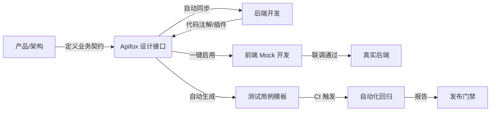

参考：[22分钟学会Apifox！2024年的Apifox有什么全新功能？](https://www.bilibili.com/video/BV1Jc41147xC/?share_source=copy_web&vd_source=9c1e19a73fa7bd23bb37aa8d7467d862)


Apifox 是 2020 年后迅速崛起的 **一体化 API 协作平台**，以“API 文档 + Mock + 调试 + 自动化测试 + 代码生成”为核心能力，彻底打破传统工具链（Swagger + Postman + YApi + 自研脚本）割裂的痛点。至 2026 年，它已成为中大型研发团队、政企数字化项目、微服务架构的 **API 基础设施首选**。

以下从产品定位、核心架构、工作流、集成能力到工程实践进行系统拆解。

---
## 一、产品定位与核心理念

| 维度       | 说明                                                          |
| -------- | ----------------------------------------------------------- |
| **产品定位** | API 全生命周期管理平台（Design → Doc → Mock → Debug → Test → Deploy）  |
| **核心理念** | `API First` / 契约驱动 / 单一数据源（Single Source of Truth） / 研发协同提效 |
| **目标用户** | 后端开发、前端开发、测试工程师、产品经理、架构师、DevOps                             |
| **部署形态** | 云端 SaaS（公有云/专属云） / 私有化部署（Docker/K8s） / 混合模式                 |

> 💡 **关键认知**：Apifox 不是“更好的 Postman”或“可视化的 Swagger”，而是**以 API 契约为中心的团队协同中枢**。所有动作（文档、Mock、测试、代码）均围绕同一份 OpenAPI 规范衍生，杜绝多端数据不一致。

---
## 二、核心功能

### 1. API 设计与文档引擎
- **可视化 + 代码双模**：支持表单化编辑与 OpenAPI 3.0/YAML 双向同步。
- **智能规范校验**：内置 RESTful / GraphQL / RPC 最佳实践检查（命名规范、状态码使用、分页结构、必填字段）。
- **版本与变更管理**：接口 Diff 对比、变更自动通知（钉钉/企微/飞书/邮件）、废弃接口灰度下线。

### 2. 智能 Mock 引擎
- **规则驱动**：基于 JSON Schema 自动生成数据，支持 `@email`、`@uuid`、`@date`、正则、数组长度范围、条件分支。
- **动态响应**：支持请求头/参数/Body 匹配路由，可模拟 `401`/`500`/超时/网络抖动。
- **AI 增强（2025-2026）**：自然语言描述接口 → 自动生成 Schema 与 Mock 规则；智能填充业务语义数据（如“生成 10 条电商订单，含物流状态流转”）。
- **数据库级 Mock**：支持多接口联动状态保持（如 `POST /users` 后 `GET /users` 自动返回新增数据）。

### 3. API 调试与协作
- **环境隔离**：Dev / Test / UAT / Prod 环境变量一键切换，支持全局/项目/用例级变量。
- **团队共享**：权限分级（管理员/编辑/只读/访客）、接口评论 @ 提及、操作审计日志。
- **请求历史与集合**：支持文件夹分组、标签、导入导出（Postman/Swagger/cURL）。

### 4. 自动化测试中心
- **用例编排**：支持前置脚本、后置断言、数据提取、循环/条件分支。
- **断言引擎**：JSON Path、正则、状态码、响应时间、Schema 校验、自定义 JS 脚本。
- **CI/CD 集成**：提供 CLI (`apifox-cli`)、Webhook、REST API，可接入 Jenkins/GitLab CI/GitHub Actions，失败自动阻断流水线。
- **测试报告**：覆盖率统计、失败用例溯源、历史趋势对比、PDF/HTML 导出。

### 5. 代码与 SDK 生成
- 支持 `TypeScript/JavaScript/Java/Go/Python/C#/PHP` 等 20+ 语言。
- 可定制模板（如符合团队规范的 Axios 封装、Spring Cloud OpenFeign 注解）。
- 一键下载或 CI 自动提交至代码仓库。

---
## 三、与其他工具对比

| 能力维度        | Apifox             | Swagger/OpenAPI | Postman          | YApi（开源）     |
| ----------- | ------------------ | --------------- | ---------------- | ------------ |
| **定位**      | API 全生命周期协同平台      | 接口规范与文档生成工具     | 接口调试与测试客户端       | 轻量级 API 管理后台 |
| **数据一致性**   | ✅ 单一契约源，全端同步       | ❌ 文档与实现易脱节      | ❌ 集合与文档独立维护      | ❌ 插件生态弱，易碎片化 |
| **Mock 能力** | ✅ 规则+AI+状态联动+延迟    | ❌ 仅静态示例         | ⚠️ 基础模板，无联动      | ⚠️ 简单语法，已停更  |
| **自动化测试**   | ✅ 编排+CI集成+断言库      | ❌ 无             | ✅ 强，但脱离文档        | ⚠️ 基础，维护停滞   |
| **团队协作**    | ✅ 权限/通知/版本/审计      | ❌ 依赖 Git        | ⚠️ Workspace 订阅制 | ⚠️ 基础角色，无审计  |
| **企业合规**    | ✅ 私有化/SAML/LDAP/等保 | ❌ 无             | ⚠️ 企业版昂贵         | ❌ 开源无安全审计    |

> 📌 **结论**：Apifox 用“一体化”换取“工具切换成本”，适合追求研发效能与规范落地的团队；Postman 仍适合纯调试/跨境协作场景；Swagger 是底层规范，非协作平台。

---
## 四、典型前后端协同工作流



**关键协同节点**：
1. **契约先行**：后端未写代码前，前端即可通过 Apifox Mock URL 启动开发。
2. **变更通知**：接口字段增删改自动推送至相关成员，避免“联调才发现报错”。
3. **测试左移**：开发阶段同步编写自动化用例，CI 流水线自动执行，拦截坏代码。
4. **环境隔离**：Mock 环境、测试环境、生产环境 URL 独立，切换零成本。

---
## 五、技术架构与工程集成

### 1. 架构分层
```
[客户端/Web] → [API 网关] → [业务微服务]
       ↓
[Apifox 核心引擎]
 ├─ 契约解析器 (OpenAPI 3.0 / GraphQL SDL)
 ├─ Mock 执行器 (规则引擎 + AI 推理 + 状态机)
 ├─ 测试调度器 (并发控制 + 数据工厂 + 断言池)
 └─ 集成网关 (Webhook / CLI / REST API / IDE 插件)
```

### 2. 主流集成方式
| 集成对象        | 方式                                                                 |
|-----------------|----------------------------------------------------------------------|
| **IDE**         | VSCode / IntelliJ 插件：同步项目、查看文档、一键运行用例、生成代码    |
| **代码仓库**    | Java (Spring Boot)、Node.js、Python 注解扫描插件，自动反向生成文档    |
| **CI/CD**       | `apifox-cli run --env=test --reporter=junit` 接入流水线               |
| **监控/链路**   | 与 OpenTelemetry / SkyWalking 打通，对比 Mock 响应与真实耗时差异      |
| **单点登录**    | SAML 2.0 / OAuth2 / LDAP / 企业微信 / 飞书 / 钉钉                     |

---
## 六、优势与局限性

### ✅ 核心优势
1. **降本增效**：1 个平台替代 4-5 个工具，学习成本低，协同效率提升 40%+。
2. **Mock 高保真**：状态联动、延迟注入、错误模拟、AI 语义生成，接近真实后端。
3. **测试工程化**：用例可版本化、可复用、可门禁拦截，契合 DevOps 理念。
4. **企业级安全**：私有化部署、数据脱敏、操作审计、等保三级合规、国产化适配。
5. **持续演进**：2024-2026 重点投入 AI 辅助、边缘 Mock 节点、低代码数据工厂。

### ⚠️ 局限性
1. **强依赖平台**：SaaS 断网或私有化宕机将阻塞 Mock/测试链路（需本地降级方案）。
2. **深度定制受限**：复杂业务 Mock（如加密验签、多租户路由）仍需手写中间件。
3. **免费版限制**：团队人数、请求配额、自动化用例数有限，中大型团队需商业授权。
4. **学习曲线**：从“零散工具”迁移至“契约驱动”需团队规范共识与初期投入。

---
## 七、2026 最佳实践与避坑指南

### 🛠 实施建议
1. **强制 API First**：禁止“先写代码后补文档”，所有接口必须先在 Apifox 定义。
2. **规范统一**：制定团队级《API 设计规范》（命名、状态码、分页、错误结构），利用平台校验拦截。
3. **Mock 分层**：
   - `开发期`：Apifox Mock URL（快速） + `MSW/Vite Plugin`（本地降级）
   - `测试期`：Apifox 自动化用例 + MSW 网络拦截
   - `预发期`：真实后端 + 流量回放
4. **CI 门禁**：PR/MR 合并前自动运行 Apifox 测试集，失败禁止合入。
5. **定期治理**：每月清理 `30天未调用` 接口，归档废弃版本，保持契约库精简。

### 🚫 常见坑点
| 坑点 | 根因 | 解法 |
|------|------|------|
| Mock 数据与真实响应结构不一致 | 文档未同步更新 | 开启 `接口变更自动通知` + `Schema 校验断言` |
| 自动化测试执行慢/不稳定 | 未做并发控制/依赖真实网络 | 使用 `数据工厂` + `环境隔离` + `超时重试策略` |
| 团队权限混乱/误删接口 | 未分级管控 | 配置 `角色权限模板` + `操作审计` + `回收站` |
| SaaS 延迟高影响体验 | 跨境访问/带宽瓶颈 | 切换至 `专属云` 或 `私有化部署` + `本地缓存代理` |

---
## 八、选型决策矩阵

| 团队特征          | 是否推荐 Apifox | 替代/补充方案                          |
| ------------- | ----------- | -------------------------------- |
| 个人开发者 / 极小团队  | ❌ 不推荐       | 静态 JSON + VSCode 插件 / 免费 Postman |
| 传统单体项目 / 文档驱动 | ⚠️ 按需       | Swagger + YApi（低成本过渡）            |
| 现代微服务 / 前后端分离 | ✅ 强烈推荐      | Apifox + MSW + CI/CD 集成          |
| 强合规 / 政企 / 金融 | ✅ 推荐（私有化）   | Apifox 私有化 + 等保加固 + 内网镜像         |
| 已有成熟自研 API 平台 | ❌ 不推荐       | 继续迭代自研，或引入 Apifox 仅做 Mock        |
| 测试驱动 / 自动化要求高 | ✅ 强烈推荐      | Apifox 测试中心 + Playwright/Cypress |

---
## 九、总结：Apifox 在现代研发流中的位置

Apifox 已从“接口管理工具”进化为 **API 契约驱动的研发中枢**。它的核心价值不在于功能多，而在于**用单一数据源消除信息熵**，让设计、开发、测试、运维围绕同一份契约高效协同。

🔹 **2026 年推荐架构组合**：
```
Apifox（契约定义 / Mock 分发 / 自动化测试 / 团队协同）
   ↓ OpenAPI 导出 / Webhook
MSW / Vite Plugin（本地高保真拦截 / HMR 开发）
   ↓ CLI / REST API
Jenkins / GitLab CI（自动化测试门禁 / 报告归档）
   ↓
真实后端 / 网关 / 微服务集群
```

> 💡 **最终建议**：若团队规模 ≥ 5 人、接口数量 ≥ 50、存在前后端并行开发或自动化测试需求，**Apifox 的 ROI 远高于零散工具拼接**。初期投入 1-2 周建立规范与集成流水线，中后期将显著降低联调成本、提升交付质量与团队协同透明度。