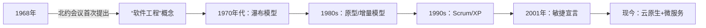

以下是对《到底应该怎样理解软件工程？》的核心内容提炼：

---

### **软件工程的本质定义**
> **公式化表达**：  
> **软件工程 = 过程 + 方法 + 工具**  
> - **过程**：分阶段生命周期（需求→设计→编码→测试→维护）  
> - **方法**：工程化原则（系统化、规范化、可量化）  
> - **工具**：支撑各阶段的实践技术（如原型工具、测试框架）  

> **终极目标**：  
> **经济高效地开发可靠软件**  
> （按时交付、成本可控、质量保障）

---

### **为何需要软件工程？**
**背景：软件危机（1960年代）**  

| **现象**         | **典型案例**                  | **后果**                     |
|------------------|-----------------------------|----------------------------|
| 质量低劣         | OS/360系统崩溃              | 损失数百万美元               |
| 进度失控         | 超大型项目延期              | 5000人年投入失败            |
| 致命缺陷         | Therac-25放疗机辐射过量     | **患者死亡**               |
| 成本飙升         | 团队膨胀但效率下降          | 资源浪费                   |

> 📌 **根源**：软件规模↑ + 复杂度↑ → 传统开发模式崩溃

---

### **软件工程的核心价值**
1. **对抗混沌**  
   - 终结“边写边改”模式（Code and Fix）  
   - 建立**有序开发流程**（参考建筑工程）  
2. **质量保障**  
   - 通过阶段化控制（设计先行+严格测试）降低风险  
3. **协作基础**  
   - 定义六大角色分工：  
     ```
     项目经理 → 产品经理 → 架构师  
         ↓          ↓          ↓  
     测试工程师 ← 开发工程师 ← 运维工程师  
     ```

---

### **软件工程演化史**
**里程碑式演进**：  

> **关键突破**：  
> - **瀑布模型**：首次确立软件生命周期（需求→设计→编码→测试）  
> - **敏捷革命**：应对需求多变（短周期迭代+用户反馈）  
> - **云与微服务**：解耦团队依赖，提升工程效率  

---

### **工程化 vs. 非工程化对比**
| **场景**       | **非工程化结果**          | **工程化方案**               |
|----------------|-------------------------|----------------------------|
| 开发社交软件   | 功能混乱，延期烂尾        | 分阶段推进+原型验证          |
| 开发操作系统   | OS/360式灾难             | 严格需求分析+模块化设计      |
| 医疗设备软件   | Therac-25致死事件         | 冗余测试+安全认证            |

---

### **行动启示**
1. **认知升级**：  
   - 所有软件项目本质是**创造工程**（非艺术创作）  
2. **实践路径**：  
   - **过程**：采用生命周期模型（哪怕简易版）  
   - **方法**：文档驱动 + 阶段性评审  
   - **工具**：引入自动化（测试/部署）  
3. **历史镜鉴**：  
   - 忽视工程原则 → 可能付出**生命/金钱代价**  

> ✨ **作者结语**：  
> **“软件工程是为解决‘软件危机’而生——它让代码从玩具变成工具，再进化成社会基础设施。”**