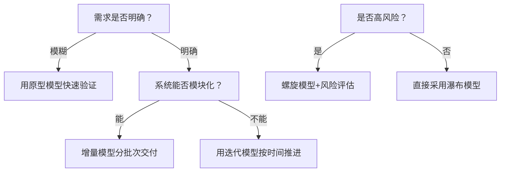

以下是对《瀑布模型之外，还有哪些开发模型？》的核心内容总结：

---

### 瀑布模型的局限性
> **两大硬伤**：  
> - ❌ **抗拒变更**：后期需求变动成本极高（如建筑拆墙重建）  
> - ❌ **周期过长**：客户仅首尾可见成果，风险滞后暴露  
> **衍生模型本质**：针对不同场景优化瀑布缺陷  

---

### 四大衍生模型对比

| **模型**     | **核心逻辑**            | **适用场景**            | **风险**            |
| ---------- | ------------------- | ------------------- | ----------------- |
| **快速原型模型** | 快速构建低保真原型 → 用户反馈迭代  | 需求模糊、易变的项目（如创新产品）   | 原型代码质量低（需抛弃/附加策略） |
| **增量模型**   | **按模块拆分**，分批次交付独立功能 | 需求清晰、模块化系统（如电商平台）   | 模块依赖难解耦           |
| **迭代模型**   | **按时间拆分**，每期交付完整子产品 | 高风险或需快速验证项目（如创业MVP） | 架构冗余需定期重构         |
| **螺旋模型**   | 迭代+风险评估，风险驱动继续/终止   | 高风险项目（如科研软件）        | 风险管理成本高           |

> 🏗️ **经典类比（盖房子）**：  
> - **原型模型**：先搭彩钢房确认需求 → 拆掉重建  
> - **增量模型**：先盖卫生间 → 再盖厨房  
> - **迭代模型**：茅草屋 → 木屋 → 别墅  
> - **螺旋模型**：每盖一层评估资金风险  

---

### 五类场景的模型选择指南

| **场景特征**      | **推荐模型**    | **关键操作**            |
| ------------- | ----------- | ------------------- |
| 外包项目（需阶段验收）   | **V模型**     | 每个阶段同步设计测试用例        |
| 高风险项目（可能中途撤资） | **螺旋模型**    | 每次交付后风险评估 → 决定继续/终止 |
| 山寨成熟产品（快速上线）  | **增量模型**    | 核心模块优先交付，并行开发非核心模块  |
| 需求极模糊的大项目     | **RUP模型**   | 四阶段：初始→细化（原型）→构造→交付 |
| 已上线产品持续迭代     | **迭代模型/敏捷** | 固定周期（如2周）发布新版本      |

---

### 模型组合实践建议
1. **需求混沌期**：  
   - **原型模型**快速验证 → 需求稳定后切换**增量/迭代**  
2. **长期维护产品**：  
   - **迭代模型**基础 + **敏捷实践**（如Scrum站会）  
3. **模块强耦合系统**：  
   - 放弃增量模型 → 改用**迭代模型**分层完善功能  

---

### 决策树：如何选择开发模型？

---

### 关键洞见
1. **模型本质是工具**：  
   - 不必拘泥于理论，可混合使用（如迭代中加入原型验证）  
2. **敏捷是框架而非模型**：  
   - Scrum/XP等通过短周期迭代实现敏捷目标  
3. **避免“为模型而模型”**：  
   - 小项目直接用瀑布/迭代，复杂项目才需RUP  

> 💡 **作者结语**：  
> **“没有最好的模型，只有最适配场景的解决方案——工程思维的核心是灵活运用方法论，而非被其束缚。”**