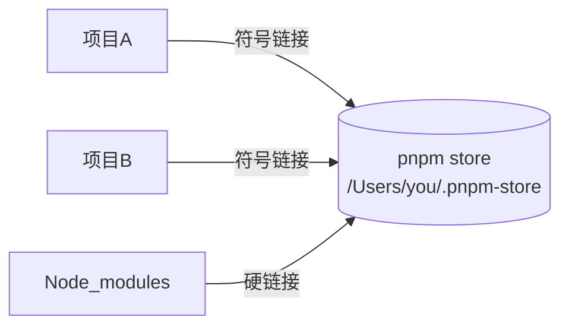

## pnpm 详解：快速、高效、节省磁盘空间的包管理工具

pnpm (Performant npm) 是新一代 Node.js 包管理器，以其**节省磁盘空间、安装速度快、严格依赖管理**三大特性著称。

### 🔑 核心优势

| 特性                | 说明                                                                 | 对比 npm/yarn          |
|---------------------|----------------------------------------------------------------------|------------------------|
| **硬链接 + 符号链接** | 所有依赖仅存储一份在全局 store，项目通过链接引用                     | ⚡️ 节省 60-70% 磁盘空间 |
| **严格 node_modules** | 依赖树扁平化但保持隔离性，避免幽灵依赖                               | 🛡️ 解决依赖冲突问题     |
| **并行安装**         | 依赖下载与解压并行执行                                               | ⏱️ 安装速度提升 2倍+    |
| **Monorepo 支持**    | 内置高效 workspace 管理                                              | 🏗️ 简化多包项目管理     |

### 🚀 基础使用

```bash
# 全局安装
npm install -g pnpm

# 初始化项目
pnpm init

# 安装依赖
pnpm add <package>      # 生产依赖
pnpm add -D <package>   # 开发依赖
pnpm add -g <package>   # 全局安装

# 运行命令
pnpm run <script>
pnpm dlx <command>      # 临时执行包（无需安装）
```

### 🧠 工作原理


1. **全局存储**：所有依赖包存储在 `~/.pnpm-store`
2. **硬链接**：项目 node_modules 中的文件链接到全局 store
3. **符号链接**：
   - 直接依赖：`node_modules/{package}` → 全局 store
   - 间接依赖：隐藏在 `.pnpm` 目录中，避免非法访问

### ⚙️ 常用配置（.npmrc）

```ini
# 修改全局存储位置
store-dir=/path/to/store

# 自动安装 peerDependencies
auto-install-peers=true

# 提升依赖到根目录（兼容部分工具）
public-hoist-pattern[]=*eslint*
public-hoist-pattern[]=*babel*
```

### 🔄 与 npm/yarn 命令对比

| 功能              | pnpm                   | npm/yarn              |
|-------------------|------------------------|-----------------------|
| 安装依赖          | `pnpm install`         | `npm i` / `yarn`      |
| 添加生产依赖      | `pnpm add <pkg>`       | `npm i <pkg>`        |
| 添加开发依赖      | `pnpm add -D <pkg>`    | `npm i -D <pkg>`     |
| 运行脚本          | `pnpm run <cmd>`       | `npm run <cmd>`      |
| 全局安装          | `pnpm add -g <pkg>`    | `npm i -g <pkg>`     |
| 更新依赖          | `pnpm update`          | `npm update`         |
| 删除依赖          | `pnpm remove <pkg>`    | `npm uninstall <pkg>`|

### 🛠️ 高级功能

1. **依赖检查与优化**
   ```bash
   pnpm list             # 查看依赖树
   pnpm why <pkg>        # 检查包被谁依赖
   pnpm outdated         # 检查过时依赖
   ```

2. **Patch 依赖包**
   ```bash
   pnpm patch <pkg>      # 创建临时编辑目录
   # 修改文件后...
   pnpm patch-commit <temp_dir>  # 生成补丁
   ```

3. **仅安装生产依赖**
   ```bash
   pnpm install --prod   # 忽略 devDependencies
   ```

4. **安全审计**
   ```bash
   pnpm audit           # 检查安全漏洞
   pnpm audit --fix     # 自动修复
   ```

### 💾 磁盘空间对比（实测数据）

| 项目         | npm 占用 | pnpm 占用 | 节省空间 |
|--------------|----------|-----------|----------|
| 中型项目     | 1.2 GB   | 450 MB    | 62.5%    |
| create-react-app | 200 MB   | 80 MB     | 60%      |
| Nuxt.js 项目 | 750 MB   | 280 MB    | 63%      |

### ⚠️ 注意事项

1. **符号链接兼容性**：
   - Windows 需要[开发者模式](https://learn.microsoft.com/en-us/windows/apps/get-started/enable-your-device-for-development)
   - Docker 构建需添加 `--frozen-lockfile` 避免符号链接问题

2. **清除缓存**：
   ```bash
   pnpm store prune  # 清理未使用的包
   ```

3. **混合使用警告**：
   - 避免在同一个项目中混用 npm/yarn/pnpm
   - 删除 `node_modules` 和 `package-lock.json`/`yarn.lock` 后再切换

### 📦 适用场景

- **磁盘空间有限**（笔记本电脑/CI 环境）
- **大型 Monorepo 项目**
- **需要严格依赖隔离**的库开发
- **频繁创建新项目**的开发环境

> 💡 **迁移建议**：  
> 现有项目迁移只需：  
> 1. 删除 `node_modules` 和 `lockfile`  
> 2. 运行 `pnpm install`  
> 3. 测试项目运行（尤其注意 peerDependencies）

[官方文档](https://pnpm.io/zh/) | [GitHub 仓库](https://github.com/pnpm/pnpm)