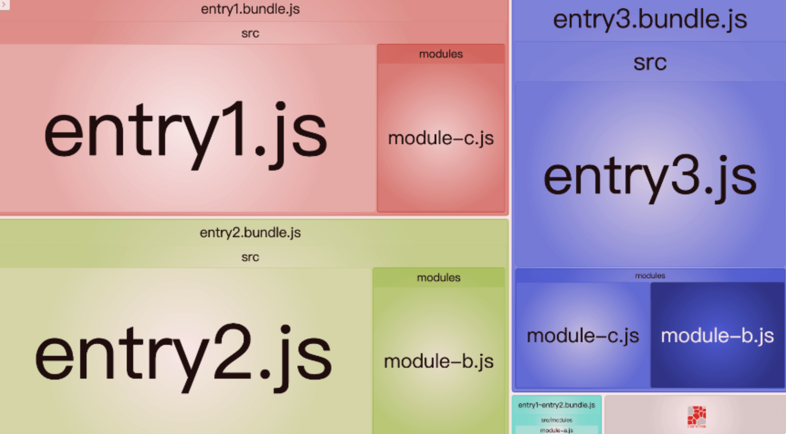
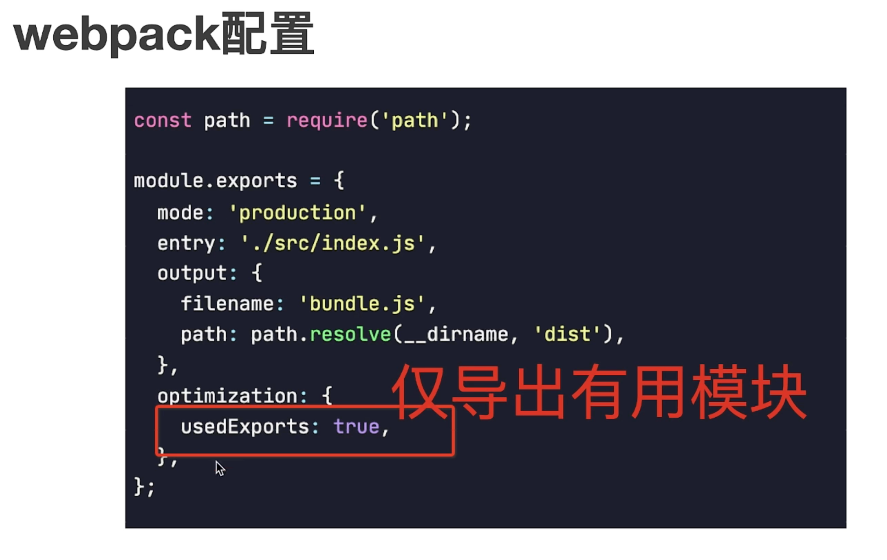

## 为什么/什么是构建工具？

问题：源代码是给人看的，但机器不懂。为了让机器看懂，我们需要工具来把源码编译/翻译成机器码。并且让工具自动化解决一些重复的机械式的任务。

前端构建工具是一种针对前端开发的构建工具，用于自动化前端项目的构建过程。

- 工程源代码--->运行时代码：源代码转换为可在浏览器中运行的 HTML、CSS 和 JavaScript 代码
- 压缩、丑化、合并、分割等优化功能
- 丰富的配置功能，支持插件扩展

## Webpack Loader

### 什么是/为什么 Loader

**Loader**直译为"加载器"。Webpack 将一切文件视为模块，但是 webpack 原生只能解析 JS/JSON 文件。如果想将其他文件也打包的话，就会用到`loader`。

所以，**Loader 的作用**，是让 webpack 拥有了加载和解析非 JavaScript 文件的能力。

### 常用的 loader

**有哪些常见的 Loader？他们是解决什么问题的？**

> 分类处理/加工知识点：按照一定的维度进行，会更具备系统性

#### 加载文件

- **[image-loader](https://github.com/tcoopman/image-webpack-loader)**：加载并且压缩图片文件。
- **[file-loader](https://github.com/webpack-contrib/file-loader)**：把文件输出到一个文件夹中，在代码中通过相对 URL 去引用输出的文件，在  [3-19 加载图片](https://webpack.wuhaolin.cn/3%E5%AE%9E%E6%88%98/3-19%E5%8A%A0%E8%BD%BD%E5%9B%BE%E7%89%87.html)、[3-20 加载 SVG](https://webpack.wuhaolin.cn/3%E5%AE%9E%E6%88%98/3-20%E5%8A%A0%E8%BD%BDSVG.html)、[4-9 CDN 加速](https://webpack.wuhaolin.cn/4%E4%BC%98%E5%8C%96/4-9CDN%E5%8A%A0%E9%80%9F.html)  中有介绍。
- **[url-loader](https://github.com/webpack-contrib/url-loader)**：和 file-loader 类似，但是能在文件很小的情况下以 base64 的方式把文件内容注入到代码中去，在  [3-19 加载图片](https://webpack.wuhaolin.cn/3%E5%AE%9E%E6%88%98/3-19%E5%8A%A0%E8%BD%BD%E5%9B%BE%E7%89%87.html)、[3-20 加载 SVG](https://webpack.wuhaolin.cn/3%E5%AE%9E%E6%88%98/3-20%E5%8A%A0%E8%BD%BDSVG.html)  中有介绍。
- **[raw-loader](https://github.com/webpack-contrib/raw-loader)**：把文本文件的内容加载到代码中去，在  [3-20 加载 SVG](https://webpack.wuhaolin.cn/3%E5%AE%9E%E6%88%98/3-20%E5%8A%A0%E8%BD%BDSVG.html)  中有介绍。
- **[source-map-loader](https://github.com/webpack-contrib/source-map-loader)**：加载额外的 Source Map 文件，以方便断点调试，在  [3-21 加载 Source Map](https://webpack.wuhaolin.cn/3%E5%AE%9E%E6%88%98/3-21%E5%8A%A0%E8%BD%BDSourceMap.html)  中有介绍。
- **[svg-inline-loader](https://github.com/webpack-contrib/svg-inline-loader)**：把压缩后的 SVG 内容注入到代码中，在  [3-20 加载 SVG](https://webpack.wuhaolin.cn/3%E5%AE%9E%E6%88%98/3-20%E5%8A%A0%E8%BD%BDSVG.html)  中有介绍。
- **[node-loader](https://github.com/webpack-contrib/node-loader)**：加载 Node.js 原生模块  `.node`  文件。
- **[json-loader](https://github.com/webpack-contrib/json-loader)**：加载 JSON 文件。
- **[yaml-loader](https://github.com/okonet/yaml-loader)**：加载 YAML 文件。

#### 编译模版

- **[pug-loader](https://github.com/pugjs/pug-loader)**：把 Pug 模版转换成 JavaScript 函数返回。
- **[handlebars-loader](https://github.com/pcardune/handlebars-loader)**：把 Handlebars 模版编译成函数返回。
- **[ejs-loader](https://github.com/okonet/ejs-loader)**：把 EJS 模版编译成函数返回。
- **[haml-loader](https://github.com/AlexanderPavlenko/haml-loader)**：把 HAML 代码转换成 HTML。
- **[markdown-loader](https://github.com/peerigon/markdown-loader)**：把 Markdown 文件转换成 HTML。

#### 转换脚本语言

- **[babel-loader](https://github.com/babel/babel-loader)**：把 ES6 转换成 ES5，在[3-1 使用 ES6 语言](https://webpack.wuhaolin.cn/3%E5%AE%9E%E6%88%98/3-1%E4%BD%BF%E7%94%A8ES6%E8%AF%AD%E8%A8%80.html)中有介绍。
- **[ts-loader](https://github.com/TypeStrong/ts-loader)**：把 TypeScript 转换成 JavaScript，在[3-2 使用 TypeScript 语言](https://webpack.wuhaolin.cn/3%E5%AE%9E%E6%88%98/3-2%E4%BD%BF%E7%94%A8TypeScript%E8%AF%AD%E8%A8%80.html)中有遇到。
- **[awesome-typescript-loader](https://github.com/s-panferov/awesome-typescript-loader)**：把 TypeScript 转换成 JavaScript，性能要比 ts-loader 好。
- **[coffee-loader](https://github.com/webpack-contrib/coffee-loader)**：把 CoffeeScript 转换成 JavaScript。

#### 转换样式文件

- **[css-loader](https://github.com/webpack-contrib/css-loader)**：加载 CSS，支持模块化、压缩、文件导入等特性。
- **[style-loader](https://github.com/webpack-contrib/style-loader)**：把 CSS 代码注入到 JavaScript 中，通过 DOM 操作去加载 CSS。
- **[sass-loader](https://github.com/webpack-contrib/sass-loader)**：把 SCSS/SASS 代码转换成 CSS，在[3-4 使用 SCSS 语言](https://webpack.wuhaolin.cn/3%E5%AE%9E%E6%88%98/3-4%E4%BD%BF%E7%94%A8SCSS%E8%AF%AD%E8%A8%80.html)中有介绍。
- **[postcss-loader](https://github.com/postcss/postcss-loader)**：扩展 CSS 语法，使用下一代 CSS，在[3-5 使用 PostCSS](https://webpack.wuhaolin.cn/3%E5%AE%9E%E6%88%98/3-5%E4%BD%BF%E7%94%A8PostCSS.html)中有介绍。
- **[less-loader](https://github.com/webpack-contrib/less-loader)**：把 Less 代码转换成 CSS 代码。
- **[stylus-loader](https://github.com/shama/stylus-loader)**：把 Stylus 代码转换成 CSS 代码。

#### 检查代码

- **[eslint-loader](https://github.com/MoOx/eslint-loader)**：通过 ESLint 检查 JavaScript 代码，在  [3-16 检查代码](https://webpack.wuhaolin.cn/3%E5%AE%9E%E6%88%98/3-16%E6%A3%80%E6%9F%A5%E4%BB%A3%E7%A0%81.html)中有介绍。
- **[tslint-loader](https://github.com/wbuchwalter/tslint-loader)**：通过 TSLint 检查 TypeScript 代码。
- **[mocha-loader](https://github.com/webpack-contrib/mocha-loader)**：加载 Mocha 测试用例代码。
- **[coverjs-loader](https://github.com/webpack-contrib/coverjs-loader)**：计算测试覆盖率。

#### 其它

- **[vue-loader](https://github.com/vuejs/vue-loader)**：加载 Vue.js 单文件组件，在[3-7 使用 Vue 框架](https://webpack.wuhaolin.cn/3%E5%AE%9E%E6%88%98/3-7%E4%BD%BF%E7%94%A8Vue%E6%A1%86%E6%9E%B6.html)中有介绍。
- **[i18n-loader](https://github.com/webpack-contrib/i18n-loader)**：加载多语言版本，支持国际化。
- **[ignore-loader](https://github.com/cherrry/ignore-loader)**：忽略掉部分文件，在[3-11 构建同构应用](https://webpack.wuhaolin.cn/3%E5%AE%9E%E6%88%98/3-11%E6%9E%84%E5%BB%BA%E5%90%8C%E6%9E%84%E5%BA%94%E7%94%A8.html)中有介绍。
- **[ui-component-loader](https://github.com/gwuhaolin/ui-component-loader)**：按需加载 UI 组件库，例如在使用 antd UI 组件库时，不会因为只用到了 Button 组件而打包进所有的组件。

## Webpack Plugin

### 什么是Plugin

Webpack 插件的作用是扩展和定制 Webpack 在打包过程中的某些步骤。插件可以在一些关键点上被触发，比如在编译过程开始前、结束后或者在某个特定的时刻。通过注册一个或多个插件，我们可以将自己的逻辑融入到 Webpack 的构建流程中，实现一些额外的功能。

### 常用的 Plugins

#### 打包优化：

- 全局
  1. CleanWebpackPlugin：用于在每次构建前清理输出目录中的文件。
  2. CompressionWebpackPlugin：用于对打包后的资源文件进行 gzip 压缩。
- HTML
  1. HtmlWebpackPlugin：用于生成 HTML 文件，并将打包后的资源文件自动引入。
- CSS
  1. MiniCssExtractPlugin：用于将 CSS 提取为单独的文件。
- Javascript
  1. DefinePlugin：用于定义环境变量。
  2. UglifyJsPlugin：用于压缩 JavaScript 代码。
- 图片静态资源
  1. CopyWebpackPlugin：用于将静态文件直接复制到输出目录中。

#### 调试分析：

1. webpack-bundle-analyzer：用于分析并可视化打包后的模块大小和依赖关系。
2. FriendlyErrorsWebpackPlugin：用于友好地展示 Webpack 构建错误信息。
3. HotModuleReplacementPlugin：用于实现热模块替换功能。

## 分包/代码分割(Code Splitting)

### 分包解决的问题

- 降低页面初始代码包体积，提高首屏渲染性能
  - 当应用程序被拆分成多个代码块时，只有必要的代码块会在应用程序启动时立即加载。这减少了首次加载时间，并让用户更快地看到页面内容。
- 提高应用缓存效率
  - 当应用程序被拆分成多个代码块时，每个代码块都具有独立的版本号和缓存机制。这意味着，如果只修改了某个代码块，那么只有该代码块需要重新下载和解析，而其他代码块可以从缓存中读取，从而提高了缓存的利用率。

### 什么是Chunk

而`Chunk` 是输出产物的基本组织单位，在生成阶段 webpack 按规则将 `entry` 及其它 `Module` 插入 `Chunk` 中，之后再由 `SplitChunksPlugin` 插件根据优化规则与 `ChunkGraph` 对 `Chunk` 做一系列的变化、拆解、合并操作，重新组织成一批性能(可能)更高的 `Chunks` 。运行完毕之后 webpack 继续将 `chunk` 一一写入物理文件中，完成编译工作。

此 webpack 特定术语在内部用于管理捆绑过程。输出束（bundle）由 chunk 组成，其中有几种类型（例如 entry 和 child ）。通常，chunk 直接与 bundle 相对应，但是有些配置不会产生一对一的关系。

### 分包策略

Webpack默认分包策略

- Entry分包：根据entry分包

```javascript
module.exports = {
  entry: {
    a: "./src/a",
    b: "./src/b",
    c: "./src/c",
  }
};
```

- 异步模块
  - 根据动态引用import('../xxx.js')
- Runtime 分包
  - 异步加载等支撑性代码独立
- Async Chunk：通过 `import('./xx')` 等语句导入的异步模块及相应子模块组成的 Async Chunk；
- Runtime Chunk：运行时代码抽离成 Runtime Chunk，可通过 [entry.runtime](https://link.juejin.cn/?target=https://webpack.js.org/configuration/entry-context/#dependencies) 配置项实现。(异步加载)

### 代码分割Code Splitting

现代的前端开发已经是SPA应用当道的时代。SPA应用其实就是一个页面中包含多个视图。SPA应用可以实现动态的更新视图，从而带来流畅的用户体验。**但是一旦视图多了，势必会造成代码体积过大。代码体积过大就会造成加载速度减慢**。

解决的方法就是使用代码分割技术。代码分割技术英文名字叫做Code Splitting。他是一种非常常见的页面优化技术。**核心思路就是将代码拆成小块，然后按需加载**。**这使得应用程序可以更快地响应，并且只加载必要的代码，而不是所有的代码，从而减少了资源消耗。**

在 Webpack 中，可以使用以下两种方式实现 Code Splitting：

- 多入口方法
- 动态导入/懒加载方法

#### 多入口

多入口就是将一个大的单页面应用，拆解为多个小的单页面应用。可以通过配置entry属性设置多个入口实现。

配置 entry 属性。将 entry 属性设置为多个入口点，Webpack 将为每个入口点创建单独的输出文件。这样就可以将应用程序拆分成多个块，并延迟加载不必要的代码。例如：

```js
module.exports = {
  entry: {
    entry1: './src/entry1.js',
    entry2: './src/entry2.js'
    entry3: './src/entry3.js'
  },
  output: {
    filename: '[name].js',
    path: __dirname + '/dist'
  }
};
```



#### 动态导入/懒加载

动态导入/懒加载，就是将原有使用import关键字静态导入的资源，改为使用 import() 函数动态导入。

**最常见的做法**是在路由部分将视图进行动态导入。这个时候webpack会自动将 import() 动态导入的内容分成一个单独的chunk。这些分出来chunk文件并不会在首屏加载。而是在使用到的时候才会被按需加载。

### 参考资料

[有点难的知识点：Webpack Chunk 分包规则详解 - 掘金](https://juejin.cn/post/6961724298243342344)

[说说Webpack的分包策略](https://www.bilibili.com/video/BV13h4y1d72k/?spm_id_from=333.788&vd_source=22af953ea4c09540ad1966711a2d53f0)

[Webpack配置CodeSplitting代码分割](https://www.bilibili.com/video/BV1nz4y1e7Jj/?spm_id_from=333.788&vd_source=22af953ea4c09540ad1966711a2d53f0)

## Treeshaking

### 什么是/为什么Treeshaking

去掉多余无用的依赖代码，如导入但没使用的模块。

### 如何使用



### 参考资料

[05- webpack中实现Treeshaking](https://www.bilibili.com/video/BV1BL411v77F/?spm_id_from=333.788&vd_source=22af953ea4c09540ad1966711a2d53f0)

## Source Map

### 为什么/什么是

source code 编译成 machine code，机器码就丢失了源码的信息，运行时报错就无法定位到源码。

source map 是编译后代码和原始代码的映射。

### 参考资料

[06- 什么是Sourcemap](https://www.bilibili.com/video/BV1eo4y1u7Mr/?spm_id_from=333.788&vd_source=22af953ea4c09540ad1966711a2d53f0)


## Hash/文件指纹

文件指纹就是将文件内容进行哈希运算，得到hash值。

hash值与文件有映射关系，将结果反映到文件上。文件内容不同文件名也不同。

webpack中的文件指纹策略一般分三种：全局、Chunk、文件，粒度从大至小。通常情况下选择文件粒度。

### 参考资料

[07- 什么是文件指纹](https://www.bilibili.com/video/BV1jP411Q7i1/?spm_id_from=333.788&vd_source=22af953ea4c09540ad1966711a2d53f0)

## 构建工具优化前端性能

通过构建工具可以实现多种前端性能优化措施，下面列举了几个常用的方法：

1. 代码压缩和合并：使用构建工具（如Webpack、Rollup.js等）对 JavaScript、CSS 和 HTML 进行压缩和合并，以减少文件大小和网络传输时间。这可以通过插件或配置来实现，例如使用 **UglifyJS** 插件压缩 JavaScript 代码，使用 **CSS Nano** 压缩 CSS 代码。
2. 资源优化：使用构建工具处理和优化图片、字体和其他资源。通过压缩、转换、缓存等方式，减少资源的大小和请求次数。例如，使用 image-webpack-loader 对图片进行压缩和优化，使用 file-loader 或 url-loader 处理字体文件。
3. Tree Shaking：使用支持 Tree Shaking 的构建工具（如Webpack）来消除未使用的 JavaScript 代码，以减少最终打包文件的大小。这可以通过在配置中启用相应的选项来实现。
4. 代码分割：使用构建工具将应用程序拆分为多个代码块（chunks），并按需加载这些代码块。这可以通过动态导入（Dynamic Import）或使用特定的插件/配置来实现。通过代码分割，可以减少初始加载时间，只在需要时加载所需的代码。
5. 缓存管理：使用构建工具生成带有哈希值的文件名，以便在文件内容变化时，强制客户端重新下载文件。这可以通过插件或配置来实现。同时，使用构建工具生成 Manifest 文件，用于缓存管理和版本控制。
6. 代码优化：使用构建工具的插件来自动化代码优化操作，例如自动提取重复代码、自动添加前缀、自动处理浏览器兼容性等。这可以减少手动操作的工作量，同时确保最佳的代码质量和性能。
7. 本地开发服务器：使用构建工具提供的本地开发服务器来快速预览和测试项目，并自动刷新页面。这可加快开发速度，避免手动刷新浏览器和重启服务器。

除了上述方法，构建工具还可以实现许多其他性能优化技术，如<u>按需加载、缓存策略、懒加载</u>等。其中具体的优化措施取决于项目需求和构建工具的功能。在使用构建工具进行前端性能优化时，可以通过配置和选择适当的插件来实现所需的优化效果。

### 参考资料

[13- 构建工具优化前端性能](https://www.bilibili.com/video/BV1Vu4y1C73B/?spm_id_from=333.788&vd_source=22af953ea4c09540ad1966711a2d53f0)


## Webpack提高构建效率


### 参考资料

[08- Webpack提高构建效率](https://www.bilibili.com/video/BV1YW4y1X7AF/?spm_id_from=333.788&vd_source=22af953ea4c09540ad1966711a2d53f0)


## Babel

### 什么是/为什么

Babel is a JavaScript compiler. Babel有人叫他编译器(compiler)，也有人叫他转译器(transpiler)，其实这个并不矛盾。Babel有完整的编译器功能，并且通过生态中的预设和插件可以很好的完成代码转义的功能。**Babel 的作用是将代码转换为浏览器运行环境支持的代码。**

常见的用途包括：

- ES6 → ES5 
- JSX → JS： 其实就是将JSX转换为一组createElement函数
- TS → JS
- Flow类型注解转换

### @babel/preset-env

这个里面主要用到的是Babel与@babel/preset-env 预设。预设可以认为是为了达成某个目标的一组插件的集合。

比如对于 preset-env 就使用了以下预设：

1. @babel/plugin-transform-template-literals：转换模板字面量中的表达式和标记。
2. @babel/plugin-transform-literals：转换二进制/八进制/十六进制字面量。
3. @babel/plugin-transform-function-name：转换函数名。
4. @babel/plugin-transform-arrow-functions：转换箭头函数。
5. @babel/plugin-transform-block-scoped-functions：在块级作用域中提升函数声明。
6. @babel/plugin-transform-classes：转换类和继承。
7. @babel/plugin-transform-object-super：转换对象super引用。
8. @babel/plugin-transform-shorthand-properties：转换对象字面量的属性缩写。
9. @babel/plugin-transform-duplicate-keys：防止对象字面量中出现重复键。
10. @babel/plugin-transform-computed-properties：转换对象字面量中的计算属性名称。

可以看到我们熟悉的箭头函数，块级作用域等问题都是通过专门的插件完成的。合在一起才能支持完整的ES6语法。

另外在@babel/preset-env 预设<u>比较重要的配置是指定运行时环境（浏览器类型和版本）和polyfill的方式</u>，也就是说告诉babel你要在哪里执行，它才可以根据要求进行加工。

### 参考资料

[09- Babel配置ES6转ES5](https://www.bilibili.com/video/BV15h4y137zd/?spm_id_from=333.788&vd_source=22af953ea4c09540ad1966711a2d53f0)

## CSS预处理器(Sass/Less)

CSS预处理器是一种将CSS语言进行扩展的工具，它可以让开发者更加高效地编写CSS代码。

### 主要功能

1. 变量：预处理器支持使用变量来存储和重用值，从而使CSS代码更加模块化和可维护。

```sass
$primary-color: #007bff;

.btn {
  background-color: $primary-color;
  border-color: darken($primary-color, 10%);
}
```

2. 混合（Mixin）：预处理器支持创建混合（Mixin），它们允许在多个选择器之间共享相同的声明，从而减少代码的复制和粘贴。

```sass
@mixin bordered-box {
  border: 1px solid #ccc;
  border-radius: 5px;
}

.box {
  @include bordered-box;
  background-color: #f3f3f3;
}
```

3. 继承：预处理器支持样式规则之间的继承关系，可以通过这种方式来减少样式代码的冗余。

```sass
.button {
  display: inline-block;
  padding: 10px 20px;
  border-radius: 5px;
  border: none;
  background-color: #007bff;
  color: #fff;
}

.primary-button {
  @extend .button;
  background-color: #dc3545;
}
```

### 主要作用

- 提高可读性
- 可维护性
- 开发效率

### 常见工具

- Sass - (最常用)
- Less - 特殊语法 - pug、yaml
- Stylus - 和pug是好基友

### 参考资料

[11- CSS预处理器(Sass/Less)的功能](https://www.bilibili.com/video/BV1sX4y1q743/?spm_id_from=pageDriver&vd_source=22af953ea4c09540ad1966711a2d53f0)

## PostCSS

**后处理器是将CSS进行优化**。比如，自动给CSS添加浏览器兼容性前缀，CSSModule，添加CSS新语法，语法检查，CSS压缩等工作。一个最近大热的Tailwind 原子CSS，也是通过PostCSS 实现的，比如你写了一个属性 w-24 他就可以自动把对应的CSS样式补上。

当涉及到PostCSS插件时，有很多可用的选项。<u>以下是一些常见的PostCSS插件示例：</u>

1. Autoprefixer：这是一个自动添加浏览器前缀的插件。它会根据你指定的目标浏览器列表，自动为CSS规则添加所需的前缀，以确保在不同浏览器中正确地显示样式。
2. CSS Modules：这个插件提供了一种模块化的CSS解决方案。它允许你将CSS样式表与特定的组件或模块关联起来，使得样式的作用范围仅限于相应的组件，避免全局样式的冲突。
3. CSSNext：这个插件允许你使用未来版本的CSS语法和功能，即使当前浏览器不完全支持它们。它可以将使用CSS4、CSS Grid、自定义属性等新特性的代码转换为符合当前浏览器规范的代码。
4. Stylelint：这是一个强大的工具，用于检查CSS代码中的错误和潜在问题。它可以帮助你保持一致的代码风格，并捕获常见的错误，如拼写错误、无效的选择器等。
5. CSSnano：这个插件可以对CSS代码进行优化和压缩。它可以删除不必要的空格、注释，压缩颜色值，以及执行其他一些优化操作，从而减小CSS文件的大小并提高加载速度。

这只是一小部分可用的PostCSS插件示例。根据你的具体需求，你可以浏览PostCSS插件的官方网站或通过搜索来找到更多的插件，并根据项目的要求选择适合的插件。


### 参考资料

[12- PostCSS的功能](https://www.bilibili.com/video/BV1oW4y1R7w4/?spm_id_from=333.788&vd_source=22af953ea4c09540ad1966711a2d53f0)

## 参考资料

https://webpack.wuhaolin.cn/%E9%99%84%E5%BD%95/%E5%B8%B8%E7%94%A8Loaders.html

[面试题精选(工程化篇)](https://www.wolai.com/josephxia/3Q2pnsD3a58YjDsxFxdCNY)
