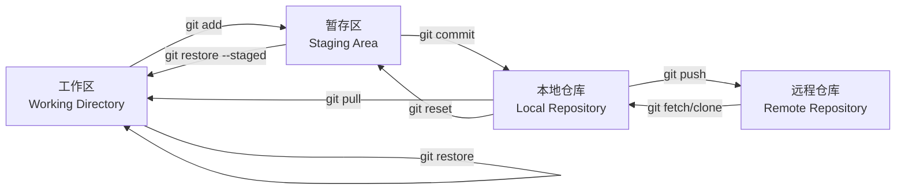

# 一、Git 概述

**Git** 是一个免费、开源的分布式版本控制系统，常用于软件开发中*对代码的版本管理*。由 Linus Torvalds 为了帮助管理 Linux 内核开发而开发。它主要用于软件开发过程中的代码版本管理，但也可以用于管理任何文件集合的历史变更。相比于传统的集中式版本控制系统（如 SVN），Git 的分布式特性*让每个开发者的本地仓库都包含完整的项目历史*，允许离线工作，并能更高效地处理分支和合并操作。

# 二、基本概念

## 集中式 vs 分布式

- 传统的集中式版本控制系统（如 SVN）依赖于一个中央服务器来存储所有版本的代码，而 Git 是分布式的，每个开发者的本地仓库都完整包含了项目的所有历史记录和版本信息。这意味着开发者可以在本地进行大部分的版本控制操作，无需频繁与远程服务器交互。

## 仓库（Repository）

- 是*存储项目文件和版本历史*的地方，分为本地仓库和远程仓库。**本地仓库**在开发者的本地计算机上，**远程仓库**通常位于服务器上，用于团队协作和代码共享。
- 可以通过 `git init` 初始化本地仓库，使用 `git clone` 克隆远程仓库到本地。

## 提交（Commit）

- _是对项目文件更改的一次记录_，每次提交都会生成一个*唯一的哈希值（如 SHA - 1）来标识*。
- 提交时需要添加描述信息（`-m` 参数），清晰说明本次更改的内容和目的。

## 分支（Branch）

- 是*独立于主代码线*的开发线路，允许开发者在*不影响主代码*的情况下进行新功能开发、bug 修复等工作。
- 常见分支包括*主分支*（如 `master` 或 `main`）、_开发分支_、_功能分支_、*发布分支*和*热修复分支*等。

## 标签（Tag）

_是对某个特定提交的标记_，通常用于**标记项目的重要版本**，如发布版本。标签分为`轻量标签`和`附注标签`。

## 远程仓库（Remote Repository）

_存储在服务器上的仓库_，**用于团队成员之间的代码共享和协作**。常见的远程仓库托管平台有 GitHub、GitLab、Bitbucket 等。

## 本地仓库（Local Repository）

在开发者的*本地计算机上的仓库*。

## 工作区(workspace)

`工作区（Workspace）`指的是你在*本地计算机上实际进行文件编辑和操作的目录*，也就是你*能在文件资源管理器（如 Windows 的资源管理器、macOS 的访达）中看到并可以直接修改的项目文件所在的区域*。_例如_，你使用编辑器（像 Visual Studio Code）打开项目文件进行代码编写、修改、删除等操作的地方就是工作区。

## 暂存区（Staging Area / Index）

在 Git 里，`暂存区`（Staging Area，也被叫做索引 Index）是一个**中间地带**，处于工作区（Workspace）和本地仓库（Local Repository）之间。_它就像一个缓冲区_，其**核心作用**是让开发者能够精细地*挑选哪些文件的修改要被纳入到下一次的提交中*，从而灵活地控制提交的内容和范围。

参考：[[暂存区]]

# 三、常用命令



## 本地仓库

### 初始化
- 在本地初始化一个新的 Git 仓库。在当前目录下创建一个新的 Git 仓库。

   ```bash
   git init
   ```

### 克隆远程仓库
- 将远程仓库的代码复制到本地。

   ```bash
   git clone <远程仓库地址> 
   git clone <远程仓库地址> <本地目录名> # 可以指定本地目录名
   ```

### 本地仓库 → 暂存区
场景：**回退最近一次提交（commit）到暂存区（Staging Area）** ，也就是，撤销提交但保留改动内容*以便再次修改或重新提交*

```bash
# 回退一次提交，保留改动在暂存区
git reset --soft HEAD^

# git reset --soft <commit> # 无效
```
- `--soft`：表示只回退提交，不删除暂存区和工作区的内容。
- `HEAD^`：表示上一次提交。

执行完后：
- 最新的提交记录会被移除；
- 但你所做的*更改仍然保留在暂存区中*，可以直接修改或重新提交。


### 本地仓库 → 工作区	
**将最近一次提交（commit）回退到工作区（Working Directory）** ，即撤销提交和暂存区的改动，但*保留文件内容在本地可查看/编辑*

```bash
# 回退最后一次提交，保留改动到工作区
git reset --mixed HEAD^
# 因为默认模式，简写为：
git reset HEAD^

# git reset --mixed <commit> # 无效
```

`--mixed` 是*默认选项*，表示：
- 删除最近一次提交记录；
- 将改动从 **暂存区** 移动到 **工作区** ；
- 文件仍保留，但需要重新 `git add` 才能再次提交。

### 本地仓库 → 丢弃
**彻底丢弃最近一次提交（包括所有改动）** ，即从 Git 历史中删除该提交，并且不再保留其修改内容

```bash
# 彻底丢弃提交（慎用！）
git reset --hard HEAD^
# git reset --hard <commit> # 无效	
```
- `--hard`：会完全丢弃提交以及对应的改动；
- `HEAD^`：表示回退到上一次提交。

📌 **警告** ：这个操作是**不可逆的** ，一旦执行，你将**永久丢失该提交的所有改动** ！

#### 总结三种常见 reset 模式：

| 命令                                          | 效果描述                  |
| ------------------------------------------- | --------------------- |
| `git reset --soft HEAD^`                    | 回退提交，保留改动在**暂存区**     |
| `git reset --mixed HEAD^`或`git reset HEAD^` | 回退提交，保留改动在**工作区**（常用） |
| `git reset --hard HEAD^`                    | 彻底删除提交和所有改动（⚠️**慎用**） |
如果你不确定该用哪种方式，建议优先使用 `--mixed` 模式，因为它更安全，不会丢失代码。

### 本地仓库 → 远程仓库	
```bash
# 推送本地提交到远程仓库
git push <remote> <branch>	
```

### 远程仓库 → 本地仓库	
```bash
# 下载远程更新到本地仓库（不自动合并）
git fetch <remote>	
```
[[git fetch]]

### 远程仓库 → 工作区	
```bash
# 下载远程更新并合并到工作区（= git fetch + git merge）
git pull <remote> <branch>	
```
[[git pull]]

## 工作区

### 工作区 → 丢弃
场景：撤销工作区修改（未 `git add`）。修改了文件但未添加到暂存区，想丢弃所有改动

```bash
# 丢弃、删除 *未跟踪* 的文件/目录
git clean -fd	

# 丢弃、删除 *已跟踪* 的文件/目录
## 撤销单个文件
git checkout -- <file>          # 传统写法（Git 2.23+ 推荐用 restore）
git restore <file>              # Git 2.23+ 新命令
## 撤销所有未暂存修改（危险！确认无重要变更再执行）
git restore .                   # 推荐写法
git checkout -- .               # 传统写法


```

[[clean、checkout、restore]]

### 工作区 → 暂存区
- `git add` 命令可以将工作区的修改添加到暂存区。
- `git add -p` 以交互方式将工作区部分修改添加到暂存区。

   ```bash
   git add <file>  # 添加指定文件
   git add .         # 添加所有修改的文件
   
   git add -p        # 以交互方式将工作区部分修改添加到暂存区。
   ```


### 工作区 → 本地仓库

```bash
# 跳过暂存区，直接提交 已跟踪文件 的修改
git commit -am "msg"
```

## 暂存区
暂存区是一个中间区域，用于准备提交的文件。

### 暂存区 → 本地仓库
   ```bash
   # 提交暂存区内容到本地仓库
   git commit -m "提交描述信息"
   ```

### 暂存区 → 工作区
场景：撤销暂存区修改（已 `git add` 但未 `git commit`）。文件已加入暂存区，但想取消暂存

```bash
# 把文件从暂存区移除，回到工作区。将指定文件从暂存区移除，但保留工作目录中的修改。
# 将文件移出暂存区（保留工作区修改）
git restore --staged <file>	# 单个文件，Git 2.23+ 新命令
git restore --staged .      # 全部文件

# (旧命令) 效果同上
git reset HEAD <file>	
git reset HEAD .            # 重置整个暂存区
```

### 查看
#### 查看状态
- 显示工作区和暂存区中文件的状态，如已修改、已添加、已删除等。

   ```bash
   git status
   ```

#### 工作区与暂存区的差异
- 查看工作区与暂存区之间的差异。

   ```bash
   git diff
   ```


#### 暂存区与本地仓库的差异
- 用于查看暂存区与上一次提交之间的差异。查看暂存区与本地仓库中最新提交之间的差异。

   ```bash
   git diff --staged
   ```


#### 两个提交的差异
- 查看两个不同提交之间的差异。

   ```bash
   git diff <commit1> <commit2>
   ```


### 恢复、撤销

#### 暂存区->某一提交
- 把暂存区恢复到某一提交的状态。

   ```bash
   git reset --soft
   ```

#### 工作区、暂存区->某一提交
- 让工作区、暂存区恢复到某一提交的状态。

   ```bash
   git reset --mixed
   ```

#### 工作区、暂存区、本地仓库->某一提交
- 使工作区、暂存区、本地仓库，都恢复到某一提交的状态。

   ```bash
   git reset --hard
   ```


## 远程仓库操作

### 查看远程仓库信息
   ```bash
   git remote -v
   ```

### 添加远程仓库
   ```bash
   git remote add <远程仓库名> <远程仓库地址>
   ```

### 推送本地分支到远程仓库
首次推送可以使用 `git push -u <远程仓库名> <分支名>`，*将本地分支和远程分支关联起来*。

   ```bash
   git push <远程仓库名> <分支名>
   ```

### 拉取代码

相当于先 `git fetch` 再 `git merge`。
   ```bash
   git pull <远程仓库名> <分支名>
   ```

### 获取远程仓库最新信息
只获取远程仓库的更新信息，*不合并*到本地分支。

   ```bash
   git fetch <远程仓库名>
   ```


## 分支操作

### 查看
   ```bash
   git branch        # 查看本地分支
   git branch -r     # 查看远程分支
   git branch -a     # 查看所有分支
   ```

### 创建
   ```bash
   git branch <分支名>
   ```
### 切换
切换分支或恢复文件。

   ```bash
   git checkout <分支名>
   ```

### 创建并切换
   ```bash
   git checkout -b <分支名>
   ```

### 合并
合并分支。
   ```bash
   git merge <分支名>
   ```
   将指定分支的更改合并到当前分支。可能会出现冲突，需要手动解决。

### 删除
   ```bash
   git branch -d <分支名>  # 删除已合并的分支
   git branch -D <分支名>  # 强制删除未合并的分支
   ```


## 版本回退

1. **软回退**
   ```bash
   git reset --soft <提交哈希值>
   ```
   回退到指定提交，保留工作目录和暂存区的修改。
2. **混合回退**
   ```bash
   git reset --mixed <提交哈希值>
   ```
   回退到指定提交，保留工作目录的修改，但清空暂存区。
3. **硬回退**
   ```bash
   git reset --hard <提交哈希值>
   ```
   回退到指定提交，丢弃工作目录和暂存区的所有修改。
4. **撤销提交**
   ```bash
   git revert <提交哈希值>
   ```
   创建一个新的提交来撤销指定提交的更改。

# 四、工作流程

1. **集中式工作流**
   - 所有团队成员直接在主分支上进行开发和提交，适用于小型团队和简单项目。
2. **功能分支工作流**
   - 每个新功能或任务都在独立的分支上进行开发，开发完成后再合并到主分支，能隔离不同功能的开发。
3. **GitFlow 工作流**
   - 定义了严格的分支模型，包括主分支（`master`）、开发分支（`develop`）、功能分支（`feature`）、发布分支（`release`）和热修复分支（`hotfix`），适用于大型项目和需要严格版本管理的项目。
4. **GitHub Flow 工作流**
   - 基于功能分支工作流，强调快速迭代和持续部署。新功能在分支上开发，通过拉取请求（Pull Request）进行代码审查，审查通过后合并到主分支。

# 五、高级特性

1. **钩子（Hooks）**
   - 是在特定 Git 事件发生时自动执行的脚本，如 `pre - commit` 钩子可在提交代码前进行代码检查，`post - receive` 钩子可在推送代码后自动部署。
2. **子模块（Submodule）**
   - 允许在一个 Git 仓库中包含另一个 Git 仓库，用于管理项目中的外部依赖。
3. **变基（Rebase）**
   - 将一个分支的修改应用到另一个分支上，使提交历史更加线性。但在多人协作时需谨慎使用，避免丢失提交记录。

# 六、与其他工具集成

1. **与 IDE 集成**
   - 大多数集成开发环境（如 Visual Studio Code、WebStorm）都集成了 Git 功能，方便开发者在 IDE 中进行版本控制操作。
2. **与 CI/CD 工具集成**
   - 可与 Jenkins、GitLab CI/CD、GitHub Actions 等持续集成/持续部署工具集成，实现代码提交后的自动化构建、测试和部署。
