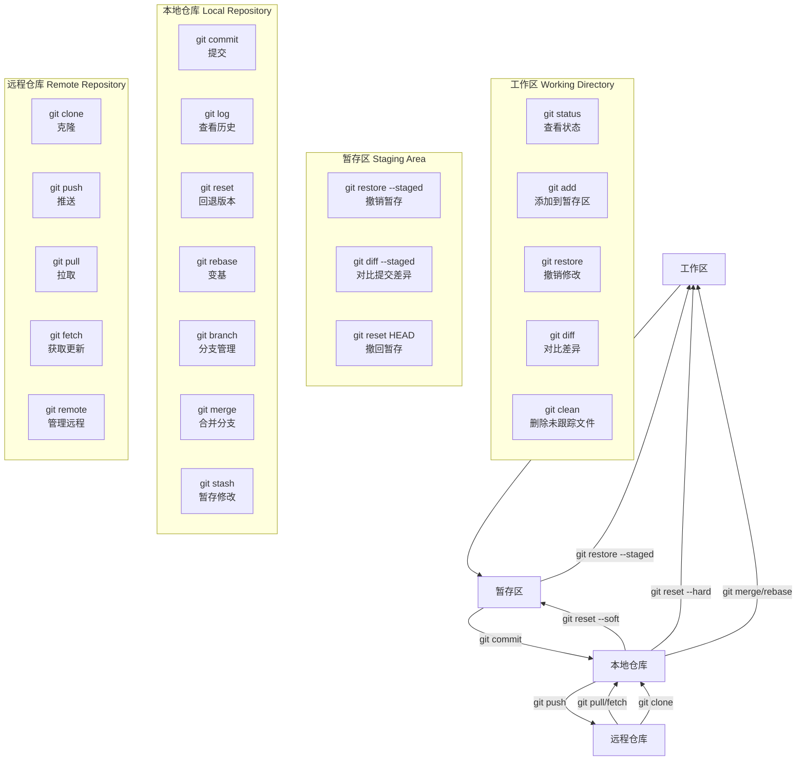

以下是 **Git 命令分类总结**，按 **工作区、暂存区、本地仓库、远程仓库** 四个核心区域整理：

---

### **一、工作区（Working Directory）**

**操作未跟踪或已修改但未暂存的文件**  

| 命令            | 说明                     | 示例                              |
| ------------- | ---------------------- | ------------------------------- |
| `git status`  | 查看工作区状态（未跟踪/已修改的文件）    | `git status`                    |
| `git add`     | 将文件添加到暂存区              | `git add file.js` 或 `git add .` |
| `git restore` | 撤销工作区的修改（恢复到最后提交或暂存状态） | `git restore file.js`           |
| `git clean`   | 删除未跟踪的文件               | `git clean -fd`（强制删除目录和文件）      |
| `git diff`    | 查看工作区与暂存区的差异           | `git diff`                      |
| `git mv`      | 移动或重命名文件               | `git mv old.txt new.txt`        |
| `git rm`      | 删除文件（需提交）              | `git rm file.js`                |
|               |                        |                                 |

---

### **二、暂存区（Staging Area）**

**操作已暂存但未提交的变更**  

| 命令 | 说明 | 示例 |
|------|------|------|
| `git reset` | 将文件从暂存区撤回工作区 | `git reset HEAD file.js` |
| `git restore --staged` | 撤销暂存操作（同 `git reset HEAD`） | `git restore --staged file.js` |
| `git diff --staged` | 查看暂存区与最新提交的差异 | `git diff --staged` |

---

### **三、本地仓库（Local Repository）**

**操作已提交的版本历史和分支**  

| 命令 | 说明 | 示例 |
|------|------|------|
| `git commit` | 提交暂存区的变更到本地仓库 | `git commit -m "message"` |
| `git log` | 查看提交历史 | `git log --oneline --graph` |
| `git reset` | 回退到指定提交（修改历史） | `git reset --soft HEAD~1`（保留工作区）<br>`git reset --hard HEAD~1`（彻底回退） |
| `git rebase` | 变基（合并/重写提交历史） | `git rebase main` |
| `git cherry-pick` | 选择某个提交合并到当前分支 | `git cherry-pick abc123` |
| `git stash` | 临时保存未提交的修改 | `git stash push -m "save work"`<br>`git stash pop` |
| `git branch` | 管理分支 | `git branch feature`（创建分支）<br>`git branch -d feature`（删除分支） |
| `git checkout` | 切换分支或恢复文件 | `git checkout main`（切换分支）<br>`git checkout file.js`（恢复文件） |
| `git merge` | 合并分支 | `git merge feature` |
| `git tag` | 管理标签 | `git tag v1.0`（打标签）<br>`git tag -d v1.0`（删除标签） |

---

### **四、远程仓库（Remote Repository）**

**操作远程仓库（如 GitHub/GitLab）**  

| 命令 | 说明 | 示例 |
|------|------|------|
| `git clone` | 克隆远程仓库到本地 | `git clone https://github.com/user/repo.git` |
| `git fetch` | 拉取远程更新（不合并） | `git fetch origin main` |
| `git pull` | 拉取并合并远程分支（`fetch` + `merge`） | `git pull origin main` |
| `git push` | 推送本地提交到远程仓库 | `git push origin main`<br>`git push --tags`（推送标签） |
| `git remote` | 管理远程仓库地址 | `git remote -v`（查看远程仓库）<br>`git remote add origin URL`（添加远程仓库） |
| `git push --force` | 强制推送（覆盖远程历史） | `git push --force origin main`（慎用！） |
| `git ls-remote` | 查看远程仓库的引用（分支/标签） | `git ls-remote origin` |

---

### **五、跨区域或工具类命令**

| 命令         | 说明                                 | 示例                                        |
| ------------ | ------------------------------------ | ------------------------------------------- |
| `git config` | 配置 Git 参数                        | `git config --global user.name "Your Name"` |
| `gitignore`  | 定义忽略文件规则                     | 创建 `.gitignore` 文件                      |
| `git reflog` | 查看所有操作记录（包括被删除的提交） | `git reflog`                                |
| `git help`   | 查看帮助文档                         | `git help commit`                           |

---

## 总结流程图

```
工作区 → `git add` → 暂存区 → `git commit` → 本地仓库 → `git push` → 远程仓库
  ↑                        ↑                     ↑
  | `git restore`          | `git reset HEAD`    | `git reset --hard`
  | `git clean`            | `git restore --staged` | `git rebase`
  ↓                        ↓                     ↓
工作区 ←------------------ 暂存区 ←------------ 本地仓库
```


以下是 **Git 命令流程图**，基于 **工作区、暂存区、本地仓库、远程仓库** 四区域的关系和命令分类：



---

### **流程图说明**

1. **正向流程**（代码提交）：

   ```
   工作区 → git add → 暂存区 → git commit → 本地仓库 → git push → 远程仓库
   ```

2. **逆向操作**（撤销/回退）：

   - 从暂存区撤回工作区：`git restore --staged` 或 `git reset HEAD`
   - 从本地仓库回退到暂存区：`git reset --soft`
   - 彻底回退到工作区：`git reset --hard`

3. **远程交互**：

   - 从远程同步到本地：`git clone`（初次下载）、`git pull`（拉取并合并）、`git fetch`（仅获取更新）
   - 推送本地到远程：`git push`

4. **分支与合并**：
   - 本地仓库操作：`git branch`（分支）、`git merge`（合并）、`git rebase`（变基）

---

### **纯文本版流程图**

```
+-------------------+       git add       +-------------------+       git commit      +-------------------+       git push       +-------------------+
|                   | -------------------> |                   | -------------------> |                   | -------------------> |                   |
|    工作区          |                     |    暂存区          |                      |   本地仓库         |                      |   远程仓库         |
| (git status       | <--- git restore --- | (git diff --staged)| <--- git reset ---- | (git log          | <--- git pull/fetch | (git clone        |
|  git restore)     |                     |                    | --soft/--hard       |  git rebase)      | ------------------- |  git remote)      |
+-------------------+                     +-------------------+                      +-------------------+                      +-------------------+
```

---

通过此图可快速理解 Git 各区域的关系及对应命令！
