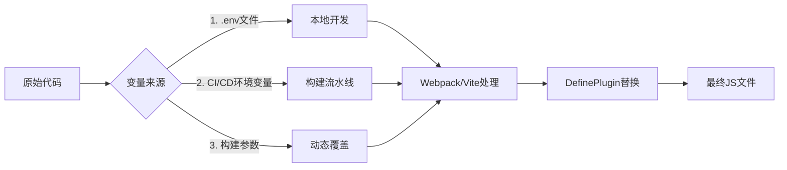
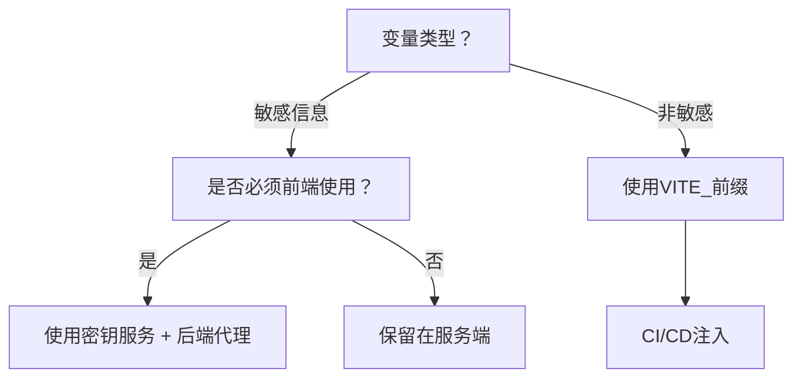
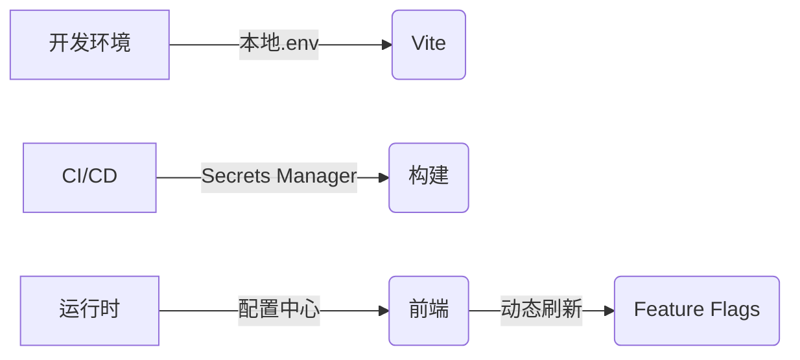

# 前端环境变量深度解析：架构师的安全与效率指南

作为前端架构师，**环境变量管理**是构建可靠、可维护系统的基石。它远不止是"配置不同API地址"，而是**连接代码与基础设施的神经系统**，直接影响安全性、部署效率和团队协作。以下是我基于大型金融级应用和电商平台的实战经验总结，聚焦**架构设计本质**和**安全红线**。

---

## 一、环境变量的本质：超越`process.env`的认知

### 1. 前端环境变量的特殊性（与后端关键区别）
| 维度 | 后端环境变量 | 前端环境变量 | 架构影响 |
|------|--------------|--------------|----------|
| **生命周期** | 进程级 | **编译时注入** | 无法动态修改 |
| **可见性** | 服务器内部 | **打包进JS文件** | 敏感信息泄露风险 |
| **作用域** | 全局可用 | **需显式注入** | 工具链依赖性强 |
| **热更新** | 支持 | **不支持** | 需重启构建 |

> 💡 **核心认知**：前端环境变量是**编译时快照**，不是运行时配置。这是所有问题的根源。

### 2. 三大注入机制（原理级理解）


**关键原理**：
- **编译时替换**：工具链将`process.env.API_URL`直接替换为字符串字面量
- **死代码消除**：`if (process.env.NODE_ENV === 'production')`会被完全移除
- **作用域隔离**：仅`import.meta.env`或`process.env`前缀的变量被处理

> ⚠️ **致命误区**：  
> 误以为前端环境变量可在运行时修改（如通过`window.env`），这会导致**敏感信息暴露**和**缓存失效**问题。

---

## 二、构建工具实战：Webpack vs Vite vs Next.js

### 1. Webpack 环境变量（DefinePlugin核心）
```javascript
// webpack.config.js
const webpack = require('webpack');

module.exports = {
  plugins: [
    new webpack.DefinePlugin({
      'process.env': {
        API_URL: JSON.stringify(process.env.API_URL),
        // 安全实践：敏感变量不注入前端
        SENSITIVE_KEY: JSON.stringify(''), 
        // 功能开关
        FEATURE_NEW_UI: JSON.stringify(process.env.FEATURE_NEW_UI === 'true')
      }
    })
  ]
};
```

**架构师必须知道的细节**：
- **`JSON.stringify`必要性**：避免变量被当作标识符（如`API_URL: "https://api.com"`会报错）
- **安全红线**：**永远不要注入**数据库密码、支付密钥等敏感信息
- **性能影响**：DefinePlugin替换发生在AST阶段，不影响打包体积

### 2. Vite 的革命性改进（`.env`文件规范）
```bash
# .env.development（本地开发）
VITE_API_URL=https://dev-api.example.com
VITE_SENTRY_DSN= # 本地不启用Sentry

# .env.production（生产构建）
VITE_API_URL=https://prod-api.example.com
VITE_SENTRY_DSN=https://xxx@sentry.io/123
```

```javascript
// 代码中使用
const api = import.meta.env.VITE_API_URL;
```

**Vite 三大创新**：
1. **前缀规则**：仅`VITE_`开头的变量暴露给前端（避免意外泄露）
2. **模式切换**：`vite build --mode staging` 自动加载`.env.staging`
3. **类型安全**：生成`import.meta.env`的TS声明文件

> ✅ **架构决策**：  
> 新项目**强制使用Vite**，其环境变量设计解决了Webpack的90%痛点。

### 3. Next.js 服务端/客户端分离
```javascript
// next.config.js
module.exports = {
  env: {
    // 服务端和客户端都可用（仍需VITE_前缀）
    PUBLIC_API_URL: process.env.PUBLIC_API_URL,
  }
}

// 代码中
// 服务端（安全！）
const secret = process.env.DB_PASSWORD;

// 客户端（安全！仅VITE_变量）
const api = process.env.NEXT_PUBLIC_API_URL;
```

**Next.js 安全机制**：
- `NEXT_PUBLIC_`前缀：仅这些变量暴露给客户端
- 服务端变量：完全保留在Node.js环境
- 自动剥离敏感变量：`.env.local`不提交到Git

---

## 三、安全架构：环境变量的生死线

### 1. 敏感信息泄露的5大场景（附修复方案）
| 泄露场景 | 检测方法 | 修复方案 |
|----------|----------|----------|
| **错误前缀**<br>(Webpack) | 搜索`process.env.SECRET` | 使用`SENSITIVE_`前缀 + CI检查 |
| **Git提交**<br>(.env文件) | `git secrets`扫描 | `.env*`加入`.gitignore` + 模板文件 |
| **Source Map暴露** | 检查source map内容 | CI中剥离source map敏感信息 |
| **错误日志打印** | 搜索`console.log(env)` | ESLint规则禁止打印env |
| **第三方库注入** | 审计`node_modules` | 使用`patch-package`移除敏感访问 |

**实战代码**：ESLint安全规则
```javascript
// eslint-plugin-security.js
module.exports = {
  rules: {
    'no-sensitive-env': {
      create: (context) => ({
        MemberExpression: (node) => {
          if (
            node.object.name === 'process' &&
            node.property.name === 'env' &&
            /SECRET|KEY|TOKEN/i.test(node.parent.right?.raw)
          ) {
            context.report(node, '禁止使用敏感环境变量！');
          }
        }
      })
    }
  }
};
```

### 2. 安全存储方案对比
| 方案 | 适用场景 | 安全等级 | 实施成本 |
|------|----------|----------|----------|
| **本地`.env`文件** | 开发环境 | ⭐⭐ | 低 |
| **CI/CD Secrets** | 生产构建 | ⭐⭐⭐⭐ | 中 |
| **密钥管理服务**<br>(AWS Secrets Manager) | 金融级应用 | ⭐⭐⭐⭐⭐ | 高 |
| **运行时注入**<br>(Nginx变量) | 高安全需求 | ⭐⭐⭐ | 高 |

**架构师决策树**：


> 🔒 **黄金法则**：  
> **任何出现在前端JS文件中的变量，都应视为公开信息**。支付密钥、数据库连接字符串等**永远不应出现在前端代码中**。

---

## 四、高级应用场景：超越基础配置

### 1. 功能开关（Feature Flags）实现
```javascript
// config/feature-flags.js
export const FEATURES = {
  NEW_CART: import.meta.env.VITE_FEATURE_NEW_CART === 'true',
  DARK_MODE: import.meta.env.VITE_FEATURE_DARK_MODE === 'true',
  // 本地开发默认开启
  LOCAL_DEBUG: import.meta.env.MODE === 'development'
};

// 组件中使用
{FEATURES.NEW_CART && <NewCart />}
```

**架构优势**：
- **解耦发布与部署**：功能开发完成即可合并代码，通过变量控制开关
- **灰度发布**：结合用户ID实现小流量测试
- **快速回滚**：无需重新构建，修改变量即可关闭功能

### 2. 多租户系统配置
```bash
# .env.tenant-a
VITE_THEME_COLOR='#1890ff'
VITE_SUPPORT_EMAIL='support@a.com'

# .env.tenant-b
VITE_THEME_COLOR='#eb2f96'
VITE_SUPPORT_EMAIL='help@b.com'
```

```javascript
// 构建命令
vite build --mode tenant-a

// 运行时动态切换（安全方案）
const tenantConfig = {
  a: { color: '#1890ff', email: 'support@a.com' },
  b: { color: '#eb2f96', email: 'help@b.com' }
};

// 通过域名自动识别
const currentTenant = window.location.hostname.includes('tenant-a') 
  ? tenantConfig.a 
  : tenantConfig.b;
```

**为什么优于传统方案**：
- 避免构建N个包（每个租户一个构建）
- 支持运行时动态切换（需配合后端配置中心）

### 3. 本地开发联调技巧
```bash
# .env.development.local
VITE_API_URL=http://localhost:3001
VITE_MOCK_ENABLED=true
# 动态切换远程分支
VITE_REMOTE_BRANCH=feature/login-v2
```

```javascript
// utils/api.js
const baseURL = import.meta.env.VITE_API_URL;

// 开发环境自动添加分支前缀
if (import.meta.env.DEV && import.meta.env.VITE_REMOTE_BRANCH) {
  baseURL += `/${import.meta.env.VITE_REMOTE_BRANCH}`;
}
```

**团队效率提升**：
- 前端可独立测试后端分支功能
- 无需修改代码切换测试环境
- 与Git分支自动关联

---

## 五、架构师必备最佳实践

### 1. 环境变量设计规范（团队强制）
| 项目 | 规则 | 违反示例 | 正确示例 |
|------|------|----------|----------|
| **命名** | `VITE_<DOMAIN>_<NAME>` | `API_URL` | `VITE_APP_API_URL` |
| **类型** | 布尔值用`true`/`false` | `FEATURE_X=1` | `FEATURE_X=true` |
| **敏感** | 前端仅用`VITE_`前缀 | `SECRET_KEY=xxx` | `SENSITIVE_KEY=xxx`（不注入前端） |
| **文档** | 所有变量写入`ENV_DOCS.md` | 无文档 | 包含默认值和示例 |

### 2. 环境继承策略（避免配置爆炸）
```bash
# .env (基础配置)
VITE_API_BASE=https://api.example.com

# .env.staging (继承并覆盖)
# 无内容 - 自动继承基础配置

# .env.production
VITE_API_BASE=https://prod-api.example.com
VITE_SENTRY_ENABLED=true
```

**Webpack实现方案**：
```javascript
// config/env.js
const dotenv = require('dotenv');
const dotenvExpand = require('dotenv-expand');

const env = dotenv.config({
  path: `.env.${process.env.NODE_ENV}`
});

module.exports = dotenvExpand(env).parsed;
```

### 3. 安全审计清单（上线前必查）
- [ ] 所有`VITE_`变量在生产环境有明确值
- [ ] 无敏感信息硬编码在代码中
- [ ] `.env.local`已加入`.gitignore`
- [ ] CI/CD中设置了安全变量
- [ ] Source Map中无敏感信息
- [ ] 运行时打印env的代码已移除

---

## 六、反模式与血泪教训

### 1. 五大致命错误（附修复方案）
| 错误 | 后果 | 修复 |
|------|------|------|
| **直接使用`process.env`**<br>(无工具链支持) | 变量未替换 → `undefined` | 配置DefinePlugin |
| **在`<script>`中写入变量** | XSS风险 | 使用`data-`属性替代 |
| **动态拼接变量名**<br>`process.env[`API_${env}`]` | Webpack无法静态分析 | 改用对象映射 |
| **在服务端使用客户端变量** | Next.js构建失败 | 严格区分`NEXT_PUBLIC_` |
| **忽略`.env.local`** | 团队配置不一致 | 提供`.env.example`模板 |

### 2. 真实事故案例
**场景**：  
某电商平台将`VITE_PAYMENT_SECRET`误注入前端，黑客通过JS文件提取密钥，盗刷用户支付。

**根因**：
```bash
# .env.production
VITE_PAYMENT_SECRET=sk_live_xxx  # 错误！应为PAYMENT_SECRET
```

**修复方案**：
1. 立即轮换密钥
2. 添加CI检查：
   ```bash
   # 检查前端构建产物
   grep -r "sk_live_" dist/ && exit 1
   ```
3. 实施密钥自动扫描工具（如TruffleHog）

---

## 七、未来趋势：环境变量管理的演进

### 1. 云原生方案


**关键技术**：
- **运行时配置**：通过`/config.json`接口获取非敏感配置
- **零信任架构**：前端仅获取当前用户所需的配置
- **自动轮换**：密钥服务与前端构建流水线集成

### 2. 架构师行动路线
| 阶段 | 目标 | 关键动作 |
|------|------|----------|
| **基础阶段** | 避免敏感泄露 | 实施Vite前缀规则 + CI扫描 |
| **进阶阶段** | 支持功能开关 | 建立Feature Flags系统 |
| **成熟阶段** | 动态配置能力 | 集成配置中心 + 安全代理 |

---

## 总结：环境变量的架构思维

| 维度 | 错误认知 | 正确实践 |
|------|----------|----------|
| **本质** | "只是配置" | **系统安全边界** |
| **管理** | 开发者随意添加 | **严格治理流程** |
| **生命周期** | 与代码相同 | **独立于代码的资产** |
| **价值** | 环境切换 | **功能演进核心引擎** |

> ✅ **架构师终极建议**：
> 1. **将环境变量视为密码**：实施与密钥同等的管理流程
> 2. **建立变量注册中心**：所有变量需在Confluence登记用途
> 3. **自动化安全扫描**：在CI中集成`dotenv-linter`和`git-secrets`
> 4. **最小化原则**：前端变量越少，攻击面越小

环境变量管理是前端架构的**隐形地基**。设计良好的体系能：  
🛡️ **预防90%的配置相关事故**  
🚀 **提升多环境协作效率200%**  
💡 **为功能演进提供基础设施**

作为架构师，你不仅要配置变量，更要**设计变量的治理体系**。如果需要具体场景的实施方案（如"金融级应用的环境变量安全方案"），我可以提供完整模板！ 🔒