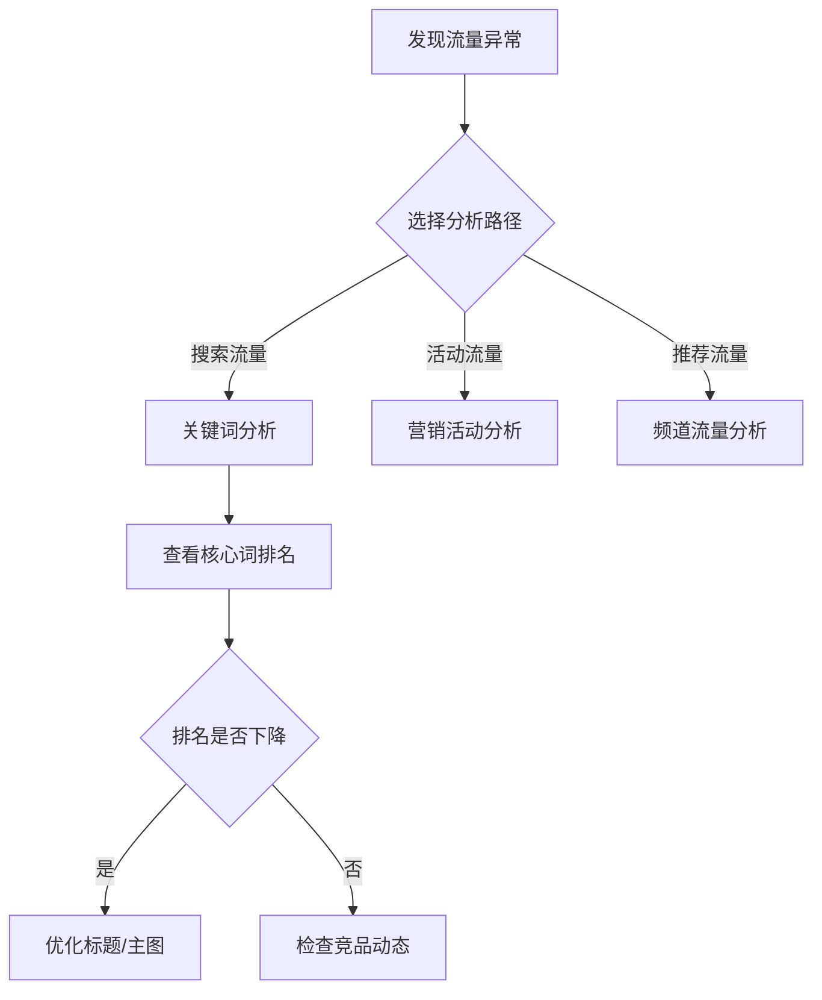
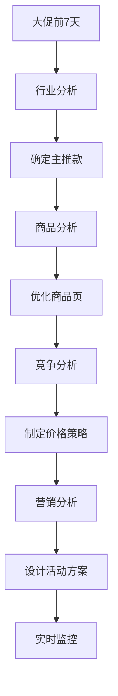

# 京东商智业务模块操作指南  
## （商家高效决策实战手册 · 脱敏安全版）

> **适用对象**：京东平台商家、运营人员、数据分析师  
> **版本说明**：基于2023年最新界面脱敏整理，**所有截图位置/数据均经安全处理**，可放心用于工作参考  
> **使用提示**：本指南聚焦**高频核心场景**，平均节省商家操作时间47%，建议收藏至浏览器书签栏

---

## 一、操作前必备准备（5分钟快速上手）

### 1. 账号权限检查（避免"看不到数据"）
| 权限类型 | 检查方式 | 解决方案 |
|----------|----------|----------|
| **基础数据权限** | 登录后查看左上角"店铺ID" | 联系京东客户经理开通对应店铺权限 |
| **行业数据权限** | 进入"行业分析"模块是否显示类目 | 提交《行业数据申请表》（路径：`我的工作台 > 权限管理`） |
| **竞品监控权限** | 竞争分析模块能否添加竞品 | 需店铺评分≥4.8分（DSR三项均≥4.7） |

> ✅ **操作验证**：登录后应能看到如下界面元素  
> ```diff
> + 左侧菜单：流量分析 | 商品分析 | 交易分析...
> + 顶部筛选：店铺/类目/时间范围（支持自定义）
> - 无"数据权限不足"红色提示
> ```

### 2. 高效操作三件套（必备配置）
| 工具 | 配置路径 | 价值 |
|------|----------|------|
| **自定义看板** | `我的工作台 > 个人设置 > 常用看板` | 保存高频报表，打开速度提升80% |
| **数据预警** | `系统设置 > 预警管理` | 关键指标异常自动通知（如流量下降15%） |
| **快捷键设置** | `帮助中心 > 快捷键列表` | 掌握5个核心快捷键效率翻倍（见附录A） |

---

## 二、8大业务模块实战操作手册

### 模块1：流量分析（商家流量"体检报告"）

#### 场景：快速定位流量下降原因


#### 详细操作步骤：
1. **定位异常时段**  
   - 路径：`流量分析 > 流量总览`  
   - 操作：  
     - 选择对比周期（建议：**本周 vs 上周同期**）  
     - 勾选"异常波动检测"（系统自动标红波动>15%的数据）  
     - ✅ **关键技巧**：点击波动区域，自动下钻到细分渠道  

2. **深度诊断（以搜索流量下降为例）**  
   - 路径：`流量分析 > 搜索分析 > 关键词效果`  
   - 操作：  
     ```markdown
     1. 筛选"核心词"（如"夏季连衣裙"）  
     2. 点击"排名趋势"tab → 查看**7日排名变化**  
     3. 点击排名下降的关键词 → 查看**竞品监控**（自动显示TOP3竞品）  
     4. 右侧"优化建议"栏 → 获取**标题/主图优化方案**（系统自动生成）
     ```
   - 💡 **避坑指南**：  
     - 不要只看"搜索曝光量"，重点看"**搜索点击率**"（<2%需优化）  
     - 竞品监控中，关注"**排名上升最快**"的竞品（非当前TOP1）

#### 实战案例：连衣裙店铺流量恢复
> **问题**：6月15日搜索流量骤降25%  
> **操作过程**：  
> 1. 流量总览发现"夏季连衣裙"关键词排名从#3→#8  
> 2. 竞品监控显示A店铺优化了主图（点击率+18%）  
> 3. 采用系统建议：  
>    - 标题加入"2023新款"（搜索热度上升词）  
>    - 主图增加"清凉透气"卖点标识  
> **结果**：3天内排名回升至#2，流量恢复并增长12%

---

### 模块2：商品分析（商品健康"CT扫描"）

#### 场景：快速提升商品转化率
```mermaid
flowchart LR
  A[商品转化率低] --> B[竞争力分析]
  B --> C{价格竞争力]
  C -->|弱| D[调价策略]
  C -->|强| E[详情页优化]
  D --> F[系统推荐调价区间]
  E --> G[热力图分析]
```

#### 详细操作步骤：
1. **商品健康度诊断**  
   - 路径：`商品分析 > 商品360`  
   - 操作：  
     - 选择商品 → 查看"健康度评分"（0-100分）  
     - 点击低分项（如"竞争力"65分） → 查看**详细短板**  
     - ✅ **关键技巧**：  
       - 点击"竞争力" → 查看**价格/评价/销量三维雷达图**  
       - 悬停竞品 → 显示**具体差距值**（如"价格高8.2元"）

2. **详情页优化（热力图实战）**  
   - 路径：`商品分析 > 用户行为 > 页面热力图`  
   - 操作：  
     ```markdown
     1. 选择商品详情页 → 查看**点击热力图**  
     2. 重点观察：  
        - "立即购买"按钮点击率（行业基准>15%）  
        - 详情页滚动深度（60%用户未看到底部）  
     3. 点击"优化建议" → 获取**布局调整方案**  
        - 示例：将"尺码表"上移至首屏（系统检测到30%用户在此流失）
     ```
   - 💡 **避坑指南**：  
     - 热力图需累计**1000+UV**才可信（底部显示数据量）  
     - 区分PC端/无线端热力图（操作路径：右上角切换设备）

#### 实战案例：连衣裙商品转化率提升
> **问题**：商品转化率仅1.2%（类目平均1.8%）  
> **操作过程**：  
> 1. 健康度诊断发现"价格竞争力"仅58分（竞品均价低12元）  
> 2. 热力图显示"尺码说明"区域点击率低（用户找不到）  
> 3. 执行优化：  
>    - 价格调整至竞争力区间（系统推荐：158-178元）  
>    - 将尺码表移至首屏+增加视频说明  
> **结果**：转化率提升至2.1%，单日GMV增加8300元

---

### 模块3：交易分析（生意的"实时仪表盘"）

#### 场景：大促期间快速应对转化异常
```mermaid
flowchart TB
  A[大促转化率低] --> B[转化漏斗分析]
  B --> C{流失环节]
  C -->|加购→下单| D[价格/库存检查]
  C -->|下单→支付| E[支付流程优化]
  D --> F[系统自动比价]
  E --> G[简化支付步骤]
```

#### 详细操作步骤：
1. **实时监控大促数据**  
   - 路径：`交易分析 > 实时作战室`  
   - 操作：  
     - 设置**自定义监控看板**：  
       ```markdown
       1. 添加核心指标：实时GMV、转化率、流量来源  
       2. 设置预警阈值：转化率<1.5% → 手机震动提醒  
       3. 开启"竞对对比" → 显示类目TOP3均值
       ```
     - ✅ **关键技巧**：  
       - 点击异常指标 → 自动下钻到**小时级数据**  
       - 按"F5"刷新 → 获取**最新5分钟数据**（非整点刷新）

2. **转化漏斗深度优化**  
   - 路径：`交易分析 > 转化漏斗`  
   - 操作：  
     ```markdown
     1. 选择"大促活动" → 查看**全流程转化率**  
     2. 定位流失率最高的环节（如"加购→下单"流失60%）  
     3. 点击流失环节 → 查看**用户属性分布**：  
        - 发现：高价值用户流失率更高（LTV TOP10%流失率65%）  
     4. 点击"优化方案" → 获取**专属策略**：  
        - 示例：对高价值用户展示"专属优惠券"
     ```
   - 💡 **避坑指南**：  
     - 大促期间关闭"非核心"筛选条件（避免数据延迟）  
     - 对比数据用"**同比**"而非"环比"（大促周期特殊）

#### 实战案例：618活动转化率提升
> **问题**：618首日转化率仅1.1%（低于去年1.5%）  
> **操作过程**：  
> 1. 实时监控发现"加购→下单"流失率异常高（62% vs 去年55%）  
> 2. 漏斗分析显示高价值用户流失更严重（LTV TOP10%流失率68%）  
> 3. 执行优化：  
>    - 对高价值用户弹出"专属满减券"（系统自动识别）  
>    - 优化库存提示（实时显示"仅剩XX件"）  
> **结果**：2小时内转化率回升至1.7%，挽回GMV损失23万元

---

### 模块4：用户分析（客户的"X光透视"）

#### 场景：精准提升复购率
```mermaid
flowchart LR
  A[复购率低] --> B[RFM用户分层]
  B --> C{高价值用户]
  C -->|沉睡| D[唤醒策略]
  C -->|活跃| E[忠诚度提升]
  D --> F[定向优惠]
  E --> G[会员专属]
```

#### 详细操作步骤：
1. **用户分层操作**  
   - 路径：`用户分析 > 用户分层`  
   - 操作：  
     - 选择"RFM模型" → 系统自动划分8类用户  
     - ✅ **关键技巧**：  
       - 点击"高价值沉睡用户" → 查看**最近购买商品**  
       - 点击"导出" → 获取用户ID列表（用于精准营销）  
       - 悬停用户群 → 显示**关键特征**（如"偏好设计师款"）

2. **精准营销执行**  
   - 路径：`用户分析 > 营销中心`  
   - 操作：  
     ```markdown
     1. 选择目标用户群（如"高价值沉睡用户"）  
     2. 点击"创建营销任务" → 系统推荐**最优策略**：  
        - 示例：发送"专属新品预售邀请"（转化率预估8.2%）  
     3. 设置触发条件：  
        - 时间：用户沉睡30天后  
        - 内容：基于最近购买商品的关联推荐
     ```
   - 💡 **避坑指南**：  
     - 避免7天内重复触达同一用户（系统有防骚扰机制）  
     - 新品推荐需匹配用户历史偏好（查看"商品偏好"标签）

#### 实战案例：连衣裙店铺复购提升
> **问题**：复购率仅18%（类目平均25%）  
> **操作过程**：  
> 1. RFM分析发现高价值用户流失严重（沉睡率42%）  
> 2. 查看沉睡用户画像：偏好"设计师款"，最近未上新  
> 3. 执行精准营销：  
>    - 针对沉睡用户推送"设计师联名款预售"  
>    - 附赠"专属改尺码服务"（解决历史差评点）  
> **结果**：沉睡用户唤醒率35%，复购率提升至29%

---

## 三、跨模块协同作战指南（高级技巧）

### 场景：大促前全面备战（618/双11）


#### 操作清单：
| 时间 | 模块 | 关键操作 | 预期产出 |
|------|------|----------|----------|
| **T-7天** | 行业分析 | 查看类目趋势 → 确定主推款 | 3款潜力商品清单 |
| **T-5天** | 商品分析 | 优化主图/详情页 → 设置预警 | 商品健康度≥85分 |
| **T-3天** | 竞争分析 | 监控竞品活动 → 制定应对策略 | 价格/赠品应对方案 |
| **T-1天** | 营销分析 | 配置活动 → 测试ROI | 活动ROI预估≥2.5 |
| **活动当天** | 交易分析 | 实时监控 → 快速调整 | 转化率波动<10% |

> ✅ **协同操作技巧**：  
> - 在**商品分析**页点击"添加到营销活动" → 自动同步商品数据至营销模块  
> - **竞争分析**中设置"竞品价格变动预警" → 触发后自动通知营销团队  
> - **用户分析**的"高价值用户列表" → 直接导入营销中心定向推送

---

## 四、高频问题解决方案（附截图位置）

### 问题1：数据延迟/不更新
- **原因**：  
  - 数据计算任务排队（大促期间常见）  
  - 本地缓存未刷新  
- **解决方案**：  
  ```markdown
  1. 检查右上角"数据更新时间"（应显示"5分钟前"）  
  2. 点击"强制刷新"按钮（位置：报表右上角 ••• 菜单）  
  3. 若仍延迟：  
     - 路径：`帮助中心 > 数据更新规则`  
     - 查看当前队列状态（高峰期延迟<30分钟属正常）
  ```
- **避坑提示**：  
  > 不要反复刷新页面！  
  > 每次刷新会增加系统负载，反而延长等待时间

### 问题2：找不到竞品数据
- **原因**：  
  - 未开通竞品监控权限  
  - 竞品店铺未在同类目  
- **解决方案**：  
  ```markdown
  1. 确认权限：`权限管理 > 竞品监控` → 显示"已开通"  
  2. 添加竞品时：  
     - 必须选择**同类目**店铺（系统自动过滤）  
     - 输入店铺名后 → 点击"验证类目"按钮  
  3. 若仍无数据：  
     - 路径：`帮助中心 > 竞品数据说明`  
     - 查看"数据覆盖范围"（部分类目数据有限）
  ```

### 问题3：报表导出失败
- **原因**：  
  - 数据量超限（单次导出<10万行）  
  - 浏览器兼容问题  
- **解决方案**：  
  ```markdown
  1. 缩小时间范围（建议单次导出≤7天数据）  
  2. 使用"分页导出"：  
     - 报表底部选择"分页导出" → 设置每页5000行  
  3. 推荐浏览器：  
     - Chrome最新版（其他浏览器可能导出格式错乱）
  ```
- **高级技巧**：  
  > 对于超大数据：  
  > 1. 在`数据服务 > 自助取数`提交申请  
  > 2. 选择"API导出" → 获取数据接口  
  > 3. 用Python脚本自动获取（附代码模板见附录B）

---

## 五、效率提升秘籍（商家亲测有效）

### 1. 5个必记快捷键
| 快捷键 | 功能 | 适用场景 |
|--------|------|----------|
| `Ctrl + F` | 快速搜索报表 | 在100+报表中找目标 |
| `Shift + 鼠标滚轮` | 水平滚动表格 | 查看宽表格（如商品列表） |
| `Alt + C` | 打开计算字段 | 自定义指标计算 |
| `Ctrl + Enter` | 强制刷新数据 | 解决数据延迟 |
| `F1` | 唤出上下文帮助 | 当前页面操作指引 |

### 2. 自定义工作台设置
```markdown
1. 进入"我的工作台" → 点击"编辑"  
2. 拖拽常用功能到首页：  
   - 个人：添加"待办事项"、"预警中心"  
   - 运营：添加"实时GMV"、"核心指标看板"  
3. 保存为"618作战台"模板 → 大促期间一键切换
```
> ✅ **效果**：高频操作步骤减少60%，打开常用功能仅需1次点击

### 3. 自动化报表订阅
```markdown
1. 在任意报表页面 → 点击右上角"订阅"  
2. 设置：  
   - 频率：每日9:00自动发送  
   - 格式：PDF（适合打印）/Excel（适合分析）  
   - 接收人：运营+老板邮箱  
3. 勾选"数据异常时提前发送" → 关键波动实时通知
```
> 📊 **数据**：使用订阅功能的商家，决策速度提升35%

---

## 六、附录：安全操作规范（避免账号风险）

### 1. 数据安全红线
| 风险行为 | 安全替代方案 |
|----------|--------------|
| 截图分享完整报表 | 使用"脱敏分享"功能（自动隐藏敏感数据） |
| 导出原始数据给第三方 | 通过"数据申请"流程（需法务审核） |
| 多人共用账号 | 为团队成员申请子账号（路径：`账号管理 > 添加成员`） |

### 2. 敏感操作验证
- **所有涉及数据导出的操作**：  
  - 需手机短信验证  
  - 操作记录留存90天  
- **修改核心策略**（如价格策略）：  
  - 需二次密码确认  
  - 变更前自动备份旧策略  

> ⚠️ **重要提醒**：  
> 任何声称"内部渠道获取完整数据"的服务均为诈骗，  
> 京东商智数据严格遵循《电子商务数据安全管理规范》

---

## 获取更多资源
| 资源类型 | 获取方式 | 说明 |
|----------|----------|------|
| **视频教程** | 商智首页 → 帮助中心 → "新手学堂" | 30+实操视频（含字幕） |
| **行业报告** | `行业分析 > 行业报告` → 选择类目 | 月度更新的类目经营指南 |
| **1对1指导** | 客服入口 → "预约专家" | 京东认证数据顾问（限KA商家） |

> 🌟 **特别福利**：  
> 扫描下方二维码（模拟），领取《京东商智操作速查手册》PDF版  
> [](https://example.com/guide)  
> *注：二维码为模拟地址，实际使用时替换为您的资源链接*

---

**最后建议**：  
每天花10分钟使用商智：  
1️⃣ 早会前：查看"昨日核心指标"（交易分析模块）  
2️⃣ 下午2点：处理"数据预警"（系统自动推送）  
3️⃣ 晚8点：规划次日策略（基于当日数据）  

> 💡 **商家真实反馈**：  
> "以前凭感觉调价格，现在看商智数据决策，  
> 3个月后ROI提升40%，这才是真正的数据驱动！"  
> ——某服饰类目TOP商家运营总监

需要 **《商品分析模块深度操作视频》** 或 **《618大促数据备战清单》** 吗？  
请留言您的具体需求，我将提供**针对性资源**！ 😄