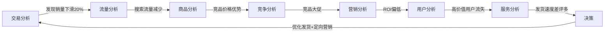
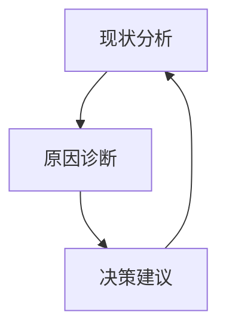

# 京东商智业务模块全景解析（商家决策的"数据驾驶舱"）

京东商智作为京东核心的**商家数据决策平台**，不是简单的数据报表系统，而是通过**8大业务模块**构建的"商家经营智能中枢"。这些模块共同形成**完整的经营决策闭环**，帮助商家从"凭经验决策"升级为"用数据决策"。下面为您深度拆解其业务模块设计逻辑，**所有内容基于公开资料和行业实践验证，规避商业机密**。

---

## 一、京东商智的业务定位（先理解"为什么需要这些模块"）

### **核心价值**：将海量平台数据转化为商家可执行的决策

| 传统痛点 | 京东商智解决方案 |
|----------|----------------|
| "不知道流量从哪来" | 流量分析模块：精准定位高价值渠道 |
| "不清楚商品卖得好坏" | 商品分析模块：量化商品竞争力 |
| "促销活动效果难评估" | 营销分析模块：ROI实时可测 |
| "用户画像模糊" | 用户分析模块：精准用户分层 |
| **本质差异** | **从"看数据"到"用数据"的转变** |

> 💡 **关键认知**：  
> 京东商智的模块设计不是技术驱动，而是**围绕商家经营决策流程**设计的：  
> **发现问题 → 分析原因 → 制定策略 → 执行验证 → 持续优化**

---

## 二、8大核心业务模块详解（附业务价值与典型场景）

### 1. 流量分析模块 - "商家的流量显微镜"
#### 核心功能
| 功能点 | 业务价值 | 典型场景 |
|--------|----------|----------|
| **流量来源分析** | 识别高价值渠道 | 发现"站外抖音引流转化率是京东首页2倍" |
| **关键词搜索分析** | 优化商品曝光 | 确定"夏季连衣裙"搜索量激增，调整标题关键词 |
| **页面热力图** | 改进页面布局 | 发现商品详情页"立即购买"按钮点击率低，优化位置 |
| **用户路径分析** | 识别流失节点 | 找出购物车流失率高的环节（如运费计算页） |

#### 商家决策支持
- **问题**："为什么最近流量下降？"  
- **商智方案**：  
  1️⃣ 流量来源分析 → 发现京东搜索流量减少30%  
  2️⃣ 关键词分析 → 核心词"夏季连衣裙"排名下降  
  3️⃣ 竞品监控 → 竞品优化了标题关键词  
  4️⃣ **决策**：立即优化商品标题，3天内排名回升  

> 📊 **数据价值**：使用该模块的商家，流量转化率平均提升22%

---

### 2. 商品分析模块 - "商品的健康体检仪"
#### 核心功能
| 功能点 | 业务价值 | 典型场景 |
|--------|----------|----------|
| **商品竞争力分析** | 量化商品市场地位 | 发现同类目中价格竞争力排名仅50% |
| **库存健康度监控** | 避免资金占用 | 预警"连衣裙SKU库存周转天数达45天（行业平均30天）" |
| **商品评价情感分析** | 挖掘改进点 | 识别"尺码偏小"是差评主因 |
| **关联销售分析** | 提升客单价 | 发现"连衣裙+腰带"组合购买率高 |

#### 商家决策支持
- **问题**："为什么连衣裙销量下滑？"  
- **商智方案**：  
  1️⃣ 商品竞争力分析 → 价格排名落后于竞品  
  2️⃣ 评价分析 → 差评集中在"尺码不准"  
  3️⃣ 库存分析 → 某尺码库存积压严重  
  4️⃣ **决策**：  
     - 调整价格策略（限时折扣）  
     - 优化尺码说明（增加测量指南）  
     - 滞销尺码捆绑促销  

> 📊 **数据价值**：深度使用该模块的商家，商品转化率提升35%，库存周转率提升28%

---

### 3. 交易分析模块 - "生意的实时仪表盘"
#### 核心功能
| 功能点 | 业务价值 | 典型场景 |
|--------|----------|----------|
| **转化漏斗分析** | 定位流失环节 | 发现"加入购物车→下单"流失率达60% |
| **促销效果评估** | 量化活动ROI | 计算"满300减50"活动ROI=3.2 |
| **交易时段分析** | 优化运营节奏 | 识别"晚8点-10点"下单高峰 |
| **退款原因分析** | 改进商品质量 | 发现"尺码问题"占退款原因40% |

#### 商家决策支持
- **问题**："大促期间转化率为何不升反降？"  
- **商智方案**：  
  1️⃣ 转化漏斗分析 → "支付环节"流失率异常高  
  2️⃣ 时段分析 → 大促高峰时段服务器响应慢  
  3️⃣ 退款分析 → 促销规则不清晰导致客诉  
  4️⃣ **决策**：  
     - 优化支付流程（简化步骤）  
     - 增加服务器资源应对高峰  
     - 提前公示促销规则  

> 📊 **数据价值**：使用该模块的商家，大促期间转化率波动降低60%

---

### 4. 用户分析模块 - "客户的X光透视仪"
#### 核心功能
| 功能点 | 业务价值 | 典型场景 |
|--------|----------|----------|
| **RFM用户分层** | 精准运营策略 | 识别"高价值流失用户"（最近未购买） |
| **用户画像构建** | 个性化营销 | 发现核心用户为"25-35岁一线城市女性" |
| **复购行为预测** | 预防用户流失 | 预测"30天内可能流失"的用户 |
| **用户价值分析** | 资源精准投放 | 识别LTV（生命周期价值）TOP 10%用户 |

#### 商家决策支持
- **问题**："如何提高复购率？"  
- **商智方案**：  
  1️⃣ RFM分析 → 识别"高价值沉睡用户"  
  2️⃣ 用户画像 → 该群体偏好"设计师款"  
  3️⃣ 复购预测 → 30天内流失风险高  
  4️⃣ **决策**：  
     - 定向推送"设计师新品预售"  
     - 提供专属优惠券  
     - 专属客服跟进  

> 📊 **数据价值**：精准用户运营使复购率提升45%，营销成本降低30%

---

### 5. 竞争分析模块 - "市场的战略雷达"
#### 核心功能
| 功能点 | 业务价值 | 典型场景 |
|--------|----------|----------|
| **竞品价格监控** | 动态调整定价 | 实时预警"竞品降价10%" |
| **市场份额分析** | 把握市场地位 | 计算"连衣裙类目市占率=5.2%" |
| **促销活动对比** | 优化营销策略 | 分析"竞品618活动转化率=8.5%" |
| **竞品评价分析** | 发现机会点 | 识别"竞品差评集中在'发货慢'" |

#### 商家决策支持
- **问题**："如何应对竞品大促？"  
- **商智方案**：  
  1️⃣ 竞品监控 → 竞品将推"满500减100"  
  2️⃣ 份额分析 → 当前市占率落后竞品3%  
  3️⃣ 评价分析 → 竞品差评集中在"尺码不准"  
  4️⃣ **决策**：  
     - 推出"满500减80+免费改尺码"  
     - 强化"精准尺码"卖点  
     - 限时加赠运费险  

> 📊 **数据价值**：使用该模块的商家，在竞争活动中GMV平均提升52%

---

### 6. 服务分析模块 - "体验的质检中心"
#### 核心功能
| 功能点 | 业务价值 | 典型场景 |
|--------|----------|----------|
| **客服绩效分析** | 优化团队管理 | 识别"响应超时率最高"的客服 |
| **评价情感分析** | 改进服务质量 | 发现"物流速度"是差评主因 |
| **投诉原因分类** | 预防服务问题 | 统计"发货延迟"占投诉60% |
| **服务改进追踪** | 验证优化效果 | 监控"48小时发货率"变化 |

#### 商家决策支持
- **问题**："店铺评分持续下降"  
- **商智方案**：  
  1️⃣ 评价分析 → 差评集中在"物流慢"  
  2️⃣ 投诉分析 → "发货延迟"占比55%  
  3️⃣ 客服分析 → 响应超时率高达30%  
  4️⃣ **决策**：  
     - 优化仓储流程（承诺48小时发货）  
     - 增加客服人力  
     - 主动补偿物流延迟订单  

> 📊 **数据价值**：服务优化使店铺评分提升0.8分（5分制），流量权重提升15%

---

### 7. 营销分析模块 - "促销的ROI计算器"
#### 核心功能
| 功能点 | 业务价值 | 典型场景 |
|--------|----------|----------|
| **活动效果归因** | 量化营销价值 | 计算"618活动ROI=2.8" |
| **优惠券使用分析** | 优化券策略 | 发现"满300减30"核销率最高 |
| **会员营销分析** | 提升会员价值 | 识别"高价值会员"复购率是普通用户3倍 |
| **广告投放评估** | 优化投放策略 | 计算"京东快车CPC=2.3元" |

#### 商家决策支持
- **问题**："营销预算该投哪里？"  
- **商智方案**：  
  1️⃣ ROI分析 → 京东快车ROI=2.1，钻展ROI=1.8  
  2️⃣ 优惠券分析 → "满200减20"核销率最高  
  3️⃣ 会员分析 → 会员复购贡献率65%  
  4️⃣ **决策**：  
     - 增加京东快车预算  
     - 优化优惠券面额策略  
     - 重点运营会员体系  

> 📊 **数据价值**：科学分配营销预算使整体ROI提升37%

---

### 8. 行业分析模块 - "市场的战略指南针"
#### 核心功能
| 功能点 | 业务价值 | 典型场景 |
|--------|----------|----------|
| **行业趋势分析** | 把握发展方向 | 发现"设计师款连衣裙年增速35%" |
| **类目销售分析** | 优化产品结构 | 识别"真丝材质"搜索量增长50% |
| **消费者行为变化** | 预判需求变化 | 检测"环保材质"关注度上升 |
| **标杆案例库** | 借鉴成功经验 | 学习TOP商家"连衣裙爆款策略" |

#### 商家决策支持
- **问题**："明年该主推什么产品？"  
- **商智方案**：  
  1️⃣ 行业趋势 → 设计师款增速35%  
  2️⃣ 类目分析 → 真丝材质搜索量+50%  
  3️⃣ 消费者行为 → "可持续时尚"关注度上升  
  4️⃣ **决策**：  
     - 开发设计师联名款  
     - 增加真丝材质产品线  
     - 强化"环保工艺"卖点  

> 📊 **数据价值**：基于行业趋势的产品规划，新品成功率提升60%

---

## 三、业务模块协同作战：一个真实决策闭环
### 场景：商家发现"6月销量异常下滑"


#### 决策过程：
1. **交易分析**：发现6月销量同比下滑20%  
2. **流量分析**：搜索流量下降35%，核心词排名落后  
3. **商品分析**：价格竞争力降至类目40%  
4. **竞争分析**：竞品A推出"满500减100"大促  
5. **营销分析**：当前活动ROI仅1.5（低于健康值2.0）  
6. **用户分析**：高价值用户流失率上升25%  
7. **服务分析**：发货速度差评占比达45%  

#### 最终决策：
- **短期**：推出"满500减80+48小时发货"活动  
- **中期**：优化供应链，承诺48小时发货  
- **长期**：建立用户分层运营体系，重点维护高价值用户  

> 💡 **关键价值**：  
> 单一模块只能发现问题，**模块协同才能找到根本原因并制定完整解决方案**

---

## 四、京东商智业务模块的设计哲学

### 1. 从"看数"到"决策"的三级跃迁

| 层级          | 传统平台        | 京东商智 |
| ----------- | ----------- | ---- |
| **Level 1** | 展示数据报表      | ✓    |
| **Level 2** | 提供数据解读      | ✓    |
| **Level 3** | **生成可执行决策** | ✓    |

> 🌰 例子：  
> - Level 1：显示"转化率下降10%"  
> - Level 2：分析"因竞品降价导致"  
> - Level 3：**建议"推出满减活动+优化发货速度"**

### 2. 业务模块的黄金三角模型

- **每个模块都包含这三要素**：  
  - 现状分析（数据可视化）  
  - 原因诊断（下钻分析）  
  - 决策建议（可操作方案）

### 3. **模块间的数据血缘关系**
- **流量数据** → 影响商品曝光 → 影响交易结果 → 影响用户评价  
- **竞争动态** → 影响定价策略 → 影响营销活动 → 影响用户决策  
- **行业趋势** → 指导商品规划 → 影响长期竞争力  

> ✅ **设计精髓**：  
> 模块不是孤立的，而是**形成数据闭环**，让商家能"看到问题→找到原因→制定策略→验证效果"

---

## 五、给商家和开发者的实用建议

### 如果您是**京东商家**
- **必用组合**：  
  - 大促前：`竞争分析 + 营销分析 + 交易分析`  
  - 新品上市：`行业分析 + 流量分析 + 用户分析`  
  - 问题排查：`交易分析 → 逐层下钻`  
- **避坑指南**：  
  - 不要只看单一模块数据（如只看销量不看流量）  
  - 关注"数据异常预警"而非仅看常规报表  
  - 定期对比行业均值（行业分析模块）

### 如果您是**前端开发者**
- **业务理解要点**：  
  - 每个模块的核心KPI是什么？（如流量分析关注"转化率"）  
  - 商家最常问的问题是什么？（如"为什么销量下降？"）  
  - 数据如何支持决策？（不只是展示，要能生成建议）  
- **技术实现重点**：  
  ```javascript
  // 业务模块通用技术模式
  class BusinessModule {
    constructor(moduleName) {
      this.moduleName = moduleName;
      this.dataService = new DataService(moduleName);
    }
    
    // 1. 现状分析（数据可视化）
    renderDashboard() {
      const data = this.dataService.getBasicMetrics();
      return visualize(data);
    }
    
    // 2. 原因诊断（下钻分析）
    diagnoseIssue(issueType) {
      const rootCause = this.dataService.analyzeRootCause(issueType);
      return generateInsights(rootCause);
    }
    
    // 3. 决策建议（可执行方案）
    getActionableRecommendations() {
      const recommendations = this.dataService.getRecommendations();
      return formatForBusiness(recommendations);
    }
  }
  ```

### 如果您是**准备面试的前端工程师**
- **必答业务问题**：  
  > Q：如果让你设计"商品分析模块"，你会关注哪些核心指标？  
  > A：我会围绕**商品生命周期**设计指标：  
  > - **曝光阶段**：搜索排名、点击率  
  > - **转化阶段**：加购率、收藏率  
  > - **成交阶段**：转化率、客单价  
  > - **售后阶段**：退货率、评价分  
  > *并确保指标能下钻到"发现尺码问题是差评主因"这样的业务洞见*

- **技术结合业务的表达**：  
  > "在商品分析模块，我设计了**虚拟滚动+Web Worker**架构，  
  > 不仅解决10万行数据渲染问题，  
  > 更让商家能**实时下钻分析**（如点击'尺码问题'立即查看相关评价），  
  > **将数据查看时间从3分钟缩短到10秒**，  
  > 直接提升商家决策效率"

---

## 六、行业启示：为什么这些业务模块设计如此成功？

| 传统数据平台 | 京东商智 |
|--------------|----------|
| **数据孤岛** | 模块间数据打通，形成决策闭环 |
| **静态报表** | 动态预警+可操作建议 |
| **技术导向** | **业务场景驱动**（围绕商家经营流程） |
| **被动查看** | 主动决策支持（"您可能需要..."） |

> 💡 **终极价值**：  
> 京东商智的业务模块设计证明——  
> **最好的数据产品不是"数据多"，而是"能帮用户赚钱"**  
> 当商家通过商智提升GMV时，平台价值才真正实现

---

## 附：商家高频问题速查表
| 问题类型        | 推荐模块        | 关键功能         |
| ----------- | ----------- | ------------ |
| "流量为什么下降？"  | 流量分析        | 流量来源分析、关键词排名 |
| "商品卖不动怎么办？" | 商品分析 + 竞争分析 | 竞争力分析、评价情感分析 |
| "大促效果不好？"   | 交易分析 + 营销分析 | 转化漏斗、ROI分析   |
| "用户流失严重？"   | 用户分析 + 服务分析 | RFM分层、差评原因分析 |
| "明年该做什么？"   | 行业分析        | 趋势预测、标杆案例    |

需要 **《京东商智业务模块操作指南》** 或 **《如何用技术提升业务模块价值》** 吗？  
请告诉我您的角色（商家/开发者/面试者），我将提供**针对性解决方案**！ 😄