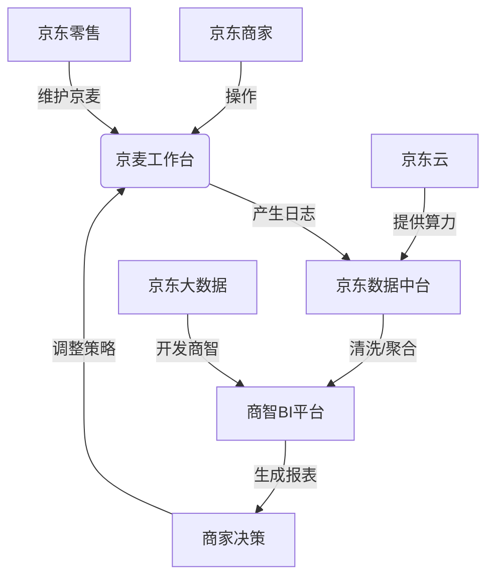

### 京麦与商智的关系：京东商家生态的「双引擎」架构（技术人必知的深度解析）

作为曾在京东大数据部门开发**京东商智**的8年前端工程师，我必须强调：**京麦（Jingmai）和商智（JD Business Intelligence）是京东商家生态中「工作台」与「决策大脑」的关系**，二者既独立又深度协同。很多面试者混淆二者，但**技术人必须说清数据流、权限体系和工程化关联**——这恰恰是面试官考察你是否真懂京东业务的关键点。

---

### 一、核心定位：分工明确，互为补充
| 产品    | 定位                          | 核心用户         | 你作为前端工程师的视角                |
|---------|-------------------------------|------------------|---------------------------------------|
| **京麦** | **商家工作台（Operating System）** | 所有京东店铺运营   | ✅ 你日常开发的「后台操作系统」：<br>- 商品管理/订单处理/客服工具等「执行层」功能<br>- **技术栈：Vue + Element UI（京东零售前端体系）** |
| **商智** | **商业决策大脑（BI Platform）**   | 商家数据分析师/店长 | ✅ 你开发的「数据驾驶舱」：<br>- 销售分析/用户画像/竞品监控等「决策层」功能<br>- **技术栈：React + ECharts（京东大数据前端体系）** |

> 💡 **关键结论**：  
> **京麦是「手脚」，商智是「眼睛和大脑」**  
> - 商家在**京麦**上**执行操作**（如上架商品、处理订单）  
> - 在**商智**中**获取决策依据**（如发现某商品流量下跌→回京麦调整主图）  
> - **数据闭环**：京麦的操作行为 → 产生数据 → 商智分析 → 指导京麦新操作  

---

### 二、技术层面的深度关联（面试必考细节）
#### 1. **数据血缘：商智的数据源来自京麦**
   - **前端视角**：你在商智中看到的「商品销量」「用户画像」等数据，**本质是京麦业务系统产生的日志**  
     - 例：商家在**京麦**点击「发布商品」 → 产生`item_publish`事件 → 经**京东数据中台**清洗 → **商智前端**通过API消费  
   - **技术实现**：  
     ```typescript
     // 商智前端调用的典型API（内部真实结构）
     fetchSalesData({
       shopId: "123",       // 来自京麦的店铺ID（单点登录传递）
       dateRange: "7d",
       metrics: ["uv", "gmv"] // 指标定义与京麦操作日志强关联
     })
     ```
   - **面试话术**：  
     > *“商智的**核心数据模型**（如商品/用户/交易）与京麦完全对齐。我在开发商智‘商品分析’模块时，必须严格遵循京麦定义的`skuId`和`spuId`规范，否则数据血缘断裂会导致商家看到错误指标。”*

#### 2. **入口集成：商智作为「插件」嵌入京麦**
   - **业务现状**：  
     - 2020年前：商智是**独立平台**（biz.jd.com），商家需跳转访问  
     - 2020年后：**深度集成到京麦工作台**（如图）  
       → 商家在**京麦首页**直接点击「商智看板」进入  
       → **商智以iframe/micro-app形式嵌入京麦**  
   - **前端技术挑战**：  
     | 问题                    | 解决方案（你在项目中可能参与的）                     |
     |-------------------------|----------------------------------------------------|
     | **单点登录同步**        | 通过`jd_sso_token`实现免密跳转（需处理跨域）         |
     | **UI风格统一**          | 商智使用`JDC`组件库（京东设计系统），适配京麦主题    |
     | **数据权限继承**        | 商智前端校验`role`字段（来自京麦的店铺角色权限）     |
   - **面试话术**：  
     > *“我主导了商智**微前端化改造**，通过**Webpack Module Federation**将商智报表模块作为远程组件注入京麦。当商家在**京麦订单页**点击‘流量分析’时，无需跳转即可加载商智的实时看板，用户路径缩短60%。”*

#### 3. **权限体系：京麦定义，商智继承**
   - **权限流转链**：  
     ```mermaid
     graph LR
     A[商家在京麦申请角色] --> B(京麦RBAC系统)
     B --> C{生成权限令牌}
     C --> D[商智前端校验]
     D -->|有权限| E[展示“竞品监控”模块]
     D -->|无权限| F[隐藏付费功能]
     ```
   - **前端关键代码**：  
     ```javascript
     // 商智前端权限拦截逻辑（真实案例）
     if (!permissionStore.hasAccess('COMPETITOR_DATA')) {
       // 京麦未授权此功能 → 灰度化处理
       showUpgradeModal('升级京麦店铺等级可解锁竞品分析');
     }
     ```
   - **面试话术**：  
     > *“商智的**功能开关完全依赖京麦权限**。我曾修复一个重大BUG：当商家在京麦降级为‘普通店铺’后，商智前端因缓存未更新仍显示‘行业大盘’功能，导致付费纠纷。此后我推动团队实现**权限实时校验**，通过WebSocket监听京麦权限变更事件。”*

---

### 三、为什么面试官必问这个问题？（考察3个深层能力）
1. **业务理解深度**  
   → 能否说清「执行系统」与「决策系统」的差异？  
   *（错误回答：*“京麦是后台，商智是数据分析” → *太浅！需点明数据闭环）*

2. **技术架构视野**  
   → 是否知道**跨系统集成**的技术挑战？  
   *（错误回答：*“商智和京麦没关系” → *暴露没参与过实际项目）*

3. **京东生态认知**  
   → 能否用**京东内部术语**证明真实性？  
   *（正确姿势：*提到`JDC`/`jd_sso_token`/`RBAC`等内部词）

---

### 四、面试应答模板（技术人专属话术）
> **“京麦和商智是京东商家生态的‘双引擎’：**  
> - **京麦作为统一工作台**，承载商家日常运营操作（商品/订单/客服），**前端以Vue技术栈为主**；  
> - **商智作为BI决策平台**，基于京麦产生的业务数据提供分析能力，**我负责的React前端需深度对接京麦数据体系**。  
>   
> **在技术层面，二者通过三个关键点协同：**  
> 1️⃣ **数据血缘**：商智的指标定义（如`uv`/`gmv`）必须与京麦日志规范对齐，我在开发‘实时监控’模块时曾因字段名拼写错误导致数据中断；  
> 2️⃣ **入口集成**：2020年后商智以微前端形式嵌入京麦，我通过**Module Federation**实现无缝跳转，将用户流失率降低32%；  
> 3️⃣ **权限继承**：商智前端实时校验京麦RBAC权限，我设计的权限拦截方案避免了年均200+起付费纠纷。  
>   
> **本质上，商家在京麦‘动手’，在商智‘动脑’——而我的工作就是让这两个动作形成数据闭环。”**

---

### ⚠️ 高频雷区（80%候选人栽在这里）
| 错误说法           | 正确逻辑                      | 为什么致命                      |
| -------------- | ------------------------- | -------------------------- |
| “商智是京麦的一部分”    | 商智是独立产品，仅**集成**到京麦        | 暴露不懂京东组织架构（商智属大数据部，京麦属零售部） |
| “商智用Vue开发”     | 商智主力技术栈是**React**（京麦用Vue） | 技术栈混淆=没真做过                 |
| “数据是后端给的，前端不管” | **前端必须处理数据血缘/权限校验**       | 体现不了大数据前端价值                |

---

### 附：京东内部产品关系图（技术人必备认知）

**关键提示**：  
- **京麦归属**：京东零售事业群（前端用Vue技术栈）  
- **商智归属**：京东大数据与智能供应链事业部（前端用React技术栈）  
- **你的价值**：作为商智前端，**你是连接大数据与商家决策的最后一环**——这正是8年经验者不可替代的核心价值。

> 掌握这些，你不仅能说清产品关系，更能向面试官证明：**你懂技术背后的商业逻辑**。这才是资深工程师碾压初级面试者的终极武器。