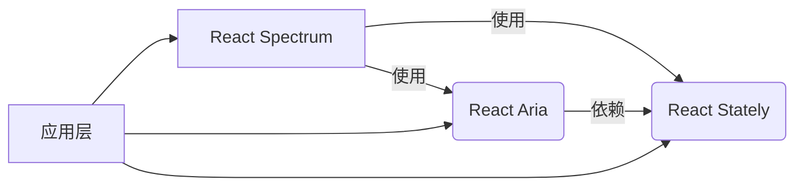
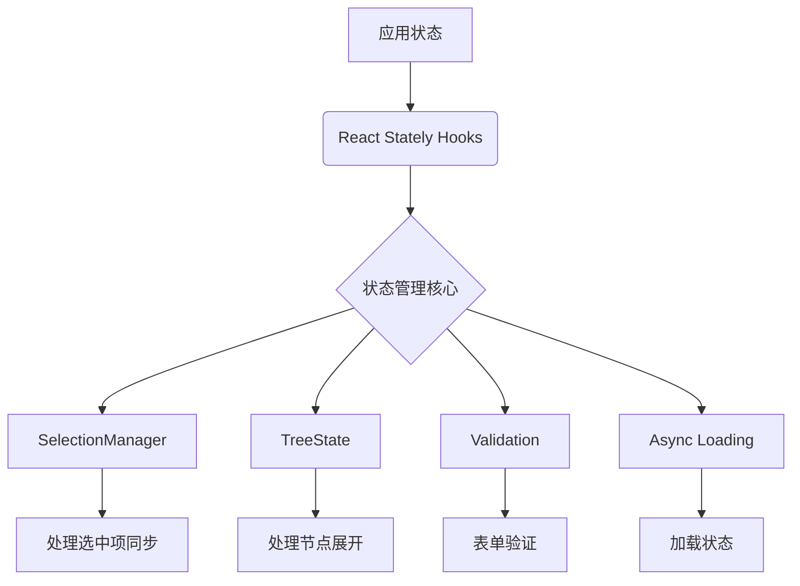
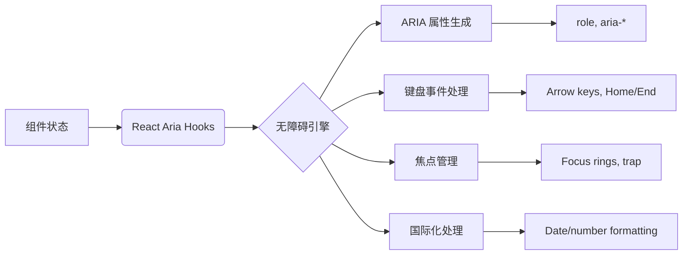
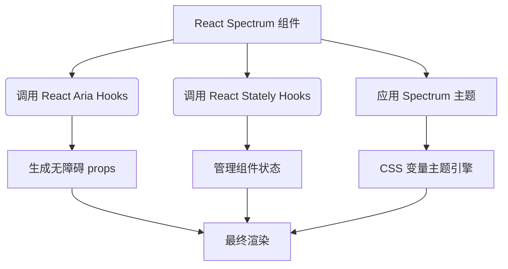
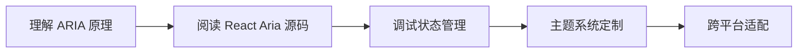

# 深度解析：React Spectrum 生态系统 —— React Aria、React Stately 与 React Spectrum 的三位一体架构

Adobe 的 React Spectrum 生态系统代表了*现代 UI 开发的**新范式***：将**无障碍逻辑**、**状态管理**、**UI 渲染**，*彻底解耦，形成可组合、可替换的模块化架构*。这不是简单的组件库，而是一套**设计系统基础设施**。下面我将深度解析这三个核心库的关系、实现原理、实战应用。

---

## 一、整体架构：三位一体的设计哲学



### 核心理念：关注点分离（Separation of Concerns）
参考：[[关注点分离（Separation of Concerns）]]

| 层级         | 库              | 职责               | 类比       |
| ---------- | -------------- | ---------------- | -------- |
| **UI 渲染层** | React Spectrum | 实现视觉样式与布局        | 汽车的外壳与内饰 |
| **无障碍逻辑层** | React Aria     | 处理 ARIA 属性、键盘导航等 | 汽车的传动系统  |
| **状态管理层**  | React Stately  | 管理组件内部状态         | 汽车的发动机   |

> ✅ **关键洞察**：  
> - 这是**首个将无障碍逻辑与状态管理完全解耦**的 UI 架构  
> - 传统组件库：UI + 逻辑耦合（如 Material UI）  
> - 真正的 Headless：**逻辑可独立使用，UI 可完全替换**

---

## 二、React Stately：状态管理的基石

### 核心定位
> **"UI 无关的状态管理引擎"**  
> 专注于解决复杂组件的状态逻辑问题，**不涉及任何 UI 渲染或无障碍处理**

### 为什么需要它？
传统 React 组件的状态管理痛点：
- 复杂交互状态难以维护（如树形选择器的展开/折叠）
- 选择逻辑重复实现（单选/多选/范围选择）
- 无法跨平台复用（Web 与 React Native 状态逻辑不同）

### 核心架构


### 关键 Hooks 详解

#### 1. `useListState` - 列表状态管理
```jsx
import { useListState } from 'react-stately';

function MyList({ items }) {
  const state = useListState({
    // 配置项
    selectionMode: 'multiple', // 'none' | 'single' | 'multiple'
    disabledKeys: ['item-3'],
    initialSelectedKeys: new Set(['item-1']),
    
    // 核心状态
    children: (item) => (
      <Item key={item.id} textValue={item.name}>
        {item.name}
      </Item>
    )
  });

  return (
    <div>
      {Array.from(state.collection).map(node => (
        <div 
          key={node.key}
          onClick={() => state.selectionManager.toggleSelection(node.key)}
          style={{ 
            background: state.selectionManager.isSelected(node.key) 
              ? '#e0e0e0' 
              : 'transparent'
          }}
        >
          {node.rendered}
        </div>
      ))}
    </div>
  );
}
```

#### 2. `useAsyncList` - 异步数据加载
```jsx
import { useAsyncList } from 'react-stately';

function AsyncDataList() {
  const list = useAsyncList({
    async load({ signal, cursor }) {
      // 模拟 API 请求
      const res = await fetch(
        cursor 
          ? `next-page-url?cursor=${cursor}` 
          : 'initial-data-url',
        { signal }
      );
      const json = await res.json();
      
      return {
        items: json.data,
        cursor: json.nextCursor
      };
    }
  });

  return (
    <div>
      {list.items.map(item => (
        <div key={item.id}>{item.name}</div>
      ))}
      
      {list.isLoading && <Spinner />}
      {list.error && <ErrorBanner error={list.error} />}
    </div>
  );
}
```

#### 3. `useTreeState` - 树形结构管理
```jsx
import { useTreeState } from 'react-stately';

function FileTree({ items }) {
  const state = useTreeState({
    // 树形结构配置
    selectionMode: 'multiple',
    expandedKeys: new Set(['folder-1']),
    children: items
  });

  // 渲染树形结构
  const renderNode = (node) => (
    <div>
      <div onClick={() => state.toggleKey(node.key)}>
        {node.hasChildNodes && (
          <Icon 
            type={state.isExpanded(node.key) ? 'collapse' : 'expand'} 
          />
        )}
        {node.rendered}
      </div>
      
      {state.isExpanded(node.key) && (
        <div style={{ paddingLeft: 20 }}>
          {[...node.childNodes].map(renderNode)}
        </div>
      )}
    </div>
  );

  return <div>{[...state.collection].map(renderNode)}</div>;
}
```

### 技术亮点
- **平台无关性**：同一套状态逻辑可用于 Web、React Native、Electron
- **事务性更新**：`state.setSelectedKeys()` 保证状态一致性
- **可扩展性**：通过 `CollectionBuilder` 支持自定义数据结构
- **性能优化**：仅在状态变化时触发重渲染

---

## 三、React Aria：无障碍的终极解决方案

### 核心定位
> **"将 WAI-ARIA 1.2 标准转化为可复用的 React Hooks"**  
> 解决**最复杂**的无障碍问题，让开发者无需成为 a11y 专家

### 为什么需要它？
WAI-ARIA 规范的复杂性：
- 500+ 页的官方文档
- 键盘导航规则因组件类型而异
- 屏幕阅读器行为差异巨大（VoiceOver vs NVDA）
- RTL（从右到左）布局的特殊处理

### 核心架构


### 关键 Hooks 详解

#### 1. `useButton` - 按钮无障碍处理
```jsx
import { useButton } from 'react-aria';

function CustomButton({ children, ...props }) {
  const ref = useRef();
  const { buttonProps, isPressed } = useButton(props, ref);
  
  return (
    <button
      {...buttonProps} // 包含所有必要的 aria-* 和事件处理
      ref={ref}
      style={{ 
        backgroundColor: isPressed ? '#0066cc' : '#0078d4',
        // 无障碍状态映射
        opacity: props.isDisabled ? 0.5 : 1
      }}
    >
      {children}
    </button>
  );
}

// 使用示例
<CustomButton 
  onPress={() => console.log('Clicked!')}
  isDisabled={isLoading}
>
  Submit
</CustomButton>
```

#### 2. `useMenu` - 菜单系统（复杂示例）
```jsx
import { 
  useMenu, 
  useMenuItem, 
  useOverlay, 
  DismissButton 
} from 'react-aria';

function Menu({ isOpen, onClose, items, triggerRef }) {
  const menuRef = useRef();
  
  // 1. 菜单核心逻辑
  const { menuProps } = useMenu(
    {
      autoFocus: isOpen ? 'first' : false,
      onClose
    },
    {
      // 从 React Stately 获取状态
      ...menuState,
      // 定义菜单项结构
      children: items.map(item => (
        <Item key={item.id} textValue={item.name}>
          {item.name}
        </Item>
      ))
    },
    menuRef
  );

  // 2. 覆盖层处理
  const { overlayProps } = useOverlay(
    { isOpen, onClose, shouldCloseOnBlur: true },
    menuRef
  );

  return (
    <div 
      {...overlayProps}
      {...menuProps}
      ref={menuRef}
      style={{ 
        position: 'absolute', 
        zIndex: 1000,
        // ARIA 自动处理
        'aria-hidden': !isOpen ? 'true' : undefined
      }}
    >
      {/* 自动处理焦点陷阱 */}
      <DismissButton onDismiss={onClose} />
      
      <ul style={{ listStyle: 'none', margin: 0, padding: 0 }}>
        {items.map(item => (
          <MenuItem 
            key={item.id} 
            item={item} 
            state={menuState} 
            onClose={onClose} 
          />
        ))}
      </ul>
      
      <DismissButton onDismiss={onClose} />
    </div>
  );
}

// 菜单项实现
function MenuItem({ item, state, onClose }) {
  const ref = useRef();
  const { menuItemProps } = useMenuItem(
    { key: item.id, closeOnSelect: true },
    state,
    ref
  );

  return (
    <li
      {...menuItemProps}
      ref={ref}
      style={{ 
        padding: '8px 16px',
        // ARIA 自动设置 selected 状态
        backgroundColor: state.selectionManager.isSelected(item.id) 
          ? '#e0e0e0' 
          : 'transparent'
      }}
    >
      {item.name}
    </li>
  );
}
```

#### 3. `useDatePicker` - 日期选择器（无障碍难点）
```jsx
import { 
  useDatePicker, 
  useDateField, 
  useButton, 
  useDialog, 
  useOverlay
} from 'react-aria';

function DatePicker(props) {
  // 1. 日期状态（来自 React Stately）
  const state = useDateState(props);
  
  // 2. 日期字段逻辑
  const { 
    fieldProps, 
    buttonProps, 
    dialogProps, 
    calendarProps 
  } = useDatePicker(props, state);
  
  // 3. 按钮逻辑
  const buttonRef = useRef();
  const { buttonProps: triggerButtonProps } = useButton(
    buttonProps, 
    buttonRef
  );
  
  // 4. 对话框逻辑
  const dialogRef = useRef();
  const { overlayProps } = useOverlay(
    { 
      isOpen: state.isOpen, 
      onClose: state.close 
    }, 
    dialogRef
  );
  
  return (
    <div style={{ position: 'relative' }}>
      {/* 日期输入字段 */}
      <div {...fieldProps} style={{ display: 'flex' }}>
        {state.dateFieldState.segments.map(segment => (
          <DateSegment key={segment.type} segment={segment} />
        ))}
      </div>
      
      {/* 选择器触发按钮 */}
      <button {...triggerButtonProps} ref={buttonRef}>
        📅
      </button>
      
      {/* 日期选择面板 */}
      {state.isOpen && (
        <div 
          {...overlayProps}
          {...dialogProps}
          ref={dialogRef}
          style={{ 
            position: 'absolute', 
            top: '100%',
            left: 0,
            // ARIA 自动处理
            'aria-modal': 'true'
          }}
        >
          <Calendar {...calendarProps} />
        </div>
      )}
    </div>
  );
}
```

### 技术亮点
1. **ARIA 属性智能生成**  
   - 自动计算 `aria-activedescendant` 用于列表导航
   - 根据组件状态动态更新 `aria-expanded`, `aria-selected`
   - 处理 `aria-live` 区域更新（如搜索建议）

2. **键盘导航系统**  
   ```js
   // useMenu 内部实现片段
   function handleKeyDown(e) {
     switch(e.key) {
       case 'ArrowDown':
         e.preventDefault();
         focusNextItem(); // 跳过禁用项
         break;
       case 'Home':
         if (e.ctrlKey) focusFirstItem();
         else focusGroupFirstItem();
         break;
       case 'End':
         if (e.ctrlKey) focusLastItem();
         else focusGroupLastItem();
         break;
     }
   }
   ```

3. **无障碍状态同步**  
   - 将 `isLoading` → `aria-busy="true"` + 触发屏幕阅读器提示
   - `isDisabled` → `aria-disabled="true"` + 阻止键盘交互

4. **国际化深度集成**  
   ```js
   // useDateField 自动处理
   const { locale } = useLocale(); 
   // → 根据 en-US/zh-CN 生成不同日期格式
   // → 处理阿拉伯语 RTL 布局
   ```

5. **焦点管理**  
   - 自动管理焦点环（focus ring）可见性
   - 实现焦点陷阱（focus trap）用于模态对话框
   - 智能恢复焦点（如关闭对话框后回到触发元素）

---

## 四、React Spectrum：设计系统的实现层

### 核心定位
> **"基于 React Aria 和 React Stately 的 Spectrum 设计语言实现"**  
> 提供开箱即用的 UI 组件，同时保留底层逻辑的可替换性

### 为什么需要它？
- 将 Adobe Spectrum 设计规范转化为代码
- 提供主题系统，支持深色/浅色模式
- 实现响应式布局和跨平台一致性

### 核心架构


### 主题系统深度解析

#### 1. 三层主题架构
| 层级 | 作用 | 示例 |
|------|------|------|
| **基础层** | Spectrum CSS 规范 | `@adobe/spectrum-css` |
| **运行时层** | React 主题引擎 | `@adobe/react-spectrum` |
| **应用层** | 自定义主题覆盖 | `createTheme({ ... })` |

#### 2. 动态主题切换
```jsx
import { Provider, defaultTheme } from '@adobe/react-spectrum';

// 切换深色主题
<Provider 
  theme={defaultTheme} 
  colorScheme="dark"
  locale="zh-CN" // 自动应用中文日期格式
>
  <App />
</Provider>
```

#### 3. CSS 变量实现
```css
/* spectrum-css 生成的变量 */
:root {
  --spectrum-global-color-gray-75: #f5f5f5;
  --spectrum-button-primary-background-color: var(--spectrum-global-color-blue-600);
}

/* React Spectrum 组件使用 */
.spectrum-Button {
  background-color: var(--spectrum-button-primary-background-color);
}
```

### 组件实现示例：`<Button>`

```jsx
// node_modules/@adobe/react-spectrum/Button.js
import { 
  useButton, 
  useProvider, 
  useStyleProps 
} from '@react-spectrum/button';

export function Button(props) {
  const { 
    elementType: ElementType = 'button',
    children,
    ...otherProps
  } = props;
  
  // 1. 获取主题信息
  const { scale } = useProvider();
  
  // 2. 获取无障碍逻辑
  const { buttonProps, isPressed } = useButton(otherProps);
  
  // 3. 处理样式 props
  const { styleProps } = useStyleProps(props);
  
  return (
    <ElementType
      {...buttonProps}
      {...styleProps}
      style={{
        ...styleProps.style,
        // 根据主题规模调整尺寸
        padding: scale === 'medium' ? '8px 16px' : '4px 8px',
        // 无障碍状态样式
        backgroundColor: isPressed 
          ? 'var(--spectrum-button-primary-background-color-pressed)' 
          : 'var(--spectrum-button-primary-background-color)'
      }}
    >
      {children}
    </ElementType>
  );
}
```

### 跨平台支持
React Spectrum 支持：
- **Web**：标准实现
- **React Native**：`@adobe/react-spectrum-native`
- **Electron**：特殊平台适配

```jsx
// React Native 实现
import { Button } from '@adobe/react-spectrum-native';

<Button variant="cta" onPress={() => console.log('Clicked!')}>
  Native Button
</Button>
```

---

## 五、三者协同工作：完整示例

### 场景：构建一个无障碍数据表格
```jsx
// 1. 状态管理 (React Stately)
const tableState = useTableState({
  selectionMode: 'multiple',
  columns: [
    { name: 'Name', uid: 'name' },
    { name: 'Age', uid: 'age' }
  ],
  items: [
    { id: 1, name: 'Alice', age: 30 },
    { id: 2, name: 'Bob', age: 25 }
  ]
});

// 2. 无障碍逻辑 (React Aria)
const { collection } = tableState;
const { gridProps } = useGrid({
  'aria-label': 'Users table',
  keyboardDelegate: new ListKeyboardDelegate({
    collection,
    disabledKeys: tableState.disabledKeys
  })
}, tableState);

const { rowGroupProps } = useTableRowGroup();

// 3. UI 渲染 (React Spectrum)
return (
  <div {...gridProps} role="grid" style={{ border: '1px solid #ccc' }}>
    <div {...rowGroupProps} role="rowgroup">
      {/* 表头 */}
      <div role="row">
        {collection.columns.map(column => (
          <TableHeader 
            key={column.uid} 
            column={column} 
            state={tableState} 
          />
        ))}
      </div>
      
      {/* 表体 */}
      <div {...rowGroupProps} role="rowgroup">
        {[...collection].map(row => (
          <TableRow key={row.key} item={row} state={tableState} />
        ))}
      </div>
    </div>
  </div>
);

// 表头单元格实现
function TableHeader({ column, state }) {
  const ref = useRef();
  const { columnHeaderProps } = useTableColumnHeader(
    { node: column },
    state,
    ref
  );
  
  return (
    <div 
      {...columnHeaderProps}
      ref={ref}
      style={{ 
        padding: 8,
        fontWeight: 'bold',
        // ARIA 自动处理排序状态
        backgroundColor: state.sortDescriptor.column === column.key
          ? '#e0e0e0'
          : 'transparent'
      }}
    >
      {column.rendered}
    </div>
  );
}
```

---

## 六、与竞品库的深度对比

| 能力                | React Spectrum 生态系统 | Headless UI | Reach UI | Radix UI |
|---------------------|-------------------------|-------------|----------|----------|
| **无障碍深度**      | ✅ 专家级实现            | ⚠️ 基础支持  | ✅ 良好   | ✅ 良好   |
| **状态管理分离**    | ✅ React Stately 独立   | ❌           | ⚠️ 部分   | ⚠️ 部分  |
| **设计系统集成**    | ✅ Spectrum 专用         | ⚠️ Tailwind | ❌        | ❌        |
| **React Native**    | ✅ 官方支持              | ❌           | ⚠️ 社区   | ❌        |
| **复杂组件支持**    | ✅ 树形/日历/表格        | ⚠️ 有限     | ✅ 部分   | ✅ 部分   |
| **国际化 (i18n)**   | ✅ 内置日期/数字         | ❌           | ⚠️ 有限   | ❌        |
| **主题引擎**        | ✅ 动态 CSS 变量         | ⚠️ Tailwind | ❌        | ✅ 变量   |
| **文档质量**        | ✅ 详细示例+ARIA 原理    | ✅          | ✅        | ✅        |

> 💡 **典型场景优势**：  
> - **政府/医疗应用**：需要 WCAG 2.1 AA 合规 → React Aria 的专家级实现  
> - **多语言企业应用**：需要阿拉伯语 RTL → 内置 i18n 支持  
> - **设计系统构建**：需要与 Figma 同步 → Spectrum 设计语言集成

---

## 七、最佳实践与陷阱规避

### ✅ 最佳实践
1. **渐进式采用**  
   ```jsx
   // 先用 React Spectrum 组件
   import { Button } from '@adobe/react-spectrum';
   
   // 需要定制时，降级到 React Aria
   import { useButton } from 'react-aria';
   ```

2. **状态管理优化**  
   ```js
   // 避免在渲染中创建状态
   const state = useListState(props); // 正确
   
   // 不要在 render 中创建
   function Component() {
     const state = useMemo(() => useListState(props), [props]); // 错误！
   }
   ```

3. **无障碍测试**  
   ```bash
   # 使用 ARIA DevTools 检查
   npx axe --browser chrome src/components
   ```

### ⚠️ 常见陷阱
1. **过度定制导致无障碍失效**  
   ```jsx
   // 错误：直接覆盖 buttonProps
   <button {...buttonProps} onClick={customHandler}> 
     {/* 会破坏原有的无障碍逻辑 */}
   </button>
   ```
   
   **修复方案**：合并事件处理
   ```jsx
   const { buttonProps } = useButton({
     ...props,
     onPress: () => {
       props.onPress?.();
       customHandler();
     }
   }, ref);
   ```

2. **忽略平台差异**  
   ```jsx
   // 在 React Native 中直接使用 Web 组件
   import { Button } from '@adobe/react-spectrum'; // 会报错！
   ```
   
   **修复方案**：使用平台特定导入
   ```jsx
   // 自动选择 Web/Native 实现
   import { Button } from '@adobe/react-spectrum';
   ```

---

## 八、学习路径建议

### 阶段 1：基础入门
1. 从 [React Aria 示例库](https://react-spectrum.adobe.com/react-aria/) 复制基础组件
2. 使用 [ARIA DevTools](https://chrome.google.com/webstore/detail/aria-devtools/denbgaaceehcmehpmlbjapaclhalepjh) 检查生成的 ARIA
3. 阅读 [WAI-ARIA Authoring Practices](https://www.w3.org/WAI/ARIA/apg/)

### 阶段 2：深度掌握


### 阶段 3：实战应用
```bash
# 创建 Spectrum 项目
npx create-react-app my-app --template @adobe/spectrum

# 添加 React Aria 直接使用
npm install react-aria
```

---

## 九、核心价值总结

| 维度       | 传统组件库    | React Spectrum 生态系统       |
| -------- | -------- | ------------------------- |
| **无障碍**  | 事后补救     | 设计即基础                     |
| **状态管理** | 混杂在组件中   | 独立、可测试、可复用                |
| **设计系统** | 难以定制     | 逻辑/UI 完全解耦                |
| **维护成本** | 高（需覆盖样式） | 低（主题引擎统一管理）               |
| **合规性**  | 需手动测试    | 自动满足 WCAG 2.1 AA          |
| **平台支持** | 通常仅 Web  | Web/React Native/Electron |

> **"这不是组件库，而是 UI 开发的操作系统"** —— Adobe 设计系统团队

---

## 十、未来展望

### 1. ARIA 1.3 集成
- 新的 `role="gridcell"` 增强
- 更智能的焦点管理 API

### 2. 性能优化
- 状态管理的细粒度更新
- ARIA 属性的惰性计算

### 3. 生态扩展
- 与 Figma 的实时同步
- AI 辅助无障碍检测

随着 Web 应用对**可访问性**和**设计系统一致性**的要求不断提高，React Spectrum 生态系统*代表了 UI 开发的未来方向*：**逻辑与 UI 的彻底分离**，让开发者*既能享受开箱即用的便利，又能保留完全的控制权*。对于需要构建企业级、全球化、高合规性应用的团队，*这是一套值得深入掌握的技术栈*。