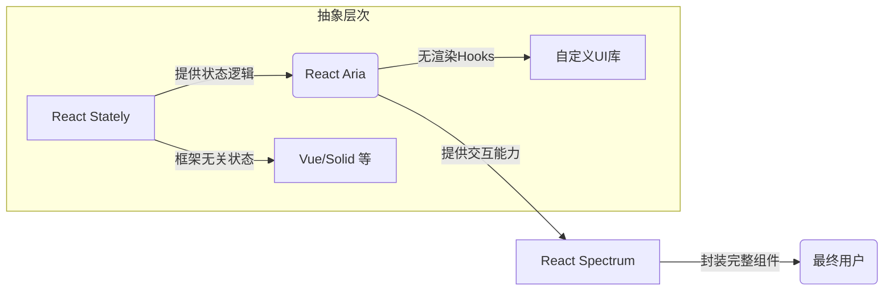

### React Aria、React Stately 与 React Spectrum：Adobe 开源三件套详解  

这三者同属 **Adobe 开源生态**，针对不同层次的前端需求，形成互补的技术矩阵：

---

#### **1. React Aria**  
**定位**：可访问性交互原语层  
**核心价值**：提供符合 WAI-ARIA 标准的交互逻辑实现  
```bash
npm install @react-aria/*
```

- **技术特点**  
  - 🎯 **无渲染（Headless）Hooks**：如 `useButton()`, `useSelect()`  
  - ♿️ **自动生成 ARIA 属性**：管理角色(role)、状态(aria-*)和键盘导航  
  - 🌐 **跨设备支持**：统一处理鼠标、键盘、触摸和屏幕阅读器事件  
  - 🧩 **状态反馈**：返回 `isHovered`, `isFocused` 等交互状态  

- **典型代码**  
  ```jsx
  import { useButton } from '@react-aria/button';
  
  function AccessibleButton(props) {
    const ref = useRef();
    const { buttonProps } = useButton(props, ref);
    return <button {...buttonProps} ref={ref} />;
  }
  ```

---

#### **2. React Stately**  
**定位**：跨框架状态管理引擎  
**核心价值**：解耦组件状态逻辑与渲染层  
```bash
npm install @react-stately/*
```

- **技术特点**  
  - ⚙️ **状态机驱动**：基于有限状态机（FSM）管理复杂交互流程  
  - 🔄 **框架无关设计**：状态逻辑可复用于 React/Vue/Solid 等框架  
  - 📊 **数据集合处理**：提供 `useListState`, `useTreeState` 等钩子  
  - 🧠 **异步状态支持**：内置加载状态、分页等异步操作管理  

- **典型代码**  
  ```jsx
  import { useToggleState } from '@react-stately/toggle';
  
  function CheckboxLogic(props) {
    const state = useToggleState(props);
    // state.isSelected 可用于任何 UI 框架
  }
  ```

---

#### **3. React Spectrum**  
**定位**：企业级 UI 组件库  
**核心价值**：开箱即用的高可访问性设计系统  
```bash
npm install @react-spectrum/*
```

- **技术特点**  
  - 🎨 **完整设计规范**：基于 Adobe Spectrum 设计语言  
  - 🧩 **预制组件**：提供 60+ 生产级组件（表格、日期选择器等）  
  - 📱 **响应式自适应**：移动/桌面/平板自动适配  
  - 🌍 **深度国际化**：支持 RTL 和 30+ 语言  
  - 🧪 **严格可访问性**：通过 WCAG 2.1 AA 认证  

- **典型组件**  
  ```jsx
  import { Provider, Button } from '@adobe/react-spectrum';
  
  <Provider theme={darkTheme} locale="ar-AE">
    <Button variant="accent" onPress={handleClick}>
      إرسال  {/* 阿拉伯语示例 */}
    </Button>
  </Provider>
  ```

---

### 三者关系图解  


---

### 协作流程示例：构建自定义选择器  
1. **React Stately** 管理状态  
   ```jsx
   import { useSelectState } from '@react-stately/select';
   const state = useSelectState({ items: options });
   ```

2. **React Aria** 处理交互  
   ```jsx
   import { useSelect } from '@react-aria/select';
   const { labelProps, triggerProps } = useSelect(props, state, ref);
   ```

3. **开发者** 组合渲染  
   ```jsx
   // 自由实现UI，可接入任意CSS框架
   return (
     <div>
       <div {...labelProps}>选择国家</div>
       <button {...triggerProps}>
         {state.selectedItem?.name}
       </button>
     </div>
   );
   ```

4. **React Spectrum** 直接使用预制组件  
   ```jsx
   <Select label="国家">
     <Item key="cn">中国</Item>
     <Item key="us">美国</Item>
   </Select>
   ```

---

### 技术栈对比表  
| 维度               | React Aria         | React Stately       | React Spectrum       |
|--------------------|--------------------|---------------------|----------------------|
| **核心功能**       | 交互逻辑/ARIA属性  | 状态管理            | 完整组件库           |
| **UI 耦合度**      | 无渲染             | 无UI               | 带样式组件           |
| **设计约束**       | 无                 | 无                 | 遵循 Spectrum 规范   |
| **使用场景**       | 自定义组件开发     | 跨框架状态共享     | 快速搭建企业应用     |
| **包体积典型值**   | 5-10KB/组件        | 3-5KB/状态机       | 100KB+ (全量)       |

---

### 何时选择哪种技术？  
- 🛠️ **需要深度定制 UI**：  
  `React Aria` + `React Stately`  
  *例：自建设计系统的公司*
  
- ⚡️ **快速开发企业应用**：  
  直接使用 `React Spectrum`  
  *例：内部管理系统、合规性要求高的项目*
  
- 🌐 **跨框架组件开发**：  
  `React Stately` 共享核心逻辑 + 各框架实现  
  *例：开发多框架支持的组件库*

---

### 官方资源  
- [React Spectrum 设计系统](https://react-spectrum.adobe.com/)  
- [React Aria 文档](https://react-spectrum.adobe.com/react-aria/)  
- [GitHub 生态仓库](https://github.com/adobe/react-spectrum)  
- [状态机可视化工具](https://stately.ai/)（协作项目）

> 💡 **关键洞察**：三者形成从原子逻辑(`Stately`) → 交互层(`Aria`) → 完整组件(`Spectrum`)的渐进式解决方案，覆盖从底层定制到快速开发的全场景需求。