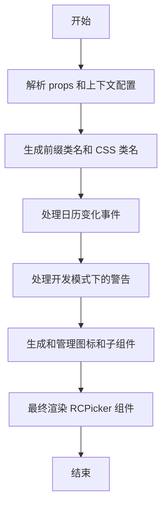

## getPicker 代码功能解释

这段 TypeScript 代码定义了一个 `getPicker` 函数，用于生成日期选择器组件。主要功能包括：

1. **参数解析**：解析传入的 `props` 和上下文中的配置。
2. **样式和类名处理**：根据配置生成前缀类名、CSS 类名和样式。
3. **事件处理**：处理日历变化事件，并兼容旧版 `onSelect` 事件。
4. **警告提示**：在开发模式下，对不推荐使用的属性和用法发出警告。
5. **图标和组件**：生成和管理日期选择器的图标和子组件。
6. **最终渲染**：将所有配置和处理结果传递给 `RCPicker` 组件进行渲染。

### 控制流图

### 详细解释

1. **参数解析**：
    
    - 解析传入的 `props` 和上下文中的配置，提取出各种属性和方法。
2. **样式和类名处理**：
    
    - 根据配置生成前缀类名、CSS 类名和样式，确保组件的样式正确应用。
3. **事件处理**：
    
    - 处理日历变化事件 `onCalendarChange`，并兼容旧版 `onSelect` 事件。
4. **警告提示**：
    
    - 在开发模式下，对不推荐使用的属性和用法发出警告，帮助开发者及时更新代码。
5. **图标和组件**：
    
    - 生成和管理日期选择器的图标和子组件，确保组件的完整性和功能性。
6. **最终渲染**：
    
    - 将所有配置和处理结果传递给 `RCPicker` 组件进行渲染，生成最终的日期选择器组件。