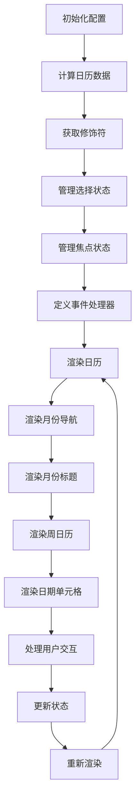

## 代码功能解释

这段 TypeScript 代码定义了一个名为 `DayPicker` 的 React 组件，用于渲染日期选择器日历。主要功能包括：

1. **初始化配置**：通过 `useMemo` 计算并缓存组件所需的配置，如日期库、格式化函数、标签、类名等。
2. **状态管理**：使用 `useCalendar`、`useGetModifiers`、`useSelection` 和 `useFocus` 等自定义 Hook 管理日历的状态和行为。
3. **事件处理**：定义了多个事件处理器，如点击、聚焦、键盘操作等，用于响应用户的交互。
4. **渲染日历**：根据配置和状态，渲染日历的各个部分，包括月份导航、周日历、日期单元格等。

## 控制流图

### 控制流图说明

1. **初始化配置**：计算并缓存组件所需的配置。
2. **计算日历数据**：生成日历的月份、周和日期数据。
3. **获取修饰符**：为每个日期单元格计算修饰符，如是否选中、是否禁用等。
4. **管理选择状态**：处理日期的选择状态。
5. **管理焦点状态**：处理日期单元格的焦点状态。
6. **定义事件处理器**：定义各种事件处理器，如点击、聚焦、键盘操作等。
7. **渲染日历**：根据配置和状态，渲染整个日历。
8. **渲染月份导航**：渲染月份导航按钮。
9. **渲染月份标题**：渲染月份标题，支持下拉选择。
10. **渲染周日历**：渲染周日历，显示星期几。
11. **渲染日期单元格**：渲染每个日期单元格。
12. **处理用户交互**：处理用户的点击、聚焦、键盘操作等交互。
13. **更新状态**：根据用户交互更新状态。
14. **重新渲染**：状态更新后重新渲染日历。