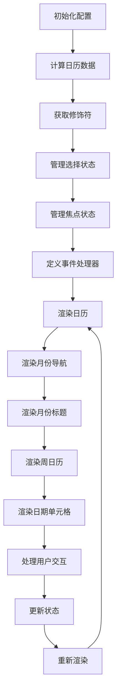

# DayPicker.tsx 代码功能解释

这段 TypeScript 代码定义了一个名为  `DayPicker`  的 React 组件，用于渲染日期选择器日历。主要功能包括：

1. **初始化配置**：通过  `useMemo`  计算并缓存组件所需的配置，如日期库、格式化函数、标签、类名等。
2. **状态管理**：使用  `useCalendar`、`useGetModifiers`、`useSelection`  和  `useFocus`  等自定义 Hook 管理日历的状态和行为。使用  `useSelection`  和  `useFocus`  钩子管理选中的日期和焦点状态。
3. **事件处理**：定义了各种事件处理函数，如点击、聚焦、模糊、键盘操作等，用于处理用户与日期选择器的交互。
4. **渲染日历**：根据配置和状态，渲染日历的各个部分，包括月份导航、周日历、日期单元格等。使用  `useCalendar`  钩子生成日历数据，包括月份、周数、天数等。


---

### 初始化配置：

使用  `useMemo`  计算并返回组件所需的配置对象，包括日期库、格式化器、标签、类名等。

- **输入**：`props`  对象，包含组件的各种属性。

- **输出**：配置对象，包括  `components`、`formatters`、`labels`、`dateLib`、`locale`  和  `classNames`。

  - **components**: 包含自定义组件的对象，这些组件可以用于替换或扩展  `DayPicker`  中的默认组件。
  - **formatters**: 包含用于格式化日期和其他数据的函数对象。
  - **labels**: 包含用于显示文本标签的对象，例如月份名称、周几等。
  - **dateLib**: 一个  `DateLib`  实例，用于处理日期相关的逻辑，如日期计算、格式化等。
  - **locale**: 包含本地化配置的对象，用于支持多语言和地区的显示。
  - **classNames**: 包含类名的对象，用于自定义组件的样式。

- **逻辑**：
  - 合并默认的  `locale`  和  `props.locale`。
  - 创建  `dateLib`  实例，配置包括 locale 和一些日历相关的设置。
  - 获取组件、格式化器、标签和类名。

```tsx
const { components, formatters, labels, dateLib, locale, classNames } =
  useMemo(() => {
    const locale = { ...defaultLocale, ...props.locale };

    const dateLib = new DateLib(
      {
        locale,
        weekStartsOn: props.broadcastCalendar ? 1 : props.weekStartsOn,
        firstWeekContainsDate: props.firstWeekContainsDate,
        useAdditionalWeekYearTokens: props.useAdditionalWeekYearTokens,
        useAdditionalDayOfYearTokens: props.useAdditionalDayOfYearTokens,
      },
      props.dateLib
    );

    return {
      dateLib,
      components: getComponents(props.components),
      formatters: getFormatters(props.formatters),
      labels: { ...defaultLabels, ...props.labels },
      locale,
      classNames: { ...getDefaultClassNames(), ...props.classNames },
    };
  }, [
    props.classNames,
    props.components,
    props.dateLib,
    props.firstWeekContainsDate,
    props.formatters,
    props.labels,
    props.locale,
    props.useAdditionalDayOfYearTokens,
    props.useAdditionalWeekYearTokens,
    props.weekStartsOn,
    props.broadcastCalendar,
  ]);
```

### 解构赋值：

- 从  `props`  中解构出多个属性，包括  `captionLayout`、`mode`、`onDayBlur`、`onDayClick`  等。
- 从  `formatters`  对象中解构出多个格式化函数，如  `formatCaption`、`formatDay`  等。

```tsx
const {
  captionLayout,
  mode,
  onDayBlur,
  onDayClick,
  onDayFocus,
  onDayKeyDown,
  onDayMouseEnter,
  onDayMouseLeave,
  onNextClick,
  onPrevClick,
  showWeekNumber,
  styles,
} = props;

/** 解构赋值从formatters对象中提取多个格式化函数 */
const {
  formatCaption, // 用于格式化标题的函数
  formatDay, // 用于格式化日期的函数
  formatMonthDropdown, // 用于格式化月度下拉菜单的函数
  formatWeekNumber, // 用于格式化周数的函数
  formatWeekNumberHeader, // 用于格式化周数头部的函数
  formatWeekdayName, // 用于格式化星期名称的函数
  formatYearDropdown, // 用于格式化年度下拉菜单的函数
} = formatters;
```

### 生成日历数据：

使用  [[useCalendar()]]  钩子生成日历数据。

- **输入**：`props`  和  `dateLib`。
- **输出**：日历数据对象，包括  `days`、`months`、`navStart`、`navEnd`、`previousMonth`、`nextMonth`  和  `goToMonth`。

  - days： 日历中要显示的天的数组，CalendarDay数组，包括上、下个月的天，包括多个月的天
  - months：月份数组 CalendarMonth\[\]；渲染UI的数据
  - navStart： 导航起始点，用于确定日历显示的开始月份
  - navEnd： 导航结束点，用于确定日历显示的结束月份
  - previousMonth： 上一个月
  - nextMonth： 下一个月
  - goToMonth：函数，用于直接导航到指定的月份

- **逻辑**：
  - 根据  `props`  和  `dateLib`  生成日历数据。

```tsx
const calendar = useCalendar(props, dateLib);

const { days, months, navStart, navEnd, previousMonth, nextMonth, goToMonth } =
  calendar;
```

### 管理选中状态：

使用  `useSelection`  钩子，管理选中的日期状态。从 useSelection 钩子中获取所需函数和状态。useSelection 是一个自定义钩子，用于处理选择逻辑，它接受 props 和一个日期库作为参数

- **输入**：`props`  和  `dateLib`。
- **输出**：选中状态对象，包括  `isSelected`、`select`  和  `selectedValue`。
- **逻辑**：
  - 根据  `props`  和  `dateLib`  管理选中的日期。

```tsx
const {
  isSelected,
  select,
  selected: selectedValue,
} = useSelection(props, dateLib) ?? {};
```

### 管理焦点状态：

使用  `useFocus`  钩子，管理焦点状态。

- **输入**：`props`、`calendar`、`getModifiers`、`isSelected`  和  `dateLib`。
- **输出**：焦点状态对象，包括  `blur`、`focused`、`isFocusTarget`、`moveFocus`  和  `setFocused`。
- **逻辑**：
  - 根据  `props`  和其他状态管理焦点。

```tsx
const { blur, focused, isFocusTarget, moveFocus, setFocused } = useFocus(
  props,
  calendar,
  getModifiers,
  isSelected ?? (() => false),
  dateLib
);
```

### 定义事件处理函数：

定义了各种事件处理函数，用于处理用户与日期选择器的交互。如点击、聚焦、模糊、键盘操作等。

- **事件处理函数**：
  - `handlePreviousClick`：处理前一个月的点击事件。
  - `handleNextClick`：处理后一个月的点击事件。
  - `handleDayClick`：处理日期点击事件。
  - `handleDayFocus`：处理日期聚焦事件。
  - `handleDayBlur`：处理日期模糊事件。
  - `handleDayKeyDown`：处理日期键盘事件。
  - `handleDayMouseEnter`：处理日期鼠标进入事件。
  - `handleDayMouseLeave`：处理日期鼠标离开事件。
  - `handleMonthChange`：处理月份选择改变事件。
  - `handleYearChange`：处理年份选择改变事件。
- **逻辑**：
  - 每个事件处理函数根据相应的事件类型更新状态或调用回调函数。

### 渲染日历组件：

- 根据配置和状态，渲染日历的各个部分，包括导航、月份标题、周数、日期按钮等。
- 渲染的组件包括  `Root`、`Months`、`Nav`、`Month`、`MonthCaption`、`MonthGrid`、`Weekdays`、`Week`、`Day`  和  `Footer`。

- **渲染组件**：
	- `Root`：根容器。
	- `Months`：月份容器。
	- `Nav`：导航栏。
	- `Month`：单个月份。
	- `MonthCaption`：月份标题。
	- `MonthGrid`：月份网格。
	- `Weekdays`：星期标题。
	- `Week`：单周。
	- `Day`：单日。
	- `Footer`：底部内容。

- **逻辑**：
	- 根据  `props`  和状态，动态生成并渲染日历的各个部分。

	- 使用 `dayPickerContext.Provider` 来提供上下文数据。
	- 渲染日历的根组件 `components.Root`，并在其中渲染月份组件 `components.Months`。
	- 在月份组件中，渲染导航按钮 `components.Nav` 和每个月的日历 `components.Month`。
	- 在每个月的日历中，渲染月份标题 `components.MonthCaption` 和日期单元格 `components.Day`。

```mermaid
flowchart TD
    A[开始] --> B[初始化配置]
    B --> B1[合并默认locale]
    B1 --> B2[创建dateLib实例]
    B2 --> B3[获取components, formatters, labels, classNames]
    B3 --> C[生成日历数据]
    C --> C1[调用useCalendar]
    C1 --> C2[生成days, months, navStart, navEnd, previousMonth, nextMonth, goToMonth]
    C2 --> D[管理选中状态]
    D --> D1[调用useSelection]
    D1 --> D2[返回isSelected, select, selectedValue]
    D2 --> E[管理焦点状态]
    E --> E1[调用useFocus]
    E1 --> E2[返回blur, focused, isFocusTarget, moveFocus, setFocused]
    E2 --> F[定义事件处理函数]
    F --> F1[定义handlePreviousClick]
    F1 --> F2[定义handleNextClick]
    F2 --> F3[定义handleDayClick]
    F3 --> F4[定义handleDayFocus]
    F4 --> F5[定义handleDayBlur]
    F5 --> F6[定义handleDayKeyDown]
    F6 --> F7[定义handleDayMouseEnter]
    F7 --> F8[定义handleDayMouseLeave]
    F8 --> F9[定义handleMonthChange]
    F9 --> F10[定义handleYearChange]
    F10 --> G[渲染日历组件]
    G --> G1[渲染Root容器]
    G1 --> G2[渲染Months容器]
    G2 --> G3[渲染Nav导航栏]
    G3 --> G4[渲染Month单个月份]
    G4 --> G5[渲染MonthCaption月份标题]
    G5 --> G6[渲染MonthGrid月份网格]
    G6 --> G7[渲染Weekdays星期标题]
    G7 --> G8[渲染Week单周]
    G8 --> G9[渲染Day单日]
    G9 --> G10[渲染Footer底部内容]
    G10 --> H[结束]
```





## 控制流图



### 控制流图说明

1. **初始化配置**：计算并缓存组件所需的配置。
2. **计算日历数据**：生成日历的月份、周和日期数据。
3. **获取修饰符**：为每个日期单元格计算修饰符，如是否选中、是否禁用等。
4. **管理选择状态**：处理日期的选择状态。
5. **管理焦点状态**：处理日期单元格的焦点状态。
6. **定义事件处理器**：定义各种事件处理器，如点击、聚焦、键盘操作等。
7. **渲染日历**：根据配置和状态，渲染整个日历。
8. **渲染月份导航**：渲染月份导航按钮。
9. **渲染月份标题**：渲染月份标题，支持下拉选择。
10. **渲染周日历**：渲染周日历，显示星期几。
11. **渲染日期单元格**：渲染每个日期单元格。
12. **处理用户交互**：处理用户的点击、聚焦、键盘操作等交互。
13. **更新状态**：根据用户交互更新状态。
14. **重新渲染**：状态更新后重新渲染日历。
