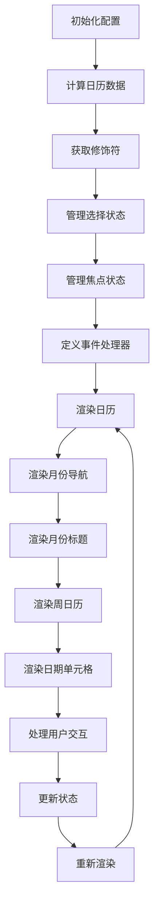
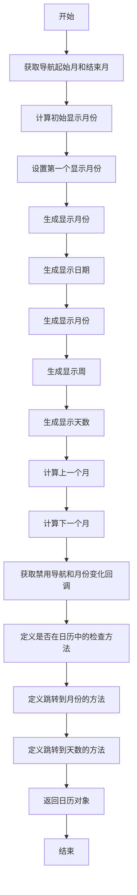

```mermaid
flowchart TD
    A[开始] --> B[初始化配置]
    B --> B1[合并默认locale]
    B1 --> B2[创建dateLib实例]
    B2 --> B3[获取components, formatters, labels, classNames]
    B3 --> C[生成日历数据]
    C --> C1[调用useCalendar]
    C1 --> C2[生成days, months, navStart, navEnd, previousMonth, nextMonth, goToMonth]
    C2 --> D[管理选中状态]
    D --> D1[调用useSelection]
    D1 --> D2[返回isSelected, select, selectedValue]
    D2 --> E[管理焦点状态]
    E --> E1[调用useFocus]
    E1 --> E2[返回blur, focused, isFocusTarget, moveFocus, setFocused]
    E2 --> F[定义事件处理函数]
    F --> F1[定义handlePreviousClick]
    F1 --> F2[定义handleNextClick]
    F2 --> F3[定义handleDayClick]
    F3 --> F4[定义handleDayFocus]
    F4 --> F5[定义handleDayBlur]
    F5 --> F6[定义handleDayKeyDown]
    F6 --> F7[定义handleDayMouseEnter]
    F7 --> F8[定义handleDayMouseLeave]
    F8 --> F9[定义handleMonthChange]
    F9 --> F10[定义handleYearChange]
    F10 --> G[渲染日历组件]
    G --> G1[渲染Root容器]
    G1 --> G2[渲染Months容器]
    G2 --> G3[渲染Nav导航栏]
    G3 --> G4[渲染Month单个月份]
    G4 --> G5[渲染MonthCaption月份标题]
    G5 --> G6[渲染MonthGrid月份网格]
    G6 --> G7[渲染Weekdays星期标题]
    G7 --> G8[渲染Week单周]
    G8 --> G9[渲染Day单日]
    G9 --> G10[渲染Footer底部内容]
    G10 --> H[结束]
```

"react-day-picker": "8.10.1",

# 目录结构

这个 TypeScript 文件  `DayPicker.tsx`  是一个 React 组件的实现，用于渲染日期选择器日历。它依赖于多个外部文件和目录，每个文件和目录的作用如下：

- **DayPicker.tsx**：这是  `DayPicker`  组件的**主文件**，定义了组件的结构和逻辑。
- **UI.ts**：提供了一些用于渲染的常量和样式类名。
- **useCalendar.ts**：提供了一个自定义 Hook，用于管理日历的状态。
- **classes/**
  - **CalendarDay.ts**：定义了  `CalendarDay`  类，用于表示日期信息。
  - **DateLib.ts**：提供了一个日期库，用于处理日期相关的操作。
- **helpers/**：包含多个辅助函数，用于获取类名、组件、数据属性、默认类名、格式化函数、月份选项、样式、星期几、年份选项等。
- **labels/**：包含默认的标签文本。
- **types/**：定义了各种类型，用于类型检查和类型安全。
- **utils/**：包含一些实用函数，用于判断日期范围等。
- **useDayPicker.ts**：提供了一个上下文（Context），用于在组件树中传递日期选择器的配置。
- **useFocus.ts**：提供了一个自定义 Hook，用于管理焦点状态。
- **useGetModifiers.ts**：提供了一个自定义 Hook，用于获取日期单元格的修饰符。
- **useSelection.ts**：提供了一个自定义 Hook，用于管理日期选择状态。

通过这些文件和目录的协作，`DayPicker`  组件能够实现复杂的日期选择功能，并提供良好的用户体验。

# DayPicker.tsx 代码功能解释

这段 TypeScript 代码定义了一个名为  `DayPicker`  的 React 组件，用于渲染日期选择器日历。主要功能包括：

1. **初始化配置**：通过  `useMemo`  计算并缓存组件所需的配置，如日期库、格式化函数、标签、类名等。
2. **状态管理**：使用  `useCalendar`、`useGetModifiers`、`useSelection`  和  `useFocus`  等自定义 Hook 管理日历的状态和行为。使用  `useSelection`  和  `useFocus`  钩子管理选中的日期和焦点状态。
3. **事件处理**：定义了各种事件处理函数，如点击、聚焦、模糊、键盘操作等，用于处理用户与日期选择器的交互。
4. **渲染日历**：根据配置和状态，渲染日历的各个部分，包括月份导航、周日历、日期单元格等。使用  `useCalendar`  钩子生成日历数据，包括月份、周数、天数等。

## 控制流图



### 控制流图说明

1. **初始化配置**：计算并缓存组件所需的配置。
2. **计算日历数据**：生成日历的月份、周和日期数据。
3. **获取修饰符**：为每个日期单元格计算修饰符，如是否选中、是否禁用等。
4. **管理选择状态**：处理日期的选择状态。
5. **管理焦点状态**：处理日期单元格的焦点状态。
6. **定义事件处理器**：定义各种事件处理器，如点击、聚焦、键盘操作等。
7. **渲染日历**：根据配置和状态，渲染整个日历。
8. **渲染月份导航**：渲染月份导航按钮。
9. **渲染月份标题**：渲染月份标题，支持下拉选择。
10. **渲染周日历**：渲染周日历，显示星期几。
11. **渲染日期单元格**：渲染每个日期单元格。
12. **处理用户交互**：处理用户的点击、聚焦、键盘操作等交互。
13. **更新状态**：根据用户交互更新状态。
14. **重新渲染**：状态更新后重新渲染日历。

---

15. **初始化配置**：

    - 通过  `useMemo`  计算并返回组件所需的配置对象，包括日期库、格式化器、标签、类名等。
    - 配置对象包括  `dateLib`、`components`、`formatters`、`labels`、`locale`  和  `classNames`。

16. **生成日历数据**：

    - 使用  `useCalendar`  钩子生成日历数据，包括月份、周数、天数等。
    - 返回的数据包括  `days`、`months`、`navStart`、`navEnd`、`previousMonth`、`nextMonth`  和  `goToMonth`。

17. **管理选中状态**：

    - 使用  `useSelection`  钩子管理选中的日期状态。
    - 返回的对象包括  `isSelected`、`select`  和  `selectedValue`。

18. **管理焦点状态**：

    - 使用  `useFocus`  钩子管理焦点状态。
    - 返回的对象包括  `blur`、`focused`、`isFocusTarget`、`moveFocus`  和  `setFocused`。

19. **定义事件处理函数**：

    - 定义了各种事件处理函数，如点击、聚焦、模糊、键盘操作等，用于处理用户与日期选择器的交互。
    - 包括  `handlePreviousClick`、`handleNextClick`、`handleDayClick`、`handleDayFocus`、`handleDayBlur`、`handleDayKeyDown`、`handleDayMouseEnter`  和  `handleDayMouseLeave`。

20. **渲染日历组件**：

    - 根据配置和状态，渲染日历的各个部分，包括导航、月份标题、周数、日期按钮等。
    - 渲染的组件包括  `Root`、`Months`、`Nav`、`Month`、`MonthCaption`、`MonthGrid`、`Weekdays`、`Week`、`Day`  和  `Footer`。

---

#### 初始化配置：

使用  `useMemo`  计算并返回组件所需的配置对象，包括日期库、格式化器、标签、类名等。

- **输入**：`props`  对象，包含组件的各种属性。
- **输出**：配置对象，包括  `components`、`formatters`、`labels`、`dateLib`、`locale`  和  `classNames`。
  - **components**: 包含自定义组件的对象，这些组件可以用于替换或扩展  `DayPicker`  中的默认组件。
  - **formatters**: 包含用于格式化日期和其他数据的函数对象。
  - **labels**: 包含用于显示文本标签的对象，例如月份名称、周几等。
  - **dateLib**: 一个  `DateLib`  实例，用于处理日期相关的逻辑，如日期计算、格式化等。
  - **locale**: 包含本地化配置的对象，用于支持多语言和地区的显示。
  - **classNames**: 包含类名的对象，用于自定义组件的样式。
- **逻辑**：
  - 合并默认的  `locale`  和  `props.locale`。
  - 创建  `dateLib`  实例，配置日期库的选项。
  - 获取组件、格式化器、标签和类名。

```tsx
const { components, formatters, labels, dateLib, locale, classNames } =
  useMemo(() => {
    const locale = { ...defaultLocale, ...props.locale };

    const dateLib = new DateLib(
      {
        locale,
        weekStartsOn: props.broadcastCalendar ? 1 : props.weekStartsOn,
        firstWeekContainsDate: props.firstWeekContainsDate,
        useAdditionalWeekYearTokens: props.useAdditionalWeekYearTokens,
        useAdditionalDayOfYearTokens: props.useAdditionalDayOfYearTokens,
      },
      props.dateLib
    );

    return {
      dateLib,
      components: getComponents(props.components),
      formatters: getFormatters(props.formatters),
      labels: { ...defaultLabels, ...props.labels },
      locale,
      classNames: { ...getDefaultClassNames(), ...props.classNames },
    };
  }, [
    props.classNames,
    props.components,
    props.dateLib,
    props.firstWeekContainsDate,
    props.formatters,
    props.labels,
    props.locale,
    props.useAdditionalDayOfYearTokens,
    props.useAdditionalWeekYearTokens,
    props.weekStartsOn,
    props.broadcastCalendar,
  ]);
```

#### 生成日历数据：

使用  `useCalendar`  钩子生成日历数据。

- **输入**：`props`  和  `dateLib`。
- **输出**：日历数据对象，包括  `days`、`months`、`navStart`、`navEnd`、`previousMonth`、`nextMonth`  和  `goToMonth`。

  - days： 日历中的天数组
  - months： 日历中的月份数组
  - navStart： 导航起始点，用于确定日历显示的开始月份
  - navEnd： 导航结束点，用于确定日历显示的结束月份
  - previousMonth： 上一个月
  - nextMonth： 下一个月
  - goToMonth：函数，用于直接导航到指定的月份

- **逻辑**：
  - 根据  `props`  和  `dateLib`  生成日历数据。

```tsx
const calendar = useCalendar(props, dateLib);

const { days, months, navStart, navEnd, previousMonth, nextMonth, goToMonth } =
  calendar;
```

#### 管理选中状态：

使用  `useSelection`  钩子，管理选中的日期状态。从 useSelection 钩子中获取所需函数和状态。useSelection 是一个自定义钩子，用于处理选择逻辑，它接受 props 和一个日期库作为参数

- **输入**：`props`  和  `dateLib`。
- **输出**：选中状态对象，包括  `isSelected`、`select`  和  `selectedValue`。
- **逻辑**：
  - 根据  `props`  和  `dateLib`  管理选中的日期。

```tsx
const {
  isSelected,
  select,
  selected: selectedValue,
} = useSelection(props, dateLib) ?? {};
```

#### 管理焦点状态：

使用  `useFocus`  钩子，管理焦点状态。

- **输入**：`props`、`calendar`、`getModifiers`、`isSelected`  和  `dateLib`。
- **输出**：焦点状态对象，包括  `blur`、`focused`、`isFocusTarget`、`moveFocus`  和  `setFocused`。
- **逻辑**：
  - 根据  `props`  和其他状态管理焦点。

```tsx
const { blur, focused, isFocusTarget, moveFocus, setFocused } = useFocus(
  props,
  calendar,
  getModifiers,
  isSelected ?? (() => false),
  dateLib
);
```

#### 定义事件处理函数：

定义了各种事件处理函数，用于处理用户与日期选择器的交互。

- **事件处理函数**：
  - `handlePreviousClick`：处理前一个月的点击事件。
  - `handleNextClick`：处理后一个月的点击事件。
  - `handleDayClick`：处理日期点击事件。
  - `handleDayFocus`：处理日期聚焦事件。
  - `handleDayBlur`：处理日期模糊事件。
  - `handleDayKeyDown`：处理日期键盘事件。
  - `handleDayMouseEnter`：处理日期鼠标进入事件。
  - `handleDayMouseLeave`：处理日期鼠标离开事件。
  - `handleMonthChange`：处理月份选择改变事件。
  - `handleYearChange`：处理年份选择改变事件。
- **逻辑**：
  - 每个事件处理函数根据相应的事件类型更新状态或调用回调函数。

#### 渲染日历组件：

根据配置和状态，渲染日历的各个部分。

- **渲染组件**：
  - `Root`：根容器。
  - `Months`：月份容器。
  - `Nav`：导航栏。
  - `Month`：单个月份。
  - `MonthCaption`：月份标题。
  - `MonthGrid`：月份网格。
  - `Weekdays`：星期标题。
  - `Week`：单周。
  - `Day`：单日。
  - `Footer`：底部内容。
- **逻辑**：
  - 根据  `props`  和状态，动态生成并渲染日历的各个部分。



# useCalendar()

## 代码功能解释

这段 TypeScript 代码定义了一个名为  `useCalendar`  的自定义 Hook，用于生成和管理日历组件。具体功能如下：

1. **初始化月份范围**：根据传入的属性  `props`  和日期库  `dateLib`  计算导航起始月  `navStart`  和结束月  `navEnd`。
2. **设置初始月份**：计算初始显示月份  `initialMonth`，并使用  `useControlledValue`  管理第一个显示月份  `firstMonth`。
3. **生成显示月份**：根据  `firstMonth`  和  `navEnd`  生成显示的月份  `displayMonths`。
4. **生成日期和周**：根据  `displayMonths`  生成显示的日期  `dates`、月份  `months`  和周  `weeks`。
5. **生成天数**：根据  `months`  生成显示的天数  `days`。
6. **导航功能**：提供  `goToMonth`  和  `goToDay`  方法，用于在日历中导航到指定的月份或天数。
7. **返回日历对象**：返回一个包含所有生成数据和导航方法的日历对象  `calendar`。

## 控制流图



### 详细解释

1. **初始化月份范围**：
    
    - `getNavMonths(props, dateLib)` 计算导航起始月 `navStart` 和结束月 `navEnd`。
2. **设置初始月份**：
    
    - `getInitialMonth(props, dateLib)` 计算初始显示月份 `initialMonth`。
    - 使用 `useControlledValue` 管理第一个显示月份 `firstMonth`，并在 `timeZone` 变化时更新 `firstMonth`。
3. **生成显示月份**：
    
    - `getDisplayMonths(firstMonth, navEnd, props, dateLib)` 根据 `firstMonth` 和 `navEnd` 生成显示的月份 `displayMonths`。
4. **生成日期和周**：
    
    - `getDates(displayMonths, props.endMonth ? endOfMonth(props.endMonth) : undefined, props, dateLib)` 生成显示的日期 `dates`。
    - `getMonths(displayMonths, dates, props, dateLib)` 生成显示的月份 `months`。
    - `getWeeks(months)` 生成显示的周 `weeks`。
5. **生成天数**：
    
    - `getDays(months)` 生成显示的天数 `days`。
6. **导航功能**：
    
    - `getPreviousMonth(firstMonth, navStart, props, dateLib)` 计算上一个月 `previousMonth`。
    - `getNextMonth(firstMonth, navEnd, props, dateLib)` 计算下一个月 `nextMonth`。
    - `goToMonth(date)` 跳转到指定月份，考虑导航限制。
    - `goToDay(day)` 跳转到指定天数，如果不在日历中则跳转到该天数所在的月份。
7. **返回日历对象**：
    
    - 返回一个包含所有生成数据和导航方法的日历对象 `calendar`。


# getInitialMonth()

src/helpers/getInitialMonth.ts

这段代码定义了一个名为 `getInitialMonth` 的函数，用于*根据传入的 `DayPickerProps` 和 `DateLib` 对象计算并返回一个初始月份的日期*。以下是对这段代码的详细解释：

1. **函数签名**：

    ```typescript
    export function getInitialMonth(
      props: Pick<
        DayPickerProps,
        | "fromYear"
        | "toYear"
        | "startMonth"
        | "endMonth"
        | "month"
        | "defaultMonth"
        | "today"
        | "numberOfMonths"
        | "timeZone"
      >,
      dateLib: DateLib
    ): Date {
    ```
    
    这个函数接收两个参数：
    
    - `props`：一个包含 `DayPickerProps` 部分属性的对象，这些属性用于配置日历的显示范围和初始状态。
    - `dateLib`：一个 `DateLib` 对象，提供了日期操作的方法。

2. **解构赋值**：
    
    ```typescript
    const {
      month,
      defaultMonth,
      today = props.timeZone
        ? TZDate.tz(props.timeZone)
        : dateLib.Date
          ? new dateLib.Date()
          : new Date(),
      numberOfMonths = 1,
      endMonth,
      startMonth
    } = props;
    ```
    
    从 `props` 中解构出以下属性：
    
    - `month`：用户指定的月份。
    - `defaultMonth`：默认的月份。
    - `today`：当前日期，如果未指定则根据 `timeZone` 或 `dateLib.Date` 生成。
    - `numberOfMonths`：显示的月份数量，默认为 1。
    - `endMonth`：结束月份。
    - `startMonth`：开始月份。
3. **计算初始月份**：
    
    
    ```typescript
    let initialMonth = month || defaultMonth || today;
    ```
    
    初始月份首先尝试使用 `month`，如果未指定则使用 `defaultMonth`，如果都未指定则使用 `today`。
    
4. **日期库方法解构**：
    
    
    ```typescript
    const { differenceInCalendarMonths, addMonths, startOfMonth } = dateLib;
    ```
    
    从 `dateLib` 中解构出以下方法：
    
    - `differenceInCalendarMonths`：计算两个日期之间的月份差。
    - `addMonths`：在日期上增加指定的月份数。
    - `startOfMonth`：返回指定日期所在月份的第一天。
5. **调整初始月份**：
    
    ```typescript
    // Fix the initialMonth if is after the to-date
    if (endMonth && differenceInCalendarMonths(endMonth, initialMonth) < 0) {
      const offset = -1 * (numberOfMonths - 1);
      initialMonth = addMonths(endMonth, offset);
    }
    // Fix the initialMonth if is before the from-date
    if (startMonth && differenceInCalendarMonths(initialMonth, startMonth) < 0) {
      initialMonth = startMonth;
    }
    ```
    
    如果 `initialMonth` 在 `endMonth` 之后，则将其调整为 `endMonth` 之前的某个月份。如果 `initialMonth` 在 `startMonth` 之前，则将其调整为 `startMonth`。
    
6. **返回结果**：
    
    ```typescript
    return startOfMonth(initialMonth);
    ```
    
    最后，返回调整后的初始月份的第一天。
    

这段代码的主要功能是根据传入的配置计算并返回一个合适的初始月份日期，确保日历的显示范围和初始状态符合用户的期望。

