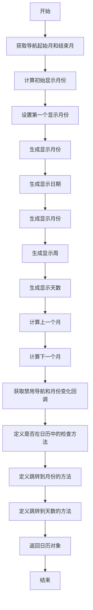

# 代码功能解释

这段代码定义了一个名为 `useCalendar` 的自定义 Hook，**用于生成日历的状态、渲染数据，提供修改状态的函数**。

## 输入

它接受两个参数：`props` 和 `dateLib`。`props` 是一个*包含日历配置*的对象，`dateLib` 是一个日期库对象，提供了一些*日期操作*的方法。

## 输出

## 逻辑、具体功能如下：

1. **初始化月份范围**：根据传入的属性  `props.startMonth`、`props.endMonth` 和日期库  `dateLib`  *计算导航起始月  `navStart`  和结束月  `navEnd`。*
2. **设置初始月份**：计算初始显示月份  `initialMonth`，并使用  `useControlledValue`  管理第一个显示月份  `firstMonth`。
3. **生成显示月份**：根据  `firstMonth`  和  `navEnd`  生成显示的月份  `displayMonths`。
4. **生成日期和周**：根据  `displayMonths`  生成显示的日期  `dates`、月份  `months`  和周  `weeks`。
5. **生成天数**：根据  `months`  生成显示的天数  `days`。
6. **导航功能**：提供  `goToMonth`  和  `goToDay`  方法，用于在日历中导航到指定的月份或天数。
7. **返回日历对象**：返回一个包含所有生成数据和导航方法的日历对象  `calendar`。

# 控制流图

# 详细解释

1. **初始化月份范围**：

   - `getNavMonths(props, dateLib)`  计算导航起始月  `navStart`  和结束月  `navEnd`。

2. **设置初始月份**：

   - `getInitialMonth(props, dateLib)`  计算初始显示月份  `initialMonth`。
   - 使用  `useControlledValue`  管理第一个显示月份  `firstMonth`，并在  `timeZone`  变化时更新  `firstMonth`。

3. **生成显示月份**：

   - `getDisplayMonths(firstMonth, navEnd, props, dateLib)`  根据  `firstMonth`  和  `navEnd`  生成显示的月份  `displayMonths`。

4. **生成日期和周**：

   - `getDates(displayMonths, props.endMonth ? endOfMonth(props.endMonth) : undefined, props, dateLib)`  生成显示的日期  `dates`。
   - `getMonths(displayMonths, dates, props, dateLib)`  生成显示的月份  `months`。
   - `getWeeks(months)`  生成显示的周  `weeks`。

5. **生成天数**：

   - `getDays(months)`  生成显示的天数  `days`。

6. **导航功能**：

   - `getPreviousMonth(firstMonth, navStart, props, dateLib)`  计算上一个月  `previousMonth`。
   - `getNextMonth(firstMonth, navEnd, props, dateLib)`  计算下一个月  `nextMonth`。
   - `goToMonth(date)`  跳转到指定月份，考虑导航限制。
   - `goToDay(day)`  跳转到指定天数，如果不在日历中则跳转到该天数所在的月份。

7. **返回日历对象**：

   - 返回一个包含所有生成数据和导航方法的日历对象  `calendar`。
