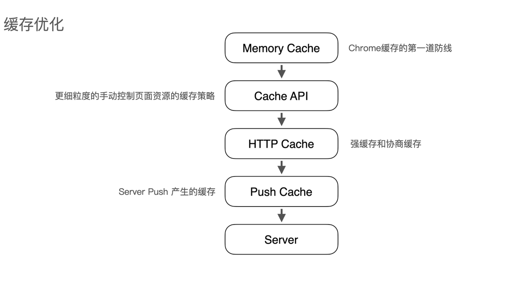
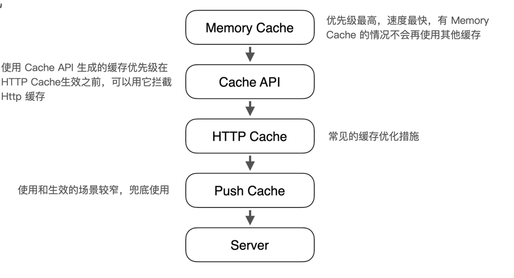

## 优化传统性能指标（01:35）

传统性能指标的优化，通过加载速度衡量性能，那么指标的优化思路就是优化加载速度。

### 优化思路

#### 网络优化

全局生效、一劳永逸的，ROI较高

#### 缓存优化

除了常见的HTTP缓存，还有Memory缓存、Cache API缓存、Push缓存等

#### 资源加载优化

从请求时机、文件体积、加载方式等方向优化。

### 网络优化

#### 开启HTTP/2

关注兼容性问题，同时做好域名收敛。

#### 开启brotli压缩

相比gzip，它具有更高的压缩比和更快的压缩性能。

#### 善用HTTPS

通过有效的优化手段，如Session Resume、OCSP Stapling等等，提升HTTPS性能

#### 使用CDN部署静态资源

有效降低访问延迟，提高静态资源加载速度

#### 提前解析域名

常用于CDN域名场景，减少域名解析耗时。

```html
<link rel="dns-prefetch" href="//cdn.example.com">
```

#### 提前建立网络连接

常用于Server API等场景。包含提前解析域名，兼容性更好。

```html
<link rel="preconnect" href="//example.com">
```

### 缓存优化（06:51）

前端缓存的种类比较多，凡是涉及到数据存储的场景都可以称为缓存。

#### 缓存顺序图





### 资源加载优化（09:48）

从请求时机、文件体积、加载方式等方向优化。

#### 优化HTML文件

- 控制体积在30kb以内

- 优化DOM节点

- 压缩

- 谨慎使用内联

#### 优化JS文件

- 请求时机：defer/async/动态加载

- 文件体积：常规的压缩/Tree Shaking/按需加载/精准控制polyfill...

- 加载方式：减少网络请求/充分利用缓存...

#### 优化CSS文件、字体文件、图片文件

- 请求时机：关键的先请求，次要的后请求

- 文件体积：如何才能让资源的体积更小？

- 加载方式：减少请求数/善用缓存...

[加载速度的优化](https://www.bilibili.com/video/BV1KN4y1G76A/?spm_id_from=333.788&vd_source=22af953ea4c09540ad1966711a2d53f0)
