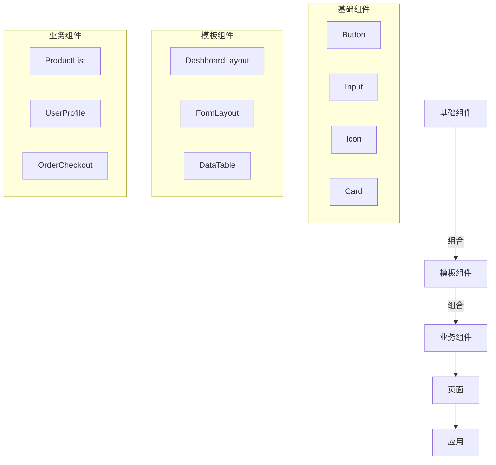
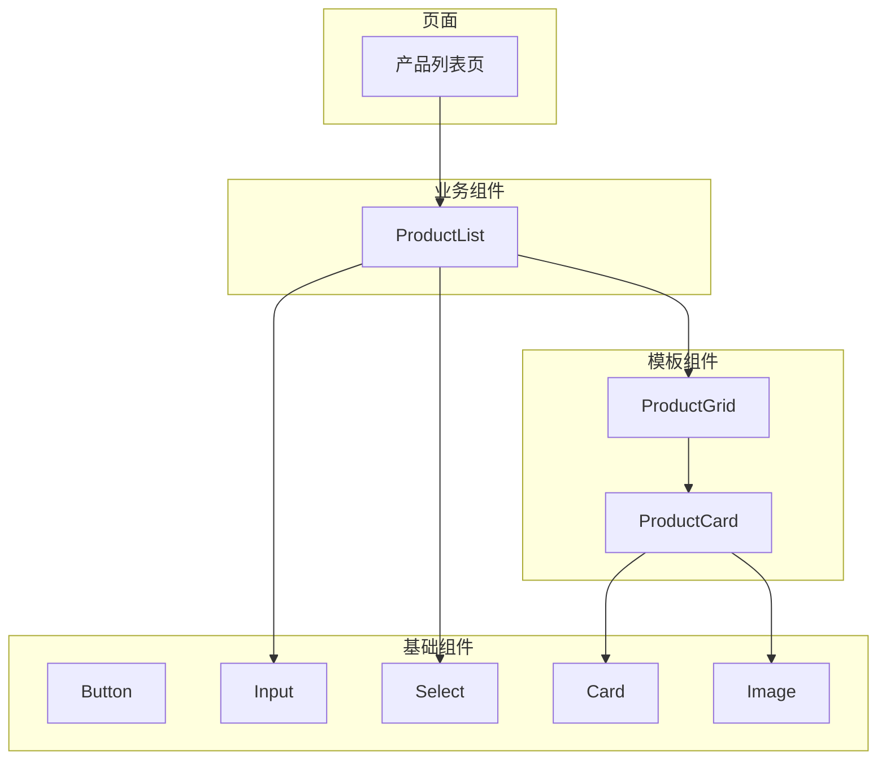

# 🧩 前端组件体系：基础组件、模板组件与业务组件的深度解析

在现代前端开发中，组件化是构建可维护、可扩展应用的核心思想。根据**抽象层级**和**职责范围**，前端组件可分为三大类：**基础组件**、**模板组件**和**业务组件**。理解它们的区别与协作关系，是构建高质量前端架构的关键。

---

## 一、基础组件（Basic/Atomic Components）

### 定义与特点
- **最底层UI元素**：不可再拆分的原子级UI单元
- **零业务逻辑**：只关注UI表现和交互，不涉及业务规则
- **高度复用性**：可在任何项目中直接使用
- **平台无关性**：与具体业务场景解耦
- **标准化设计**：遵循设计系统规范（如Material Design、Ant Design）

### 典型类型
| 类别 | 示例组件 | 职责 |
|------|----------|------|
| **输入类** | Button, Input, Select, Checkbox | 用户输入交互 |
| **展示类** | Icon, Avatar, Badge, Tag | 信息可视化展示 |
| **反馈类** | Loading, Toast, Modal, Alert | 用户操作反馈 |
| **导航类** | Breadcrumb, Pagination, Tabs | 页面导航控制 |

### 代码示例（React）
```jsx
// Button.jsx - 基础组件示例
import React from 'react';
import PropTypes from 'prop-types';

const Button = ({ 
  type = 'primary', 
  size = 'medium', 
  disabled = false,
  children,
  onClick 
}) => {
  const className = `btn btn-${type} btn-${size}${disabled ? ' disabled' : ''}`;
  
  return (
    <button 
      className={className} 
      disabled={disabled}
      onClick={onClick}
    >
      {children}
    </button>
  );
};

Button.propTypes = {
  type: PropTypes.oneOf(['primary', 'secondary', 'danger']),
  size: PropTypes.oneOf(['small', 'medium', 'large']),
  disabled: PropTypes.bool,
  children: PropTypes.node.isRequired,
  onClick: PropTypes.func
};

Button.defaultProps = {
  type: 'primary',
  size: 'medium',
  disabled: false,
  onClick: () => {}
};

export default Button;
```

### 设计原则
1. **单一职责**：只处理UI和基础交互
2. **样式隔离**：使用CSS-in-JS或BEM避免样式污染
3. **无障碍支持**：内置ARIA属性，符合WCAG标准
4. **主题可配置**：支持设计系统主题变量
5. **文档完备**：提供Props说明和使用示例

### 应用场景
- 设计系统/组件库的核心部分（如Ant Design、Element UI）
- 跨项目共享的UI基础元素
- 作为构建更复杂组件的"乐高积木"

---

## 二、模板组件（Template/Layout Components）

### 定义与特点
- **页面结构骨架**：定义页面的布局和组织方式
- **中等抽象层级**：比基础组件高，比业务组件低
- **关注组织而非内容**：规定区域划分，不涉及具体业务
- **组合基础组件**：由多个基础组件构成
- **可配置性强**：通过props调整布局结构

### 典型类型
| 类型 | 示例组件 | 职责 |
|------|----------|------|
| **布局容器** | Layout, Grid, Container | 定义页面整体结构 |
| **区域组件** | Header, Sider, Footer, Content | 页面分区组织 |
| **内容组织** | Card, List, Table, Tabs | 内容区块组织方式 |
| **导航结构** | Breadcrumb, Steps, Menu | 导航路径组织 |

### 代码示例（React）
```jsx
// DashboardLayout.jsx - 模板组件示例
import React from 'react';
import PropTypes from 'prop-types';
import { Layout, Menu, Breadcrumb } from 'antd';

const { Header, Content, Sider } = Layout;

const DashboardLayout = ({ 
  title, 
  breadcrumbItems,
  children,
  menuItems,
  selectedKey 
}) => {
  return (
    <Layout style={{ minHeight: '100vh' }}>
      <Header className="header">
        <div className="logo">{title}</div>
        <Menu 
          theme="dark" 
          mode="horizontal" 
          selectedKeys={[selectedKey]}
          style={{ lineHeight: '64px' }}
        >
          {menuItems.map(item => (
            <Menu.Item key={item.key}>{item.label}</Menu.Item>
          ))}
        </Menu>
      </Header>
      
      <Layout>
        <Sider width={200} style={{ background: '#fff' }}>
          <Menu
            mode="inline"
            selectedKeys={[selectedKey]}
            style={{ height: '100%', borderRight: 0 }}
          >
            {menuItems.map(item => (
              <Menu.Item key={item.key}>{item.label}</Menu.Item>
            ))}
          </Menu>
        </Sider>
        
        <Layout style={{ padding: '0 24px 24px' }}>
          <Breadcrumb style={{ margin: '16px 0' }}>
            {breadcrumbItems.map(item => (
              <Breadcrumb.Item key={item}>{item}</Breadcrumb.Item>
            ))}
          </Breadcrumb>
          
          <Content style={{
            background: '#fff',
            padding: 24,
            margin: 0,
            minHeight: 280
          }}>
            {children}
          </Content>
        </Layout>
      </Layout>
    </Layout>
  );
};

DashboardLayout.propTypes = {
  title: PropTypes.string.isRequired,
  breadcrumbItems: PropTypes.arrayOf(PropTypes.string).isRequired,
  menuItems: PropTypes.arrayOf(PropTypes.shape({
    key: PropTypes.string.isRequired,
    label: PropTypes.string.isRequired
  })).isRequired,
  selectedKey: PropTypes.string,
  children: PropTypes.node.isRequired
};

export default DashboardLayout;
```

### 设计原则
1. **结构抽象**：只定义布局，不关心具体内容
2. **插槽设计**：使用children或具名插槽容纳内容
3. **响应式适配**：支持不同屏幕尺寸的布局变化
4. **可扩展性**：通过props配置调整布局结构
5. **与业务解耦**：不包含任何业务逻辑

### 应用场景
- 应用的整体页面框架
- 特定类型页面的标准化布局（如仪表盘、表单页）
- 复用率高的页面结构模式
- 作为业务组件的容器

---

## 三、业务组件（Business Components）

### 定义与特点
- **业务逻辑载体**：封装特定业务场景的逻辑和UI
- **最高抽象层级**：直接对应产品功能
- **业务强相关**：与具体业务领域紧密耦合
- **组合基础与模板组件**：由低层级组件构建而成
- **状态管理**：通常连接Redux/Vuex等状态管理

### 典型类型
| 类型        | 示例组件                             | 职责       |
| --------- | -------------------------------- | -------- |
| **功能模块**  | UserProfile, ProductList         | 完整业务功能实现 |
| **工作流组件** | OrderCheckout, LoanApplication   | 多步骤业务流程  |
| **数据展示**  | DashboardCharts, AnalyticsReport | 业务数据可视化  |
| **表单组合**  | RegistrationForm, SettingsPanel  | 复杂表单业务逻辑 |

### 代码示例（React + Redux）
```jsx
// ProductList.jsx - 业务组件示例
import React, { useEffect } from 'react';
import { useSelector, useDispatch } from 'react-redux';
import { 
  fetchProducts, 
  selectProducts, 
  selectLoading, 
  selectError 
} from './productSlice';
import { 
  Card, 
  List, 
  Skeleton, 
  Button, 
  message,
  Empty
} from 'antd';
import ProductItem from './ProductItem'; // 业务子组件
import AddProductModal from './AddProductModal'; // 业务子组件

const ProductList = () => {
  const dispatch = useDispatch();
  const products = useSelector(selectProducts);
  const loading = useSelector(selectLoading);
  const error = useSelector(selectError);
  const [isModalVisible, setIsModalVisible] = React.useState(false);

  useEffect(() => {
    dispatch(fetchProducts());
  }, [dispatch]);

  const handleDelete = (productId) => {
    // 业务逻辑：删除产品
    dispatch(deleteProduct(productId))
      .unwrap()
      .then(() => message.success('产品删除成功'))
      .catch(() => message.error('删除失败，请重试'));
  };

  const handleAddProduct = () => {
    setIsModalVisible(true);
  };

  const handleModalCancel = () => {
    setIsModalVisible(false);
  };

  const handleModalSubmit = (values) => {
    dispatch(createProduct(values))
      .unwrap()
      .then(() => {
        message.success('产品创建成功');
        setIsModalVisible(false);
      })
      .catch(err => message.error(err.message || '创建失败'));
  };

  if (error) {
    return (
      <Card>
        <Empty description="加载产品失败" />
        <Button type="primary" onClick={() => dispatch(fetchProducts())}>
          重试
        </Button>
      </Card>
    );
  }

  return (
    <Card 
      title="产品管理" 
      extra={
        <Button type="primary" onClick={handleAddProduct}>
          添加产品
        </Button>
      }
    >
      <List
        loading={loading}
        dataSource={products}
        renderItem={product => (
          <ProductItem 
            product={product} 
            onDelete={handleDelete} 
          />
        )}
        locale={{ emptyText: '暂无产品' }}
      />
      
      <AddProductModal 
        visible={isModalVisible}
        onCancel={handleModalCancel}
        onSubmit={handleModalSubmit}
      />
    </Card>
  );
};

export default ProductList;
```

### 设计原则
1. **业务聚焦**：解决特定业务问题
2. **组合优先**：通过组合低层级组件构建
3. **关注点分离**：UI与业务逻辑适当分离
4. **可测试性**：业务逻辑应可单元测试
5. **文档说明**：清晰描述业务场景和使用方式

### 应用场景
- 具体产品功能的实现
- 业务流程的关键节点
- 需要复用的业务模式
- 领域驱动设计(DDD)中的聚合根组件

---

## **三类组件对比分析**

| 特性 | 基础组件 | 模板组件 | 业务组件 |
|------|----------|----------|----------|
| **抽象层级** | 最低 (原子级) | 中等 (组织级) | 最高 (业务级) |
| **业务耦合度** | 零耦合 | 低耦合 | 高耦合 |
| **复用范围** | 跨项目复用 | 项目内复用 | 特定业务域复用 |
| **变化频率** | 极低 (稳定) | 低 (设计系统更新) | 中高 (随业务迭代) |
| **包含内容** | UI元素+基础交互 | 布局结构+区域组织 | 业务逻辑+UI组合 |
| **依赖关系** | 无依赖 | 依赖基础组件 | 依赖基础+模板组件 |
| **测试重点** | 交互、无障碍 | 布局、响应式 | 业务逻辑、流程 |
| **代码位置** | `src/components/ui/` | `src/components/layout/` | `src/features/xxx/` |

---

## **组件层级关系**（从下到上）



### 组件组合示例（电商应用）



---

## **最佳实践**：构建可维护的组件体系

### 1. 目录结构组织
```
src/
├── components/          # 所有组件
│   ├── ui/              # 基础组件
│   │   ├── buttons/
│   │   ├── inputs/
│   │   └── feedback/
│   ├── layout/          # 模板组件
│   │   ├── dashboard/
│   │   └── forms/
│   └── features/        # 业务组件
│       ├── products/
│       ├── users/
│       └── orders/
├── pages/               # 页面（组合业务组件）
├── store/               # 状态管理
└── hooks/               # 自定义hooks
```

### 2. 组件设计规范
- **基础组件**：遵循设计系统规范，提供完整Props API
- **模板组件**：使用children prop或具名插槽设计
- **业务组件**：拆分为"容器组件"和"展示组件"
  ```jsx
  // ProductList.container.js - 容器组件（业务逻辑）
  // ProductList.presentation.js - 展示组件（纯UI）
  ```

### 3. 代码复用策略
- **基础组件**：发布为独立npm包（如`@company/design-system`）
- **模板组件**：在monorepo中共享
- **业务组件**：通过feature flags控制复用范围

### 4. 文档体系
- **基础组件**：Storybook + 详细API文档
- **模板组件**：布局模式文档 + 使用场景说明
- **业务组件**：业务流程图 + 状态转换说明

---

## 常见反模式与解决方案

### 反模式1：业务逻辑渗入基础组件
```jsx
// 错误示例：基础Button包含业务逻辑
const Button = ({ onClick, isPremiumUser }) => {
  const handleClick = () => {
    if (isPremiumUser) {
      trackPremiumClick(); // 业务逻辑污染
    }
    onClick();
  };
  
  return <button onClick={handleClick}>...</button>;
};
```

**解决方案**：保持基础组件纯净，业务逻辑在业务组件中处理
```jsx
// 正确方式：业务组件处理逻辑
const ProductPurchase = () => {
  const handlePurchase = () => {
    if (user.isPremium) {
      trackPremiumPurchase();
    }
    // ...业务逻辑
  };
  
  return <Button onClick={handlePurchase}>购买</Button>;
};
```

### 反模式2：模板组件包含业务逻辑
```jsx
// 错误示例：DashboardLayout包含产品数据获取
const DashboardLayout = () => {
  const [products, setProducts] = useState([]);
  
  useEffect(() => {
    // 不应该在这里获取业务数据
    fetch('/api/products').then(res => setProducts(res.data));
  }, []);
  
  // ...布局代码
};
```

**解决方案**：模板组件只关注布局，数据获取在业务组件中
```jsx
// 业务组件获取数据并传递给模板
const ProductDashboard = () => {
  const products = useProducts(); // 自定义hook获取业务数据
  
  return (
    <DashboardLayout title="产品管理">
      <ProductList products={products} />
    </DashboardLayout>
  );
};
```

### 反模式3：业务组件过度耦合
```jsx
// 错误示例：巨型业务组件
const SuperComplexComponent = () => {
  // 500+行代码
  // 包含产品、用户、订单等多领域逻辑
  // ...
};
```

**解决方案**：拆分为更小的业务组件
```jsx
// 拆分后的结构
const ProductDashboard = () => (
  <DashboardLayout>
    <ProductSummary />
    <ProductList />
    <ProductAnalytics />
  </DashboardLayout>
);
```

---

## 组件演进路径：从基础到业务

1. **基础组件层**：构建设计系统，确保UI一致性
   - 实现原子组件（按钮、输入框等）
   - 建立主题系统和设计令牌
   - 完善无障碍支持

2. **模板组件层**：定义页面结构模式
   - 创建常见布局模板（仪表盘、表单页等）
   - 实现响应式断点系统
   - 建立内容组织模式

3. **业务组件层**：实现具体业务功能
   - 从页面需求反推组件需求
   - 按业务领域组织组件
   - 逐步抽象可复用模式

4. **持续优化**：
   - 识别可提升为模板组件的业务模式
   - 将常用业务逻辑提取为基础功能
   - 定期重构，保持组件职责清晰

---

## 评估组件质量的指标

| 指标 | 基础组件 | 模板组件 | 业务组件 |
|------|----------|----------|----------|
| **复用率** | > 90% 项目使用 | > 5 个页面使用 | > 2 个业务场景 |
| **Props数量** | < 10 个 | < 15 个 | < 20 个 |
| **代码行数** | < 200 行 | < 300 行 | < 500 行 |
| **测试覆盖率** | > 90% | > 80% | > 70% |
| **文档完整性** | 完整API文档 | 布局说明+示例 | 业务流程+用例 |

> 💡 **健康指标**：当业务组件开始被多个团队复用时，考虑将其提升为模板组件；当模板组件模式稳定后，可考虑抽象为基础组件。

---

## 未来趋势：组件体系的演进

1. **微前端组件化**：
   - 跨应用组件共享
   - 沙箱隔离的组件通信
   - 运行时组件加载

2. **AI辅助组件生成**：
   - 根据设计稿自动生成基础组件
   - 业务流程分析生成模板组件
   - 智能推荐组件组合

3. **跨框架组件**：
   - Web Components作为基础组件标准
   - 框架适配层实现React/Vue/Svelte统一
   - 真正的"一次构建，多处使用"

4. **组件智能优化**：
   - 自动识别可提取的业务模式
   - 基于使用数据的组件性能优化
   - 动态加载策略优化

---

## 总结：组件化开发的核心原则

1. **原子设计原则**  
   > "从最小可复用单元开始，逐步构建复杂界面"

2. **关注点分离**  
   > "基础组件管UI，模板组件管结构，业务组件管逻辑"

3. **渐进式复杂度**  
   > "不要一开始就设计完美组件，从具体需求出发逐步抽象"

4. **契约优先**  
   > "定义清晰的Props接口，比实现更重要"

5. **组合优于继承**  
   > "通过组合实现复用，而非复杂的继承链"

> **终极建议**：  
> 优秀的前端组件体系应该像**乐高积木**：  
> - **基础组件**是标准乐高块（形状固定，高度复用）  
> - **模板组件**是乐高套装框架（定义结构，可调整）  
> - **业务组件**是完成的作品（解决特定问题）  
> 
> 保持每层职责清晰，才能构建出**可维护、可扩展、可演化**的前端应用！

立即检查你的项目：
1. 是否有业务逻辑渗入基础组件？
2. 模板组件是否真正与业务解耦？
3. 业务组件是否过度庞大？
4. 是否有可提取的复用模式？

**组件化不是目标，而是构建高质量前端应用的手段！** 