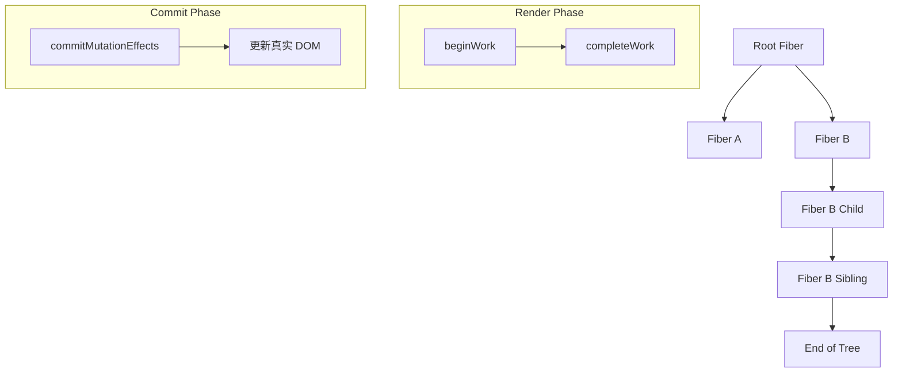

# React Fiber 架构详解

**Fiber 架构** 是 React 从 **16 版本开始引入的全新协调引擎（Reconciler）**，是 React 历史上最重要的底层架构升级之一。它彻底改变了 React 的渲染机制，使得组件树的更新可以**中断、恢复、优先级调度**，从而实现更流畅的用户交互体验。

---

## 一、Fiber 架构概述

| 项目 | 内容 |
|------|------|
| **首次发布版本** | React 16（2017年4月） |
| **主要目标** | 实现异步渲染、并发模式、优先级调度 |
| **核心优势** | 可中断渲染、增量更新、任务优先级管理 |

> ✨ Fiber 并不是一种新的 API 或功能，而是一种**内部机制的重构**，为后续的并发能力（如 React 18 的 `startTransition`）奠定了基础。

---

## 二、为什么需要 Fiber？

在 React 15 及之前的版本中，React 使用的是 **Stack Reconciler（栈式协调器）**，它的渲染过程是**同步且不可中断的**，存在以下问题：

### Stack Reconciler 的缺点：
- 渲染过程一旦开始，必须完成整棵组件树的更新
- 如果组件树很大，可能导致*主线程被长时间占用*，页面卡顿
- 无法区分“紧急”和“非紧急”的更新任务

### Fiber 的改进：
- 支持**可中断/恢复的渲染**
- 允许**分片执行渲染任务**
- 引入**任务优先级系统**
- 更细粒度的错误边界支持
- 为 **Concurrent Mode（并发模式）** 提供基础

---

## 三、Fiber 的核心概念

### 1. Fiber Node

每个 Fiber Node 表示一个组件实例或 DOM 节点，包含以下关键属性：

```js
{
  type: 'div',            // 组件类型或标签名
  key: null,              // 用于列表中的唯一标识
  props: { children: [] }, // 属性对象
  stateNode: DOMElement,  // 对应的真实 DOM 节点
  return: FiberNode,      // 父节点
  child: FiberNode,       // 子节点
  sibling: FiberNode,     // 同级节点
  effectTag: 'Update',    // 更新标记
  ...
}
```

### 2. Fiber Tree

React 将整个组件树转换为一个由 Fiber Node 构成的链表结构（而非递归结构），便于中断与恢复。

### 3. 双缓存机制（Double Buffering）

React 在内存中维护两个 Fiber 树：

| 名称 | 描述 |
|------|------|
| **current tree** | 当前屏幕上显示的树 |
| **work-in-progress tree** | 正在构建的新树，用于计算差异 |

当新树构建完成后，React 会将 current 指向新树，旧树则进入回收池。

### 4. Work Loop（工作循环）

React 使用浏览器的空闲时间 API（如 `requestIdleCallback`）来逐步执行 Fiber Node 的更新任务。

> ⚙️ 工作流程：**beginWork → completeWork → commitWork**

---

## 四、Fiber 的核心特性

| 特性                                   | 描述                             |
| ------------------------------------ | ------------------------------ |
| **可中断渲染（Interruptible Rendering）**   | 渲染过程中可以暂停，让位给高优先级任务（如用户输入）     |
| **增量更新（Incremental Rendering）**      | 渲染拆分为多个小任务逐步执行                 |
| **任务优先级（Priority-based Scheduling）** | 高优先级任务（如点击按钮）先于低优先级任务（如数据加载）执行 |
| **更好的错误边界支持（Error Boundaries）**      | 更精确地捕获组件错误并恢复                  |
| **支持并发模式（Concurrent Mode）**          | React 17+ 中正式启用（实验性）           |
| **优化 Diffing 性能**                    | 更高效的虚拟 DOM 差异比较机制              |

---

## 五、Fiber 如何工作？（简要流程）

```
1. 接收状态变化 → 2. 创建 Fiber 树 → 3. 执行 Work Loop → 4. 收集副作用 → 5. 提交到真实 DOM
```

**详细流程如下：**

1. **创建 Fiber 树**
   - 从根组件开始，生成对应的 Fiber Node
   - 形成一棵完整的 Fiber 树（workInProgress 树）

2. **Work Loop 阶段**
   - 遍历 Fiber 树，执行 `beginWork` 和 `completeWork`
   - 收集所有副作用（如 DOM 更新、生命周期调用等）

3. **提交阶段（Commit Phase）**
   - 将收集的副作用一次性提交到真实 DOM
   - 触发 DOM 更新、生命周期钩子（useEffect 等）

4. **切换 current 树**
   - 完成后，workInProgress 树变为 current 树

---

## 六、Fiber 与 React 新特性的关系

| 特性                                   | 说明                |
| ------------------------------------ | ----------------- |
| **Suspense**                         | 基于 Fiber 的优先级机制实现 |
| **Error Boundaries**                 | 更细粒度控制错误处理        |
| **Portals**                          | 更灵活地操作 DOM 结构     |
| **React 18 的 Concurrent Mode**       | 完全依赖 Fiber 实现异步渲染 |
| **useTransition / useDeferredValue** | 利用 Fiber 的优先级系统实现 |

---

## 七、Fiber 的底层实现原理（技术细节）

### 1. 单链表遍历机制（Linked List Traversal）

- 不再使用传统的递归方式构建组件树
- 每个 Fiber Node 通过 `child`、`sibling`、`return` 构建出一棵链表结构

```js
function performUnitOfWork(unitOfWork) {
  const next = beginWork(unitOfWork);
  if (next === null) {
    next = completeUnitOfWork(unitOfWork);
  }
  return next;
}
```

### 2. Lane 模型（React 18 开始）

- 用于*表示不同优先级*的任务（如用户交互、数据加载）
- 每个任务（fiber节点）都会被打上一个 Lane 标记
- React 会根据 Lane 权重决定任务的执行顺序

### 3. Scheduler（调度器）

- React 自己实现了一个轻量级的调度器（react-scheduler）
- 可以利用浏览器的空闲时间运行任务
- 支持优先级排序、超时中断等高级功能

---

## 八、Fiber 架构的优势总结

| 优势 | 描述 |
|------|------|
| ✅ 更好的响应性 | 主线程不会被长时间阻塞 |
| ✅ 支持并发模式 | React 18 的核心基础 |
| ✅ 任务优先级调度 | 用户交互优先于后台更新 |
| ✅ 错误边界增强 | 更好地控制组件崩溃影响范围 |
| ✅ 更好的性能表现 | 减少不必要的渲染开销 |
| ✅ 更强的扩展能力 | 为未来特性提供底层支持（如 Server Components） |

---

## 九、Fiber 架构 vs Stack Reconciler（对比）

| 对比项 | Stack Reconciler（React ≤ 15） | Fiber Reconciler（React ≥ 16） |
|--------|-------------------------------|-------------------------------|
| 渲染是否可中断 | ❌ 不可中断 | ✅ 可中断 |
| 是否支持并发模式 | ❌ 不支持 | ✅ 支持 |
| 渲染方式 | 递归深度优先 | 链表结构遍历 |
| 错误处理 | ⚠️ 有限 | ✅ 更强大（Error Boundaries） |
| 任务优先级 | ❌ 不支持 | ✅ 支持优先级调度 |
| 是否默认启用 | ❌ 已淘汰 | ✅ 默认启用（React 16+） |

---

## 十、Fiber 架构对开发者的启示

虽然开发者通常不需要直接操作 Fiber，但了解其机制有助于写出更高效的 React 应用：

| 场景 | Fiber 如何帮助你 |
|------|------------------|
| 大型应用性能优化 | Fiber 支持异步渲染，避免页面卡顿 |
| Suspense 使用 | 基于 Fiber 的优先级机制 |
| 错误边界设计 | 更细粒度控制组件崩溃影响 |
| React 18 的并发特性 | 如 `useTransition`、自动批处理 |
| 性能调试 | 了解 React DevTools 中的 Fiber 树结构 |

---

## 十一、Fiber 架构的可视化图解（Mermaid 示例）



---

## 十二、Fiber 架构的发展路线图

| 时间 | 版本 | Fiber 的演进 |
|------|------|---------------|
| 2017 | React 16 | Fiber 架构正式引入 |
| 2020 | React 17 | 过渡版本，稳定 Fiber 架构 |
| 2022 | React 18 | 正式开启并发模式，基于 Fiber 实现 |
| 2025 | React 19（预计） | 支持 Reactive Expressions、更智能的 Fiber 调度 |

---

## 十三、常见问题解答（FAQ）

### Q1：Fiber 是 React 的什么部分？
✅ Fiber 是 React 的 **协调器（Reconciler）**，负责如何高效地更新 UI。

### Q2：Fiber 是不是 React Hooks 的基础？
❌ 不是。Hooks 是独立的功能模块，但它们的执行逻辑也受到 Fiber 的调度影响。

### Q3：我需要手动操作 Fiber 吗？
❌ 一般不需要。Fiber 是 React 的内部机制，开发者无需直接操作。

### Q4：Fiber 和 Virtual DOM 的区别？
✅ Virtual DOM 是描述 UI 的 JavaScript 对象；  
✅ Fiber 是 Virtual DOM 的调度机制，决定什么时候、如何更新 Virtual DOM。

---

## ✅ 十四、总结卡片（Summary Flashcard）

| 项目 | 内容 |
|------|------|
| 引入版本 | React 16 |
| 目标 | 实现异步渲染、并发更新 |
| 核心机制 | 可中断渲染、优先级调度、双缓存机制 |
| 主要优点 | 更好的性能、更强的并发能力 |
| 对应特性 | Error Boundaries、Suspense、useTransition |
| 与 Hooks 的关系 | Hooks 的执行受 Fiber 控制 |
| 是否可见 | 不暴露给开发者，仅内部使用 |
| 是否仍在演进 | 是，React 18 及以后持续优化 |

---

如果你想让我为你生成以下内容，请告诉我：

✅ PDF 版《React Fiber 架构详解》  
✅ Fiber 架构流程图（Mermaid / SVG）  
✅ React 16~19 中 Fiber 的演进分析  
✅ 如何用 DevTools 查看 Fiber 树结构  

是否还想了解：
- React 18 的 Lane 模型是如何工作的？
- Fiber 架构与 Vue 3 的 Proxy + Effect 的区别？
- 如何在实际项目中感知 Fiber 的调度行为？

欢迎继续提问！