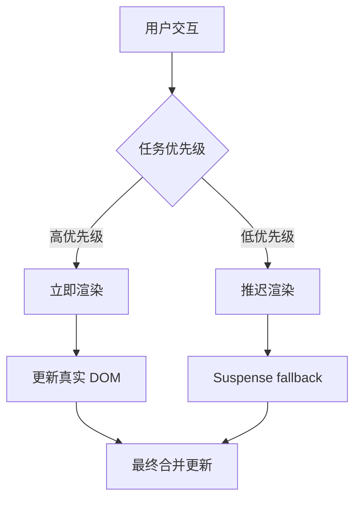

# React 并发模式（Concurrent Mode）详解

**并发模式（Concurrent Mode）** 是 React 的一项重要功能，它从 **React 17 开始引入为实验性功能**，并在 **React 18 正式支持部分特性**。它的目标是让 React 应用在复杂交互中保持响应，通过异步渲染机制实现更流畅的用户体验。

---

## 一、什么是并发模式？

> **并发模式是一种新的渲染方式，允许 React 在执行更新时中断并恢复任务，优先处理用户可见或紧急的更新任务。**

*这类似于操作系统中的“多任务调度”机制*，React 可以将不同优先级的任务分片执行，避免页面卡顿。

---

## 二、并发模式的核心思想

| 核心思想 | 描述 |
|----------|------|
| **可中断渲染（Interruptible Rendering）** | 渲染过程中可以暂停，让位给高优先级任务（如按钮点击） |
| **增量更新（Incremental Rendering）** | 将渲染拆分为多个小任务逐步完成 |
| **优先级调度（Priority-based Scheduling）** | 高优先级任务先于低优先级任务执行 |

---

## 三、为什么需要并发模式？

### 传统同步渲染的问题：
- 渲染过程不可中断，一旦开始必须完成
- 如果组件树非常大，会导致主线程被长时间占用
- 用户操作（如输入、点击）会被延迟响应，造成卡顿感

### 并发模式的解决方案：
- 允许 React 中断当前渲染任务
- 优先处理用户交互等关键路径上的更新
- 提供更细粒度的控制来决定何时提交更新

---

## 四、React 并发模式的关键 API

以下是在 React 18 中可用的并发特性：

| API                | 描述                                         |
| ------------------ | ------------------------------------------ |
| `startTransition`  | 标记一个状态更新为非紧急任务，允许 React 延迟执行               |
| `useTransition`    | Hook 版本的 `startTransition`，提供 pending 状态指示 |
| `useDeferredValue` | 延迟更新某个值，优先渲染高优先级内容                         |
| `Suspense`         | 在等待数据加载时显示 loading 状态（React 16.6 引入）       |
[[startTransition()]]、

**示例：使用 `startTransition`**

```jsx
import { startTransition } from 'react';

function handleChange(newQuery) {
  startTransition(() => {
    setSearchQuery(newQuery);
  });
}
```

> ✅ 这样可以让 React 暂缓这个状态更新，优先处理更重要的任务（如按钮点击反馈）。

---

## 五、并发模式下的工作流程

```
1. 接收状态更新 → 2. 判断优先级 → 3. 执行渲染任务（可中断）→ 4. 提交到真实 DOM
```

**工作阶段说明：**

| 阶段 | 描述 |
|------|------|
| **Render Phase** | 构建虚拟 DOM，执行 beginWork 和 completeWork |
| **Commit Phase** | 提交更新到真实 DOM，触发副作用（如 useEffect） |
| **任务调度** | React 使用 Lane 模型管理任务优先级 |
| **可中断机制** | 如果有更高优先级任务到来，React 可以放弃当前任务 |

---

## 六、并发模式 vs 同步模式对比

| 对比项 | 同步模式（Legacy Mode） | 并发模式（Concurrent Mode） |
|--------|-------------------------|------------------------------|
| 是否可中断渲染 | ❌ 不可中断 | ✅ 可中断 |
| 是否支持异步更新 | ❌ 不支持 | ✅ 支持 |
| 是否支持 useTransition / useDeferredValue | ❌ 不支持 | ✅ 支持 |
| 是否默认启用 | ❌ 默认不启用（需使用 createRoot） | ✅ React 18+ 默认启用 |
| 是否自动批处理更新 | ❌ 部分场景下需要手动优化 | ✅ 默认开启自动批处理 |

---

## 七、如何启用并发模式？

在 React 18 中，并发模式不是开关式的功能，而是通过使用新的根 API 来启用：

```js
// 使用 createRoot API 启用并发能力
import { createRoot } from 'react-dom/client';
const root = createRoot(document.getElementById('root'));
root.render(<App />);
```

> ⚠️ 注意：如果你仍然使用 `ReactDOM.render()`，你处于 Legacy Mode（同步模式）。

---

## 八、并发模式的实际应用场景

| 场景 | 如何利用并发模式优化体验 |
|------|--------------------------|
| 大型表单输入 | 使用 `useDeferredValue` 延迟更新搜索建议 |
| 数据加载与 UI 更新 | 使用 `Suspense` 显示 loading 状态 |
| 动态搜索建议 | 使用 `startTransition` 控制搜索请求优先级 |
| 表格排序/筛选 | 使用并发机制避免 UI 卡顿 |
| 组件懒加载 | 使用 `<Suspense fallback="Loading...">` 实现平滑过渡 |

---

## 九、并发模式下的 Suspense

Suspense 是 React 提供的一种用于等待异步操作的机制，在并发模式中得到了全面加强。

**示例：结合 Suspense 加载数据**

```jsx
function ProfilePage({ userId }) {
  const user = use(fetchUser(userId));
  return <Profile user={user} />;
}

function App() {
  return (
    <Suspense fallback="Loading profile...">
      <ProfilePage userId="123" />
    </Suspense>
  );
}
```

> ✅ 在并发模式中，React 可以在等待数据加载的同时显示 fallback 内容，提升用户体验。

---

## 十、并发模式对开发者的启示

虽然开发者不需要直接操作 Fiber 或 Lane 模型，但了解并发模式有助于写出更高效的 React 应用：

| 场景 | 并发模式的帮助 |
|------|----------------|
| 大型应用性能优化 | 更好的响应性，减少主线程阻塞 |
| 输入框搜索建议 | 使用 `useDeferredValue` 避免频繁 re-render |
| 数据加载与 UI 响应 | 使用 `Suspense` 实现渐进式加载 |
| 用户交互优先级 | 使用 `startTransition` 控制更新顺序 |
| 错误边界改进 | 更细粒度地控制加载失败的影响范围 |

---

## 十一、并发模式的未来演进（React 19）

根据 React 官方路线图和 RFC 讨论，React 19 将进一步增强并发能力：

| 特性 | 描述 |
|------|------|
| **Reactive Expressions** | 类似 Vue 的 watch，简化状态依赖逻辑 |
| **原生支持数据流 Suspense** | 支持在组件中直接等待数据加载 |
| **Server Components 支持并发** | 在服务端也支持并发渲染 |
| **更智能的任务调度器** | 自动识别用户行为优先级，动态调整渲染策略 |

---

## 十二、常见问题解答（FAQ）

### Q1：并发模式是否强制启用？
❌ 不是。React 18 中你可以选择使用 `createRoot` 启用并发特性，也可以继续使用旧版 `ReactDOM.render()`。

### Q2：并发模式会影响我现有的项目吗？
⚠️ 大多数现有代码可以正常运行，但某些对 `useEffect` 依赖项敏感的逻辑可能需要调整。

### Q3：useEffect 和并发模式的关系？
✅ `useEffect` 仍按预期运行，但在并发模式中，React 可能会多次调用 effect（如中间状态被丢弃）。

### Q4：并发模式和 Server Components 有什么关系？
✅ React Server Components（RSC）正是基于并发模式构建的，两者紧密结合。

---

## 十三、总结卡片（Summary Flashcard）

| 项目 | 内容 |
|------|------|
| 引入版本 | React 17（实验性），React 18 正式支持 |
| 核心目标 | 实现异步渲染、提高响应速度 |
| 关键 API | `startTransition`, `useDeferredValue`, `useTransition`, `Suspense` |
| 是否默认启用 | ✅ React 18+ 默认启用（需使用 `createRoot`） |
| 是否影响现有项目 | ⚠️ 一般不影响，但部分 useEffect 逻辑需注意 |
| 主要优势 | 更流畅的 UI、更好的错误处理、更高的响应性 |
| 下一步发展 | React 19 中将进一步集成 Reactive Expressions、原生数据流 Suspense |

---

## 十四、可视化流程图（Mermaid 示例）



---

如果你想让我为你生成以下内容，请告诉我：

✅ PDF 版《React 并发模式详解》  
✅ 并发模式流程图（Mermaid / SVG）  
✅ React 18 中使用并发模式的最佳实践  
✅ 并发模式与 Vue 的响应式系统对比分析  

是否还想了解：
- React 19 的 Reactive Expressions 是什么？
- 并发模式下如何调试任务优先级？
- 如何判断我的项目是否已启用并发模式？

欢迎继续提问！