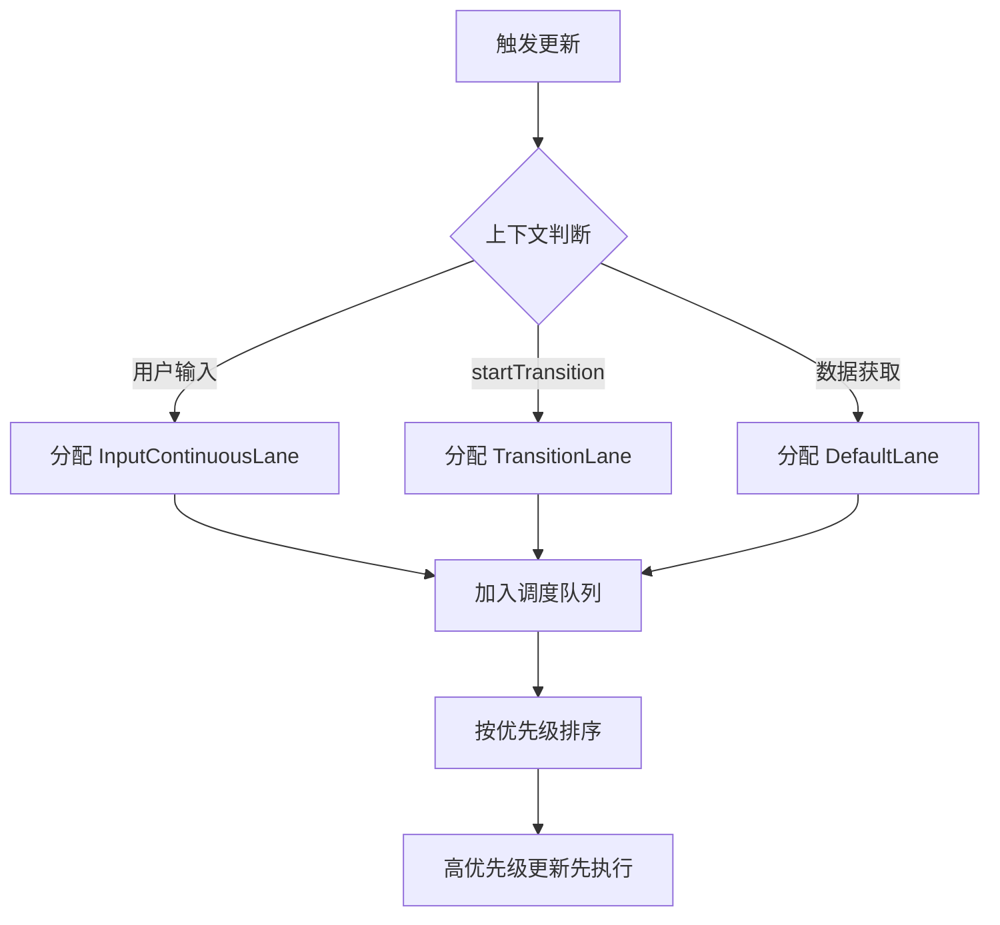

# React 中的 Lane 模型详解

在 React 18 的并发渲染架构中，**Lane 模型**取代了旧版的 Expiration Time 模型，成为 React 调度系统的核心。Lane 模型使用`位掩码（bitmask）` **表示更新优先级**，解决了旧模型在批处理、优先级冲突等问题，是实现并发模式（Concurrent Mode）的关键基础设施。

---

## 一、为什么需要 Lane 模型？

### 旧版 Expiration Time 模型的局限
- **优先级表示**：用时间戳（毫秒）表示优先级
- **核心问题**：
  1. **无法区分批次**：相同优先级的多个更新无法区分是否属于同一批处理
  2. **优先级冲突**：高优先级更新会意外提升低优先级更新的优先级
  3. **批处理粒度粗**：无法精确控制哪些更新应该合并
  4. **Suspense 重试机制弱**：重试更新缺乏专用优先级通道

### Lane 模型的优势
- **位掩码表示**：32 位整数，每位代表一个独立优先级通道
- **核心改进**：
  1. **精确批处理**：同一批次的更新共享相同 Lane
  2. **优先级隔离**：不同来源的更新使用不同 Lane，互不干扰
  3. **细粒度控制**：16+ 种优先级级别，覆盖各种交互场景
  4. **专用通道**：为 Suspense 重试、过渡更新等提供独立通道

---

## 二、Lane 的本质与数据结构

### 1. 位掩码表示法
```js
// 32 位整数，从低位到高位分配不同优先级
// 示例：二进制表示 (简化版)
0b00000000000000000000000000000001  // SyncLane (最高优先级)
0b00000000000000000000000000000010  // InputContinuousLane
0b00000000000000000000000000000100  // DefaultLane
...
0b00010000000000000000000000000000  // IdleLane (最低优先级)
```

### 2. 核心数据结构
```ts
type Lane = number;          // 单个 lane (例如: 1 << 0)
type Lanes = number;         // 多个 lane 的集合 (例如: (1 << 0) | (1 << 1))
type LaneMap<T> = Array<T>;  // 31 位的数组 (索引 0 未使用)
```

### 3. 位运算操作
```js
// 合并 lanes
const mergedLanes = laneA | laneB;

// 检查是否包含某个 lane
const hasLane = (lanes & targetLane) !== 0;

// 移除某个 lane
const newLanes = lanes & ~targetLane;

// 获取最高优先级 lane (最低位的 1)
const highestLane = lanes & -lanes;
```

---

## 三、React 18 中的 Lane 类型（优先级层级）

React 18 定义了 **16 种优先级**，分布在 32 位整数的不同位置（从高到低）：

| 优先级名称 (变量名)         | 位位置 | 延迟上限 | 典型场景                                      | 说明                                                                 |
|-----------------------------|--------|----------|-----------------------------------------------|----------------------------------------------------------------------|
| **`SyncLane`**              | 1      | 0ms      | `ReactDOM.render` 初始渲染、错误边界          | 立即执行，阻塞渲染，最高优先级                                       |
| **`InputContinuousLane`**   | 2      | 50ms     | 拖拽、滚动、输入框输入                        | 响应用户持续交互，高优先级                                           |
| **`DefaultLane`**           | 3      | 150ms    | 数据获取、`useEffect` 触发的更新              | 默认优先级，中等响应要求                                             |
| **`TransitionLanes`**       | 4-19   | 300ms+   | `startTransition` 中的更新                    | 16 个独立通道，用于过渡更新（如搜索建议、路由切换）                  |
| **`RetryLanes`**            | 20-23  | -        | Suspense 重试                                 | 4 个专用通道，用于组件挂起后重试                                     |
| **`SelectiveHydrationLane`**| 24     | -        | 服务端渲染 (SSR)                              | 逐步激活 SSR 内容                                                    |
| **`IdleLane`**              | 25     | 无上限   | 后台任务（预取数据、日志上报）                | 空闲时间执行，最低优先级                                             |
| **`OffscreenLane`**         | 26     | -        | 离屏渲染 (实验性)                             | 隐藏组件树的渲染                                                     |

> **关键细节**：
> - 位位置从 1 开始计数（最低位是 1）
> - 实际代码通过左移生成：`SyncLane = 1 << 0` (即 1)
> - `TransitionLanes` 有 16 个独立通道，避免不同过渡更新互相阻塞
> - `RetryLanes` 有 4 个通道，防止 Suspense 无限重试

---

## 四、Lane 模型的核心应用场景

### 1. **更新调度（核心流程）**


### 2. **批处理优化**
- **自动批处理**（React 18+）：
  ```js
  // 同一事件回调中的多个更新 → 共享同一个 Lane
  button.addEventListener('click', () => {
    setCount(c => c + 1); // 分配 InputContinuousLane
    setName('new');      // 同样分配 InputContinuousLane
    // 两个更新合并为一次渲染
  });
  ```
  
- **手动批处理**：
  ```jsx
  startTransition(() => {
    setSearchQuery(input); // 分配 TransitionLane
    setFilters(newFilters); // 同样分配 TransitionLane
    // 两个更新共享同一批次，不会阻塞 UI
  });
  ```

### 3. **优先级中断与恢复**
```js
// 伪代码：渲染过程中检查更高优先级更新
function workLoop() {
  while (workInProgress !== null) {
    // 检查是否有更高优先级更新到达
    if (getCurrentUpdateLanes() > renderLanes) {
      // 1. 保存当前渲染进度
      saveWorkInProgress();
      
      // 2. 中断当前渲染
      yieldControlToMain();
      
      // 3. 优先处理高优先级更新
      processHighPriorityUpdates();
      
      // 4. 恢复低优先级渲染
      restoreWorkInProgress();
    }
    performUnitOfWork(workInProgress);
  }
}
```

### 4. **Suspense 重试机制**
- 组件挂起（Suspend）时：
  1. 分配一个 `RetryLane`（从 4 个专用通道中选择）
  2. 设置超时时间（可配置）
  3. 显示 fallback UI
- 重试时：
  - 使用**相同**的 `RetryLane`，避免无限重试循环
  - 高优先级更新到来时，暂停重试

### 5. **Fiber 树中的 Lane 属性**
- **`pendingLanes`** (FiberRoot)：  
  根节点上所有待处理更新的优先级集合
- **`lanes`** (Fiber 节点)：  
  当前 Fiber 节点自身更新的优先级
- **`childLanes`** (Fiber 节点)：  
  **子树**中所有更新的优先级集合（用于快速跳过无更新的子树）
  
```js
// 跳过无更新子树的优化
function beginWork(current, workInProgress, renderLanes) {
  if ((workInProgress.childLanes & renderLanes) === NoLanes) {
    // 子树无当前优先级的更新 → 直接克隆子树
    cloneChildFibers(current, workInProgress);
    return null;
  }
  // 否则正常协调子树
}
```

---

## 五、关键函数与算法

### 1. 优先级选择算法
```js
// 从 pendingLanes 中选择要处理的优先级
function getNextLanes(root, wipLanes) {
  // 1. 获取所有待处理 lanes
  const pendingLanes = root.pendingLanes;
  
  // 2. 过滤掉非空闲的 lanes (除非没有其他任务)
  const nonIdlePendingLanes = pendingLanes & ~IdleLane;
  
  // 3. 优先处理同步任务
  if (nonIdlePendingLanes & SyncLane) {
    return SyncLane;
  }
  
  // 4. 获取最高优先级的 lane (最低位的 1)
  return getHighestPriorityLane(nonIdlePendingLanes);
}
```

### 2. Lane 合并与拆分
```js
// 合并多个更新
const update1 = { lane: InputContinuousLane };
const update2 = { lane: DefaultLane };
const mergedLanes = update1.lane | update2.lane; // 0b110

// 拆分处理
function processLanes(lanes) {
  while (lanes !== 0) {
    // 获取最高优先级 lane
    const lane = lanes & -lanes;
    
    // 处理该优先级的更新
    processLane(lane);
    
    // 移除已处理 lane
    lanes &= ~lane;
  }
}
```

### 3. Lane 与 Fiber 树协调
```js
// 双缓冲树切换时更新 lanes
function commitRoot(root) {
  // 1. 提交后更新 root 的 lanes
  root.current = finishedWork;
  
  // 2. 清除已提交的 lanes
  root.pendingLanes &= ~finishedLanes;
  
  // 3. 将未提交的低优先级更新保留在队列中
  root.suspendedLanes = ...;
}
```

---

## 六、开发者如何利用 Lane 模型

虽然 Lane 是内部机制，但可通过以下 API 间接控制优先级：

### 1. **`startTransition` (低优先级更新)**
```jsx
import { useState, startTransition } from 'react';

function SearchBox() {
  const [inputValue, setInputValue] = useState('');
  const [searchResults, setSearchResults] = useState([]);

  const handleChange = (e) => {
    const value = e.target.value;
    setInputValue(value); // 高优先级 (SyncLane)
    
    startTransition(() => {
      // 低优先级 (TransitionLane)
      const results = fetchResults(value);
      setSearchResults(results);
    });
  };
}
```
- **效果**：输入框立即响应，搜索结果在后台加载

### 2. **`useDeferredValue` (延迟值)**
```jsx
const deferredValue = useDeferredValue(value, { timeoutMs: 3000 });

// 使用场景
function ProductList({ products }) {
  const [filterText, setFilterText] = useState('');
  // 当 filterText 变化时，deferredFilterText 会延迟更新
  const deferredFilterText = useDeferredValue(filterText, { timeoutMs: 2000 });
  
  // 优先渲染输入框，过滤操作在后台进行
  const filteredProducts = useMemo(() => 
    products.filter(p => p.name.includes(deferredFilterText)),
    [products, deferredFilterText]
  );
}
```

### 3. **Suspense 与数据获取**
```jsx
<Suspense fallback={<Spinner />}>
  <ProfileDetails id={userId} />
</Suspense>

// ProfileDetails 内部
function ProfileDetails({ id }) {
  const user = use(fetchUser(id)); // 触发 Suspense
  return <h1>{user.name}</h1>;
}
```
- **优先级**：首次挂起使用 `DefaultLane`，重试使用 `RetryLane`

---

## 七、调试与性能分析

### 1. React DevTools 调试
- **Components 面板** → 点击 Fiber 节点 → 查看 `lanes` 和 `childLanes`
- **启用调试模式**：
  ```js
  // 在控制台执行
  window.__REACT_DEVTOOLS_GLOBAL_HOOK__.$r._debugNeedsRemount = true;
  ```

### 2. 性能分析技巧
```js
// 在 commit 阶段记录 lane 信息
function commitRoot(root) {
  const committedLanes = root.finishedLanes;
  console.log('Committed lanes:', getLaneLabels(committedLanes));
  
  // 原始提交逻辑
  ...
}

// 将 lane 位掩码转换为可读标签
function getLaneLabels(lanes) {
  const labels = [];
  if (lanes & SyncLane) labels.push('Sync');
  if (lanes & InputContinuousLane) labels.push('InputContinuous');
  if (lanes & DefaultLane) labels.push('Default');
  // ... 其他 lanes
  return labels;
}
```

### 3. 常见性能问题诊断
- **问题**：过渡更新阻塞 UI  
  **诊断**：检查是否意外使用了 `SyncLane` 而非 `TransitionLane`
  
- **问题**：Suspense 无限重试  
  **诊断**：检查 `RetryLanes` 是否被高优先级更新持续打断

- **问题**：不必要的渲染  
  **诊断**：检查 `childLanes` 是否包含不需要的优先级

---

## 八、Lane 模型 vs Expiration Time 模型对比

| 特性                | Expiration Time (旧)                     | Lane 模型 (新)                          |
|---------------------|------------------------------------------|-----------------------------------------|
| **表示方式**        | 时间戳（毫秒）                           | 32 位位掩码                             |
| **优先级粒度**      | 5 级（粗粒度）                           | 16+ 级（细粒度）                        |
| **批处理支持**      | 相同优先级合并                           | 精确批次控制（同批共享 lane）           |
| **优先级冲突**      | 高优先级会提升低优先级                   | 优先级隔离（不同来源独立通道）          |
| **Suspense 重试**   | 随机延迟重试                             | 专用 RetryLane 通道                     |
| **过渡更新**        | 无专用机制                               | 16 个 TransitionLane 通道               |
| **离屏渲染**        | 不支持                                   | 专用 OffscreenLane                      |
| **并发能力**        | 基础支持                                 | 完整支持（可中断、恢复、跳过）          |

---

## 九、设计哲学与未来展望

### 1. 核心设计原则
- **用户响应优先**：  
  交互事件始终获得最高优先级（`InputContinuousLane`）
- **渐进式加载**：  
  通过 `TransitionLane` 实现内容逐步加载，避免白屏
- **资源感知**：  
  根据设备性能动态调整优先级阈值（实验性）

### 2. 未来演进方向
- **自适应优先级**：  
  根据用户行为动态调整优先级（如检测到用户等待时提升优先级）
- **跨应用协调**：  
  与浏览器调度 API（`scheduler.postTask`）深度集成
- **离屏渲染优化**：  
  `OffscreenLane` 与 `<Offscreen>` 组件结合，实现真正的后台渲染

---

## 十、总结：Lane 模型的核心价值

1. **精确的优先级控制**  
   16+ 种优先级覆盖从用户输入到后台任务的所有场景
   
2. **无缝的并发体验**  
   高优先级更新安全打断低优先级渲染，界面始终保持响应
   
3. **智能的批处理机制**  
   同一事件中的更新自动合并，跨事件更新保持隔离
   
4. **Suspense 深度集成**  
   专用重试通道确保数据加载不影响交互响应
   
5. **面向未来的架构**  
   为离屏渲染、选择性水合等高级特性奠定基础

> **重要提醒**：Lane 是 React 内部实现细节，**应用代码不应直接操作 Lane 位掩码**。应通过 React 提供的并发 API（`startTransition`, `useDeferredValue`, `<Suspense>`）间接控制优先级。理解 Lane 模型有助于诊断性能问题，但日常开发应聚焦于组件和 Hooks API。