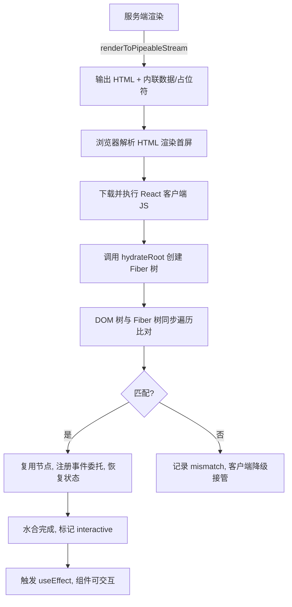

>我想系统学习React水合(Hydration)机制的核心原理、完整执行流程及相关技术细节。具体包括：水合机制的定义与作用、与服务端渲染(SSR)的关系、关键实现原理、从虚拟DOM到真实DOM的转换过程、客户端与服务端数据匹配机制、常见问题及解决方案。要求能够理解水合过程中的性能优化策略、错误处理机制以及React不同版本中水合机制的演进变化。
>trae


# React 水合(Hydration)机制完全指南

我已经完成了对React水合机制的深入分析。以下是一个系统化的学习指南：

---

## 📚 一、水合机制核心概念

### 1.1 水合的定义与作用

**水合(Hydration)** 是指在客户端将服务端渲染(SSR)生成的HTML与React组件树进行"绑定"的过程，使静态HTML变为可交互的React应用。

**核心作用**：
- 将服务端渲染的DOM节点"复用"为React Fiber节点
- 避免重新创建DOM元素，提高首屏加载性能
- 保持服务端渲染内容与客户端渲染内容的一致性

### 1.2 水合的数据结构

**关键全局状态**（定义在 [ReactFiberHydrationContext.js](file:///Users/ll/Desktop/资料/编程/仓库/react/react/packages/react-reconciler/src/ReactFiberHydrationContext.js#L80-L92)）：

```javascript
let hydrationParentFiber: null | Fiber = null;      // 当前水合的父Fiber
let nextHydratableInstance: null | HydratableInstance = null;  // 下一个可水合的DOM节点
let isHydrating: boolean = false;                 // 是否处于水合状态
let hydrationErrors: Array<CapturedValue<mixed>> | null = null;  // 水合错误
```

**Suspense/Activity的脱水状态**（定义在 [ReactFiberSuspenseComponent.js](file:///Users/ll/Desktop/资料/编程/仓库/react/react/packages/react-reconciler/src/ReactFiberSuspenseComponent.js)）：

```javascript
type SuspenseState = {
  dehydrated: SuspenseInstance,    // 脱水状态的Suspense节点
  treeContext: TreeContext | null, // 树上下文（用于恢复）
  retryLane: Lane,               // 重试优先级
  hydrationErrors: null | Array<CapturedValue<mixed>>,  // 水合错误
};
```

---

## 🔄 二、水合执行完整流程

### 2.1 水合初始化入口

**hydrateRoot API**（定义在 [ReactDOMRoot.js](file:///Users/ll/Desktop/资料/编程/仓库/react/react/packages/react-dom/src/client/ReactDOMRoot.js#L274-L358)）：

```javascript
export function hydrateRoot(
  container: Document | Element,
  initialChildren: ReactNodeList,
  options?: HydrateRootOptions,
): RootType {
  // 调用createHydrationContainer创建水合容器
  const root = createHydrationContainer(
    initialChildren,
    null,
    container,
    ConcurrentRoot,
    hydrationCallbacks,
    // ... 其他配置
  );
  return new ReactDOMHydrationRoot(root);
}
```

**createHydrationContainer**（定义在 [ReactFiberReconciler.js](file:///Users/ll/Desktop/资料/编程/仓库/react/react/packages/react-reconciler/src/ReactFiberReconciler.js#L282-L351)）：

```javascript
export function createHydrationContainer(
  initialChildren,
  callback,
  containerInfo,
  tag,
  // ...
): OpaqueRoot {
  const hydrate = true;
  const root = createFiberRoot(
    containerInfo,
    tag,
    hydrate,           // 标记为水合模式
    initialChildren,
    // ...
  );
  
  // 为root fiber设置初始更新
  const current = root.current;
  let lane = requestUpdateLane(current);
  lane = getBumpedLaneForHydrationByLane(lane);
  const update = createUpdate(lane);
  enqueueUpdate(current, update, lane);
  scheduleInitialHydrationOnRoot(root, lane);
  
  return root;
}
```

### 2.2 水合的三阶段流程

```
┌─────────────────────────────────────────────────────────────────────┐
│                    HYDRATION PHASES (水合三阶段)                      │
├─────────────────────────────────────────────────────────────────────┤
│                                                                     │
│  PHASE 1: RENDER PHASE (水合渲染阶段)                               │
│  ├── enterHydrationState() - 进入水合状态                          │
│  ├── beginWork() - 执行组件render                                  │
│  ├── tryToClaimNextHydratableInstance() - 尝试匹配DOM节点         │
│  └── reconcileChildFibers() - 协调子节点                            │
│                                                                     │
├─────────────────────────────────────────────────────────────────────┤
│                                                                     │
│  PHASE 2: COMMIT PHASE (水合提交阶段)                              │
│  ├── commitHydrationRoot() - 提交水合根节点                        │
│  ├── commitBeforeMutationEffects() - 提交前副作用                  │
│  ├── commitMutationEffects() - 提交DOM变更                         │
│  └── commitLayoutEffects() - 提交布局副作用                        │
│                                                                     │
├─────────────────────────────────────────────────────────────────────┤
│                                                                     │
│  PHASE 3: ACTIVE PHASE (活跃阶段)                                  │
│  └── 组件完全激活，可响应用户交互                                   │
│                                                                     │
└─────────────────────────────────────────────────────────────────────┘
```

---

## 🔍 三、虚拟DOM到真实DOM的匹配机制

### 3.1 核心匹配函数

**tryHydrateInstance**（定义在 [ReactFiberHydrationContext.js](file:///Users/ll/Desktop/资料/编程/仓库/react/react/packages/react-reconciler/src/ReactFiberHydrationContext.js#L248-L284)）：

```javascript
function tryHydrateInstance(
  fiber: Fiber,
  nextInstance: any,
  hostContext: HostContext,
) {
  // 1. 检查实例是否可水合（类型匹配）
  const instance = canHydrateInstance(
    nextInstance,
    fiber.type,
    fiber.pendingProps,
    rootOrSingletonContext,
  );
  
  if (instance !== null) {
    // 2. 建立Fiber与DOM实例的关联
    fiber.stateNode = (instance: Instance);
    
    // 3. DEV环境下检查props差异
    if (__DEV__ && !didSuspendOrErrorDEV) {
      const differences = diffHydratedPropsForDevWarnings(...);
      if (differences !== null) {
        // 记录差异
      }
    }
    
    // 4. 设置水合上下文
    hydrationParentFiber = fiber;
    nextHydratableInstance = getFirstHydratableChild(instance);
    rootOrSingletonContext = false;
    return true;
  }
  return false;
}
```

**canHydrateInstance**（定义在 [ReactFiberConfigDOM.js](file:///Users/ll/Desktop/资料/编程/仓库/react/react/packages/react-dom-bindings/src/client/ReactFiberConfigDOM.js#L3764-L3850)）：

```javascript
export function canHydrateInstance(
  instance: HydratableInstance,
  type: string,
  props: Props,
  rootOrSingletonContext: boolean,
): null | Instance {
  // 1. 检查节点类型是否有效
  if (instance.nodeType !== ELEMENT_NODE) {
    return null;
  }
  
  // 2. 检查标签类型是否匹配
  const element: Element = (instance: any);
  if (type !== element.tagName.toLowerCase()) {
    return null;
  }
  
  // 3. 检查是否可以水合（如忽略某些属性不匹配）
  if (!shouldHydrateInstance(element, props)) {
    return null;
  }
  
  return element;
}
```

### 3.2 文本节点水合

**tryHydrateText**（定义在 [ReactFiberHydrationContext.js](file:///Users/ll/Desktop/资料/编程/仓库/react/react/packages/react-reconciler/src/ReactFiberHydrationContext.js#L286-L302)）：

```javascript
function tryHydrateText(fiber: Fiber, nextInstance: any) {
  const text = fiber.pendingProps;  // 客户端期望的文本
  const textInstance = canHydrateTextInstance(
    nextInstance,
    text,
    rootOrSingletonContext,
  );
  
  if (textInstance !== null) {
    fiber.stateNode = (textInstance: TextInstance);
    hydrationParentFiber = fiber;
    nextHydratableInstance = null;  // 文本节点没有子节点
    return true;
  }
  return false;
}
```

### 3.3 Suspense边界水合

**tryHydrateSuspense**（定义在 [ReactFiberHydrationContext.js](file:///Users/ll/Desktop/资料/编程/仓库/react/react/packages/react-reconciler/src/ReactFiberHydrationContext.js#L337-L368)）：

```javascript
function tryHydrateSuspense(
  fiber: Fiber,
  nextInstance: any,
): null | SuspenseInstance {
  const suspenseInstance = canHydrateSuspenseInstance(
    nextInstance,
    rootOrSingletonContext,
  );
  
  if (suspenseInstance !== null) {
    // 1. 创建脱水状态
    const suspenseState: SuspenseState = {
      dehydrated: suspenseInstance,
      treeContext: getSuspendedTreeContext(),
      retryLane: OffscreenLane,
      hydrationErrors: null,
    };
    fiber.memoizedState = suspenseState;
    
    // 2. 创建脱水Fragment作为子Fiber
    const dehydratedFragment = createFiberFromDehydratedFragment(suspenseInstance);
    dehydratedFragment.return = fiber;
    fiber.child = dehydratedFragment;
    
    // 3. 设置水合上下文
    hydrationParentFiber = fiber;
    nextHydratableInstance = null;  // 首次不进入Suspense内部
  }
  return suspenseInstance;
}
```

---

## ⚠️ 四、水合不匹配与错误处理

### 4.1 水合不匹配检测

**throwOnHydrationMismatch**（定义在 [ReactFiberHydrationContext.js](file:///Users/ll/Desktop/资料/编程/仓库/react/react/packages/react-reconciler/src/ReactFiberHydrationContext.js#L375-L403)）：

```javascript
function throwOnHydrationMismatch(fiber: Fiber, fromText: boolean = false) {
  const error = new Error(
    `Hydration failed because the server rendered ${
      fromText ? 'text' : 'HTML'
    } didn't match the client. As a result this tree will be ` +
    `regenerated on the client. This can happen if a SSR-ed Client ` +
    `Component used:
  - A server/client branch \`if (typeof window !== 'undefined')\`.
  - Variable input such as \`Date.now()\` or \`Math.random()\`.
  - Date formatting in a user's locale which doesn't match the server.
  - External changing data without sending a snapshot.
  - Invalid HTML tag nesting.`
  );
  queueHydrationError(createCapturedValueAtFiber(error, fiber));
  throw HydrationMismatchException;
}
```

### 4.2 水合差异报告

**HydrationDiffNode**（定义在 [ReactFiberHydrationDiffs.js](file:///Users/ll/Desktop/资料/编程/仓库/react/react/packages/react-reconciler/src/ReactFiberHydrationDiffs.js#L35-L44)）：

```javascript
export type HydrationDiffNode = {
  fiber: Fiber,
  children: Array<HydrationDiffNode>,
  serverProps: void | null | $ReadOnly<{[propName: string]: mixed}> | string,
  serverTail: Array<...>,  // 服务端多余的节点
  distanceFromLeaf: number,  // 距叶节点距离
};
```

### 4.3 错误恢复机制

**upgradeHydrationErrorsToRecoverable**（定义在 [ReactFiberHydrationContext.js](file:///Users/ll/Desktop/资料/编程/仓库/react/react/packages/react-reconciler/src/ReactFiberHydrationContext.js#L875-L887)）：

```javascript
export function upgradeHydrationErrorsToRecoverable(): Array<CapturedValue<mixed>> | null {
  const queuedErrors = hydrationErrors;
  if (queuedErrors !== null) {
    // 将错误标记为可恢复的
    queueRecoverableErrors(queuedErrors);
    hydrationErrors = null;
  }
  return queuedErrors;
}
```

---

## 🚀 五、性能优化策略

### 5.1 选择性水合(Selective Hydration)

React支持在Suspense边界处进行**选择性水合**，允许优先水合用户交互的部分：

```javascript
// 首次点击时只水合被点击的Suspense边界
function handleClick() {
  // 触发特定区域的水合
}
```

### 5.2 hydrateInstance优化

**hydrateInstance**（定义在 [ReactFiberConfigDOM.js](file:///Users/ll/Desktop/资料/编程/仓库/react/react/packages/react-dom-bindings/src/client/ReactFiberConfigDOM.js#L4257-L4298)）：

```javascript
export function hydrateInstance(
  instance: Instance,
  type: string,
  props: Props,
  hostContext: HostContext,
  internalInstanceHandle: Fiber,
): boolean {
  // 1. 差异检测
  const diff = diffHydratedProperties(instance, type, props, hostContext);
  
  // 2. 如果有差异，应用补丁
  if (diff !== null) {
    // 更新DOM属性
    return false;  // 标记为需要客户端重新渲染
  }
  
  return true;  // 成功水合
}
```

### 5.3 批量水合

React会批量处理水合更新，避免频繁的DOM操作：

```javascript
// 在commit阶段批量应用水合变更
batchedUpdates(() => {
  commitHydrationRoot(root);
});
```

---

## 📋 六、关键文件索引

| 功能模块 | 文件路径 | 核心函数/概念 |
|---------|---------|--------------|
| **水合入口** | `ReactDOMRoot.js` | `hydrateRoot()`, `createRoot()` |
| **水合上下文** | `ReactFiberHydrationContext.js` | `enterHydrationState()`, `tryToClaimNextHydratableInstance()` |
| **水合配置** | `ReactFiberConfigDOM.js` | `canHydrateInstance()`, `hydrateInstance()`, `hydrateTextInstance()` |
| **水合差异** | `ReactFiberHydrationDiffs.js` | `HydrationDiffNode`, `describeDiff()` |
| **脱水状态** | `ReactFiberSuspenseComponent.js` | `SuspenseState`, `dehydrated` |
| **Shell水合** | `ReactFiberShellHydration.js` | `isRootDehydrated()` |
| **WorkLoop水合** | `ReactFiberWorkLoop.js` | `scheduleInitialHydrationOnRoot()` |

---

## 🔄 七、React版本演进

### React 16 → 17: 改进的水合
- 改进了Suspense的水合支持
- 优化了hydration mismatch错误消息

### React 17 → 18: 并发水合
- **选择性水合(Selective Hydration)** - 用户交互触发的区域优先水合
- **Streaming SSR with Suspense** - 支持流式服务端渲染
- 改进了Suspense边界的水合恢复机制

### React 18+: Suspense完善
- **Activity组件** - 用于隐藏/显示内容的替代Suspense
- 更完善的水合差异报告
- 支持`onHydrated`和`onDeleted`回调

---

## 💡 八、最佳实践建议

### 1. 避免水合不匹配
```jsx
// ❌ 错误：服务端和客户端行为不同
const Component = () => {
  const [time, setTime] = useState(Date.now());
  return <div>{time}</div>;
};

// ✅ 正确：使用consistent data
const Component = ({ timestamp }) => {
  return <div>{timestamp}</div>;
};
```

### 2. 使用suppressHydrationWarning
```jsx
// 对于第三方动态内容
<div suppressHydrationWarning>{content}</div>
```

### 3. 合理使用Suspense边界
```jsx
// 按需水合
<Suspense fallback={<Loading />}>
  <BigComponent />
</Suspense>
```

---

这份指南涵盖了React水合机制的完整原理、执行流程和最佳实践。如需深入了解某个特定部分，欢迎继续提问！


# React 水合（Hydration）机制系统指南

>我想系统学习React水合(Hydration)机制的核心原理、完整执行流程及相关技术细节
>qwen


水合是 React SSR/SSG 架构中的核心环节。理解它不仅能解决开发中的诡异 Bug，更是掌握 React 并发渲染、流式 SSR 与 Server Components 的前提。以下内容按**原理 → 流程 → 细节 → 演进 → 实践 → 学习路径**展开，适合系统性进阶。

---
## 一、核心概念与定位
| 概念 | 说明 |
|:---|:---|
| **什么是水合** | 客户端 React 将服务端输出的静态 HTML **“附着”** 到已有 DOM 上，绑定事件监听器、初始化内部状态，使其从“纯展示”变为“可交互”的过程 |
| **与 Client Rendering 的区别** | 客户端渲染：React 从零创建 DOM<br>水合：React **复用**已有 DOM，仅做校验+事件挂载+状态恢复 |
| **核心价值** | 首屏可见快（FCP/LCP 优）+ SEO 友好 + 降级可用 + 平滑过渡到 SPA |

> 💡 比喻：服务端交付了“骨架与皮肤”，水合是注入“神经与肌肉”。

---
## 二、底层工作原理
### 1. 复用而非重建
React 水合**不会清空或重建 DOM**。它会：
- 从容器根节点开始，同步遍历服务端 HTML 的 DOM 树
- 与客户端 Fiber 虚拟树逐节点比对（结构、标签、关键属性）
- 匹配成功则复用该节点，仅附加事件委托与内部标记

### 2. 事件委托模型（React 17+）
- 不再为每个元素绑定独立事件
- 在根容器（或 `document`）挂载单一事件监听器
- 事件触发时，通过 `event.target` + Fiber 树向上冒泡定位对应组件
- 水合期间，事件已注册但处于“等待状态”，水合完成后才激活交互

### 3. 状态与上下文恢复
- 服务端渲染的 `props`、`context` 通过内联 `<script>` 或全局变量注入
- 客户端读取后直接注入 Fiber 节点，跳过 `useState` 初始值计算
- `useEffect` **在水合完成后才首次执行**（确保 DOM 已稳定）

---
## 三、完整执行流程（Step-by-Step）


### 关键阶段拆解
| 阶段 | 行为 | 技术细节 |
|:---|:---|:---|
| **1. 服务端输出** | 生成带 `data-reactroot` 或 `<!--$-->`/`<!--/$-->` 标记的 HTML | React 18 流式使用 Suspense 边界插入注释节点，支持分块传输 |
| **2. 客户端启动** | `hydrateRoot(container, <App />, { onRecoverableError })` | 替代旧版 `ReactDOM.hydrate`，支持并发与错误边界 |
| **3. 同步遍历** | DFS 遍历 DOM 与 Fiber，比对 `tagName`、`key`、`className`、`style` 等 | 跳过 `children` 内容比对（服务端已渲染），仅校验结构一致性 |
| **4. 事件注册** | 在根节点绑定 `click`、`input` 等原生事件 | 通过 `EventPluginHub` 路由到对应 Fiber 节点 |
| **5. 状态恢复** | 读取服务端注入的 `initialProps`，跳过 `useState` 初始化 | 若客户端 `useState` 初始值不同，以服务端为准 |
| **6. 完成标记** | 设置 `hydrationCompleted = true` | 触发 `useEffect`、`useLayoutEffect`，解除交互阻塞 |

---
## 四、React 18/19 关键演进
| 版本 | 水合机制变化 | 影响 |
|:---|:---|:---|
| **React 16/17** | 同步阻塞式水合，必须 100% 匹配， mismatch 会直接警告并客户端覆盖 | 水合期间页面完全不可交互，长列表/复杂组件 TTI 差 |
| **React 18** | ✅ 并发水合（Concurrent Hydration）<br>✅ 流式 SSR + 分块水合<br>✅ 选择性水合（Selective Hydration） | 水合不阻塞主线程；优先水合可视区/高优组件；支持 `<Suspense>` 懒水合 |
| **React 19** | ✅ RSC 架构下水合仅限 Client Component<br>✅ `use()` / `useActionState` 减少状态依赖<br>✅ 更宽松的 mismatch 处理策略 | 水合范围大幅缩小；服务端组件无需水合；交互延迟进一步降低 |

> 🔍 **Selective Hydration 原理**：React 根据组件在视口位置、事件绑定密度、优先级标记，动态调整水合顺序。例如：按钮优先水合，底部 Footer 延后。

---
## 五、Hydration Mismatch 深度解析
### 1. 常见触发场景
| 场景 | 示例 | 原因 |
|:---|:---|:---|
| **非确定性渲染** | `Date.now()`、`Math.random()`、`window.innerWidth` | 服务端与客户端计算结果不同 |
| **客户端专属 API** | `localStorage`、`navigator`、第三方 SDK 初始化 | 服务端无浏览器环境 |
| **条件渲染不一致** | `if (typeof window !== 'undefined')` 放在 render 中 | SSR 与 CSR 走不同分支 |
| **动态内容未对齐** | 服务端数据 vs 客户端 API 实时数据 | 数据源不同步 |

### 2. React 的处理策略
- **开发环境**：控制台打印 `Hydration failed` 警告，高亮不匹配节点
- **生产环境**：
  - 轻微差异：保留服务端 HTML，静默跳过
  - 结构差异：客户端重新渲染该子树（可能引起布局抖动）
  - 严重错误：触发 `onRecoverableError` 或 Error Boundary

### 3. 正确修复姿势
```jsx
// ❌ 错误：render 阶段访问客户端环境
function Clock() {
  const time = new Date().toLocaleTimeString(); // 服务端 vs 客户端可能不同
  return <div>{time}</div>;
}

// ✅ 正确：useEffect 延迟客户端逻辑
function Clock() {
  const [time, setTime] = useState('');
  useEffect(() => {
    const timer = setInterval(() => setTime(new Date().toLocaleTimeString()), 1000);
    return () => clearInterval(timer);
  }, []);
  return <div>{time}</div>;
}

// ⚠️ 临时方案（不推荐滥用）
<div suppressHydrationWarning={true}>{dynamicContent}</div>
```

---
## 六、性能优化与最佳实践
| 目标 | 策略 |
|:---|:---|
| **降低水合耗时** | 按需拆分 Client Component；使用 `React.lazy` + `<Suspense>`；避免首屏水合大型图表/编辑器 |
| **避免 TTI 阻塞** | 启用 React 18 流式 SSR；使用 `hydrateRoot` 替代 `hydrate`；对非交互区域使用 `dangerouslySetInnerHTML` + 手动事件委托 |
| **减少 Mismatch** | 保持 render 纯函数；环境差异逻辑移至 `useEffect`；服务端与客户端使用相同数据源快照 |
| **调试与监控** | 使用 `performance.mark('react-hydrate-start')` 打点；Lighthouse 测 TTI/INP；React DevTools 开启 `Highlight updates` |

> 📌 **注意**：`suppressHydrationWarning` 仅应作为最后手段，滥用会掩盖真实架构问题。

---
## 七、系统学习路线与调试指南
### 📘 推荐学习路径
1. **基础**：SSR 原理 → `renderToString` vs `renderToPipeableStream` → `hydrateRoot` API
2. **进阶**：Fiber 树结构 → 事件委托机制 → Concurrent Hydration 调度逻辑
3. **现代架构**：RSC 模型 → Client/Server 边界 → `useOptimistic`/`useActionState` 如何减少水合依赖
4. **实战**：搭建 Next.js/Remix 项目 → 故意制造 mismatch → 修复并测量 TTI 变化

### 🛠 调试工具箱
| 工具 | 用途 |
|:---|:---|
| **React DevTools** | `Components` 面板查看组件是否已水合；`Profiler` 记录水合耗时 |
| **Chrome Performance** | 过滤 `React` 任务，查看 `hydrate`、`commit` 阶段耗时 |
| **Console 警告** | `Hydration failed because...` 定位 mismatch 节点与原因 |
| **Next.js `onRecoverableError`** | 生产环境捕获水合错误并上报监控 |

### 🧪 动手实验建议
```bash
# 1. 创建基础 SSR 项目
npx create-next-app@latest --experimental-app

# 2. 故意制造 mismatch
// app/page.tsx
export default function Page() {
  return <div>{Math.random() > 0.5 ? 'A' : 'B'}</div>; // 服务端/客户端结果可能不同
}

# 3. 观察控制台警告 → 修复 → 对比 Lighthouse TTI
```

---
## 附录：核心 API 对照表
| 旧版 (React 16/17) | 现代 (React 18+) | 说明 |
|:---|:---|:---|
| `ReactDOM.hydrate()` | `hydrateRoot()` | 支持并发、错误恢复、流式集成 |
| `renderToString()` | `renderToPipeableStream()` / `renderToReadableStream()` | 流式输出，支持 `<Suspense>` 分块 |
| 全局事件绑定 | 根容器事件委托 | 减少内存，支持并发调度 |
| 同步阻塞水合 | 选择性/并发水合 | TTI 优化，优先交互区域 |

---
💡 **总结**：水合不是“渲染”，而是“附着+校验+激活”。掌握它，你就能看懂 React 如何平衡首屏性能与交互体验，也能在 RSC 时代精准控制哪些代码需要水合、哪些可以跳过。如需针对某个子主题（如流式 SSR 分块逻辑、Selective Hydration 调度算法、RSC 下水合边界设计）展开源码级剖析，可告知具体方向。